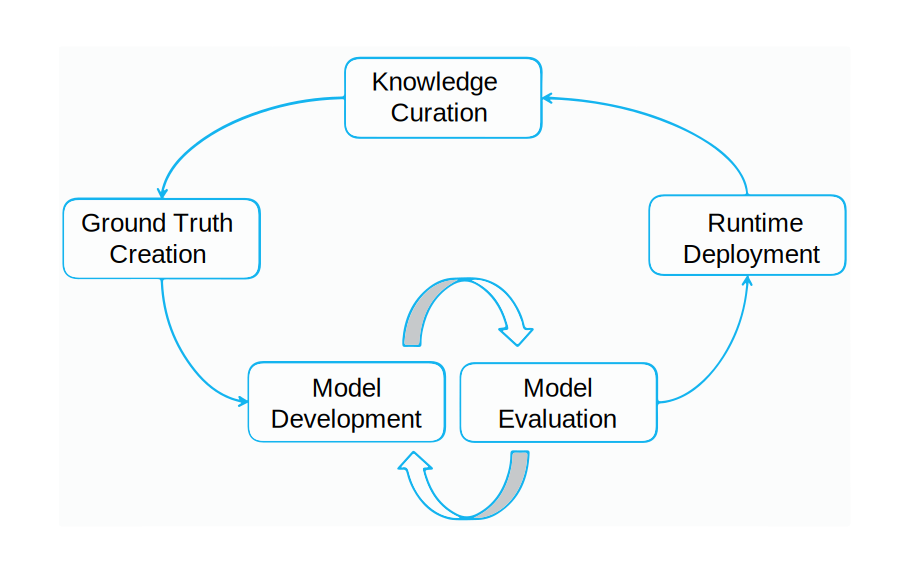

---

copyright:
  years: 2015, 2022
lastupdated: "2022-03-14"

subcollection: watson-knowledge-studio

---

{:shortdesc: .shortdesc}
{:external: target="_blank" .external}
{:deprecated: .deprecated}
{:important: .important}
{:note: .note}
{:tip: .tip}
{:preview: .preview}
{:beta: .beta}
{:pre: .pre}
{:codeblock: .codeblock}
{:screen: .screen}

This documentation is for {{site.data.keyword.knowledgestudiofull}} on {{site.data.keyword.cloud}}. To see the documentation for the previous version of {{site.data.keyword.knowledgestudioshort}} on {{site.data.keyword.IBM_notm}} Marketplace, [click this link](/docs/knowledge-studio/annotate-documents.html).
{: tip}

# Annotation setup
{: #annotate-documents}

Users who have knowledge of the industry and its language must annotate the documents.
{: shortdesc}

Perform the following tasks to enable human annotators to access the workspace:

- Invite subject matter experts to the {{site.data.keyword.knowledgestudioshort}} instance that you are using.
- Associate human annotators with the annotation set or sets that you want them to annotate.
- Create a task that assigns the human annotator to annotate the documents in the set.

    It is not until you explicitly assign tasks to human annotators that they can see your workspace when they log in to {{site.data.keyword.knowledgestudioshort}}.
    {: important}

Your users (the human annotators) will need to become familiar with [Annotating documents](/docs/watson-knowledge-studio?topic=watson-knowledge-studio-user-guide), which contains detailed information about how to annotate documents.

## Model life cycle
{: #wks_lifecycle}

The model that you create with {{site.data.keyword.knowledgestudioshort}} is a software component that can be plugged into a natural language processing (NLP) pipeline.

With {{site.data.keyword.knowledgestudioshort}}, you can create, evaluate, and improve models for new domains. A model adds annotations (metadata) to text that appears in natural language content. The annotations, which identify mentions of entities of interest in your domain content, the relationships between them, and how the mentions co-reference the same entity, can be used by applications to automatically analyze and process text. Application users benefit from this level of analysis by being able to extract meaning, discover insights, and obtain answers in a natural language context.

The creation of a model is an iterative multiple-step process that involves several stages: knowledge curation, ground truth generation, model development, model evaluation, and runtime deployment.

### End-to-end domain adaptation
{: #wks_lifecycle__wks_lifecycleS6}

The following diagram summarizes the interactions between these five stages of model development and the typical activities that occur at each stage.

 Figure 2. A summary of the five stages of model development and the activities that occur at each stage.

### Knowledge curation
{: #wks_lifecycle__wks_lifecycleS1}

This stage, which is external to {{site.data.keyword.knowledgestudioshort}}, refers to the process of selecting, collecting, preserving, and maintaining content relevant to a specific domain. Curation adds value to data; it transforms data into trusted information and knowledge.

### Ground truth generation
{: #wks_lifecycle__wks_lifecycleS2}

This stage refers to the use of {{site.data.keyword.knowledgestudioshort}} tools and best practices to produce a collection of vetted data that can be used to adapt a {{site.data.keyword.watson}} solution to a particular domain. The accuracy of this vetted data, called *ground truth* or *gold standard documents*, is critical because inaccuracies in the ground truth will correlate to inaccuracies in the applications that rely on it.

An essential part of teaching {{site.data.keyword.watson}} about a new domain involves providing it with knowledge about entities of interest in your domain content, the relationships between them, and how the entities co-reference each other. Collecting this knowledge includes the following activities:

- Involving domain subject matter experts to create the following resources, or to identify existing resources that can be re-used or modified for your domain:

  - Annotation guidelines and examples to help human annotators learn how words and passages in your domain content are to be annotated.
  - Type systems that define the domain-specific types (objects) and features (data classifications) that can be discovered in your domain content through text analysis. The type system controls the types of annotations that a human annotator can add to documents.
  - Dictionaries of terms that are to be treated as equivalent terms in your domain content.

- Creating a corpus of documents that are representative of your domain content.
- Pre-annotating documents based on the dictionaries that you add to a {{site.data.keyword.knowledgestudioshort}} workspace. After you create a machine learning model, you can use the model to pre-annotate new documents that you add to the corpus. Pre-annotation is a process of machine-annotating a document to the extent possible before a machine learning model is available to do so. Pre-annotation can reduce human-annotation labor by replacing some human annotation creation with mere verification of the correctness of machine annotation.
- Dividing documents among human annotators, who then use the {{site.data.keyword.knowledgestudiofull}} ground truth editor tool to manually add annotations to small sets of documents.
- Comparing the human annotation results and resolving conflicts. Adjudication in this phase is needed to ensure accurate and consistently annotated documents are promoted to ground truth, where they can be used to train and test a machine learning model.

### Model development
{: #wks_lifecycle__wks_lifecycleS3}

This stage refers to the use of {{site.data.keyword.knowledgestudioshort}} tools to create a model. After establishing ground truth, the human annotation results can be used to train an algorithm for automatically adding annotations to large collections of documents, such as collections that include millions of documents.

### Model evaluation
{: #wks_lifecycle__wks_lifecycleS4}

This stage refers to the use of {{site.data.keyword.knowledgestudioshort}} tools to refine the model and improve performance. The results generated by the model are evaluated against a test set of ground truth documents. *Accuracy analysis* identifies the causes of annotation errors. *Headroom analysis* helps you assess which errors require focus and where model refinements can yield the greatest impact. Adjustments can be made repeatedly to improve performance until a satisfactory level of accuracy is achieved.

### Model deployment
{: #wks_lifecycle__wks_lifecycleS5}

This stage refers to exporting components that enable the model to run in machine learning runtime environments and makl
ing the model accessible to other {{site.data.keyword.watson}} cognitive applications. For example, you can deploy the machine learning model for use by {{site.data.keyword.nlufull}} service or {{site.data.keyword.discoveryfull}} service, or export the model for use in {{site.data.keyword.ibmwatson_notm}} Explorer.

## Creating an annotation task
{: #wks_hatask}

Before human annotators can begin adding annotations to documents, the annotation process manager must create an annotation task.

Admins and project managers can annotate ground truth document sets directly. See [Annotating document sets directly](/docs/watson-knowledge-studio?topic=watson-knowledge-studio-annotating-document-sets-directly).
{: note}

### About this task
{: #wks_hatask_about}

The annotation task specifies which documents are to be annotated. To compare how well the human annotators perform, and to see how consistently they apply the annotation guidelines, you must include at least two human annotators in the task. In addition, some percentage of documents must occur in all of the annotation sets that you add to the task (you specify the overlap percentage when you create the annotation sets).

#### Important
{: #wks_hatask_important}

- An annotation task is a temporal concept that exists to allow human annotators to annotate text in isolated spaces. It also ensures that only approved annotations are promoted to ground truth.
- An annotation set can be included in one active task at a time. To add an annotation set in one task to a different task, you must first delete the task where the annotation set is active.
- If you delete a human annotator's user account, it affects their annotations too. Any annotations in documents that were assigned to that user but were not promoted to ground truth are deleted.
- If the type system or ground truth editor settings change after you create a human annotation task, you must decide whether to propagate the changes to the task. Type system changes can affect annotations; human annotators might need to review and update their documents.
- If the dictionaries change, the changes are not reflected in the current annotation task. To apply resource changes to ground truth, you must create a new annotation task.
- You can have up to 256 annotation tasks per workspace.

### Procedure
{: #wks_hatask_procedure}

To create an annotation task:

1. Log in as a {{site.data.keyword.knowledgestudioshort}} administrator, and select your workspace.
1. Select the **Machine Learning Model** > **Annotations** page, then click the **Annotation Tasks** tab.
1. Click **Add Task**.
1. Specify a descriptive task name and select the date that the task must be completed.
1. If no annotation sets are available, click **Create Annotation Sets**.

    1. For the base set, select the document set or annotation set that you want to divide into annotation sets.

    1. For the overlap value, specify the percentage of documents that you want to include in each annotation set. Inter-annotator agreement scores cannot be calculated unless two or more human annotators annotate the same documents. For example, if you specify a 20% overlap value for a corpus that contains 30 documents, and you divide the corpus into 3 document sets, 6 documents (20%) will be annotated by all human annotators. The remaining 24 documents will be divided among the 3 human annotators (8 each). Thus, each annotator receives 14 documents to annotate (6+8).

    An annotation set that you plan to use to train a machine learning model must contain at least 10 annotated documents.
    {: tip}

    1. Select a user name from the list of human annotators.
    1. Name the annotation set.

        As a good practice for evaluating a human annotator's work as the workspace progresses, you might want to create annotation set names that identify the human annotator assigned to the set. You cannot change the annotation set name after the set is created.

        The maximum size of the annotation set name is 256 characters.
        {: tip}

    1. Click **Generate**.

1. A list of available annotation sets is displayed under **Available Sets**, along with the names of the human annotators assigned to them. To add available sets to your annotation task, click **Add to task**.
1. Make sure that all of the annotation sets that you want to include in the task appear under **Selected Sets**, then click **Save** to create the task.

### What to do next
{: #wks_hatask_next}

After the task is created, you can return to the **Annotation Tasks** tab on the **Machine Learning Model** > **Annotations** page to view the progress of each human annotator. Also, you can complete the following tasks:

- Check approved documents that overlap between annotation sets to resolve annotation conflicts.
- Open a task to add annotation sets to it. Ensure that the annotation sets that you add include documents that overlap with documents in the original annotation sets.

From the **Settings** tab of the main navigation, you can specify the following information:

- Specify preferences for using colors and keyboard shortcuts in the ground truth editor.
- Specify an inter-annotator agreement threshold, and then open a task to see how consistently multiple human annotators annotated the same documents.
- Specify a URL to connect your annotation guidelines to the ground truth editor.

## Configuring ground truth editor preferences
{: #wks_hapref}

An project manager can specify preferences for using colors and keyboard shortcuts in the ground truth editor.

### Procedure
{: #wks_hapref_procedure}

To specify visual preferences for working with the ground truth editor :

1. Log in as a {{site.data.keyword.knowledgestudioshort}} administrator, and select your workspace.
1. From the navigation on the left, select the **Settings** > **Document Annotation Settings**.
1. Select the **Entity Types** or **Relation Types** tab.
1. Select the entity type or relation type that you want to change and then click **Edit keyboard shortcuts and colors**. For each type, you can define a:

    - Keyboard shortcut, which means a user can enter `<key>` to apply the type label to highlighted text. For example, if you define `o` as the keyboard shortcut for `ORGANIZATION`, then a user can select text, and then press the `o` key to apply the `ORGANIZATION` entity type to the highlighted text. If you assign an upper case letter, then the user must press `Shift+<key>`.
    - Text color. Ensure that the text color contrasts with the background color so the text will be visible after it is labeled.
    - Background color. This is the color of the label that is applied to the entity after you annotate it.

    When annotating documents, human annotators can use the keyboard shortcuts to quickly add annotations. And the annotation label and text colors help human annotators to instantly recognize types after they add annotations to a document.
    - If there are entity or relation types that you do not want human annotators to assign to mentions, you can hide them from the ground truth editor, which shortens and simplifies the list of type options that users see. To do so, deselect the **Active** check box for the type.

    As you assign new shortcuts and colors, you can preview the changes.

1. You can also change the default selection highlight color. The highlight color is the color of the border that is displayed around text after human annotators select it. The default color is a light blue, but you can change the color on the **Selection Highlight** tab to make it easier to identify the boundaries of the text that is selected.

#### Related tasks
{: #wks_hapref_related}

[Modifying a type system without losing human annotations](/docs/watson-knowledge-studio?topic=watson-knowledge-studio-improve-ml#wks_projtypesysmod)

## Setting the IAA threshold
{: #wks_haiaathresh}

To help you decide whether to accept or reject an annotated document set, you can specify an inter-annotator agreement threshold. The threshold helps you compare how well or poorly inter-annotator agreement compares to the IAA score calculated by the system.

### About this task
{: #wks_haiaathresh_about}

To compare how different human annotators annotated the same documents, specify an evaluation threshold. If the annotations made by one human annotator differ from the annotations made by another human annotator to the point where the difference results in a low score, it means that the annotators do not agree. The disagreement needs to be investigated and resolved.

### Procedure
{: #wks_haiaathresh_procedure}

To set the inter-annotator agreement threshold:

1. Log in as a {{site.data.keyword.knowledgestudioshort}} administrator, and select your workspace.
1. Select the **Settings** > **IAA Settings** tab.
1. Specify a value between 0 and 1, such as `.5` or `.8`, and then click **Save**.

## Connecting to annotation guidelines
{: #wks_haguidelines}

After you create annotation guidelines for your project, you can configure {{site.data.keyword.knowledgestudioshort}} to connect to them. For help with choosing the correct annotation to apply, human annotators can review the guidelines while annotating documents. Administrators can also review the guidelines if they need assistance while resolving annotation conflicts in overlapping documents.

### Procedure
{: #wks_haguidelines_procedure}

To connect the ground truth editor and adjudication tool to your annotation guidelines:

1. Log in as a {{site.data.keyword.knowledgestudioshort}} administrator, and select your workspace.
1. select the **Settings** > **Annotation Guidelines** tab.
1. Specify the URL to where your guidelines are hosted.
1. Click **Save**. The system connects the ground truth editor and adjudication tool to your annotation guidelines. Depending on the access permissions granted to users when you created the guidelines, human annotators and workspace administrators might be able to update the guidelines after opening them, for example, to add clarifications and examples.

### Annotation guidelines
{: #wks_guidelines}

There is no prescribed format for how to document the guidelines, but it is important that the guidelines include detailed examples. Human annotators need to understand which entity type to apply to a mention given the context, and know which relation types are valid for a given pair of mentions. Examples drawn from your domain content are often the best way to convey the correct annotation choices to make.

Annotation guidelines are not static. As your project evolves, you'll likely discover instances of mentions and relationships that are not accurately captured in the guidelines. And you'll likely discover inconsistencies between multiple human annotators who interpret the guidelines in different ways. By updating the guidelines as situations arise, you can help improve the accuracy and consistency of annotations over time.

Before documents can be considered ground truth, any conflicts between how different human annotators annotated the same documents must be resolved. A key way to resolve the conflicts is by discussing what caused the confusion, thus helping human annotators learn from their mistakes. Improving and clarifying the guidelines can help reduce the number of conflicts and help ensure that accurately and consistently annotated documents are promoted to ground truth.

To help you manage the guidelines, you might want to divide what could become a long document into multiple parts, such as guidelines for annotating entities, guidelines for annotating relations, and guidelines for annotating the ways that mentions can be coreferenced. Changes that you make in one area must be evaluated and coordinated with changes that you make in another area. For example, if you add an entity type, review the guidelines for annotating relation types and specify how the new entity type can relate to other entity types.

### Annotation guidelines example
{: #wks_guidelinesexample}

Most annotation guidelines will need a lot of detail and examples to ensure that human annotators consistently annotate text.

The example presented here is a simple guideline that was created for a small domain that contains traffic incident reports.

#### Task Goals
{: #wks_guidelinesexample__annotgoals}

- As project members, become familiar with the iterative process of manual annotation and machine learning model refinement.
- Annotate documents in the automotive domain with the ground truth editor and use the annotations to train a machine learning model. Annotate the entity types, relation types, and coreference the entities as needed.

#### Guideline Notations
{: #wks_guidelinesexample__annotnotation}

- Square brackets [ ] indicate the extent to be annotated when less than the entire quoted text is annotated.

    Include negations as appropriate, for example `[no injuries]ACCIDENT_OUTCOME`. The type system is not using entity class to represent negation.

#### Entity Types
{: #wks_guidelinesexample__annottype}

The type system does not use entity sub-types or roles, nor mention types or classes.

| **Entity types** | **Guidelines** | **Examples** |
| --- | --- | --- |
| ACCIDENT_OUTCOME | A consequence of an accident. Applies to both humans (e.g., death) and cars (e.g., dented). Can include "towed" and "air bag deployment" as indicators of severity of damage, and "transported to hospital" (but not funeral home) as indicators of severity of injury. Can include negation. | "[casualty]", "[injury]", "sustained [total loss]", "[no injuries]", "[towed] due to [disabling damage]", [not towed], "air bag did [not deploy]" (air bag itself has to be PART_OF_CAR, related by sufferedFrom to this ACCIDENT_OUTCOME), and indications of severity. |
| CONDITION | Weather or road conditions; an aspect of the scene that could affect likelihood of accident and could change from day to day but is not about the car or driver.  Can be driver error or mechanical failure, and must appear to be problematic. Should exclude STRUCTURE. | "dry", "rainy", "construction", "heavy traffic", "daylight", but not "grassy" or "intoxicated".  "flat tire", "overcorrected" (as in steering), "asleep", "intoxicated", "[failed to negotiate]CONDITION a [curve]STRUCTURE", "[departed] the lane" or shoulder, but not "attempting to pass" unless this phrase is accompanied by "without enough room" or something similar, nor "departing the road", which is an INCIDENT. |
| INCIDENT | An actual mention of a collision, or a car motion that is unambiguously inappropriate and likely destructive, such as going off-road, or some other damaging incident, like a car fire.  Do not co-reference non-identical motions to each other, such as "impacted", "pushed rearward" and "came to final rest", even if they are closely associated.  Exclude STRUCTURE from the extent; for example, "[came to rest]INCIDENT in a [ditch]STRUCTURE" or "[remaining in contact]INCIDENT with the [guardrail]STRUCTURE". |
| MANUFACTURER | The company that makes the vehicle | Toyota, Mazda, General Motors |
| MODEL | The specific kind of car, made by a specific manufacturer. Exclude any extra terms / trim line indicators like "LX", or "SE" (e.g., only annotate "Xterra" for the phrase "Xterra SE"). | Camry |
| MODEL_YEAR | The model year that is part of the name of the car. | '99, 2001 |
| PART_OF_CAR | A part of a vehicle, either inside or outside of it, regardless of whether specifically involved in the incident. Exclude listings of capabilities of such parts. Include indications of where in the car the part is, or something which just refers to a portion of a car without being a specific part.  Can be plural. Can include specification of position in the vehicle, such as "[driver airbag]", "[RF door]" (meaning right-front), "[RR] passenger", "[LF and RF air bags]", "[first row passive/automatic restraints]", "[safety system] with EDR capabilities".  Include towed boats, tanks, etc., except semi-trailers, which have a distinct year/model/manufacturer. | Cross-section, front plane, tire, steering wheel, airbag, etc. |
| PERSON | Any person described in an accident scene in a report (could be a driver or a passenger/occupant of a vehicle, pedestrian, or witness).  Don't annotate adjectives, so don't annotate "a [69-year-old] drove", but do annotate "a 69-year-old [male] drove". Can be plural, for example, "LR and RF [occupants]". Excludes people who arrive after incident.  >In the absence of an "animal" entity type, use PERSON to tag wildlife involved in / causing collisions, as their ability to move makes them more like a PERSON than a STRUCTURE.  **Note**: "passenger airbag" is a PART_OF_CAR; it does not imply that a person is present. |
| STRUCTURE | A structure that is on, near, or part of a road. Include specific road adjectives likely to be relevant to the configuration of an accident; omit other adjectives. | [two-lane, two-way road], [left lane], eastbound [lane], 2-foot [ditch], [right lane line], [exit ramp], [pole], [tree], steep descending [embankment] |
| VEHICLE | Any reference to vehicle other than MODEL, MANUFACTURER, and MODEL_YEAR. Can be plural, in which case coreference is very unlikely and no part-of-group relation. | "the [truck]", "the [car]", "[V1]'s" |

#### Relation Types
{: #wks_guidelinesexample__annotreltype}

The type system uses relation types, but not relation classes or other attributes of relations. Negation is not encoded by a relation class, but rather by the extents of the mentions, for example, [no occupants]PERSON were [hospitalized]ACCIDENT_OUTCOME with the two mentions linked by the relation type sufferedFrom.

| Possible entity types for the first mention | Relation type | Possible etity types for the second mention |
| --- | --- | --- |
| VEHICLE, MODEL, MANUFACTURER 2 | hasProperty | MANUFACTURER, MODEL, MODEL_YEAR |
| PERSON | occupantOf | VEHICLE, MODEL, MANUFACTURER, MODEL_YEAR 1, PART_OF_CAR, STRUCTURE |
| PERSON, PART_OF_CAR, STRUCTURE, VEHICLE, MODEL, MANUFACTURER, MODEL_YEAR 1 | sufferedFrom | ACCIDENT_OUTCOME |
| VEHICLE | driveUnder | CONDITION, ACCIDENT_CAUSE |
| PART_OF_CAR | locatedOn | VEHICLE, MODEL, MANUFACTURER, MODEL_YEAR 1 |
| ACCIDENT_OUTCOME | outcomeOf | INCIDENT |
| INCIDENT | causedBy | CONDITION, ACCIDENT_CAUSE **(reminder: requires textual evidence of the causality)** |
| INCIDENT | impactPoint | The PERSON, PART_OF_CAR, STRUCTURE, VEHICLE, MANUFACTURER, MODEL, or MODEL_YEAR 1  that is hit or involved in the accident.  impactPoint for STRUCTURE does not include mere specifying the location of an impact that does not involve that STRUCTURE, so it does not apply to two vehicles colliding in an [intersection]STRUCTURE, but does apply to a vehicle striking an [embankment]STRUCTURE. |

#### Table notes
{: #table_notes}

1.  The notation VEHICLE/MODEL/MANUFACTURER/MODEL_YEAR refers to a mention of a vehicle. The last three are respectively for cases in which the text says something like "the Accord", "the Honda", or, probably rarely, "the '99". The four entity types are in priority order, so in "the driver of the '99 Honda Accord", the relation would be driver (as PERSON) occupantOf Accord (as MODEL), in which case Accord would have the hasProperty relation with both Honda and '99.
1.  MODEL and MANUFACTURER can only be the first argument of hasProperty, only when they appear as nouns (references to a vehicle). MODEL can have the relation hasProperty to MANUFACTURER and MODEL_YEAR, as in "the '99 Honda Accord drove". MANUFACTURER can only have the hasProperty relation to MODEL_YEAR, as in "the '99 Honda drove".
