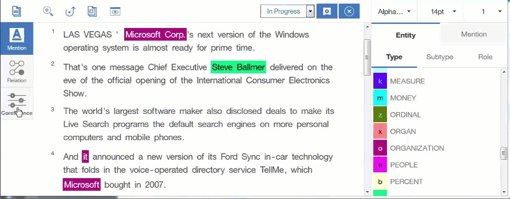

---

copyright:
  years: 2015, 2017
lastupdated: "2017-12-11"

---

{:shortdesc: .shortdesc}
{:new_window: target="_blank"}
{:tip: .tip}
{:pre: .pre}
{:codeblock: .codeblock}
{:screen: .screen}
{:javascript: .ph data-hd-programlang='javascript'}
{:java: .ph data-hd-programlang='java'}
{:python: .ph data-hd-programlang='python'}
{:swift: .ph data-hd-programlang='swift'}

This documentation is for {{site.data.keyword.knowledgestudiofull}} on {{site.data.keyword.cloud}}. To see the documentation for the previous version of {{site.data.keyword.knowledgestudioshort}} on {{site.data.keyword.IBM_notm}} Marketplace, [click this link ](https://console.bluemix.net/docs/services/knowledge-studio/coref-gif.html){: new_window}.
{: tip}

# How to create a coreference chain
{: #coref-gif}

Click each mention in the document that refers to the same entity. You must double-click the last mention to create the chain.
{: shortdesc}

The chain is added to the Coreference Chains list in the sidebar, and is assigned a number. Within the document, the coreference chain number is displayed in subscript with each mention that belongs to that chain.

## Related tasks

[Annotating mentions as coreferences](/docs/services/watson-knowledge-studio/user-guide.html#wks_hacoref)
