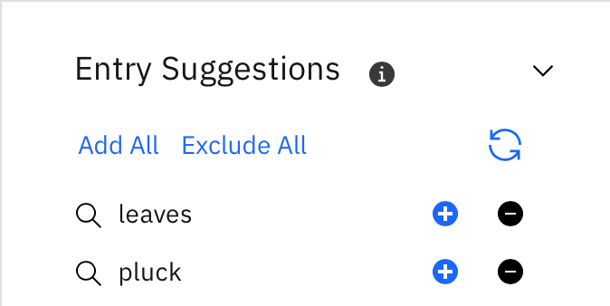

---

copyright:
  years: 2015, 2025
lastupdated: "2025-05-12"

subcollection: watson-knowledge-studio

---

{:shortdesc: .shortdesc}
{:external: target="_blank" .external}
{:deprecated: .deprecated}
{:important: .important}
{:note: .note}
{:tip: .tip}
{:preview: .preview}
{:beta: .beta}
{:pre: .pre}
{:codeblock: .codeblock}
{:screen: .screen}

This documentation is for {{site.data.keyword.knowledgestudiofull}} on {{site.data.keyword.cloud}}. To see the documentation for the previous version of {{site.data.keyword.knowledgestudioshort}} on {{site.data.keyword.IBM_notm}} Marketplace, [click this link](/docs/knowledge-studio?topic=knowledge-studio-dictionaries).
{: tip}

# Creating dictionaries
{: #dictionaries}

Dictionaries help the {{site.data.keyword.knowledgestudioshort}} machine learning models to understand the language of the domain.
{: shortdesc}

## Dictionaries
{: #wks_dictionaries}

In machine learning, a dictionary groups together words and phrases that share something in common. An entry in the dictionary does not mean that all words in the entry mean the same thing, but that the words are to be treated equivalently by a model.

A dictionary is a list of words or phrases that are equivalent for information-extraction purposes, meaning that they are interchangeable for the purposes of identifying entity and relation mentions.

Consider this example: a dictionary entry contains the seven days of the week. To annotate a document, a human annotator assigns the entity type `DAY_OF_WEEK` to mentions of *Monday* and *Friday* in the text. Because the dictionary equates the seven days of the week, it helps ensure that a machine learning model correctly annotates occurrences of *Tuesday*, *Wednesday*, and the other days of the week in unseen documents at run time. In addition, equating these words also benefits information extraction in surrounding text. What the machine learning model learns from training examples about the texts near *Monday* and *Friday* gets applied to texts that the machine learning model sees near other days of the week because the dictionary states that these terms are equivalent for information-extraction purposes.

You do not need to create a dictionary that contains days of the week information. Several general-purpose dictionaries like this are built in to the application. Other built-in dictionaries include countries, place names, number words, animals, plants, diseases, measurement words (such as *ounce* and *meter*), and salutation title words (such as *Mr.* and *Mrs.*). You cannot disable or edit built-in dictionaries.
{: tip}

Avoid adding entries that have multiple meanings. For example, in a domain about auto racing, it makes sense to include the term *bank*, which refers to a road feature, only if financial institutions are not frequently discussed in the text also. If both senses of the word occur often in the source documents, then it is best to leave it out of both types of dictionaries: the dictionary that is associated with road features, and the dictionary that is associated with financial institutions.

You can create dictionaries in {{site.data.keyword.knowledgestudioshort}} by manually adding individual entries. {{site.data.keyword.knowledgestudioshort}} also supports the ability to upload several types of dictionary files.

### How are dictionaries used?
{: #di-du}

Dictionaries are used in a couple ways, all optional. They are used by the machine learning model to provide words or phrases that are equivalent for information-extraction purposes and during pre-annotation to bootstrap the annotation effort.

- **Machine learning usage**

    The entity type that you associate with a dictionary is not used to define rules for the machine learning model. Machine learning evaluates mentions in the documents independently. It does not assume that a mention has a specific entity type just because the mention matches an entry in a dictionary that is associated with that entity type. It does take the information into account, but treats it as one piece of information among other pieces of information that it gathers through linguistic analysis. In fact, if none of the terms in a dictionary occur in the ground truth documents, then the dictionary is not used at all by the machine learning model.

- **Pre-annotation usage**

    Dictionaries are important to the following pre-annotatation processes.

    - Dictionary pre-annotator: You associate a dictionary with an entity type from the type system when you run the dictionary pre-annotator.
    - Rule-based model: You can optionally associate a dictionary with a rule class. Classes are then mapped to entity types from the type system when you run the rule-based model to pre-annotate documents. As a result, dictionary terms are, although circuitously, mapped to entity types for the rule-based model also.

    In both cases, the dictionaries provide terms that the system can find and annotate as mentions. It assigns to each mention the entity type that is associated with the dictionary that contains the term. When a human annotator begins work on new documents that were pre-annotated, many mentions are already annotated based on the dictionary entries. The human annotator thus has more time to focus on assigning entity types to mentions that require deeper analysis.

### Language considerations
{: #di-lc}

- For Brazilian Portuguese, English, French, German, Italian, and Spanish, {{site.data.keyword.knowledgestudioshort}} does not currently provide an option to specify case-insensitive dictionary-matching, but dictionary entries match text that has a higher case. For example, *vehicle* in the dictionary matches *vehicle*, *Vehicle* or *VEHICLE* in text, while *Sat* in the dictionary matches *Sat* or *SAT* in text, but not *sat*.
- For Japanese and Korean, dictionary matching during pre-annotation is case-sensitive.
- For Arabic, {{site.data.keyword.knowledgestudioshort}} assumes that Arabic text is stored unshaped and treats numeric shaping as a storage-level property. For details about how {{site.data.keyword.knowledgestudioshort}} handles Arabic character shaping and numeric shaping, see [Configuring support for Arabic](/docs/watson-knowledge-studio?topic=watson-knowledge-studio-wks_langsupp_ar).

### CSV file dictionary
{: #wks_dictionaries__cvsdict}

Also referred to as the standard dictionary format, a dictionary in comma-separated value (`CSV`) format is a file that you can edit after you upload it. The maximum size of a `CSV` file that you can upload is 1 MB. If you have a larger dictionary file, then break the large file into multiple files and upload them one at a time into a single dictionary in your {{site.data.keyword.knowledgestudioshort}} workspace.

To summarize the requirements, you must use a text editor to create the `CSV` file, not software like Microsoft Excel, and the file must use UTF-8 encoding that does not include the byte order mark (BOM) at the start of the text stream. The first row in the file must specify the following column headers:

```
lemma,poscode,surface
```
{: screen}

The remaining lines in the file specify the dictionary entries, where:

- **lemma**

    Specifies the most representative word form for the entry.

- **poscode** (Arabic, Brazilian Portuguese, English, French, German, Italian, and Spanish)

    Specifies a code that identifies the part of speech. This part of speech information is used by the dictionary annotator to help with sentence tokenization.
    - `0` - Unknown

        This code supports the scenario where you want to upload a large machine-generated dictionary that does not include part of speech information in each entry. You can assign *unknown* to all entries by default. Avoid using this code, if possible.
        {: important}

    - `1` - Pronoun
    - `2` - Verb
    - `3` - Noun
    - `4` - Adjective
    - `5` - Adverb
    - `6` - Adposition
    - `7` - Interjection
    - `8` - Conjunction
    - `9` - Determiner
    - `10` - Quantifier

    In English, noun (`3`), verb (`2`), and adjective (`4`) are the most common parts of speech that are used for dictionary entries.

    The part of speech does not automatically determine the type of a mention. Do not assume that all nouns equate to entity type mentions and all verbs equate to relation type mentions. For example, *American* is an adjective but might be best annotated as entity type **GPE** (geopolitical entity) or `PERSON`. *Met* is a verb, but might be best annotated as an `EVENT_MEETING`.
    {: tip}

    In other languages, such as German, which uses compound words, the accuracy of the part of speech information is even more important to help determine word boundaries.

- **poscode** (Chinese)

    Specifies a code that identifies the part of speech. The part of speech value is important for text tokenization and pre-annotation in languages like Chinese (simplified and traditional) that do not use white space to denote word boundaries.
    - `32` - Noun
    - `31` - Noun (Family name)
    - `35` - Noun (Organization)
    - `34` - Noun (Other)
    - `33` - Noun (Person Name)

- **poscode** (Japanese)

    Specifies a code that identifies the part of speech. The part of speech value is important for text tokenization and pre-annotation in languages like Japanese that do not use white space to denote word boundaries.
    - `19` - Noun
    - `23` - Common Prefix
    - `24` - Common Suffix
    - `140` - Proper Noun (Last Name)
    - `141` - Proper Noun (First Name)
    - `146` - Proper Noun (Person Name)
    - `142` - Proper Noun (Organization)
    - `144` - Proper Noun (Place Name)
    - `143` - Proper Noun (Region)
    - `145` - Proper Noun (Other)

- **poscode** (Korean)

    Specifies a code that identifies the part of speech. The part of speech value is important for text tokenization and pre-annotation in languages like Korean that do not use white space to denote word boundaries.
    - `10010` - Noun
    - `10300` - Proper Noun (Last Name)
    - `10310` - Proper Noun (First Name)
    - `110360` - Proper Noun (Person Name)
    - `10320` - Proper Noun (Organization)
    - `10340` - Proper Noun (Place Name)
    - `10330` - Proper Noun (Region)
    - `10350` - Proper Noun (Other)

- **surface**

    Specifies equivalent terms, also called surface forms. Repeat the lemma as a surface form and use a comma to separate multiple surface forms. If a surface form includes a comma, enclose the surface form in quotation marks.

For example:

```
lemma,poscode,surface
IBM,3,IBM Corp.,IBM,"International Business Machines, Inc."
Department of Energy,3,DOE,Department of Energy
premium,4,premium,premium-grade
```
{: screen}

**Related concepts**:

[Uploading resources from another workspace](/docs/watson-knowledge-studio?topic=watson-knowledge-studio-exportimport)

**Related tasks**:

[Pre-annotating documents with a dictionary](/docs/watson-knowledge-studio?topic=watson-knowledge-studio-preannotation#wks_preannot)

## Adding dictionaries to a workspace
{: #wks_projdictionaries}

Adding dictionaries is an optional step in creating a model. Dictionaries are helpful because they enable you to jump start the annotation process.

### About this task
{: #di-att}

If you provide a dictionary, you can run the dictionary pre-annotator on the documents. The pre-annotator finds terms that are represented in your dictionary and automatically annotates them. This initial pass on the documents simplifies the human annotator's job because she can review the annotations that were added by the pre-annotator and correct them or add to them. She does not have to start entirely from scratch.

The following restriction apply to dictionaries:

- Maximum 15,000 entries per dictionary

    > **Note:** This limit does not apply to dictionaries that you upload as a dictionary `CSV` file. Read-only dictionaries can contain more entries.

- Maximum 64 dictionaries per workspace

### Procedure
{: #di-pr}

To add a dictionary to your workspace:

1. Log in as a {{site.data.keyword.knowledgestudioshort}} administrator or project manager and open the **Assets** > **Dictionaries** page.
1. Perform one of the following tasks:

    - Next to the **Create Dictionary** button, click the **Menu** icon, and then select **Upload Dictionary**. Select a dictionary, and then click **Upload**. After you upload a dictionary, select it to view the dictionary and associate it with an entity type.

    You can upload a ZIP file that contains a dictionary that you downloaded from another {{site.data.keyword.knowledgestudioshort}} workspace. You must upload the type system that was downloaded from the other workspace in JSON format before you can upload the corresponding dictionary file. You can edit and add entries to a dictionary that you reuse from another {{site.data.keyword.knowledgestudioshort}} workspace. See [Uploading resources from another workspace](/docs/watson-knowledge-studio?topic=watson-knowledge-studio-exportimport) for more details.

    Uploading a CSV file is also supported, but uploading it directly as a dictionary creates a preview-only dictionary that you cannot edit or download. To upload a CSV file that you can edit and download, click **Create Dictionary** to first create an empty dictionary, and then upload the CSV content as entries to that newly created dictionary.

    - Click the **Create Dictionary** button to create an empty dictionary to which you can subsequently add dictionary entries. Specify a descriptive name for the dictionary, and then click **Save**.

1. To add entries to the dictionary, perform one of the following tasks:

    - Click **Add Entry** to add a dictionary entry. Specify the *lemma* (the most representative word form for the term).
    - Click **Upload** to upload a `CSV` file that contains dictionary entries, and then browse to select the file. The `CSV` file must be smaller than 1MB.
    - [Add suggested entries](#adding-dictionary-suggestions) from the list provided in the **Entry Suggestions** pane. Knowledge Studio uses the documents in your workspace and the existing entries in your dictionary to suggest new entries.

1. After uploading or adding entries, you can edit the entries.

    Open an entry to specify equivalent terms, called *surface forms*. Each surface form must be 256 or fewer characters in length. You can change which of the surface forms is used as the lemma. For example, the lemma *{{site.data.keyword.IBM_notm}}* might have surface forms like *{{site.data.keyword.IBM_notm}} Corp.* and *International Business Machines, Inc.*.

1. Select the appropriate part of speech for each lemma and surface form in the dictionary.

    The part of speech information is used by the tokenizer, and during pre-annotation.

1. Click **Save** to store your changes.

### What to do next
{: #di-ne}

Run the pre-annotator, which uses the dictionaries that you created to do a preliminary pass of the source documents, and adds annotations to them.

## Adding dictionary suggestions
{: #adding-dictionary-suggestions}

Dictionary suggestions on the editor UI will be ending on 30 June 2025. See [Release notes](/docs/watson-knowledge-studio?topic=watson-knowledge-studio-release-notes) for more details.
{: important}

As you add entries to your dictionary, {{site.data.keyword.knowledgestudioshort}} searches the documents in your workspace for similar dictionary entries that might be useful to you.

- You need to upload documents in the `Documents` tab to get suggestions.
- It may take some time to prepare the suggestion engine after uploading documents.
{: note}

The suggested entries are provided in the **Entry Suggestions** pane.



The following options available to you from the Entry Suggestions pane.

- Clicking the name of a suggested entry opens a window that displays the occurrences of the term in your documents. This can help you decide whether to add or exclude a suggested entry.
- **Add this entry** (`+`) adds the entry suggestion to your dictionary.
- **Exclude this entry** (`-`) removes the entry from the list of suggested entries and adds it to **Excluded Terms**.
- **Add all** adds the entire list of suggested entries to the dictionary (this does not add entries listed under **Excluded Terms**).
- **Exclude all** moves all current entry suggestions to **Excluded Terms**.

**Related tasks**:

[Pre-annotating documents with a dictionary](/docs/watson-knowledge-studio?topic=watson-knowledge-studio-preannotation#wks_preannot)

**Related reference**:

[Language support](/docs/watson-knowledge-studio?topic=watson-knowledge-studio-language-support)
