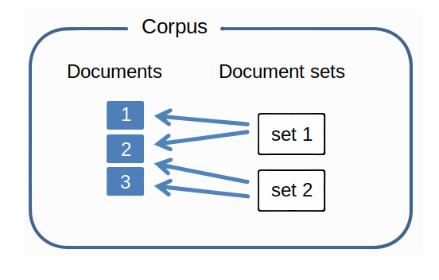
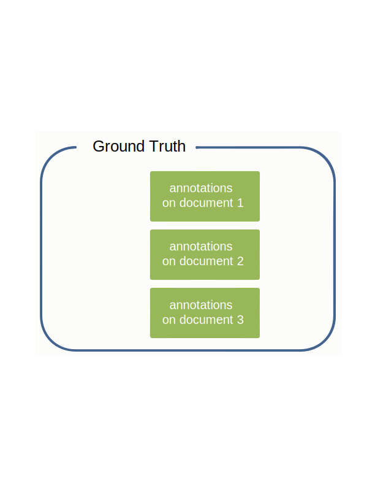
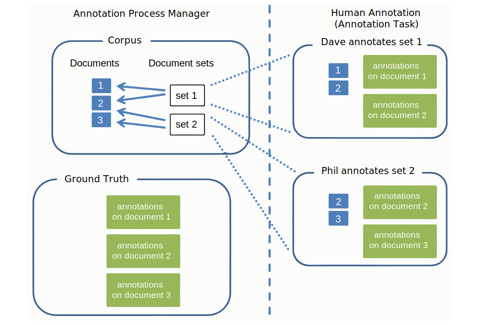

---

copyright:
  years: 2015, 2018
lastupdated: "2018-09-11"

subcollection: watson-knowledge-studio

---

{:shortdesc: .shortdesc}
{:new_window: target="_blank"}
{:tip: .tip}
{:pre: .pre}
{:codeblock: .codeblock}
{:screen: .screen}
{:javascript: .ph data-hd-programlang='javascript'}
{:java: .ph data-hd-programlang='java'}
{:python: .ph data-hd-programlang='python'}
{:swift: .ph data-hd-programlang='swift'}

This documentation is for {{site.data.keyword.knowledgestudiofull}} on {{site.data.keyword.cloud}}. To see the documentation for the previous version of {{site.data.keyword.knowledgestudioshort}} on {{site.data.keyword.IBM_notm}} Marketplace, [click this link ](https://{DomainName}/docs/services/knowledge-studio/documents-for-annotation.html){: new_window}.
{: tip}

# Adding documents for annotation
{: #documents-for-annotation}

To train a machine learning model, you must add documents that contain subject matter knowledge, such as journal articles or other industry-specific texts, to your workspace.
{: shortdesc}

## About this task
{: #annotation_about}

This section describes how to add documents for annotation only. To define rules for the rule-based model, you add or upload documents from which you can draw patterns to define as rules. See [Adding documents for defining rules](/docs/services/watson-knowledge-studio?topic=watson-knowledge-studio-wks_rule_anno_add) for more information.

## Documents
{: #wks_sampledoc}

To train a machine learning model, you need to collect documents that are representative of your domain content and of high value to your application.

Try to ensure that your training documents are truly representative of content that is of interest to your domain; that is, they contain many relevant mentions that can be annotated. To choose the best documents, follow these guidelines:

- Strive to provide a set of documents that have a total size of about 300,000 words. Provide more words for a complex type system, and fewer for a simpler one.
- Limit each document to a page or two of content (fewer than 2,000 words, and closer to 1,000 words per document is best). In the early stages of model development, keeping each document down to a few paragraphs is also a good practice. A human annotator can mark mentions and relations in a long document, but attempts to mark coreferences across multiple pages might prove unwieldy.
- Ensure that the data in the documents is distributed across all possible entity types, subtypes, and roles, and the relationships between them. A goal to aim for is to eventually have at least 50 annotations for each entity type and 50 for each relation type in the document collection.
- Again, documents should represent the breadth of the subject matter that the application will cover, but in the case of skewed frequency-of-occurrence of entity types and relation types, try to get at least 50 exemplars of each type, more for entity types that have mentions which tend to be phrases.
- The set that you create for training must contain at least 10 annotated documents.

When you are ready to create and train the model, documents that you add to the workspace can be divided into sets that are used as training data, test data, and blind data. The separate data sets are important for assessing model performance.

You can add documents in the following ways. For information about the supported document types, size limits, and other information, see [Creating a workspace > Summary of inputs, outputs, and limitations](/docs/services/watson-knowledge-studio?topic=watson-knowledge-studio-create-project#wks_formats).

- A two-column CSV file in UTF-8 format
- Text files in UTF-8 format
- HTML files
- PDF files (scanned and password-protected files are not supported)
- Microsoft Word DOC or DOCX files (password-protected files are not supported)
- A ZIP file that contains documents downloaded from a {{site.data.keyword.knowledgestudioshort}} workspace
- A ZIP file that contains files in UIMA CAS XMI format

### CSV files
{: #wks_sampledoc__wks_samplecsv}

You can upload a two-column CSV file that contains sample text from your local machine. Upload one CSV file at a time. The first column in the CSV file specifies the file name of the document. The second column in the file contains the document text. For an example of the required format, see the <a href="https://watson-developer-cloud.github.io/doc-tutorial-downloads/knowledge-studio/documents-new.csv" download>`documents-new.csv` </a> file in the tutorial sample files.

### PDF files
{: #doc-pdf}

Text cannot be extracted from a PDF in some cases, depending on how the PDF was created. Typically, text can't be extracted from embedded fonts that don't map to unicode characters. If you are unsure whether text from a PDF can be extracted, you can try copying the text from the PDF and then pasting it into a text editor. If you do not see the same characters that are visible in the PDF itself, then the text extraction would likely fail.

### Formatted documents
{: #doc-formatted}

When formatted documents are converted to plain text, it's possible that losing the formatting could result in poor tokenization of words. For example, if a table row in a DOCX file contains cell values that do not end with a period, the values might be converted as one sentence. As another example, if a PDF document contains a very long word that is hyphenated at the end of a line, that word might be converted as two words. In cases like these, the documents might not be suitable for machine learning unless you pre-process the files to fix formatting limitations.

### Documents from another Watson Knowledge Studio workspace
{: #wks_sampledoc__wks_samplecorpus}

If you previously downloaded documents from a {{site.data.keyword.knowledgestudioshort}} workspace, you can upload the `ZIP` file that you downloaded. An option lets you specify whether you want the ground truth annotations to be included in the imported files.

After documents are annotated, the annotated documents are stored in `JSON` format. The markup language in these files, which shows how the original document text was parsed and tokenized, includes elements for all of the annotations that a human annotator added. To improve model accuracy over time, you can upload these files into another workspace, thus preserving all of the existing annotations. A human annotator can revise, delete, and add annotations to these documents, or you can bypass human annotation and use these files to create training, test, and blind document sets for evaluating and improving the model performance.

### UIMA CAS XMI files
{: #wks_sampledoc__samplexmi}

To help train a model, you can upload documents that were pre-annotated by a UIMA analysis engine. The pre-annotated files must be in XMI serialization of UIMA Common Analysis Structure (UIMA CAS XMI) format and combined into a ZIP file. For example, you can upload documents that were annotated in an {{site.data.keyword.IBM_notm}} {{site.data.keyword.watson}} Explorer collection.

A human annotator can revise, delete, and add annotations to these documents, or you can bypass human annotation and use these files to create training, test, and blind document sets for evaluating and improving the model performance. For details about how to create these files and requirements for uploading them, see [Uploading pre-annotated documents](/docs/services/watson-knowledge-studio?topic=watson-knowledge-studio-preannotation#wks_uima).

### Anonymizing data
{: #wks_anonymizing}

If you want to build a model that is optimized for your data, but do not want to upload the data as-is to {{site.data.keyword.knowledgestudioshort}} for privacy reasons, you can strip the documents of any personally identifiable information (PII) first, and then use those anonymized documents to train the model. Do not redact the information or replace it wholesale with variables. For best results, replace the real information with fake information of the same type.

For example, if the PII that you want to protect is client names, then instead of redacting each name or replacing each name with a variable, such as *USER_NAME*, replace each name with a fake name that uses a variety of typical name syntax styles, such as *Jane Doe*, *Mr. Smith*, *Dietrich*, or *Dr. Jones, PhD*. Consider writing a script that concatenates a variety of first and last names, and titles and last names, and adds last names alone to create fake names that can be inserted into the document to replace instances of real user names. The goal is to simulate as closely as possible real values in the source documents. If the same text (USER_NAME) is used in the documents or text is redacted, you will basically be training the model to expect all names to have that same value or be redacted. When the model is used at runtime on new documents, and encounters never-seen-before names in all their variability, you want it to be able to recognize them as names.

## Adding documents to a workspace
{: #wks_projadd}

To train a model, you must add documents that are representative of your domain content to your workspace.

### About this task
{: #wks_projadd_about}

As a best practice, start with a relatively small collection of documents. Use these documents to train human annotators (if your workspace involves human annotation) and to refine the annotation guidelines. Small documents can help human annotators identify coreference chains throughout the document. As annotation accuracy improves, you can add more documents to the corpus to provide greater depth to the training effort.

### Procedure
{: #wks_projadd_procedure}

To add documents to a workspace:

1. Log in as a {{site.data.keyword.knowledgestudioshort}} administrator or project manager, and select your workspace.
2. Select the **Assets**> **Documents** > **Documentation sets** tab.
3. Click **Upload Document Sets** to add documents to the corpus.
4. Upload documents in one of the supported formats. For information about the supported document types, size limits, and other information, see  [Creating a workspace > Summary of inputs, outputs, and limitations](/docs/services/watson-knowledge-studio?topic=watson-knowledge-studio-create-project#wks_formats).

  **Notes about `ZIP` files of documents downloaded from another workspace**
   - If you previously downloaded documents from a {{site.data.keyword.knowledgestudioshort}} workspace, drag the `ZIP` file that contains the downloaded documents or click to locate and select the file. If you want to include annotations that were added to the documents before they were downloaded, ensure that the option to include ground truth is selected before you click **Upload**. Only annotations that were promoted to ground truth before the documents were downloaded will be imported.
   - Restriction: When annotated documents are imported, they are re-tokenized. This process can change what {{site.data.keyword.knowledgestudioshort}} considers to be the sentence boundaries. Because annotations are defined by sentence, some annotations might be invalidated during this process. After uploading documents from another workspace, do a quick review of the annotations to address any discrepancies.
   - You must upload the type system from the original workspace into the current workspace before you upload ground truth annotations. For details, see [Uploading resources from another workspace](/docs/services/watson-knowledge-studio?topic=watson-knowledge-studio-exportimport).

  **Notes about `ZIP` files of documents in UIMA CAS XMI format**
   - If you previously downloaded annotated documents that are in UIMA CAS XMI format, you can upload the `ZIP` file that contains the analyzed content. Specify that this is the type of content you want to upload before you click **Upload**. For details about how to create these files and requirements for uploading them, see [Uploading pre-annotated documents](/docs/services/watson-knowledge-studio?topic=watson-knowledge-studio-preannotation#wks_uima).

5. After the documents have been added, click the document names to preview them and verify that the content looks OK. For example, verify that text files are in UTF-8 format and that no diacritical marks or character normalization issues are visible in the documents, and check for poor sentence breaks. If problems exist, you might need to pre-process the files before you add them to the corpus. You want the documents to be as clean and well-formatted as possible before dictionary or human annotation begins.

### What to do next
{: #wks_projadd_next}

Before you start any human annotation tasks, divide the corpus into multiple document sets and assign the document sets to human annotators.

## Creating and assigning annotation sets
{: #wks_projdocsets}

After you add documents, divide the documents into sets so that they can be annotated by multiple human annotators. To view inter-annotator agreement scores, you must assign at least two human annotators and specify that some percentage of documents overlap between the sets.

### Before you begin
{: #wks_projdocsets_prereqs}

- You must upload document sets before you can divide them into annotation sets.
- You must create user accounts in {{site.data.keyword.knowledgestudioshort}} for all human annotators who will work on documents in this workspace.

### About this task
{: #wks_projdocsets_about}

> **Attention:** If you use the Google Chrome browser, you cannot upload a large number of files (such as more than 300) by selecting them from a folder. The workaround is to either use the Firefox browser or select a smaller number of files and upload files several times.

You can create a maximum of 1,000 annotation sets per workspace.

### Procedure
{: #wks_projdocsets_procedure}

To create an annotation set:

1. Log in as a {{site.data.keyword.knowledgestudioshort}} administrator or project manager, and select your workspace.
1. Select the **Assets**> **Documents** > **Annotation sets** tab.
1. Click **Create Annotation Sets**.

    1. For the base set, select the collection of documents that you want to divide into annotation sets, either all documents in the corpus or documents that were previously allocated to a document set.

    1. For the overlap value, specify the percentage of documents that you want to include in each annotation set. Inter-annotator agreement scores cannot be calculated unless two or more human annotators annotate the same documents. For example, if you specify a 20% overlap value for a corpus that contains 30 documents, and you divide the corpus into 3 document sets, 6 documents (20%) will be annotated by all human annotators. The remaining 24 documents will be divided among the 3 human annotators (8 each). Thus, each annotator receives 14 documents to annotate (6+8).

    > **Note:** An annotation set that you plan to use to train a machine learning model must contain at least 10 annotated documents.

    1. Select a user name from the list of human annotators.

        > **Note:** If you have a Lite plan subscription, associate yourself with the annotation set. You cannot add other users and assign them to the human annotator role. But by adding yourself, you can fill the role of a human annotator and test out how a real human annotator would interact with the ground truth editor to annotate documents.

    1. Name the annotation set.

        As a good practice for evaluating a human annotator's work as the workspace progresses, you might want to create annotation set names that identify the human annotator assigned to the set. You cannot change the annotation set name after the set is created.

1. After you finish assigning all the human annotators who will work on this workspace, click **Generate** to create the annotation sets. When human annotators log in to the ground truth editor, they see only the annotation sets that are assigned to them.

**Related tasks**:
{: #wks_related_tasks}

[Assembling a team](/docs/services/watson-knowledge-studio?topic=watson-knowledge-studio-team)

## Deleting documents
{: #wks_deletedocs}

You can delete a document if you determine that it does not represent standard industry text that will benefit the model.

To delete a document, choose the option that applies to your situation:
- [Deleting a document that has not been associated with an annotation task](#deletenotask)
- [Deleting a document that is associated with an annotation task and human annotation *has not begun*](#deletenoanno)
- [Deleting a document that is associated with an annotation task and human annotation *has begun*](#deleteanno)

### Deleting a document that has not been associated with an annotation task
{: #deletenotask}

If the document you want to delete is not associated with an annotation task, complete these steps to delete the document.

#### Procedure
{: #deletenotaskp}

1. Log in as a {{site.data.keyword.knowledgestudioshort}} administrator and select your workspace.
1. Select the **Assets**> **Documents** > **Document sets** tab.
2. Select the document set that contains the document you want to delete. The document set opens.
3. Find the document that you want to remove, and then click **Delete**.

### Deleting a document that is associated with an annotation task and human annotation has not begun
{: #deletenoanno}

If the document you want to delete is associated with an annotation task and human annotation *has not yet begun*, complete these steps to delete the document.

#### Procedure
{: #deletenoannop}

1. Log in as a {{site.data.keyword.knowledgestudioshort}} administrator and select your workspace.
1. Delete the annotation task:

  a. Open the **Machine Learning Model** > **Annotation Tasks** page.

  b. Find the annotation task that the document is associated with, click the **Show menu** icon on the task, and then click **Delete**.

1. Delete the document as described in [Deleting a document that has not been associated with an annotation task](#deletenotask).
1. After you delete the document, recreate the annotation task and associate the same annotation set, which now has one less document in it.

### Deleting a document that is associated with an annotation task and human annotation has begun
{: #deleteanno}

If the document you want to delete is associated with an annotation task and human annotation *has begun*, complete these steps to delete the document.

**Attention**: Do not delete a task if human annotation is in progress. If you do, you will lose the work that is in progress.

#### Procedure
{: #deleteannop}

1. Tell the human annotators to ignore the unwanted document in the set.
1. After all annotation work is complete on the other documents, and the human annotators submit all the documents to add the set to the ground truth, [review and accept the submitted documents](/docs/services/watson-knowledge-studio?topic=watson-knowledge-studio-build-groundtruth#wks_haaccuracy).
1. [Resolve any annotation conflicts](/docs/services/watson-knowledge-studio?topic=watson-knowledge-studio-build-groundtruth#wks_haadjudicate).
1. When all the documents are part of the ground truth and the task is complete, delete the task as described in [Deleting a document that is associated with an annotation task and human annotation has not begun](#deletenoannop).
1. Delete the document as described in [Deleting a document that has not been associated with an annotation task](#deletenotask).

  **Note**: You can confirm that the annotations on the remaining documents are not lost by downloading the document sets and reviewing the documents in the `gt` folder.

## Data model
{: #wks_datamodel}

The diagrams in this topic summarize the flow of documents in a {{site.data.keyword.knowledgestudioshort}} system and the differences between documents in the corpus, an annotation task, and ground truth.

The corpus contains documents, which are partitioned into document sets:

- A document is nothing more than strings of text.
- A document set is a pointer to a group of documents. The document set does not contain copies of the documents themselves.
- Some document sets can point to a single document, a setup that you can control through the overlap parameter that you specify when you create annotation sets.

 Figure 1. This figure illustrates two document sets that point to three documents. The documents are divided between the sets.

Ground truth comprises the annotations (mentions, relations, and coreferenced mentions) that are added to documents. Ground truth is singular for each document.

 Figure 2. This figures illustrates that ground truth consists of the annotations that are added to document 1, document 2, document 3, and so on.

When you create an annotation task, copies of the annotations are created for each document in the annotation set that you add to the task. Human annotators annotate the documents. The annotations are isolated from each other and from ground truth. An annotation task is a temporal concept that exists to allow human annotators to annotate text in isolated spaces. In contrast, ground truth is permanent and singular.

 Figure 2. This figures illustrates that the project manager creates annotation sets and assigns them to an annotation task. Dave and Phil, the human annotators, annotate documents in the sets that are assigned to them.

After the project manager approves annotation sets in an annotation task, annotations in documents that do not overlap with other annotation sets become ground truth. For documents that overlap between annotation sets (represented by document 2 in this example), the project manager must adjudicate and resolve conflicts. The annotations in overlapping documents do not become ground truth until they are approved through adjudication.

Ground truth is then used for training and testing a machine learning model, or it can be used as the basis for the next iteration of model development. To use ground truth in a new iteration, you must create a new annotation task.

 Figure 3. This figure illustrates how annotations added by two human annotators become ground truth. One document, labeled document 2, is annotated by both human annotators. The annotations in this overlapping document must be adjudicated before they become ground truth.
