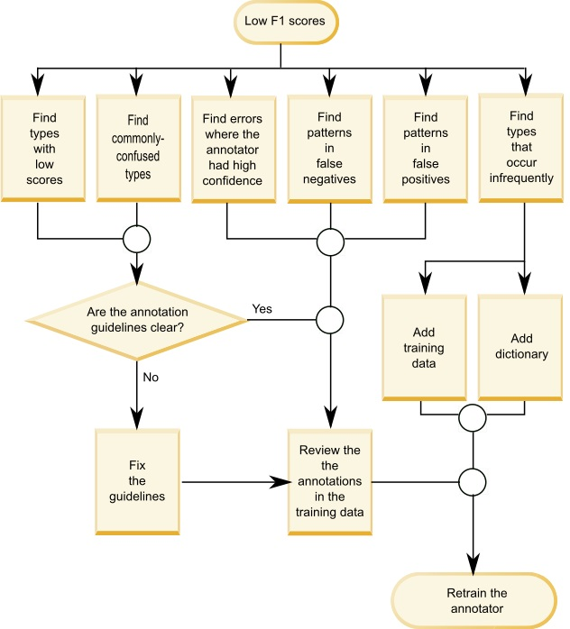
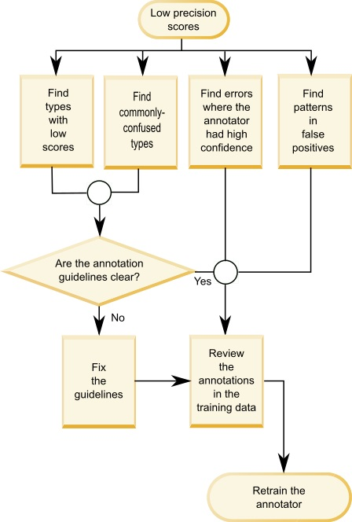

---

copyright:
  years: 2015, 2017
lastupdated: "2017-12-11"

---

{:shortdesc: .shortdesc}
{:new_window: target="_blank"}
{:tip: .tip}
{:pre: .pre}
{:codeblock: .codeblock}
{:screen: .screen}
{:javascript: .ph data-hd-programlang='javascript'}
{:java: .ph data-hd-programlang='java'}
{:python: .ph data-hd-programlang='python'}
{:swift: .ph data-hd-programlang='swift'}

This documentation is for {{site.data.keyword.knowledgestudiofull}} on {{site.data.keyword.cloud}}. To see the documentation for the previous version of {{site.data.keyword.knowledgestudioshort}} on {{site.data.keyword.IBM_notm}} Marketplace, [click this link ](https://console.bluemix.net/docs/services/knowledge-studio/evaluate-ml.html){: new_window}.
{: tip}

# Analyzing machine-learning model performance
{: #evaluate-ml}

Review the annotations that were added by the trained model to determine whether any adjustments must be made to the annotator to improve its ability to find valid entity mentions, relation mentions, and coreferences in the documents.
{: shortdesc}

## About this task

You can analyze performance by viewing a summary of statistics for entity types, relation types, and coreferenced mentions. You can also analyze statistics that are presented in a *confusion matrix*. The confusion matrix helps you compare the annotations added by the machine-learning annotator to the annotations in ground truth.

The annotator component statistics provide the following metrics:

- **F1 score**

    A measurement that considers both precision and recall to compute the score. The F1 score can be interpreted as a weighted average of the precision and recall values, where an F1 score reaches its best value at 1 and worst value at 0. See [Analyzing low F1 scores](/docs/services/watson-knowledge-studio/evaluate-ml.html#evaluate-mllowf1).

- **Precision**

    A measurement that specifies what fraction of the machine-learning annotator's output was accurate when compared to the human annotator output. Precision is determined by the number of correctly labeled annotations divided by the total number of annotations added by the machine-learning annotator. A precision score of 1.0 for entity type A means that every mention that was labeled as entity type A does indeed belong to that classification. A low precision score helps you identify places where the machine-learning annotator created incorrect annotations. The score says nothing about how many other mentions that were labeled as entity type A by the human annotator were missed by the machine-learning annotator; the recall score reflects that information. See [Analyzing low precision scores](/docs/services/watson-knowledge-studio/evaluate-ml.html#evaluate-mllowp).

- **Recall**

    A measurement that specifies how many mentions that should have been annotated by a given label were actually annotated with that label - the *right* mentions being those that human annotators identified in the same documents. Recall is determined by the number of correctly labeled annotations divided by the number of annotations that should have been created. A recall score of 1.0 means that every mention that should have been labeled as entity type A was labeled correctly. A low recall score helps you identify places where the machine-learning annotator failed to create an annotation that it should have. The score says nothing about how many other mentions were also labeled as entity type A, but should not have been; the precision score reflects that information. See [Analyzing low recall scores](/docs/services/watson-knowledge-studio/evaluate-ml.html#evaluate-mllowr).

- **Percentage of total annotations**

    A measurement of ground truth that shows how many words were annotated with a given entity type or relation type out of the total number of words that were annotated as any entity type or relation type in the test document set. This statistic is not available for coreferenced mentions. This value can help you to see how prevalent mentions of one type are compared to the other types in your ground truth.

- **Percentage of corpus density (by the number of words)**

    A measurement of ground truth that shows the number of words that were annotated with a given entity type or relation type out of the total number of words, whether annotated or unannotated. This statistic is not available for coreferenced mentions. This value can help you to see how prevalent mentions of this type are compared to all of the other words in your domain documents.

- **Percentage of documents that contain the type**

    A measurement of ground truth that shows how many documents contain a given entity type or relation type. This statistic is not available for coreferenced mentions. This value can help you to assess whether the documents in the set represent the domain sufficiently. If the percentage is low for key entity types, then you might want to add more documents with mentions of under-represented types.

## Procedure

To view performance statistics for how well the annotator component was trained:

1. On the **Annotator Component** page, locate the annotator component that you created, click **Details**, and then click **Statistics**.
1. In the **Summary** view, specify whether you want to evaluate test data or training data, and then specify the type of annotations you want to see statistics for: entity types, relation types, or coreferenced mentions. Note that blind data would be analyzed very infrequently and not until you feel relatively confident in the test data scores. As you scroll through the data, items that have low scores are flagged and highlighted to indicate that they require investigation and improvement. The triangle warning icon indicates that the F1 value is less than the fixed value, 0.5.

    For example, the F1 score for some entity types might be high because the document was annotated through pre-annotation as well as by a human annotator. But the F1 score for other entity types might be low because differences in phrasing, and differences in how human annotators interpret the text or annotation guidelines, make it more difficult for the machine-learning annotator to recognize the pattern and apply the correct annotation.

1. In the **Confusion Matrix** view for test data, specify the type of annotations that you want to see statistics for: entity types or relation types. For each entity type or relation type:

    - Each row in the matrix shows ground truth (entity types and relation types added by a human annotator).
    - Each column in the matrix shows the decoding results (annotation tokens added by the machine-learning annotator).
    - The numbers in each cell represent the number of annotation tokens per mention, not the occurrences of the mention.

        Tokens are used to delineate text strings. They loosely correspond to words. A mention can contain more than one token. For example, *Barack Obama* is a mention that contains two tokens. In the PERSON row or column, a value of 2 would be used to represent the single mention of *Barack Obama* in a document. The token count only loosely corresponds to the word count because tokens are counted differently in some situations. For example, punctuation at the end of a sentence is counted as a token, and contractions are often expanded into two tokens.

    - The column labeled **O** identifies tokens that should have been annotated by the machine-learning annotator as the type that is identified in the intersecting row (the human annotation), but they are not annotated as any type.
    - The value **N/A** is shown when there are no annotations for a given type in the document sets. For example, if there is no PERSON mention in the document sets that were annotated for ground truth or as test data, the scores for the PERSON entity type is N/A.

    For example, the following confusion matrix example shows results of a machine-learning annotator run on documents that deal with traffic incidents.

    <table cellpadding="4" cellspacing="0" summary="Incident report confusion matrix example" border="1" class="simpletable"><tr class="sthead"><th valign="bottom" align="left" id="d15356e164" class="stentry thleft thbot">Entity Types</th>
        <th valign="bottom" align="left" id="d15356e166" class="stentry thleft thbot">MANUFACTURER</th>
        <th valign="bottom" align="left" id="d15356e168" class="stentry thleft thbot">MODEL</th>
        <th valign="bottom" align="left" id="d15356e170" class="stentry thleft thbot">O</th>
      </tr>
      <tr class="strow"><td valign="top" headers="d15356e164" class="stentry">
MANUFACTURER
</td>
        <td valign="top" headers="d15356e166" class="stentry">
515
</td>
        <td valign="top" headers="d15356e168" class="stentry">
5
</td>
        <td valign="top" headers="d15356e170" class="stentry">
44
</td>
      </tr>
    </table>
    {: #evaluate-ml__datasimpletable_yms_hff_cw}

    You can learn the following things from this matrix:
    - The annotator correctly recognized 515 tokens as mentions of the MANUFACTURER entity type.
    - The annotator incorrectly labeled 5 tokens as mentions of the MODEL type that should have been labeled as MANUFACTURER.
    - There were 44 tokens that comprise mentions of the MANUFACTURER type that the annotator failed to annotate as any entity type.

    When you evaluate annotator performance and view the decoding results, you can start by investigating the tokens that were mislabeled or missed completely.

## Performance improvement cheat sheet
{: #evaluate-ml_cheat}

Use this cheat sheet to help you determine the steps you can take to improve the machine learning annotator performance.

It's difficult to dictate rules for improving performance scores that would be applicable across domains, where type system complexity, appropriateness of training documents, human annotator skills, and other factors influence the outcome. However, the following table can help you make an initial assessment and take steps to improve performance, especially during the early stages of annotator component development and testing.

The following table suggests fixes for the most common machine-learning annotator performance problems.

<table cellpadding="4" cellspacing="0" summary="The table lists common problems down that first column and suggested fixes across the first row. X marks indicate which fix to apply to which problem." border="1" class="simpletable"><tr class="sthead"><th valign="bottom" align="left" id="d15356e221" class="stentry thleft thbot">Problem</th>
<th valign="bottom" align="left" id="d15356e223" class="stentry thleft thbot">Add dictionaries</th>
<th valign="bottom" align="left" id="d15356e225" class="stentry thleft thbot">Edit document sets</th>
<th valign="bottom" align="left" id="d15356e227" class="stentry thleft thbot">Add type-specific documents</th>
<th valign="bottom" align="left" id="d15356e229" class="stentry thleft thbot">Annotate corpus more</th>
<th valign="bottom" align="left" id="d15356e231" class="stentry thleft thbot">Fix human annotations</th>
<th valign="bottom" align="left" id="d15356e233" class="stentry thleft thbot">Enhance annotator guidelines</th>
<th valign="bottom" align="left" id="d15356e235" class="stentry thleft thbot">Update type system</th>
<th valign="bottom" align="left" id="d15356e237" class="stentry thleft thbot">Investigate further</th>
</tr>
<tr class="strow"><td valign="top" headers="d15356e221" class="stentry">
Low F1
</td>
<td valign="top" headers="d15356e223" class="stentry">
X
</td>
<td valign="top" headers="d15356e225" class="stentry">
X
</td>
<td valign="top" headers="d15356e227" class="stentry">
X
</td>
<td valign="top" headers="d15356e229" class="stentry">
X
</td>
<td valign="top" headers="d15356e231" class="stentry">
X
</td>
<td valign="top" headers="d15356e233" class="stentry">
X
</td>
<td valign="top" headers="d15356e235" class="stentry">
X
</td>
<td valign="top" headers="d15356e237" class="stentry">
X
</td>
</tr>
<tr class="strow"><td valign="top" headers="d15356e221" class="stentry">
Low precision
</td>
<td valign="top" headers="d15356e223" class="stentry">

</td>
<td valign="top" headers="d15356e225" class="stentry">

</td>
<td valign="top" headers="d15356e227" class="stentry">

</td>
<td valign="top" headers="d15356e229" class="stentry">
X
</td>
<td valign="top" headers="d15356e231" class="stentry">
X
</td>
<td valign="top" headers="d15356e233" class="stentry">
X
</td>
<td valign="top" headers="d15356e235" class="stentry">
X
</td>
<td valign="top" headers="d15356e237" class="stentry">
X
</td>
</tr>
<tr class="strow"><td valign="top" headers="d15356e221" class="stentry">
Low recall
</td>
<td valign="top" headers="d15356e223" class="stentry">
X
</td>
<td valign="top" headers="d15356e225" class="stentry">
X
</td>
<td valign="top" headers="d15356e227" class="stentry">
X
</td>
<td valign="top" headers="d15356e229" class="stentry">
X
</td>
<td valign="top" headers="d15356e231" class="stentry">

</td>
<td valign="top" headers="d15356e233" class="stentry">

</td>
<td valign="top" headers="d15356e235" class="stentry">

</td>
<td valign="top" headers="d15356e237" class="stentry">

</td>
</tr>
<tr class="strow"><td valign="top" headers="d15356e221" class="stentry">
Low annotation %
</td>
<td valign="top" headers="d15356e223" class="stentry">

</td>
<td valign="top" headers="d15356e225" class="stentry">
X
</td>
<td valign="top" headers="d15356e227" class="stentry">
X
</td>
<td valign="top" headers="d15356e229" class="stentry">
X
</td>
<td valign="top" headers="d15356e231" class="stentry">

</td>
<td valign="top" headers="d15356e233" class="stentry">

</td>
<td valign="top" headers="d15356e235" class="stentry">

</td>
<td valign="top" headers="d15356e237" class="stentry">

</td>
</tr>
<tr class="strow"><td valign="top" headers="d15356e221" class="stentry">
Low density
</td>
<td valign="top" headers="d15356e223" class="stentry">

</td>
<td valign="top" headers="d15356e225" class="stentry">
X
</td>
<td valign="top" headers="d15356e227" class="stentry">
X
</td>
<td valign="top" headers="d15356e229" class="stentry">
X
</td>
<td valign="top" headers="d15356e231" class="stentry">

</td>
<td valign="top" headers="d15356e233" class="stentry">

</td>
<td valign="top" headers="d15356e235" class="stentry">

</td>
<td valign="top" headers="d15356e237" class="stentry">

</td>
</tr>
<tr class="strow"><td valign="top" headers="d15356e221" class="stentry">
Few documents of type
</td>
<td valign="top" headers="d15356e223" class="stentry">

</td>
<td valign="top" headers="d15356e225" class="stentry">

</td>
<td valign="top" headers="d15356e227" class="stentry">
X
</td>
<td valign="top" headers="d15356e229" class="stentry">
X
</td>
<td valign="top" headers="d15356e231" class="stentry">

</td>
<td valign="top" headers="d15356e233" class="stentry">

</td>
<td valign="top" headers="d15356e235" class="stentry">
X
</td>
<td valign="top" headers="d15356e237" class="stentry">

</td>
</tr>
<tr class="strow"><td valign="top" headers="d15356e221" class="stentry">
Incorrect categorization
</td>
<td valign="top" headers="d15356e223" class="stentry">
X
</td>
<td valign="top" headers="d15356e225" class="stentry">

</td>
<td valign="top" headers="d15356e227" class="stentry">

</td>
<td valign="top" headers="d15356e229" class="stentry">

</td>
<td valign="top" headers="d15356e231" class="stentry">

</td>
<td valign="top" headers="d15356e233" class="stentry">

</td>
<td valign="top" headers="d15356e235" class="stentry">
X
</td>
<td valign="top" headers="d15356e237" class="stentry">

</td>
</tr>
<tr class="strow"><td valign="top" headers="d15356e221" class="stentry">
Missed annotations 
</td>
<td valign="top" headers="d15356e223" class="stentry">
X
</td>
<td valign="top" headers="d15356e225" class="stentry">

</td>
<td valign="top" headers="d15356e227" class="stentry">

</td>
<td valign="top" headers="d15356e229" class="stentry">
X
</td>
<td valign="top" headers="d15356e231" class="stentry">

</td>
<td valign="top" headers="d15356e233" class="stentry">

</td>
<td valign="top" headers="d15356e235" class="stentry">

</td>
<td valign="top" headers="d15356e237" class="stentry">

</td>
</tr>
<tr class="strow"><td valign="top" headers="d15356e221" class="stentry">
Gap between test and train results 
</td>
<td valign="top" headers="d15356e223" class="stentry">

</td>
<td valign="top" headers="d15356e225" class="stentry">
X
</td>
<td valign="top" headers="d15356e227" class="stentry">

</td>
<td valign="top" headers="d15356e229" class="stentry">

</td>
<td valign="top" headers="d15356e231" class="stentry">

</td>
<td valign="top" headers="d15356e233" class="stentry">

</td>
<td valign="top" headers="d15356e235" class="stentry">

</td>
<td valign="top" headers="d15356e237" class="stentry">

</td>
</tr>
<tr class="strow"><td valign="top" headers="d15356e221" class="stentry">
Low F1 for testing training data
</td>
<td valign="top" headers="d15356e223" class="stentry">

</td>
<td valign="top" headers="d15356e225" class="stentry">

</td>
<td valign="top" headers="d15356e227" class="stentry">

</td>
<td valign="top" headers="d15356e229" class="stentry">

</td>
<td valign="top" headers="d15356e231" class="stentry">
X
</td>
<td valign="top" headers="d15356e233" class="stentry">
X
</td>
<td valign="top" headers="d15356e235" class="stentry">

</td>
<td valign="top" headers="d15356e237" class="stentry">
X
</td>
</tr>
</table>

 {: #evaluate-ml_cheat__datasimpletable_nhm_5ym_cw}

### Fix descriptions

- **Add dictionaries**

    A dictionary contains example surface forms of a given entity type. You might need to add a new dictionary or add more entries to an existing dictionary if training statistics show that annotations of the type occur infrequently in the training data. If you know that the entity type is key to the domain and does occur often, then the omission might indicate that the surface forms associated with the type which *are* present in the training data are not being recognized by the machine-learning annotator. Providing more surface form examples can help to solve this problem.

- **Edit document sets**

    Ensure that you have enough overall training data. To learn, a machine-learning annotator requires sufficient content. Aim to provide around 300,000 words. (You can run a word count tool on your source documents to check the amount.) If your training set is too small, add documents to the corpus. It is not enough to have a handful of documents that exercise each important entity type or relationship; you want many documents that illustrate how those types are used in typical domain literature.
  - Ensure that the assortment of documents that is used for testing and training is similar. For example, do not use documents from one data source as the test data set and documents from another data source as the training data set. Different data sources might represent entity and relation type information in completely different ways. It is best to use a combination of documents from all of the data sources in both data sets to get the most comprehensive set of usage examples available from the industry literature. If the overall performances scores for a test run differ greatly from the training run, it might be due to inconsistencies in the data sets used for each.
  - Don't waste time with incorrectly formatted documents. Text documents that you add to the corpus must be in UTF-8 format. If you converted document from other formats to use UTF-8 encoding, you might see diacritic marks and other issues with character normalization. Such incorrect formatting can lead to inaccurate token representation. If the word tokens used to represent a mention differ between documents, it weakens the example and negatively impacts machine learning.

- **Add type-specific documents**

    If you have a low percentage of documents that contain a certain type, it might mean that your corpus is not fully representative. The machine-learning annotator needs lots of examples to learn from. Adding more documents to the corpus might help. If your type system and documents are truly representative of a domain, you would expect to see that any randomly chosen documents contain a reasonable subset of the types. Although not true in all cases, this situation is a signal for you to investigate your type system and the quality of the documents in the corpus. You might need to find more domain documents that better exercise the types that are under-performing. If recall is low, it is often an indication that you need to add more documents.

- **Annotate corpus more**

    If the machine-learning annotator is having trouble finding instances of certain types then it might be because the ground truth does not contain enough examples of the type's usage. Human annotators can sometimes be thorough about labeling entity type mentions, but be less diligent about annotating relation types and coreferences. For any key types that have a low percentage of corpus density, you might want to focus on finding more annotations of those type in the source documents. But, don't worry too much about coreference and relation accuracy if mention accuracy is deficient. Relation mentions between entities and coreferences of entities cannot be accurate unless entity mentions are accurate to begin with.

- **Fix human annotations**

    Check to see whether your training data is consistently and fully annotated. A machine-learning annotator learns from your ground truth annotations. For example, if a sentence contains the phrase Obama family, and you label "Obama" as PERSON in one sentence and "Obama family" as PEOPLE in another sentence, the inconsistency means that the machine-learning annotator cannot learn the correct annotation. Likewise, if you label "Obama" as PERSON in one sentence but do not label his name at all in another sentence, the annotation effort is incomplete and the machine-learning annotator will be improperly trained. This type of inconsistent and partial labeling is sometimes referred to as *type confusion*. In most cases, just the act of having multiple human annotators review an overlapping set of documents will surface occurrences of type confusion-related mistakes. Pay attention to the issues that surface during document conflict resolution because they can provide insight into deeper issues with the type system itself. If there is no room to further improve or refine the type system, then it might be necessary to update the annotation guidelines and include examples. You can provide illustrations of common mistakes and how to annotate mentions properly under a given set of circumstances.

    Another indicator of annotation inconsistency is if you have enough annotations, but the corpus density is low. Density can be impacted when a mention that is significant in the domain literature occurs often, but is annotated as different types across the document set.

    Low precision is often an indication that you need to improve annotation consistency. To do so, review the annotation guidelines, better train the human annotators, and ensure that human annotators are working in concert and not in isolation from one another.

    Check the inter-annotator agreement score. This score, which measures the degree of agreement between different annotators' output on the same document, is a valuable number. Not only does this score tell you the quality of the ground truth documents that will be used to train the machine-learning annotator, but it also indicates the upper bound of machine-learning annotator performance. An annotator component that is trained on these documents is unlikely to outperform the best agreement that humans can reach. For example, if performance persists at 75 and does not go higher, take a look at the inter-annotator agreement results. If the inter-annotator agreement score is 80, take actions to better train the human annotators and ensure that conflicts are correctly resolved (according to the annotation guidelines) during adjudication. If humans can't agree on how something should be labeled, then it's unlikely that a machine-learning annotator will apply the correct labels.

- **Enhance annotator guidelines**

    Clear and comprehensive annotator guidelines are a crucial part of a harmonious and successful annotation development effort. Human annotators have a tough job to do. There can be nuances in assigning entity and relation types that are hard to anticipate until you start to work with the domain documents. The guidelines can provide a sanity check to human annotators as they evaluate documents. The guidelines should be a living and changing document, especially at the beginning of the annotation process. They provide a key feedback loop because a human annotator can capture things she learned while annotating a few documents, then as she or someone else annotates a few more documents, new tips and gotchas can be added to the guideline, and so on. Be sure to include examples of difficult decisions and their preferred resolutions. The best way to determine what you need to add to the annotation guidelines is to carefully review document conflicts. Real examples of annotations that real people disagreed upon and how they were resolved can be a great help to human annotators as they tackle the annotation of new documents.

- **Update type system**

    You might need to update the type system for these reasons:
  - The documents that comprise the training data have references to concepts that are important types in the domain but are not represented anywhere in the type system. This suggests that you might need to add types that capture the missing concepts or relationships. Be careful not to try to define a type for every concept in a field, or every entity that occurs in domain documents; the type system should be limited to only the most fundamental types.
  - An existing type is being consistently misused by human annotators. If a type consistently causes confusion, then you might need to rename it or eliminate it if it is redundant.
  - An existing type is never used by human annotators because it is never referenced in the documents. If the type is unlikely to ever be used in literature from this domain, then remove it from the type system.
  - Two types are often interchanged when human annotators annotate documents. Consider whether the two types could be consolidated into one type that accurately represents the concept or relationship. For example, if the type system contains both PERSON and PEOPLE, which are often used interchangeably, it might be best to use one type named PERSONPEOPLE that covers both cases instead of two separate types.

    > **Attention:** Use caution when you update the type system. If you update it after human annotators have evaluated documentation sets that were associated with the old type system, the human annotators will have to re-evaluate the documentation sets. Be sure that the changes you need to make are significant enough to warrant such rework.

- **Investigate further**

    If your type system, dictionary, and source documents are complete, and human annotation has been done well, but the machine-learning annotator still performs poorly, then something might have gone wrong in the model training process. For example, you should always see high overall scores (over 95%) when testing on the training data.

## Analyzing low F1 scores
{: #evaluate-mllowf1}

Tune the performance of your machine-learning annotator to address low F1 scores.

### Symptoms

An F1 score reaches its best value at 1 and worst value at 0. A low F1 score is an indication of both poor precision and poor recall. The machine-learning annotator generates erroneous annotations and fails to find annotations that it should have found.

### Causes

Low F1 scores can occur for many different reasons that depend on the domain, type system complexity, appropriateness of training documents, human annotator skills, and other factors.

### Resolving the problem

Tune the performance of your machine-learning annotator by performing one or more of following steps, and then retraining your annotator:

1. Identify commonly occurring types with low accuracy.

    > **Note:** When analyzing relations, look at both the F1 score of the relation type itself and at the F1 score of each of the two entities that participates in the relationship.

1. Identify commonly confused types. This information can be found by looking at the numbers that are off the diagonal in the confusion matrix.
1. Review errors where the machine-learning annotator has high confidence.
1. Find patterns in the false negatives and false positives in the confusion matrix.
1. If certain types occur infrequently in the training data, add training data that contains those types.

    You can determine the frequency of occurrence by checking the percentage statistics (there are three: % of annotations, % of corpus density, and % of documents) for the type.

1. If certain types have low F1 scores, review the clarity of the annotation guidelines that apply to those types.
1. Add a dictionary for types that occur infrequently in the training data.

<object class="image" data="images/wks_lowf1.svg"></object>

## Analyzing low precision scores
{: #evaluate-mllowp}

Tune the performance of your machine-learning annotator to address low precision scores. At a high level, low precision indicates a need to improve annotation consistency.

### Symptoms

A precision score reaches its best value at 1 and worst value at 0. A low precision score indicates that the machine-learning annotator generated incorrect annotations.

### Causes

Low precision scores can occur for many different reasons that depend on the domain, type system complexity, appropriateness of training documents, human annotator skills, and other factors.

### Resolving the problem

Tune the performance of your machine-learning annotator by performing one or more of following steps then retrain your annotator:

1. Identify commonly occurring types with low precision.
1. Identify commonly confused types. This information can be found by looking at the numbers that are off the diagonal in the confusion matrix.
1. Review errors where the machine-learning annotator has high confidence.
1. Find patterns in the false negatives in the confusion matrix.
1. If certain types have low precision scores, review the clarity of the annotation guidelines that apply to those types.

<object class="image" data="images/wks_lowprec.svg"></object>

## Analyzing low recall scores
{: #evaluate-mllowr}

Tune the performance of your machine-learning annotator to address low recall scores. At a high level, low recall indicates a need to add more training data.

### Symptoms

A recall score reaches its best value at 1 and worst value at 0. A low recall score indicates that the machine-learning annotator failed to create annotations that it should have created.

### Causes

Low recall scores can occur for many different reasons that depend on the domain, type system complexity, appropriateness of training documents, human annotator skills, and other factors.

### Resolving the problem

Tune the performance of your machine-learning annotator by performing one or more of following steps then retrain your annotator:

1. Identify commonly occurring types with low recall.
1. Identify commonly confused types. This information can be found by looking at the numbers that are off the diagonal in the confusion matrix.
1. Review errors where the machine-learning annotator has high confidence.
1. Find patterns in the false positives in the confusion matrix.
1. If certain types have low recall scores, review the clarity of the annotation guidelines that apply to those types.

<object class="image" data="images/wks_lowrecall.svg"></object>
