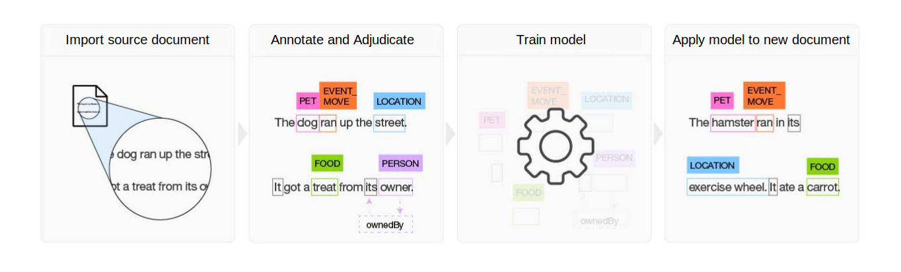

---

copyright:
  years: 2015, 2019
lastupdated: "2019-11-26"

subcollection: watson-knowledge-studio

---

{:shortdesc: .shortdesc}
{:new_window: target="_blank"}
{:tip: .tip}
{:pre: .pre}
{:codeblock: .codeblock}
{:note: .note}
{:screen: .screen}
{:javascript: .ph data-hd-programlang='javascript'}
{:java: .ph data-hd-programlang='java'}
{:python: .ph data-hd-programlang='python'}
{:swift: .ph data-hd-programlang='swift'}

This documentation is for {{site.data.keyword.knowledgestudiofull}} on {{site.data.keyword.cloud}}. To see the documentation for the previous version of {{site.data.keyword.knowledgestudioshort}} on {{site.data.keyword.IBM_notm}} Marketplace, [click this link ](https://{DomainName}/docs/services/knowledge-studio?topic=knowledge-studio-index){: new_window}.
{: tip}

# About
{: #wks_overview_full}

Use {{site.data.keyword.knowledgestudiofull}} to create a machine learning model that understands the linguistic nuances, meaning, and relationships specific to your industry or to create a rule-based model that finds entities in documents based on rules that you define.
{: shortdesc}

## Identify custom entities and relations
{: #entities-and-relations}

An entities and relations workspace enables you to create your own entity type system and train a custom model that can recognize custom entities in text. With machine learning models, you can also define custom relation types and train the model to recognize when two entities are related. Consider the following example sentence.

```
ABC Motors has received great reviews for its new 2020 Lightning.
```

A custom entities and relations model could be trained to recognize "2020 Lightning" as a `Vehicle` entity, and "ABC Motors" as a `Manufacturer` entity. The model could also be trained to recognize that the two entities are connected by a `isManufacturedBy` relation.


### Build a machine learning model
{: #ibml}

{{site.data.keyword.knowledgestudioshort}} provides easy-to-use tools for annotating unstructured domain literature, and uses those annotations to create a custom machine learning model that understands the language of the domain. The accuracy of the model improves through iterative testing, ultimately resulting in an algorithm that can learn from the patterns that it sees and recognize those patterns in large collections of new documents. You can deploy the finished machine learning model to other {{site.data.keyword.watson}} cloud-based offerings and cognitive solutions to find and extract mentions of relations and entities, including entity coreferences.

 Figure 1. Overview of the process to build a machine learning model

1. Based on a set of domain-specific source documents, the team creates a type system that defines entity types and relation types for the information of interest to the application that will use the model.
1. A group of two or more human annotators annotates a small set of source documents to label words that represent entity types, to identify relation types where the text identifies relationships between entity mentions, and to define coreferences, which identify different mentions that refer to the same thing, that is, the same entity. Any inconsistencies in annotation are resolved, and one set of optimally annotated documents is built, which forms the ground truth.
1. {{site.data.keyword.knowledgestudioshort}} uses the ground truth to train a model.
1. The trained model is used to find entities, relations, and coreferences in new, never-seen-before documents.

See [Creating a machine learning model](/docs/services/watson-knowledge-studio?topic=watson-knowledge-studio-ml_annotator) for more details.

### Build a rule-based model
{: #ibrb}

{{site.data.keyword.knowledgestudioshort}} provides a rules editor that simplifies the process of finding and capturing common patterns in your documents as rules. You can then create a model that recognizes the rule patterns, and deploy it for use in other services.

See [Creating a rule-based model](/docs/services/watson-knowledge-studio?topic=watson-knowledge-studio-rule-annotator) for more details.

## Analyze text with advanced rules
{: #advanced-rules}

The advanced rules feature is Beta. The feature is in a trial stage of development and is not recommended for use in production environments.
{: note}

The visual advanced rules editor allows you to create text extractors with deeper customization potential than what is available in the entities and relations rules editor. A number of sample extractors are provided such as *Finance Actions* extractors and *Parts of Speech* extractors that can be edited and combined to create your own advanced rules model. You can analyze documents directly in the editor, or you can export your model to use with other services such as [{{site.data.keyword.nlushort}}](/docs/services/natural-language-understanding).

To get started, see [Creating an advanced rules model](/docs/services/watson-knowledge-studio?topic=watson-knowledge-studio-create-advanced-rules-model).

## Watson services integration
{: #wks_watsoninteg}

Share domain artifacts and models between {{site.data.keyword.knowledgestudiofull}} and other {{site.data.keyword.watson}} services.

Use {{site.data.keyword.knowledgestudioshort}} to perform the following tasks:

- Bootstrap annotation by using the {{site.data.keyword.nlushort}} service to automatically find and annotate entities in your documents. When human annotators begin to annotate the documents, they can see the annotations that were already made by the service and can review and add to them. See [Pre-annotating documents with {{site.data.keyword.nlushort}}](/docs/services/watson-knowledge-studio?topic=watson-knowledge-studio-preannotation#wks_preannotnlu) for details.
- Upload analyzed documents that are in [UIMA CAS XMI format](/docs/services/watson-knowledge-studio?topic=watson-knowledge-studio-preannotation#wks_uimaweximport). For example, you can upload UIMA CAS XMI files that were exported from {{site.data.keyword.IBM_notm}} {{site.data.keyword.watson}} Explorer content analytics collections or [{{site.data.keyword.IBM_notm}} {{site.data.keyword.watson}} Explorer Content Analytics Studio](/docs/services/watson-knowledge-studio?topic=watson-knowledge-studio-preannotation#wks_uimawexstudio).
- Deploy a [machine learning](/docs/services/watson-knowledge-studio?topic=watson-knowledge-studio-publish-ml#wks_madiscovery) or [rule-based](/docs/services/watson-knowledge-studio?topic=watson-knowledge-studio-wks_rule_publish#wks_rule_discovery) model to use with the {{site.data.keyword.watson}} {{site.data.keyword.discoveryshort}} service.
- Deploy a [machine learning](/docs/services/watson-knowledge-studio?topic=watson-knowledge-studio-publish-ml#wks_manlu) or [rule-based](/docs/services/watson-knowledge-studio?topic=watson-knowledge-studio-wks_rule_publish#wks_rule_nlu) model to use with the {{site.data.keyword.nlushort}} service.
- [Export a machine learning model](/docs/services/watson-knowledge-studio?topic=watson-knowledge-studio-publish-ml#wks_maexport) to use in {{site.data.keyword.IBM_notm}} {{site.data.keyword.watson}} Explorer.
- [Export a rule-based model PEAR file](/docs/services/watson-knowledge-studio?topic=watson-knowledge-studio-wks_rule_publish#wks_rule_export) to use in {{site.data.keyword.IBM_notm}} {{site.data.keyword.watson}} Explorer.

## HIPAA support
{: #ihi}

US Health Insurance Portability and Accountability Act (HIPAA) support is available for Premium plans in the Washington, DC location created on or after 1 April 2019. See [Enabling EU and HIPAA supported settings](/docs/account?topic=account-eu-hipaa-supported#eu-hipaa-supported){: external} for more information.
