---

copyright:
  years: 2019, 2022
lastupdated: "2022-03-14"

subcollection: watson-knowledge-studio

---

{:shortdesc: .shortdesc}
{:external: target="_blank" .external}
{:deprecated: .deprecated}
{:important: .important}
{:note: .note}
{:tip: .tip}
{:preview: .preview}
{:beta: .beta}
{:pre: .pre}
{:codeblock: .codeblock}
{:screen: .screen}

# Managing advanced rules projects and extractors
{: #managing-projects-and-extractors}

In the advanced rules editor, use projects to organize your extractors and sample documents.
{: shortdesc}

## Before you begin
{: #managinge-projects-and-extractors-before-you-begin}

Advanced rules workspaces are available only in {{site.data.keyword.knowledgestudioshort}} instances hosted in the **Dallas** or **Frankfurt** locations.
{: note}

1. [Create an instance of {{site.data.keyword.knowledgestudioshort}}](/docs/watson-knowledge-studio?topic=watson-knowledge-studio-wks_tutintro#instance) in the **Dallas** or **Frankfurt** location.
1. From the **Manage** page of your {{site.data.keyword.knowledgestudioshort}} service instance, click **Launch tool**.
1. Create an advanced rules workspace.
    - If you already have other workspaces, click **Create workspace**.
    - Click **Create advanced rules workspace**. Enter a name for your workspace, then click **Create**. The advanced rules workspace will load after a few seconds.

## Workspace layout
{: #workspace-layout}

The workspace consists of the following areas:
- The **Projects and Extractors pane** includes two tabs. Use the **Projects** tab to create, delete, and rename projects. The **Extractors** tab lists the provided extractors and any custom extractors that you create.
- Use the **Canvas** to design and customize extractors.
- Use the **Extractor Properties** and **Results** panes to set extractor properties and to view the results of running an extractor on sample text
- Use the **Documents** pane to manage sample documents that you can use to test the extractors.

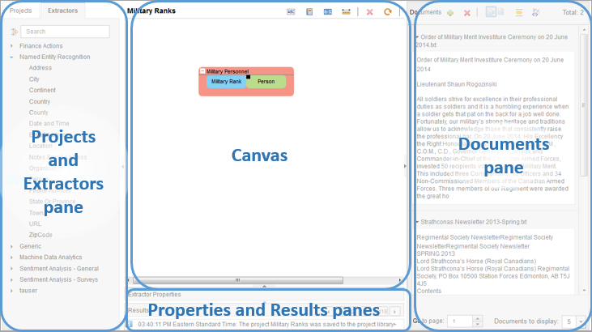

## Managing projects
{: #managing-projects}

Use projects to develop and test extractors that support a specific solution or category of documents. Projects are saved automatically, at five minute intervals, as you work on them. You can save a project manually by clicking **Save** .

- To create a project, click **New**  on the Projects tab.
- To delete a project, select the project and click **Delete**  on the Projects tab.
- To rename a project, double-click it and edit the project name.

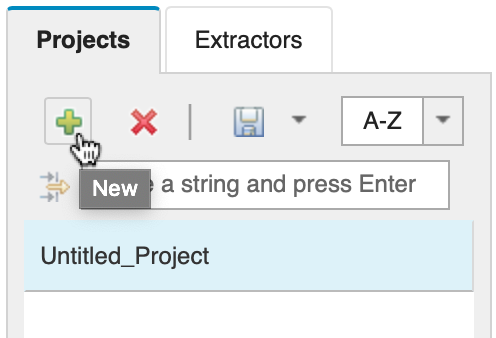

## Managing extractors
{: #managing-extractors}

An extractor is a software component that performs specific analysis tasks and provides the analysis logic. Sample extractors that you can use as they are or copy and edit are provided. You can also define extractors to match specific terms, character patterns, and sequences and save them to the extractor library. Use the workspace to add, modify, combine, share, and delete extractors.

### Adding an extractor to the canvas
{: #adding-an-extractor-to-the-canvas}

1. Click the **Extractors** tab in the **Projects and Extractors** pane.
    - Expand the appropriate folder and select the name of the desired extractor. If you want to see more information about an extractor, select it and then see the description information under **Extractor Properties**. You can also hover over the **Examples** link in the **Extractor Properties** pane to see examples of the results returned by the extractor.
    - Alternatively, search for the extractor by name.
2. Drag and drop the selected extractor to the canvas. When an extractor is added multiple times, all instances are treated as one. For example, a changed property in one instance is reflected in all instances. To prevent changing all instances, rename each instance when dragging it to the canvas. If you have renamed two or more instances, you can right-click and select **Unlink** to create a copy.

You can refine the extractor by modifying the **Settings** and **Output** values in the **Extractor Properties** pane as needed. See [Creating a dictionary](#creating-a-dictionary) and [Running an extractor](#running-an-extractor) for more information about how to configure these properties. Changing any extractor property automatically creates a copy for use in your project.

### Running a category of extractors
{: #running-a-category-of-extractors}

You can also add a category of extractors from the extractor library at one time. Any extractors in the category or folder with matches in the input documents are added automatically to the canvas.

1. Click the **Extractors** tab in the **Projects and Extractors** pane.
1. Right-click the folder for the category.
1. Click **Run Category.**

### Saving extractors to the extractor library
{: #saving-extractors-to-the-extractor-library}

Until an extractor is saved to the extractor library, you can access the extractor only in the project where it is defined.

To make an extractor available to all projects, click **Save Extractor** on the toolbar for the canvas. Custom extractors are saved on the **Extractors** tab in the `tauser` folder by default. As a best practice, save modified versions of a provided extractor in the same folder as the provided extractor.

## Creating an extractor
{: #creating-an-extractor}

You can build an extractor by combining one or more of the following elements.

- [Literal](#creating-a-literal): matches a single term such as `white-tailed deer` or `Congress`
- [Dictionary](#creating-a-dictionary): matches a group of terms that belong to the same category
- [Sequence](#creating-a-sequence-pattern): a combination of extractors that matches a sequential pattern of terms
- [Union](#creating-a-union): a grouping of extractors that represent a single concept
- [Regular expressions](#creating-a-regular-expression): syntax-based pattern matching

### Creating extractors with linguistic patterns
{: #creating-extractors-with-linguistic-patterns}

Defining a new extractor using natural language processing (NLP) concepts such as tokenization and part-of-speech requires developing an extractor using the Annotation Query Language (AQL).

To see the languages that are supported for tokenization and part-of-speech analysis, see [Multilingual Support for Text Analytics](https://www.ibm.com/support/knowledgecenter/SSPT3X_4.0.0/com.ibm.swg.im.infosphere.biginsights.text.doc/doc/ana_txtan_lang-support.html). For more information about how to write AQL and available functions, see [Annotation Query Language reference](/docs/watson-knowledge-studio?topic=watson-knowledge-studio-annotation-query-language-reference)

### Creating a dictionary
{: #creating-a-dictionary}

A dictionary is a list of terms that relate to a concept. Use a dictionary as a convenient substitute for individual literals when analyzing text for multiple terms that fit into the same category.

You can define a dictionary as a simple list of terms or as a mapping table that maps a value or term to a preferred term. Mapping tables are typically used to resolve synonyms, abbreviations, and encoded values.

Use of a dictionary can sometimes result in overlapping matches. For example, a dictionary used to extract information about people with a military rank such as `Officer`, `Warrant Officer`, or `Chief Warrant Officer` might result in three overlapping matches for every occurrence of `Chief Warrant Officer`. See [Eliminate duplicate and overlapping results](#eliminate-duplicate-and-overlapping-results) for information needed to address this issue.
{: tip}

#### Defining a list
{: #defining-a-list}

When using standardized terms such as names of departments in your organization, sales priorities, congressional committees, or military ranks to extract values, you can identify the needed terms in a list.

1. Click  on the canvas toolbar.
2. Specify a name for the dictionary. You can extend the name with a description. Lengthy text might be truncated in the display but you can hover over the dictionary to read the full description.
3. On the **Settings** tab under **Extractor Properties**, enter each term manually or load a list from a file. The maximum length for each entry is 1024 characters.
  - To specify the terms manually, click , enter the term, and press **Enter**. Enter one term per row.
  - To load terms from a UTF-8 text file with each term on a separate line, 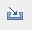. If an error is displayed during the import, ensure that the file does not contain unprintable characters such as Line Feed or Backspace.

#### Defining a mapping table
{: #defining-a-mapping-table}

When analyzing text that contains synonyms, alternate spellings for a term, or encoded values, you can define a mapping table to map terms in the text to a desired term.

A mapping table is analogous to a lookup table or a key-value pair table. Examples of instances in which you might define a mapping table include matching:

- Nicknames like Maggy and Peggy for Margaret
- Abbreviations and alternate forms of an organization name such as I.B.M., IBM Deutschland and International Business Machines for the commonly used name IBM
- 404 to File Not Found when translating HTML error codes in a log file
- The area code 408 to California

For best performance, use long or complex mapping tables in a second step, after the text extraction step.
{: tip}

1. Click  on the canvas toolbar.
2. Specify a name for the dictionary. You can extend the name with a description. Lengthy text is truncated but is displayed when you hover over the dictionary.
3. On the **Settings** tab under **Extractor Properties**, click **Map Terms**.
4. Complete the two-column table manually or by loading from a file. The first column contains the terms to search for in the text and the second column lists the values to generate in the results. The maximum length for an entry is 1024 characters. If a term is repeated in the first column, only the first mapped value is used.
  - To specify the terms manually, click , enter the term and its mapped value, and press Enter.
  - To load terms from an ASCII or UTF-8 text file with each term and its mapped value, separated by a single comma, on a separate line, click . If an error is displayed during the import, ensure that the file does not contain unprintable characters such as Line Feed or Backspace.

### Creating a literal
{: #creating-a-literal}

For exact matches to a single term or phrase such as `white-tailed deer` or `Congress` use a literal.

1. Click the **New Literal** 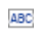 icon on the canvas toolbar. This adds a new literal to the canvas.
2. In the new literal on the canvas, enter the string of text that you want to match. For example, `white-tailed deer`.

### Creating a regular expression
{: #creating-a-regular-expression}

To extract information on the basis of the format of text, you must use a regular expression. The syntax for a regular expression is the same as that used to define regular expressions in Java.

To create an extractor that uses a regular expression:

1. From the canvas toolbar, click .
2. Enter a name for the regular expression. You can also add some descriptive information. Note that the information that you enter at the prompt is the name for the expression, not the expression itself.
3. Select the regular expression on the canvas to open the **Extractor Properties** to the **Settings** tab. Specify a regular expression. For more information about the syntax, see the [Class Pattern](https://docs.oracle.com/javase/8/docs/api/java/util/regex/Pattern.html){: external} Javadocc.
4. Specify options for case sensitivity, token range, and special character handling. If, while designing a regular expression, you see false positives, provide more context by extending the pattern in the regular expression or adding context through a sequence pattern. For example, if your postal code expression matches additional terms, incorporate rules for which letters are permitted in specific positions.

#### Regular expression examples
{: #regular-expression-examples}

The following are examples of regular Java expressions that might be used in specific instances. In the pattern descriptions, A represents a character and 9, a digit. For more information about Java syntax, see [Class Pattern](https://docs.oracle.com/javase/8/docs/api/java/util/regex/Pattern.html) Javadoc.

- To select text that includes any ordinal number of one or more digits followed by `th`, `st`, `nd`, or `rd` (`21st`, `2nd`, `3rd`, and so forth), specify:

  ```
  \d+(st|nd|rd|th)
  ```
  {: codeblock}

- To select text that includes US Social Security numbers formatted as `999-99-9999`, specify:

  ```
  \d{3}\-\d{2}\-\d{4}
  ```
  {: codeblock}

- To select all text that includes a Canadian postal code formatted as `A9A-9A9`, `A9A 9A9` or `A9A9A9` (for example, `K1G 3K9`, `V5g-4X3`, and `x2H3m5`), specify:

  ```
  [a-zA-Z][0-9][a-zA-Z](-|)[0-9][a-zA-Z][0-9]
  ```
  {: codeblock}

- To select all text that includes a United Kingdom postal code formatted as `A9 9AA`, `A99 9AA`, `AA99 9AA`, `A9A 9AA`, or `a9d AA9A 9AA` (for example, `M1 1AE`, `B33 8TH`, `DN55 1PT`, `W1A 0AX`, `CR2 6XH`, and `SW1A 2AA`), specify:

  ```
  [A-Z]{1,2}[1-9][0-9]?[A-Z]?\s[0-9][A-Z]{2,}|GIR 0AA
  ```
  {: codeblock}

- To select all text that includes number plates for private and commercial vehicles in India formatted as AA-99-AA-9999, AA-99-AAA-9999 and, for states where the 0 is optional, AA-9-AA-9999 with separators that may be hyphens, spaces or not present (for example, TN-86-AF-1199, WB 06 F 5971, and DL4CAF4943), specify:

  ```
  [A-Z]{2}(-| |)\d{1,2}(-| |)[A-Z]{1,3}(-| |)\d{4} (M1 1AE, B33 8TH, DN55 1PT, W1A 0AX, CR2 6XH, SW1A 2AA)
  ```
  {: codeblock}

### Creating a sequence pattern
{: #creating-sequence-patterns}

Often, you must assess the text for patterns that provide context for the terms of interest. For example, you might want to distinguish references to military or law enforcement personnel from references to civilians. When designing an extractor, several methods are available to identify and extract information on the basis of patterns in text. These methods can be used in a single extractor, or you can combine extractors.

Before defining your own pattern to meet your needs, check to see if a provided extractor can give you the desired results.

To create a sequence pattern:

1. Create individual extractors for all needed terms by extending provided extractors, or creating [dictionaries](#creating-a-dictionary), [regular expressions](#creating-a-regular-expression), [literals](#creating-a-literal).
2. Drag and drop one extractor to another extractor on the canvas, aligning your cursor to reflect the order in which the term appears in the text pattern. A dark, bold blue line to the left or right of the extractor on which you are dropping the new extractor indicates the relative positions of the extractors. After you drop the new extractor, a box surrounds the two extractors to indicate the sequence. The box has a temporary title, `Sequence n`.
3. Optional: Select the sequence on the canvas and rename it in **Extractor Properties** under **General**.
4. Optional: If needed, repeat steps 1 and 2 to add additional elements to the pattern.

#### Sequence pattern example
{: #sequence-pattern-example}

To select references to military personnel:

1. Create a dictionary called `Military Ranks` that includes terms such as `Warrant Officer`, `Sergeant`, and `Lieutenant`.
2. Drag the **Person** extractor onto the canvas following the **Military Ranks** dictionary to indicate that the new sequence finds ranks then names. The dark blue line after the **Military Ranks** extractor indicates placement of the **Person** extractor in the text pattern.

  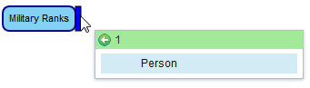

  When you release the mouse button, a sequence object is displayed on the canvas.

3. Click the sequence object on the canvas and, under **Extractor Properties**, open the **General** tab. Rename the sequence object as `Military Personnel`.
4. The final extractor rule is displayed on the canvas.

  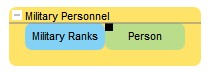

#### Adding proximity rules
{: #adding proximity rules}

Proximity rules to specify the maximum number of tokens that might occur between the desired terms. In text, each word or character is generally referred to as a token. The sentence "The CEO announced the earnings last week, missing analyst estimates by 5%." contains 15 tokens: 11 words separated by spaces, 3 special characters, and 1 number.

You might want to locate references to red brick houses, knowing that phrases such as house made of red brick, red house of brick and the brick on the house reflected red might appear in the text you are analyzing. Proximity rules can ensure that these phrases are extracted while excluding sentences or phrases that coincidentally include the target terms, for example, "The red car passed a house near the brick yard".

1. Right-click an extractor on the canvas and under one of the **Add** submenus, click **Proximity Rule**.
2. In the format `minimum-maximum`, specify the minimum and maximum number of words, special characters, or values to allow between terms. By default, the proximity pattern is set to match the number of tokens between the two numbers you specify in your range. If the desired proximity does not vary, you can change the setting. For example, enter `0-2`.
3. Select the new proximity rule. The **Extractor Properties** opens to the **Settings** tab where you can change the number range or convert to an exact number of tokens.

**Example 1:**

1. Create a dictionary called `Clerical title` that includes terms such as `Rabbi`, `Father`, and `Archbishop`.
2. Drag the **Person** extractor to right side of the **Clerical title** dictionary so that the new sequence will find titles followed by names. When you release the mouse button, a sequence object is displayed on the canvas.
3. Right-click **Clerical title** and click **Add After > Proximity Rule**. To capture terms such as `Archbishop of Canterbury`, `Robert Runcie`, specify the minimum and maximum number of tokens between words, in this case `0-5`.
4. Click the sequence on the canvas and then under **Extractor Properties**, open the **General** tab if it doesn't open automatically. Rename the sequence Clerics.

  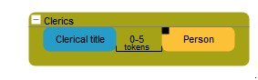

**Example 2:**

As a second example, select tweets that refer to Twitter names of industry analysts with a big data term. To accomplish this, create two dictionaries, one of Twitter usernames of analysts and a second of big data terms and combine them on the workspace canvas with a proximity of one to 25 tokens.

  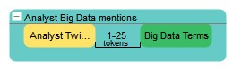


### Creating a union
{: #creating-a-union}

To combine extractors in a union:

1. Define two or more extractors on the canvas.
2. Click **Output** in the **Extractor Properties** pane to ensure that the number and names of output columns for each sequence or extractor are the same. In addition to having the same number of columns and identical column names, output columns in each sequence or extractor must have the same data type. In this context, data type is a span, number, string, character, date, or time. Note that you cannot edit these properties for an extractor or sequence while in a union.
3. On the canvas, without regard to order, click and drag one extractor or sequence above or below another one until the dark blue drop zone indicator indicates you can drop the extractor.

  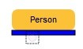

4. Release the mouse button to drop the extractor.
5. Drag and drop additional extractors or sequences into the union.

#### Union example
{: #union-example}

The term `Parties` in contracts can refer to two individuals, two organizations, or an individual and an organization. In order to extract information about the parties, you must define two extractors, `Party1` and `Party2`, to select either an individual or an organization.

1. Drag both the `Person` and the `Organization` extractors from the **Extractor** pane onto the canvas.
2. On the canvas, select each extractor in turn and on the **Output** tab of the **Extractor Properties**, rename the output columns so that the column definitions are the same for both.

  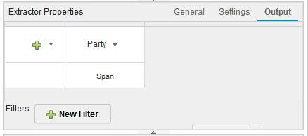

3. Drag the `Organization` extractor to the drop zone below the `Person` extractor.

  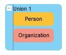

4. Select `Union 1` on the canvas and name it `Party 1` on the **General** tab of **Extractor Properties**.
5. Copy **Union 1** to create a second union and name it `Party 2`.
6. To look for the parties in the contracts, combine the two unions in a sequence as shown here. Between the two unions in the sequence is the literal `and`.

  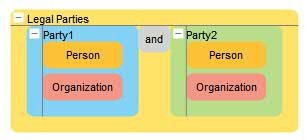

7. Name the new sequence `Legal Parties`.

## Running an extractor
{: #running-an-extractor}

To test your extractor, you can run it from the workspace and review the results to ensure the design meets your needs. After the design of the extractor is satisfactory, you can save it to the extractor library to be used in other projects.

To run an extractor from the workspace, right-click the extractor on the canvas and click **Run Selected** from the menu. Alternatively, select the extractor and click **Run Selected** from the canvas toolbar. To run multiple extractors, select them and click **Run Selected**. When the extractor has finished running, click the **Results** pane to view the output. The results are highlighted in the **Documents** pane as well.

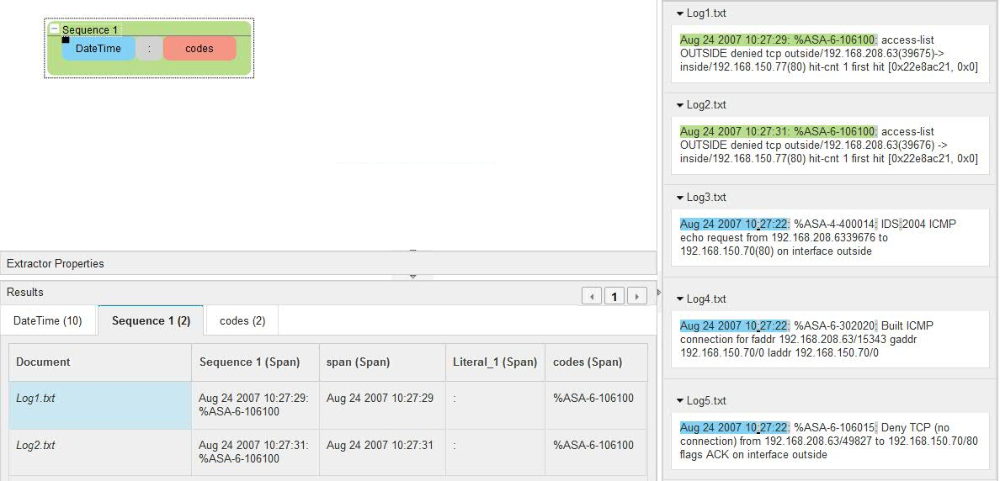

The result in each column is linked to the document in the **Documents** pane. To view the results for a column, select the column to adjust the view of the document to show the corresponding result highlighted in blue as shown below.

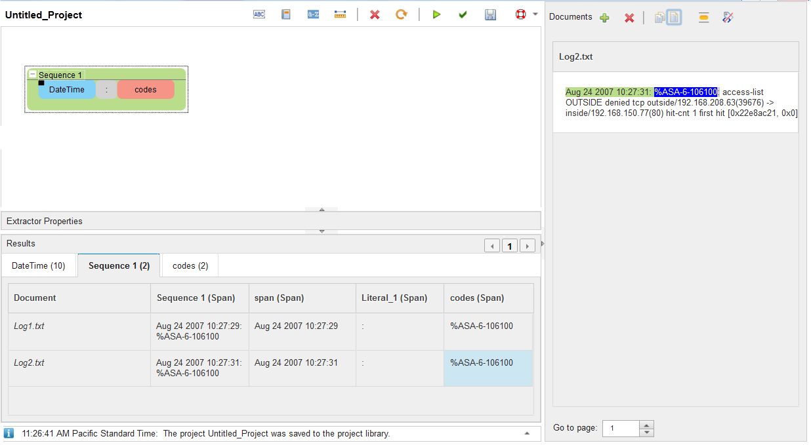

### Refining extractor results
{: #refining-extractor-results}

To aid or simplify your analysis, you can refine the information in the **Results** pane by manipulating the columns in the **Output** tab of the **Extractor Properties**. You can also rename columns and remove or consolidate duplicate or overlapping text to facilitate your analysis.

#### Renaming a column in the results display
{: #rename-a-column-in-the-results-display}

1. On the canvas, right-click the extractor that generated the results and click **Edit Output**.
2. From the column menu, select **Rename** or simply double click the column.
3. Enter the new column name to be displayed in the results.

#### Adding a string column
{: #adding-a-string-column}

1. On the canvas, right-click the extractor that generated the results and click **Edit Output**.
2. Click the **Manage Columns** menu  in the left column of the table.
3. Click **New Column**.

#### Adding a transformed output column
{: #adding-a-transformed-output-column}

You can transform the extractor output, for example, converting it all to lowercase. Do these transformations on the **Output** tab of the **Extractor Properties** pane.

1. On the canvas, right-click the extractor that generated the results and click Edit Output.
2. Click the drop-down menu in the header of the column that you want to transform and select the type of transformation that you want to do.

|Option|Description|
|---|---|
|**Trim**|Creates a column and trims the value returned by the selected column.|
|**Convert to String**|Creates a column and converts the value returned by the selected column to a string value.|
|**Convert to Lowercase String**|Creates a column and converts the value returned by the selected column to a lowercase string value.|
|**New Column From Single Column**|Creates a column that includes the specified number of characters or words to the left/right of the value of the column selected.|
|**New Column From Two Columns**|Creates a column from the spans that are between or overlapping the two input columns, or merges the entirety of the two columns. Span content can be one or more tokens.<br><br>Requirement: The second column for the New Column From Two Columns function must be from the extractor that is selected on the canvas.|

If you apply **Trim**, **New Column From Single Column**, or **New Column From Two Columns** to a selected column and then subsequently select **Convert to String** or **Convert to Lowercase String**, you will not get yet another new column. The string transformations will be applied instead to the new column that was generated from the previous **Trim** or **New Column** choices.
{: note}

#### Hiding a column from the results display
{: #hiding-a-column-from-the-results-display}

You can hide output columns on the **Output** tab of the **Extractor Properties** pane.

1. On the canvas, right-click the extractor that generated the results and click **Edit Output**.
2. Click the **Manage Columns** menu in the left column of the table.
3. Clear the check boxes for the columns you want to remove from the results display. These columns are hidden from the results, although the content is still extracted.

#### Deleting a column from the results display
{: #deleting-a-column-from-the-results-display}

1. On the canvas, right-click the extractor that generated the results and click **Edit Output**.
2. Click the **Manage Columns** menu in the left column of the table.
3. Click **Delete Column** and select the check boxes for the columns you want to remove from the results display.

#### Removing duplicate and overlapping results
{: #removing-duplicate-and-overlapping-results}

An extractor sometimes generates multiple rows for the same text because the text matches more than one dictionary entry. To remove or consolidate the duplicate entries, you must provide consolidation rules.

1. On the canvas, right-click the extractor that generated the results.
2. In the **Extractor Properties** pane, click **Output**.
3. Select **Manage overlapping matches**.
4. From the **Output column** list, select the column that is causing the extractor to generate the duplicate output.
5. From the **Method** list, select one of the following values:
    - **Contained Within** to keep the longest result.
    - **Not Contained Within** to keep the shortest result.
    - **Contains But Not Equal** to keep unique results of the same length.
    - **Exact Match** to keep one instance of each result.
    - **Left to Right** to keep the longest result, with the greatest number of terms from left - to right.

As an example, you are designing an extractor for documents that include references to military personnel. After you create and run a dictionary containing a list of military ranks, such as `Chief Warrant Officer`, `Warrant Officer`, and `Officer`, you see the following results for `Chief Warrant Officer John Doe`:

- Chief Warrant Officer John Doe
- Warrant Officer John Doe
- Officer John Doe

The terms `Warrant Officer` and `Officer` are found in the longer term `Chief Warrant Officer`, causing `Chief Warrant Officer John Doe` to satisfy all three dictionary entries and generate three rows of results. To retain the longest term, which represents the most significant rank, you specify the consolidation settings as follows.

1. From **Output column** select **Military Rank**
2. From **Method** select **Contained Within**

Your results now include only the row `Chief Warrant Officer John Doe`.

#### Filtering extraneous results
{: #filtering-extraneous-results}

An extractor sometimes produces unwanted results even though the pattern is a match. These unwanted results can often be recognized by other text near the match in the document.

To further restrict matches, create a filter.

1. On the canvas, right-click the extractor that generated the results and click **Edit Output**. The **Output** tab in **Extractor Properties** opens.
2. Choose to **Include** or **Exclude** results. **Include** is the default setting.
  - An include filter is a condition that must be met for a result to be included.
  - An exclude filter is a condition that must not be met for a result to be included.
3. From the first filter drop-down list, select the column that you want to apply the filter to.
4. In the next drop-down list, select the type of filter. Depending on the filter, the subsequent drop-down lists reflect the appropriate options.

|Option|Description|
|---|---|
|**length**|Filter according to whether the column content is shorter, longer, or equal to a specified number of characters or tokens.|
|**text**|Filter according to whether the text matches or contains a regular expression or dictionary from the canvas, or you can enter a new regular expression. You can also set case sensitivity.|
|**range**|Filter on the basis of specified criteria within a range of the specified column. For example, you might use **starts with** to narrow the results within matches so that you only get military rank matches that start with `Chief`.|

5. Once you complete your filter options, execute the extractor again to see how the results have changed.

Your Military Ranks extractor might produce a match for text Chief Warrant Officer John Doe, but you do not want to include results that have the word except preceding the match.

1. Create a dictionary with the term `except` and any other terms that you might want to use to exclude results.
2. Select **Military Ranks** from the canvas and open the **Output** tab under **Extractor Properties**.
3. Click **New Filter**.
4. Select **Exclude** and choose a column.
5. Select **range** and **occurs after**.
6. Select your dictionary that includes `except`.
7. Select the column and **between** `0` to `2` **tokens**.

This filter excludes any matches that have the word except within 0-2 tokens before a match.

  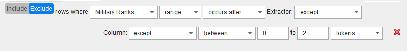

## Extracting in languages other than English
{: #extracting-in-languages-other-than-English}

To extract text from non-English documents, you can sometimes use or modify the provided extractors or define new extractors based on linguistic patterns. Also, if target terms are based on a pattern, you can design a sequence pattern.

You can use the workspace to build extractors to be used with any language, such as Spanish and French, that is based on tokens defined by white space and punctuation. For example, the results of using the Person extractor with Spanish text might extract names as shown here.

  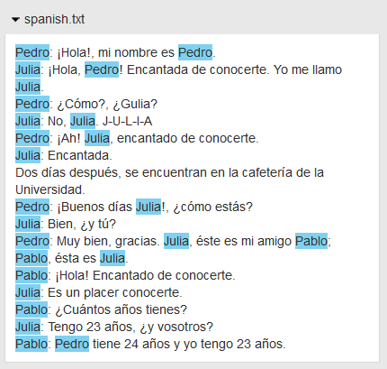

### Extending the provided extractors for use in a different language
{: #extending-the-provided-extractors-for-use-in-a-different-language}

If your target language is based on tokens defined by white space and punctuation, you can extend a provided extractor that has customization points or dictionaries by adding terms to the appropriate dictionaries in the target language.

<table id="ext_ling_supp__table_x23_dj3_3r"><thead><tr><th id="d981e2379">Provided extractor</th>
<th id="d981e2381">Included in folder:</th>
<th id="d981e2383">How to extend</th>
</tr>
</thead>
<tbody><tr><td headers="d981e2379 ">All generic extractors</td>
<td headers="d981e2381 "><span class="ph uicontrol">Generic extractors</span> </td>
<td headers="d981e2383 ">Define a regular expression for the target text
pattern. If the provided extractor produces results, create a union
with the provided extractor and the regular expression.</td>
</tr>
<tr><td headers="d981e2379 "><strong>Email address</strong>, <strong>Phone number</strong>, <strong>Zip
code</strong></td>
<td headers="d981e2381 "><strong>Named Entity Recognition </strong></td>
<td headers="d981e2383 ">Define a regular expression for the target text
pattern. If the provided extractor produces results, create a union
with the provided extractor and the regular expression.</td>
</tr>
<tr><td headers="d981e2379 "><strong>Currency</strong></td>
<td headers="d981e2381 "><strong>Named Entity Recognition </strong></td>
<td headers="d981e2383 ">Combine a decimal number extractor with a literal
to represent the local currency symbol in a sequence or define a regular
expression. If more than one currency symbol is required, use a dictionary
rather than a literal.</td>
</tr>
<tr><td headers="d981e2379 "><strong>Date and time</strong></td>
<td headers="d981e2381 "><strong>Named Entity Recognition </strong></td>
<td headers="d981e2383 "><p>For numeric formats, define a regular expression
for the target text pattern. </p>
<p>For alphabetic formats, define
a sequence using integers for the days and years and a mapping table
to represent the months. Use the full names and abbreviations for
each month in the mapping table. For example, map the French months <samp class="ph codeph">juillet</samp> and <samp class="ph codeph">juil</samp> to <samp class="ph codeph">juillet</samp> or <samp class="ph codeph">July</samp>,
if translating to English.</p>
</td>
</tr>
<tr><td headers="d981e2379 "><strong>City</strong>, <strong>County</strong>, <strong>Country</strong>, <strong>Person</strong>, <strong>Location</strong>, <strong>Organization</strong>, <strong>State
or province</strong>, <strong>Town</strong></td>
<td headers="d981e2381 "><strong>Named Entity Recognition </strong></td>
<td headers="d981e2383 "><p><strong>European and similar languages</strong> </p>
<p>Add
entries for the language to the appropriate dictionary. </p>
<p><strong>Arabic,
Japanese and similar languages</strong> </p>
</td>
</tr>
<tr><td headers="d981e2379 "><span class="ph uicontrol">Continent</span></td>
<td headers="d981e2381 "><span class="ph uicontrol">Named Entity Recognition </span></td>
<td headers="d981e2383 ">Define a dictionary and specify entries to contain
the names of the continents in the target language.  If English results
are also to be included, form a union between the provided continent
extractor with your custom one.</td>
</tr>
<tr><td headers="d981e2379 "><span class="ph uicontrol">Address</span></td>
<td headers="d981e2381 "><span class="ph uicontrol">Named Entity Recognition </span></td>
<td headers="d981e2383 ">Define a sequence composed of the parts of the
address, such as street, city, country and postal code.  </td>
</tr>
<tr><td headers="d981e2379 ">All financial extractors</td>
<td headers="d981e2381 "><span class="ph uicontrol">Finance actions</span></td>
<td headers="d981e2383 ">These extractors cannot be extended.
</td>
</tr>
<tr><td headers="d981e2379 ">All machine-data analytics extractors</td>
<td headers="d981e2381 "><span class="ph uicontrol">Machine Data Analytics</span></td>
<td headers="d981e2383 ">When possible, define a regular expression or
sequence. The remaining extractors cannot be extended.
</td>
</tr>
<tr><td headers="d981e2379 ">All sentiment analysis extractors</td>
<td headers="d981e2381 "><span class="ph uicontrol">Sentiment Analysis - General</span><span class="ph uicontrol">Sentiment
Analysis - Surveys</span></td>
<td headers="d981e2383 ">Add entries in the target language to the <span class="ph uicontrol">Customize
Terms</span> tab on the <span class="ph uicontrol">Extractor Properties</span> pane.</td>
</tr>
</tbody>
</table>

## Deploy advanced rules model to {{site.data.keyword.nlushort}}
{: #deploy-adv-rule-model-to-nlu-cloud}

Deploying an advanced rules model to {{site.data.keyword.nlushort}} is deprecated. As of June 10, 2021, you will not be able to deploy advanced rules models to {{site.data.keyword.nlushort}}.
{: deprecated}

### Export advanced rules project
{: #export-adv-rule-proj}

These instructions detail how to export an advanced rules model from the {{site.data.keyword.knowledgestudiofull}} for {{site.data.keyword.icp4dfull_notm}} Advanced Rules Editor, but are common instructions for the public cloud.

1. Open the **Advanced Rules** workspace
1. Confirm that all models that you want to export are on the Canvas, and are not saved to the "Extractors" pane, except for provided extractors
1. Right click the project that you want to export on the "Projects" pane
1. Click `Export Project`
   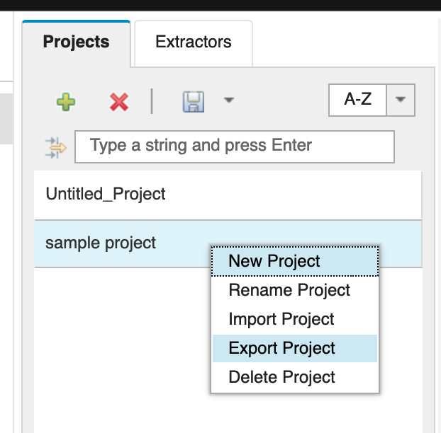
1. Check "Include Documents" if you need to, input a file name and click the `OK` button
1. Choose `Save as File` on your browser's popup dialog, then a ZIP file is saved on your computer (usually in a "Download" folder)

When exporting an Advanced Rules Editor project, only concepts that exist on the Canvas are included in the exported ZIP file. If you want to include concepts that have been saved under Categories, please make sure to add those to the Canvas as well, before exporting.
{: important}

### Import advanced rules project
{: #import-adv-rule-proj}

These instructions detail how to import an advanced rules model to {{site.data.keyword.knowledgestudiofull}} on public cloud.

1. Create an **Advanced Rules** workspace
   - Complete step 1 of [Creating an advanced rules model](/docs/watson-knowledge-studio?topic=watson-knowledge-studio-create-advanced-rules-model#create-advanced-rules-model-procedure)
1. Right click somewhere in the "Projects" tab and click `Import Project`
1. Input a project name, check "Include Documents" if you need to, and select a ZIP file exported in **Export advanced rules project** above

### Export model file from project
{: #export-model-from-proj}

1. Complete step 6 of [Creating an advanced rule model](/docs/watson-knowledge-studio?topic=watson-knowledge-studio-create-advanced-rules-model#create-advanced-rules-model-procedure)

### Deploy and call model file to {{site.data.keyword.nlushort}}
{: #deploy-and-call-model-to-nlu}

1. Refer to the {{site.data.keyword.nlushort}} documentation for [Analyzing text with advanced rules (Beta)](/docs/natural-language-understanding?topic=natural-language-understanding-customizing#advanced-rules)
