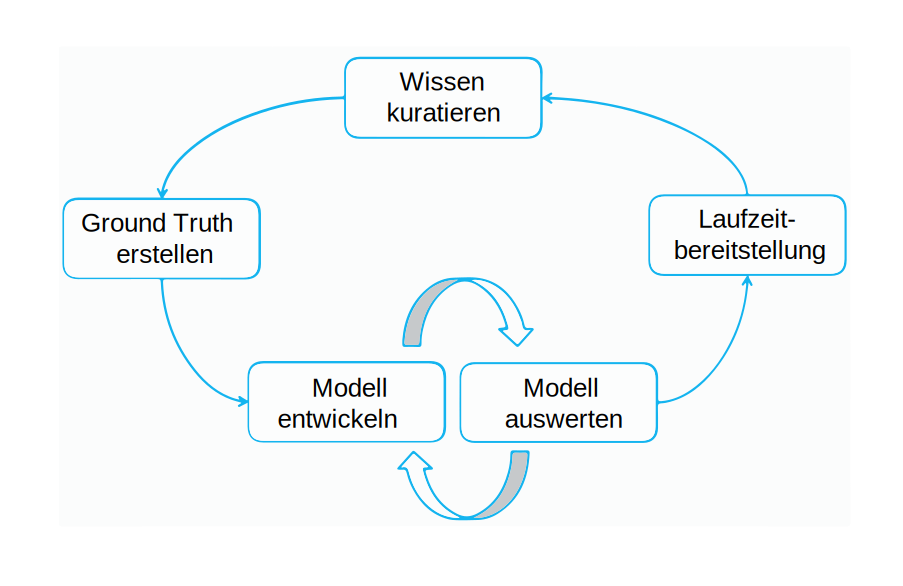

---

copyright:
  years: 2015, 2018
lastupdated: "2018-07-19"

---

{:shortdesc: .shortdesc}
{:new_window: target="_blank"}
{:tip: .tip}
{:pre: .pre}
{:codeblock: .codeblock}
{:screen: .screen}
{:javascript: .ph data-hd-programlang='javascript'}
{:java: .ph data-hd-programlang='java'}
{:python: .ph data-hd-programlang='python'}
{:swift: .ph data-hd-programlang='swift'}

Diese Dokumentation bezieht sich auf {{site.data.keyword.knowledgestudiofull}} on {{site.data.keyword.cloud}}. Die Dokumentation für die Vorgängerversion {{site.data.keyword.knowledgestudioshort}} on {{site.data.keyword.IBM_notm}} Marketplace kann über [diesen Link](https://{DomainName}/docs/services/knowledge-studio/annotate-documents.html){: new_window} aufgerufen werden.
{: tip}

# Annotationen einrichten
{: #annotate-documents}

Das Annotieren von Dokumenten sollte von Benutzern ausgeführt werden, die sich in dem jeweiligen Fachgebiet und mit der zugehörigen Fachsprache auskennen.
{: shortdesc}

Führen Sie die folgenden Tasks aus, damit Annotatorbenutzer auf den Arbeitsbereich zugreifen können:

- Laden Sie Fachleute zu der {{site.data.keyword.knowledgestudioshort}}-Instanz ein, die Sie verwenden.
- Ordnen Sie Annotatorbenutzer den Annotationsgruppen zu, die von ihnen annotiert werden sollen.
- Erstellen Sie eine Task, die den Annotatorbenutzer den Dokumenten in der Gruppe zuordnet, die annotiert werden sollen.

    > **Achtung:** Für Annotatorbenutzer ist Ihr Arbeitsbereich beim Anmelden an {{site.data.keyword.knowledgestudioshort}} erst sichtbar, nachdem Sie den Annotatorbenutzern explizit Tasks zugeordnet haben.

Ihre Benutzer (die Annotatorbenutzer) müssen sich in das [Annotieren von Dokumenten](/docs/services/watson-knowledge-studio/user-guide.html) einarbeiten. Dazu gehören auch detaillierte Kenntnisse der Vorgehensweise zum Annotieren von Dokumenten.

## Modelllebenszyklus
{: #wks_lifecycle}

Das Modell, das Sie mit {{site.data.keyword.knowledgestudioshort}} erstellen ist eine Softwarekomponente, die in die Pipeline für die Verarbeitung natürlicher Sprache (Natural Language Processing, NLP) eingebunden werden kann.

Mit {{site.data.keyword.knowledgestudioshort}} können Sie Modelle für neue Fachgebiete erstellen, auswerten und optimieren. Ein Modell fügt Annotationen (Metadaten) zum Text hinzu, die als Inhalte in natürlicher Sprache dargestellt werden. Die Annotationen identifizieren Erwähnungen relevanter Entitäten in Ihren fachspezifischen Inhalten sowie die Beziehungen zwischen diesen Entitäten und die Koreferenzen von Erwähnungen auf dieselbe Entität. Diese Annotationen können von Anwendungen genutzt werden. um Text automatisch zu analysieren und zu verarbeiten. Anwendungsbenutzer können von dieser Analysestufe profitieren, die das Extrahieren von Bedeutungen, das Gewinnen von Einsichten und das Finden von Antworten im Kontext der natürlichen Sprache ermöglicht.

Die Erstellung eines Modells ist ein iterativer und mehrstufiger Prozess, der mehrere Schritte umfasst: Wissen kuratieren, Ground Truth generieren, Modell entwickeln, Modell auswerten und in der Laufzeit bereitstellen.

### Durchgängige Anpassung an das Fachgebiet
{: #wks_lifecycle__wks_lifecycleS6}

Das folgende Diagramm fasst die Interaktionen zwischen diesen fünf Phasen der Modellentwicklung und die typischen Aktivitäten in den einzelnen Phasen zusammen.

 Abbildung 2. Eine Zusammenfassung der fünf Phasen in der Modellentwicklung und der Aktivitäten, die in den einzelnen Phasen ausgeführt werden.

### Wissen kuratieren
{: #wks_lifecycle__wks_lifecycleS1}

Diese Phase, die außerhalb von {{site.data.keyword.knowledgestudioshort}} stattfindet, umfasst den Prozess zum Auswählen, Sammeln, Aufbewahren und Verwalten relevanter Inhalte für ein bestimmtes Fachgebiet. Bei der Kuratierung gewinnen die Daten einen Mehrwert, d. h. sie werden zu verlässlichen Informationen und gesichertem Fachwissen.

### Ground Truth generieren
{: #wks_lifecycle__wks_lifecycleS2}

In dieser Phase werden {{site.data.keyword.knowledgestudioshort}}-Tools und Best Practices eingesetzt, um eine Sammlung geprüfter Daten zu erstellen, die verwendet werden können, um eine {{site.data.keyword.watson}}-Lösung für ein bestimmtes Fachgebiet zu erstellen. Die Richtigkeit dieses geprüften Datenpools, der als *Ground Truth* oder *goldene Dokumentbasis* bezeichnet werden, ist von entscheidender Bedeutung. Ungenauigkeiten in der Ground Truth führen zu Ungenauigkeiten in den Anwendungen, die auf die Ground Truth angewiesen sind.

Ein grundlegender Bestandteil der Anpassung von {{site.data.keyword.watson}} an ein neues Fachgebiet ist die Vermittlung von Wissen über relevante Entitäten im Inhalt Ihres Fachgebiets, über die Beziehungen zwischen diesen Entitäten und über die gegenseitigen Koreferenzen der Entitäten. Zum Sammeln dieses Wissens gehören die folgenden Aktivitäten:

- In Zusammenarbeit mit Experten des Fachgebiets die folgenden Ressourcen erstellen oder vorhandene Ressourcen identifizieren, die wiederverwendet oder an Ihr Fachgebiet angepasst werden können:

  - Annotationsrichtlinien und Beispiele, die Annotatorbenutzern zeigen, wie Wörter und Textpassagen im Inhalt des Fachgebiets annotiert werden sollen.
  - Typsysteme, die fachspezifische Typen (Objekte) und Features (Datenklassifizierungen) definieren, die durch Textanalyse im Inhalt des Fachgebiets aufgespürt werden können. Das Typsystem legt fest, welche Annotationstypen ein Annotatorbenutzer in Dokumenten hinzufügen kann.
  - Wörterverzeichnisse mit Begriffen, die im Inhalt des Fachgebiets als äquivalente Begriffe behandelt werden sollen.

- Erstellen eines Korpus von Dokumenten, die für die Inhalte des Fachgebiets repräsentativ sind.
- Dokumente auf der Grundlage der Wörterverzeichnisse vorannotieren, die Sie in einem {{site.data.keyword.knowledgestudioshort}}-Arbeitsbereich hinzufügen. Nachdem Sie ein Modell für maschinelles Lernen erstellt haben, können Sie das Modell zum Vorannotieren der Dokumente verwenden, die Sie zum Korpus hinzufügen. Als Vorannotierung wird das maschinelles Annotieren eines Dokument bezeichnet, soweit dies möglich ist, bevor ein Modell für maschinelles Lernen für die zielgenaue Annotierung zur Verfügung steht. Die Vorannotierung kann den Arbeitsaufwand der Annotatorbenutzer verringern, indem manche Annotationen durch einfaches Überprüfen der Richtigkeit maschineller Annotationen ersetzt wird.
- Dokumente auf verschiedene Annotatorbenutzer verteilen, die dann mit dem Ground Truth-Editor von {{site.data.keyword.knowledgestudiofull}} manuell Annotationen in kleinen Dokumentgruppen hinzufügen.
- Ergebnisse der Annotatorbenutzer vergleichen und Konflikte beheben. Die Beurteilung, die in dieser Phase durchgeführt wird, stellt sicher, dass zutreffend und konsistent annotierte Dokumente in die Ground Truth hochgestuft und dort zum Trainieren und Testen eines Modells für maschinelles Lernen eingesetzt werden.

### Modell entwickeln
{: #wks_lifecycle__wks_lifecycleS3}

In dieser Phase werden {{site.data.keyword.knowledgestudioshort}}-Tools eingesetzt, um ein Modell zu erstellen. Nachdem die Ground Truth erstellt ist, können die Arbeitsergebnisse der Annotatorbenutzer verwendet werden, um einen Algorithmus für das automatische Hinzufügen von Annotationen in umfangreichen Dokumentsammlungen zu trainieren (z. B. in Sammlungen, die Millionen von Dokumenten umfassen).

### Modell auswerten
{: #wks_lifecycle__wks_lifecycleS4}

In dieser Phase werden {{site.data.keyword.knowledgestudioshort}}-Tools eingesetzt, um das Modell zu optimieren und die Leistung des Modells zu verbessern. Die von dem Modell generierten Ergebnisse werden anhand einer Testdokumentgruppe überprüft, die aus Ground Truth-Dokumenten besteht. Durch die *Richtigkeitsanalyse* werden die Ursachen für Annotationsfehler ermittelt. Mithilfe der *Spielraumanalyse* können Sie beurteilen, welche Fehler behoben werden sollten und mit welchen Modelloptimierungen die größten Verbesserungen erzielt werden können. Es können wiederholt Anpassungen vorgenommen werden, um die Leistung zu verbessern, bis ein akzeptabler Genauigkeitsgrad erreicht ist.

### Modell bereitstellen
{: #wks_lifecycle__wks_lifecycleS5}

In dieser Phase werden Komponenten exportiert, die die Ausführung des Modells in Laufzeitumgebungen für manuelles Lernen ermöglichen und das Modell für andere kognitive {{site.data.keyword.watson}}-Anwendungen zugänglich machen. Sie können beispielsweise das Modell für maschinelles Lernen für die Verwendung durch den {{site.data.keyword.nlufull}}-Service oder {{site.data.keyword.discoveryfull}}-Service bereitstellen oder das Modell für die Verwendung in {{site.data.keyword.ibmwatson_notm}} Explorer exportieren.

## Annotationstask erstellen
{: #wks_hatask}

Bevor Annotatorbenutzer mit dem Hinzufügen von Annotationen zu Dokumenten beginnen können, muss der für die Annotationsverarbeitung zuständige Manager eine Annotationstask erstellen.

### Informationen zu diesem Vorgang
{: #wks_hatask_about}

Die Annotationstask gibt an, welche Dokumente annotiert werden sollen. Um die Leistungen der Annotatorbenutzer zu vergleichen und zu prüfen, wie konsistent die Annotationsrichtlinien angewendet werden, müssen Sie mindestens zwei Annotatorbenutzer in die Task einbeziehen. Darüber hinaus muss ein bestimmter Prozentsatz von Dokumenten in allen Annotationsgruppen enthalten sein, die Sie zu der Task hinzufügen (den Prozentsatz der Überschneidung geben Sie beim Erstellen der Annotationsgruppen an).

#### Wichtig
{: #wks_hatask_important}

- Eine Annotationstask ist ein zeitbasiertes Konzept, das es Annotatorbenutzern ermöglicht, Text in abgegrenzten Bereichen zu annotieren. Damit soll außerdem sichergestellt werden, dass nur genehmigte Annotationen in die Ground Truth hochgestuft werden.
- Eine Annotationsgruppe kann jeweils in eine aktive Task einbezogen werden. Um eine Annotationsgruppe, die in einer Task enthalten ist, zu einer anderen Task hinzuzufügen, müssen Sie die Task löschen, in der die Annotationsgruppe bereits aktiv ist.
- Wenn Sie das Benutzerkonto eines Annotatorbenutzers löschen, hat dies Auswirkungen auf die Annotationen des betreffenden Benutzers. Alle Annotationen in Dokumenten, die zwar diesem Benutzer zugeordnet sind, aber noch nicht in die Ground Truth hochgestuft wurden, werden gelöscht.
- Wenn die Einstellungen für das Typsystem oder den Ground Truth-Editor geändert werden, nachdem Sie eine Task für Annotatorbenutzer erstellt haben, müssen Sie entscheiden, ob die Änderungen an die Task weitergegeben werden sollen. Änderungen des Typsystems können sich auf Annotationen auswirken, d. h. es kann erforderlich werden, dass Annotatorbenutzer die ihnen zugeordneten Dokumente überarbeiten und aktualisieren.
- Wenn Wörterverzeichnisse geändert werden, werden diese Änderungen nicht in die aktuelle Annotationstask übernommen. Um Ressourcenänderungen in die Ground Truth zu übernehmen, müssen Sie eine neue Annotationstask erstellen.
- Jeder Arbeitsbereich kann maximal 256 Annotationstasks enthalten.

### Vorgehensweise
{: #wks_hatask_procedure}

So erstellen Sie eine Annotationstask:

1. Melden Sie sich als {{site.data.keyword.knowledgestudioshort}}-Administrator an und wählen Sie Ihren Arbeitsbereich aus.
1. Wählen Sie die Seite **Modell für maschinelles Lernen** > **Annotationstasks** aus.
1. Klicken Sie auf **Task hinzufügen**. Geben Sie einen beschreibenden Namen für die Task an und wählen Sie das Datum aus, an dem die Task abgeschlossen sein muss.
1. Klicken Sie auf **Erstellen**. Eine Liste der verfügbaren Annotationsgruppen sowie die Namen der diesen Gruppen zugeordneten Annotatorbenutzer werden angezeigt.
1. Wählen Sie jede Annotationsgruppe aus, die Sie in die Task einbeziehen möchten, und klicken Sie auf **Task erstellen**.

    Die Häkchen neben den Namen der Annotationsgruppen erwecken den Eindruck, als seien alle Annotationsgruppen standardmäßig ausgewählt. Dies trifft jedoch nicht zu. Sie müssen die Annotationsgruppen, die Sie einbeziehen möchten, explizit auswählen.
    {: tip}

### Nächste Schritte
{: #wks_hatask_next}

Nachdem die Task erstellt ist, können Sie zur Seite **Modell für maschinelles Lernen** > **Annotationstasks** zurückkehren, um die Arbeitsfortschritte der einzelnen Annotatorbenutzer anzuzeigen. Außerdem können Sie die folgenden Tasks ausführen:

- Genehmigte Dokumente mit Überschneidungen zwischen Annotationsgruppen überprüfen, um Annotationskonflikte zu beheben
- Eine Task öffnen, um Annotationsgruppen zu der Task hinzuzufügen (stellen Sie dabei sicher, dass die hinzugefügten Annotationsgruppen Überschneidungen mit Dokumenten in den ursprünglichen Annotationsgruppen enthalten)

Auf der Registerkarte **Einstellungen** in der Hauptnavigation können Sie die folgenden Informationen angeben:

- Vorgaben für die Verwendung von Farben und Tastenkombinationen im Ground Truth-Editor definieren
- Einen Schwellenwert für die Übereinstimmung der Annotatoren angeben und anschließend eine Task öffnen, um zu prüfen, wie konsistent dieselben Dokumente von mehreren Annotatorbenutzern annotiert wurden
- Eine URL angeben, um Ihre Annotationsrichtlinien mit dem Ground Truth-Editor zu verbinden

## Vorgaben für den Ground Truth-Editor konfigurieren
{: #wks_hapref}

Ein Projektleiter kann Vorgaben für die Verwendung von Farben und Tastenkombinationen im Ground Truth-Editor festlegen.

### Vorgehensweise
{: #wks_hapref_procedure}

So geben Sie Vorgaben für die grafische Darstellung beim Arbeiten mit dem Ground Truth-Editor an:

1. Melden Sie sich als {{site.data.keyword.knowledgestudioshort}}-Administrator an und wählen Sie Ihren Arbeitsbereich aus.
2. Wählen Sie im linken Navigationsbereich **Einstellungen** > **Einstellungen für Dokumentannotation** aus.
3. Wählen Sie die Registerkarte **Entitätstypen** oder **Beziehungstypen** aus.
4. Wählen Sie den Entitäts- oder Beziehungstyp aus, den Sie ändern möchten, und klicken Sie anschließend auf **Tastenkombinationen und Farben bearbeiten**. Für jeden Typ können Sie Folgendes definieren:

    - Tastenkombination (`<key>`), die ein Benutzer eingeben kann, um die Typbezeichnung auf hervorgehobenen Text anzuwenden. Wenn Sie beispielsweise das Tastenkürzel `o` für `ORGANISATION` definieren, kann der Benutzer Text auswählen und anschließend die Taste `o` drücken, um den Entitätstyp `ORGANISATION` auf den hervorgehobenen Text anzuwenden. Wenn Sie einen Großbuchstaben als Tastenkürzel zuweisen, muss der Benutzer die Tastenkombination `Umschalttaste + <key>`.
    - Textfarbe. Stellen Sie sicher, dass die Textfarbe im Kontrast zur Hintergrundfarbe steht, damit die hinzugefügte Bezeichnung erkennbar ist.
    - Hintergrundfarbe. Beim Annotieren wird die von Ihnen hinzugefügte Entitätsbezeichnung mit dieser Farbe hinterlegt.

    Beim Annotieren von Dokumenten können die definierten Tastenkombinationen von Annotatorbenutzern verwendet werden, um schnell und einfach Annotationen hinzuzufügen. Die Annotationsbeschriftung und die Textfarben erleichtern den Annotatoren das Erkennen der Typen, nachdem Annotationen zu einem Dokument hinzugefügt wurden.
    - Wenn Sie vermeiden möchten, dass die Annotatorbenutzer bestimmte Entitäts- oder Beziehungstypen den Erwähnungen zuordnen, können Sie diese Typen im Ground Truth-Editor ausblenden. Dadurch wird die Liste der für die Benutzer angezeigten Typoptionen kürzer und übersichtlicher. Um dies zu erreichen, wählen Sie das Kontrollkästchen **Aktiv** für den betreffenden Typ ab.

    Beim Zuordnen neuer Tastenkombinationen und Farben können Sie eine Vorschau der Änderungen anzeigen.

5. Außerdem können Sie die Standardfarbe für die Hervorhebung von Auswahlen ändern. Die Hervorhebungsfarbe wird für den Rahmen verwendet, in den der von Ihnen ausgewählte Text eingeschlossen wird. Standardmäßig wird der Rahmen hellblau dargestellt. Sie können diese Farbe auf der Registerkarte **Auswahl hervorheben** ändern, damit die Begrenzung des ausgewählten Texts leichter zu erkennen ist.

#### Zugehörige Tasks
{: #wks_hapref_related}

[Typsystem ändern, ohne von Annotatorbenutzern erstellte Annotationen zu verlieren](/docs/services/watson-knowledge-studio/improve-ml.html#wks_projtypesysmod)

## Schwellenwert für die Übereinstimmung der Annotatoren festlegen
{: #wks_haiaathresh}

Als Hilfe für die Entscheidung, ob eine annotierte Dokumentationsgruppe akzeptiert oder abgelehnt werden soll, können Sie einen Schwellenwert für die Übereinstimmung der Annotatoren (Inter-Annotator Agreement, IAA) angeben. Dieser Schwellenwert ermöglicht das Vergleichen des Scores für die Übereinstimmungswerts de Annotatoren mit dem vom System berechneten IAA-Score.

### Informationen zu diesem Vorgang
{: #wks_haiaathresh_about}

Geben Sie einen Auswertungsschwellenwert an, um die Abweichung der Annotierung eines Dokuments durch verschiedene Annotatorbenutzer zu vergleichen. Wenn die Annotationen eines Annotatorbenutzers so stark von den Annotationen eines anderen Benutzers abweichen, dass sich ein niedriger Score ergibt, wird dies als fehlende Übereinstimmung der Annotatoren gewertet. Die fehlende Übereinstimmung muss überprüft und behoben werden.

### Vorgehensweise
{: #wks_haiaathresh_procedure}

So legen Sie den Schwellenwert für die Übereinstimmung der Annotatoren fest:

1. Melden Sie sich als {{site.data.keyword.knowledgestudioshort}}-Administrator an und wählen Sie Ihren Arbeitsbereich aus.
1. Wählen Sie die Registerkarte **Einstellungen** > **IAA-Einstellungen** aus.
2. Geben Sie einen Wert zwischen 0 und 1 an (z. B. `0,5` oder `0,8`) und klicken Sie anschließend auf **Speichern**.

## Verbindung zu Annotationsrichtlinien herstellen
{: #wks_haguidelines}

Nachdem Sie Annotationsrichtlinien für Ihr Projekt erstellt haben, können Sie {{site.data.keyword.knowledgestudioshort}} so konfigurieren, dass eine Verbindung zu den Richtlinien hergestellt wird. Annotatorbenutzer können dann beim Annotieren von Dokumenten auf die Richtlinien zurückgreifen, um die richtigen Annotationen auszuwählen. Außerdem bieten die Richtlinien Hilfestellung für die Behebung von Annotationskonflikten in Dokumenten mit Überschneidungen.

### Vorgehensweise
{: #wks_haguidelines_procedure}

So verbinden Sie den Ground Truth-Editor und das Beurteilungstool mit Ihren Annotationsrichtlinien:

1. Melden Sie sich als {{site.data.keyword.knowledgestudioshort}}-Administrator an und wählen Sie Ihren Arbeitsbereich aus.
1. Wählen Sie die Registerkarte **Einstellungen** > **Richtlinien für Annotationen** aus.
1. Geben Sie die URL des Standorts an, an dem Ihre Richtlinien gehostet werden.
1. Klicken Sie auf **Speichern**. Das System verbindet den Ground Truth-Editor und das Beurteilungstool mit Ihren Annotationsrichtlinien. Entsprechend den Zugriffsberechtigungen für Benutzer, die Sie beim Erstellen der Richtlinien festgelegt haben, können Annotatorbenutzer und Arbeitsbereichsadministratoren gegebenenfalls die Richtlinien öffnen und aktualisieren, um Erläuterungen und Beispiele hinzuzufügen.

### Annotationsrichtlinien
{: #wks_guidelines}

Es gibt kein vorgeschriebenes Format zum Dokumentieren der Richtlinien. Die Richtlinien sollten jedoch ausführliche Beispiele enthalten. Annotatorbenutzer müssen genau nachvollziehen können, welcher Entitätstyp im jeweiligen Kontext auf eine Erwähnung anzuwenden ist und welche Beziehungstypen für ein bestimmtes Erwähnungspaar gelten. Beispiele aus dem Kontext des jeweiligen Fachgebiets sind häufig die beste Methode, um deutlich zu machen, welche Annotationen ausgewählt werden sollten.

Annotationsrichtlinien sind nicht statisch. Im Verlauf Ihres Projekts werden vermutlich Instanzen von Erwähnungen und Beziehungen erkannt, die in den Richtlinien nicht oder nicht korrekt erfasst sind. Außerdem werden womöglich Inkonsistenzen zwischen mehreren Annotatorbenutzern auftreten, die die Richtlinien verschieden interpretieren. Durch das Aktualisieren der Richtlinien in solchen Fällen kann die Richtigkeit und Konsistenz der Annotationen im Laufe der Zeit verbessert werden.

Dokumente können erst als Ground Truth eingestuft werden, nachdem alle durch abweichende Annotationen der verschiedenen Annotatorbenutzer verursachten Konflikte behoben wurden. Eine wichtige Methode zur Behebung dieser Konflikte ist das klärende Gespräch über die Ursachen der Abweichungen, damit Annotatorbenutzer aus den Fehlern lernen können. Die Verbesserung und Klarstellung der Richtlinien kann dazu beitragen, die Zahl der Konflikte zu verringern und dafür zu sorgen, dass zutreffend und konsistent annotierte Dokumente in die Ground Truth hochgestuft werden.

Als Hilfe für die Verwaltung der Richtlinien können Sie potenziell umfangreiche Richtliniendokumente in mehrere Teile aufteilen (z. B. Annotationsrichtlinien für Entitäten, Annotationsrichtlinien für Beziehungen und Annotationsrichtlinien für Koreferenzen zwischen Erwähnungen). In einem Bereich vorgenommene Änderungen müssen ausgewertet und mit Änderungen abgeglichen werden, die in einem anderen Bereich vorgenommen wurden. Wenn Sie beispielsweise einen Entitätstyp hinzufügen, überprüfen Sie die Annotationsrichtlinien für Beziehungstypen und geben Sie an, in welcher Beziehung der Entitätstyp zu anderen Entitätstypen stehen kann.

### Beispiel für Annotationsrichtlinien
{: #wks_guidelinesexample}

Für Annotationsrichtlinien sind in den meisten Fällen zahlreiche Detailinformationen und Beispiele erforderlich, um eine konsistente Annotierung von Text durch Annotatorbenutzer sicherzustellen.

Das vorliegende Beispiel enthält eine einfache Richtlinie, die für ein kleines Fachgebiet mit Berichten über Verkehrsunfälle erstellt wurde.

#### Taskziele
{: #wks_guidelinesexample__annotgoals}

- Projektmitarbeiter mit dem iterativen Prozess für manuelle Annotation und für die Optimierung eines Modells für maschinelles Lernen vertraut machen.
- Dokumente aus der Automobilbranche mit dem Ground Truth-Editor annotieren und mithilfe der Annotationen ein Modell für maschinelles Lernen trainieren. Die Entitätstypen, Beziehungstypen und Koreferenzen der Entitäten nach Bedarf annotieren.

#### Schreibweisen für Richtlinien
{: #wks_guidelinesexample__annotnotation}

- Eckige Klammern [ ] geben den Umfang der Annotation an, wenn nicht der ganze, in Anführungszeichen eingeschlossene Text annotiert wird.

    Negationen bei Bedarf einbeziehen (z. B. `[keine Verletzungen]UNFALLERGEBNIS`). Im Typsystem wird keine Entitätsklasse zum Darstellen von Negationen verwendet.

#### Entitätstypen
{: #wks_guidelinesexample__annottype}

Im Typsystem werden weder untergeordnete Entitätstypen oder -rollen verwendet noch Erwähnungstypen oder -klassen.

<table summary="Diese Tabelle beschreibt die Entitätstypen.">
  <caption>Tabelle 1. Entitätstypen</caption>
  <tr>
    <th style="vertical-align:bottom; text-align:left" width="24%" id="d1735e810">Entitätstyp</th>
    <th style="vertical-align:bottom; text-align:left" width="38%" id="d1735e812">Richtlinien</th>
    <th style="vertical-align:bottom; text-align:left" width="38%" id="d1735e814">Beispiele</th>
  </tr>
  <tr>
    <td headers="d1735e810">
      
UNFALLERGEBNIS

    </td>
    <td headers="d1735e812">
      
Eine Folge (Konsequenz) eines Unfalls. Gilt sowohl für Menschen (z. B. Tod) als auch für Fahrzeuge (z. B. verbeult). Kann die Begriffe 'abgeschleppt' und 'Airbag wurde ausgelöst' als Indikatoren für den Umfang der Beschädigung, sowie 'ins Krankenhaus
eingeliefert' (nicht ins Bestattungsinstitut) als Indikatoren für die Schwere der Verletzung enthalten. Kann eine Negation
enthalten.

    </td>
    <td headers="d1735e814">
      
'[Todesfall]', '[Verletzung]', 'anhaltend [Totalschaden]', '[keine Verletzungen]', '[abgeschleppt], weil nicht mehr
fahrtüchtig [wegen Unfallschaden]', '[nicht abgeschleppt]', 'Airbag wurde [nicht ausgelöst]' (der Airbag muss TEIL_DES_FAHRZEUGS sein
und in der Beziehung beschädigtDurch zu diesem UNFALLERGEBNIS stehen), sowie Anzeichen des Schweregrads.

    </td>
  </tr>
  <tr>
    <td headers="d1735e810">
      
BEDINGUNG

    </td>
    <td headers="d1735e812 ">
      
Wetter- oder Straßenbedingungen; ein Aspekt des Schauplatzes, der sich auf die Wahrscheinlichkeit für das Eintreten eines Unfalls
auswirken und sich von Tag zu Tag ändern kann (unabhängig vom Fahrzeug und vom Fahrer).

      
Kann ein Fehler des Fahrzeugführers oder
eine technische Fehlfunktion sein und muss als problematisch erscheinen. Sollte STRUKTUR ausschließen.

    </td>
    <td headers="d1735e814">
      
'trocken', 'regnerisch', 'Bauarbeiten', 'hohes Verkehrsaufkommen', 'Tageslicht', jedoch nicht 'mit Grasbewuchs' oder
'alkoholisiert'.

'Reifenpanne', 'übersteuert' (durch Gegenlenken), 'eingeschlafen', 'alkoholisiert', '[konnte dem Straßenverlauf
nicht folgen]BEDINGUNG in einer [Kurve]STRUKTUR", '[verließ] die Spur' oder den Standstreifen, jedoch nicht 'versuchte zu überholen', es sei denn
dieser Ausdruck wird ergänzt durch 'ohne ausreichenden Abstand' oder eine ähnliche Angabe, und nicht
'verließ die Fahrbahn', was einen UNFALL darstellt.

    </td>
  </tr>
  <tr>
    <td headers="d1735e810">
      
VORFALL

    </td>
    <td headers="d1735e812">
      
Die konkrete Erwähnung einer Kollision oder einer eindeutig unangebrachten
und zerstörerischen Fahrzeugbewegung, wie das Abkommen von der Fahrbahn oder ein anderer schädlicher Vorfall,
zum Beispiel ein Fahrzeugbrand. 

      
Erstellen Sie keine Koreferenzen für nicht identische
Bewegungen wie 'kollidierte', 'stieß zurück' und 'kam schließlich zum Stillstand', auch wenn diese Erwähnungen
in engem Zusammenhang stehen.

      
Schließen Sie STRUKTUR aus dem Umfang aus; zum Beispiel
'[kam zum Stillstand]VORFALL in einem [Graben]STRUKTUR' oder '[blieb stehen]VORFALL an der
[Leitplanke]STRUKTUR'.

    </td>
    <td headers="d1735e814">
      
 'Aufprall', 'eingedrückt', 'überschlug sich', 'stieß', 'gegen', 'schob', 'Mitfahrer
[wurde herausgeschleudert]', 'machte eine Vierteldrehung' - die Vierteldrehung ist ein Indikator für den Schweregrad, aber sie ist Teil
des Unfalls und kein UNFALLERGEBNIS - (die Fahrzeugdrehung sollte nicht annotiert werden).

      
'kam zum Stillstand' an einer Stelle,
an der das Fahrzeug nichts zu suchen hat (z. B. an einer Böschung oder als Folge eines Zusammenstoßes oder 'kam von der Fahrbahn ab'
(kein bloßer Spurwechsel, der eine Ursache sein kann).

    </td>
  </tr>
  <tr>
    <td headers="d1735e810">
      
HERSTELLER

    </td>
    <td headers="d1735e812">
      
Der Autobauer, der das Fahrzeug produziert.

    </td>
    <td headers="d1735e814">
      
Toyota, Mazda, General Motors

    </td>
  </tr>
  <tr>
    <td headers="d1735e810">
      
MODELL

    </td>
    <td headers="d1735e812">
      
Die Art des Fahrzeugs, das von einem bestimmten Hersteller produziert wird. Schließen
Sie zusätzliche Indikatoren für die Modell- oder Ausstattungsvariante wie 'LX' oder 'XE' aus (annotieren Sie in dem Ausdruck 'Xterra SE'
nur die Erwähnung 'Xterra').

    </td>
    <td headers="d1735e814">
      
Camry

    </td>
  </tr>
  <tr>
    <td headers="d1735e810">
      
BAUJAHR

    </td>
    <td headers="d1735e812">
      
Das Baujahr, wenn es Bestandteil des Fahrzeugnamens ist.

    </td>
    <td headers="d1735e814">
      
'99, 2001

    </td>
  </tr>
  <tr>
    <td headers="d1735e810">
      
FAHRZEUGTEIL

    </td>
    <td headers="d1735e812">
      
Eine Komponente innen oder außen an einem Fahrzeug,
unabhängig von der Beteiligung am Unfall. Schließen Sie Aufzählungen der Funktionen solcher Teile aus. Berücksichtigen Sie Indikatoren für die
Einbauposition des Teils im Fahrzeug oder Dinge, die zwar auf einen Teil des Fahrzeugs hinweisen, aber keine Fahrzeugkomponente sind.

Kann
im Plural angegeben sein. Kann die Positionierung im Fahrzeug angeben (z. B. '[Fahrerairbag]', '[Tür vr]' (für Tür vorne rechts), 'Beifahrerseite [hr]', '[Airbags vl und vr]',
'[passive/automatische Rückhaltesysteme der Vordersitze]', '[Sicherheitssystem] mit EDR-Funktionen'.

      
Schließen Sie Bootsanhänger, Tanks usw. mit ein (mit Ausnahme von Aufliegern, die durch
Baujahr/Modell/Hersteller eindeutig angegeben werden können).

    </td>
    <td headers="d1735e814">
      
Querschnitt, Frontansicht, Reifen, Lenkrad, Airbag usw.

    </td>
  </tr>
  <tr>
    <td headers="d1735e810">
      
PERSON

    </td>
    <td headers="d1735e812">
      
Jede in einem Unfallbericht beschriebene Person (kann der Fahrer
oder ein Beifahrer/Passagier/Insasse eines Fahrzeugs, ein Fußgänger oder ein Zeuge sein).

      
Annotieren Sie keine Adjektive, d. h. keine
Annotation für 'ein [69-jähriger] saß am Steuer', aber 'ein 69-jähriger [Mann] saß am Steuer' sollte annotiert werden. Kann im Plural angegeben sein (z. B. 'die [Insassen] hinten links und vorne rechts'). Schließen Sie Menschen aus, die erst nach dem Unfall
eintreffen.

      
Wenn kein Entitätstyp 'Tier' vorhanden ist, verwenden Sie PERSON
für Wildtiere, die den Unfall ausgelöst haben oder daran beteiligt sind, da ihre Bewegungsmöglichkeiten
mehr einer PERSON entsprechen als einer STRUKTUR.

      
Hinweis: 'Beifahrerairbag' ist ein FAHRZEUGTEIL und kein Hinweis auf
die Anwesenheit einer Person.

    </td>
    <td headers="d1735e814">
      
Fahrer, Insasse, Patient, Kind

    </td>
  </tr>
  <tr>
    <td headers="d1735e810">
      
STRUKTUR

    </td>
    <td headers="d1735e812">
      
Eine Struktur befindet sich auf,
neben oder in einer Straße. Schließen Sie straßenspezifische Adjektive ein, die für den Hergang eines
Unfalls relevant sein können; schließen Sie andere Adjektive aus.

    </td>
    <td headers="d1735e814">
     
[zweispurige Straße mit Gegenverkehr], [linke Spur], [Fahrspur] in östlicher Richtung, flacher [Graben], [Begrenzungslinie der rechten Fahrspur],
[abbiegende Spur], [Pfahl], [Baum], steil abfallende [Böschung]

    </td>
  </tr>
  <tr>
    <td headers="d1735e810">
      
FAHRZEUG

    </td>
    <td headers="d1735e812">
      
Jeder Verweis auf ein Fahrzeug, der
weder MODELL noch HERSTELLER oder BAUJAHR enthält. Kann im Plural angegeben sein; in diesem
Fall sehr wahrscheinlich keine Koreferenz und keine Teil-der-Gruppe-Beziehung.

      
Berücksichtigen
Sie nur Fahrzeuge, die Teil der Unfallszene sind; schließen Sie beispielsweise Rettungsfahrzeuge aus, die
erst später dazukommen. Fahrräder sind FAHRZEUGE.

    </td>
    <td headers="d1735e814">
      
'der [Lastwagen]', 'das [Auto]', '[V1]'

    </td>
  </tr>
</table>

#### Beziehungstypen
{: #wks_guidelinesexample__annotreltype}

Im Typsystem werden Beziehungstypen verwendet, jedoch keine Beziehungsklassen oder andere Attribute für Beziehungen. Negationen werden nicht als Beziehungsklasse codiert, sondern durch den Umfang der Erwähnungen (z. B. 'es wurden [keine Insassen]PERSON ins [Krankenhaus eingeliefert]UNFALLERGEBNIS', wobei beide Erwähnungen durch den Beziehungstyp 'beschädigtDurch' verbunden sind.

<table summary="Diese Tabelle beschreibt die Beziehungstypen.">
  <caption>Tabelle 2. Beziehungstypen</caption>
  <tr>
    <th style="vertical-align:bottom; text-align:left" width="33%" id="d1735e923">
      Mögliche Entitätstypen für erste Erwähnung
    </th>
    <th style="vertical-align:bottom; text-align:center" width="19%" id="d1735e925">
      Beziehungstyp
    </th>
    <th style="vertical-align:bottom; text-align:left" width="48%" id="d1735e927">
      Mögliche Entitätstypen für zweite Erwähnung
    </th>
  </tr>
  <tr>
    <td headers="d1735e923">
      FAHRZEUG, MODELL, HERSTELLER [<b>2</b>]
    </td>
    <td style="text-align:center" headers="d1735e925">
      hatEigenschaft
    </td>
    <td headers="d1735e927">
      HERSTELLER, MODELL, BAUJAHR
    </td>
  </tr>
  <tr>
    <td headers="d1735e923">
      PERSON
    </td>
    <td style="text-align:center" headers="d1735e925">
      InsasseVon
    </td>
    <td headers="d1735e927">
      FAHRZEUG, MODELL, HERSTELLER, BAUJAHR [<b>1</b>], FAHRZEUGTEIL, STRUKTUR
    </td>
  </tr>
  <tr>
    <td headers="d1735e923">
      PERSON, FAHRZEUGTEIL, STRUKTUR, FAHRZEUG, MODELL, HERSTELLER,
BAUJAHR [<b>1</b>]
    </td>
    <td style="text-align:center" headers="d1735e925">
      beschädigtDurch
    </td>
    <td headers="d1735e927">
      UNFALLERGEBNIS
    </td>
  </tr>
  <tr>
    <td headers="d1735e923">
      FAHRZEUG
    </td>
    <td style="text-align:center" headers="d1735e925">
      fährtUnter
    </td>
    <td headers="d1735e927">
      BEDINGUNG, UNFALLURSACHE
    </td>
  </tr>
  <tr>
    <td headers="d1735e923">
      FAHRZEUGTEIL
    </td>
    <td style="text-align:center" headers="d1735e925">
      angebrachtAn
    </td>
    <td headers="d1735e927">
      FAHRZEUG, MODELL, HERSTELLER, BAUJAHR [<b>1</b>]
    </td>
  </tr>
  <tr>
    <td headers="d1735e923">
      UNFALLERGEBNIS
    </td>
    <td style="text-align:center" headers="d1735e925">
      FolgeVon
    </td>
    <td headers="d1735e927">
      VORFALL
    </td>
  </tr>
  <tr>
    <td headers="d1735e923">
      VORFALL
    </td>
    <td style="text-align:center" headers="d1735e925">
      verursachtDurch
    </td>
    <td headers="d1735e927">
      BEDINGUNG, UNFALLURSACHE <strong>(Erinnerung: erfordert Textbeleg für Kausalität)</strong>
    </td>
  </tr>
  <tr>
    <td headers="d1735e923">
      VORFALL
    </td>
    <td style="text-align:center" headers="d1735e925">
      StelleDerEinwirkung
    </td>
    <td headers="d1735e927">
      
Die Entität PERSON, FAHRZEUGTEIL, STRUKTUR, FAHRZEUG, HERSTELLER, MODELL oder
BAUJAHR [<b>1</b>], die bei dem Unfall beschädigt wurde oder daran beteiligt ist.

      
StelleDerEinwirkung für STRUKTUR
schließt nicht die bloße Bezeichnung einer Einwirkung ohne Angabe der STRUKTUR ein, d. h. sie trifft nicht zu, wenn zwei Fahrzeuge
an einer [Kreuzung]STRUKTUR zusammenstoßen, sie trifft jedoch zu, wenn ein Fahrzeug
mit einer [Böschung]STRUKTUR kollidiert.

    </td>
  </tr>
</table>

#### Hinweise zur Tabelle
{: #table_notes}

1.  Die Bezeichnung FAHRZEUG/MODELL/HERSTELLER/BAUJAHR verweist auf die Erwähnung eines Fahrzeugs. Die letzten drei Elemente der Bezeichnung gelten für Texte mit Angaben wie 'der Accord', 'der Honda', oder in seltenen Fällen auch 'der '99'. Die vier Entitätstypen sind in der Reihenfolge ihrer Priorität angegeben, d. h. im Beispiel 'der Fahrer des Honda Accord '99', steckt die Beziehung 'Fahrer' (PERSON) InsasseVon Accord (MODELL) und 'Accord' steht in der Beziehung 'hatEigenschaft' zu 'Honda' und zu ''99'.
1.  MODELL und HERSTELLER können nur das erste Argument von 'hatEigenschaft' sein, wenn sie als Nomen (Verweise auf ein Fahrzeug) vorkommen. MODELL kann in der Beziehung 'hatEigenschaft' zu HERSTELLER und BAUJAHR stehen, wie bei 'der Honda Accord '99 fuhr'. HERSTELLER kann nur in der Beziehung 'hatEigenschaft' zu BAUJAHR stehen, wie bei 'der Honda '99 fuhr'.
