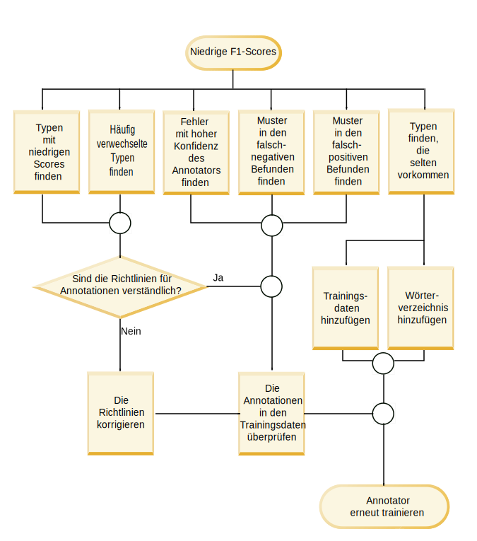
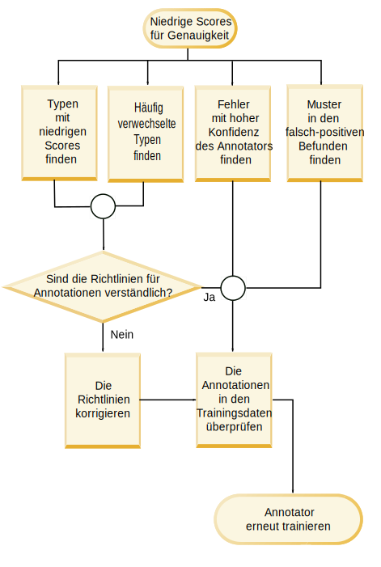
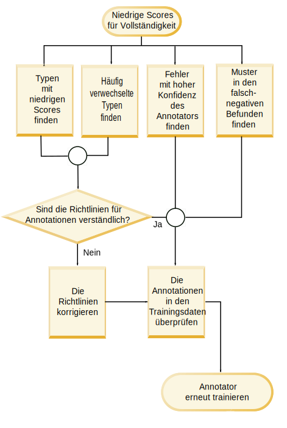

---

copyright:
  years: 2015, 2018
lastupdated: "2018-08-03"

---

{:shortdesc: .shortdesc}
{:new_window: target="_blank"}
{:tip: .tip}
{:pre: .pre}
{:codeblock: .codeblock}
{:screen: .screen}
{:javascript: .ph data-hd-programlang='javascript'}
{:java: .ph data-hd-programlang='java'}
{:python: .ph data-hd-programlang='python'}
{:swift: .ph data-hd-programlang='swift'}

Diese Dokumentation bezieht sich auf {{site.data.keyword.knowledgestudiofull}} on {{site.data.keyword.cloud}}. Die Dokumentation für die Vorgängerversion {{site.data.keyword.knowledgestudioshort}} on {{site.data.keyword.IBM_notm}} Marketplace kann über [diesen Link ](https://console.bluemix.net/docs/services/knowledge-studio/evaluate-ml.html){: new_window} aufgerufen werden.
{: tip}

# Leistung des Modells für maschinelles Lernen analysieren
{: #evaluate-ml}

Überprüfen Sie die vom trainierten Modell hinzugefügten Annotationen, um die Suche nach gültigen Entitätserwähnungen, Beziehungserwähnungen und Koreferenzen in den Dokumenten zu verbessern.
{: shortdesc}

## Informationen zu diesem Vorgang
{: #evaluate-ml_about}

Zum Analysieren der Leistung können Sie eine Zusammenfassung der Statistikdaten für Entitätstypen, Beziehungstypen und koreferenzierte Erwähnungen anzeigen. Außerdem können sie die Statistikdaten analysieren, die in ein er *Fehlermatrix* dargestellt werden. Anhand der Fehlermatrix können Sie die vom Modell für maschinelles Lernen hinzugefügten Annotationen mit den Annotationen in der Ground Truth vergleichen.

Die Modellstatistikdaten stellen die folgenden Metriken bereit:

- **F1-Score**

    Ein Messwert, der unter Berücksichtigung von Genauigkeit und Vollständigkeit berechnet wird. Der F1-Score kann als gewichteter Durchschnitt der Genauigkeits- und der Vollständigkeitswerte beschrieben werden. Der beste Wert für den F1-Score ist 1 und der schlechteste Wert ist 0. Siehe [Niedrige F1-Scores analysieren](/docs/services/watson-knowledge-studio/evaluate-ml.html#evaluate-mllowf1).

- **Genauigkeit**

    Ein Messwert, der angibt, welcher Anteil der Ergebnisse des Modells für maschinelles Lernen im Vergleich zu den Ergebnissen der Annotatorbenutzer korrekt war. Beim Berechnen der Genauigkeit wird die Anzahl der korrekt beschrifteten Annotationen durch die Gesamtzahl der vom Modell für maschinelles Lernen hinzugefügten Annotationen dividiert. Der Genauigkeitswert 1,0 für den Entitätstyp A bedeutet, dass jede Erwähnung, die als Entitätstyp A beschriftet wurde, tatsächlich dieser Klassifizierung angehört. Ein niedriger Score für die Genauigkeit liefert einen Hinweis auf Textstellen, die vom Modell für maschinelles Lernen falsch annotiert wurden. Der Score sagt nichts darüber aus, wie viele andere Erwähnungen, die vom Annotatorbenutzer als Entitätstyp A beschriftet wurden, vom Modell für maschinelles Lernen nicht gefunden wurden (diese Information liefert der Score für Vollständigkeit). Siehe [Niedrige Scores für Genauigkeit analysieren](/docs/services/watson-knowledge-studio/evaluate-ml.html#evaluate-mllowp).

- **Vollständigkeit**

    Dieser Messwert gibt an, wie viele der Erwähnungen, die mit einem bestimmten Beschriftung annotiert werden müssten, tatsächlich mit dieser Beschriftung annotiert wurden (*rechts* stehen Erwähnungen, die in denselben Dokumenten von Annotatorbenutzern erkannt wurden). Die Vollständigkeit wird ermittelt, indem die Anzahl der korrekt beschrifteten Annotationen durch die Anzahl der Annotationen dividiert wird, die erstellt werden sollten. Der Score 1,0 für die Vollständigkeit bedeutet, dass alle Erwähnungen, die als Entitätstyp A beschriftet werden sollten, korrekt beschriftet wurden. Ein niedriger Score für die Vollständigkeit liefert einen Hinweis auf Textstellen, die vom Modell für maschinelles nicht mit der richtigen Annotation versehen wurden. Der Score sagt nichts darüber aus, wie viele andere Erwähnungen ebenfalls als Entitätstyp A beschriftet wurden, obwohl dies nicht zutrifft (diese Information liefert der Score für Genauigkeit). Siehe [Niedrige Scores für Vollständigkeit analysieren](/docs/services/watson-knowledge-studio/evaluate-ml.html#evaluate-mllowr).

- **Prozentsatz der gesamten Annotationen**

    Ein Messwert für die Ground Truth, der angibt, welcher Anteil der Gesamtzahl von Wörtern, die in der Testdokumentgruppe als beliebiger Entitäts- oder Beziehungstyp annotiert wurden, als ein bestimmter Entitätstyp oder Beziehungstyp annotiert wurde. Dieser Statistikwert ist für koreferenzierte Erwähnungen nicht verfügbar. Dieser Werte ermöglicht den Vergleich zwischen vorherrschenden Erwähnungen eines Typs mit denn anderen Typen in Ihrer Ground Truth.

- **Prozentsatz der Korpusdichte (nach Wörteranzahl)**

    Ein Messwert für die Ground Truth, der angibt, welche Anzahl aus der Gesamtzahl der (annotierten und nicht annotierten) Wörter mit einem angegebenen Entitäts- oder Beziehungstyp annotiert wurde. Dieser Statistikwert ist für koreferenzierte Erwähnungen nicht verfügbar. Dieser Wert ermöglicht den Vergleich zwischen den vorherrschenden Erwähnungen dieses Typs und allen anderen Wörtern in Ihren fachspezifischen Dokumenten.

- **Prozentsatz der Dokumente, die den Typ enthalten**

    Ein Messwert für die Ground Truth, der angibt, wie viele Dokumente einen bestimmten Entitäts- oder Beziehungstyp enthalten. Dieser Statistikwert ist für koreferenzierte Erwähnungen nicht verfügbar. Mithilfe dieses Werts können Sie beurteilen, ob die Dokumente in der Gruppe für das Fachgebiet repräsentativ genug sind. Wenn der Prozentsatz für Schlüsselentitätstypen niedrig ist, sollten Sie in Betracht ziehen, weitere Dokumente mit Erwähnungen der unterrepräsentierten Typen hinzuzufügen.

## Vorgehensweise
{: #evaluate-ml_procedure}

So zeigen Sie die Leistungsstatistik für die Trainingsqualität eines Modells an:

1. Melden Sie sich als {{site.data.keyword.knowledgestudioshort}}-Administrator oder -Projektleiter an und wählen Sie Ihren Arbeitsbereich aus.
1. Wählen Sie **Modell für maschinelles Lernen** > **Leistung** aus. 
1. Wählen Sie den Link **Detaillierte Statistik** für Erwähnungen, Beziehungen oder Koreferenzen aus.
1. Geben Sie in der Ansicht **Zusammenfassung** an, ob Sie Test- oder Trainingsdaten auswerten möchten, und geben Sie anschließend an, für welchen Annotationstyp Statistikdaten angezeigt werden sollen: Entitätstypen, Beziehungstypen oder koreferenzierte Erwähnungen. Beim Blättern durch die Daten werden Sie erkennen, dass Elemente mit niedrigen Scores markiert und hervorgehoben sind, um darauf hinzuweisen, dass sie untersucht und optimiert werden sollten. Das dreieckige Warnsymbol zeigt an, dass der F1-Wert kleiner als der feste Wert 0,5 ist.

    Beispiel: Der F1-Score für manche Entitätstypen kann hoch sein, weil das betreffende Dokument sowohl durch Vorannotierung als auch von einem Annotatorbenutzer annotiert wurde. Dagegen kann der F1-Score für andere Entitätstypen niedrig sein, weil Unterschiede in den Ausdrücken und Unterschiede in der Textinterpretation oder Regelauslegung der Annotatorbenutzer es dem Modell für maschinelles Lernen erschweren, das Muster zu erkennen und die richtigen Annotationen einzufügen.

1. Geben Sie in der Ansicht **Fehlermatrix** für Testdaten an, für welchen Annotationstyp Statistikdaten angezeigt werden sollen: Entitätstypen oder Beziehungstypen. Für jeden Entitätstyp oder Beziehungstyp gilt Folgendes:

    - In jeder Zeile der Matrix wird Ground Truth angezeigt, d. h. Entitätstypen und Beziehunstypen, die von Annotatorbenutzern hinzugefügt wurden.
    - In jeder Spalte der Matrix werden die Decodierungsergebnisse angezeigt, d. h. Annotationstokens, die vom Modell für maschinelles Lernen hinzugefügt wurden.
    - Die Zahlen in den einzelnen Zellen geben die Anzahl der Annotationstokens für jede Erwähnung an, nicht die Anzahl der Vorkommen der Erwähnung.

        Tokens werden verwendet, um Textzeichenfolgen zu beschreiben. Sie können in etwa mit Wörtern verglichen werden. Eine Erwähnung kann mehrere Tokens enthalten. Beispiel: *Barack Obama* ist eine Erwähnung, die aus zwei Tokens besteht. In der Zeile oder Spalte für PERSON würde der Wert 2 die einzelne Erwähnung *Barack Obama* in einem Dokument darstellen. Die Tokenanzahl entspricht nur ungefähr der Wortanzahl, da Token in manchen Situationen anders gezählt werden. Beispiel: Die Interpunktion am Satzende wird als ein Token gezählt und Zusammenziehungen werden häufig in zwei Token aufgeteilt.

    - In der Spalte mit der Beschriftung **O** werden Token angegeben, die das Modell für maschinelles Lernen als den Typ annotieren sollte, der in der überschneidenden Zeile (Annotationen der Annotatorbenutzer) angegeben ist. Sie wurden jedoch nicht als ein Typ annotiert.
    - Der Wert **N/A** (nicht zutreffend) wird angegeben, wenn keine Annotationen für den betreffenden Typ in den Dokumentgruppen enthalten sind. Beispiel: Wenn keine Erwähnung des Typs PERSON in den Dokumentgruppen enthalten ist, die für die Ground Truth oder als Testdaten annotiert wurden, hat der Score für den Entitätstyp PERSON den Wert 'N/A'.

    Das folgende Beispiel für eine Fehlermatrix zeigt die Ergebnisse der Anwendung eines Modells für maschinelles Lernen auf Dokumente, die sich mit Verkehrsunfällen befassen.

    <table summary="Beispiel für die Fehlermatrix eines Problemberichts">
       <caption>Tabelle 1. Beispiel für die Fehlermatrix</caption>
       <tr>
        <th style="vertical-align:bottom; text-align:left" id="d15356e164">Entitätstypen</th>
        <th style="vertical-align:bottom; text-align:center" id="d15356e166">HERSTELLER</th>
        <th style="vertical-align:bottom; text-align:center" id="d15356e168">MODELL</th>
        <th style="vertical-align:bottom; text-align:center" id="d15356e170">O</th>
      </tr>
      <tr>
        <td style="vertical-align:top; text-align:left" headers="d15356e164">HERSTELLER</td>
        <td style="vertical-align:top; text-align:center" headers="d15356e166">515</td>
        <td style="vertical-align:top; text-align:center" headers="d15356e168">5</td>
        <td style="vertical-align:top; text-align:center" headers="d15356e170">44</td>
      </tr>
    </table>
    {: #evaluate-ml__datasimpletable_yms_hff_cw}

    Aus dieser Matrix können Sie Folgendes lernen:
    - Von dem Modell wurden 515 Tokens korrekt als Erwähnungen des Entitätstyps HERSTELLER erkannt.
    - Von dem Modell wurden 5 Tokens als Erwähnungen des Typs MODELL beschriftet, die eigentlich als HERSTELLER bezeichnet werden sollten.
    - 44 Tokens mit Erwähnungen des Typs HERSTELLER konnten von dem Modell nicht als Entitätstyp annotiert werden.

    Beim Bewerten der Modellleistung und Anzeigen der Decodierungsergebnisse können Sie mit den Token beginnen, die falsch bezeichnet oder gar nicht erkannt wurden.

## Spickzettel für Leistungsverbesserung
{: #evaluate-ml_cheat}

Mit diesem Spickzettel können Sie ermitteln, welche Maßnahmen Sie ergreifen können, um die Leistung des Modells für maschinelles Lernen zu verbessern.

Veränderliche Einflussfaktoren wie Komplexität des Typsystems, Zweckmäßigkeit der Trainingsdokumente, Erfahrung der Annotatorbenutzer und andere Faktoren machen es nicht leicht, Regeln zum Verbessern der Scores die Modellleistung festzulegen, die auf verschiedene Fachgebiete anwendbar sind. Die folgende Tabelle kann jedoch einen ersten Anhaltspunkt für die Beurteilung und für mögliche Schritte zur Verbesserung der Leistung liefern (insbesondere in den Anfangsphasen beim Entwickeln und Testen von Modellen).

In der folgenden Tabelle werden Maßnahmen zum Beheben der häufigsten Probleme für das Leistungsverhalten von Modellen für maschinelles Lernen vorgeschlagen.

<table summary="Die Tabelle listet allgemeine Probleme unter der ersten Spalte und empfohlene Fixes in der ersten Zeile auf. X-Markierungen geben an, welcher Fix auf welches Problem angewendet werden soll.">     <caption>Tabelle 2. Fixes für allgemeine Leistungsprobleme</caption>
    <tr>
      <th style="vertical-align:bottom; text-align:left" id="d15356e221">Problem</th>
      <th style="vertical-align:bottom; text-align:center" id="d15356e223">Wörterverzeichnisse hinzufügen</th>
      <th style="vertical-align:bottom; text-align:center" id="d15356e225">Dokumentgruppen bearbeiten</th>
      <th style="vertical-align:bottom; text-align:center" id="d15356e227">Typspezifische Dokumente hinzufügen</th>
      <th style="vertical-align:bottom; text-align:center" id="d15356e229">Weitere Annotationen im Korpus hinzufügen</th>
      <th style="vertical-align:bottom; text-align:center" id="d15356e231">Annotationen der Annotatorbenutzer korrigieren</th>
      <th style="vertical-align:bottom; text-align:center" id="d15356e233">Richtlinien für Annotatorbenutzer ergänzen</th>
      <th style="vertical-align:bottom; text-align:center" id="d15356e235">Typsystem aktualisieren</th>
      <th style="vertical-align:bottom; text-align:center" id="d15356e237">Weitere Untersuchungen vornehmen</th>
    </tr>
    <tr>
      <td style="vertical-align:top; text-align:left" headers="d15356e221">Niedriger F1-Score</td>
      <td style="vertical-align:top; text-align:center" headers="d15356e223">X</td>
      <td style="vertical-align:top; text-align:center" headers="d15356e225">X</td>
      <td style="vertical-align:top; text-align:center" headers="d15356e227">X</td>
      <td style="vertical-align:top; text-align:center" headers="d15356e229">X</td>
      <td style="vertical-align:top; text-align:center" headers="d15356e231">X</td>
      <td style="vertical-align:top; text-align:center" headers="d15356e233">X</td>
      <td style="vertical-align:top; text-align:center" headers="d15356e235">X</td>
      <td style="vertical-align:top; text-align:center" headers="d15356e237">X</td>
    </tr>
    <tr>
      <td style="vertical-align:top; text-align:left" headers="d15356e221">Niedriger Score für Genauigkeit</td>
      <td style="vertical-align:top; text-align:center" headers="d15356e223"></td>
      <td style="vertical-align:top; text-align:center" headers="d15356e225"></td>
      <td style="vertical-align:top; text-align:center" headers="d15356e227"></td>
      <td style="vertical-align:top; text-align:center" headers="d15356e229">X</td>
      <td style="vertical-align:top; text-align:center" headers="d15356e231">X</td>
      <td style="vertical-align:top; text-align:center" headers="d15356e233">X</td>
      <td style="vertical-align:top; text-align:center" headers="d15356e235">X</td>
      <td style="vertical-align:top; text-align:center" headers="d15356e237">X</td>
    </tr>
    <tr>
      <td style="vertical-align:top; text-align:left" headers="d15356e221">Niedriger Score für Vollständigkeit</td>
      <td style="vertical-align:top; text-align:center" headers="d15356e223">X</td>
      <td style="vertical-align:top; text-align:center" headers="d15356e225">X</td>
      <td style="vertical-align:top; text-align:center" headers="d15356e227">X</td>
      <td style="vertical-align:top; text-align:center" headers="d15356e229">X</td>
      <td style="vertical-align:top; text-align:center" headers="d15356e231"></td>
      <td style="vertical-align:top; text-align:center" headers="d15356e233"></td>
      <td style="vertical-align:top; text-align:center" headers="d15356e235"></td>
      <td style="vertical-align:top; text-align:center" headers="d15356e237"></td>
    </tr>
    <tr>
      <td style="vertical-align:top; text-align:left" headers="d15356e221">Geringe Annotationen %</td>
      <td style="vertical-align:top; text-align:center" headers="d15356e223"></td>
      <td style="vertical-align:top; text-align:center" headers="d15356e225">X</td>
      <td style="vertical-align:top; text-align:center" headers="d15356e227">X</td>
      <td style="vertical-align:top; text-align:center" headers="d15356e229">X</td>
      <td style="vertical-align:top; text-align:center" headers="d15356e231"></td>
      <td style="vertical-align:top; text-align:center" headers="d15356e233"></td>
      <td style="vertical-align:top; text-align:center" headers="d15356e235"></td>
      <td style="vertical-align:top; text-align:center" headers="d15356e237"></td>
    </tr>
    <tr>
      <td style="vertical-align:top; text-align:left" headers="d15356e221">Geringe Dichte</td>
      <td style="vertical-align:top; text-align:center" headers="d15356e223"></td>
      <td style="vertical-align:top; text-align:center" headers="d15356e225">X</td>
      <td style="vertical-align:top; text-align:center" headers="d15356e227">X</td>
      <td style="vertical-align:top; text-align:center" headers="d15356e229">X</td>
      <td style="vertical-align:top; text-align:center" headers="d15356e231"></td>
      <td style="vertical-align:top; text-align:center" headers="d15356e233"></td>
      <td style="vertical-align:top; text-align:center" headers="d15356e235"></td>
      <td style="vertical-align:top; text-align:center" headers="d15356e237"></td>
    </tr>
    <tr>
      <td style="vertical-align:top; text-align:left" headers="d15356e221">Wenige Dokumente des Typs</td>
      <td style="vertical-align:top; text-align:center" headers="d15356e223"></td>
      <td style="vertical-align:top; text-align:center" headers="d15356e225"></td>
      <td style="vertical-align:top; text-align:center" headers="d15356e227">X</td>
      <td style="vertical-align:top; text-align:center" headers="d15356e229">X</td>
      <td style="vertical-align:top; text-align:center" headers="d15356e231"></td>
      <td style="vertical-align:top; text-align:center" headers="d15356e233"></td>
      <td style="vertical-align:top; text-align:center" headers="d15356e235">X</td>
      <td style="vertical-align:top; text-align:center" headers="d15356e237"></td>
    </tr>
    <tr>
      <td style="vertical-align:top; text-align:left" headers="d15356e221">Falsche Kategorisierung</td>
      <td style="vertical-align:top; text-align:center" headers="d15356e223">X</td>
      <td style="vertical-align:top; text-align:center" headers="d15356e225"></td>
      <td style="vertical-align:top; text-align:center" headers="d15356e227"></td>
      <td style="vertical-align:top; text-align:center" headers="d15356e229"></td>
      <td style="vertical-align:top; text-align:center" headers="d15356e231"></td>
      <td style="vertical-align:top; text-align:center" headers="d15356e233"></td>
      <td style="vertical-align:top; text-align:center" headers="d15356e235">X</td>
      <td style="vertical-align:top; text-align:center" headers="d15356e237"></td>
    </tr>
    <tr>
      <td style="vertical-align:top; text-align:left" headers="d15356e221">Nicht erkannte Annotationen </td>
      <td style="vertical-align:top; text-align:center" headers="d15356e223">X</td>
      <td style="vertical-align:top; text-align:center" headers="d15356e225"></td>
      <td style="vertical-align:top; text-align:center" headers="d15356e227"></td>
      <td style="vertical-align:top; text-align:center" headers="d15356e229">X</td>
      <td style="vertical-align:top; text-align:center" headers="d15356e231"></td>
      <td style="vertical-align:top; text-align:center" headers="d15356e233"></td>
      <td style="vertical-align:top; text-align:center" headers="d15356e235"></td>
      <td style="vertical-align:top; text-align:center" headers="d15356e237"></td>
    </tr>
    <tr>
      <td style="vertical-align:top; text-align:left" headers="d15356e221">Diskrepanz zwischen Test- und Trainingsergebnissen </td>
      <td style="vertical-align:top; text-align:center" headers="d15356e223"></td>
      <td style="vertical-align:top; text-align:center" headers="d15356e225">X</td>
      <td style="vertical-align:top; text-align:center" headers="d15356e227"></td>
      <td style="vertical-align:top; text-align:center" headers="d15356e229"></td>
      <td style="vertical-align:top; text-align:center" headers="d15356e231"></td>
      <td style="vertical-align:top; text-align:center" headers="d15356e233"></td>
      <td style="vertical-align:top; text-align:center" headers="d15356e235"></td>
      <td style="vertical-align:top; text-align:center" headers="d15356e237"></td>
    </tr>
    <tr>
      <td style="vertical-align:top; text-align:left" headers="d15356e221">Niedriger F1-Score beim Testen von Trainingsdaten</td>
      <td style="vertical-align:top; text-align:center" headers="d15356e223"></td>
      <td style="vertical-align:top; text-align:center" headers="d15356e225"></td>
      <td style="vertical-align:top; text-align:center" headers="d15356e227"></td>
      <td style="vertical-align:top; text-align:center" headers="d15356e229"></td>
      <td style="vertical-align:top; text-align:center" headers="d15356e231">X</td>
      <td style="vertical-align:top; text-align:center" headers="d15356e233">X</td>
      <td style="vertical-align:top; text-align:center" headers="d15356e235"></td>
      <td style="vertical-align:top; text-align:center" headers="d15356e237">X</td>
    </tr>
</table>
{: #evaluate-ml_cheat__datasimpletable_nhm_5ym_cw}

### Beschreibung der Korrekturmaßnahmen
{: #evaluate-ml_fixes}

- **Wörterverzeichnisse hinzufügen**

    Ein Wörterverzeichnis enthält Beispiele für die Oberflächenformen eines bestimmten Entitätstyps. Es kann hilfreich sein, ein neues Wörterverzeichnis oder neue Einträge in einem bestehenden Wörterverzeichnis hinzuzufügen, wenn die Trainingsstatistik zeigt, dass Annotationen des jeweiligen Typs in den Trainingsdaten nur selten vorkommen. Wenn der Entitätstyp eine zentraler Bestandteil des betreffenden Fachgebiets ist und nur selten vorkommt, kann dies darauf hindeuten, dass die in den Trainingsdaten de facto *vorhandenen* Oberflächenformen für den Typ vom Modell für maschinelles Lernen nicht erkannt werden. Die Bereitstellung weiterer Beispiele für Oberflächenformen kann dazu beitragen, das Problem zu beheben.

- **Dokumentgruppen bearbeiten**

    Stellen Sie sicher, dass genügend allgemeine Trainingsdaten vorliegen. Nur mit einem gut bemessenen Bestand von Inhalten kann ein Modell für maschinelles Lernen seinen Zweck erfüllen. Versuchen Sie, etwa 300.000 Wörter bereitzustellen. (Wenden Sie ein Wortzählprogramm auf Ihre Quellendokumente an, um die Menge zu überprüfen.) Wenn Ihr Trainingsset zu klein ist, fügen Sie Dokumente zum Korpus hinzu. Einige wenige Dokumente zum Einüben der wichtigen Entitätstypen oder Beziehungstypen ist nicht genug. Sie benötigen zahlreiche Dokumente, die belegen, wie diese Typen in der Literatur des Fachgebiets üblicherweise verwendet werden.
  - Stellen Sie sicher, dass ähnliche Sortimente mit Dokumenten zum Testen und zum Trainieren verwendet werden. Verwenden Sie beispielsweise nicht Dokumente aus einer Datenquelle als Testdatenset und Dokumente aus einer anderen Datenquelle als Trainingsdatenset. In verschiedenen Datenquellen werden Informationen zu Entitäts- und Beziehungstypen womöglich auf völlig unterschiedliche Arten dargestellt. Es empfiehlt sich, eine Mischung von Dokumenten aus allen Datenquellen in beiden Datensets zu verwenden, um einen möglichst umfassenden Bestand mit verfügbaren Verwendungsbeispielen aus der Literatur des Fachgebiets zusammenzustellen. Wenn die Scores für die Gesamtleistung in einem Testlaufs stark von denen des Trainingslaufs abweichen, kann dies auf Inkonsistenzen in den jeweils verwendeten Datensets zurückzuführen sein.
  - Verschwenden Sie keine Zeit mit falsch formatierten Dokumenten. Textdokumente, die zum Korpus hinzugefügt werden, müssen im UTF-8-Format vorliegen. Wenn Sie Dokumente aus anderen Formaten in die UTF-8-Codierung umgewandelt haben, treten möglicherweise diakritische Zeichen und andere Probleme der Zeichennormalisierung auf. Solche Formatierungsfehler können zu einer ungenauen Tokendarstellung führen. Wenn die zum Darstellen einer Erwähnung verwendeten Worttoken in verschiedenen Dokumenten voneinander abweichen, wird das Beispiel dadurch abgeschwächt und der Erfolg des maschinellen Lernens beeinträchtigt.

- **Typspezifische Dokumente hinzufügen**

    Wenn nur ein geringer Anteil der Dokumente einen bestimmten Typ enthält, kann dies bedeuten, dass Ihr Korpus nicht sehr repräsentativ ist. Das Modell für maschinelles Lernen benötigt zahlreiche Beispiele, die als Lernmaterial tauglich sind. Es kann hilfreich sein, weitere Dokumente zum Korpus hinzuzufügen. Wenn das verwendete Typsystem und die Dokumente für das Fachgebiet repräsentativ sind, sollten beliebig ausgewählte Dokumente stets einen größeren Anteil der Typen enthalten. Auch wenn es nicht in ausnahmslos allen Fällen zutrifft, sollte es für Sie ein Anreiz sein, Ihr Typsystem und die Qualität der Dokumente im Korpus zu untersuchen. Es kann hilfreich sein, weitere Dokumente aus dem Fachgebiet zu finden, in denen die unterrepräsentierten Typen stärker vertreten sind. Wenn die Vollständigkeit (Recall) gering ist, deutet dies häufig darauf hin, dass Sie mehr Dokumente hinzufügen sollten.

- **Weitere Annotationen im Korpus hinzufügen**

    Wenn das Modell für maschinelles Lernen kaum Instanzen bestimmter Typen findet, kann dies daran liegen, dass in der Ground Truth zu wenig Verwendungsbeispiele für die betreffenden Typen enthalten sind. Annotatorbenutzer konzentrieren sich manchmal zu sehr auf das Beschriften der Erwähnungen von Entitätstypen und vernachlässigen dabei das Annotieren von Beziehungstypen und Koreferenzen. Wenn der Prozentsatz für die Häufigkeit des Vorkommens mancher Schlüsseltypen im Korpus zu gering ist, kann es hilfreich sein, gezielt mehr Annotationen dieser Typen in den Quellendokumenten zu suchen. Konzentrieren Sie sich jedoch nicht zu sehr auf die genaue Erfassung von Koreferenzen und Beziehungen, wenn die Genauigkeit der Erwähnungen zu wünschen übrig lässt. Die Erwähnungen der Beziehungen zwischen Entitäten und die Koreferenzen für Entitäten können nur zutreffend sein, wenn die zugrunde liegenden Erwähnungen der Entitäten zutreffend sind.

- **Annotationen der Annotatorbenutzer korrigieren**

    Überprüfen Sie, ob Ihre Trainingsdaten konsistent und vollständig annotiert sind. Ein Modell für maschinelles Lernen lernt aus Ihren Annotationen der Ground Truth. Wenn ein Satz zum Beispiel den Ausdruck 'Obama-Familie' enthält und Sie 'Obama' in einem Satz als PERSON beschriften und 'Obama-Familie' in einem anderen Satz als MENSCHEN führt diese Inkonsistenz dazu, dass das Modell für maschinelles Lernen die Annotation nicht korrekt erlernen kann. Ebenso gilt: Wenn Sie 'Obama' in einem Satz als PERSON beschriften und denselben Namen in einem anderen Satz gar nicht beschriften, ist der Annotationserfolg unvollständig und das Modell für maschinelles Lernen wird unzureichend trainiert. Solche Inkonsistenzen und unvollständigen Beschriftungen werden auch als *Typenverwirrung* bezeichnet. In vielen Fällen entstehen solche Typenverwirrungen und daraus resultierende Fehler allein dadurch, dass mehrere Annotatorbenutzer eine Dokumentgruppe mit Überschneidungen bearbeiten. Achten Sie darauf, welche Probleme beim Beheben von Konflikten in Dokumenten auftreten. Sie können Einblicke in tiefere Probleme ermöglichen, die das Typsystem betreffen. Wenn keine weitere Optimierung des Typsystems möglich ist, kann es erforderlich werden, die Annotationsrichtlinien zu aktualisieren und Beispiele anzugeben. Sie können Abbildungen für häufige Fehler und für das korrekte Annotieren von Erwähnungen in bestimmten Situationen angeben.

    Ein weiterer Hinweis auf inkonsistente Annotationen ist es, wenn zwar genügend Annotationen vorhanden sind, aber der Wert für ihre Dichte im Korpus niedrig ist. Die Dichte kann beeinträchtigt werden, wenn eine signifikante Erwähnung, die in der Literatur des Fachgebiets häufig vorkommt, innerhalb der Dokumentgruppe mit verschiedenen Typen annotiert wird.

    Ein niedriger Score für die Genauigkeit deutet häufig darauf hin, dass die Konsistenz der Annotationen verbessert werden sollte. Überarbeiten Sie zu diesem Zweck die Annotationsrichtlinien, verbessern Sie die Schulung der Annotatorbenutzer und stellen Sie sicher, dass die Annotatorbenutzer im Team arbeiten und nicht isoliert voneinander.

    Überprüfen Sie den Score für die Übereinstimmung der Annotatoren. Dieser Score misst den Grad der Übereinstimmung in den Ergebnissen verschiedener Annotatoren für dasselbe Dokument und ist damit ein überaus hilfreicher Zahlenwert. Dieser Score gibt nicht nur Aufschluss über die Qualität der Ground Truth-Dokumente, die zum Trainieren des Modells für maschinelles Lernen verwendet werden, er gibt auch die Obergrenze der Leistung des Modells für maschinelles Lernen an. Ein Modell, das mit diesen Dokumenten trainiert wird, kann kaum eine bessere Leistung erreichen als die bestmögliche Übereinstimmung der Annotatorbenutzer. Wenn die Leistung beispielsweise konstant bei 75 liegt und keinen höheren Wert erreicht, sollten Sie die Ergebnisse für die Übereinstimmung der Annotatoren überprüfen. Liegt der Score für die Übereinstimmung der Annotatoren bei 80, dann sollten Sie die Schulung der Annotatorbenutzer verbessern und sicherstellen, dass Konflikte bei der Beurteilung korrekt (gemäß den Annotationsrichlinien) behoben werden. Wenn sich die Annotatorbenutzer nicht darüber einigen können, wie eine bestimmte Textstelle annotiert werden sollte, ist die Wahrscheinlichkeit gering, dass ein Modell für maschinelles Lernen die richtigen Beschriftungen zuordnet.

- **Richtlinien für Annotatorbenutzer ergänzen**

    Verständliche und umfassende Annotatorrichtlinien sind ein zentraler Baustein für die Entwicklung übereinstimmender und erfolgreichen Annotationen. Die Aufgabe der Annotatorbenutzer ist nicht leicht. Manche Nuancen bei der Zuordnung von Entitäts- und Beziehungstypen sind nicht leicht zu antizipieren. Sie treten erst bei der konkreten Bearbeitung der Dokumente des Fachgebiets zutage. Die Richtlinien können den Annotatorbenutzern beim Auswerten von Dokumenten eine Prüfung auf den ordnungsgemäßen Zustand der Dokumente ermöglichen. Richtlinien sollten stets eine dynamische und veränderbare Richtschnur sein, besonders am Anfang des Annotationsprozesses. Sie sind ein wichtiges Werkzeug für Feedback: Die Annotatorbenutzer gewinnen beim Annotieren einiger Dokumente neue Erkenntnisse, vertiefen diese Erkenntnisse durch weitere Dokumente und können so immer wieder neue Tipps und Tricks zu den Richtlinien beitragen. Schwierige Entscheidungen sollten unbedingt durch Beispiele und erprobte Methoden veranschaulicht werden. Die beste Weg, um festzustellen, welche Ergänzungen in den Annotationsrichtlinien vorgenommen werden sollten, ist die sorgfältige Überprüfung von Dokumentkonflikten. Beispiele aus der Praxis für unterschiedliche Vorgehensweisen, die zu abweichenden Annotationsergebnissen führen, können eine wertvolle Hilfe für Annotatorbenutzer beim Annotieren neuer Dokumente sein.

- **Typsystem aktualisieren**

    Die folgenden Gründe können es erforderlich machen, das Typsystem zu aktualisieren:
  - Die Dokumente mit Trainingsdaten verweisen auf Konzepte, die zwar wichtige Typen für das Fachgebiet darstellen, im Typsystem jedoch nicht enthalten sind. Dies deutet darauf hin, dass Typen hinzugefügt werden sollten, um die fehlenden Konzepte oder Beziehungen zu erfassen. Achten Sie darauf, nicht für jedes Konzept in einem Fachgebiet einen Typ zu definieren, oder für jede Entität, die in den Dokumenten des Fachgebiets vorkommt. Das Typsystem sollte auf die wichtigsten Typen beschränkt werden.
  - Ein vorhandener Typ wird von Annotatorbenutzern durchgängig falsch verwendet. Wenn ein Typ wiederholt Missverständnisse auslöst, sollte er anders benannt oder entfernt werden, falls er redundant ist.
  - Ein vorhandener Typ wird von den Annotatorbenutzern nie verwendet, weil in den Dokumenten nicht darauf verwiesen wird. Wenn der betreffende Typ in der Literatur des Fachgebiets selten oder gar nicht verwendet wird, entfernen Sie ihn aus dem Typsystem.
  - Zwei Typen werden beim Annotieren der Dokumente von den Annotatorbenutzern häufig verwechselt. Ziehen Sie in Betracht, die beiden Typen zu einem Typ zusammenzufassen, der das Konzept oder die Beziehung zutreffend darstellt. Wenn das Typsystem beispielsweise die beiden Typen PERSON und MENSCHEN enthält, die häufig austauschbar verwendet werden, kann es das Beste sein, anstelle von zwei Typen einen einzigen Typ namens PERSONMENSCHEN zu verwenden, der beide Fälle abdeckt.

    > **Achtung:** Gehen Sie beim Aktualisieren des Typsystems besonders sorgfältig vor. Wenn Sie das Typsystem ändern, müssen die Annotatorbenutzer ihre Dokumentgruppen, die nach dem alten Typsystem ausgewertet wurden, erneut auswerten. Nehmen Sie daher nur Änderungen im Typsystem vor, die diesen zusätzlichen Arbeitsaufwand rechtfertigen.

- **Weitere Untersuchungen vornehmen**

    Wenn Ihr Typsystem, Ihr Wörterverzeichnis und Ihre Quellendokumente abgeschlossen sind, die Annotatorbenutzer gute Arbeit geleistet haben, aber das Modell für maschinelles Lernen trotzdem keine gute Leistung bringt, liegt der Fehler möglicherweise im Trainingsprozess. Beispielsweise sollten bei Testläufen mit den Trainingsdaten konstant hohe Scores (über 95 %) erzielt werden.

## Niedrige F1-Scores analysieren
{: #evaluate-mllowf1}

Optimieren Sie die Leistung Ihres Modells für maschinelles Lernen, um niedrigen F1-Scores entgegenzuwirken.

### Symptome
{: #evaluate-mllowf1_symptoms}

Der beste Wert für den F1-Score ist 1 und der schlechteste Wert ist 0. Ein niedriger F1-Score deutet auf geringe Genauigkeit und geringe Vollständigkeit hin. Das Modell für maschinelles Lernen generiert nicht zutreffende Annotationen und findet Annotationen nicht, die es finden sollte.

### Ursachen
{: #evaluate-mllowf1_causes}

Niedrige F1-Scores können viele verschiedene Ursachen haben. Sie hängen von Einflussfaktoren wie Fachgebiet, Komplexität des Typsystems, Zweckmäßigkeit der Trainingsdokumente, Erfahrung der Annotatorbenutzer und von weiteren Faktoren ab.

### Problem beheben
{: #evaluate-mllowf1_resolving}

Optimieren Sie die Leistung Ihres Modells für maschinelles Lernen, indem Sie mindestens einen der folgenden Schritte ausführen und anschließend das Modell erneut trainieren:

1. Identifizieren Sie häufig vorkommende Typen mit geringer Genauigkeit.

    > **Hinweis:** Berücksichtigen Sie beim Analysieren von Beziehungen sowohl den F1-Score des Beziehungstyps als auch den F1-Score der beiden an der Beziehung beteiligten Entitäten.

1. Identifizieren Sie Typen, die häufig verwechselt werden. Entsprechende Hinweise liefern die Zahlen abseits der Diagonalen in der Fehlermatrix.
1. Überprüfen Sie Fehler, bei denen das Modell für maschinelles Lernen eine hohe Konfidenz ausweist.
1. Suchen Sie Muster in den falsch-negativen und falsch-positiven Befunden der Fehlermatrix.
1. Wenn bestimmte Typen in den Trainingsdaten selten vorkommen, fügen Sie Trainingsdaten hinzu, die diese Typen enthalten.

    Sie können die Häufigkeit des Vorkommens ermitteln, indem Sie die Prozentwerte in den Statistikdaten für den Typ überprüfen (Prozentsatz der Annotationen, Prozentsatz der Korpusdichte und Prozentsatz  der Dokumente).

1. Wenn bestimmte Typen niedrige F1-Scores aufweisen, überprüfen Sie, ob die Annotationsrichtlinien für diese Typen klar und deutlich formuliert sind.
1. Fügen Sie ein Wörterverzeichnis für Typen hinzu, die in den Trainingsdaten selten vorkommen.

 Abbildung 1. Niedrige F1-Scores verarbeiten

## Niedrige Scores für die Genauigkeit analysieren
{: #evaluate-mllowp}

Optimieren Sie die Leistung Ihres Modells für maschinelles Lernen, um niedrigen Scores für die Genauigkeit entgegenzuwirken. Auf einer übergeordneten Ebene deutet eine geringe Genauigkeit darauf hin, dass die Konsistenz der Annotationen verbessert werden sollte.

### Symptome
{: #evaluate-mllowp_symptoms}

Der beste Score für die Genauigkeit ist 1 und der schlechteste Score ist 0. Ein niedriger Score für die Genauigkeit deutet darauf hin, dass vom Modell für maschinelles Lernen falsche Annotationen generiert wurden.

### Ursachen
{: #evaluate-mllowp_causes}

Niedrige Scores für die Genauigkeit können viele verschiedene Ursachen haben. Sie hängen von Einflussfaktoren wie Fachgebiet, Komplexität des Typsystems, Zweckmäßigkeit der Trainingsdokumente, Erfahrung der Annotatorbenutzer und von weiteren Faktoren ab.

### Problem beheben
{: #evaluate-mllowp_resolving}

Optimieren Sie die Leistung Ihres Modells für maschinelles Lernen, indem Sie mindestens einen der folgenden Schritte ausführen und anschließend das Modell erneut trainieren:

1. Identifizieren Sie häufig vorkommende Typen mit geringer Genauigkeit.
1. Identifizieren Sie Typen, die häufig verwechselt werden. Entsprechende Hinweise liefern die Zahlen abseits der Diagonalen in der Fehlermatrix.
1. Überprüfen Sie Fehler, bei denen das Modell für maschinelles Lernen eine hohe Konfidenz ausweist.
1. Suchen Sie Muster in den falsch-negativen und falsch-positiven Befunden der Fehlermatrix.
1. Wenn bestimmte Typen niedrige Scores für die Genauigkeit aufweisen, überprüfen Sie, ob die Annotationsrichtlinien für diese Typen klar und deutlich formuliert sind.

Abbildung 2. Niedrige Scores für die Genauigkeit verarbeiten

## Niedrige Scores für die Vollständigkeit analysieren
{: #evaluate-mllowr}

Optimieren Sie die Leistung Ihres Modells für maschinelles Lernen, um niedrigen Scores für die Vollständigkeit entgegenzuwirken. Auf einer übergordneten Ebene deutet eine geringe Vollständigkeit darauf hin, dass weitere Trainingsdaten hinzugefügt werden sollten.

### Symptome
{: #evaluate-mllowr_symptoms}

Der beste Score für die Vollständigkeit ist 1 und der schlechteste Score ist 0. Ein niedriger Score für die Vollständigkeit deutet darauf hin, dass das Modell für maschinelles Lernen erforderliche Annotationen nicht erstellen konnte.

### Ursachen
{: #evaluate-mllowr_causes}

Niedrige Scores für die Vollständigkeit können viele verschiedene Ursachen haben. Sie hängen von Einflussfaktoren wie Fachgebiet, Komplexität des Typsystems, Zweckmäßigkeit der Trainingsdokumente, Erfahrung der Annotatorbenutzer und von weiteren Faktoren ab.

### Problem beheben
{: #evaluate-mllowr_resolving}

Optimieren Sie die Leistung Ihres Modells für maschinelles Lernen, indem Sie mindestens einen der folgenden Schritte ausführen und anschließend das Modell erneut trainieren:

1. Identifizieren Sie häufig vorkommende Typen mit geringer Vollständigkeit.
1. Identifizieren Sie Typen, die häufig verwechselt werden. Entsprechende Hinweise liefern die Zahlen abseits der Diagonalen in der Fehlermatrix.
1. Überprüfen Sie Fehler, bei denen das Modell für maschinelles Lernen eine hohe Konfidenz ausweist.
1. Suchen Sie Muster in den falsch-positiven Befunden der Fehlermatrix.
1. Wenn bestimmte Typen niedrige Scores für die Vollständigkeit aufweisen, überprüfen Sie, ob die Annotationsrichtlinien für diese Typen klar und deutlich formuliert sind.

Abbildung 3. Niedrige Scores für die Vollständigkeit verarbeiten
