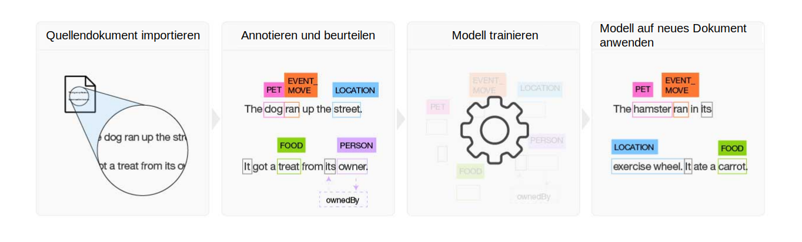

---

copyright:
  years: 2015, 2018
lastupdated: "2018-07-18"

---

{:shortdesc: .shortdesc}
{:new_window: target="_blank"}
{:tip: .tip}
{:pre: .pre}
{:codeblock: .codeblock}
{:screen: .screen}
{:javascript: .ph data-hd-programlang='javascript'}
{:java: .ph data-hd-programlang='java'}
{:python: .ph data-hd-programlang='python'}
{:swift: .ph data-hd-programlang='swift'}

Diese Dokumentation bezieht sich auf {{site.data.keyword.knowledgestudiofull}} on {{site.data.keyword.cloud}}. Die Dokumentation für die Vorgängerversion {{site.data.keyword.knowledgestudioshort}} on {{site.data.keyword.IBM_notm}} Marketplace kann über [diesen Link](https://{DomainName}/docs/services/knowledge-studio/index.html){: new_window} aufgerufen werden.
{: tip}

# Produktinformationen
{: #wks_overview_full}

Verwenden Sie {{site.data.keyword.knowledgestudiofull}}, um ein Modell für maschinelles Lernen zu erstellen, das die sprachlichen Nuancen, die Bedeutung und die Beziehungen versteht, die für Ihr Fachgebiet spezifisch sind, oder ein regelbasiertes Modell, das Entitäten in Dokumenten auf der Basis von Regeln findet, die Sie definieren.
{: shortdesc}

{{site.data.keyword.watson}} muss trainiert werden, damit es zum Experten in einem bestimmten Fachgebiet oder einer Domäne werden kann. Sie können dieses Training für {{site.data.keyword.watson}} mithilfe von {{site.data.keyword.knowledgestudioshort}} vereinfachen.

## Modell für maschinelles Lernen erstellen

{{site.data.keyword.knowledgestudioshort}} stellt benutzerfreundliche Tools zum Annotieren unstrukturierter Fachliteratur bereit und verwendet diese Annotationen, um ein angepasstes Modell für maschinelles Lernen zu erstellen, das die Sprache des Fachgebiets versteht. Die Genauigkeit des Modells wird durch iterative Tests verbessert. Das Ziel dieses Prozesses ist ein Algorithmus, der aus den erfassten Mustern lernen und diese Muster in umfangreichen neuen Dokumentsammlungen erkennen kann. Sie können das fertige Modell für maschinelles Lernen auf andere cloudbasierte {{site.data.keyword.watson}}-Angebote und kognitive Lösungen anwenden, um Erwähnungen von Beziehungen und Entitäten sowie Koreferenzen für Entitäten zu finden und zu extrahieren.

 Abbildung 1. Übersicht über den Prozess zum Erstellen eines Modells für maschinelles Lernen

1. Das Projektteam erstellt auf der Basis einer Gruppe fachspezifischer Quellendokumente ein Typsystem zum Definieren von Entitätstypen und Beziehungstypen für die Informationen, die für die Anwendung relevant sind, von der das Modell verwendet wird.
1. Eine Gruppe von mindestens zwei Annotatorbenutzern annotiert eine kleine Gruppe von Quellendokumenten, um Wörter zu markieren, die Entitätstypen repräsentieren. Alle Inkonsistenzen in den Annotationen werden behoben und eine Gruppe präzise und zutreffend annotierter Dokumente bildet die Ground Truth.
1. {{site.data.keyword.knowledgestudioshort}} verwendet die Ground Truth, um ein Modell zu trainieren.
1. Das trainierte Modell wird verwendet, um Entitäten, Beziehungen und Koreferenzen in neuen, bislang unbekannten Dokumenten zu finden.

Details hierzu finden Sie unter [Modell für maschinelles Lernen erstellen](/docs/services/watson-knowledge-studio/ml-annotator.html).

## Regelbasiertes Modell erstellen

{{site.data.keyword.knowledgestudioshort}} stellt einen Regeleditor bereit, der den Prozess zum Finden und Erfassen häufig wiederkehrender Muster durch Regeln vereinfacht. Anschließend können Sie ein Modell erstellen, das die Regelmuster erkennt, und das Modell für die Verwendung in anderen Services bereitstellen.

Details hierzu finden Sie unter [Regelbasiertes Modell erstellen](/docs/services/watson-knowledge-studio/rule-annotator.html).

## Integration von Watson-Services
{: #wks_watsoninteg}

Fachspezifische Artefakte und Modelle in {{site.data.keyword.knowledgestudiofull}} und in anderen {{site.data.keyword.watson}}-Services gemeinsam nutzen

Führen Sie mit {{site.data.keyword.knowledgestudioshort}} die folgenden Tasks aus:

- Beschleunigen Sie den Annotationsprozess mit dem {{site.data.keyword.nlushort}}-Service, um Entitäten in Ihren Dokumenten automatisch zu finden und zu annotieren. Wenn die Annotatorbenutzer mit ihrer Arbeit beginnen, können Sie Annotationen überprüfen und ergänzen, die vorab von dem Service hinzugefügt wurden. Details hierzu finden Sie unter [Dokumente mit {{site.data.keyword.nlushort}} vorannotieren](/docs/services/watson-knowledge-studio/preannotation.html#wks_preannotnlu).
- Laden Sie analysierte Dokumente hoch, die im [UIMA CAS XMI-Format](/docs/services/watson-knowledge-studio/preannotation.html#wks_uimaweximport) vorliegen. Sie können beispielsweise UIMA CAS XMI-Dateien hochladen, die aus Inhaltsanalysesammlungen von {{site.data.keyword.IBM_notm}} {{site.data.keyword.watson}} Explorer oder aus [{{site.data.keyword.IBM_notm}} {{site.data.keyword.watson}} Explorer Content Analytics Studio](/docs/services/watson-knowledge-studio/preannotation.html#wks_uimawexstudio) exportiert wurden.
- Stellen Sie ein Modell für [maschinelles Lernen](/docs/services/watson-knowledge-studio/publish-ml.html#wks_madiscovery) oder ein [regelbasiertes](/docs/services/watson-knowledge-studio/rule-annotator-model-use.html#wks_rule_discovery) Modell zur Verwendung mit dem {{site.data.keyword.watson}} {{site.data.keyword.discoveryshort}}-Service bereit.
- Stellen Sie ein Modell für [maschinelles Lernen](/docs/services/watson-knowledge-studio/publish-ml.html#wks_manlu) oder ein [regelbasiertes](/docs/services/watson-knowledge-studio/rule-annotator-model-use.html#wks_rule_nlu) Modell zur Verwendung mit dem {{site.data.keyword.nlushort}}-Service bereit.
- [Exportieren Sie ein Modell für maschinelles Lernen](/docs/services/watson-knowledge-studio/publish-ml.html#wks_maexport) für die Verwendung in {{site.data.keyword.IBM_notm}} {{site.data.keyword.watson}} Explorer.
- [Exportieren Sie ein PEAR-Datei für ein regelbasiertes Modell ](/docs/services/watson-knowledge-studio/rule-annotator-model-use.html#wks_rule_export) für die Verwendung in {{site.data.keyword.IBM_notm}} {{site.data.keyword.watson}} Explorer.
