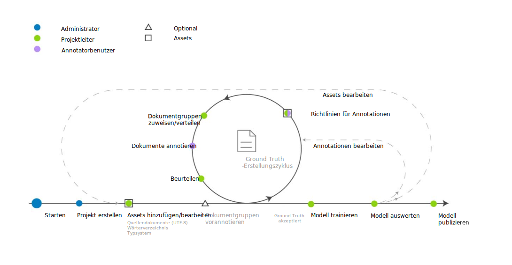

---

copyright:
  years: 2015, 2018
lastupdated: "2018-04-04"

---

{:shortdesc: .shortdesc}
{:new_window: target="_blank"}
{:tip: .tip}
{:pre: .pre}
{:codeblock: .codeblock}
{:screen: .screen}
{:javascript: .ph data-hd-programlang='javascript'}
{:java: .ph data-hd-programlang='java'}
{:python: .ph data-hd-programlang='python'}
{:swift: .ph data-hd-programlang='swift'}

Diese Dokumentation bezieht sich auf {{site.data.keyword.knowledgestudiofull}} on {{site.data.keyword.cloud}}. Die Dokumentation für die Vorgängerversion {{site.data.keyword.knowledgestudioshort}} on {{site.data.keyword.IBM_notm}} Marketplace kann über [diesen Link](https://console.bluemix.net/docs/services/knowledge-studio/ml-annotator.html){: new_window} aufgerufen werden.
{: tip}

# Workflow für die Erstellung eines Modells für maschinelles Lernen
{: #ml_annotator}

Erstellen Sie ein Modell für maschinelles Lernen, um ein Modell zu trainieren, mit dem Sie relevante Entitäten, Koreferenzen und Beziehungen in neuen Dokumenten identifizieren können.
{: shortdesc}

Machen Sie sich mit dem typischen Workflow zum Erstellen eines Modells für maschinelles Lernen in {{site.data.keyword.knowledgestudioshort}} vertraut.

Alle zugehörigen Schritte werden vom Projektleiter ausgeführt, ausgenommen der Schritt *Dokumente annotieren*, der vom Annotatorbenutzer ausgeführt wird. Da Annotatorbenutzer häufig Fachleute sind, können Sie auch in die Erstellung der Arbeitsbereichsressourcen (z. B. des Typsystems) einbezogen werden.

 Abbildung 1. Der Workflow zum Entwickeln eines Modells für maschinelles Lernen

<table cellpadding="4" cellspacing="0" summary="Modell erstellen und optimieren" border="1" class="simpletable"><tr class="sthead"><th valign="bottom" align="left" id="d14771e70" class="stentry thleft thbot">Schritt</th>
<th valign="bottom" align="left" id="d14771e72" class="stentry thleft thbot">Beschreibung</th>
</tr>
<tr class="strow"><td valign="top" headers="d14771e70" class="stentry">
Erstellen Sie einen Arbeitsbereich. 
</td>
<td valign="top" headers="d14771e72" class="stentry">
Siehe [Arbeitsbereich erstellen](/docs/services/watson-knowledge-studio/create-project.html). Ein Arbeitsbereich enthält die Ressourcen, die zum Erstellen des Modells verwendet werden. Dazu gehören die folgenden Ressourcen: 
<dl class="dl"><dt class="dt dlterm">Typsystem</dt>
<dd class="dd">
Erstellen Sie das Typsystem oder laden Sie es hoch und definieren Sie die Entitäts- und Beziehungstypen, die
Annotatorbenutzer beim Annotieren von Text anwenden können. Der Modellprozessmanager definiert das Typsystem
in der Regel zusammen mit Fachleuten des jeweiligen Fachgebiets. Siehe [Typsystem einrichten](/docs/services/watson-knowledge-studio/typesystem.html).
</dd>
<dt class="dt dlterm">Quellendokumente</dt>
<dd class="dd">
Erstellen Sie einen Korpus durch Hochladen von Beispieldokumenten, die für den Inhalt des betreffenden
Fachgebiets repräsentativ sind. Siehe [Dokumente zum Annotieren hinzufügen](/docs/services/watson-knowledge-studio/document-for-annotation.html). Teilen
Sie den Korpus in Dokumentgruppen auf, geben Sie den Prozentsatz der Dokumente an, die von allen Dokumentgruppen gemeinsam genutzt werden, und ordnen Sie
die Dokumentgruppen den Annotatorbenutzern zu. Siehe [Annotationsgruppen erstellen und zuordnen](/docs/services/watson-knowledge-studio/documents-for-annotation.html#wks_projdocsets).
</dd>
<dt class="dt dlterm">Wörterverzeichnisse</dt>
<dd class="dd">
Erstellen Sie Wörterverzeichnisse zum Annotieren von Text oder laden Sie Wörterverzeichnisse hoch. Sie können Einträge
für Wörterverzeichnisse entweder manuell hinzufügen oder aus einer Datei hochladen und anschließend bearbeiten. Siehe [Wörterverzeichnisse erstellen](/docs/services/watson-knowledge-studio/dictionaries.html).
</dd>
</dl>
</td>
</tr>
<tr class="strow"><td valign="top" headers="d14771e70" class="stentry">
<strong class="ph b">Optional</strong>: Dokumente vorannotieren
</td>
<td valign="top" headers="d14771e72" class="stentry">
Beim Vorannotieren von Dokumenten können Sie Begriffe aus den Wörterverzeichnissen des Arbeitsbereichs, Erwähnungen von {{site.data.keyword.nlushort}}-Typen
verwenden oder Regeln, die von Ihnen definiert werden. Siehe [Annotationsprozess beschleunigen](/docs/services/watson-knowledge-studio/preannotation.html#wks_preannotate).
</td>
</tr>
<tr class="strow"><td valign="top" headers="d14771e70" class="stentry">
Dokumente annotieren
</td>
<td valign="top" headers="d14771e72" class="stentry"><ol class="ol"><li class="li">
Der Projektleiter
ordnet Annotationstasks für Annotatorbenutzer zu, konfiguriert den Schwellenwert für die Übereinstimmung der Annotatoren
und legt Annotationsrichtlinien fest, die von den Annotatorbenutzern einzuhalten sind. Siehe [Annotationstask erstellen](/docs/services/watson-knowledge-studio/annotate-documents.html#wks_hatask).
</li>
<li class="li">
Die Annotatorbenutzer verwenden den Ground Truth-Editor, um Dokumente
zu annotieren. Ein Annotatorbenutzer identifiziert relevante Erwähnungen in Ihren fachspezifischen Inhalten und
kennzeichnet (beschriftet) sie mit Entitätstypen. Außerdem identifiziert der Annotatorbenutzer Beziehungen
zwischen Erwähnungen (z. B. 'Mary ist beschäftigt bei IBM') und Koreferenzen der Erwähnungen, die auf dieselbe
Entität verweisen (z. B. ein Vorkommen des Pronomens 'sie', das auf Mary verweist). Siehe [Dokumente annotieren](/docs/services/watson-knowledge-studio/user-guide.html).
</li>
</ol>
</td>
</tr>
<tr class="strow"><td valign="top" headers="d14771e70" class="stentry">
Dokumente beurteilen und umstufen
</td>
<td valign="top" headers="d14771e72" class="stentry">
Die von Annotatorbenutzern generierte Ground Truth akzeptieren oder ablehnen und
die Abweichungen zwischen Annotationen beurteilen, um Konflikte zu beheben. Das Bewerten der Richtigkeit und Konsistenz der
von Annotatorbenutzern erstellten Annotationen sollte gegebenenfalls durch einen leitenden (besonders erfahrenen) Annotatorbenutzer erfolgen oder durch
einen Benutzer, der über mehr Fachwissen verfügt als der Projektleiter. Siehe [Beurteilung](/docs/services/watson-knowledge-studio/build-groundtruth.html#wks_haperform).
</td>
</tr>
<tr class="strow"><td valign="top" headers="d14771e70" class="stentry">
Trainieren Sie das Modell.
</td>
<td valign="top" headers="d14771e72" class="stentry">
Erstellen Sie das Modell für maschinelles Lernen. Siehe [Modell für maschinelles Lernen erstellen](/docs/services/watson-knowledge-studio/train-ml.html#wks_madocsets).
</td>
</tr>
<tr class="strow"><td valign="top" headers="d14771e70" class="stentry">
Werten Sie das Modell aus.
</td>
<td valign="top" headers="d14771e72" class="stentry">
Evaluieren Sie die Genauigkeit des Modells. Siehe [Vom Modell hinzugefügte Annotationen auswerten](/docs/services/watson-knowledge-studio/train-ml.html#wks_matest). Je nach Modellgenauigkeit müssen nach diesem Schritt möglicherweise
vorherige Schritte mehrfach wiederholt werden, bis die optimale Genauigkeit erreicht ist. Hinweise zum Umfang und Inhalt der Aktualisierung finden Sie unter [Leistung des Modells für maschinelles Lernen analysieren](/docs/services/watson-knowledge-studio/evaluate-ml.html).
</td>
</tr>
<tr class="strow"><td valign="top" headers="d14771e70" class="stentry">
Publizieren Sie das Modell.
</td>
<td valign="top" headers="d14771e72" class="stentry">
Exportieren Sie das Modell oder stellen Sie es bereit. Siehe [Modell für maschinelles Lernen verwenden](/docs/services/watson-knowledge-studio/publish-ml.html).
</td>
</tr>
</table>
