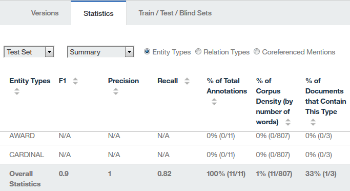

---

copyright:
  years: 2015, 2018
lastupdated: "2018-08-24"

---

{:shortdesc: .shortdesc}
{:new_window: target="_blank"}
{:tip: .tip}
{:pre: .pre}
{:codeblock: .codeblock}
{:screen: .screen}
{:javascript: .ph data-hd-programlang='javascript'}
{:java: .ph data-hd-programlang='java'}
{:python: .ph data-hd-programlang='python'}
{:swift: .ph data-hd-programlang='swift'}

Diese Dokumentation bezieht sich auf {{site.data.keyword.knowledgestudiofull}} on {{site.data.keyword.cloud}}. Die Dokumentation für die Vorgängerversion {{site.data.keyword.knowledgestudioshort}} on {{site.data.keyword.IBM_notm}} Marketplace kann über [diesen Link ](https://{DomainName}/docs/services/knowledge-studio/tutorials-create-ml-model.html){: new_window} aufgerufen werden.
{: tip}

# Modell für maschinelles Lernen erstellen
{: #wks_tutml_intro}

In diesem Lernprogramm erfahren Sie mehr über den Prozess zum Erstellen eines Modells für maschinelles Lernen, das Sie bereitstellen und mit anderen {{site.data.keyword.watson}}-Services verwenden können.
{: shortdesc}

## Lernziele
{: #objectives}

Nach dem Durcharbeiten der Lerneinheiten in diesem Lernprogramm können Sie die folgenden Tasks ausführen:

- Dokumentgruppen erstellen
- Dokumente vorannotieren
- Tasks für Annotatorbenutzer erstellen
- Übereinstimmung der Annotatoren analysieren und Konflikte in annotierten Dokumenten beurteilen
- Modelle für maschinelles Lernen erstellen

Das Durcharbeiten dieses Lernprogramms dauert ungefähr 60 Minuten. Wenn Sie weitere Konzepte im Zusammenhang mit diesem Lernprogramm erkunden, kann das Durcharbeiten länger dauern.

## Vorbereitungen
{: #prereqs}

- Vergewissern Sie sich, dass Sie einen unterstützten Browser verwenden. Siehe [Browseranforderungen](/docs/services/watson-knowledge-studio/system-requirements.html).
- Sie haben die [Einführung in {{site.data.keyword.knowledgestudioshort}}](/docs/services/watson-knowledge-studio/tutorials-create-project.html) erfolgreich abgeschlossen. Sie umfasst das Erstellen eines Arbeitsbereichs, das Erstellen eines Typsystems und das Hinzufügen eines Wörterverzeichnisses.
- Sie müssen über mindestens eine Benutzer-ID in der Rolle "Admin" oder "Projektleiter" verfügen. 

    > **Hinweis:** Falls möglich, verwenden Sie in diesem Lernprogramm mehrere Benutzer-IDs für die Tasks des Modells für maschinelles Lernen (eine Benutzer-ID mit Administrator- oder Projektleiterberechtigungen und mindestens zwei Benutzer-IDs für Annotatorbenutzer). Die Verwendung mehrerer Benutzer-IDs ermöglicht eine besonders realitätsnahe Simulation eines tatsächlichen {{site.data.keyword.knowledgestudiofull}}-Arbeitsbereichs, in dem ein Projektleiter die von mehreren Annotatorbenutzern erstellten Annotationen koordinieren und beurteilen muss. Wenn Ihnen nur eine einzige Benutzer-ID zur Verfügung steht, können Sie dennoch die meisten Teile dieses Prozesses simulieren.

    Informationen zu Benutzerrollen finden Sie in [Benutzerrollen in {{site.data.keyword.knowledgestudioshort}}](/docs/services/watson-knowledge-studio/roles.html).

## Ergebnisse
{: #results}

Nach Abschluss dieses Lernprogramms verfügen Sie über ein angepasstes Modell für maschinelles Lernen, das mit anderen {{site.data.keyword.watson}}-Services verwendet werden kann.

## Lerneinheit 1: Dokumente zum Annotieren hinzufügen
{: #tut_lessml1}

In dieser Lerneinheit erfahren Sie, wie Dokumente zu einem Arbeitsbereich in {{site.data.keyword.knowledgestudioshort}} hinzugefügt werden, die von Annotatorbenutzern annotiert werden können.

### Informationen zu diesem Vorgang
{: #tut_lessml1_about}

Weitere Informationen zum Hinzufügen von Dokumenten finden Sie unter [Dokument zu einem Arbeitsbereich hinzufügen](/docs/services/watson-knowledge-studio/documents-for-annotation.html#wks_projadd).

### Vorgehensweise
{: #tut_lessml1_procedure}

1. Laden Sie die Datei <a target="_blank" href="https://watson-developer-cloud.github.io/doc-tutorial-downloads/knowledge-studio/documents-new.csv" download>`documents-new.csv` </a> in Ihren Computer herunter. Diese Datei enthält Beispieldokumente, die hochgeladen werden können.
1. Klicken Sie in Ihrem Arbeitsbereich auf **Assets** > **Dokumente**.
1. Klicken Sie auf der Seite 'Dokumente' auf **Dokumentgruppen hochladen**.
1. Laden Sie die Datei `documents-new.csv` auf Ihren Computer herunter. Die hochgeladene Datei wird in der Tabelle angezeigt.

### Nächste Schritte
{: #tut_lessml1_next}

Sie können nun den Korpus in mehrere Dokumentgruppen aufteilen und die Dokumentgruppen Annotatorbenutzern zuordnen.

## Lerneinheit 2: Annotationsgruppe erstellen
{: #wks_tutless_ml2}

In dieser Lerneinheit erfahren Sie, wie Annotationsgruppen in {{site.data.keyword.knowledgestudioshort}} erstellt werden.

### Informationen zu diesem Vorgang
{: #wks_tutless_ml2_about}

Eine *Annotationsgruppe* ist eine Untergruppe von Dokumenten aus einer hochgeladenen Dokumentgruppe, die Sie einem Annotatorbenutzer zuordnen. Der Annotatorbenutzer annotiert die Dokumente in der Annotationsgruppe. Um später anhand der Scores für die Übereinstimmung der Annotatoren die von den einzelnen Annotatorbenutzern hinzugefügten Annotationen vergleichen zu können, müssen Sie mindestens zwei Annotatorbenutzer verschiedenen Annotationsgruppen zuordnen. Außerdem müssen Sie angeben, dass ein bestimmter Prozentsatz der Dokumente Überschneidungen zwischen den Gruppen aufweist.

> **Hinweis:** In einem realistischen Szenario würden Sie so viele Annotationsgruppen wie nötig für die Anzahl der Annotatorbenutzer erstellen, die an diesem Arbeitsbereich arbeiten. In diesem Lernprogramm werden Sie zwei Annotationsgruppen erstellen. Wenn Sie nicht über mehrere Benutzer-IDs verfügen, können Sie beide Annotationsgruppen demselben Benutzer zuordnen.

Weitere Informationen zu Annotationsgruppen finden Sie unter [Annotationsgruppen erstellen und zuordnen](/docs/services/watson-knowledge-studio/documents-for-annotation.html#wks_projdocsets).

### Vorgehensweise
{: #wks_tutless_ml2_procedure}

1. Klicken Sie in Ihrem Arbeitsbereich auf **Assets** > **Dokumente**.
2. Klicken Sie auf **Annotationsgruppen erstellen**.

    Das Fenster 'Annotationsgruppen erstellen' wird geöffnet. In diesem Fenster werden standardmäßig die Basisgruppe (sie enthält alle Dokumente) und die Felder zum Angeben der Informationen für eine neue Annotationsgruppe angezeigt.

3. Klicken Sie auf **Neue Gruppe und Annotatorbenutzer hinzufügen**, um die Felder zum Definieren einer weiteren Annotationsgruppe hinzuzufügen. Durch mehrmaliges Klicken auf diese Option können Sie beliebig viele Annotationsgruppen hinzufügen. Für dieses Lernprogramm benötigen Sie nur zwei Annotationsgruppen. 

    

4. Geben Sie in das Feld **Überschneidung** den Wert `100` ein. Dieser Wert gibt an, dass 100 Prozent der Dokumente aus der Basisgruppe in alle neuen Annotationsgruppen einbezogen werden sollen, damit sie von allen Annotatorbenutzern annotiert werden können.
5. Geben Sie für jede Annotationsgruppe die erforderlichen Informationen an.

    - Wählen Sie im Feld **Annotator** die Benutzer-ID eines Annotatorbenutzers aus, die der neuen Annotationsgruppe zugeordnet werden soll. Jede Annotationsgruppe sollte in einem realistischen Szenario einem anderen Annotatorbenutzer zugeordnet werden.

        > **Hinweis:** Wenn Sie nur über eine einzige Administrator-ID verfügen, die für dieses Lernprogramm verwendet werden kann, ordnen Sie die betreffende Benutzer-ID allen Annotationsgruppen zu. In einem realistischen Szenario haben Sie in der Regel mehrere Annotatorbenutzer, aber für die Zwecke dieses Lernprogramms kann der Administrator auch als Annotatorbenutzer agieren.

    - Geben Sie im Feld **Gruppenname** einen beschreibenden Namen für die Annotationsgruppe an. In diesem Lernprogramm können Sie die Namen `Gruppe 1` und `Gruppe 2` verwenden. 

6. Klicken Sie auf **Generieren**.

### Ergebnisse
{: #wks_tutless_ml2_results}

Die neuen Annotationsgruppen werden erstellt.

## Lerneinheit 3: Mit wörterverzeichnisbasiertem Annotator vorannotieren
{: #wks_tutless_ml3}

In dieser Lerneinheit erfahren Sie, wie ein wörterverzeichnisbasierter Annotator zum Vorannotieren von Dokumenten in {{site.data.keyword.knowledgestudioshort}} verwendet wird.

### Informationen zu diesem Vorgang
{: #wks_tutless_ml3_about}

Das Vorannotieren von Dokumenten ist ein optionaler Schritt. Es lohnt sich, diesen Schritt auszuführen, da er die spätere Arbeit des Annotatorbenutzers erleichtert.

Weitere Informationen zum Vorannotieren mit Wörterverzeichnissen finden Sie unter [Dokumente mit einem Wörterverzeichnis vorannotieren](/docs/services/watson-knowledge-studio/preannotation.html#wks_preannot).

### Vorgehensweise
{: #wks_tutless_ml3_procedure}

1. Klicken Sie in Ihrem Arbeitsbereich auf **Assets** > **Wörterverzeichnisse**.

  Das Wörterverzeichnis `Testwörterverzeichnis` wird geöffnet. In der Lerneinheit [Ein Wörterverzeichnis hinzufügen](/docs/services/watson-knowledge-studio/tutorials-create-project.html#wks_tutless4) des Lernprogramms *Einführung in {{site.data.keyword.knowledgestudioshort}}* wird gezeigt, wie Sie dieses Wörterverzeichnis erstellen können.

1. Wählen Sie in der Liste **Entitätstyp** den Entitätstyp `ORGANISATION` aus, um ihn dem Wörterverzeichnis `Testwörterverzeichnis` zuzuordnen.

  Die Lerneinheit [Ein Typsystem erstellen](/docs/services/watson-knowledge-studio/tutorials-create-project.html#wks_tutless3) des Lernprogramms *Einführung in {{site.data.keyword.knowledgestudioshort}}* zeigt, wie das Typsystem erstellt wird, das den Entitätstyp `ORGANISATION` enthält.

1. Klicken Sie auf der Registerkarte **Modell für maschinelles Lernen** > **Vorannotation** > **Wörterverzeichnisse** auf **Diesen Vorannotator anwenden**.
1. Wählen Sie die Annotationsgruppen aus, die Sie in der [Lerneinheit 2](/docs/services/watson-knowledge-studio/tutorials-create-ml-model.html#wks_tutless_ml2) erstellt haben, beziehen Sie aber die in der [Lerneinheit 1](/docs/services/watson-knowledge-studio/tutorials-create-ml-model.html#tut_lessml1) erstellte Dokumentgruppe nicht ein. 
1. Klicken Sie auf **Ausführen**.

    

### Ergebnisse
{: #wks_tutless_ml3_results}

Die Dokumente in den ausgewählten Gruppen werden mit dem von Ihnen erstellten Wörterverzeichnis vorannotiert. Wenn Sie möchten, können Sie das Wörterverzeichnis verwenden, um später hinzugefügte Dokument- oder Annotationsgruppen vorab zu annotieren.

## Lerneinheit 4: Annotationstask erstellen
{: #wks_tutless_ml4}

In dieser Lerneinheit erfahren Sie, wie Annotationstasks verwendet werden, um den Arbeitsfortschritt der Annotatorbenutzer in {{site.data.keyword.knowledgestudioshort}} zu überwachen.

### Informationen zu diesem Vorgang
{: #wks_tutless_ml4_about}

Weitere Informationen zu Annotationstasks finden Sie unter [Annotationstask erstellen](/docs/services/watson-knowledge-studio/annotate-documents.html#wks_hatask).

### Vorgehensweise
{: #wks_tutless_ml4_procedure}

1. Klicken Sie in Ihrem Arbeitsbereich auf **Modell für maschinelles Lernen** > **Annotationstasks**.
2. Klicken Sie auf der Seite 'Tasks' auf **Task hinzufügen**.
3. Geben Sie die Details für die Task an:

    - Geben Sie in das Feld **Taskname** die Zeichenfolge `Test` ein.
    - Wählen Sie im Feld **Termin** ein Datum aus, das in der Zukunft liegt.

4. Klicken Sie auf **Erstellen**.
5. Wählen Sie die Annotationsgruppen aus, die Sie in der [Lerneinheit 2](/docs/services/watson-knowledge-studio/tutorials-create-ml-model.html#wks_tutless_ml2) erstellt haben.

 Wenn Sie beide Annotationsgruppen auswählen, wird angegeben, dass beide Gruppen von den zugeordneten Annotatorbenutzern annotiert werden müssen, um diese Task auszuführen.

7. Klicken Sie auf **Task erstellen**.
8. Da Annotatorbenutzer beginnen, Dokumente mit Annotationen zu versehen, können Sie Tasks öffnen, um deren Fortschritt anzuzeigen.

## Lerneinheit 5: Dokumente annotieren
{: #wks_tutless_ml5}

In dieser Lerneinheit erfahren Sie, wie der *Ground Truth-Editor* zum Annotieren von Dokumenten in {{site.data.keyword.knowledgestudioshort}} verwendet wird.

### Informationen zu diesem Vorgang
{: #wks_tutless_ml5_about}

Weitere Informationen zur Arbeit der Annotatorbenutzer finden Sie unter [Annotieren mit dem Ground Truth-Editor](/docs/services/watson-knowledge-studio/user-guide.html#wks_hagte).

### Vorgehensweise
{: #wks_tutless_ml5_procedure}

1. Melden Sie sich bei {{site.data.keyword.knowledgestudioshort}} als ein zugeordneter Benutzer der Annotationstask an, die Sie in der [Lerneinheit 4](/docs/services/watson-knowledge-studio/tutorials-create-ml-model.html#wks_tutless_ml4) erstellt haben.

    > **Hinweis:** Wenn Sie in diesem Lernprogramm nur auf eine einzige Benutzer-ID zugreifen können, können Sie unter der betreffenden Benutzer-ID auch die Aufgaben eines Annotatorbenutzers ausführen. Beachten Sie jedoch, dass in einem realistischen Szenario mehrere verschiedene Benutzer mit der Rolle 'Annotatorbenutzer' Annotationen hinzufügen.

1. Öffnen Sie den Arbeitsbereich `Mein Arbeitsbereich` und klicken Sie auf **Modell für maschinelles Lernen** > **Annotationstasks**.
1. Öffnen Sie die Annotationstask `Test`, die Sie in der [Lerneinheit 4](/docs/services/watson-knowledge-studio/tutorials-create-ml-model.html#wks_tutless_ml4) erstellt haben.
1. Klicken Sie auf **Annotieren** für eines der zugeordneten Annotationsgruppen.

  Je nachdem, wie Sie die Annotationsgruppen eingerichtet haben, können Sie eine oder mehrere Annotationstasks für die Benutzer-ID, mit der Sie sich angemeldet haben, zugewiesen bekommen.

1. Suchen Sie in der Liste der Dokumente das Dokument *Technology - gmanews.tv* und öffnen Sie es.

  Beachten Sie, dass der Begriff `IBM` bereits mit dem Entitätstyp `ORGANISATION` annotiert wurde. Diese Anmerkung wurde vom Wörterbuchvorannotator hinzugefügt, der in der [Lerneinheit 3](/docs/services/watson-knowledge-studio/tutorials-create-ml-model.html#wks_tutless_ml3) angewendet wurde. Diese Voranmerkung ist korrekt, so dass sie nicht geändert werden muss.

  

1. So annotieren Sie eine Erwähnung:

    1. Klicken Sie auf die Registerkarte 'Entität'.
    2. Wählen Sie im Hauptteil des Dokuments den Text `Thomas Watson` aus.
    3. Klicken Sie in der Liste der Entitätstypen auf `PERSON`. Der Entitätstyp `PERSON` wird auf die ausgewählte Erwähnung angewendet.

        

1. Gehen Sie wie folgt vor, um eine Beziehung zu annotieren:

    1. Klicken Sie auf die Registerkarte 'Beziehung'.
    1. Wählen Sie die Erwähnungen `Thomas Watson` und `IBM` in der angegebenen Reihenfolge aus. Um eine Erwähnung auszuwählen, klicken Sie auf die Entitätstypbeschriftung über dem Text.
    1. Klicken Sie in der Liste der Beziehungstypen auf `GründerVon`. Die beiden Erwähnungen werden durch eine Beziehung `GründerVon` verbunden.

        

1. Wählen Sie im Statusmenü die Option **Abgeschlossen** aus und klicken Sie anschließend auf die Schaltfläche **Speichern**.
1. Klicken Sie auf **Dokumentliste öffnen**, um zur Liste der Dokumente für diese Task zurückzukehren, und klicken Sie auf **Alle Dokumente abschicken**, um die Dokumente zur Genehmigung zu übergeben.

    > **Hinweis:** In einer realistischen Situation werden vor dem Abschicken viele weitere Annotationen erstellt und alle Dokumente in der Gruppe bearbeitet.

1. Schließen Sie diese Annotationsgruppe und öffnen Sie anschließend die andere Annotationsgruppe in der Task `Test`.

   Je nachdem, wie Sie die Annotationstasks eingerichtet und welchen Benutzern Sie sie zugeordnet haben, müssen Sie sich möglicherweise bei {{site.data.keyword.knowledgestudioshort}} als den Benutzer anmelden, der der anderen in der Annotationstask festgelegten Annotation zugeordnet ist.

1. Fügen Sie die gleichen Annotationen im Dokument *Technology - gmanews.tv* hinzu, aber verwenden Sie nun die Beziehung `beschäftigtBei` anstelle der Beziehung `GründerVon`.

  Die Anmeldung mit einer anderen Benutzer-ID ist erforderlich, um in der nächsten Lerneinheit die Übereinstimmung zwischen Annotatoren zu veranschaulichen. Wenn Sie jedoch nur einen einzigen Benutzer haben, können Sie das Lernprogramm dennoch abschließen, um ein Verständnis dafür zu erhalten, wie die Übereinstimmung der Annotatoren funktioniert.

1. Nachdem Sie die Annotationen für die zweite Annotationsgruppe abgeschlossen haben, klicken Sie auf **Alle Dokumente abschicken**.

## Lerneinheit 6: Übereinstimmung der Annotatoren analysieren
{: #wks_tutless_ml6}

In dieser Lerneinheit erfahren Sie, wie die Arbeitsergebnisse mehrerer Annotatorbenutzer in {{site.data.keyword.knowledgestudioshort}} verglichen werden.

### Informationen zu diesem Vorgang
{: #wks_tutless_ml6_about}

Um festzustellen, ob verschiedene Annotatorbenutzer die Dokumente mit Überschneidungen konsistent annotieren, überprüfen Sie die Scores für die *Übereinstimmung der Annotatoren* (Inter-Annotator Agreement, IAA).

Bei der Berechnung der IAA-Scores durchsucht {{site.data.keyword.knowledgestudioshort}} alle Dokumente mit Überschneidungen in allen Dokumentgruppen der Task, unabhängig vom Status der Dokumentgruppen. Die IAA-Scores zeigen, wie unterschiedlich die Erwähnungen, Beziehungen und Koreferenzketten von verschiedene Annotatorbenutzer annotiert wurden. Es wird empfohlen, die IAA-Scores regelmäßig zu überprüfen, um sicherzustellen, dass die Annotatorbenutzer konsistente Annotationen erstellen.

In diesem Lernprogramm wurden alle Dokumentgruppen von den Annotatorbenutzern zur Genehmigung eingereicht. Wenn die Scores für die Übereinstimmung der Annotatoren akzeptabel sind, können Sie die Dokumentgruppen genehmigen. Wenn Sie eine Dokumentgruppe ablehnen, wird sie zur Optimierung an den Annotatorbenutzer zurückgegeben.

Weitere Informationen zur Übereinstimmung der Annotatoren finden Sie unter [Ground Truth erstellen](/docs/services/watson-knowledge-studio/build-groundtruth.html).

### Vorgehensweise
{: #wks_tutless_ml6_procedure}

1. Melden Sie sich bei {{site.data.keyword.knowledgestudioshort}} als Administrator an, wählen Sie **Modell für maschinelles Lernen** > **Annotationstasks** aus und klicken Sie auf die Task `Test`.

  In der Spalte **Status** wird angezeigt, dass die Dokumentgruppen eingereicht wurden.

1. Klicken Sie auf **Übereinstimmung der Annotatoren berechnen**.
1. Rufen Sie die IAA-Scores für Erwähnungen, Beziehungen und Koreferenzketten auf, indem Sie auf das erste Menü klicken. Sie können auch die Übereinstimmung für einzelne Annotatorbenutzerpaare anzeigen. Außerdem können Sie die Übereinstimmung für bestimmte Dokumente anzeigen. Im Allgemeinen sollte der Score-Wert bei 0,8 liegen (der Wert 1 bedeutet absolute Übereinstimmung). Da in diesem Lernprogramm nur zwei Entitätstypen annotiert wurden, ist für die meisten Entitätstypen der Score `N/A` (nicht zutreffend) angegeben, d. h. aufgrund fehlender Informationen kann kein Score vergeben werden.

    *Abbildung 1. Scores für die Übereinstimmung der Annotatorbenutzer `Dave` and `Phil` überprüfen*

    

1. Nach dem Überprüfen der Scores können Sie entscheiden, ob Sie Dokumentgruppen, die den Status `ABGESCHICKT` aufweisen, genehmigen oder ablehnen wollen. Führen Sie eine der folgenden Aktionen aus:

    - Wenn die Scores für eine Annotationsgruppe akzeptabel sind, wählen Sie das Kontrollkästchen aus und klicken Sie auf **Akzeptieren**. Dokumente, die keine Überschneidungen mit anderen Dokumentgruppen aufweisen, werden in die Ground Truth hochgestuft. Dokumente, die Überschneidungen aufweisen, müssen zuerst eine Beurteilung durchlaufen, damit die Konflikte behoben werden können. Akzeptieren Sie für dieses Lernprogramms beide Dokumentgruppen.
    - Wenn die Scores für eine Annotationsgruppe nicht akzeptabel sind, wählen Sie das Kontrollkästchen aus und klicken Sie auf **Ablehnen**. Das betreffende Dokument muss vom Annotatorbenutzer erneut bearbeitet werden, um die Annotationen zu verbessern.

### Ergebnisse
{: #wks_tutless_ml6_results}

Beim Auswerten der Scores für die Übereinstimmung der Annotatoren konnten Sie erkennen, dass dasselbe Dokument von verschiedenen Annotatorbenutzerpaaren annotiert wurde. Wenn der Score für die Übereinstimmung der Annotatoren akzeptabel war, haben Sie die betreffende Dokumentgruppe akzeptiert.

## Lerneinheit 7: Konflikte in annotierten Dokumenten beurteilen
{: #wks_tutless_ml7}

In dieser Lerneinheit erfahren Sie, wie Konflikte in Dokumenten beurteilt werden, die Überschneidungen zwischen Dokumentgruppen in {{site.data.keyword.knowledgestudioshort}} aufweisen.

### Informationen zu diesem Vorgang
{: #wks_tutless_ml7_about}

Wenn Sie eine Dokumentgruppe genehmigen, werden nur diejenigen Dokumente, die keine Überschneidungen mit anderen Dokumentgruppen aufweisen, in die Ground Truth hochgestuft. Wenn ein Dokument Überschneidungen mit mehreren Dokumentgruppen aufweist, müssen Sie alle Annotationskonflikte beurteilen und beheben, bevor das Dokument in die Ground Truth hochgestuft werden kann.

Weitere Informationen zur Beurteilung finden Sie unter [Ground Truth erstellen](/docs/services/watson-knowledge-studio/build-groundtruth.html).

### Vorgehensweise
{: #wks_tutless_ml7_procedure}

1. Melden Sie sich bei {{site.data.keyword.knowledgestudioshort}} als Administrator an, wählen Sie **Modell für maschinelles Lernen** > **Annotationstasks** aus und klicken Sie auf die Task `Test`.
1. Stellen Sie sicher, dass beide Dokumentgruppen genehmigt wurden.
1. Klicken Sie auf **Dokumente mit Überschneidungen auf Konflikte prüfen**.

    Es wird angezeigt, welche Dokumente mit Überschneidungen von mehr als einem Annotatorbenutzer annotiert wurden.

1. Da das Lernprogramm Sie angewiesen hat, eine widersprüchliche Beziehung für das Dokument *Technology-gmanews.tv* zu erstellen, suchen Sie dieses Dokument in der Liste und klicken Sie auf **Auf Konflikte prüfen**.
1. Wählen Sie die beiden widersprüchlichen Annotationsgruppen aus und klicken Sie auf **Auf Konflikte prüfen**.

    Der Beurteilungsmodus wird geöffnet. Im Beurteilungsmodus wird angezeigt, wie viele Dokumente sich überschneiden. Sie können Konflikte prüfen und Sie können Annotationen entfernen oder ersetzen, bevor Sie die Dokumente for die Ground Truth hochstufen.

1. Wählen Sie **Beziehungskonflikte** aus, akzeptieren Sie die `GründerVon`-Beziehung und weisen Sie die Beziehung `beschäftigtBei` zurück.
1. Klicken Sie auf **In Ground Truth hochstufen**.

    Alternativ können Sie ein Dokument in die Ground Truth hochstufen, indem Sie auf der Seite 'Dokumente' auf **Akzeptieren** klicken.

### Ergebnisse
{: #wks_tutless_ml7_results}

Nachdem Sie die Annotationskonflikte behoben und die Dokumente in die Ground Truth hochgestuft haben, können Sie die Dokumente zum Trainieren des Modells für maschinelles Lernen verwenden.

## Lerneinheit 8: Ein Modell für maschinelles Lernen erstellen
{: #wks_tutless_ml8}

In dieser Lerneinheit erfahren Sie, wie ein Modell für maschinelles Lernen in {{site.data.keyword.knowledgestudioshort}} erstellt wird.

### Informationen zu diesem Vorgang
{: #wks_tutless_ml8_about}

Beim Erstellen eines Modells für maschinelles Lernen wählen Sie die Dokumentgruppen aus, die Sie zum Trainieren des Modells verwenden möchten. Außerdem geben Sie an, welcher Prozentsatz der Dokumente als Trainingsdaten, Testdaten und Blinddaten verwendet werden soll. Nur Dokumente, die durch Beurteilung oder Genehmigung in die Ground Truth hochgestuft wurden, können zum Trainieren des Modells für maschinelles Lernen verwendet werden.

Weitere Informationen zum Modell für maschinelles Lernen finden Sie unter [Modell für maschinelles Lernen trainieren](/docs/services/watson-knowledge-studio/train-ml.html) und [Leistung des Modells für maschinelles Lernen analysieren](/docs/services/watson-knowledge-studio/evaluate-ml.html).

### Vorgehensweise
{: #wks_tutless_ml8_procedure}

1. Melden Sie sich bei {{site.data.keyword.knowledgestudioshort}} als Administrator an.
1. Klicken Sie auf **Modell für maschinelles Lernen** > **Leistung** > **Trainieren und auswerten**.
2. Wählen Sie **Alle** aus und klicken Sie dann auf **Trainieren & auswerten**.

    > **Hinweis:** Das Trainieren kann abhängig von der Anzahl der durch Annotatorbenutzer hinzugefügten Annotationen und der Anzahl der Annotatorbenutzer und der Anzahl der Wörter in allen Dokumenten von mehr als zehn Minuten bis mehrere Stunden dauern.

3. Nachdem das Modell für maschinelles Lernen trainiert wurde, können Sie es aus der Versionsseite exportieren oder detaillierte Informationen zur Leistung des Modells anzeigen, indem Sie auf den Link **Detaillierte Statistik** klicken, der auf der Seite 'Leistung' über jedem Diagramm angezeigt wird.
4. Um die Seite für Trainings-, Test- und Blinddaten anzuzeigen, klicken Sie auf die Schaltfläche **Trainieren und auswerten**.
5. Um die Dokumente anzuzeigen, die von den Annotatorbenutzern bearbeitet wurden, klicken Sie auf **Ground Truth anzeigen**.
6. Um die Annotationen anzuzeigen, die von dem trainierten Modell für maschinelles Lernen in derselben Dokumentgruppe hinzugefügt wurden, klicken Sie auf **Decodierungsergebnisse anzeigen**.
7. Um Details zu Genauigkeit, Vollständigkeit und F1-Scores für das Modell für maschinelles Lernen anzuzeigen, klicken Sie auf die Seite 'Leistung'.
8. Klicken Sie auf den Link **Detaillierte Statistik**, der über jedem Diagramm angezeigt wird. Auf diesen Statistikseiten können Sie mithilfe der entsprechenden Optionsfelder die Scores für Erwähnungen, Beziehungen und Koreferenzketten anzeigen.

    Zum Analysieren der Leistung können Sie eine Zusammenfassung der Statistikdaten für Entitätstypen, Beziehungstypen und Koreferenzketten anzeigen. Außerdem können sie die Statistikdaten analysieren, die in ein er *Fehlermatrix* dargestellt werden. Um die Matrix anzuzeigen, ändern Sie die **Zusammenfassung** in **Fehlermatrix**. Anhand der Fehlermatrix können Sie die vom Modell für maschinelles Lernen hinzugefügten Annotationen mit den Annotationen in der Ground Truth vergleichen.

    > **Hinweis:** In diesem Lernprogramm haben Sie Dokumente nur mit einem einzigen Wörterverzeichnis für Organisationen annotiert. Daher wird für die meisten Entitätstypen der Score `0` oder `N/A` (nicht zutreffend) angezeigt, mit Ausnahme des Typs `ORGANISATION`. Die Scores sind niedrig, doch das war zu erwarten, da weder Annotationen von Annotatorbenutzern noch Korrekturen vorgenommen wurden.

    *Abbildung 2. Optionen auf der Seite 'Statistik' für ein Modell für maschinelles Lernen*

    

9.  Klicken Sie auf **Versionen**. Auf der Seite 'Versionen' können Sie einen Snapshot des Modells und der für die Erstellung des Modells verwendeten Ressourcen (mit Ausnahme von Wörterverzeichnissen und Annotationstasks) erstellen. Sie können beispielsweise einen Snapshot erstellen, bevor Sie das Modell erneut trainieren. Wenn die Leistungswerte nach dem erneuten Trainieren schlechter sind, können Sie die frühere Version hochstufen und die Versionen mit den schlechteren Ergebnissen löschen.

### Ergebnisse
{: #wks_tutless_ml8_results}

Sie haben ein Modell für maschinelles Lernen erstellt, trainiert und die Leistung des Modells durch Annotieren von Test- und Blinddaten ausgewertet. Durch Überprüfen der Leistungsmetriken können Sie Methoden finden, um die Genauigkeit des Modells für maschinelles Lernen zu verbessern.

## Zusammenfassung des Lernprogramms
{: #wks_tutml_sum}

Sie haben ein Modell für maschinelles Lernen erstellt.

### Eingeübte Lerninhalte
{: #lessons_learned}

Beim Durcharbeiten dieses Lernprogramms haben Sie die folgenden Konzepte kennengelernt:

- Dokumentgruppen
- Modelle für maschinelles Lernen
- Annotatorbenutzertasks
- Übereinstimmung der Annotatoren und Beurteilung
