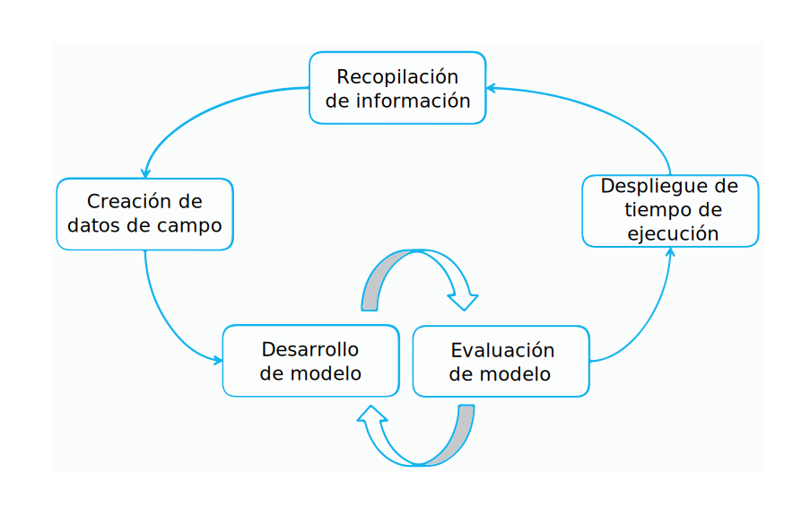

---

copyright:
  years: 2015, 2018
lastupdated: "2018-04-04"

---

{:shortdesc: .shortdesc}
{:new_window: target="_blank"}
{:tip: .tip}
{:pre: .pre}
{:codeblock: .codeblock}
{:screen: .screen}
{:javascript: .ph data-hd-programlang='javascript'}
{:java: .ph data-hd-programlang='java'}
{:python: .ph data-hd-programlang='python'}
{:swift: .ph data-hd-programlang='swift'}

Esta documentación es para {{site.data.keyword.knowledgestudiofull}} en {{site.data.keyword.cloud}}. Para ver la documentación para la versión anterior de {{site.data.keyword.knowledgestudioshort}} en {{site.data.keyword.IBM_notm}} Marketplace, [pulse este enlace ](https://console.bluemix.net/docs/services/knowledge-studio/annotate-documents.html){: new_window}.
{: tip}

# Configuración de la anotación
{: #annotate-documents}

Los usuarios que tengan conocimientos sobre el sector y su lenguaje deben anotar los documentos.
{: shortdesc}

Realice las tareas siguientes para permitir que los anotadores humanos puedan acceder al espacio:

- Invitar a los expertos en la materia a la instancia de {{site.data.keyword.knowledgestudioshort}} que está utilizando.
- Asociar los anotadores humanos con el conjunto o conjuntos de anotaciones que desea que anoten.
- Crear una tarea que asigna el anotador humano para anotar los documentos del conjunto.

    > **Atención:** No es hasta que asigne tareas explícitamente a anotadores humanos que podrán ver su espacio de trabajo cuando inicien sesión en {{site.data.keyword.knowledgestudioshort}}.

Sus usuarios (los anotadores humanos) deberán familiarizarse con [Anotación de documentos](/docs/services/watson-knowledge-studio/user-guide.html), que contiene información detallada sobre cómo anotar documentos.

## Modelo de ciclo de vida
{: #wks_lifecycle}

El modelo que cree con {{site.data.keyword.knowledgestudioshort}} es un componente de software que puede conectarse a un conducto de proceso de lenguaje natural (NLP).

Con {{site.data.keyword.knowledgestudioshort}}, puede crear, evaluar y mejorar los modelos para nuevos dominios. Un modelo añade anotaciones (metadatos) a texto que aparece en el contenido de lenguaje natural. Las anotaciones, que identifican menciones de entidades de interés en el contenido de dominio, las relaciones entre ellas y cómo las menciones hacen correferencia a la misma entidad, las pueden utilizar las aplicaciones para analizar y procesar texto automáticamente. Los usuarios de la aplicación se benefician de este nivel de análisis pudiendo extraer significado, descubrir conocimiento y obtener respuestas en un contexto de lenguaje natural.

La creación de un modelo es un proceso de varios pasos iterativo que implica varias etapas: recopilación de información, generación de datos de campo, desarrollo de modelos, evaluación de modelos y despliegue de tiempo de ejecución.

### Adaptación de dominio completo
{: #wks_lifecycle__wks_lifecycleS6}

El diagrama siguiente resume las interacciones entre estas cinco etapas de desarrollo de modelos y las actividades típicas que se producen en cada etapa.

 Figura 2. Un resumen de las cinco etapas de desarrollo de modelos y las actividades que se producen en cada etapa.

### Recopilación de información
{: #wks_lifecycle__wks_lifecycleS1}

Esta etapa, que es externa para {{site.data.keyword.knowledgestudioshort}}, hace referencia al proceso de selección, recopilación, conservación y mantenimiento de contenido relevante para un dominio específico. La recopilación añade valor a los datos; transforma datos en una información y conocimiento de confianza.

### Generación de datos de campo
{: #wks_lifecycle__wks_lifecycleS2}

Esta etapa hace referencia al uso de herramientas y mejores prácticas de {{site.data.keyword.knowledgestudioshort}} para producir una recopilación de datos evaluados que se pueden utilizar para adaptar una solución de {{site.data.keyword.watson}} a un dominio concreto. La exactitud de estos datos evaluados, llamados *datos de campo* o *documentos gold standard*, es fundamental porque las inexactitudes en los datos de campo se correlacionarán con las inexactitudes de las aplicaciones en que se basan.

Una parte esencial de enseñar a {{site.data.keyword.watson}} sobre un nuevo dominio implica proporcionarle conocimientos sobre las entidades de interés en el contenido de dominio, las relaciones entre ellas y cómo hacen correferencia las entidades entre sí. La recopilación de este conocimiento incluye las actividades siguientes:

- Implicar a expertos en la materia para crear los recursos siguientes, o para identificar los recursos existentes que se pueden reutilizar o modificar para el dominio:

  - Directrices y ejemplos de anotación para ayudar a los anotadores humanos a aprender cómo tienen que anotarse las palabras y los pasajes en el contenido de dominio.
  - Sistemas de tipos que definen los tipos específicos de dominio (objetos) y las características (clasificaciones de datos) que se pueden descubrir en el contenido de dominio mediante el análisis de texto. El sistema de tipos controla los tipos de anotaciones que un anotador humano puede añadir a los documentos.
  - Los diccionarios de términos que se tratarán como términos equivalentes en el contenido de dominio.

- Creación de un corpus de documentos representativos del contenido de dominio.
- Preanotación de documentos basado en los diccionarios que ha añadido a un espacio de trabajo de {{site.data.keyword.knowledgestudioshort}}. Después de crear un modelo de aprendizaje automático, puede utilizar el modelo para preanotar documentos nuevos que se añaden al corpus. La preanotación es un proceso de anotación automática de un documento a la extensión posible antes de que un modelo de aprendizaje automático esté disponible para hacerlo. La preanotación puede reducir el trabajo de anotación humana sustituyendo alguna creación de anotaciones humanas con la mera verificación de la corrección de la anotación automática.
- División de documentos entre anotadores humanos, que utilizarán la herramienta del editor de datos de campo de {{site.data.keyword.knowledgestudiofull}} para añadir anotaciones manualmente a pequeños conjuntos de documentos.
- Comparación de los resultados de anotación humana y resolución de conflictos. La adjudicación en esta fase es necesaria para asegurar que los documentos precisos y anotados de forma coherente se promocionen a datos de campo, donde se pueden utilizar para entrenar y probar un modelo de aprendizaje automático.

### Desarrollo de modelos
{: #wks_lifecycle__wks_lifecycleS3}

Esta etapa hace referencia al uso de herramientas de {{site.data.keyword.knowledgestudioshort}} para crear un modelo. Después de establecer los datos de campo, los resultados de la anotación humana se pueden utilizar para entrenar un algoritmo para añadir anotaciones automáticamente a recopilaciones de documentos grandes, como recopilaciones que incluyen millones de documentos.

### Evaluación de modelos
{: #wks_lifecycle__wks_lifecycleS4}

Esta etapa hace referencia al uso de herramientas de {{site.data.keyword.knowledgestudioshort}} para refinar el modelo y mejorar el rendimiento. Los resultados generados por el modelo se evalúan frente a un conjunto de prueba de documentos de datos de campo. *Análisis de exactitud* identifica las causas de los errores de anotación. *Análisis de margen dinámico* ayuda a evaluar qué errores necesitan centrarse y dónde pueden los refinamientos de modelos dar lugar al mayor impacto. Los ajustes se pueden realizar de forma repetida para mejorar el rendimiento hasta que se consiga un nivel de exactitud satisfactorio.

### Despliegue de modelos
{: #wks_lifecycle__wks_lifecycleS5}

Esta etapa hace referencia a la exportación de componentes que permiten al modelo ejecutarse en entornos de ejecución de aprendizaje automático y convertir al modelo en accesible para otras aplicaciones cognitivas de {{site.data.keyword.watson}}. Por ejemplo, puede desplegar el modelo de aprendizaje automático para que lo utilice {{site.data.keyword.Bluemix}} {{site.data.keyword.alchemyapishort}} o exportar el modelo para su uso en {{site.data.keyword.IBM_notm}} {{site.data.keyword.watson}} Explorer.

## Creación de una tarea de anotación
{: #wks_hatask}

Antes de que los anotadores humanos puedan comenzar a añadir anotaciones a los documentos, el gestor de procesos de anotación debe crear una tarea de anotación.

### Acerca de esta tarea

La tarea de anotación especifica qué documentos deben ser anotados. Para comparar el rendimiento de los anotadores humanos, y para ver con cuánta coherencia aplican las directrices de anotación, debe incluir al menos dos anotadores humanos a la tarea. Además, algún porcentaje de documentos debe producirse en todos los conjuntos de anotaciones que añada a la tarea (especifique el porcentaje de solapamiento al crear los conjuntos de anotaciones).

#### Importante

- Una tarea de anotación es un concepto temporal que existe para permitir a los anotadores humanos anotar texto en espacios aislados. También garantiza que solo se promuevan las anotaciones aprobadas a los datos de campo.
- Un conjunto de anotaciones se puede incluir en una tarea activa a la vez. Para añadir un conjunto de anotaciones de una tarea a una tarea distinta, debe suprimir en primer lugar la tarea donde está activo el conjunto de anotaciones.
- Si suprime la cuenta de usuario de un anotador humano, esto afectará también a sus anotaciones. Las anotaciones en documentos asignados a dicho usuario pero no promocionadas a los datos de campo se suprimirán.
- Si la configuración del editor de sistema de tipos o de los datos de campo cambian tras crear una tarea de anotación humana, debe decidir si desea propagar los cambios a la tarea. Los cambios al sistema de tipos pueden afectar a las anotaciones; los anotadores humanos podrían necesitar revisar y actualizar sus documentos.
- Si los diccionarios cambian, los cambios no se reflejarán en la tarea de anotación actual. Para aplicar cambios de recursos a los datos de campo, debe crear una nueva tarea de anotación.
- Puede tener un máximo de 256 tareas de anotación por espacio de trabajo.

### Procedimiento

Para crear una tarea de anotación:

1. Inicie sesión como administrador de {{site.data.keyword.knowledgestudioshort}}, y seleccione su espacio de trabajo.
1. Seleccione el separador **Activos y herramientas** > **Documentos** > **Tareas**.
1. Pulse **Añadir tarea**. Especifique un nombre descriptivo para la tarea y seleccione la fecha en que debe completarse la tarea.

    > **Nota:** No puede cambiar el nombre de tarea más tarde.

1. Pulse **Crear**. Se mostrará una lista de conjuntos de anotaciones disponibles, junto con los nombres de los anotadores humanos asignados a ellos.
1. Seleccione cada conjunto de anotaciones que desee incluir en la tarea y pulse **Crear tarea**.

    Las marcas de selección al lado de los nombres de conjuntos de anotaciones puede hacer parecer que todos los conjuntos de anotaciones están seleccionados de forma predeterminada, pero no lo están. Debe seleccionar explícitamente los conjuntos de anotaciones que desee incluir.
    {: tip}

### Qué hacer a continuación

Una vez que se haya creado la tarea, puede volver al separador **Activos y herramientas** > **Documentos** > **Tareas** para ver el progreso de cada anotador humano. También puede:

- Especificar las preferencias para utilizar colores y atajos de teclado en el editor de datos de campo.
- Especificar un umbral de acuerdo entre anotadores y, a continuación, abrir una tarea para ver con qué coherencia han anotado varios anotadores humanos los mismos documentos.
- Especificar un URL para conectar las directrices de anotación al editor de datos de campo.
- Comprobar documentos aprobados que se solapan entre conjuntos de anotaciones para resolver conflictos de anotación.
- Abrir una tarea para añadirle conjuntos de anotaciones. Asegúrese de que los conjuntos de anotaciones que añada incluyan documentos que se solapen con documentos de los conjuntos de anotaciones originales.

## Configuración de las preferencias del editor de datos de campo
{: #wks_hapref}

Un gestor de proyectos puede especificar preferencias para utilizar colores y atajos de teclado en el editor de datos de campo.

### Procedimiento

Para especificar las preferencias visuales para trabajar con el editor de datos de campo:

1. Inicie sesión como administrador de {{site.data.keyword.knowledgestudioshort}}, y seleccione su espacio de trabajo.
1. Desde la navegación a la izquierda, seleccione **Configuración**.
1. Seleccione el separador **Tipos de entidad** o **Tipos de relación**.
1. Seleccione el tipo de entidad o el tipo de relación que desee modificar y luego pulse **Editar atajos de teclado y colores**. Para cada tipo, puede definir:

    - Un atajo de teclado, lo que significa que un usuario puede especificar `<shortcut>` para aplicar la etiqueta de tipo a texto resaltado. Por ejemplo, si define `o` como el atajo de teclado para ORGANIZATION, un usuario podrá seleccionar texto y pulsar la tecla `o` para aplicar el tipo de entidad ORGANIZATION al texto resaltado. Si asigna una letra en mayúscula, el usuario especificará `Mayús+<letter>`.
    - Color del texto. Asegúrese de que el color del texto contraste con el color de fondo para que el texto sea visible una vez que se etiquete.
    - Color de fondo. Este es el color de la etiqueta que se aplica a la entidad una vez que se anote.

    Al anotar documentos, los anotadores humanos pueden utilizar los atajos de teclado para añadir anotaciones de forma rápida. Y la etiqueta de anotación y los colores de texto ayudan a los anotadores humanos a reconocer instantáneamente tipos una vez que añadan anotaciones a un documento.
    - Si hay tipos de entidades o de relaciones que no desea que los anotadores humanos asignen a menciones, puede ocultarlos del editor de datos de campo, lo que acorta y simplifica la lista de opciones de tipo que los usuarios verán. Para ello, desmarque el recuadro de selección **Activo** para el tipo.

    A medida que asigne nuevos atajos y colores, podrá previsualizar los cambios.

1. También puede cambiar el color para resaltar de la selección predeterminada. Este es el color del borde que se muestra alrededor del texto una vez que se seleccione. El color predeterminado es un azul claro, pero puede cambiarlo en el separador **Resalte de selección** para facilitar la identificación de los límites del texto que se ha seleccionado.

#### Tareas relacionadas

[Modificación de un sistema de tipos sin perder anotaciones humanas](/docs/services/watson-knowledge-studio/improve-ml.html#wks_projtypesysmod)

## Establecimiento del umbral de IAA
{: #wks_haiaathresh}

Para ayudarle a decidir si aceptar o rechazar un conjunto de documentos anotado, puede especificar un umbral de acuerdo entre anotadores. El umbral ayuda a comparar cómo de bien o de mal se compara el acuerdo entre anotadores con la puntuación de IAA calculada por el sistema.

### Acerca de esta tarea

Para comparar cómo han anotado distintos anotadores humanos los mismos documentos, especifique un umbral de evaluación. Si las anotaciones realizadas por un anotador humano difieren de las anotaciones realizadas por otro anotador humano hasta el punto en que la diferencia da como resultado una puntuación baja, esto significa que los anotadores no están de acuerdo. El desacuerdo debe ser investigado y resuelto.

### Procedimiento

Para establecer el umbral de acuerdo entre anotadores:

1. Inicie sesión como administrador de {{site.data.keyword.knowledgestudioshort}}, y seleccione su espacio de trabajo.
1. Desde la navegación a la izquierda, seleccione **Configuración**.
1. Seleccione **Configuración de IAA**, especifique un valor entre 0 y 1, como 0,5 o 0,8, y luego pulse **Guardar**.

## Conexión con las directrices de anotación
{: #wks_haguidelines}

Después de crear las directrices de anotación para el proyecto, puede configurar {{site.data.keyword.knowledgestudioshort}} para conectarse a ellas. Para obtener ayuda con la elección de la anotación correcta que se aplicará, los anotadores humanos pueden revisar las directrices a la vez que anotan documentos. Los administradores también pueden revisar las directrices si necesitan ayuda a la hora de resolver conflictos de anotación en documentos superpuestos.

### Procedimiento

Para conectar la herramienta de adjudicación y de editor de datos de campo a las directrices de anotación:

1. Inicie sesión como administrador de {{site.data.keyword.knowledgestudioshort}}, y seleccione su espacio de trabajo.
1. Desde la navegación a la izquierda, seleccione **Configuración**.
1. Seleccione **Directrices de anotación**.
1. Especifique el URL a donde se alojan las directrices, ya sea un sitio dentro de su empresa o una wiki que haya creado previamente en {{site.data.keyword.IBM_notm}} developerWorks&reg;.
1. Pulse **Guardar**. El sistema conectará la herramienta de adjudicación y de editor de datos de campo a sus directrices de anotación. Dependiendo de los permisos de acceso otorgados a los usuarios al crear las directrices, los anotadores humanos y los administradores de espacio de trabajo podrían actualizar las directrices tras abrirlas, por ejemplo, para añadir aclaraciones y ejemplos.

### Directrices de anotación
{: #wks_guidelines}

No hay un formato prescrito para cómo documentar las directrices, pero es importante que las directrices incluyan ejemplos detallados. Los anotadores humanos necesitan entender qué tipo de entidad aplicarán a una mención según el contexto, y saber qué tipos de relación son válidos para un par determinado de menciones. Los ejemplos extraídos de su contenido de dominio son con frecuencia la mejor manera de transmitir las opciones de anotación correctas que se realizarán.

Las directrices de anotación no son estáticas. A medida que evolucione el proyecto, es probable que descubra instancias de menciones y relaciones que no se capturan de forma precisa en las directrices. Y probablemente descubrirá incoherencias entre varios anotadores humanos que interpretan las directrices de formas distintas. Al actualizar las directrices a medida que surgen situaciones, puede ayudar a mejorar la exactitud y la coherencia de anotaciones a lo largo del tiempo.

Antes de que los documentos se puedan considerar datos de campo, los conflictos entre dos anotadores humados distintos han anotado que se deben resolver los mismos documentos. Una forma clave para resolver los conflictos es discutiendo qué ha causado la confusión, ayudando a los anotadores humanos a aprender de sus errores. La mejora y la aclaración de las directrices puede ayudar a reducir el número de conflictos y a ayudar a garantizar que los documentos anotados precisa y coherentemente se promocionen a datos de campo.

Para ayudarle a gestionar las directrices, puede que desee dividir lo que se podría convertir en un documento largo en varias partes, como las directrices para anotar entidades, para anotar relaciones y para anotar las formas en que se puede hacer correferencia a dichas menciones. Los cambios que realice en un área se deben evaluar y coordinar con los cambios que realice en otra área. Por ejemplo, si añade un tipo de entidad, revise las directrices para anotar tipos de relaciones y especificar cómo se puede relacionar el tipo de entidad nuevo con otros tipos de entidades.

### Ejemplo de directrices de anotación
{: #wks_guidelinesexample}

La mayoría de las directrices de anotación necesitarán muchos detalles y ejemplos para asegurarse de que los anotadores humanos anoten texto de forma coherente.

El ejemplo presentado aquí es una simple directriz creada para un dominio pequeño que contiene informes de incidentes de tráfico.

#### Objetivos de tareas
{: #wks_guidelinesexample__annotgoals}

- Como miembros de proyecto, familiarícese con el proceso iterativo de anotación manual y de refinamiento del modelo de aprendizaje automático.
- Anote documentos en el dominio de automoción con el editor de datos de campo y utilice las anotaciones para entrenar un modelo de aprendizaje automático. Anote los tipos de entidades, de relaciones, y haga correferencia a las entidades según sea necesario.

#### Notaciones de directrices
{: #wks_guidelinesexample__annotnotation}

- Los corchetes [ ] indican hasta qué punto anotar cuando esté anotado menos de todo el texto entre comillas.

    Incluya negaciones según corresponda, como por ejemplo `[no injuries]ACCIDENT_OUTCOME`. El sistema de tipos no está utilizando la clase de entidades para representar la negación.

#### Tipos de entidades
{: #wks_guidelinesexample__annottype}

El sistema de tipos no utiliza los subtipos de entidades o roles, ni menciona los tipos ni las clases.

<table cellpadding="4" cellspacing="0" summary="" id="wks_guidelinesexample__table_okd_5kj_f5" class="table" width="100%" rules="rows" frame="void" border="0"><thead class="thead" align="left"><tr class="row"><th class="entry ncol thleft" valign="top" width="23.584905660377355%" id="d1735e810">Tipo de entidad</th>
<th class="entry ncol thleft" valign="top" width="37.971698113207545%" id="d1735e812">Directrices</th>
<th class="entry ncol thleft" valign="top" width="38.44339622641509%" id="d1735e814">Ejemplos</th>
</tr>
</thead>
<tbody class="tbody"><tr class="row"><td class="entry ncol" valign="top" width="23.584905660377355%" headers="d1735e810 ">
ACCIDENT_OUTCOME
</td>
<td class="entry ncol" valign="top" width="37.971698113207545%" headers="d1735e812 ">
Una consecuencia de un accidente. Se aplica tanto a los humanos (por ejemplo, muerte) como a los automóviles (por ejemplo, abollado).
Puede incluir "towed" y "air bag deployment" como indicadores de gravedad del daño, y "transported
to hospital"
(pero no funeraria) como indicadores de gravedad del daño. Puede incluir negación.
</td>
<td class="entry ncol" valign="top" width="38.44339622641509%" headers="d1735e814 ">
"[casualty]", "[injury]", "sustained [total loss]", "[no injuries]", "[towed] due to
[disabling damage]", [not towed], "air bag did [not deploy]" (el airbag tiene que ser PART_OF_CAR,
relacionado con sufferedFrom a este ACCIDENT_OUTCOME), como indicaciones de gravedad.
</td>
</tr>
<tr class="row"><td class="entry ncol" valign="top" width="23.584905660377355%" headers="d1735e810 ">
CONDITION
</td>
<td class="entry ncol" valign="top" width="37.971698113207545%" headers="d1735e812 ">
Condiciones meteorológicas o de la carretera; un aspecto de la escena que podría afectar a la probabilidad de accidente
y que podría cambiar de un día para otro, pero que no se trata del coche ni del conductor.

Puede ser un error de conductor o mecánico, y debe aparecer como problemático. Debería excluir STRUCTURE.

</td>
<td class="entry ncol" valign="top" width="38.44339622641509%" headers="d1735e814 ">
"dry", "rainy", "construction", "heavy traffic", "daylight", pero no "grassy" ni
"intoxicated".

"flat tire", "overcorrected" (como en dirección), "asleep", "intoxicated", "[failed to
negotiate]CONDITION a [curve]STRUCTURE", "[departed] the lane" o arcén, pero no "attempting to
pass" a menos que esta frase se acompañe de "without enough room" o algo similar, ni
"departing the road", que es un INCIDENT.

</td>
</tr>
<tr class="row"><td class="entry ncol" valign="top" width="23.584905660377355%" headers="d1735e810 ">
INCIDENT
</td>
<td class="entry ncol" valign="top" width="37.971698113207545%" headers="d1735e812 ">
Una mención real de una colisión, o un movimiento de un coche que es inequívocamente inapropiado y posiblemente
destructivo, como salirse de la carretera, o algún otro incidente perjudicial, como un incendio en un coche. 

No
haga correferencia movimientos no idénticos entre sí, como "impacted", "pushed rearward" y
"came to final rest", incluso aunque estén estrechamente asociados. 

Excluya STRUCTURE de la extensión;
por ejemplo, "[came to rest]INCIDENT in a [ditch]STRUCTURE" o "[remaining in contact]INCIDENT with
the [guardrail]STRUCTURE".

</td>
<td class="entry ncol" valign="top" width="38.44339622641509%" headers="d1735e814 ">
 "crash", "impacted", "overturned", "contacted", "against", "pushed", "passenger was
[ejected]", "rolled over a quarter turn" -- el cuarto de vuelta indica la gravedad pero forma parte del
incidente, no un ACCIDENT_OUTCOME (no anotar la rotación de vehículos).

"came to final rest" en
un lugar al que el vehículo no pertenece, como un dique o en movimiento de un impacto, o "departed
the roadway" (no meramente salir de un carril, lo que podría ser una causa). 

</td>
</tr>
<tr class="row"><td class="entry ncol" valign="top" width="23.584905660377355%" headers="d1735e810 ">
MANUFACTURER
</td>
<td class="entry ncol" valign="top" width="37.971698113207545%" headers="d1735e812 ">
La empresa que hace el vehículo.
</td>
<td class="entry ncol" valign="top" width="38.44339622641509%" headers="d1735e814 ">
Toyota, Mazda, General Motors
</td>
</tr>
<tr class="row"><td class="entry ncol" valign="top" width="23.584905660377355%" headers="d1735e810 ">
MODEL
</td>
<td class="entry ncol" valign="top" width="37.971698113207545%" headers="d1735e812 ">
El tipo de coche específico, hecho por un fabricante específico. Excluya cualesquiera indicadores de línea de términos/recorte adicionales
como "LX" o "SE" (p. ej., anote solo "Xterra" para la frase "Xterra
SE").
</td>
<td class="entry ncol" valign="top" width="38.44339622641509%" headers="d1735e814 ">
Camry
</td>
</tr>
<tr class="row"><td class="entry ncol" valign="top" width="23.584905660377355%" headers="d1735e810 ">
MODEL_YEAR
</td>
<td class="entry ncol" valign="top" width="37.971698113207545%" headers="d1735e812 ">
El año del modelo que forma parte del nombre del coche.
</td>
<td class="entry ncol" valign="top" width="38.44339622641509%" headers="d1735e814 ">
'99, 2001
</td>
</tr>
<tr class="row"><td class="entry ncol" valign="top" width="23.584905660377355%" headers="d1735e810 ">
PART_OF_CAR
</td>
<td class="entry ncol" valign="top" width="37.971698113207545%" headers="d1735e812 ">
Una parte de un vehículo, ya sea dentro o fuera del mismo, independientemente de si está específicamente
implicado en el incidente. Excluya listados de capacidades de esas partes. Incluya indicaciones de dónde está
la parte en el coche, o algo que solo haga referencia a una parte de un coche sin ser una
parte específica.

Puede ser plural. Puede incluir la especificación de posición en el vehículo, como por ejemplo
"[driver airbag]", "[RF door]" (que significa frontal derecha), "[RR] passenger", "[LF and RF air bags]",
"[first row passive/automatic restraints]", "[safety system] with EDR capabilities".

Incluye
barcos volcados, tanques, etc., excepto semirremolques, que tienen un año/modelo/fabricante distinto.

</td>
<td class="entry ncol" valign="top" width="38.44339622641509%" headers="d1735e814 ">
Sección transversal, plano frontal, neumático, volante, airbag, etc.
</td>
</tr>
<tr class="row"><td class="entry ncol" valign="top" width="23.584905660377355%" headers="d1735e810 ">
PERSON
</td>
<td class="entry ncol" valign="top" width="37.971698113207545%" headers="d1735e812 ">
Cualquier persona descrita en una escena de accidente en un informe (podría ser un conductor o un
pasajero/ocupante de un vehículo, peatón o testigo). 

No anote adjetivos, para no anotar "a [69-year-old] drove", sino "a 69-year-old [male] drove". Puede ser plural, p. ej.,
"LR and RF [occupants]". Excluye las personas que llegan después del incidente. 

A falta de un tipo de entidad
"animal", utilice PERSON para etiquetar la fauna implicada en / provocar colisiones, ya que su capacidad
para moverse los convierte más en PERSON que una STRUCTURE. 

Nota: "passenger airbag" es una
PART_OF_CAR; no implica que una persona esté presente. 

</td>
<td class="entry ncol" valign="top" width="38.44339622641509%" headers="d1735e814 ">
Conductor, ocupante, paciente, niño
</td>
</tr>
<tr class="row"><td class="entry ncol" valign="top" width="23.584905660377355%" headers="d1735e810 ">
STRUCTURE
</td>
<td class="entry ncol" valign="top" width="37.971698113207545%" headers="d1735e812 ">
Una estructura que está en, cerca de, o forma parte de una carretera. Incluya adjetivos de carretera específicos que sean relevantes
para la configuración de un accidente; omita otros adjetivos.
</td>
<td class="entry ncol" valign="top" width="38.44339622641509%" headers="d1735e814 ">
[two-lane, two-way road], [left lane], eastbound [lane], 2-foot [ditch], [right lane line],
[exit ramp], [pole], [tree], steep descending [embankment]
</td>
</tr>
<tr class="row"><td class="entry ncol" valign="top" width="23.584905660377355%" headers="d1735e810 ">
VEHICLE
</td>
<td class="entry ncol" valign="top" width="37.971698113207545%" headers="d1735e812 ">
Cualquier referencia a vehículos que no sea MODEL, MANUFACTURER ni MODEL_YEAR. Puede ser plural, en
cuyo caso la correferencia es muy poco probable y no tiene relación de parte de grupo. 

Tenga en cuenta solo los vehículos
que forman parte de la escena; excluya los vehículos de emergencia que respondieron más tarde, por ejemplo. Las bicicletas
son VEHICLEs.

</td>
<td class="entry ncol" valign="top" width="38.44339622641509%" headers="d1735e814 ">
"the [truck]", "the [car]", "[V1]'s"
</td>
</tr>
</tbody>
</table>

#### Tipos de relaciones
{: #wks_guidelinesexample__annotreltype}

El sistema de tipos utiliza tipos de relación, pero no clases de relación ni otros atributos de relaciones. La negación no está codificada por una clase de relación, sino por las extensiones de las menciones, por ejemplo, [no occupants]PERSON were [hospitalized]ACCIDENT_OUTCOME con las dos menciones vinculadas por el tipo de relación sufferedFrom.

<table cellpadding="4" cellspacing="0" summary="" id="wks_guidelinesexample__table_z25_m4j_f5" class="table" width="100%" rules="rows" frame="void" border="0"><thead class="thead" align="left"><tr class="row"><th class="entry ncol thleft" valign="top" width="33.26996197718631%" id="d1735e923">Posibles tipos de entidades para la primera mención</th>
<th class="entry ncol thleft" valign="top" width="19.011406844106464%" id="d1735e925">Tipo de relación</th>
<th class="entry ncol thleft" valign="top" width="47.71863117870722%" id="d1735e927">Posibles tipos de entidad para la segunda mención</th>
</tr>
</thead>
<tbody class="tbody"><tr class="row"><td class="entry ncol" valign="top" width="33.26996197718631%" headers="d1735e923 ">
VEHICLE, MODEL, MANUFACTURER [<b>2</b>]
</td>
<td class="entry ncol" valign="top" width="19.011406844106464%" headers="d1735e925 ">
hasProperty
</td>
<td class="entry ncol" valign="top" width="47.71863117870722%" headers="d1735e927 ">
MANUFACTURER, MODEL, MODEL_YEAR
</td>
</tr>
<tr class="row"><td class="entry ncol" valign="top" width="33.26996197718631%" headers="d1735e923 ">
PERSON
</td>
<td class="entry ncol" valign="top" width="19.011406844106464%" headers="d1735e925 ">
occupantOf
</td>
<td class="entry ncol" valign="top" width="47.71863117870722%" headers="d1735e927 ">
VEHICLE, MODEL, MANUFACTURER, MODEL_YEAR [<b>1</b>], PART_OF_CAR, STRUCTURE
</td>
</tr>
<tr class="row"><td class="entry ncol" valign="top" width="33.26996197718631%" headers="d1735e923 ">
PERSON, PART_OF_CAR, STRUCTURE, VEHICLE, MODEL, MANUFACTURER,
MODEL_YEAR [<b>1</b>]
</td>
<td class="entry ncol" valign="top" width="19.011406844106464%" headers="d1735e925 ">
sufferedFrom
</td>
<td class="entry ncol" valign="top" width="47.71863117870722%" headers="d1735e927 ">
ACCIDENT_OUTCOME
</td>
</tr>
<tr class="row"><td class="entry ncol" valign="top" width="33.26996197718631%" headers="d1735e923 ">
VEHICLE
</td>
<td class="entry ncol" valign="top" width="19.011406844106464%" headers="d1735e925 ">
driveUnder
</td>
<td class="entry ncol" valign="top" width="47.71863117870722%" headers="d1735e927 ">
CONDITION, ACCIDENT_CAUSE
</td>
</tr>
<tr class="row"><td class="entry ncol" valign="top" width="33.26996197718631%" headers="d1735e923 ">
PART_OF_CAR
</td>
<td class="entry ncol" valign="top" width="19.011406844106464%" headers="d1735e925 ">
locatedOn
</td>
<td class="entry ncol" valign="top" width="47.71863117870722%" headers="d1735e927 ">
VEHICLE, MODEL, MANUFACTURER, MODEL_YEAR [<b>1</b>]
</td>
</tr>
<tr class="row"><td class="entry ncol" valign="top" width="33.26996197718631%" headers="d1735e923 ">
ACCIDENT_OUTCOME
</td>
<td class="entry ncol" valign="top" width="19.011406844106464%" headers="d1735e925 ">
outcomeOf
</td>
<td class="entry ncol" valign="top" width="47.71863117870722%" headers="d1735e927 ">
INCIDENT
</td>
</tr>
<tr class="row"><td class="entry ncol" valign="top" width="33.26996197718631%" headers="d1735e923 ">
INCIDENT
</td>
<td class="entry ncol" valign="top" width="19.011406844106464%" headers="d1735e925 ">
causedBy
</td>
<td class="entry ncol" valign="top" width="47.71863117870722%" headers="d1735e927 ">
CONDITION, ACCIDENT_CAUSE <strong class="ph b">(recordatorio: requiere pruebas textuales de la
causalidad)</strong>
</td>
</tr>
<tr class="row"><td class="entry ncol" valign="top" width="33.26996197718631%" headers="d1735e923 ">
INCIDENT
</td>
<td class="entry ncol" valign="top" width="19.011406844106464%" headers="d1735e925 ">
impactPoint
</td>
<td class="entry ncol" valign="top" width="47.71863117870722%" headers="d1735e927 ">
PERSON, PART_OF_CAR, STRUCTURE, VEHICLE, MANUFACTURER, MODEL o
MODEL_YEAR [<b>1</b>] chocado o involucrado en el accidente.

impactPoint para STRUCTURE
no incluye mera especificación de la ubicación de un impacto que no implica dicha STRUCTURE, por lo que no se aplica
a dos vehículos que colisionen en una [intersection]STRUCTURE, pero se aplica a un
vehículo que se golpea contra un [embankment]STRUCTURE.

</td>
</tr>
</tbody>
</table>

#### Notas de tabla

**1** La notación VEHICLE/MODEL/MANUFACTURER/MODEL_YEAR hace referencia a una mención de un vehículo. Las últimas tres son respectivamente para casos en los que el texto dice algo como "the Accord", "the Honda", o, probablemente raramente, "the '99". Los cuatro tipos de entidades están en orden de prioridad, de modo que en "the driver of the '99 Honda Accord", la relación seria driver (as PERSON) occupantOf Accord (as MODEL), en cuyo caso Accord tendría la relación hasProperty con Honda y '99.

**2** MODEL y MANUFACTURER solo pueden ser el primer argumento de hasProperty, solo cuando aparecen como nombres (referencias a un vehículo). MODEL puede tener la relación hasProperty con MANUFACTURER y MODEL_YEAR, como en "the '99 Honda Accord drove". MANUFACTURER solo puede tener la relación hasProperty con MODEL_YEAR, como en "the '99 Honda drove".
