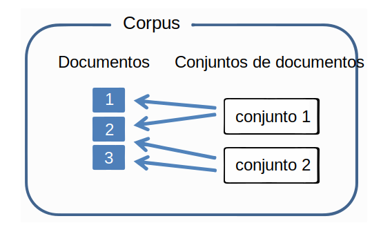
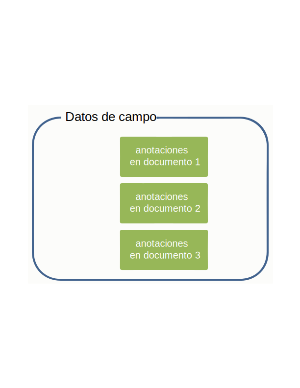
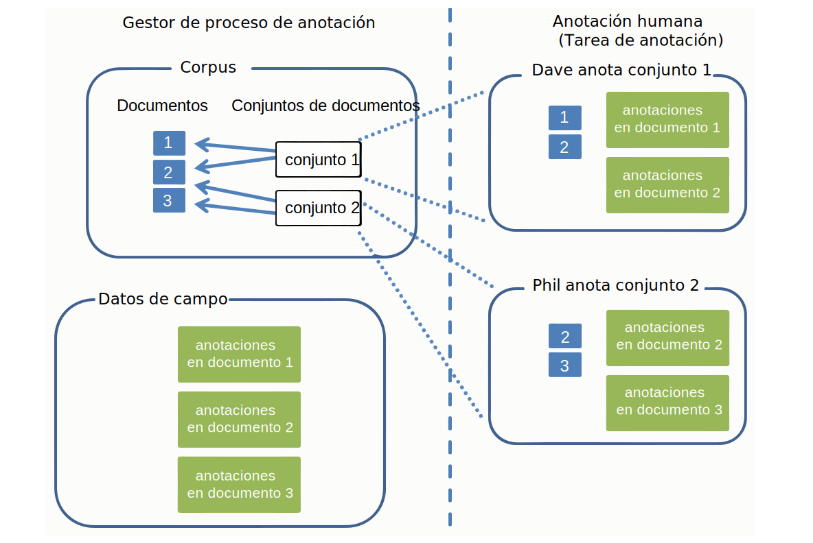

---

copyright:
  years: 2015, 2018
lastupdated: "2018-07-19"

---

{:shortdesc: .shortdesc}
{:new_window: target="_blank"}
{:tip: .tip}
{:pre: .pre}
{:codeblock: .codeblock}
{:screen: .screen}
{:javascript: .ph data-hd-programlang='javascript'}
{:java: .ph data-hd-programlang='java'}
{:python: .ph data-hd-programlang='python'}
{:swift: .ph data-hd-programlang='swift'}

Esta documentación es para {{site.data.keyword.knowledgestudiofull}} en {{site.data.keyword.cloud}}. Para ver la documentación para la versión anterior de {{site.data.keyword.knowledgestudioshort}} en {{site.data.keyword.IBM_notm}} Marketplace, [pulse este enlace ](https://{DomainName}/docs/services/knowledge-studio/documents-for-annotation.html){: new_window}.
{: tip}

# Añadir documentos para su anotación
{: #documents-for-annotation}

Para entrenar un modelo de aprendizaje automático, debe añadir documentos que contengan conocimientos sobre la materia, como artículos de diarios u otros textos específicos del sector, a su espacio de trabajo.
{: shortdesc}

## Acerca de esta tarea
{: #annotation_about}

Para definir reglas para el modelo basado en reglas, añada o cargue documentos desde los que pueda definir patrones a definir como reglas. Consulte [Añadir documentos para definir reglas](/docs/services/watson-knowledge-studio/rule-annotator-add-doc.html) para obtener más información. Esta sección describe cómo añadir documentos solo para la anotación.

## Documentos
{: #wks_sampledoc}

Para entrenar un modelo de aprendizaje automático, debe recopilar documentos que sean representativos del contenido del dominio y de alto valor para su aplicación.

Intente asegurarse de que sus documentos de entrenamiento sean verdaderamente representativos del contenido de interés para su dominio; es decir, que contengan muchas menciones relevantes que se puedan anotar. Para elegir los mejores documentos, siga estas directrices:

- Trate de proporcionar un conjunto de documentos que tengan un tamaño total de aproximadamente 300.000 palabras. Proporcione más palabras para un sistema de tipos complejo, y menos para uno más sencillo.
- Limite cada documento a una página o dos de contenido (sería mejor menos de 2.000 palabras, y más cerca de 1.000 palabras por documento). En las primeras etapas de desarrollo del modelo, conservar cada documento con unos pocos párrafos es también una práctica recomendada. Un anotador humano puede marcar menciones y relaciones en un documento largo, pero los intentos por marcar correferencias en varias páginas puede ser difícil.
- Asegúrese de que los datos de los documentos estén distribuidos entre todos los tipos, subtipos y roles de entidades posibles, y las relaciones entre ellas. Un objetivo que busca conseguirse es llegar a tener al menos 50 anotaciones para cada tipo de entidad y 50 para cada tipo de relación de la recopilación de documentos.
- De nuevo, los documentos deben representar la amplitud de la materia que tratará la aplicación, pero en el caso de frecuencia de aparición desigual de tipos de entidades y de tipos de relaciones, intente obtener al menos 50 ejemplares de cada tipo, más para tipos de entidades que tienen menciones que tienden a ser frases.
- El conjunto que cree para el entrenamiento debe contener al menos 10 documentos anotados.

Cuando esté listo para crear y entrenar el modelo, los documentos que añada al espacio de trabajo se podrán dividir en conjuntos utilizados como datos de entrenamiento, datos de prueba y datos ciegos. Los conjuntos de datos independientes son importantes para evaluar el rendimiento de modelo.

Puede añadir documentos de las siguientes maneras:

- Un archivo CSV de dos columnas en formato UTF-8
- Archivos de texto en formato UTF-8
- Un archivo ZIP que contiene documentos descargados desde un espacio de trabajo de {{site.data.keyword.knowledgestudioshort}}
- Un archivo ZIP que contiene archivos en formato UIMA CAS XMI

### Archivos CSV
{: #wks_sampledoc__wks_samplecsv}

Puede cargar un archivo CSV de dos columnas que contenga texto de muestra desde la máquina local. Cargue un archivo CSV a la vez. La primera columna del archivo CSV especifica el nombre de archivo del documento. La segunda columna del archivo contiene el texto del documento. Para obtener un ejemplo del formato requerido, consulte el archivo <a href="https://watson-developer-cloud.github.io/doc-tutorial-downloads/knowledge-studio/documents-new.csv" download>`documents-new.csv` </a> en los archivos de muestra de la guía de aprendizaje.

### Documentos de otro espacio de trabajo de Watson Knowledge Studio
{: #wks_sampledoc__wks_samplecorpus}

Si ha descargado previamente documentos desde un espacio de trabajo de {{site.data.keyword.knowledgestudioshort}}, puede cargar el archivo `ZIP` que ha descargado. Una opción le permite especificar si desea que las anotaciones de los datos de campo se incluyan en los archivos importados.

Una vez anotados los documentos, estos se almacenarán en formato `JSON`. El lenguaje de códigos de estos archivos, que muestra cómo se ha analizado y señalizado el texto del documento original, incluye elementos para todas las anotaciones que ha añadido un anotador humano. Para mejorar la exactitud del modelo a lo largo del tiempo, puede cargar estos archivos en otro espacio de trabajo, conservando así todas las anotaciones existentes. Un anotador humano puede revisar, suprimir y añadir anotaciones a estos documentos, o puede omitir la anotación humana y utilizar estos archivos para crear conjuntos de documentos de entrenamiento, de prueba y ciegos para evaluar y mejorar el rendimiento del modelo.

### Archivos UIMA CAS XMI
{: #wks_sampledoc__samplexmi}

Para ayudar a entrenar un modelo, puede cargar documentos que fueron preanotados por un motor de análisis de UIMA. Los archivos preanotados deben estar en formato de serialización XMI de UIMA Common Analysis Structure (UIMA CAS XMI) y estar combinados en un archivo ZIP. Por ejemplo, puede cargar documentos anotados en una recopilación de {{site.data.keyword.IBM_notm}} {{site.data.keyword.watson}} Explorer.

Un anotador humano puede revisar, suprimir y añadir anotaciones a estos documentos, o puede omitir la anotación humana y utilizar estos archivos para crear conjuntos de documentos de entrenamiento, de prueba y ciegos para evaluar y mejorar el rendimiento del modelo. Para obtener detalles sobre cómo crear estos archivos y requisitos para cargarlos, consulte [Carga de documentos preanotados](/docs/services/watson-knowledge-studio/preannotation.html#wks_uima).

### Creación de datos anónimos
{: #wks_anonymizing}

Si desea crear un modelo optimizado para sus datos, pero no desea cargar los datos tal cual en {{site.data.keyword.knowledgestudioshort}} por motivos de privacidad, puede despojar los documentos de cualquier información personalmente identificable (PII) en primer lugar y, a continuación, utilizar esos documentos convertidos en anónimos para entrenar el modelo. No redacte la información ni la sustituya en bloque por variables. Para obtener mejores resultados, sustituya la información real por información falsa del mismo tipo.

Por ejemplo, si la PII que desea proteger son los nombres de clientes, en lugar de redactar cada nombre o sustituir cada nombre por una variable, como por ejemplo *USER_NAME*, sustituya cada nombre por un nombre falso que utilice una variedad de estilos de sintaxis de nombre típicos, como por ejemplo *Ana García*, *Sr. Rodríguez*, *González*, o *Dr. Pérez, doctorado*. Considere la posibilidad de escribir un script que concatene una variedad de nombres y apellidos, y títulos y nombres, y que añada nombres solos para crear nombres falsos que se puedan insertar en el documento para sustituir instancias de nombres de usuarios reales. El objetivo es simular lo más cerca posible valores reales en los documentos de origen. Si el mismo texto (USER_NAME) se utiliza en los documentos o en el texto que se redacte, estará básicamente entrenando el modelo para esperar que todos los nombres tengan el mismo valor o se redacten. Cuando el modelo se utilice en el tiempo de ejecución en documentos nuevos, y encuentra nombres que no se han visto antes en toda su variabilidad, deseará que pueda reconocerlos como nombres.

## Adición de documentos a un espacio de trabajo
{: #wks_projadd}

Para entrenar un modelo, debe añadir documentos que son representativos del contenido de dominio a su espacio de trabajo.

### Acerca de esta tarea
{: #wks_projadd_about}

Como mejor práctica, empiece con una recopilación de documentos relativamente pequeña. Utilice estos documentos para entrenar los anotadores humanos (si el espacio de trabajo implica anotación humana) y para refinar las directrices de anotación. Los documentos pequeños pueden ayudar a los anotadores humanos a identificar cadenas de correferencia mediante el documento. A medida que mejore la exactitud de la anotación, podrá añadir más documentos al corpus para proporcionar mayor profundidad al esfuerzo de entrenamiento.

### Procedimiento
{: #wks_projadd_procedure}

Para añadir documentos a un espacio de trabajo:

1. Inicie sesión como un administrador o gestor de proyectos de {{site.data.keyword.knowledgestudioshort}}, y seleccione su espacio de trabajo.
1. Seleccione el separador **Activos**> **Documentos** > **Conjuntos de documentación**.
1. Pulse **Cargar conjuntos de documentos** para añadir documentos al corpus.
1. Cargue documentos en uno de los siguientes formatos. Puede cargar un tipo de archivo a la vez.

    <table summary="Cada fila de esta tabla describe una opción para una elección.">
      <caption>Tabla 1. Opciones de carga</caption>
      <tr>
        <th style="vertical-align:bottom; text-align:left" id="d31095e284-option">
          Opción
        </th>
        <th style="vertical-align:bottom; text-align:left" id="d31095e284-desc">
          Descripción
        </th>
      </tr>
      <tr>
        <td headers="d31095e284-option" id="d31095e286">
          
<strong>Archivo CSV</strong>

        </td>
        <td headers="d31095e284-desc d31095e286">
          
Arrastre un único archivo CSV que contenga los documentos de ejemplo o pulse para localizar el archivo en el sistema local y, a continuación, pulse <b>Cargar</b>. La primera columna del archivo CSV especifica el nombre de archivo del documento. La segunda columna del archivo contiene el texto del documento. El archivo CSV debe estar en formato UTF-8.

        </td>
      </tr>
      <tr>
        <td headers="d31095e284-option" id="d31095e294">
          
<strong>Archivos de texto</strong>

        </td>
        <td headers="d31095e284-desc d31095e294">
          
Arrastre uno o varios archivos de texto desde el sistema local o pulse para localizar y seleccionar los archivos y, a continuación, pulse <b>Cargar</b>. Los archivos de texto deben estar en formato UTF-8.

        </td>
      </tr>
      <tr>
        <td headers="d31095e284-option" id="d31095e316">
          
<strong>Archivo ZIP</strong>

        </td>
        <td headers="d31095e284-desc d31095e316">
          
Si ha descargado previamente documentos desde un espacio de trabajo de Watson Knowledge Studio, arrastre el archivo <code>ZIP</code> que contiene los documentos descargados o pulse para localizar y seleccionar el archivo. Si desea incluir anotaciones añadidas a los documentos antes de que se descargaran, asegúrese de que la opción para incluir los datos de campo esté seleccionada antes de pulsar <b>Cargar</b>. Solo se importarán las anotaciones promocionadas a datos de campo antes de que se descarguen los documentos. 

<b>Restricción:</b> Cuando se importen los documentos anotados, se volverán a señalizar. Este proceso puede cambiar lo que Watson Knowledge Studio considera como los límites de la frase en ellos. Dado que las anotaciones están definidas por la frase, algunas anotaciones podrían ser invalidadas durante este proceso. Después de cargar documentos desde otro espacio de trabajo, realice una revisión rápida de las anotaciones para enfrentarse a las discrepancias.

          
Debe cargar el sistema de tipos desde el espacio de trabajo original al espacio de trabajo actual antes de cargar las anotaciones de datos de campo. Para obtener detalles, consulte [Carga de recursos desde otro espacio de trabajo ](exportimport.html){: new_window}.

          
Si ha descargado previamente documentos anotados que están en formato UIMA CAS XMI, puede cargar el archivo <code>ZIP</code> que contiene el contenido analizado. Especifique que este es el tipo de contenido que desea cargar antes de pulsar <b>Cargar</b>. Para obtener detalles sobre cómo crear estos archivos y requisitos para cargarlos, consulte [Carga de documentos preanotados ](preannotation.html#wks_uima){: new_window}.

        </td>
      </tr>
    </table>

1. Cuando los documentos se hayan añadido, pulse los nombres de documentos para previsualizarlos y verificar que el contenido es correcto. Por ejemplo, verifique que los archivos de texto estén en formato UTF-8 y que no sean visibles problemas de marcas diacríticas ni de normalización de caracteres en los documentos, y compruebe si hay saltos de frase pobres. Si existen problemas, puede que necesite preprocesar los archivos antes de añadirlos al corpus. Desea que los documentos estén lo más limpios y con mejor formato como sea posible antes de comenzar el diccionario o la anotación humana.

### Qué hacer a continuación
{: #wks_projadd_next}

Antes de iniciar las tareas de anotación humana, divida el corpus en varios conjuntos de documentos y asigne los conjuntos de documentos a anotadores humanos.

## Creación y asignación de conjuntos de anotaciones
{: #wks_projdocsets}

Después de añadir documentos, divida los documentos en conjuntos para que los puedan anotar varios anotadores humanos. Para ver las puntuaciones de acuerdo entre anotadores, debe asignar al menos dos anotadores humanos y especificar que algún porcentaje de los documentos se solapan entre los conjuntos.

### Antes de empezar
{: #wks_projdocsets_prereqs}

- Debe cargar los conjuntos de documentos antes de dividirlos en conjuntos de anotaciones.
- Debe crear cuentas de usuario en {{site.data.keyword.knowledgestudioshort}} para todos los anotadores humanos que trabajarán en documentos en este espacio de trabajo.

### Acerca de esta tarea
{: #wks_projdocsets_about}

> **Atención:** Si utiliza el navegador Google Chrome, no podrá cargar un gran número de archivos (como más de 300) seleccionándolos desde una carpeta. La solución temporal es utilizar el navegador Firefox o seleccionar un número más pequeños de archivos y cargar archivos muchas veces.

Puede crear un máximo de 1.000 conjuntos de anotaciones por espacio de trabajo.

### Procedimiento
{: #wks_projdocsets_procedure}

Para crear un conjunto de anotaciones:

1. Inicie sesión como un administrador o gestor de proyectos de {{site.data.keyword.knowledgestudioshort}}, y seleccione su espacio de trabajo.
1. Seleccione el separador **Activos**> **Documentos** > **Conjuntos de anotaciones**.
1. Pulse **Crear conjuntos de anotaciones**.

    1. Para el conjunto base, seleccione la recopilación de documentos que desea dividir en conjuntos de anotaciones, ya sean todos los documentos del corpus o documentos asignados previamente a un conjunto de documentos.

    1. Para el valor de solapamiento, especifique el porcentaje de documentos que desea incluir en cada conjunto de anotaciones. Las puntuaciones de acuerdo entre anotadores no se pueden calcular a menos que dos o más anotadores humanos anoten los mismos documentos. Por ejemplo, si especifica un valor de solapamiento del 20% para un corpus que contenga 30 documentos, y divide el corpus en 3 conjuntos de documentos, 6 documentos (20%) serán anotados por todos los anotadores humanos. Los 24 documentos restantes se dividirán entre los 3 anotadores humanos (8 cada uno). Así, cada anotador recibe 14 documentos para anotar (6+8).

    > **Nota:** Un conjunto de anotaciones que tenga pensado utilizar para entrenar un modelo de aprendizaje automático debe contener al menos 10 documentos anotados.

    1. Seleccione un nombre de usuario de la lista de anotadores humanos.

        > **Nota:** Si tiene una suscripción a un plan Lite, asóciese con el conjunto de anotaciones. No puede añadir otros usuarios ni asignarlos al rol de anotador humano. Pero al añadirse usted mismo, puede rellenar el rol de un anotador humano y probar cómo interactuará un anotador humano real con el editor de datos de campo para anotar documentos.

    1. Asigne un nombre al conjunto de anotaciones.

        Como buena práctica para evaluar el trabajo de un anotador humano a medida que progresa el espacio de trabajo, es posible que desee crear nombres de conjuntos de anotaciones que identifiquen al anotador humano asignado al conjunto. No puede cambiar el nombre del conjunto de anotaciones una vez creado el conjunto.

1. Cuando termine de asignar todos los anotadores humanos que trabajarán en este espacio de trabajo, pulse **Generar** para crear los conjuntos de anotaciones. Cuando los anotadores humanos inician sesión en el editor de datos de campo, verán solo los conjuntos de anotaciones asignados a ellos.

**Tareas relacionadas**:
{: #wks_related_tasks}

[Ensamblaje de un equipo](/docs/services/watson-knowledge-studio/team.html)

## Supresión de documentos
{: #wks_deletedocs}

Puede suprimir un documento si determina que no representa el texto del sector estándar que beneficiará al modelo.

Para suprimir un documento, elija la opción que se aplica a su situación:
- [Supresión de un documento que no se ha asociado con una tarea de anotación](#deletenotask)
- [Supresión de un documento asociado con una tarea de anotación y la anotación humana *no se ha iniciado*](#deletenoanno)
- [Supresión de un documento asociado con una tarea de anotación y la anotación humana *se ha iniciado*](#deleteanno)

### Supresión de un documento que no se ha asociado con una tarea de anotación
{: #deletenotask}

Si el documento que desea suprimir no está asociado con una tarea de anotación, siga estos pasos para suprimir el documento.

#### Procedimiento
{: #deletenotaskp}

1. Inicie sesión como administrador de {{site.data.keyword.knowledgestudioshort}} y seleccione el espacio de trabajo.
1. Seleccione el separador **Activos**> **Documentos** > **Conjuntos de documentos**.
2. Seleccione el conjunto de documentos que contiene el documento que desea suprimir. Se abrirá el conjunto de documentos.
3. Busque el documento que desea eliminar y, a continuación, pulse **Suprimir**.

### Supresión de un documento asociado con una tarea de anotación y la anotación humana no se ha iniciado
{: #deletenoanno}

Si el documento que desea suprimir está asociado con una tarea de anotación y la anotación humana *aún no se ha iniciado*, siga estos pasos para suprimir el documento.

#### Procedimiento
{: #deletenoannop}

1. Inicie sesión como administrador de {{site.data.keyword.knowledgestudioshort}} y seleccione el espacio de trabajo.
1. Suprima la tarea de anotación:

  a. Abra la página **Modelo de aprendizaje automático** > **Tareas de anotación**.

  b. Busque la tarea de anotación con la que está asociado el documento, pulse el icono **Mostrar menú** en la tarea y, a continuación, pulse **Suprimir**.

1. Suprima el documento tal como se describe en [Supresión de un documento que no se ha asociado con una tarea de anotación](#deletenotask).
1. Después de suprimir el documento, vuelva a crear la tarea de anotación y asocie el mismo conjunto de anotaciones, que ahora tiene un documento menos.

### Supresión de un documento asociado con una tarea de anotación y la anotación humana se ha iniciado
{: #deleteanno}

Si el documento que desea suprimir está asociado con una tarea de anotación y la anotación humana *se ha iniciado*, siga estos pasos para suprimir el documento.

**Atención**: no suprima una tarea si la anotación humana está en curso. Si lo hace, perderá el trabajo que está en curso.

#### Procedimiento
{: #deleteannop}

1. Indique a los anotadores humanos que ignoren el documento no deseado en el conjunto.
1. Una vez finalizado el trabajo de anotación en los demás documentos, y cuando los anotadores humanos envíen todos los documentos para añadir el conjunto a los datos de campo, [revise y acepte los documentos enviados](/docs/services/watson-knowledge-studio/build-groundtruth.html#wks_haaccuracy).
1. [Resuelva los conflictos de anotación](/docs/services/watson-knowledge-studio/build-groundtruth.html#wks_haadjudicate).
1. Cuando todos los documentos formen parte de los datos de campo y la tarea se haya completado, suprima la tarea tal como se describe en [Supresión de un documento asociado con una tarea de anotación y la anotación humana no se ha iniciado](#deletenoannop).
1. Suprima el documento tal como se describe en [Supresión de un documento que no se ha asociado con una tarea de anotación](#deletenotask).

  **Nota**: Puede confirmar que las anotaciones en los documentos restantes no se pierden descargando los conjuntos de documentos y revisando los documentos en la carpeta `gt`.

## Modelo de datos
{: #wks_datamodel}

Los diagramas de este tema resumen el flujo de documentos en un sistema {{site.data.keyword.knowledgestudioshort}} y las diferencias entre documentos del corpus, una tarea de anotación y los datos de campo.

El corpus contiene documentos, que se dividen en conjuntos de documentos:

- Un documento no es nada más que cadenas de texto.
- Un conjunto de documentos es un puntero a un grupo de documentos. El conjunto de documentos no contiene copias de los propios documentos.
- Algunos conjuntos de documentos pueden apuntar a un solo documento, una configuración que puede controlar mediante el parámetro de solapamiento que especifique al crear conjuntos de anotaciones.

 Figura 1. Esta figura ilustra dos conjuntos de documentos que apuntan a tres documentos. Los documentos se dividen entre los conjuntos.

Los datos de campo comprenden las anotaciones (menciones, relaciones, y menciones correferenciadas) que se añaden a los documentos. Los datos de campo son singulares para cada documento.

 Figura 2. Esta figura ilustra que los datos de campo constan de las anotaciones añadidas al documento 1, documento 2, documento 3, y así sucesivamente.

Al crear una tarea de anotación, se crearán copias de las anotaciones para cada documento en el conjunto de anotaciones que añada a la tarea. Los anotadores humanos anotan los documentos. Las anotaciones están aisladas entre sí y entre los datos de campo. Una tarea de anotación es un concepto temporal que existe para permitir a los anotadores humanos anotar texto en espacios aislados. En cambio, los datos de campo son permanentes y singulares.

 Figura 2. Esta figura ilustra que el gestor de proyectos crea conjuntos de anotaciones y los asigna a una tarea de anotación. Dave y Phil, los anotadores humanos, anotan documentos en los conjuntos asignados a ellos.

Una vez que el gestor de proyectos apruebe conjuntos de anotaciones en una tarea de anotación, las anotaciones de documentos que no se solapen con otros conjuntos de anotaciones se convertirán en datos de campo. Para los documentos que se solapen entre conjuntos de anotaciones (representados por el documento 2 de este ejemplo), el gestor de proyectos debe adjudicar y resolver conflictos. Las anotaciones de los documentos que se solapan no se convertirán en datos de campo hasta que se aprueben mediante la adjudicación.

Los datos de campo se utilizarán entonces para entrenar y probar un modelo de aprendizaje automático, o se pueden utilizar como la base para la siguiente iteración del desarrollo de modelos. Para utilizar los datos de campo en una nueva iteración, debe crear una tarea de anotación nueva.

 Figura 3. Esta figura ilustra cómo se convierten en datos de campo las anotaciones añadidas por dos anotadores humanos. Un documento, etiquetado como documento 2, está anotado por ambos anotadores humanos. Las anotaciones de este documento que se solapa deben estar adjudicadas antes de que se conviertan en datos de campo.
