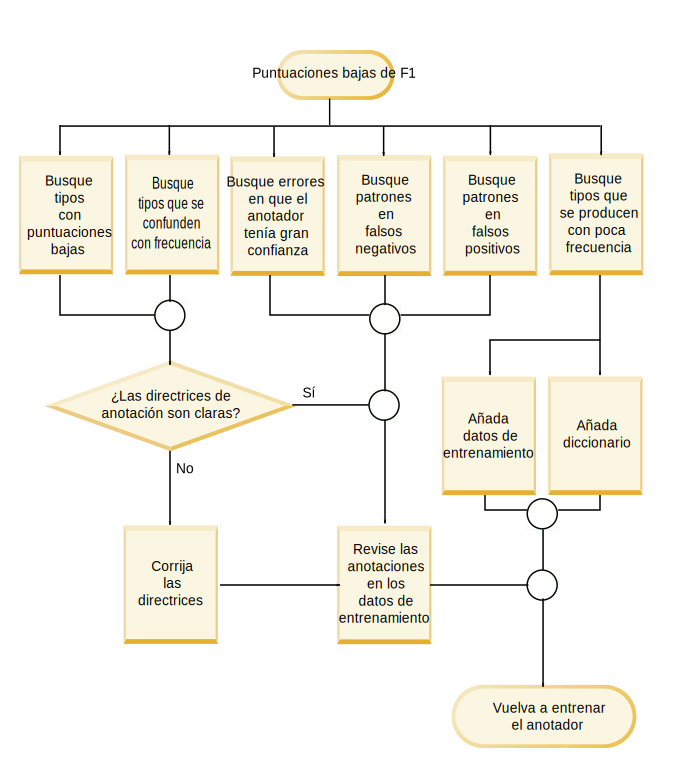
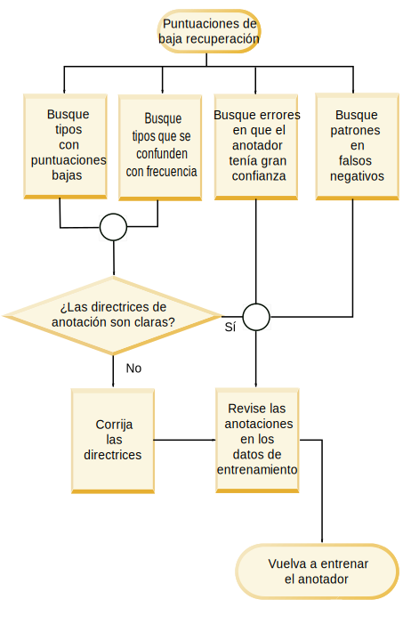

---

copyright:
  years: 2015, 2018
lastupdated: "2018-04-04"

---

{:shortdesc: .shortdesc}
{:new_window: target="_blank"}
{:tip: .tip}
{:pre: .pre}
{:codeblock: .codeblock}
{:screen: .screen}
{:javascript: .ph data-hd-programlang='javascript'}
{:java: .ph data-hd-programlang='java'}
{:python: .ph data-hd-programlang='python'}
{:swift: .ph data-hd-programlang='swift'}

Esta documentación es para {{site.data.keyword.knowledgestudiofull}} en {{site.data.keyword.cloud}}. Para ver la documentación para la versión anterior de {{site.data.keyword.knowledgestudioshort}} en {{site.data.keyword.IBM_notm}} Marketplace, [pulse este enlace ](https://console.bluemix.net/docs/services/knowledge-studio/evaluate-ml.html){: new_window}.
{: tip}

# Análisis del rendimiento del modelo de aprendizaje automático
{: #evaluate-ml}

Revise las anotaciones añadidas mediante el modelo entrenado para determinar si deben realizarse ajustes al modelo para mejorar su capacidad de encontrar menciones de entidades, menciones de relaciones y correferencias válidas en los documentos.
{: shortdesc}

## Acerca de esta tarea

Puede analizar el rendimiento viendo un resumen de estadísticas para tipos de entidades, tipos de relaciones y menciones correferenciadas. También puede analizar estadísticas presentadas en una *matriz de confusión*. La matriz de confusión ayuda a comparar las anotaciones añadidas por el modelo de aprendizaje automático con las anotaciones de los datos de campo.

Las estadísticas de modelo proporcionan las métricas siguientes:

- **Puntuación de F1**

    Una medida que considera tanto la precisión como la recuperación para calcular la puntuación. La puntuación de F1 puede interpretarse como un promedio ponderado de los valores de precisión y de recuperación, donde una puntuación de F1 alcanza su mejor valor en 1 y su peor valor en 0. Consulte [Análisis de puntuaciones bajas de F1](/docs/services/watson-knowledge-studio/evaluate-ml.html#evaluate-mllowf1).

- **Precisión**

    Una medida que especifica qué parte del resultado del modelo de aprendizaje automático era precisa en comparación con el resultado del anotador humano. La precisión está determinada por el número de anotaciones etiquetadas correctamente dividido por el número total de anotaciones añadidas por el modelo de aprendizaje automático. Una puntuación de precisión de 1,0 para el tipo de entidad A significa que cada mención etiquetada como el tipo de entidad A no pertenece a dicha clasificación. Una puntuación de baja precisión le ayuda a identificar lugares donde el modelo de aprendizaje automático ha creado anotaciones incorrectas. La puntuación no dice nada sobre cuántas otras menciones etiquetadas como el tipo de entidad A por el anotador humano perdió el modelo de aprendizaje automático; la puntuación de recuperación refleja esa información. Consulte [Análisis de las puntuaciones de baja precisión](/docs/services/watson-knowledge-studio/evaluate-ml.html#evaluate-mllowp).

- **Recuperación**

    Una medida que especifica cuántas menciones que deberían haber sido anotadas por una etiqueta concreta estaban en realidad anotadas con dicha etiqueta - las menciones de *derecha* son aquellas que los anotadores humanos identificaron en los mismos documentos. La recuperación está determinada por el número de anotaciones etiquetadas correctamente dividido por el número de anotaciones que se deberían haber creado. Una puntuación de recuperación de 1,0 significa que cada mención que se debería haber etiquetado como tipo de entidad A se ha etiquetado correctamente. Una puntuación de recuperación baja ayuda a identificar lugares donde el modelo de aprendizaje automático no ha podido crear una anotación que debería haber creado. La puntuación no dice nada sobre cuántas otras menciones también estaban etiquetadas como tipo de entidad A, pero que no deberían estarlo; la puntuación de precisión refleja dicha información. Consulte [Análisis de puntuaciones de recuperación bajas](/docs/services/watson-knowledge-studio/evaluate-ml.html#evaluate-mllowr).

- **Porcentaje de anotaciones totales**

    Una medida de datos de campo que muestra cuántas palabras se anotaron con un tipo de entidad o tipo de relación determinado del número total de palabras anotadas como cualquier tipo de entidad o tipo de relación en el conjunto de documentos de prueba. Esta estadística no está disponible para las menciones correferenciadas. Este valor puede ayudarle a ver cómo de frecuentes son las menciones de un tipo en comparación con el resto de los tipos de los datos de campo.

- **Porcentaje de densidad del corpus (por el número de palabras)**

    Una medida de datos de campo que muestra el número de palabras anotadas con un tipo de entidad o tipo de relación determinado del número total de palabras, anotadas o no anotadas. Esta estadística no está disponible para las menciones correferenciadas. Este valor puede ayudarle a ver cómo de frecuentes son las menciones de este tipo en comparación con el resto de las palabras de los documentos del dominio.

- **Porcentaje de documentos que contienen el tipo**

    Una medida de datos de campo que muestra cuántos documentos contienen un determinado tipo de entidad o de relación. Esta estadística no está disponible para las menciones correferenciadas. Este valor puede ayudarle a evaluar si los documentos del conjunto representan al dominio de forma suficiente. Si el porcentaje es bajo para los tipos de entidad claves, puede que desee añadir más documentos con menciones de tipos poco representados.

## Procedimiento

Para ver las estadísticas de rendimiento para comprobar si el modelo se ha entrenado bien:

1. Inicie sesión como un administrador o gestor de proyectos de {{site.data.keyword.knowledgestudioshort}}, y seleccione su espacio de trabajo.
1. Seleccione **Gestión de modelos** > **Rendimiento**.
1. Para las menciones, relaciones o correferencias, seleccione el enlace **Estadísticas detalladas**.
1. En la vista **Resumen**, especifique si desea evaluar datos de prueba o datos de entrenamiento, y a continuación especifique el tipo de anotaciones para las que desea ver estadísticas: tipos de entidades, tipos de relaciones o menciones correferenciadas. Tenga en cuenta que los datos ciegos serán analizados con muy poca frecuencia y no hasta que se sienta relativamente seguro de las puntuaciones de los datos de prueba. A medida que se desplace por los datos, los elementos que tengan bajas puntuaciones se señalarán y resaltarán para indicar que requieren investigación y mejora. El icono de aviso de triángulo indica que el valor de F1 es inferior al valor fijo, 0,5.

    Por ejemplo, la puntuación de F1 para algunos tipos de entidades puede ser alta porque el documento estaba anotado mediante la preanotación también como mediante un anotador humano. Pero la puntuación de F1 para otros tipos de entidades puede ser baja debido a diferencias en la creación de frases, y diferencias en cómo interpretan los anotadores humanos el texto o las directrices de anotación, haciendo más difícil para el modelo de aprendizaje automático el reconocimiento del patrón y la aplicación de la anotación correcta.

1. En la vista **Matriz de confusión** para los datos de prueba, especifique el tipo de anotaciones para las que desea ver estadísticas: tipos de entidades o tipos de relaciones. Para cada tipo de entidad o tipo de relación:

    - Cada fila de la matriz muestra datos de campo (tipos de entidades y tipos de relaciones añadidos por un anotador humano).
    - Cada columna de la matriz muestra los resultados de decodificación (señales de anotación añadidas por el modelo de aprendizaje automático).
    - Los números de cada célula representan el número de señales de anotación por mención, no las apariciones de la mención.

        Las señales se utilizan para delinear cadenas de texto. Se corresponden vagamente con las palabras. Una mención puede contener más de una señal. Por ejemplo, *Barack Obama* es una mención que contiene dos señales. En la fila o columna PERSON, un valor de 2 se utilizaría para representar la mención única de *Barack Obama* en un documento. El recuento de señales solo se corresponde vagamente con el recuento de palabras porque las señales se cuentan de forma distinta en algunas situaciones. Por ejemplo, la puntuación al final de una frase se cuenta como una señal, y las contracciones se expanden a menudo en dos señales.

    - La columna etiquetada **O** identifica señales que deberían haber sido anotadas por el modelo de aprendizaje automático como el tipo identificado en la fila de intersección (la anotación humana), pero que no están anotadas como ningún tipo.
    - El valor **N/D** se muestra cuando no hay anotaciones para un tipo determinado en los conjuntos de documentos. Por ejemplo, si no hay ninguna mención PERSON en los conjuntos de documentos anotados para los datos de campo o como datos de prueba, las puntuaciones para el tipo de entidad PERSON serán N/D.

    Por ejemplo, el siguiente ejemplo de matriz de confusión muestra resultados de una ejecución del modelo de aprendizaje automático en documentos que tratan con incidentes de tráfico.

    <table cellpadding="4" cellspacing="0" summary="Ejemplo de matriz de confusión de informe de incidentes" border="1" class="simpletable"><tr class="sthead"><th valign="bottom" align="left" id="d15356e164" class="stentry thleft thbot">Tipos de entidades</th>
        <th valign="bottom" align="left" id="d15356e166" class="stentry thleft thbot">MANUFACTURER</th>
        <th valign="bottom" align="left" id="d15356e168" class="stentry thleft thbot">MODEL</th>
        <th valign="bottom" align="left" id="d15356e170" class="stentry thleft thbot">O</th>
      </tr>
      <tr class="strow"><td valign="top" headers="d15356e164" class="stentry">
MANUFACTURER
</td>
        <td valign="top" headers="d15356e166" class="stentry">
515
</td>
        <td valign="top" headers="d15356e168" class="stentry">
5
</td>
        <td valign="top" headers="d15356e170" class="stentry">
44
</td>
      </tr>
    </table>
    {: #evaluate-ml__datasimpletable_yms_hff_cw}

    Puede aprender lo siguiente desde esta matriz:
    - El modelo ha reconocido correctamente 515 señales como menciones del tipo de entidad MANUFACTURER.
    - El modelo ha etiquetado de forma incorrecta 5 señales como menciones del tipo MODEL que deberían haber sido etiquetadas como MANUFACTURER.
    - Hay 44 señales que componen menciones del tipo MANUFACTURER que el modelo no ha podido anotar como cualquier tipo de entidad.

    Al evaluar el rendimiento de modelo y ver los resultados de descodificación, puede empezar por investigar las señales que estaban mal etiquetadas o completamente perdidas.

## Hoja de apuntes de mejora de rendimiento
{: #evaluate-ml_cheat}

Utilice esta hoja de apuntes para ayudarle a determinar los pasos que puede realizar para mejorar el rendimiento del modelo de aprendizaje automático.

Es difícil dictar normas para mejorar las puntuaciones de rendimiento que serían aplicables entre dominios, donde la complejidad del sistema de tipos, la idoneidad de los documentos de entrenamiento, los conocimientos del anotador humano y otros factores que influyen en el resultado. Sin embargo, la tabla siguiente puede ayudarle a hacer una evaluación inicial y realizar pasos para mejorar el rendimiento, especialmente durante las primeras etapas del desarrollo y de las pruebas del modelo.

La tabla siguiente sugiere arreglos para los problemas de rendimiento más comunes del modelo de aprendizaje automático.

<table cellpadding="4" cellspacing="0" summary="La tabla lista problemas comunes debajo de dicha primera columna y arreglos sugeridos en la primera fila. Las marcas X indican qué arreglo se aplicará a qué problema." border="1" class="simpletable"><tr class="sthead"><th valign="bottom" align="left" id="d15356e221" class="stentry thleft thbot">Problema</th>
<th valign="bottom" align="left" id="d15356e223" class="stentry thleft thbot">Añadir diccionarios</th>
<th valign="bottom" align="left" id="d15356e225" class="stentry thleft thbot">Editar conjuntos de documentos</th>
<th valign="bottom" align="left" id="d15356e227" class="stentry thleft thbot">Añadir documentos específicos de tipo</th>
<th valign="bottom" align="left" id="d15356e229" class="stentry thleft thbot">Anotar más corpus</th>
<th valign="bottom" align="left" id="d15356e231" class="stentry thleft thbot">Arreglar anotaciones humanas</th>
<th valign="bottom" align="left" id="d15356e233" class="stentry thleft thbot">Mejorar las directrices del anotador humano</th>
<th valign="bottom" align="left" id="d15356e235" class="stentry thleft thbot">Actualizar el sistema de tipos</th>
<th valign="bottom" align="left" id="d15356e237" class="stentry thleft thbot">Investigar más</th>
</tr>
<tr class="strow"><td valign="top" headers="d15356e221" class="stentry">
F1 bajo
</td>
<td valign="top" headers="d15356e223" class="stentry">
X
</td>
<td valign="top" headers="d15356e225" class="stentry">
X
</td>
<td valign="top" headers="d15356e227" class="stentry">
X
</td>
<td valign="top" headers="d15356e229" class="stentry">
X
</td>
<td valign="top" headers="d15356e231" class="stentry">
X
</td>
<td valign="top" headers="d15356e233" class="stentry">
X
</td>
<td valign="top" headers="d15356e235" class="stentry">
X
</td>
<td valign="top" headers="d15356e237" class="stentry">
X
</td>
</tr>
<tr class="strow"><td valign="top" headers="d15356e221" class="stentry">
Precisión baja
</td>
<td valign="top" headers="d15356e223" class="stentry">

</td>
<td valign="top" headers="d15356e225" class="stentry">

</td>
<td valign="top" headers="d15356e227" class="stentry">

</td>
<td valign="top" headers="d15356e229" class="stentry">
X
</td>
<td valign="top" headers="d15356e231" class="stentry">
X
</td>
<td valign="top" headers="d15356e233" class="stentry">
X
</td>
<td valign="top" headers="d15356e235" class="stentry">
X
</td>
<td valign="top" headers="d15356e237" class="stentry">
X
</td>
</tr>
<tr class="strow"><td valign="top" headers="d15356e221" class="stentry">
Recuperación baja
</td>
<td valign="top" headers="d15356e223" class="stentry">
X
</td>
<td valign="top" headers="d15356e225" class="stentry">
X
</td>
<td valign="top" headers="d15356e227" class="stentry">
X
</td>
<td valign="top" headers="d15356e229" class="stentry">
X
</td>
<td valign="top" headers="d15356e231" class="stentry">

</td>
<td valign="top" headers="d15356e233" class="stentry">

</td>
<td valign="top" headers="d15356e235" class="stentry">

</td>
<td valign="top" headers="d15356e237" class="stentry">

</td>
</tr>
<tr class="strow"><td valign="top" headers="d15356e221" class="stentry">
% de anotación baja
</td>
<td valign="top" headers="d15356e223" class="stentry">

</td>
<td valign="top" headers="d15356e225" class="stentry">
X
</td>
<td valign="top" headers="d15356e227" class="stentry">
X
</td>
<td valign="top" headers="d15356e229" class="stentry">
X
</td>
<td valign="top" headers="d15356e231" class="stentry">

</td>
<td valign="top" headers="d15356e233" class="stentry">

</td>
<td valign="top" headers="d15356e235" class="stentry">

</td>
<td valign="top" headers="d15356e237" class="stentry">

</td>
</tr>
<tr class="strow"><td valign="top" headers="d15356e221" class="stentry">
Densidad baja
</td>
<td valign="top" headers="d15356e223" class="stentry">

</td>
<td valign="top" headers="d15356e225" class="stentry">
X
</td>
<td valign="top" headers="d15356e227" class="stentry">
X
</td>
<td valign="top" headers="d15356e229" class="stentry">
X
</td>
<td valign="top" headers="d15356e231" class="stentry">

</td>
<td valign="top" headers="d15356e233" class="stentry">

</td>
<td valign="top" headers="d15356e235" class="stentry">

</td>
<td valign="top" headers="d15356e237" class="stentry">

</td>
</tr>
<tr class="strow"><td valign="top" headers="d15356e221" class="stentry">
Pocos documentos de tipo
</td>
<td valign="top" headers="d15356e223" class="stentry">

</td>
<td valign="top" headers="d15356e225" class="stentry">

</td>
<td valign="top" headers="d15356e227" class="stentry">
X
</td>
<td valign="top" headers="d15356e229" class="stentry">
X
</td>
<td valign="top" headers="d15356e231" class="stentry">

</td>
<td valign="top" headers="d15356e233" class="stentry">

</td>
<td valign="top" headers="d15356e235" class="stentry">
X
</td>
<td valign="top" headers="d15356e237" class="stentry">

</td>
</tr>
<tr class="strow"><td valign="top" headers="d15356e221" class="stentry">
Categorización incorrecta
</td>
<td valign="top" headers="d15356e223" class="stentry">
X
</td>
<td valign="top" headers="d15356e225" class="stentry">

</td>
<td valign="top" headers="d15356e227" class="stentry">

</td>
<td valign="top" headers="d15356e229" class="stentry">

</td>
<td valign="top" headers="d15356e231" class="stentry">

</td>
<td valign="top" headers="d15356e233" class="stentry">

</td>
<td valign="top" headers="d15356e235" class="stentry">
X
</td>
<td valign="top" headers="d15356e237" class="stentry">

</td>
</tr>
<tr class="strow"><td valign="top" headers="d15356e221" class="stentry">
Anotaciones ausentes 
</td>
<td valign="top" headers="d15356e223" class="stentry">
X
</td>
<td valign="top" headers="d15356e225" class="stentry">

</td>
<td valign="top" headers="d15356e227" class="stentry">

</td>
<td valign="top" headers="d15356e229" class="stentry">
X
</td>
<td valign="top" headers="d15356e231" class="stentry">

</td>
<td valign="top" headers="d15356e233" class="stentry">

</td>
<td valign="top" headers="d15356e235" class="stentry">

</td>
<td valign="top" headers="d15356e237" class="stentry">

</td>
</tr>
<tr class="strow"><td valign="top" headers="d15356e221" class="stentry">
Intervalo entre la prueba y los resultados del entrenamiento 
</td>
<td valign="top" headers="d15356e223" class="stentry">

</td>
<td valign="top" headers="d15356e225" class="stentry">
X
</td>
<td valign="top" headers="d15356e227" class="stentry">

</td>
<td valign="top" headers="d15356e229" class="stentry">

</td>
<td valign="top" headers="d15356e231" class="stentry">

</td>
<td valign="top" headers="d15356e233" class="stentry">

</td>
<td valign="top" headers="d15356e235" class="stentry">

</td>
<td valign="top" headers="d15356e237" class="stentry">

</td>
</tr>
<tr class="strow"><td valign="top" headers="d15356e221" class="stentry">
F1 bajo para probar datos de entrenamiento
</td>
<td valign="top" headers="d15356e223" class="stentry">

</td>
<td valign="top" headers="d15356e225" class="stentry">

</td>
<td valign="top" headers="d15356e227" class="stentry">

</td>
<td valign="top" headers="d15356e229" class="stentry">

</td>
<td valign="top" headers="d15356e231" class="stentry">
X
</td>
<td valign="top" headers="d15356e233" class="stentry">
X
</td>
<td valign="top" headers="d15356e235" class="stentry">

</td>
<td valign="top" headers="d15356e237" class="stentry">
X
</td>
</tr>
</table>

 {: #evaluate-ml_cheat__datasimpletable_nhm_5ym_cw}

### Descripciones de arreglos

- **Añadir diccionarios**

    Un diccionario contiene formas superficiales de ejemplo de un tipo de entidad determinado. Puede que necesite añadir un diccionario nuevo o añadir más entradas a un diccionario existente si las estadísticas de entrenamiento muestran que las anotaciones del tipo se producen con poca frecuencia en los datos de entrenamiento. Si sabe que el tipo de entidad es clave para el dominio y no se produce con frecuencia, la omisión podría indicar que las formas superficiales asociadas con el tipo que *están* presentes en los datos de entrenamiento no están reconocidos por el modelo de aprendizaje automático. Proporcionar más ejemplos de forma superficial puede ayudar a resolver este problema.

- **Editar conjuntos de documentos**

    Asegúrese de tener suficientes datos de entrenamiento globales. Para aprender, un modelo de aprendizaje automático requiere contenido suficiente. Intente proporcionar alrededor de 300.000 palabras. (Puede ejecutar una herramienta de recuento de palabras en los documentos de origen para comprobar la cantidad). Si el conjunto de entrenamiento es demasiado pequeño, añada documentos al corpus. No es suficiente con tener un puñado de documentos que ejerciten cada tipo de entidad o relación importante; desea muchos documentos que ilustran cómo se utilizan dichos tipos en la documentación de dominio típica.
  - Asegúrese de que el conjunto de documentos que se utilizan para la prueba y el entrenamiento sea similar. Por ejemplo, no utilice documentos de un origen de datos como el conjunto de datos de prueba y los documentos de otro origen de datos como el conjunto de datos de entrenamiento. Distintos orígenes de datos pueden representar información de tipo de relaciones y de entidades de forma completamente distintas. Es mejor utilizar una combinación de documentos de todos los orígenes de datos en ambos conjuntos de datos para convertir al conjunto más completo de ejemplos de uso disponible desde la documentación del sector. Si las puntuaciones de rendimientos generales para la ejecución de una prueba difieren mucho de la ejecución de entrenamiento, puede deberse a incoherencias en los conjuntos de datos utilizados para cada uno.
  - No pierda tiempo con los documentos con formato incorrecto. Los documentos de texto que añada al corpus deben estar en formato UTF-8. Si ha convertido el documento desde otros formatos para utilizar la codificación UTF-8, podría ver marcas diacríticas y otros problemas con la normalización de caracteres. Tal formato incorrecto puede provocar la representación inexacta de señales. Si las señales de palabras utilizadas para representar una mención difieren entre documentos, esto debilita el ejemplo y afecta negativamente al aprendizaje automático.

- **Añadir documentos específicos de tipo**

    Si tiene un porcentaje bajo de documentos que contengan un tipo determinado, esto puede significar que el corpus no es totalmente representativo. El modelo de aprendizaje automático necesita muchos ejemplos de los que aprender. Añadir más documentos al corpus puede ayudar. Si el sistema de tipos y los documentos son verdaderamente representativos de un dominio, podría esperar ver que cualquier documento elegido al azar contiene un subconjunto razonable de los tipos. Aunque no es cierto en todos los casos, esta situación es una señal para investigar el sistema de tipos y la calidad de los documentos del corpus. Es posible que necesite buscar más documentos de dominio que ejerciten mejor los tipos con poco rendimiento. Si la recuperación es baja, suele ser una indicación de que necesita añadir más documentos.

- **Anotar más corpus**

    Si el modelo de aprendizaje automático está teniendo problemas para encontrar instancias de tipos determinados, puede deberse a que los datos de campo no contienen suficientes ejemplos del uso del tipo. Los anotadores humanos pueden ser a veces exhaustivos acerca del etiquetado de menciones de tipo de entidad, pero menos diligentes sobre la anotación de correferencias y de tipos de relación. Para cualesquiera tipos de claves que tengan un porcentaje bajo de densidad de corpus, podría desear centrarse en encontrar más anotaciones de dichos tipos en los documentos de origen. Sin embargo, no se preocupe demasiado por la exactitud de las correferencias y de las relaciones si la exactitud de las menciones es deficiente. Las menciones de relaciones entre entidades y correferencias de entidades no pueden ser precisas a menos que las menciones de entidades sean precisas para comenzar con ellas.

- **Arreglar anotaciones humanas**

    Compruebe si los datos de entrenamiento están anotados de forma coherente y completa. Un modelo de aprendizaje automático aprende de las anotaciones de los datos de campo. Por ejemplo, si una sentencia contiene la frase familia Obama, y etiqueta "Obama" como PERSON en una sentencia y "familia Obama" como PEOPLE en otra sentencia, la incoherencia significa que el modelo de aprendizaje automático no puede aprender la anotación correcta. Asimismo, si etiqueta "Obama" como PERSON en una sentencia pero no etiqueta su nombre en absoluto en otra sentencia, el esfuerzo de anotación está incompleto y el modelo de aprendizaje automático se entrenará incorrectamente. Este tipo de etiquetado incoherente y parcial a veces se denomina *confusión de tipos*. En la mayoría de los casos, tan solo el acto de tener varios anotadores humanos revisando un conjunto de documentos que se solapan hará emerger apariciones de errores relacionados con la confusión de tipos. Preste atención a los problemas que emergen durante la resolución de conflictos de documentos porque pueden proporcionar información sobre problemas más profundos con el propio sistema de tipos. Si no hay espacio para más mejoras ni refinamientos del sistema de tipos, podría ser necesario actualizar las directrices de anotaciones e incluir ejemplos. Puede proporcionar ilustraciones de errores comunes y de cómo anotar menciones correctamente en un determinado conjunto de circunstancias.

    Otro indicador de la incoherencia de las anotaciones es si tiene suficientes anotaciones, pero la densidad del corpus es baja. La densidad puede verse afectada cuando una mención que es significativa en la documentación del dominio se da con frecuencia, pero se anota como tipos distintos entre el conjunto de los documentos.

    La precisión baja es con frecuencia una indicación de que necesita mejorar la coherencia de la anotación. Para ello, revise las directrices de anotación, mejor que entrenar a los anotadores humanos, y asegúrese de que los anotadores humanos estén trabajando en sintonía y no de forma aislada entre sí.

    Compruebe la puntuación de acuerdo entre anotadores. Esta puntuación, que mide el grado de acuerdo entre el resultado de los distintos anotadores en el mismo documento, es un número valioso. Esta puntuación no solo le indica la calidad de los documentos de datos de campo que se utilizarán para entrenar el modelo de aprendizaje automático, sino que también indica el límite superior de rendimiento del modelo de aprendizaje automático. Un modelo entrenado en estos documentos es poco probable que supere el mejor acuerdo al que pueden llegar los humanos. Por ejemplo, si el rendimiento persiste en 75 y no lo sobrepasa, eche un vistazo a los resultados del acuerdo entre anotadores. Si la puntuación del acuerdo entre anotadores es 80, tome medidas para entrenar mejor los anotadores humanos y asegúrese de que los conflictos se resuelvan correctamente (según las directrices de anotación) durante la adjudicación. Si los humanos no se ponen de acuerdo en cómo debería etiquetarse algo, no es probable que un modelo de aprendizaje automático aplique las etiquetas correctas.

- **Mejorar las directrices del anotador humano**

    Unas directrices de anotador claras y completas son una parte crucial de un esfuerzo de desarrollo de anotaciones armónico y correcto. Los anotadores humanos tienen un trabajo difícil. Puede haber matices a la hora de asignar tipos de entidades y de relaciones que son difíciles de anticipar hasta empezar a trabajar con los documentos de dominio. Las directrices pueden proporcionar una comprobación sanitaria a los anotadores humanos a medida que evalúan documentos. Las directrices deberían ser un documento vivo y cambiante, en especial al principio del proceso de anotación. Proporcionan un bucle de feedback clave porque un anotador humano puede capturar cosas que ha aprendido al anotar algunos documentos, por lo que a medida que él o alguna otra persona anota algunos documentos más, se pueden añadir nuevas sugerencias y consejos a las directrices, y así sucesivamente. Asegúrese de incluir ejemplos de decisiones difíciles y sus resoluciones preferidas. La mejor manera de determinar lo que necesita añadir a las directrices de anotación es revisar cuidadosamente los conflictos de documentos. Los ejemplos reales de anotaciones en las que están en desacuerdo personas reales y cómo se resolvieron puede ser una gran ayuda para los anotadores humanos a medida que se enfrenten a la anotación de documentos nuevos.

- **Actualizar el sistema de tipos**

    Puede que tenga que actualizar el sistema de tipos por estas razones:
  - Los documentos que conforman los datos de entrenamiento tienen referencias a conceptos que son tipos importantes en el dominio pero que no están representados en ningún lugar del sistema de tipos. Esto sugiere que puede necesitar añadir tipos que capturen los conceptos o las relaciones que faltan. Tenga cuidado para no intentar definir un tipo para cada concepto en un campo, o cada entidad que se produce en los documentos de dominio; el sistema de tipos debería estar limitado a solo los tipos más fundamentales.
  - Los anotadores humanos están utilizando mal constantemente un tipo existente. Si un tipo causa confusión constantemente, podría necesitar cambiarle el nombre o eliminarlo si es redundante.
  - Los anotadores humanos no están utilizando nunca un tipo existente porque nunca se hace referencia al mismo en los documentos. Si es improbable que el tipo se utilice alguna vez en la documentación de este dominio, elimínelo del sistema de tipos.
  - Dos tipos suelen ser intercambiables cuando los anotadores humanos anotan documentos. Considere si los dos tipos podrían estar consolidados en un tipo que representa fielmente el concepto o la relación. Por ejemplo, si el sistema de tipos contiene PERSON y PEOPLE, que a menudo se utilizan indistintamente, podría ser mejor utilizar un tipo denominado PERSONPEOPLE que cubra ambos casos en lugar de dos tipos distintos.

    > **Atención:** Tenga cuidado al actualizar el sistema de tipos. Si lo actualiza después de que los anotadores humanos hayan evaluado conjuntos de documentación asociados con el sistema de tipos antiguo, los anotadores humanos tendrán que volver a evaluar los conjuntos de documentación. Asegúrese de que los cambios que tenga que realizar sean suficientes para garantizar tal modificación.

- **Investigar más**

    Si el sistema de tipos, el diccionario y los documentos de origen están completos, y la anotación humana se ha hecho bien, pero el modelo de aprendizaje automático sigue dando malos resultados, algo puede haber salido mal en el proceso de entrenamiento del modelo. Por ejemplo, debería ver siempre puntuaciones altas globales (más del 95%) al probar en los datos de entrenamiento.

## Análisis de puntuaciones bajas de F1
{: #evaluate-mllowf1}

Ajuste el rendimiento del modelo de aprendizaje automático para solucionar puntuaciones bajas de F1.

### Síntomas

Una puntuación de F1 llega a su mejor valor en 1 y a su peor valor en 0. Una puntuación baja de F1 es una indicación de mala precisión y mala recuperación. El modelo de aprendizaje automático genera anotaciones erróneas y no puede buscar anotaciones que se deberían haber encontrado.

### Causas

Las puntuaciones bajas de F1 pueden producirse por muchos motivos distintos que dependen del dominio, de la complejidad del sistema de tipos, de la adecuación de los documentos de entrenamiento, de los conocimientos del anotador humano y de otros factores.

### Resolución del problema

Ajuste el rendimiento del modelo de aprendizaje automático realizando uno o varios de los pasos siguientes, y luego volviendo a entrenar el modelo:

1. Identifique los tipos que se producen con más frecuencia con baja exactitud.

    > **Nota:** Al analizar relaciones, mire tanto en la puntuación de F1 del propio tipo de relación como a la puntuación de F1 de cada una de las dos entidades que participan en la relación.

1. Identifique los tipos que se confunden con más frecuencia. Esta información se puede encontrar mirando los números que están fuera de la diagonal en la matriz de confusión.
1. Revise los errores en los que el modelo de aprendizaje automático tenga gran confianza.
1. Busque patrones en los falsos negativos y positivos de la matriz de confusión.
1. Si se producen determinados tipos de forma infrecuente en los datos de entrenamiento, añada datos de entrenamiento que contengan estos tipos.

    Puede determinar la frecuencia de la aparición comprobando las estadísticas de porcentaje (hay tres: % de anotaciones, % de densidad del corpus y % de documentos) para el tipo.

1. Si ciertos tipos tienen puntuaciones bajas de F1, revise la claridad de las directrices de anotación que se aplican a estos tipos.
1. Añada un diccionario para los tipos que se producen con poca frecuencia en los datos de entrenamiento.

 Figura 1. Cómo resolver las puntuaciones bajas de F1

## Análisis de puntuaciones de baja precisión
{: #evaluate-mllowp}

Ajuste el rendimiento del modelo de aprendizaje automático para abordar las puntuaciones de baja precisión. En un nivel alto, la precisión baja indica una necesidad de mejorar la coherencia de las anotaciones.

### Síntomas

Una puntuación de precisión llega a su mejor valor en 1 y a su peor valor en 0. Una puntuación de precisión baja indica que el modelo de aprendizaje automático ha generado anotaciones incorrectas.

### Causas

Las puntuaciones de precisión baja pueden producirse por muchos motivos distintos que dependen del dominio, de la complejidad del sistema de tipos, de la idoneidad de los documentos de entrenamiento, de los conocimientos del anotador humano y de otros factores.

### Resolución del problema

Ajuste el rendimiento del modelo de aprendizaje automático realizando uno o varios de los pasos siguientes y, a continuación, vuelva a entrenar el modelo:

1. Identifique los tipos que se producen comúnmente con precisión baja.
1. Identifique los tipos que se confunden con más frecuencia. Esta información se puede encontrar mirando los números que están fuera de la diagonal en la matriz de confusión.
1. Revise los errores en los que el modelo de aprendizaje automático tenga gran confianza.
1. Busque patrones en los falsos negativos en la matriz de confusión.
1. Si ciertos tipos tienen puntuaciones de precisión baja, revise la claridad de las directrices de anotación que se aplican a estos tipos.

Figura 2. Cómo resolver las puntuaciones de precisión baja

## Análisis de puntuaciones de recuperación baja
{: #evaluate-mllowr}

Ajuste el rendimiento de su modelo de aprendizaje automático para abordar las puntuaciones de recuperación baja. En un nivel alto, la recuperación baja indica una necesidad de añadir más datos de entrenamiento.

### Síntomas

Una puntuación de recuperación llega a su mejor valor en 1 y a su peor valor en 0. Una puntuación de recuperación baja indica que el modelo de aprendizaje automático no ha podido crear anotaciones que debería haber creado.

### Causas

Las puntuaciones de recuperación baja se pueden producir por muchos motivos distintos que dependen del dominio, de la complejidad del sistema de tipos, de la idoneidad de los documentos de entrenamiento, de los conocimientos del anotador humano y de otros factores.

### Resolución del problema

Ajuste el rendimiento del modelo de aprendizaje automático realizando uno o varios de los pasos siguientes y, a continuación, vuelva a entrenar el modelo:

1. Identifique los tipos que se producen comúnmente con baja recuperación.
1. Identifique los tipos que se confunden con más frecuencia. Esta información se puede encontrar mirando los números que están fuera de la diagonal en la matriz de confusión.
1. Revise los errores en los que el modelo de aprendizaje automático tenga gran confianza.
1. Busque patrones en los falsos positivos en la matriz de confusión.
1. Si ciertos tipos tienen puntuaciones de recuperación bajos, revise la claridad de las directrices de anotación que se aplican a estos tipos.

Figura 3. Cómo resolver puntuaciones de recuperación bajas
