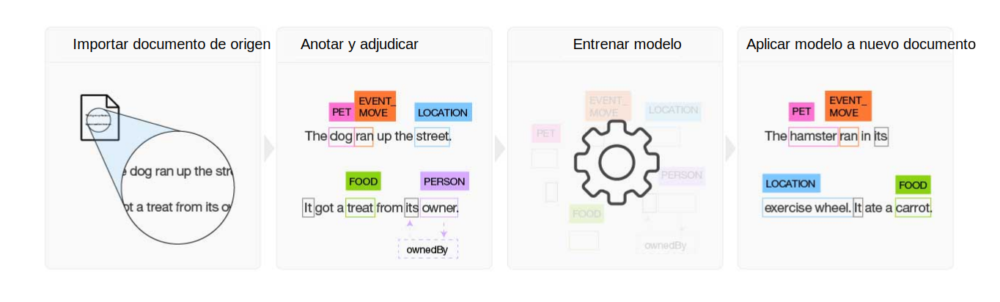

---

copyright:
  years: 2015, 2018
lastupdated: "2018-04-04"

---

{:shortdesc: .shortdesc}
{:new_window: target="_blank"}
{:tip: .tip}
{:pre: .pre}
{:codeblock: .codeblock}
{:screen: .screen}
{:javascript: .ph data-hd-programlang='javascript'}
{:java: .ph data-hd-programlang='java'}
{:python: .ph data-hd-programlang='python'}
{:swift: .ph data-hd-programlang='swift'}

Esta documentación es para {{site.data.keyword.knowledgestudiofull}} en {{site.data.keyword.cloud}}. Para ver la documentación para la versión anterior de {{site.data.keyword.knowledgestudioshort}} en {{site.data.keyword.IBM_notm}} Marketplace, [pulse este enlace ](https://console.bluemix.net/docs/services/knowledge-studio/index.html){: new_window}.
{: tip}

# Acerca de
{: #wks_overview_full}

Utilice {{site.data.keyword.knowledgestudiofull}} para crear un modelo de aprendizaje automático que comprenda los matices lingüísticos, el significado y las relaciones específicos de su sector o para crear un modelo basado en reglas que busque entidades en documentos basados en reglas que usted defina.
{: shortdesc}

Para convertirse en un experto en la materia de un sector o dominio determinado, {{site.data.keyword.watson}} debe estar entrenado. Puede facilitar la tarea de entrenamiento de {{site.data.keyword.watson}} con {{site.data.keyword.knowledgestudioshort}}.

## Crear un modelo de aprendizaje automático

{{site.data.keyword.knowledgestudioshort}} proporciona herramientas fáciles de utilizar para anotar documentación de dominio no estructurada, y utiliza estas anotaciones para crear un modelo de aprendizaje automático personalizado que comprenda el idioma del dominio. La exactitud del modelo mejora mediante pruebas repetitivas, que finalmente da lugar a un algoritmo que puede aprender de los patrones que ve y reconoce dichos patrones en grandes recopilaciones de documentos nuevos. Puede desplegar el modelo de aprendizaje automático finalizado en otras ofertas y en soluciones cognitivas basadas en la nube de {{site.data.keyword.watson}} para buscar y extraer las menciones de relaciones y entidades, incluidas las correferencias de las entidades.

 Figura 1. Visión general del proceso de creación de un modelo de aprendizaje automático

1. Basándose en un conjunto de documentos de origen específicos del dominio, el equipo crea un sistema de tipos que define los tipos de entidades y los tipos de relaciones para la información de interés para la aplicación que utilizará el modelo.
1. Un grupo de dos o más anotadores humanos anota un pequeño conjunto de documentos de origen para etiquetar palabras que representan tipos de entidades, para identificar tipos de relaciones donde el texto identifica relaciones entre menciones de entidades, y para definir correferencias, que identifican distintas menciones que hacen referencia a lo mismo, es decir, a la misma entidad. Las incoherencias en la anotación se resuelven, y se crea un conjunto de documentos óptimamente anotados, que forma los datos de campo.
1. {{site.data.keyword.knowledgestudioshort}} utiliza los datos de campo para entrenar un modelo.
1. El modelo entrenado se utiliza para encontrar entidades, relaciones y correferencias en documentos nuevos que no se han visto antes.

Consulte [Creación de un modelo de aprendizaje automático](/docs/services/watson-knowledge-studio/ml-annotator.html) para obtener más detalles.

## Crear un modelo basado en reglas

{{site.data.keyword.knowledgestudioshort}} proporciona un editor de reglas que simplifica el proceso de búsqueda y de captura de patrones comunes en los documentos como reglas. A continuación, puede crear un modelo que reconozca los patrones de reglas, y desplegarlo para utilizarlo en otros servicios.

Consulte [Creación de un modelo basado en reglas](/docs/services/watson-knowledge-studio/rule-annotator.html) para obtener más detalles.

## Integración de servicios de Watson
{: #wks_watsoninteg}

Comparta artefactos y modelos de dominio entre {{site.data.keyword.knowledgestudiofull}} y otros servicios de {{site.data.keyword.watson}}.

Utilice {{site.data.keyword.knowledgestudioshort}} para realizar las tareas siguientes:

- Anotación de arranque mediante el servicio {{site.data.keyword.nlushort}} para buscar y anotar automáticamente entidades en los documentos. Cuando los anotadores humanos empiecen a anotar los documentos, podrán ver las anotaciones que ya ha realizado el servicio y pueden revisarlas y añadirlas a los mismos. Consulte [Preanotación de documentos con {{site.data.keyword.nlushort}}](/docs/services/watson-knowledge-studio/preannotation.html#wks_preannotnlu) para obtener detalles.
- Cargue documentos analizados que se encuentren en [formato UIMA CAS XMI](/docs/services/watson-knowledge-studio/preannotation.html#wks_uimaweximport). Por ejemplo, puede cargar archivos UIMA CAS XMI exportados desde las recopilaciones analíticas de contenido de {{site.data.keyword.IBM_notm}} {{site.data.keyword.watson}} Explorer o [{{site.data.keyword.IBM_notm}} {{site.data.keyword.watson}} Explorer Content Analytics Studio](/docs/services/watson-knowledge-studio/preannotation.html#wks_uimawexstudio).
- Despliegue un modelo de [aprendizaje automático](/docs/services/watson-knowledge-studio/publish-ml.html#wks_madiscovery) o [basado en reglas](/docs/services/watson-knowledge-studio/rule-annotator-model-use.html#wks_rule_discovery) para utilizarlo con el servicio de {{site.data.keyword.watson}} {{site.data.keyword.discoveryshort}}.
- Despliegue un modelo de [aprendizaje automático](/docs/services/watson-knowledge-studio/publish-ml.html#wks_manlu) o [basado en reglas](/docs/services/watson-knowledge-studio/rule-annotator-model-use.html#wks_rule_nlu) para utilizarlo con el servicio de {{site.data.keyword.nlushort}}.
- [Exporte un modelo de aprendizaje automático](/docs/services/watson-knowledge-studio/publish-ml.html#wks_maexport) para utilizarlo en {{site.data.keyword.IBM_notm}} {{site.data.keyword.watson}} Explorer.
- [Exporte un archivo PEAR de modelo basado en reglas](/docs/services/watson-knowledge-studio/rule-annotator-model-use.html#wks_rule_export) para utilizarlo en {{site.data.keyword.IBM_notm}} {{site.data.keyword.watson}} Explorer.
