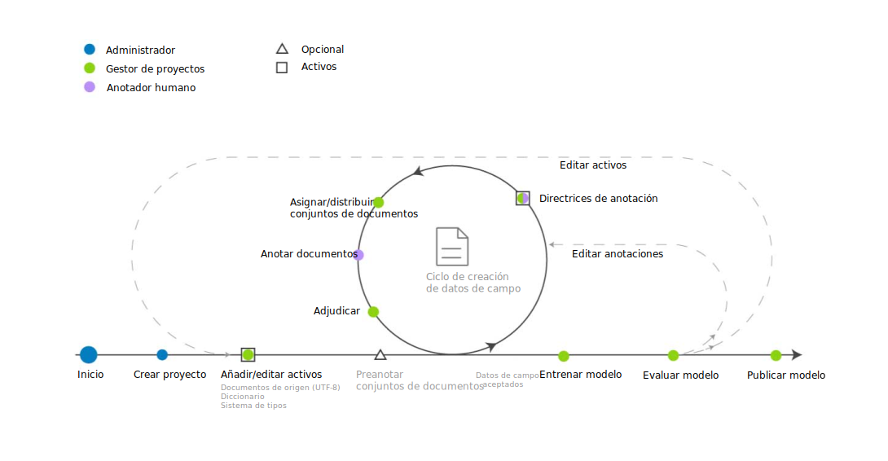

---

copyright:
  years: 2015, 2018
lastupdated: "2018-07-19"

---

{:shortdesc: .shortdesc}
{:new_window: target="_blank"}
{:tip: .tip}
{:pre: .pre}
{:codeblock: .codeblock}
{:screen: .screen}
{:javascript: .ph data-hd-programlang='javascript'}
{:java: .ph data-hd-programlang='java'}
{:python: .ph data-hd-programlang='python'}
{:swift: .ph data-hd-programlang='swift'}

Esta documentación es para {{site.data.keyword.knowledgestudiofull}} en {{site.data.keyword.cloud}}. Para ver la documentación para la versión anterior de {{site.data.keyword.knowledgestudioshort}} en {{site.data.keyword.IBM_notm}} Marketplace, [pulse este enlace ](https://{DomainName}/docs/services/knowledge-studio/ml-annotator.html){: new_window}.
{: tip}

# Flujo de trabajo de creación de modelo de aprendizaje automático
{: #ml_annotator}

Cree un modelo de aprendizaje automático que entrene un modelo que pueda utilizar para identificar entidades, correferencias y relaciones de interés en documentos nuevos.
{: shortdesc}

Comprenda el flujo de trabajo típico para crear un modelo de aprendizaje automático en {{site.data.keyword.knowledgestudioshort}}.

Todos los pasos los realiza el gestor de proyectos, excepto el paso *Anotar documentos*, que realiza el anotador humano. Dado que los anotadores humanos suelen ser expertos en la materia, pueden consultarse durante la creación de recursos de espacio de trabajo, como el sistema de tipos, también.

 Figura 1. El flujo de trabajo para desarrollar un modelo de aprendizaje automático

<table summary="Creación y refinación de un modelo">
  <caption>Tabla 1. Creación y refinación de un flujo de trabajo</caption>
  <tr>
    <th style="vertical-align:bottom; text-align:left" id="d14771e70">Paso</th>
    <th style="vertical-align:bottom; text-align:left" id="d14771e72">Descripción</th>
  </tr>
  <tr>
    <td style="vertical-align:top; text-align:left" headers="d14771e70">
      
Cree un espacio de trabajo.

    </td>
    <td style="vertical-align:top; text-align:left" headers="d14771e72">
      
Consulte [Creación de un espacio de trabajo](/docs/services/watson-knowledge-studio/create-project.html). Un espacio de trabajo contiene los recursos
utilizados para crear el modelo, incluyendo:

      <dl>
        <dt>Sistema de tipos</dt>
        <dd>
          
Cargar o crear el sistema de tipos, y definir los tipos de entidades y los tipos de relaciones que los anotadores humanos
pueden aplicar al anotar texto. El gestor de procesos de modelos normalmente trabaja con expertos en la materia
para el dominio para definir el sistema de tipos. Consulte [Establecimiento de un sistema de tipos](/docs/services/watson-knowledge-studio/typesystem.html)

        </dd>
        <dt>Documentos de origen</dt>
        <dd>
          
Cree un corpus cargando documentos de ejemplo que sean representativos del contenido de dominio
en el espacio de trabajo. Consulte [Añadir documentos para su anotación](/docs/services/watson-knowledge-studio/documents-for-annotation.html). Divida el corpus en conjuntos de documentos,
especifique el porcentaje de documentos que se comparten entre todos los conjuntos de documentos, y asigne los conjuntos de documentos
a anotadores humanos. Consulte [Creación y asignación de conjuntos de anotaciones](/docs/services/watson-knowledge-studio/documents-for-annotation.html#wks_projdocsets).

        </dd>
        <dt>Diccionarios</dt>
        <dd>
          
Cargue o cree diccionarios para anotar texto. Puede elegir añadir manualmente entradas de diccionario o cargar entradas desde un archivo, y luego editar las entradas. Consulte [Creación de diccionarios](/docs/services/watson-knowledge-studio/dictionaries.html).

        </dd>
      </dl>
    </td>
  </tr>
  <tr>
    <td style="vertical-align:top; text-align:left" headers="d14771e70">
      
<strong>Opcional</strong>: Preanotar documentos

    </td>
    <td style="vertical-align:top; text-align:left" headers="d14771e72">
      
Preanote documentos según los términos de los diccionarios del espacio de trabajo, menciones de tipos de {{site.data.keyword.nlushort}},
o basados en reglas que defina. Consulte [Anotación de arranque](/docs/services/watson-knowledge-studio/preannotation.html#wks_preannotate).

    </td>
  </tr>
  <tr>
    <td style="vertical-align:top; text-align:left" headers="d14771e70">
      
Anotar documentos

    </td>
    <td style="vertical-align:top; text-align:left" headers="d14771e72">
      <ol>
        <li>
          
El gestor de proyectos asigna tareas de anotación a anotadores humanos, configura el umbral de acuerdo entre anotadores
y proporciona directrices de anotación para que las sigan los anotadores humanos. Consulte
[Creación de una tarea de anotación](/docs/services/watson-knowledge-studio/annotate-documents.html#wks_hatask).

        </li>
        <li>
          
Los anotadores humanos utilizan el editor de datos de campo para anotar
documentos manualmente. Un anotador humano identifica menciones de interés en el contenido de dominio
y las etiqueta con tipos de entidades. El anotador humano también identifica relaciones entre
menciones (por ejemplo, Mary es una empleada de IBM) y cómo hacen correferencia las menciones a la misma entidad
(como una aparición de "she" ("ella") que hace referencia a Mary). Consulte [Anotación de documentos](/docs/services/watson-knowledge-studio/user-guide.html).

        </li>
      </ol>
    </td>
  </tr>
  <tr>
    <td style="vertical-align:top; text-align:left" headers="d14771e70">
      
Adjudicar y promocionar documentos

    </td>
    <td style="vertical-align:top; text-align:left" headers="d14771e72">
      
Acepte o rechace los datos de campo generados por los anotadores humanos, y adjudique
las diferencias de anotación para resolver conflictos. La evaluación de la exactitud y la coherencia del esfuerzo
de anotación humana puede ser la responsabilidad de un anotador humano senior o de un usuario con
más experiencia en la materia que el gestor de proyectos. Consulte [Adjudicación](/docs/services/watson-knowledge-studio/build-groundtruth.html#wks_haperform).

    </td>
  </tr>
  <tr>
    <td style="vertical-align:top; text-align:left" headers="d14771e70">
      
Entrenar el modelo

    </td>
    <td style="vertical-align:top; text-align:left" headers="d14771e72">
      
Cree el modelo de aprendizaje automático. Consulte [Creación de un modelo de aprendizaje automático](/docs/services/watson-knowledge-studio/train-ml.html#wks_madocsets).

    </td>
  </tr>
  <tr>
    <td style="vertical-align:top; text-align:left" headers="d14771e70">
      
Evaluar el modelo.

    </td>
    <td style="vertical-align:top; text-align:left" headers="d14771e72">
      
Evalúe la exactitud del modelo. Consulte [Evaluación de anotaciones añadidas por el modelo](/docs/services/watson-knowledge-studio/train-ml.html#wks_matest). Dependiendo de la exactitud del modelo, este paso podría dar lugar a la necesidad
de repetir pasos anteriores una y otra vez hasta que se consiga la exactitud óptima. Consulte [Análisis del rendimiento del modelo de aprendizaje automático](/docs/services/watson-knowledge-studio/evaluate-ml.html) para obtener ideas sobre qué actualizar en función de problemas de rendimiento comunes.

    </td>
  </tr>
  <tr>
    <td style="vertical-align:top; text-align:left" headers="d14771e70">
      
Publicar el modelo.

    </td>
    <td style="vertical-align:top; text-align:left" headers="d14771e72">
      
Exporte o despliegue el modelo. Consulte [Utilización del modelo de aprendizaje automático](/docs/services/watson-knowledge-studio/publish-ml.html).

    </td>
  </tr>
</table>
