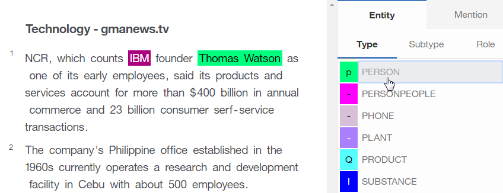

---

copyright:
  years: 2015, 2018
lastupdated: "2018-04-04"

---

{:shortdesc: .shortdesc}
{:new_window: target="_blank"}
{:tip: .tip}
{:pre: .pre}
{:codeblock: .codeblock}
{:screen: .screen}
{:javascript: .ph data-hd-programlang='javascript'}
{:java: .ph data-hd-programlang='java'}
{:python: .ph data-hd-programlang='python'}
{:swift: .ph data-hd-programlang='swift'}

Esta documentación es para {{site.data.keyword.knowledgestudiofull}} en {{site.data.keyword.cloud}}. Para ver la documentación para la versión anterior de {{site.data.keyword.knowledgestudioshort}} en {{site.data.keyword.IBM_notm}} Marketplace, [pulse este enlace ](https://console.bluemix.net/docs/services/knowledge-studio/tutorials-create-ml-model.html){: new_window}.
{: tip}

# Creación de un modelo de aprendizaje automático
{: #wks_tutml_intro}

Esta guía de aprendizaje le ayuda a comprender el proceso para crear un modelo de aprendizaje automático que puede desplegar y utilizar con otros servicios de {{site.data.keyword.watson}}.
{: shortdesc}

## Objetivos de aprendizaje

Tras completar las lecciones de esta guía de aprendizaje, sabrá cómo se realizan las tareas siguientes:

- Crear conjuntos de documentos
- Preanotar documentos
- Crear tareas para anotadores humanos
- Analizar el acuerdo entre anotadores y adjudicar conflictos en documentos anotados
- Crear anotadores de aprendizaje automático

Para completar esta guía de aprendizaje se necesitan, aproximadamente, 60 minutos. Si explora otros conceptos relacionados con esta guía de
aprendizaje, el tiempo puede ser mayor.

## Antes de empezar

- Está utilizando un navegador soportado. Para obtener información, consulte [Requisitos del navegador](/docs/services/watson-knowledge-studio/system-requirements.html).
- Ha completado correctamente [Guía de aprendizaje: Creación de un espacio de trabajo](/docs/services/watson-knowledge-studio/tutorials-create-project.html).
- Debe tener al menos un ID de usuario en el rol de Admin o ProjectManager.

    > **Nota:** Si es posible, utilice varios ID de usuario para las tareas del modelo de aprendizaje automático de esta guía de aprendizaje (un ID de usuario de Admin o de ProjectManager, y al menos dos ID de usuario de HumanAnnotator). Utilizar varios ID de usuario proporciona la simulación más realista de un espacio de trabajo real de {{site.data.keyword.IBM_notm}} {{site.data.keyword.watson}}™ {{site.data.keyword.knowledgestudioshort}}, donde un gestor de proyectos debe coordinar y adjudicar anotación realizada por varios anotadores humanos. Sin embargo, si tiene acceso solo a un único ID de usuario, puede seguir simulando la mayor parte del proceso.

    Para obtener información sobre los roles de usuario, consulte [Ensamblaje de un equipo](/docs/services/watson-knowledge-studio/team.html).

## Resultados

Después de completar esta guía de aprendizaje, tendrá un modelo de aprendizaje automático personalizado que puede utilizar con otros servicios de {{site.data.keyword.watson}}.

## Lección 1: Añadir documentos para su anotación
{: #tut_lessml1}

En esta lección, aprenderá a añadir documentos a un espacio de trabajo en {{site.data.keyword.knowledgestudioshort}} que pueden anotar los anotadores humanos.

### Acerca de esta tarea

Para obtener más información sobre cómo añadir documentos, consulte [Adición de documentos a un espacio de trabajo](/docs/services/watson-knowledge-studio/documents-for-annotation.html#wks_projadd).

### Procedimiento

1. Descargue el archivo <a target="_blank" href="https://watson-developer-cloud.github.io/doc-tutorial-downloads/knowledge-studio/documents-new.csv" download>`documents-new.csv`</a> en su sistema. Este archivo contiene documentos de ejemplo adecuados para cargarse.
1. Dentro del espacio de trabajo, pulse **Documentos** desde la barra lateral.
1. En la página Documentos, pulse **Cargar conjuntos de documentos**.
1. Seleccione el archivo `documents-new.csv` desde el sistema y pulse **Cargar**. El archivo cargado se mostrará en la tabla.

### Qué hacer a continuación

Ahora puede dividir el corpus en varios conjuntos de documentos y asignar los conjuntos de documentos a anotadores humanos.

## Lección 2: Creación de conjuntos de anotaciones
{: #wks_tutless_ml2}

En esta lección, aprenderá a crear conjuntos de anotaciones en {{site.data.keyword.knowledgestudioshort}}.

### Acerca de esta tarea

Un conjunto de anotaciones es un subconjunto de documentos desde un conjunto de documentos cargados que puede asignar a un anotador humano. El anotador humano anota los documentos en el conjunto de anotaciones. Para utilizar más tarde puntuaciones entre anotadores para comparar las anotaciones añadidas por cada anotador humano, debe asignar al menos dos anotadores humanos a distintos conjuntos de anotaciones. También debe especificar que algún porcentaje de documentos se solape entre los conjuntos.

> **Nota:** En un espacio de trabajo real, podría crear tantos conjuntos de anotaciones como sea necesario, en función del número de anotadores humanos que trabajen en el espacio de trabajo. En esta guía de aprendizaje, creará dos conjuntos de anotaciones; si no tiene acceso a varios ID de usuarios, puede asignar ambos conjuntos de anotaciones al mismo usuario.

Para obtener más información sobre los conjuntos de anotaciones, consulte [Creación y asignación de conjuntos de anotaciones](/docs/services/watson-knowledge-studio/documents-for-annotation.html#wks_projdocsets).

### Procedimiento

1. Dentro del espacio de trabajo, pulse **Documentos** desde la barra lateral.
1. Pulse **Crear conjuntos de anotaciones**.

    Se abrirá la ventana Crear conjuntos de anotaciones. De forma predeterminada, esta ventana muestra el conjunto base (que contiene todos los documentos), así como campos donde puede especificar la información para un nuevo conjunto de anotaciones.

1. Pulse **Añadir otro conjunto y anotador humano** para añadir campos para un conjunto de anotaciones adicional. Puede pulsar para añadir tantos conjuntos de anotaciones como desee crear; para esta guía de aprendizaje, solo necesita dos.

    

1. En el campo **Solapar**, especifique `100`. Esto especifica que desea que se incluya el 100 por ciento de los documentos del conjunto base en todos los conjuntos de anotaciones nuevos para que los puedan anotar todos los anotadores humanos.
1. Para cada nuevo conjunto de anotaciones que esté creando, especifique la información necesaria.

    - En el campo **Anotador**, seleccione un ID de usuario de anotador humano para asignar al nuevo conjunto de anotaciones. Cada conjunto de anotaciones debería estar asignado a un anotador humano distinto.

        > **Nota:** Si solo tiene un único ID de administrador para utilizar para la guía de aprendizaje, asigne dicho usuario a todos los conjuntos de anotaciones. En un espacio de trabajo real, tendría varios anotadores humanos por asignar, pero para la guía de aprendizaje, el administrador puede actuar como anotador humano.

    - En el campo **Establecer nombre**, especifique un nombre descriptivo para el conjunto de anotaciones (como por ejemplo `Set 1` o `DaveSet`).

1. Pulse **Generar**.

### Resultados

Se crearán los nuevos conjuntos de anotaciones y ahora aparecerán en el separador **Conjuntos de anotaciones** de la página Documentos.

## Lección 3: Preanotación con un anotador basado en diccionario
{: #wks_tutless_ml3}

En esta lección, aprenderá a utilizar un anotador basado en diccionario para preanotar documentos en {{site.data.keyword.knowledgestudioshort}}.

### Acerca de esta tarea

La preanotación de documentos es un paso opcional. Sin embargo, es un paso que merece la pena, porque facilita el trabajo de los anotadores humanos.

Para obtener más información sobre la preanotación con anotadores basados en diccionario, consulte [Preanotación de documentos con el Preanotador de diccionarios](/docs/services/watson-knowledge-studio/preannotation.html#wks_preannot).

### Procedimiento

1. En su espacio de trabajo, desde la barra lateral **Activos y herramientas** > **Preanotadores**, pulse **Gestionar diccionarios**.

  Se abrirá el diccionario `Probar diccionario`.

1. Desde la lista **Tipo de entidad**, seleccione **ORGANIZATION** para correlacionar el tipo de entidad ORGANIZATION con el diccionario `Diccionario de prueba` que ha creado en la lección [Añadir un diccionario](/docs/services/watson-knowledge-studio/tutorials-create-project.html#wks_tutless4) de la guía de aprendizaje *Creación de un espacio de trabajo*.
1. Pulse la flecha hacia atrás en la parte superior izquierda para volver a la página Preanotadores, y pulse **Aplicar este preanotador**
1. En la página Ejecutar anotador, pulse los recuadros de selección para seleccionar los dos conjuntos de anotaciones que ha creado anteriormente en la guía de aprendizaje (no incluido el conjunto base).
1. Pulse **Ejecutar**.

    

### Resultados

Los documentos de los conjuntos seleccionados se preanotan utilizando el anotador de diccionarios que ha creado. Posteriormente, puede utilizar el mismo anotador para preanotar conjuntos de documentos adicionales pulsando **Aplicar este preanotador**.

## Lección 4: Creación de una tarea de anotación
{: #wks_tutless_ml4}

En esta lección, aprenderá a utilizar tareas de anotación para realizar un seguimiento del trabajo de los anotadores humanos en {{site.data.keyword.knowledgestudioshort}}.

### Acerca de esta tarea

Para obtener más información sobre las tareas de anotación, consulte [Creación de una tarea de anotación](/docs/services/watson-knowledge-studio/annotate-documents.html#wks_hatask).

### Procedimiento

1. En su espacio de trabajo, desde la barra lateral **Activos y herramientas** > **Documentos**, seleccione el separador **Tareas**.
1. En la página Tareas, pulse **Añadir tarea**.
1. Especifique los detalles para la tarea:

    - En el campo **Nombre de tarea**, especifique `Prueba`.
    - En el campo **Plazo**, seleccione una fecha del futuro.

1. Pulse **Crear**.
1. En la ventana Añadir conjuntos de anotaciones a la tarea, marque los recuadros de selección para seleccionar los dos conjuntos de anotaciones que ha creado en [Lección 3: Preanotación con un anotador basado en diccionario](/docs/services/watson-knowledge-studio/tutorials-create-ml-model.html#wks_tutless_ml3). Esto especifica que ambos conjuntos de anotaciones deben anotarlos sus anotadores humanos asignados como parte de esta tarea.
1. Pulse **Crear tarea**.
1. Para ver el progreso del trabajo de anotación humana en el futuro, puede pulsar la tarea para abrirla.

## Lección 5: Anotación de documentos
{: #wks_tutless_ml5}

En esta lección, aprenderá a utilizar el editor de datos de campo para anotar documentos en {{site.data.keyword.knowledgestudioshort}}.

### Acerca de esta tarea

Para obtener más información sobre la anotación humana, consulte [Anotación con el editor de datos de campo](/docs/services/watson-knowledge-studio/user-guide.html#wks_hagte).

### Procedimiento

1. Inicie sesión en {{site.data.keyword.knowledgestudioshort}} como anotador humano asignado a la tarea de anotación que ha creado en [Lección 4: Creación de una tarea de anotación](/docs/services/watson-knowledge-studio/tutorials-create-ml-model.html#wks_tutless_ml4).

    > **Nota:** Si solo tiene acceso a un único ID de administrador para esta guía de aprendizaje, puede utilizar dicho ID para realizar la anotación humana. Sin embargo, recuerde que en un espacio de trabajo real, la anotación humana la realizan varios usuarios distintos con el rol HumanAnnotator.

1. Abra el espacio de trabajo `Mi espacio de trabajo`.
1. Desde la barra lateral, pulse **Anotación de documentos** > **Relaciones**.
1. Abra la tarea de anotación `Prueba` que ha creado en [Lección 4: Creación de una tarea de anotación](/docs/services/watson-knowledge-studio/tutorials-create-ml-model.html#wks_tutless_ml4).
1. Desplácese al documento *Tecnología - gmanews.tv* y pulse para abrirlo para su anotación. Tenga en cuenta que el término `IBM` ya ha sido anotado con el tipo de entidad ORGANIZATION; esta anotación la ha añadido el preanotador de diccionarios en [Lección 2: Creación de conjuntos de anotaciones](/docs/services/watson-knowledge-studio/tutorials-create-ml-model.html#wks_tutless_ml2). Esta preanotación es correcta, por lo que no se necesita modificarla.

    

1. Anotar una mención:

    1. Pulse el icono **Menciones** para empezar a anotar las menciones.
    1. En el cuerpo del documento, seleccione el texto `Thomas Watson`.
    1. En la lista de tipos de entidades, pulse **PERSON**. El tipo de entidad PERSON se aplica a la mención seleccionada.

        

1. Pulse **Anotación de documentos** > **Relaciones** desde la barra lateral para empezar a anotar las relaciones.
1. Seleccione las menciones `Thomas Watson` e `IBM` (en ese orden). Para seleccionar una mención, pulse la etiqueta entity-type por encima del texto.
1. En la lista de tipos de relaciones, pulse **founderOf**. Las dos menciones están conectadas con una relación founderOf.

    

1. Desde el menú de estado, seleccione **Completado**, y luego pulse el botón **Guardar**.
1. Vuelva a la lista de documentos y pulse **Enviar todos los documentos** para enviar los documentos para su aprobación.

    > **Nota:** En una situación real, debería crear muchas más anotaciones y completar todos los documentos del conjunto antes de enviar.

1. Inicie sesión en {{site.data.keyword.knowledgestudioshort}} como el anotador humano que está asignado a otros conjuntos de documentos de la tarea de anotación.
1. Repita las mismas anotaciones en el documento *Tecnología - gmanews.tv*, excepto esta vez, utilice la relación employedBy en lugar de la relación founderOf.

  Iniciar sesión como otro usuario ayudará a ilustrar el acuerdo entre anotadores en la lección siguiente. Complete las anotaciones y pulse **Enviar todos los documentos**.

## Lección 6: Análisis del acuerdo entre anotadores
{: #wks_tutless_ml6}

En esta lección, aprenderá a comparar el trabajo de varios anotadores humanos en {{site.data.keyword.knowledgestudioshort}}.

### Acerca de esta tarea

Para determinar si distintos anotadores humanos están anotando documentos solapados de forma coherente, revise las puntuaciones del acuerdo entre anotadores (`IAA`).

{{site.data.keyword.knowledgestudioshort}} calcula las puntuaciones de IAA examinando todos los documentos solapados en todos los conjuntos de documentos de la tarea, independientemente del estado de los conjuntos de documentos. Las puntuaciones de IAA muestran cómo han anotado distintos anotadores humanos menciones, relaciones y cadenas de correferencia. Es una buena idea comprobar las puntuaciones de IAA periódicamente y verificar que los anotadores humanos sean coherentes entre sí.

En esta guía de aprendizaje, los anotadores humanos han enviado todos los conjuntos de documentos para su aprobación. Si las puntuaciones del acuerdo entre anotadores son aceptables, podrá aprobar los conjuntos de documentos. Si rechaza un conjunto de documentos, se devolverá al anotador humano para su mejora.

### Procedimiento

1. Inicie sesión en {{site.data.keyword.knowledgestudioshort}} como administrador, seleccione **Activos y herramientas** > **Documentos**, y pulse la tarea `Prueba`.

  En la columna **Estado**, puede ver que los conjuntos de documentos están enviados.

1. Pulse **Calcular acuerdo entre anotadores**.
1. Vea puntuaciones de IAA para las cadenas de menciones, relaciones y correferencia pulsando el primer menú. También puede ver el acuerdo de pares de anotadores humanos. Por ejemplo, puede comparar todas las anotaciones de Dave con todas las de Phil. También puede ver el acuerdo de documentos específicos. Por ejemplo, puede ver las anotaciones de Dave en un documento comparadas con las de Phil en el mismo documento. En general, el objetivo de una puntuación es de 0,8 de 1, lo que significa que 1 es un acuerdo perfecto. Puesto que solo ha anotado dos tipos de entidades en esta guía de aprendizaje, la mayoría de las puntuaciones del tipo de entidad son N/D (no aplicable), lo que significa que no hay información disponible para dar una puntuación.

    *Figura 1. Revisión de las puntuaciones entre anotadores con los usuarios llamados Dave y Phil*

    

1. Después de revisar las puntuaciones, puede decidir si desea aprobar o rechazar conjuntos de documentos que se encuentran en el estado `Enviado`. Una vez enviado un conjunto de documentos, se mostrará un recuadro de selección junto a su nombre. Lleve a cabo una de estas acciones:

    - Si las puntuaciones son aceptables para un conjunto de documentos, marque el recuadro de selección y pulse **Aceptar**. Los documentos que no se solapan con otros conjuntos de documentos se promocionarán a datos de campo. Los documentos que se solapan deben en primer lugar ser revisados mediante adjudicación para que los conflictos se puedan resolver. Para esta guía de aprendizaje, acepte los dos conjuntos de documentos.
    - Si las puntuaciones no son aceptables para un conjunto de documentos, marque el recuadro de selección y pulse **Rechazar**. El conjunto de documentos necesita ser revisado por el anotador humano para mejorar las anotaciones.

### Resultados

Cuando se hayan evaluado las puntuaciones del acuerdo entre anotadores, verá cómo distintos pares de anotadores humanos han anotado el mismo documento. Si la puntuación del acuerdo entre anotadores fue aceptable, aceptará el conjunto de documentos.

## Lección 7: Adjudicación de conflictos en documentos anotados
{: #wks_tutless_ml7}

En esta lección, aprenderá a adjudicar conflictos en documentos que se solapan entre conjuntos de documentos de {{site.data.keyword.knowledgestudioshort}}.

### Acerca de esta tarea

Cuando se aprueba un conjunto de documentos, solo se promocionarán a datos de campo los documentos que no se solapen con otros conjuntos de documentos. Si un documento forma parte del solapamiento entre varios conjuntos de documentos, debe adjudicar cualquier conflicto de anotación antes de promocionar el documento a datos de campo.

### Procedimiento

1. Inicie sesión en {{site.data.keyword.knowledgestudioshort}} como administrador, seleccione **Activos y herramientas** > **Documentos**, y pulse la tarea `Prueba`.
1. Verifique que los dos conjuntos de documentos estén en un estado aprobado.
1. Pulse **Comprobar solapamiento de documentos en busca de conflictos**.

    Puede ver los documentos solapados anotados por más de un anotador humano.

1. Para ver si existen conflictos en cómo han anotado los documentos, pulse **Comprobar en busca de conflictos**.
1. En la modalidad de adjudicación, puede ver cuántas anotaciones están en conflicto y eliminar o sustituir anotaciones antes de promocionar los documentos a datos de campo.
1. Para esta guía de aprendizaje, suponga que ha corregido todos los conflictos y que ha aceptado los cambios. Pulse **Promocionar a datos de campo**. Repita estos pasos para resolver los conflictos en el segundo conjunto de documentos.

    Como alternativa, puede promocionar un documento a datos de campo pulsando **Aceptar** en la página Documentos.

### Resultados

Después de resolver los conflictos de anotaciones y de promocionar los documentos a datos de campo, podrá utilizarlos para entrenar el modelo de aprendizaje automático.

## Lección 8: Creación de un modelo de aprendizaje automático
{: #wks_tutless_ml8}

En esta lección, aprenderá a crear un modelo de aprendizaje automático en {{site.data.keyword.knowledgestudioshort}}.

### Acerca de esta tarea

Cuando se crea un modelo de aprendizaje automático, seleccione los conjuntos de documentos que desea utilizar para entrenarlo. Especifique también el porcentaje de documentos que se utilizarán como datos de entrenamiento, datos de prueba y datos ciegos. Solo se podrán utilizar los documentos que se conviertan en datos de campo mediante la aprobación o la adjudicación para entrenar el modelo de aprendizaje automático.

### Procedimiento

1. Inicie una sesión en {{site.data.keyword.knowledgestudioshort}} como administrador.
1. Desde la barra lateral **Gestión de modelos** > **Rendimiento**, pulse **Entrenar y evaluar**.
1. Seleccione los conjuntos de documentos que desea utilizar para crear un modelo de aprendizaje automático. Pulse la marca de selección junto a cada nombre de conjunto de documentos.
1. Seleccione los dos conjuntos de anotaciones para crear sus datos de prueba, entrenamiento y ciegos. A continuación, pulse **Entrenar y evaluar**.

    > **Nota:** El entrenamiento puede llevar más de diez minutos, o incluso horas, dependiendo del número de anotaciones humanas y del número total de palabras en los documentos.

1. Una vez que el modelo de aprendizaje automático esté entrenado, puede exportarlo o puede ver información detallada sobre su rendimiento pulsando los enlaces **Estadísticas detalladas** que se ubican por encima de cada gráfico.
1. Para ver la página Conjuntos de formación / prueba / ciegos, pulse el botón **Entrenar y evaluar**.
1. Para ver los documentos en los que han trabajado los anotadores humanos, pulse **Ver datos de campo**.
1. Para ver las anotaciones que ha creado el modelo de aprendizaje automático en ese mismo conjunto de documentos, pulse **Ver resultados de descodificación**.
1. Para ver detalles sobre las puntuaciones de precisión, recuperación y F1 para el modelo de aprendizaje automático, seleccione la página Rendimiento.
1. Pulse los enlaces **Estadísticas detalladas** por encima de cada uno de los gráficos. En estas páginas de Estadísticas, puede ver las puntuaciones para cadenas de menciones, relaciones y correferencias utilizando los botones de selección.

    Puede analizar el rendimiento viendo un resumen de estadísticas para los tipos de entidades, los tipos de relaciones y las cadenas de correferencia. También puede analizar estadísticas que se presentan en una matriz de confusión seleccionando **Matriz de confusión** desde el menú que tiene el valor predeterminado de **Resumen**. La *matriz de confusión* le ayuda a comparar las anotaciones añadidas por el modelo de aprendizaje automático con las anotaciones de los datos de campo.

    > **Nota:** En esta guía de aprendizaje, ha anotado documentos con un único diccionario para las organizaciones. Por lo tanto, las puntuaciones que verá son `0` o `N/D` para la mayoría de los tipos de entidades, excepto `ORGANIZATION`. Los números son bajos, pero es lo que se esperaba, porque no se ha realizado ninguna anotación ni corrección humana.

    *Figura 2. Opciones de la página Estadísticas para un modelo de aprendizaje automático*

    

1. Desde la barra lateral, seleccione **Gestión de modelos** > **Versiones**. En la página Versiones, puede realizar una instantánea del modelo y de los recursos utilizados para crearlo (excepto diccionarios y tareas de anotación). Por ejemplo, puede que desee realizar una instantánea antes de volver a entrenar el modelo. Si las estadísticas son peores la próxima vez que lo entrene, puede promocionar la versión más antigua y suprimir la versión que devolvió peores resultados.

### Resultados

Ha creado un modelo de aprendizaje automático, lo ha entrenado y ha evaluado cómo ha funcionado al anotar datos de prueba y datos ciegos. Al explorar las métricas de rendimiento, puede identificar maneras de mejorar la exactitud del modelo de aprendizaje automático.

## Resumen de la guía de aprendizaje
{: #wks_tutml_sum}

A la vez que aprendía sobre {{site.data.keyword.knowledgestudioshort}}, ha creado un modelo de aprendizaje automático.

### Lecciones aprendidas

Al completar esta guía de aprendizaje, habrá aprendido los siguientes conceptos:

- Conjuntos de documentos
- Modelos de aprendizaje automático
- Tareas de anotación humana
- Acuerdo entre anotadores y adjudicación
