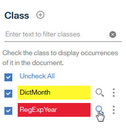

---

copyright:
  years: 2015, 2018
lastupdated: "2018-04-04"

---

{:shortdesc: .shortdesc}
{:new_window: target="_blank"}
{:tip: .tip}
{:pre: .pre}
{:codeblock: .codeblock}
{:screen: .screen}
{:javascript: .ph data-hd-programlang='javascript'}
{:java: .ph data-hd-programlang='java'}
{:python: .ph data-hd-programlang='python'}
{:swift: .ph data-hd-programlang='swift'}

Esta documentación es para {{site.data.keyword.knowledgestudiofull}} en {{site.data.keyword.cloud}}. Para ver la documentación para la versión anterior de {{site.data.keyword.knowledgestudioshort}} en {{site.data.keyword.IBM_notm}} Marketplace, [pulse este enlace ](https://console.bluemix.net/docs/services/knowledge-studio/tutorials-create-rule-model.html){: new_window}.
{: tip}

# Creación de un modelo basado en reglas
{: #wks_tutrule_intro}

Esta guía de aprendizaje le ayuda a comprender cómo crear un modelo basado en reglas que puede utilizar para buscar patrones de texto que defina en los documentos.
{: shortdesc}

Creará un modelo que puede buscar texto en documentos que coincida con el patrón `mes día, año`. Por ejemplo, el modelo podría encontrar la fecha de referencia *May 1, 2010*. Antes de definir el propio patrón de reglas, creará artefactos que le ayudarán a crear el patrón, incluida una clase de diccionario que reconoce las menciones de meses y una clase de expresión regular que reconoce las menciones de años en el texto.

## Objetivos de aprendizaje

Cuando haya completado esta guía de aprendizaje sabrá cómo realizar las tareas siguientes:

- Crear clases
- Añadir documentos para definir reglas
- Asociar diccionarios con clases
- Definir expresiones regulares para capturar secuencias de caracteres
- Definir reglas

Tardará aproximadamente 30 minutos en terminar esta guía de aprendizaje. Si explora otros conceptos relacionados con esta guía de
aprendizaje, el tiempo puede ser mayor.

## Antes de empezar

- Está utilizando un navegador soportado. Para obtener información, consulte [Requisitos del navegador](/docs/services/watson-knowledge-studio/system-requirements.html).
- Ha completado correctamente [Guía de aprendizaje: Creación de un espacio de trabajo](/docs/services/watson-knowledge-studio/tutorials-create-project.html).
- Debe tener al menos un ID de usuario en el rol de Admin o ProjectManager. Para obtener información sobre los roles de usuario, consulte [Ensamblaje de un equipo](/docs/services/watson-knowledge-studio/team.html).

## Resultados

Después de crear el modelo basado en reglas, puede utilizarlo de una de las siguientes formas para encontrar patrones de texto en los documentos:

- [Preanote los documentos](/docs/services/watson-knowledge-studio/preannotation.html#wks_preannotrule) antes de crear un modelo de aprendizaje automático
- [Despliegue o exporte el modelo](/docs/services/watson-knowledge-studio/rule-annotator-model-use.html) a otros servicios o productos de {{site.data.keyword.watson}}

## Lección 1: Adición de un diccionario de meses
{: #wks_tutless_rule1}

En esta lección, aprenderá a añadir un diccionario a un espacio de trabajo en {{site.data.keyword.knowledgestudioshort}}. El diccionario contiene términos relacionados con los meses del año.

### Acerca de esta tarea

En una lección posterior, definirá una clase basándose en este diccionario. Cuando cree tal clase, todos los términos de este diccionario que se encuentran en documentos se anotarán automáticamente como una mención del tipo de clase asociado. Para obtener más información sobre los diccionarios, consulte [Adición de diccionarios a un espacio de trabajo](/docs/services/watson-knowledge-studio/dictionaries.html#wks_projdictionaries).

### Procedimiento

1. Descargue el archivo <a target="_blank" href="https://watson-developer-cloud.github.io/doc-tutorial-downloads/knowledge-studio/dictionary-items-month.csv" download>`dictionary-items-month.csv`</a> en el sistema. Este archivo contiene términos de diccionario en formato CSV, adecuado para cargar en un diccionario de {{site.data.keyword.knowledgestudioshort}}.
1. Desde la barra lateral **Activos y herramientas** > **Preanotadores**, seleccione el separador **Diccionarios** y pulse **Gestionar diccionarios**.
1. Pulse el botón **Crear diccionario** para añadir un diccionario.
1. En el campo **Nombre**, escriba `Diccionario de meses` y pulse **Guardar** para crear el diccionario (vacío). El nuevo diccionario se creará y se abrirá automáticamente para su edición.
1. En el panel del diccionario, pulse **Cargar**.
1. En la ventana Cargar entradas del diccionario, seleccione el archivo `dictionary-items-month.csv` desde su sistema y luego pulse **Cargar**.

    Los términos del archivo se importan en el diccionario.

## Lección 2: Adición de documentos de ejemplo
{: #wks_tutless_rule2}

En esta lección, aprenderá a añadir documentos con patrones lingüísticos que ilustran los tipos de reglas que desea definir.

### Acerca de esta tarea

Para obtener más información sobre la adición de documentos, consulte [Añadir documentos para definir reglas](/docs/services/watson-knowledge-studio/rule-annotator-add-doc.html).

### Procedimiento

1. Descargue el archivo <a target="_blank" href="https://watson-developer-cloud.github.io/doc-tutorial-downloads/knowledge-studio/documents-new.csv" download>`documents-new.csv`</a> en su sistema. Este archivo contiene documentos de ejemplo adecuados para cargarse.
1. Desde la barra lateral, pulse **Anotación de documentos** > **Reglas**.
1. Pulse el icono **Añadir un documento** junto a **Documentos**.
1. Pulse el separador **Cargar archivo CSV**.
1. Pulse para buscar el archivo `documents-new.csv` que ha descargado en el sistema anteriormente, y luego pulse **Cargar**.

    Se mostrará un conjunto de documentos en la página Documentos principal.

    

## Lección 3: Creación de clases
{: #wks_tutless_rule3}

En esta lección, aprenderá a definir clases que utilizará al definir una regla.

### Acerca de esta tarea

Para obtener más información sobre las clases, consulte [Reglas](/docs/services/watson-knowledge-studio/rule-annotator.html).

### Procedimiento

1. Desde la página **Reglas** del espacio de trabajo, pulse el icono **Añadir una clase** junto a **Clases** en el panel del lado derecho.

1. Escriba `DictMonth` como el nombre de clase y, a continuación, pulse **Añadir**.

    La nueva clase se visualiza en el panel lateral Clases.

## Lección 4: Asociación de un diccionario con una clase
{: #wks_tutless_rule4}

En esta lección, aprenderá a utilizar un diccionario en el editor de reglas.

### Procedimiento

1. Desde la barra lateral, seleccione **Anotación de documentos** > **Diccionarios** y, a continuación, pulse el **Diccionario de meses** que ha creado previamente.

1. Desde la lista **Clases**, seleccione `DictMonth` y luego pulse **Guardar**.

    La clase está asociada con el diccionario.

    

### Resultados

Para documentos asociados con el editor de reglas, las referencias a los términos del diccionario se anotan como menciones de clase `DictMonth`. Verá la prueba de que estas referencias se han anotado en la siguiente lección.

## Lección 5: Búsqueda de anotaciones de clases en documentos
{: #wks_tutless_rule5}

En esta lección, aprenderá a buscar anotaciones de clases en los documentos del editor de reglas.

### Procedimiento

1. Desde la barra lateral, seleccione **Anotación de documentos** > **Reglas**.
1. Desde el panel Clases, busque la clase `DictMonth` que ha definido anteriormente, y pulse el icono **Buscar anotaciones en documentos** que está junto a ella.

    La página Buscar anotaciones se visualizará y mostrará todos los documentos que contienen referencias de texto a meses.

1. Pulse el documento `Tecnología - computerworld.com` para ver el documento completo. Observe que el texto `Febrero` está resaltado, lo que significa que fue anotado como una mención de la clase `DictMonth`.

## Lección 6: Definición de una expresión regular
{: #wks_tutless_rule6}

En esta lección, aprenderá a definir una expresión regular.

### Acerca de esta tarea

Definirá una expresión regular que pueda buscar patrones de año como *2009*.

Para obtener más información sobre cómo definir expresiones regulares, consulte [Definición de una regla](/docs/services/watson-knowledge-studio/rule-annotator-define-rule.html).

### Procedimiento

1. Desde la página **Reglas**, pulse el icono **Añadir una clase** () junto a **Clases** en el panel lateral derecho.
1. Escriba `RegExpYear` como el nombre de clase, y pulse **Añadir**.
1. Desde la barra lateral, pulse **Expresión regular**, y luego pulse el icono **Crear una expresión regular** junto a **Expresiones regulares**.
1. Pulse el botón **Añadir entrada**.
1. En el campo **Expresión regular**, especifique la expresión siguiente:

    ```
    (?:(?:19|20)[0-9]{2})
    ```
    {: screen}

    > **Nota:** Esta expresión regular busca años entre 1900 y 2099.

1. Establezca **Señales de palabras mínimas** en `1` y **Señales de palabras máximas** en `1`.
1. Pulse **Añadir** para guardar la entrada de la expresión regular.
1. Escriba `MyYearExp` como nombre de expresión regular, y luego, desde el menú **Clases**, seleccione la clase *RegExpYear* que ha definido anteriormente.
1. Pulse **Guardar**.

    Después de guardar la expresión regular, se aplicará automáticamente a los documentos de ejemplo. Las cadenas de texto que siguen al patrón definido en la expresión regular se anotan como menciones de la clase **RegExpYear**.

1. Para comprobar si la expresión que ha definido está capturando apariciones de tiempo correctamente, puede buscar menciones. Pulse el icono **Buscar anotaciones en documentos** junto a la clase **RegExpYear** en el panel lateral Clases.

    

    Se mostrará la página Buscar anotaciones. Las apariciones de las menciones de año están resaltadas en los documentos de ejemplo en los que se dan.

    

## Lección 7: Definición de una regla
{: #unique_1166829415}

En esta lección, aprenderá a definir una regla.

### Acerca de esta tarea

Ya ha definido una clase basada en diccionario para anotar menciones de meses. También ha definido una expresión regular que busca valores numéricos que representan un año. Ahora, definirá una regla que captura la secuencia de un mes seguida por un número, una coma y luego un año. Definirá una regla para expresiones de fecha como *September 21, 2016*.

Para obtener más información sobre cómo definir reglas, consulte [Definición de una regla](/docs/services/watson-knowledge-studio/rule-annotator-define-rule.html).

### Procedimiento

1. Desde la barra lateral, seleccione **Anotación de documentos** > **Reglas**, y abra el documento `Tecnología - computerworld.com`.
1. Seleccione el texto *February 3, 2009* en el documento. Asegúrese de seleccionar también la coma.

    

1. Pulse el icono **Añadir una regla**.

    El editor de reglas muestra una representación del patrón de reglas especificado.

    El texto *February 3, 2009* es visible. Una línea gris que conecta las células en la representación identifica qué células son actualmente parte del patrón.
    - La clase *DictMonth* forma parte del patrón de reglas en lugar del texto *febrero*. Esta selección es preferible porque desea que el modelo busque cualquier mes anotado por la clase *DictMonth* como la primera señal del patrón de fecha en lugar de solo el texto *February*.
    - Al final de la regla, el año *2009* ya está anotado como una mención de la clase *RegExpYear*. La clase *RegExpYear* forma parte del patrón de reglas en lugar del número 2009. Esta selección es preferible también porque desea que el modelo busque cualquier año anotado por la clase *RegExpYear* como la última señal del patrón de fecha en lugar de solo el texto específico *2009*.

    El número 3 y la coma (,) que hay después se muestran como las señales segunda y tercera en el patrón. A medida que se especifique el patrón, el modelo buscará solo apariciones de fechas que especifican el tercer día de un mes. Deseamos que el modelo busque fechas que especifiquen cualquier día del mes, por lo que cambiaremos a continuación los valores de las características para la señal día.

1. Sobre la celda de día `3`, pulse el icono **Texto** para abrir los valores de las características para la señal.

    

    Actualmente, se establece la regla para que coincida con el texto exacto, `3`. En su lugar, queremos que coincida con cualquier número.

1. Cambie el valor de la característica a numérico seleccionando **Tipo de carácter : numérico**, y a continuación deseleccione **Texto: 3**.

    

    Ha cambiado la definición para la célula de número `3`.

    

    El icono **Aa** indica que en lugar de exigir que el número sea igual a 3 exactamente, puede ser cualquier número.

1. No cambie ningún valor para la señal coma.

    Queremos que la tercera señal del patrón sea una coma, por lo que el valor de la característica actual de **texto : ,** es apropiado. Además del valor de una característica, cada señal tiene un valor repetido. El valor repetido especifica cuántas veces se puede repetir la señal en el texto para que coincida con el patrón. El valor de repetición actual de **Necesario (Exactamente 1)** también es apropiado como se especifica.

    

1. Asigne una clase para representar el patrón `DictMonth + señal numérica + coma + RegExpYear`.

    Observe las cuatro células vacías que representan las cuatro señales que ha seleccionado en el documento. Para seleccionar todas las células, seleccione la primera y, a continuación, pulse Mayús + pulse cada célula adicional. Escriba `RuleDate` como el nombre de clase y, a continuación, púlselo para crear la nueva clase.

    

    Ha definido correctamente el patrón para la regla.

1. En el campo **Nombre de regla**, escriba `MyDateRule` y pulse **Guardar**.

    Después de guardar la regla, se aplicará automáticamente a los documentos de ejemplo. Si el documento `Tecnología - computerworld.com` sigue estando abierto en el editor de reglas, verá que el texto `February 3, 2009` del documento ahora está anotado como una mención de la clase RuleDate.

    

    Puede buscar todas las apariciones de las menciones de la clase RuleDate en los documentos de ejemplo pulsando el icono **Buscar anotación en documentos** ( ) junto a la clase `RuleDate` desde el panel Clases. Es una buena práctica comprobar si todas las fechas se capturan correctamente para confirmar que ha definido el patrón correctamente.

    

## Lección 8: Creación de un modelo basado en reglas
{: #wks_tutless_rule8}

En esta lección, aprenderá a crear un modelo basado en reglas.

### Acerca de esta tarea

Para obtener más información sobre la creación de un modelo basado en reglas, consulte [Creación del modelo basado en reglas](/docs/services/watson-knowledge-studio/rule-annotator-model-create.html).

### Procedimiento

1. Desde la barra lateral, seleccione **Gestión de modelos** > **Versiones** y pulse el separador **Correlación de tipos de modelos basados en reglas**.

1. Correlacione la clase `RuleDate` que ha definido correspondiente a la entidad `DATE` del sistema de tipos.

    1. Busque la entidad **DATE** y pulse **Editar**.

        

    1. Elija la clase `RuleDate` desde la lista desplegable y pulse **Guardar**.

        

1. Para ejecutar el modelo basado en reglas, seleccione el separador **Basado en reglas** y pulse **Ejecutar este modelo**.

## Resumen de la guía de aprendizaje
{: #wks_tutrule_sum}

A la vez que aprendía sobre {{site.data.keyword.knowledgestudioshort}}, ha creado un modelo basado en reglas.

### Lecciones aprendidas

Al completar esta guía de aprendizaje, habrá aprendido los siguientes conceptos:

- Clases
- Expresiones regulares
- Reglas
