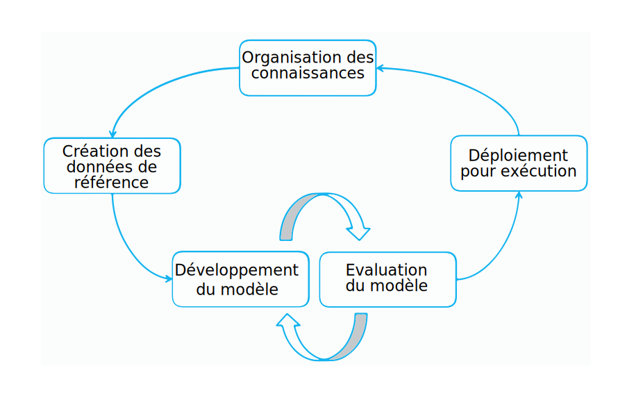

---

copyright:
  years: 2015, 2018
lastupdated: "2018-07-19"

---

{:shortdesc: .shortdesc}
{:new_window: target="_blank"}
{:tip: .tip}
{:pre: .pre}
{:codeblock: .codeblock}
{:screen: .screen}
{:javascript: .ph data-hd-programlang='javascript'}
{:java: .ph data-hd-programlang='java'}
{:python: .ph data-hd-programlang='python'}
{:swift: .ph data-hd-programlang='swift'}

Cette documentation concerne {{site.data.keyword.knowledgestudiofull}} on {{site.data.keyword.cloud}}. Pour consulter la documentation de la version précédente de {{site.data.keyword.knowledgestudioshort}} on {{site.data.keyword.IBM_notm}} Marketplace, [cliquez sur ce lien ](https://{DomainName}/docs/services/knowledge-studio/annotate-documents.html){: new_window}.
{: tip}

# Configuration d'annotation
{: #annotate-documents}

Les documents doivent être annotés par des utilisateurs ayant une connaissance du secteur concerné et de sa langue.
{: shortdesc}

Effectuez les tâches suivantes pour permettre aux annotateurs humains d'accéder à l'espace de travail :

- Invitez des spécialistes du domaine à l'instance de {{site.data.keyword.knowledgestudioshort}} que vous utilisez.
- Associez des annotateurs humains au(x) jeu(x) d'annotations que vous souhaitez leur confier.
- Créez une tâche affectant ces annotateurs humains à l'annotation des documents de ces jeux.

    > **Attention :** Ce n'est qu'à compter du moment où vous leur affectez explicitement une tâche d'annotation que les annotateurs humains peuvent voir votre espace de travail lorsqu'ils se connectent à {{site.data.keyword.knowledgestudioshort}}.

Vos utilisateurs (les annotateurs humains) devront être familiarisés avec le guide d'[annotation de documents](/docs/services/watson-knowledge-studio/user-guide.html), qui contient des informations détaillées sur la façon d'annoter correctement les documents.

## Cycle de vie du modèle
{: #wks_lifecycle}

Le modèle que vous créez avec {{site.data.keyword.knowledgestudioshort}} est un composant logiciel que vous pouvez connecter à un pipeline de traitement automatique du langage naturel (NLP, de l'anglais 'natural language processing').

Avec {{site.data.keyword.knowledgestudioshort}}, vous pouvez créer, évaluer et améliorer des modèles s'appliquant à de nouveaux domaines. Un modèle ajoute des annotations (métadonnées) au texte qui apparaît dans un contenu en langage naturel. Les annotations, qui identifient les mentions d'entités d'intérêt dans votre domaine, les relations entre elles et les mentions qui constituent des coréférences à une même entité, peuvent être utilisées par des applications pour automatiser l'analyse de textes et leur traitement. Les utilisateurs de ces applications profitent de ce niveau d'analyse et peuvent extraire du sens, découvrir des perspectives et obtenir des réponses dans un contexte de langage naturel.

La création d'un modèle est un processus itératif en plusieurs étapes qui comprend plusieurs phases : organisation des connaissances, génération des données de référence, développement du modèle, évaluation du modèle et déploiement en environnement d'exécution.

### Adaptation au domaine de bout en bout
{: #wks_lifecycle__wks_lifecycleS6}

Le diagramme suivant schématise les interactions entre ces cinq phases du développement d'un modèle et les activités qui y sont généralement effectuées.

 Figure 2. Synthèse des cinq phases du développement d'un modèle et des activités dans chacune.

### Organisation des connaissances
{: #wks_lifecycle__wks_lifecycleS1}

Egalement appelée 'curation', cette phase est extérieure à {{site.data.keyword.knowledgestudioshort}}. Elle consiste à sélectionner, collecter, conserver et tenir à jour les contenus pertinents dans un domaine spécifique. Elle transforme les données en information fiable et en connaissances.

### Génération des données de référence
{: #wks_lifecycle__wks_lifecycleS2}

Cette phase consiste à utiliser les outils de {{site.data.keyword.knowledgestudioshort}} et diverses bonnes pratiques pour produire une collection de données validées qui puissent être utilisées pour adapter une solution {{site.data.keyword.watson}} à un domaine particulier. L'exactitude de ces données validées, que l'on appelle *données de référence* ou *documents étalon-or*, est essentielle, car toute inexactitude sera corrélée à une incertitude dans les applications qui s'appuient dessus.

Une partie essentielle de l'enseignement d'un nouveau domaine à {{site.data.keyword.watson}} implique de lui fournir la connaissance des entités d'intérêt dans les contenus de ce domaine, des relations entre ces entités et de la manière dont elles sont coréférencées. Le recueil de cette connaissance comprend les activités suivantes :

- Impliquer les experts du domaine dans la création des ressources suivantes, ou identifier des ressources existantes pouvant être réutilisées ou modifiées en fonction du domaine :

  - Directives et exemples d'annotation pour aider les annotateurs humains à apprendre à annoter les mots et les passages dans les contenus relatifs au domaine.
  - Système de types définissant les types (objets) et les caractéristiques (classes de données) spécifiques du domaine, qui peuvent être découverts par l'analyse du texte des documents relatifs au domaine. C'est le système de types qui détermine les types d'annotations qu'un annotateur humain peut ajouter aux documents.
  - Dictionnaires de termes devant être traités comme des termes équivalents dans les contenus relatifs à votre domaine.

- Créer un corpus de documents représentatifs des contenus relatifs à votre domaine.
- Pré-annoter des documents sur la base de dictionnaires que vous ajoutez à un espace de travail {{site.data.keyword.knowledgestudioshort}}. Après avoir créé un modèle d'apprentissage automatique, vous pouvez utiliser celui-ci pour pré-annoter de nouveaux documents que vous ajoutez au corpus. La pré-annotation est un processus d'annotation machine d'un document dans toute la mesure du possible avant qu'un modèle d'apprentissage automatique ne soit disponible pour le faire. Elle réduit le travail d'annotation humaine en remplaçant une part de celui-ci par la simple vérification de l'exactitude des annotations ajoutées par la machine.
- Division des documents en plusieurs petits jeux de documents distribués à différents annotateurs humains, qui utilisent ensuite l'outil éditeur de données de référence d'{{site.data.keyword.knowledgestudiofull}} pour ajouter manuellement des annotations aux jeux de documents qui leur sont confiés.
- Comparer les résultats de l'annotation humaine et résoudre les conflits. Un arbitrage est nécessaire à ce stade pour garantir l'exactitude et la cohérence des documents annotés avant qu'ils ne soient promus au rang de données de référence et ne puissent servir à entraîner et tester un modèle d'apprentissage automatique.

### Développement du modèle
{: #wks_lifecycle__wks_lifecycleS3}

Cette phase consiste à utiliser les outils de {{site.data.keyword.knowledgestudioshort}} pour créer un modèle. Après l'établissement des données de référence, les résultats de l'annotation humaine peuvent servir à entraîner un algorithme en vue d'ajouter automatiquement des annotations à de grandes collections de documents qui peuvent comprendre des millions de documents.

### Evaluation du modèle
{: #wks_lifecycle__wks_lifecycleS4}

Cette phase consiste à utiliser les outils de {{site.data.keyword.knowledgestudioshort}} pour raffiner le modèle et améliorer ses performances. Les résultats générés par le modèle sont évalués par rapport à un jeu de test constitué de documents de référence. Une *analyse de l'exactitude* identifie les causes d'erreurs d'annotation. Une *analyse de la marge de progression (headroom)* vous aide à déterminer quelles erreurs nécessitent une attention particulière et où les améliorations du modèle peuvent avoir le plus grand impact. Des ajustements peuvent être effectués à répétition pour améliorer les performances jusqu'à l'obtention d'un niveau d'exactitude satisfaisant.

### Déploiement du modèle
{: #wks_lifecycle__wks_lifecycleS5}

Cette phase consiste à exporter les composants qui permettent au modèle de fonctionner dans un environnement d'exécution d'apprentissage automatique et de rendre le modèle accessible aux autres applications cognitives {{site.data.keyword.watson}}. Par exemple, vous pouvez déployer le modèle d'apprentissage automatique pour son utilisation par {{site.data.keyword.nlufull}} ou {{site.data.keyword.discoveryfull}} ou l'exporter pour qu'il puisse être exploité dans {{site.data.keyword.ibmwatson_notm}} Explorer.

## Créer une tâche d'annotation
{: #wks_hatask}

Avant que des annotateurs humains ne puissent commencer à ajouter des annotations aux documents, le gestionnaire des processus d'annotation doit créer une tâche d'annotation.

### A propos de cette tâche
{: #wks_hatask_about}

La tâche d'annotation indique quels documents doivent être annotés. Pour comparer les performances des annotateurs humains et voir avec quelle cohérence ils appliquent les directives d'annotation, vous devez en inclure au moins deux dans la tâche. Il faut aussi qu'un certain pourcentage des documents apparaissent dans tous les jeux d'annotations que vous ajoutez à la tâche (vous spécifiez le pourcentage de chevauchement au moment de créer les jeux d'annotations).

#### Important
{: #wks_hatask_important}

- Une tâche d'annotation est temporaire. Son rôle est de permettre aux annotateurs humains d'annoter du texte dans des espaces isolés. Elle garantit aussi que seules des annotations approuvées sont promues au rang de données de référence.
- Un jeu d'annotations ne peut être actif que dans une seule tâche à la fois. Si un jeu d'annotations est actif dans une tâche, pour pouvoir l'ajouter à une autre tâche, vous devez d'abord supprimer la tâche dans laquelle il est actif.
- Si vous supprimez le compte d'utilisateur d'un annotateur humain, cela affecte aussi les annotations de celui-ci. Plus précisément, cela supprime toutes les annotations qu'il a ajoutées aux documents qui lui ont été affectés mais qui n'ont pas encore été promues au rang de données de référence.
- En cas de changements dans le système de types ou les réglages de l'éditeur de données de référence après la création d'une tâche d'annotation humaine, vous devez décider s'il faut ou non propager ces changements à la tâche. Les changements opérés dans le système de types peuvent affecter les annotations ; cela veut dire que les annotateurs humains doivent peut-être revoir et mettre à jour les annotations qu'ils ont ajoutées à leurs documents.
- Si des changements sont apportés aux dictionnaires, ils ne sont pas reflétés dans la tâche d'annotation en cours. Pour appliquer les changements subis par les ressources aux données de référence, vous devez créer une nouvelle tâche d'annotation.
- Vous pouvez avoir jusqu'à 256 tâches d'annotation par espace de travail.

### Procédure
{: #wks_hatask_procedure}

Pour créer une tâche d'annotation :

1. Connectez-vous en tant qu'administrateur {{site.data.keyword.knowledgestudioshort}} et sélectionnez votre espace de travail.
1. Sélectionnez la page **Modèle d'apprentissage automatique** > **Tâches d'annotation**.
1. Cliquez sur **Ajouter une tâche**. Spécifiez un nom descriptif pour la tâche et sélectionnez la date à laquelle elle doit être terminée.
1. Cliquez sur **Créer**. La liste des jeux d'annotations disponibles apparaît, avec les noms des annotateurs humains qui leur sont affectés.
1. Sélectionnez chaque jeu d'annotations que vous voulez inclure dans la tâche, puis cliquez sur **Créer une tâche**.

    Les coches en regard de chaque nom de jeu d'annotations peuvent donner l'impression que tous les jeux sont sélectionnés par défaut, mais il n'en est rien. Vous devez sélectionner explicitement chaque jeu d'annotations que vous voulez inclure.
    {: tip}

### Que faire ensuite
{: #wks_hatask_next}

Une fois la tâche créée, vous pouvez retourne à la page **Modèle d'apprentissage automatique** > **Tâches d'annotation** pour voir où en est chaque annotateur humain. Vous pouvez aussi effectuer les tâches suivantes :

- Pour résoudre les éventuels conflits d'annotations, vérifiez les documents approuvés qui constituent un chevauchement entre les jeux d'annotations.
- Ouvrez une tâche pour y ajouter des jeux d'annotations. Assurez-vous que les jeux d'annotations que vous ajoutez incluent les documents qui se chevauchent avec des documents des jeux d'annotations d'origine.

A partir de l'onglet **Paramètres** de la navigation principale, vous pouvez spécifier les informations suivantes :

- Spécifier vos préférences d'utilisation des couleurs et des raccourcis clavier dans l'éditeur de données de référence.
- Fixer un seuil de convergence entre annotateurs, puis ouvrir une tâche pour voir avec quelle cohérence plusieurs annotateurs humains ont annoté les mêmes documents.
- Spécifiez une URL pour rendre vos directives d'annotation accessibles à partir de l'éditeur de données de référence.

## Configurer les préférences de l'éditeur de données de référence
{: #wks_hapref}

Un chef de projet peut spécifier ses préférences d'utilisation des couleurs et des raccourcis clavier dans l'éditeur de données de référence.

### Procédure
{: #wks_hapref_procedure}

Pour spécifier les préférences visuelles pour le travail dans l'éditeur de données de référence :

1. Connectez-vous en tant qu'administrateur {{site.data.keyword.knowledgestudioshort}} et sélectionnez votre espace de travail.
2. Dans la navigation gauche, sélectionnez **Paramètres** > **Paramètres d'annotation de document**.
3. Sélectionnez l'onglet **Types d'entités** ou **Types de relations**.
4. Sélectionnez le type d'entité ou le type de relation que vous voulez changer, puis cliquez sur **Editer les raccourcis clavier et les couleurs**. Pour chaque type, vous pouvez définir :

    - Un raccourci clavier. L'utilisateur pourra entrer `<key>` pour appliquer l'étiquette du type correspondant au texte surligné. Par exemple, si vous définissez `o` comme raccourci clavier pour le type d'entité `ORGANIZATION`, l'utilisateur n'aura qu'à sélectionner le texte et à appuyer sur la touche `o` pour appliquer ce type d'entité au texte préalablement surligné. Si vous affectez une lettre majuscule, l'utilisateur devra appuyer sur la combinaison de touches `Maj+<key>`.
    - Une couleur de texte. Veillez à choisir une couleur suffisamment contrastée par rapport à la couleur d'arrière-plan afin que le texte reste bien visible une fois étiqueté.
    - Une couleur d'arrière-plan. C'est la couleur de l'étiquette qui est appliquée à l'entité une fois que vous l'avez annotée.

    Lorsqu'ils annotent des documents, les annotateurs humains peuvent utiliser les raccourcis clavier pour ajouter rapidement des annotations. Les couleurs d'étiquette et de texte aident aussi les annotateurs à reconnaître instantanément les types une fois les annotations ajoutées à un document.
    - S'il y a des types d'entités ou de relations que vous ne voulez pas voir affecter aux mentions par les annotateurs humains, vous pouvez les masquer de l'éditeur de données de référence. La liste des types disponibles que les utilisateurs verront sera ainsi plus courte. Pour ce faire, décochez la case **Actif** de chaque type concerné.

    Lorsque vous choisissez de nouveaux raccourcis clavier et de nouvelles couleurs, vous pouvez prévisualiser vos changements.

5. Vous pouvez aussi changer la couleur de sélection du texte. Il s'agit de la couleur de la bordure affichée autour du texte une fois celui-ci sélectionné par l'annotateur humain. Par défaut, il s'agit du bleu clair, mais vous pouvez en changer sous l'onglet **Mise en évidence de la sélection** pour faciliter l'identification des limites du texte sélectionné.

#### Tâches connexes
{: #wks_hapref_related}

[Modifier un système de types sans perdre les annotations humaines](/docs/services/watson-knowledge-studio/improve-ml.html#wks_projtypesysmod)

## Fixer le seuil de convergence entre annotateurs
{: #wks_haiaathresh}

Pour vous aider à décider si un jeu de documents doit être accepté ou refusé, vous pouvez spécifier un seuil de convergence entre annotateurs (IAA, de l'anglais inter-annotator agreement). Cela permet de déterminer où se situe la convergence entre annotateurs par rapport au score de convergence entre annotateurs calculé par le système.

### A propos de cette tâche
{: #wks_haiaathresh_about}

Pour comparer comment les annotateurs humains ont annoté les mêmes documents, spécifiez un seuil d'évaluation. Si les annotations effectuées par un annotateur humain diffèrent de celles d'un autre annotateur humain à un point tel qu'il en résulte un mauvais score, on peut en déduire que les deux annotateurs ne sont pas d'accord. Ce désaccord doit alors être investigué et résolu.

### Procédure
{: #wks_haiaathresh_procedure}

Pour fixer le seuil de convergence entre annotateurs :

1. Connectez-vous en tant qu'administrateur {{site.data.keyword.knowledgestudioshort}} et sélectionnez votre espace de travail.
1. Sélectionnez l'onglet **Paramètres** > **Paramètres IAA**.
2. Spécifiez une valeur entre 0 et 1, telle que `0,5` ou `0,8`, puis cliquez sur **Sauvegarder**.

## Connecter l'éditeur aux directives d'annotation
{: #wks_haguidelines}

Une fois que vous avez créé des directives d'annotation pour votre projet, vous pouvez configurer {{site.data.keyword.knowledgestudioshort}} pour qu'il s'y connecte. De cette manière, s'ils ont besoin d'aide pour choisir l'annotation correcte à appliquer, les annotateurs humains pourront consulter ces directives pendant qu'ils annotent des documents. Les administrateurs pourront aussi s'y référer s'ils ont besoin d'aide lors de la résolution des conflits dans les documents chevauchants.

### Procédure
{: #wks_haguidelines_procedure}

Pour connecter l'éditeur de données de référence et l'outil d'arbitrage à vos directives d'annotation :

1. Connectez-vous en tant qu'administrateur {{site.data.keyword.knowledgestudioshort}} et sélectionnez votre espace de travail.
1. Sélectionnez l'onglet **Paramètres** > **Directives d'annotation**.
1. Spécifiez l'URL de l'endroit où sont hébergées vos directives.
1. Cliquer sur **Sauvegarder**. Le système connecte l'éditeur de données de référence et l'outil d'arbitrage à vos directives d'annotation. Il est possible que les annotateurs humains et les administrateurs de l'espace de travail soient autorisés à mettre à jour vos directives d'annotation après les avoir ouvertes, par exemple, pour ajouter des clarifications et des exemples. Cela dépend si vous avez prévu ou non de leur donner des droits d'accès lorsque vous avez créé les directives.

### Directives d'annotation
{: #wks_guidelines}

Il n'existe pas de format imposé pour l'écriture des directives, mais il est important qu'elles incluent des exemples détaillés. Les annotateurs humains ont besoin de comprendre quel type d'entité appliquer à une mention compte tenu du contexte et de savoir quels types de relations sont valides pour une paire particulière de mentions. Les exemples tirés des contenus relatifs à votre domaine sont souvent le meilleur moyen de faire connaître les bons choix d'annotations.

Les directives d'annotation ne sont pas statiques. A mesure que votre projet évolue, vous découvrirez certainement des cas de mentions et de relations qui ne sont pas strictement reflétés dans vos directives. Et vous découvrirez probablement des divergences entre les multiples annotateurs humains qui interprètent différemment vos consignes. En mettant à jour vos directives dès que de telles situations se présentent, vous contribuerez à améliorer l'exactitude et l'uniformité des annotations au fil du temps.

Avant que des documents ne soient considérés comme données de référence, tout conflit sur la façon dont différents annotateurs humains ont annoté les mêmes documents doit être résolu. L'un des principaux moyens de résoudre les conflits est de discuter de ce qui a causé la confusion, aidant ainsi les annotateurs humains à apprendre de leurs erreurs. Améliorer et clarifier les directives aident à minimiser les conflits et contribuent à ce que des documents annotés avec exactitude et uniformité soient promus au rang de données de référence.

Pour gérer au mieux vos directives, vous pouvez peut-être les décomposer en plusieurs parties telles que des consignes d'annotation des entités, des consignes d'annotation des relations et une partie consacrée à l'annotation des façons dont les mentions peuvent être coréférencées. Les changements que vous apportez dans un domaine doivent être évalués et coordonnés avec les changements que vous apportez dans un autre domaine. Par exemple, si vous ajoutez un type d'entité à votre système de types, revoyez les consignes d'annotation des types de relations et spécifiez de quelle manière le nouveau type d'entité peut être relié à d'autres types d'entités.

### Exemple de directives d'annotation
{: #wks_guidelinesexample}

Pour que les annotateurs humains parviennent à un bon niveau de cohésion dans leur façon d'annoter les textes, il faut, dans la plupart des cas, des consignes d'annotation très détaillées et avec beaucoup d'exemples.

L'exemple présenté ici est un guide simple qui a été créé pour un petit domaine dont les contenus sont constitués de rapports d'accidents de la circulation.

#### Objectifs de la tâche
{: #wks_guidelinesexample__annotgoals}

- En tant que membre du projet, se familiariser avec le processus itératif d'annotation manuelle et le raffinement du modèle d'apprentissage automatique.
- Annoter des documents du secteur de l'automobile avec l'éditeur de données de référence et utiliser les annotations résultantes pour entraîner un modèle d'apprentissage automatique. Annoter les types d'entités et les types de relations et coréférencer les entités selon nécessité.

#### Notations utilisées dans le guide
{: #wks_guidelinesexample__annotnotation}

- Des crochets [ ] indique l'étendue à annoter lorsque le texte cité n'est pas à annoter en entier.

    Incluez les négations nécessaires, par exemple `[pas de blessés]ACCIDENT_OUTCOME`. Le système de types n'utilise pas de classe d'entité pour représenter la négation.

#### Types d'entités
{: #wks_guidelinesexample__annottype}

Le système de types n'utilise pas de sous-types ou rôles d'entités ni de types de mentions ou de classes.

<table summary="Tableau décrivant les types d'entités.">
  <caption>Tableau 1. Types d'entités</caption>
  <tr>
    <th style="vertical-align:bottom; text-align:left" width="24%" id="d1735e810">Type d'entité</th>
    <th style="vertical-align:bottom; text-align:left" width="38%" id="d1735e812">Consignes</th>
    <th style="vertical-align:bottom; text-align:left" width="38%" id="d1735e814">Exemples</th>
  </tr>
  <tr>
    <td headers="d1735e810">
      
ACCIDENT_OUTCOME

    </td>
    <td headers="d1735e812">
      
Conséquence d'un accident. S'applique à la fois aux humains (par exemple, décès) et aux véhicules (par exemple, dommages matériels). Peut inclure "remorqué" et "déclenchement des airbags" comme indicateurs de la gravité des dommages matériels, et "transporté
à l'hôpital" (mais pas 'à la morgue') comme indicateurs de la gravité des blessures. Peut inclure la négation.

    </td>
    <td headers="d1735e814">
      
"[blessé]", "[blessure]", "[perte totale] et durable", "[aucune blessure]", "[remorqué] car
[véhicule gravement endommagé]", [non remorqué], "l'airbag ne s'est [pas déclenché]" (l'entité airbag doit elle-même être étiquetée avec PART_OF_CAR,
relié par sufferedFrom à cet ACCIDENT_OUTCOME), et indications de gravité.

    </td>
  </tr>
  <tr>
    <td headers="d1735e810">
      
CONDITION

    </td>
    <td headers="d1735e812 ">
      
Conditions météorologiques ou routières, ou état de la chaussée ;
un aspect de la scène qui pourrait influer sur la probabilité d'un accident et qui pourrait changer d'un jour à l'autre, mais qui ne concerne pas le véhicule
ou le conducteur.

      
Peut être une erreur du conducteur ou une défaillance mécanique, et
doit apparaître problématique. Doit exclure STRUCTURE.

    </td>
    <td headers="d1735e814">
      
"sec", "pluvieux", "travaux", "trafic intense", "de jour", mais pas "herbeux" ou
"intoxiqué".

"pneu à plat", "surbraquage", "assoupi", "état d'ébriété", "[n'a pas
négocié]CONDITION un [virage]STRUCTURE", "[a quitté] la voie" ou bas-côté, mais pas "en tentant de
doubler" sauf si la phrase contient également "alors qu'il n'y avait pas la place" ou quelque chose de similaire, mais pas
"a quitté la route", qui est un INCIDENT.

    </td>
  </tr>
  <tr>
    <td headers="d1735e810">
      
INCIDENT

    </td>
    <td headers="d1735e812">
      
Une mention d'une collision ou d'un mouvement du véhicule qui est clairement inadéquat et probablement destructeur, par exemple une sortie
de route ou tout autre incident entraînant des dommages matériels, comme un incendie du véhicule. 

      
Vous
ne devez pas coréférencer des mouvements qui ne sont pas identiques, tels que "a heurté", "projection par l'arrière" et
"s'est immobilisé", même s'ils sont étroitement liés.

      
Excluez STRUCTURE de l'étendue ;
par exemple, "[a terminé sa course]INCIDENT dans un [fossé]STRUCTURE" ou "[restant en contact]INCIDENT avec
la [glissière]STRUCTURE".

    </td>
    <td headers="d1735e814">
      
 "collision", "impact", "surbraqué", "a touché", "contre", "poussé", "passager a été
[éjecté]", "a pivoté d'un quart de tour" -- le quart de tour indiquant la violence ou la gravité mais ne faisant pas partie de
l'incident, ce n'est pas un ACCIDENT_OUTCOME (n'annotez pas le pivotement du véhicule).

      
"s'est immobilisé" à un endroit où le véhicule
n'est pas censé être, par exemple un talus ou par projection suite à impact, ou "a quitté la
route" (pas simplement a quitté sa voie, qui peut être une cause).

    </td>
  </tr>
  <tr>
    <td headers="d1735e810">
      
MANUFACTURER

    </td>
    <td headers="d1735e812">
      
Le constructeur du véhicule.

    </td>
    <td headers="d1735e814">
      
Toyota, Mazda, General Motors

    </td>
  </tr>
  <tr>
    <td headers="d1735e810">
      
MODEL

    </td>
    <td headers="d1735e812">
      
Modèle spécifique de véhicule de la marque. Excluez les termes superflus et autres indications de finition ou de motorisation telles
que "LX" ou "SE" (par exemple, annotez seulement "Xterra" dans "Xterra
SE").

    </td>
    <td headers="d1735e814">
      
Camry

    </td>
  </tr>
  <tr>
    <td headers="d1735e810">
      
MODEL_YEAR

    </td>
    <td headers="d1735e812">
      
Année modèle ou millésime faisant partie du nom du véhicule (mention spécifique aux pays anglo-saxons, donnée plus rarement citée en France).

    </td>
    <td headers="d1735e814">
      
99, 2001

    </td>
  </tr>
  <tr>
    <td headers="d1735e810">
      
PART_OF_CAR

    </td>
    <td headers="d1735e812">
      
Partie ou pièce d'un véhicule,
intérieure ou extérieure, qu'elle soit ou non impliquée spécifiquement dans l'accident. Excluez la liste des caractéristiques ou capacités de telles pièces. Incluez l'indication de l'endroit du véhicule où se situe la pièce ou,
lorsqu'il ne s'agit pas d'une pièce spécifique, de la partie du
véhicule (avant gauche, arrière droit, etc.)

Peut être pluriel. Peut inclure l'indication de la position dans le véhicule, telle que
"[airbag conducteur]", "[portière AVD]" (avant-droit), "passager [ARD]", "[airbags AVG et AVD]",
"[dispositif de retenue des passagers avant]", "[système de sécurité] avec capacités EDR".

      
Incluez les embarcations remorquées, citernes, etc. excepté les semi-remorques, dont le millésime, le
modèle et le constructeur
sont distincts de ceux du véhicule tracteur.

    </td>
    <td headers="d1735e814">
      
Profil, plan avant, pneu, volant, airbag, etc.

    </td>
  </tr>
  <tr>
    <td headers="d1735e810">
      
PERSON

    </td>
    <td headers="d1735e812">
      
Toute personne décrite ou citée dans un rapport d'accident
(peut être un conducteur ou un passager/occupant d'un véhicule, un piéton ou un témoin).

      
N'annotez pas les adjectifs. Vous ne devez pas annoter
"[âgé de 69 ans] conduisait", mais "[homme] âgé de 69 ans conduisait". Peut être pluriel, par exemple, "[occupants] ARG et AVD". Excluez les personnes qui arrivent après l'accident.

      
En l'absence de type d'entité
"animal", utilisez le type PERSON pour étiqueter les animaux impliqués dans la collision ou qui en sont à l'origine, car
leur capacité à se mouvoir les rapproche plus d'un personne que d'un type STRUCTURE.

      
Remarque : "airbag passager" est un type d'entité
PART_OF_CAR ; il n'implique pas qu'une personne est présente.

    </td>
    <td headers="d1735e814">
      
Conducteur, occupant, patient, enfant

    </td>
  </tr>
  <tr>
    <td headers="d1735e810">
      
STRUCTURE

    </td>
    <td headers="d1735e812">
      
Elément de structure qui est sur une route, à proximité de celle-ci ou qui en fait partie. Incluez les adjectifs en rapport avec la chaussée ou la route qui sont susceptibles
d'être pertinents dans la description de la configuration d'un accident. Omettez les autres adjectifs.

    </td>
    <td headers="d1735e814">
     
[à deux voies, route à double sens], [voie de gauche], [voie] direction est, [fossé] de 60 cm, [ligne de la voie de droite],
[bretelle de sortie], [poteau], [arbre], [talus] abrupt

    </td>
  </tr>
  <tr>
    <td headers="d1735e810">
      
VEHICLE

    </td>
    <td headers="d1735e812">
      
Toute référence à un véhicule autre que MODEL, MANUFACTURER et MODEL_YEAR. Peut être pluriel, auquel
cas les coréférences sont très improbables.

      
Considérez seulement les véhicules faisant partie de la scène, et
non ceux qui sont arrivés plus tard, comme les véhicules des secours. Les vélos sont des
types VEHICLE.

    </td>
    <td headers="d1735e814">
      
"la [camionnette]", "la [voiture]", "de [V1]"

    </td>
  </tr>
</table>

#### Types de relations
{: #wks_guidelinesexample__annotreltype}

Le système de types utilise des types de relations, mais pas des classes de relations ni d'autres attributs des relations. La négation n'est pas encodée par une classe de relation, mais plutôt par l'étendue de la mention. Par exemple, [aucun occupant]PERSON n'a été [hospitalisé]ACCIDENT_OUTCOME avec les deux mentions liées par le type de relation sufferedFrom.

<table summary="Tableau décrivant les types de relations.">
  <caption>Tableau 2. Types de relations</caption>
  <tr>
    <th style="vertical-align:bottom; text-align:left" width="33%" id="d1735e923">
      Types d'entités possibles pour la première mention
    </th>
    <th style="vertical-align:bottom; text-align:center" width="19%" id="d1735e925">
      Type de relation
    </th>
    <th style="vertical-align:bottom; text-align:left" width="48%" id="d1735e927">
      Types d'entités possibles pour la deuxième mention
    </th>
  </tr>
  <tr>
    <td headers="d1735e923">
      VEHICLE, MODEL, MANUFACTURER [<b>2</b>]
    </td>
    <td style="text-align:center" headers="d1735e925">
      hasProperty
    </td>
    <td headers="d1735e927">
      MANUFACTURER, MODEL, MODEL_YEAR
    </td>
  </tr>
  <tr>
    <td headers="d1735e923">
      PERSON
    </td>
    <td style="text-align:center" headers="d1735e925">
      occupantOf
    </td>
    <td headers="d1735e927">
      VEHICLE, MODEL, MANUFACTURER, MODEL_YEAR [<b>1</b>], PART_OF_CAR, STRUCTURE
    </td>
  </tr>
  <tr>
    <td headers="d1735e923">
      PERSON, PART_OF_CAR, STRUCTURE, VEHICLE, MODEL, MANUFACTURER,
MODEL_YEAR [<b>1</b>]
    </td>
    <td style="text-align:center" headers="d1735e925">
      sufferedFrom
    </td>
    <td headers="d1735e927">
      ACCIDENT_OUTCOME
    </td>
  </tr>
  <tr>
    <td headers="d1735e923">
      VEHICLE
    </td>
    <td style="text-align:center" headers="d1735e925">
      driveUnder
    </td>
    <td headers="d1735e927">
      CONDITION, ACCIDENT_CAUSE
    </td>
  </tr>
  <tr>
    <td headers="d1735e923">
      PART_OF_CAR
    </td>
    <td style="text-align:center" headers="d1735e925">
      locatedOn
    </td>
    <td headers="d1735e927">
      VEHICLE, MODEL, MANUFACTURER, MODEL_YEAR [<b>1</b>]
    </td>
  </tr>
  <tr>
    <td headers="d1735e923">
      ACCIDENT_OUTCOME
    </td>
    <td style="text-align:center" headers="d1735e925">
      outcomeOf
    </td>
    <td headers="d1735e927">
      INCIDENT
    </td>
  </tr>
  <tr>
    <td headers="d1735e923">
      INCIDENT
    </td>
    <td style="text-align:center" headers="d1735e925">
      causedBy
    </td>
    <td headers="d1735e927">
      CONDITION, ACCIDENT_CAUSE <strong>(rappel : nécessite une preuve textuelle de la causalité)</strong>
    </td>
  </tr>
  <tr>
    <td headers="d1735e923">
      INCIDENT
    </td>
    <td style="text-align:center" headers="d1735e925">
      impactPoint
    </td>
    <td headers="d1735e927">
      
Tout type d'entité PERSON, PART_OF_CAR, STRUCTURE, VEHICLE, MANUFACTURER, MODEL ou
MODEL_YEAR [<b>1</b>] heurté ou impliqué dans l'accident.

      
La relation impactPoint pour un type STRUCTURE n'inclut pas la simple spécification d'un lieu d'impact où ce type STRUCTURE n'est pas impliqué. Cela signifie qu'elle ne s'applique pas à deux véhicules entrant en collision à une [intersection]STRUCTURE, mais elle s'applique bien à un véhicule heurtant un [talus]STRUCTURE.

    </td>
  </tr>
</table>

#### Notes du tableau
{: #table_notes}

1.  Les notations VEHICLE, MODEL, MANUFACTURER et MODEL_YEAR font référence à une mention d'un véhicule. Les trois dernières sont respectivement pour les cas dans lesquels le texte contient quelque chose comme "l'Accord", "la Honda" ou, plus rarement, "la modèle 99". Ces quatre types d'entités sont cités par ordre de priorité. Par conséquent, dans "le conducteur de la Honda Accord modèle 99", la relation serait conducteur (en tant que PERSON) occupantOf Accord (en tant que MODEL), auquel cas Accord aurait la relation hasProperty avec Honda et modèle 99.
1.  MODEL et MANUFACTURER ne peuvent être le premier argument de la relation hasProperty que lorsqu'ils apparaissent comme des noms (références à un véhicule). MODEL peut avoir la relation hasProperty à MANUFACTURER et MODEL_YEAR, comme dans "la Honda Accord modèle 99". MANUFACTURER ne peut avoir une relation hasProperty qu'à MODEL_YEAR, comme dans "la Honda modèle 99".
