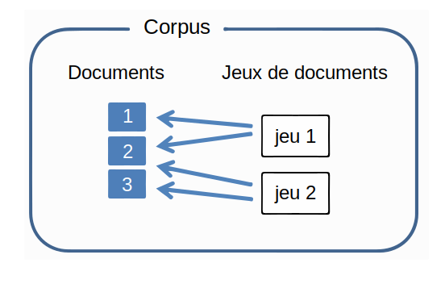
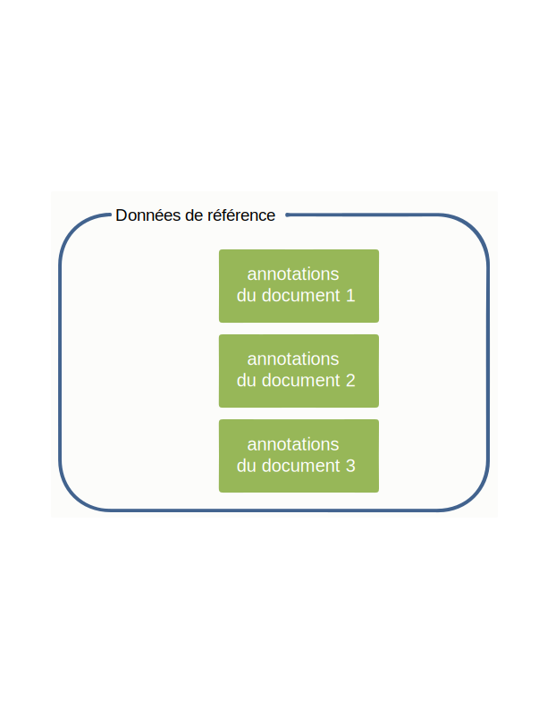
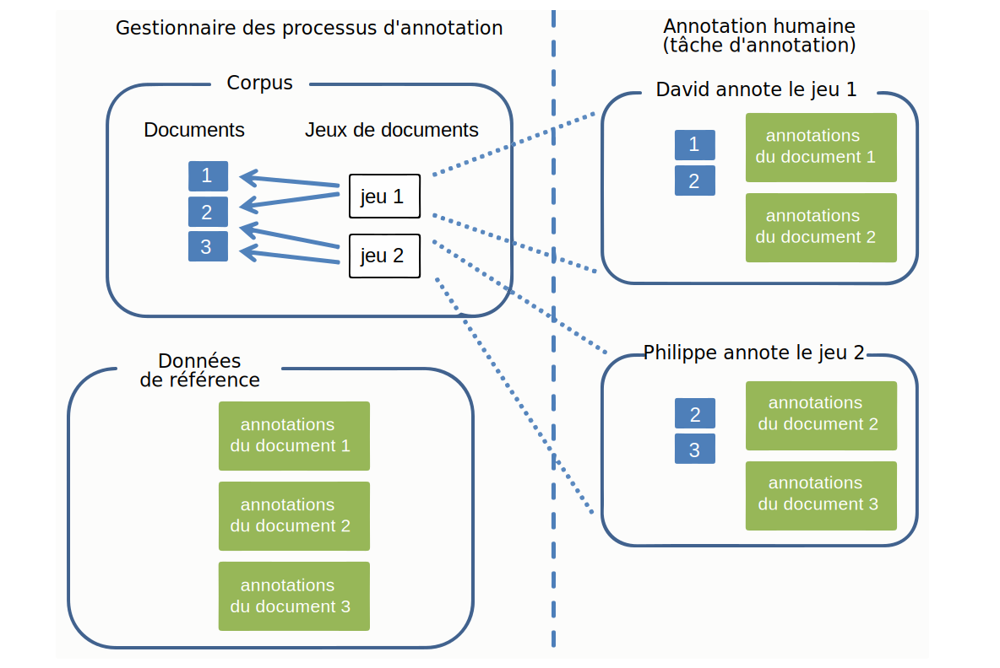

---

copyright:
  years: 2015, 2018
lastupdated: "2018-04-04"

---

{:shortdesc: .shortdesc}
{:new_window: target="_blank"}
{:tip: .tip}
{:pre: .pre}
{:codeblock: .codeblock}
{:screen: .screen}
{:javascript: .ph data-hd-programlang='javascript'}
{:java: .ph data-hd-programlang='java'}
{:python: .ph data-hd-programlang='python'}
{:swift: .ph data-hd-programlang='swift'}

Cette documentation concerne {{site.data.keyword.knowledgestudiofull}} on {{site.data.keyword.cloud}}. Pour consulter la documentation de la version précédente de {{site.data.keyword.knowledgestudioshort}} on {{site.data.keyword.IBM_notm}} Marketplace, [cliquez sur ce lien ](https://console.bluemix.net/docs/services/knowledge-studio/documents-for-annotation.html){: new_window}.
{: tip}

# Ajouter des documents pour l'annotation
{: #documents-for-annotation}

Pour entraîner un modèle d'apprentissage automatique, vous devez ajouter à votre espace de travail des documents qui reflètent des connaissances spécialisées, comme des articles de journaux ou d'autres textes propres au secteur concerné.
{: shortdesc}

## A propos de cette tâche

Pour définir les règles d'un modèle à base de règles, vous devez ajouter ou transférer des documents d'où vous pourrez tirer les motifs à définir en tant que règles.
Pour plus d'informations, consultez [Ajouter des documents pour définir des règles](/docs/services/watson-knowledge-studio/rule-annotator-add-doc.html).
Cette section décrit seulement comment ajouter des documents pour l'annotation.

## Documents
{: #wks_sampledoc}

Pour entraîner un modèle d'apprentissage automatique, vous devez rassembler des documents représentatifs des contenus relatifs à votre domaine et d'une grande valeur pour votre application.

Efforcez-vous de trouver des documents d'entraînement qui soient vraiment représentatifs du contenu présentant un intérêt dans le domaine concerné, c'est-à-dire qui contiennent de nombreuses mentions pertinentes qu'il est donc utile d'annoter.
Pour choisir les meilleurs documents, suivez ces quelques consignes :

- Efforcez-vous de fournir un ensemble de documents dont la taille totale est d'environ 300 000 mots. Prévoyez davantage de mots pour un système de types complexe, moins pour un système simple. 
- Limitez chaque document à une page ou deux de contenu (moins de 2000 mots, l'idéal étant un volume proche de de 1000 mots par document). Au début de l'élaboration du modèle, il est également conseillé de limiter chaque document à quelques paragraphes. Marquer les mentions et les relations dans un long document est à la portée de l'annotateur humain, mais celui-ci aura certainement plus de difficultés à marquer les coréférences s'étalant sur plusieurs pages. 
- Assurez-vous que les données dans les documents sont réparties entre tous les types d'entités, sous-types et rôles, ainsi qu'entre les relations entre eux. A terme, l'objectif à atteindre est d'avoir au moins 50 annotations pour chaque type d'entité et 50 pour chaque type de relation dans la collection de documents. 
- Encore une fois, les documents doivent représenter l'étendue du sujet que l'application couvrira, mais en cas d'asymétrie dans la fréquence d'occurrence des types d'entités et des types de relations, essayez d'obtenir au moins 50 exemplaires de chaque type, voire davantage pour les types d'entités dont les mentions ont tendance à être des syntagmes. 
- Le jeu que vous créez pour l'entraînement doit contenir au moins 10 documents annotés. 

Lorsque vous êtes prêt à créer et entraîner le modèle, les documents que vous ajoutez à l'espace de travail
peuvent être divisés en jeux à utiliser comme données d'apprentissage, données de test et
données aveugles.
Cette séparation en plusieurs jeux de données est essentielle à l'évaluation des performances du modèle.

Vous pouvez ajouter des documents de différentes manières et dans différents formats : 

- Fichier CSV à deux colonnes, au format UTF-8
- Fichiers texte au format UTF-8
- Fichier ZIP contenant des documents précédemment téléchargés d'un espace de travail {{site.data.keyword.knowledgestudioshort}}
- Fichier ZIP contenant des fichiers XMI au format UIMA CAS 

### Fichiers CSV
{: #wks_sampledoc__wks_samplecsv}

A partir de votre machine locale, vous pouvez
transférer un fichier CSV à deux colonnes contenant des échantillons de textes.
Vous ne devez transférer qu'un seul fichier CSV à la fois.
La première colonne contiendra le nom de fichier du document,
la deuxième contiendra le texte du document.
Pour un aperçu du format nécessaire, consultez le fichier <a href="https://watson-developer-cloud.github.io/doc-tutorial-downloads/knowledge-studio/documents-new.csv" download>`documents-new.csv`</a>, qui fait partie des exemples de fichiers des tutoriels.

### Documents d'un autre espace de travail Watson Knowledge Studio
{: #wks_sampledoc__wks_samplecorpus}

Si vous avez précédemment téléchargé des documents d'un espace de travail {{site.data.keyword.knowledgestudioshort}}, vous pouvez transférer le fichier `ZIP` qui a servi à ce téléchargement.
Une option vous permet de préciser si vous voulez inclure ou non les annotations de référence dans les fichiers importés.

Une fois annotés, les documents sont stockés au format de fichier `JSON`.
Dans ces fichiers, le langage de marquage reflète la manière dont le texte du document d'origine a été
analysé et découpé en unités lexicales et inclut des éléments pour toutes les annotations qui ont été
ajoutées par l'annotateur humain.
Pour améliorer l'exactitude du modèle au fil du temps, vous pouvez transférer ces fichiers vers un autre espace de travail et préserver ainsi
toutes les annotations existantes.
Un annotateur humain peut alors réviser, supprimer et compléter les annotations dans ces documents. Vous
pouvez aussi faire l'impasse sur l'annotation humaine et utiliser ces fichiers pour
créer les jeux de données d'entraînement, de test et aveugles qui serviront à évaluer et améliorer les performances
du modèle.

### Fichiers XMI au format UIMA CAS
{: #wks_sampledoc__samplexmi}

Pour aider à entraîner un modèle, vous pouvez transférer des documents qui ont été pré-annotés par un
moteur d'analyse UIMA (Unstructured Information Management Architecture).
Les documents ainsi pré-annotés doivent être dans la forme de sérialisation XMI de la structure CAS (Common Analysis Structure) UIMA
et combinés dans un fichier ZIP.
Vous pouvez, par exemple, transférer des documents qui ont été annotés dans une collection {{site.data.keyword.IBM_notm}} {{site.data.keyword.watson}} Explorer.

Un annotateur humain peut alors réviser, supprimer et compléter les annotations dans ces documents. Vous
pouvez aussi faire l'impasse sur l'annotation humaine et utiliser ces fichiers pour
créer les jeux de données d'entraînement, de test et aveugles qui serviront à évaluer et améliorer les performances
du modèle.
Pour des détails sur la façon de créer ces fichiers et les conditions qu'ils doivent remplir pour pouvoir être transférés, consultez [Transférer des documents pré-annotés](/docs/services/watson-knowledge-studio/preannotation.html#wks_uima).

### Anonymiser les données

Si vous voulez construire un modèle qui soit optimisé pour vos données et que, pour des raisons de confidentialités,
il n'est pas souhaitable que vos documents soient transférés en l'état vers {{site.data.keyword.knowledgestudioshort}},
vous pouvez y supprimer toutes les données personnelles, puis utiliser la version anonymisée des documents
pour entraîner le modèle.
Vous ne devez pas expurger l'information ni la remplacer par des variables.
Les meilleurs résultats sont obtenus lorsque les vraies informations sont remplacées par de fausses informations du même type.

Par exemple, si vous voulez occulter les noms de clients, au lieu de les expurger un à un ou de les remplacer
par une variable telle que *USER_NAME*, remplacez-les par des noms fictifs, utilisant une
variété de styles syntaxiques de noms typiques, tels que *Jeanne Martin*, *M. Dupont*,
*Me Dietrich* ou *Dr Moreau*.
Vous pouvez écrire un script créant des concaténations d'une variété de prénoms et de noms de famille ainsi que de titres et de noms
de famille et ajoutant des patronymes seuls pour créer des noms imaginaires qui puissent être
insérés dans le document afin de remplacer les vrais noms d'utilisateurs.
Le but est de simuler le plus fidèlement possible les vraies valeurs figurant dans les documents source.
Car si chaque nom est remplacé par le même texte (USER_NAME) ou expurgé, le modèle ne sera pas entraîné correctement
et finira par s'habituer à rencontrer ce schéma à chaque occurrence d'un nom.
Ce que vous voulez, c'est qu'il soit capable de reconnaître comme tels les noms de personnes,
lorsqu'il sera exécuté sur de nouveaux documents et rencontrera une variété de noms
qu'il n'a encore jamais vus.

## Ajouter des documents à un espace de travail
{: #wks_projadd}

Pour entraîner un modèle, vous devez ajouter à
votre espace de travail des exemples de documents
représentatifs des contenus relatifs à votre domaine.

### A propos de cette tâche

Il est bon de commencer par une collection de documents relativement petite.
Utilisez-la pour entraîner les annotateurs humains (si votre espace de travail met en jeu un processus d'annotation humaine) et
pour peaufiner vos directives d'annotation.
Il est plus facile pour un annotateur humain d'identifier les chaînes de coréférences dans les petits documents.
A mesure que l'exactitude des annotations s'améliore, vous pouvez ajouter davantage de documents au corpus afin de donner plus
de relief à l'effort d'entraînement.

### Procédure

Pour ajouter des documents à un espace de travail :

1. Connectez-vous en tant qu'administrateur ou chef de projet {{site.data.keyword.knowledgestudioshort}} et sélectionnez votre espace de travail. 
1. Sélectionnez l'onglet **Actifs & Outils** > **Documents** > **Jeux de documents**. 
1. Cliquez sur **Transférer des jeux de documents** pour ajouter des documents au corpus.
1. Transférez les documents dans l'un des formats suivants. Vous ne devez transférer qu'un seul type de fichier à la fois. 

    <table border="1" frame="hsides" rules="rows" cellpadding="4" cellspacing="0" summary="Chaque ligne du tableau décrit une option." class="simpletable choicetable choicetableborder">
      <thead><tr><th id="d31095e284-option" valign="bottom" align="left" class="ncol thleft thbot">Option</th>
          <th id="d31095e284-desc" valign="bottom" align="left" class="ncol thleft thbot">Description</th></tr></thead>
      <tbody><tr class="strow chrow"><td valign="top" headers="d31095e284-option" id="d31095e286" class="stentry choption ncol">
<strong>Fichier CSV</strong>
</td>
          <td valign="top" headers="d31095e284-desc d31095e286" class="stentry chdesc ncol">
Choisissez (en le faisant glisser ou en le sélectionnant sur votre
              système local) un unique fichier CSV contenant vos échantillons de documents, puis cliquez sur <b>Transférer</b>. La première colonne contiendra
              le nom de fichier du document, la deuxième contiendra le texte du document.
              Le fichier CSV doit être au format UTF-8. 
</td>
        </tr>
        <tr class="strow chrow"><td valign="top" headers="d31095e284-option" id="d31095e294" class="stentry choption ncol">
<strong>Fichiers texte</strong>
</td>
          <td valign="top" headers="d31095e284-desc d31095e294" class="stentry chdesc ncol">
Choisissez (en les faisant glisser ou en les sélectionnant sur votre système local) un ou plusieurs fichiers texte, puis cliquez sur <b>Transférer</b>. Les fichiers texte doivent être au format UTF-8. 
</td>
        </tr>
        <tr class="strow chrow"><td valign="top" headers="d31095e284-option" id="d31095e302" class="stentry choption ncol">
<strong>Fichiers DOCXML</strong>
</td>
          <td valign="top" headers="d31095e284-desc d31095e302" class="stentry chdesc ncol">
Choisissez (en les faisant glisser ou en les sélectionnant sur votre
système local) un ou plusieurs fichiers <code>DOCXML</code>, puis cliquez sur <b>Transférer</b>.
Les fichiers <code>DOCXML</code> doivent être des documents ayant été téléchargés d'un autre modèle d'apprentissage automatique.
Ils doivent être au format UTF-8.
Ils sont transférés tels quels, sans être réanalysés ni redécoupés en unités lexicales.

</td>
        </tr>
        <tr class="strow chrow"><td valign="top" headers="d31095e284-option" id="d31095e316" class="stentry choption ncol">
<strong>Fichier ZIP</strong>
</td>
          <td valign="top" headers="d31095e284-desc d31095e316" class="stentry chdesc ncol">
Si vous avez précédemment téléchargé des documents d'un espace de travail
Watson Knowledge Studio, choisissez le fichier <code>ZIP</code> qui les contient (en le faisant glisser ou en le sélectionnant sur votre système local).
Si vous voulez inclure les annotations qui ont été ajoutées aux documents avant qu'ils ne soient téléchargés,
veillez à sélectionner l'option d'inclusion des données de référence avant de cliquer sur <b>Transférer</b>.
Seules seront importées (transférées) les annotations ayant été promues au rang de données de référence avant que les documents ne soient téléchargés.

<b>Restriction :</b> Lorsque les documents annotés sont importés, ils
sont réanalysés et redécoupés en unités lexicales.
Cela peut changer ce que Watson Knowledge Studio considère comme étant les limites des phrases dans ces documents.
Comme les annotations sont définies phrase par phrase, certaines d'entre elles pourraient être invalidées au cours
de ce processus.
Après avoir transféré des documents originaires d'un autre espace de travail, faites un
examen rapide des annotations pour remédier à toute divergence.

            
Avant de transférer des annotations de référence, vous devez transférer le système de types
de l'espace de travail d'origine dans l'espace de travail en cours.
Pour les détails, consultez [Transférer des ressources d'un autre espace de travail ](exportimport.html){: new_window}.

            
Si vous avez précédemment téléchargé des documents annotés,
contenus dans des fichiers XMI au format UIMA CAS, vous pouvez transférer le fichier
<code>ZIP</code> qui a servi à ce téléchargement.
Pensez, dans ce cas, à indiquer qu'il s'agit du type de contenu à transférer avant de cliquer sur <b>Transférer</b>.
Pour des détails sur la façon de créer ces fichiers et les conditions qu'ils doivent remplir pour
pouvoir être transférés, consultez
[Transférer des documents pré-annotés ](preannotation.html#wks_uima){: new_window}. 

          </td>
        </tr>
      </tbody>
    </table>

1. Lorsque les documents ont été ajoutés, cliquez sur leurs noms pour prévisualiser et vérifier leur contenu. Par exemple, vérifiez que les fichiers texte sont au format UTF-8 et exempts de problèmes d'accents ou de normalisation des caractères. Vérifiez également la qualité de segmentation du texte en phrases. Si vous relevez des défauts, il se pourrait que vous deviez prétraiter les fichiers avant de les ajouter au corpus. Ils doivent en effet être aussi propres et bien formatés que possible avant de passer entre les mains des annotateurs humains. 

### Que faire ensuite

Divisez le corpus en plusieurs jeux de documents et affectez ces derniers à des annotateurs humains.

## Créer et affecter des jeux d'annotations
{: #wks_projdocsets}

Une fois les documents ajoutés, divisez-les en jeux pour qu'ils puissent être annotés par plusieurs annotateurs humains.
Pour obtenir des scores de convergence entre annotateurs, vous devez leur affecter au moins deux annotateurs humains et
spécifier quel pourcentage de documents se chevauchent entre les jeux.

### Avant de commencer

- Vous devez transférer les jeux de documents avant de pouvoir les diviser en jeux d'annotations.
- Vous devez créer un compte d'utilisateur dans {{site.data.keyword.knowledgestudioshort}} pour chaque annotateur humain qui travaillera sur des documents de cet espace de travail. 

### A propos de cette tâche

> **Attention :** Si vous utilisez
Google Chrome, vous ne pouvez pas transférer un grand nombre de fichiers (par exemple, plus de 300)
en les sélectionnant dans un dossier.
Utilisez Firefox (qui n'a pas cette limite) ou sélectionnez un plus petit nombre de fichiers et faites alors plusieurs transferts.

Vous pouvez créer un maximum de 1 000 jeux d'annotations par espace de travail.

### Procédure

Pour créer un jeu d'annotations :

1. Connectez-vous en tant qu'administrateur ou chef de projet {{site.data.keyword.knowledgestudioshort}} et sélectionnez votre espace de travail. 
1. Sélectionnez l'onglet **Actifs & Outils** > **Documents** > **Jeux d'annotations**. 
1. Cliquez sur **Créer des jeux d'annotations**.

    1. Pour le jeu de base, sélectionnez la collection de documents que vous voulez diviser en jeux d'annotations. Il peut s'agir de tous les documents du corpus ou seulement de ceux qui ont été précédemment alloués à un jeu de documents. 

    1. Pour la valeur de chevauchement, spécifiez le pourcentage de documents que vous voulez inclure dans chaque jeu d'annotations. Les scores de convergence entre annotateurs ne peuvent être calculés qu'à partir du moment où au moins deux annotateurs humains annotent les mêmes documents. Par exemple, si vous spécifiez une valeur de chevauchement de 20 % pour un corpus de 30 documents et que vous divisez celui-ci en trois jeux de documents, 6 documents (soit 20 %) seront annotés par tous les annotateurs humains. Les 24 documents restants seront répartis entre les trois annotateurs humains (8 chacun). Chaque annotateur recevra donc 14 documents à annoter (6 + 8). 

    > **Remarque :** Un jeu d'annotations que vous prévoyez d'utiliser pour entraîner un modèle d'apprentissage automatique doit contenir au moins 10 documents annotés. 

    1. Sélectionnez un nom d'utilisateur dans la liste des annotateurs humains. 

        > **Remarque :** Si vous avez un abonnement à un plan gratuit, associez-vous au jeu d'annotations. Ce plan ne vous autorise pas à ajouter d'autres utilisateurs ni à leur attribuer le rôle d'annotateur humain. Mais en vous ajoutant vous-même, vous pouvez tenir le rôle d'annotateur humain et tester comment un véritable annotateur humain interagirait avec l'éditeur de données de référence pour annoter des documents. 

    1. Donnez un nom au jeu d'annotations. 

        Vous pouvez choisir, pour le jeu d'annotations, un nom qui identifie l'annotateur humain auquel il sera confié. Cela vous permettra d'évaluer le travail de cet annotateur au fil des progrès réalisés dans l'espace de travail. Vous ne pouvez pas changer le nom d'un jeu d'annotations une fois celui-ci créé. 

1. Après avoir affecté tous les annotateurs humains qui travailleront dans cet espace, cliquez sur **Générer** pour créer les jeux d'annotations. Lorsqu'ils se connecteront à l'éditeur de données de référence, les annotateurs humains ne verront que les jeux d'annotations qui leur sont attribués. 

**Tâches connexes** :

[Constituer une équipe](/docs/services/watson-knowledge-studio/team.html)

## Supprimer des documents
{: #wks_projdelete}

Vous pouvez retirer un document si vous déterminez qu'il n'est pas représentatif de textes du domaine concerné susceptibles de profiter au modèle. 

### Procédure

Pour supprimer un document, effectuez les étapes suivantes : 

1. Connectez-vous en tant qu'administrateur {{site.data.keyword.knowledgestudioshort}} et sélectionnez votre espace de travail. 
1. Sélectionnez l'onglet **Actifs & Outils** > **Documents** > **Jeux de documents**. 
1. Localisez le document que vous voulez retirer et cliquez sur **Supprimer**.
1. Vous ne pouvez pas supprimer un document faisant partie d'un jeu d'annotations qui a été associé à une tâche d'annotation. S'il fait partie d'un jeu d'annotations qui n'a pas encore été associé à une tâche, vous pouvez le supprimer en suivant les étapes ci-dessus. 

    Effectuez l'une des opérations suivantes si le document est associé à une tâche d'annotation :
    - Si les annotateurs humains n'ont pas commencé à annoter les documents, supprimez la tâche d'annotation, puis supprimez le document. Pour supprimer la tâche d'annotation, ouvrez l'onglet **Actifs & Outils** > **Documents** > **Tâches**, localisez la tâche d'annotation à laquelle le document est associé, cliquez sur son icône **Afficher le menu**, puis cliquez sur **Supprimer**. Vous pouvez ensuite recréer la tâche d'annotation et lui associer le même jeu d'annotations, qui contient maintenant un document de moins. 
    - Si les annotateurs humains ont commencé à annoter les documents, ne supprimez pas la tâche, sous peine de perdre leur travail. Vous pouvez leur dire de continuer à travailler, mais d'ignorer le document non voulu dans le jeu. Laissez-les terminer l'annotation du jeu de documents et ajouter celui-ci aux données de référence. Le document doit être supprimé du jeu avant toute exécution du modèle d'apprentissage automatique. En effet, un document non annoté ne doit pas servir à entraîner un modèle d'apprentissage automatique, car celui-ci apprend autant de ce qui est annoté que de ce qui ne l'est pas. Vous pouvez maintenant supprimer le document non désiré, qui fait actuellement partie des données de référence, à partir de l'onglet **Actifs & Outils** > **Documents** > **Jeux de documents**. 

## Modèle de données
{: #wks_datamodel}

Les diagrammes ci-après synthétisent le cheminement des documents
dans un système {{site.data.keyword.knowledgestudioshort}} et ce qui diffère
entre les documents du corpus, ceux d'une tâche d'annotation et ceux des données de référence.

Le corpus contient des documents divisés en plusieurs jeux de documents : 

- Un document n'est rien d'autre que des chaînes de texte. 
- Un jeu de documents est un pointeur vers un groupe de documents. Il ne contient pas de copies des documents eux-mêmes. 
- Certains jeux de documents peuvent pointer vers un unique document. Ce type de configuration se contrôle au moyen du paramètre de chevauchement que vous spécifiez au moment de créer les jeux d'annotations.

 Figure 1. Cette figure illustre deux jeux de documents pointant vers trois documents. Les documents se divisent entre les jeux.

Les données de référence comprennent les annotations (mentions, relations et mentions coréférencées) qui sont
ajoutées aux documents.
Elles sont particulières à chaque document.

 Figure 2. Cette figure montre que les données de référence sont constituées des annotations ajoutées au document 1, au document 2, au document 3, et ainsi de suite.

Lorsque vous créez une tâche d'annotation, des copies des annotations sont créées pour chaque document membre du jeu d'annotations que vous
ajoutez à la tâche.
Les annotateurs annotent les documents.
Les annotations sont isolées les unes des autres ainsi que des annotations de référence.
Une tâche d'annotation est temporaire. Son rôle est de permettre aux annotateurs humains d'annoter du texte dans des espaces isolés.
Par opposition, les données de référence sont permanentes et singulières.

 Figure 2. Cette figure montre que le chef de projet crée des jeux d'annotations et les associe à une tâche d'annotation. David et Philippe, les annotateurs humains, annotent les documents des jeux qui leur sont affectés. 

Une fois que le chef de projet a approuvé les jeux d'annotations d'une tâche d'annotation, les annotations des
documents qui ne figurent pas également dans les autres jeux d'annotations (absence de chevauchements entre documents)
deviennent des annotations de référence.
Lorsque des documents se chevauchent entre jeux d'annotations (cas représenté par le document 2 dans cet exemple),
le chef de projet doit arbitrer et résoudre les éventuels conflits.
Ce n'est qu'une fois approuvées par l'intermédiaire de cet arbitrage que les annotations des documents chevauchants deviennent des
annotations de référence.

Les données de référence sont ensuite utilisées pour entraîner et tester un modèle d'apprentissage automatique.
Elles peuvent sinon servir de base à l'itération suivante de développement du modèle.
Dans ce dernier cas, vous devez créer une nouvelle tâche d'annotation.

Figure 3. Cette figure illustre comment les annotations ajoutées par deux annotateurs humains deviennent des données de référence.
L'un des documents, le document 2, est annoté par les deux annotateurs humains.
Les annotations ajoutées à ce document chevauchant doivent être arbitrées avant d'être
versées aux données de référence.
