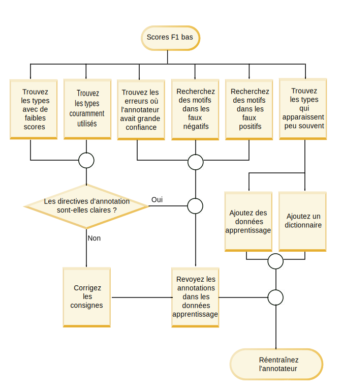
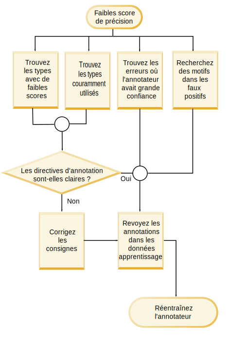

---

copyright:
  years: 2015, 2018
lastupdated: "2018-04-04"

---

{:shortdesc: .shortdesc}
{:new_window: target="_blank"}
{:tip: .tip}
{:pre: .pre}
{:codeblock: .codeblock}
{:screen: .screen}
{:javascript: .ph data-hd-programlang='javascript'}
{:java: .ph data-hd-programlang='java'}
{:python: .ph data-hd-programlang='python'}
{:swift: .ph data-hd-programlang='swift'}

Cette documentation concerne
{{site.data.keyword.knowledgestudiofull}} on {{site.data.keyword.cloud}}.
Pour consulter la documentation de la version précédente de {{site.data.keyword.knowledgestudioshort}} on {{site.data.keyword.IBM_notm}} Marketplace,
[cliquez sur
ce lien ](https://console.bluemix.net/docs/services/knowledge-studio/evaluate-ml.html){: new_window}.
{: tip}

# Analyser les performances du modèle d'apprentissage automatique
{: #evaluate-ml}

Passez en revue les annotations qui ont été ajoutées par le modèle entraîné afin de déterminer si des
ajustements doivent être effectués dans le modèle pour améliorer sa capacité à trouver
des mentions d'entités, des mentions de relations et des coréférences dans les documents.
{: shortdesc}

## A propos de cette tâche

Vous pouvez analyser les performances en consultant une synthèse de statistiques
relatives aux types d'entités, types de relations et mentions coréférencées.
Vous pouvez aussi analyser les statistiques présentées dans une *matrice de confusion*.
Celle-ci vous aide à comparer les annotations ajoutées par le modèle d'apprentissage automatique aux annotations des données de référence.

Les statistiques du modèle comprennent les métriques suivantes :

- **Score F1**

    Mesure qui considère à la fois la précision et le rappel
pour calculer un score.
Le score F1 peut être interprété comme une moyenne pondérée des valeurs de précision et de rappel. Il atteint sa meilleure valeur à 1 et sa pire valeur à 0.
Consultez [Analyser les faibles scores F1](/docs/services/watson-knowledge-studio/evaluate-ml.html#evaluate-mllowf1).

- **Précision**

    Mesure spécifiant quelle proportion de la sortie produite par le modèle d'apprentissage automatique était exacte comparée à ce qu'ont produit
les annotateurs humains.
Le précision est le rapport du nombre d'annotations correctement étiquetées sur le nombre total d'annotations ajoutées par le
modèle d'apprentissage automatique.
Un score de précision de 1,0 pour le type d'entité A signifie que chaque mention ayant été étiquetée comme type d'entité A appartient bien à cette
classification.
Un faible score de précision aide à identifier les endroits où le modèle d'apprentissage automatique a créé des
annotations incorrectes.
Le score ne fournit aucune indication quant au nombre des autres mentions qui ont échappé au modèle d'apprentissage automatique alors
qu'elles ont été étiquetées comme type d'entité A par l'annotateur humain ; c'est le score de rappel qui reflète cette donnée.
Consultez [Analyser les faibles scores de précision](/docs/services/watson-knowledge-studio/evaluate-ml.html#evaluate-mllowp).

- **Rappel**

    Mesure spécifiant combien de mentions qui auraient dû être annotées avec une étiquette donnée ont effectivement
été annotées avec cette étiquette, les *bonnes* mentions étant celles que les annotateurs humains ont identifiées
dans les mêmes documents.
Le rappel est le rapport du nombre d'annotations correctement étiquetées sur le nombre d'annotations qui auraient dû être créées.
Un score de rappel de 1,0 signifie que chaque mention qui aurait dû être étiquetée comme type d'entité A a bien été étiquetée comme
telle.
Un faible score de rappel aide à identifier les endroits où le modèle d'apprentissage automatique n'a pas créé une
annotation qu'il aurait dû créer.
Le score ne fournit aucune indication quant au nombre des autres mentions qui ont également été étiquetées comme type d'entité A alors qu'elles n'auraient pas dû l'être ;
c'est le score de précision qui reflète cette donnée.
Consultez [Analyser les faibles scores de rappel](/docs/services/watson-knowledge-studio/evaluate-ml.html#evaluate-mllowr).

- **Pourcentage du nombre total d'annotations**

    Mesure des données de référence qui montre combien de mots ont été annotés avec
un type d'entité ou un type de relation donné, par rapport au nombre total de mots qui ont été
annotés comme type d'entité (tous types confondus) ou comme type de relation (tous types confondus)
dans le jeu de documents de test.
Cette statistique n'est pas disponible pour les mentions coréférencées.
Cette valeur peut vous aider à voir comment les mentions prévalentes d'un type sont comparées aux autres types dans vos données de référence.

- **Pourcentage de densité du corpus (d'après le nombre de mots)**

    Mesure des données de référence qui montre combien de mots ont été annotés avec
un type d'entité ou un type de relation donné, par rapport au nombre total de mots, annotés ou non.
Cette statistique n'est pas disponible pour les mentions coréférencées.
Cette valeur peut vous aider à voir comment les mentions prévalentes d'un type sont comparées à tous les autres mots dans les documents de votre domaine.

- **Pourcentage de documents qui contiennent ce type**

    Mesure des données de référence montrant combien de documents contiennent
un type d'entité ou un type de relation donné.
Cette statistique n'est pas disponible pour les mentions coréférencées.
Cette valeur peut vous aider à évaluer si les documents du jeu représentent suffisamment le domaine.
Si le pourcentage est trop bas pour certains types d'entités clés, cela signifie qu'ils
sont sous-représentés. Vous devriez, dans ce cas, ajouter davantage de documents avec des
mentions de ces types.

## Procédure

Pour consulter les statistiques de performances témoignant du niveau d'entraînement du modèle : 

1. Connectez-vous en tant qu'administrateur ou chef de projet
{{site.data.keyword.knowledgestudioshort}} et sélectionnez votre espace de
travail.

1. Sélectionnez **Gestion des modèles** > **Performances**.
1. Pour les mentions, relations ou coréférences, sélectionnez le lien **Statistiques détaillées**.

1. Dans la vue **Récapitulatif**, indiquez si vous souhaitez
évaluer des données de test ou des données d'apprentissage, puis spécifiez le type des annotations pour lesquelles vous souhaitez
obtenir des statistiques : types d'entités, types de relations ou mentions coréférencées.
Notez que l'analyse des données aveugles n'a lieu que très rarement. Vous ne devez pas l'exécuter avant d'être relativement
confiant dans les scores obtenus avec les données de test.
Lorsque vous faites défiler les données, observez que les éléments qui ont de faibles scores sont repérés et mis en évidence pour
indiquer qu'ils doivent être examinés et améliorés.
L'icône d'avertissement en forme de triangle indique que la valeur F1 est inférieure à la valeur fixée, 0,5.

    Par exemple, certains types d'entités peuvent obtenir un bon score F1 parce que le document a été annoté par la pré-annotation ainsi que
par un annotateur humain.
D'autres types d'entités peuvent en revanche obtenir un score plus bas parce que les différences de formulation
et la façon dont les annotateurs humains interprètent le texte ou les directives d'annotation rendent plus difficile pour le modèle d'apprentissage automatique de
reconnaître le motif et d'appliquer l'annotation correcte.

1. Dans la vue **Matrice de confusion** des données de test, indiquez le type des annotations pour lesquelles vous souhaitez
obtenir des statistiques : types d'entités ou types de relations.
Pour chaque type d'entité ou type de relation :

    - Chaque ligne de la matrice présente les données de référence (types d'entités et types de relations ajoutés par un annotateur humain).
    - Chaque colonne de la matrice montre les résultats du décodage (unités lexicales d'annotation ajoutées par le modèle d'apprentissage automatique).
    - Le nombre figurant dans chaque cellule est le nombre d'unités lexicales d'annotation par mention, et non celui des occurrences de la mention. 

        Les unités lexicales sont utilisées pour délimiter les chaînes de texte.
Elles correspondent plus ou moins à des mots.
Une mention peut contenir plusieurs unités lexicales.
Par exemple, *Barack Obama* est une mention qui contient deux unités lexicales.
Dans la ligne ou colonne PERSON, la valeur 2 serait utilisée pour représenter l'unique mention
de *Barack Obama* dans un document.
Le nombre d'unités lexicales ne correspond que vaguement au nombre de mots, car elles sont comptées différemment dans
certains cas.
Par exemple, la ponctuation à la fin d'une phrase compte pour une unité lexicale et les contractions sont souvent étendues en deux unités lexicales.

    - La colonne libellée **O** identifie les
unités lexicales que le modèle d'apprentissage automatique aurait dû annoter en leur associant le type figurant à la ligne
d'intersection (l'annotation humaine), mais qu'il n'a annotées avec aucun type.

    - La valeur **N/A** est affichée lorsqu'il n'y a pas d'annotations pour un
type donné dans les jeux de documents.
Par exemple, si aucune mention du type PERSON n'a été annotée dans les jeux de documents pour les données de référence ou comme données
de test, le score pour le type d'entité PERSON sera N/A (non applicable).

    L'exemple de matrice de confusion suivant montre les résultats d'une exécution d'un modèle d'apprentissage automatique
sur des documents traitant d'accidents de la circulation.

    <table cellpadding="4" cellspacing="0" summary="Exemple de matrice de confusion de rapports d'accidents" border="1" class="simpletable"><tr class="sthead"><th valign="bottom" align="left" id="d15356e164" class="stentry thleft thbot">Types d'entités</th>
        <th valign="bottom" align="left" id="d15356e166" class="stentry thleft thbot">MANUFACTURER</th>
        <th valign="bottom" align="left" id="d15356e168" class="stentry thleft thbot">MODEL</th>
        <th valign="bottom" align="left" id="d15356e170" class="stentry thleft thbot">O</th>
      </tr>
      <tr class="strow"><td valign="top" headers="d15356e164" class="stentry">
MANUFACTURER
</td>
        <td valign="top" headers="d15356e166" class="stentry">
515
</td>
        <td valign="top" headers="d15356e168" class="stentry">
5
</td>
        <td valign="top" headers="d15356e170" class="stentry">
44
</td>
      </tr>
    </table>
    {: #evaluate-ml__datasimpletable_yms_hff_cw}

    Voici ce que vous pouvez apprendre de cette matrice :

    - Le modèle a correctement reconnu 515 unités lexicales comme mentions
du type d'entité MANUFACTURER (qui représente ici un constructeur automobile).

    - Le modèle a étiqueté à tort 5 unités lexicales en tant que mentions du type MODEL (qui représente ici un modèle de la marque du constructeur)
qui auraient dû être étiquetées comme types MANUFACTURER.
    - 44 unités lexicales comprises dans des mentions du type MANUFACTURER n'ont été annotées avec aucun type d'entité par le modèle.

    Lorsque vous évaluez les performances du modèle et examinez les résultats du décodage,
vous pouvez commencer à étudier de plus près les unités lexicales qui ont été mal étiquetées ou qui ont
complètement échappé au modèle.

## Aide-mémoire pour l'amélioration des performances
{: #evaluate-ml_cheat}

Utilisez cet aide-mémoire pour déterminer rapidement les mesures que vous pouvez prendre en vue d'améliorer
les performances du modèle d'apprentissage automatique.

Il est difficile de dicter des règles d'amélioration des scores de performances qui
s'appliqueraient à tous les domaines, car le résultat est influencé par la complexité du
système de types, l'adéquation des documents d'entraînement, les compétences de
l'annotateur humain et d'autres facteurs.
Le tableau suivant peut cependant vous aider à faire une première évaluation et à prendre
des mesures pour améliorer les performances du modèle, surtout au tout début de son
développement et à l'issue de ses premiers tests.

Le tableau suivant suggère les remèdes aux problèmes de performances d'un modèle d'apprentissage automatique
les plus courants.

<table cellpadding="4" cellspacing="0" summary="Tableau dressant la liste des problèmes courants dans la première colonne, avec les remèdes
suggérés sur la première ligne (en-têtes). Chaque croix à l'intersection d'une ligne et d'une colonne indique que le remède s'applique
à ce problème." border="1" class="simpletable"><tr class="sthead"><th valign="bottom" align="left" id="d15356e221" class="stentry thleft thbot">Problème</th>
<th valign="bottom" align="left" id="d15356e223" class="stentry thleft thbot">Ajouter des dictionnaires</th>
<th valign="bottom" align="left" id="d15356e225" class="stentry thleft thbot">Editer les jeux de documents</th>
<th valign="bottom" align="left" id="d15356e227" class="stentry thleft thbot">Ajouter des documents spécifiques aux types concernés</th>
<th valign="bottom" align="left" id="d15356e229" class="stentry thleft thbot">Annoter davantage le corpus</th>
<th valign="bottom" align="left" id="d15356e231" class="stentry thleft thbot">Corriger les annotations humaines</th>
<th valign="bottom" align="left" id="d15356e233" class="stentry thleft thbot">Améliorer les consignes données aux annotateurs humains</th>
<th valign="bottom" align="left" id="d15356e235" class="stentry thleft thbot">Mettre à jour le système de types</th>
<th valign="bottom" align="left" id="d15356e237" class="stentry thleft thbot">Investiguer davantage</th>
</tr>
<tr class="strow"><td valign="top" headers="d15356e221" class="stentry">
Faible F1
</td>
<td valign="top" headers="d15356e223" class="stentry">
X
</td>
<td valign="top" headers="d15356e225" class="stentry">
X
</td>
<td valign="top" headers="d15356e227" class="stentry">
X
</td>
<td valign="top" headers="d15356e229" class="stentry">
X
</td>
<td valign="top" headers="d15356e231" class="stentry">
X
</td>
<td valign="top" headers="d15356e233" class="stentry">
X
</td>
<td valign="top" headers="d15356e235" class="stentry">
X
</td>
<td valign="top" headers="d15356e237" class="stentry">
X
</td>
</tr>
<tr class="strow"><td valign="top" headers="d15356e221" class="stentry">
Faible précision
</td>
<td valign="top" headers="d15356e223" class="stentry">

</td>
<td valign="top" headers="d15356e225" class="stentry">

</td>
<td valign="top" headers="d15356e227" class="stentry">

</td>
<td valign="top" headers="d15356e229" class="stentry">
X
</td>
<td valign="top" headers="d15356e231" class="stentry">
X
</td>
<td valign="top" headers="d15356e233" class="stentry">
X
</td>
<td valign="top" headers="d15356e235" class="stentry">
X
</td>
<td valign="top" headers="d15356e237" class="stentry">
X
</td>
</tr>
<tr class="strow"><td valign="top" headers="d15356e221" class="stentry">
Faible rappel
</td>
<td valign="top" headers="d15356e223" class="stentry">
X
</td>
<td valign="top" headers="d15356e225" class="stentry">
X
</td>
<td valign="top" headers="d15356e227" class="stentry">
X
</td>
<td valign="top" headers="d15356e229" class="stentry">
X
</td>
<td valign="top" headers="d15356e231" class="stentry">

</td>
<td valign="top" headers="d15356e233" class="stentry">

</td>
<td valign="top" headers="d15356e235" class="stentry">

</td>
<td valign="top" headers="d15356e237" class="stentry">

</td>
</tr>
<tr class="strow"><td valign="top" headers="d15356e221" class="stentry">
Faible % d'annotations
</td>
<td valign="top" headers="d15356e223" class="stentry">

</td>
<td valign="top" headers="d15356e225" class="stentry">
X
</td>
<td valign="top" headers="d15356e227" class="stentry">
X
</td>
<td valign="top" headers="d15356e229" class="stentry">
X
</td>
<td valign="top" headers="d15356e231" class="stentry">

</td>
<td valign="top" headers="d15356e233" class="stentry">

</td>
<td valign="top" headers="d15356e235" class="stentry">

</td>
<td valign="top" headers="d15356e237" class="stentry">

</td>
</tr>
<tr class="strow"><td valign="top" headers="d15356e221" class="stentry">
Faible densité
</td>
<td valign="top" headers="d15356e223" class="stentry">

</td>
<td valign="top" headers="d15356e225" class="stentry">
X
</td>
<td valign="top" headers="d15356e227" class="stentry">
X
</td>
<td valign="top" headers="d15356e229" class="stentry">
X
</td>
<td valign="top" headers="d15356e231" class="stentry">

</td>
<td valign="top" headers="d15356e233" class="stentry">

</td>
<td valign="top" headers="d15356e235" class="stentry">

</td>
<td valign="top" headers="d15356e237" class="stentry">

</td>
</tr>
<tr class="strow"><td valign="top" headers="d15356e221" class="stentry">
Peu de documents avec ce type
</td>
<td valign="top" headers="d15356e223" class="stentry">

</td>
<td valign="top" headers="d15356e225" class="stentry">

</td>
<td valign="top" headers="d15356e227" class="stentry">
X
</td>
<td valign="top" headers="d15356e229" class="stentry">
X
</td>
<td valign="top" headers="d15356e231" class="stentry">

</td>
<td valign="top" headers="d15356e233" class="stentry">

</td>
<td valign="top" headers="d15356e235" class="stentry">
X
</td>
<td valign="top" headers="d15356e237" class="stentry">

</td>
</tr>
<tr class="strow"><td valign="top" headers="d15356e221" class="stentry">
Catégorisation incorrecte
</td>
<td valign="top" headers="d15356e223" class="stentry">
X
</td>
<td valign="top" headers="d15356e225" class="stentry">

</td>
<td valign="top" headers="d15356e227" class="stentry">

</td>
<td valign="top" headers="d15356e229" class="stentry">

</td>
<td valign="top" headers="d15356e231" class="stentry">

</td>
<td valign="top" headers="d15356e233" class="stentry">

</td>
<td valign="top" headers="d15356e235" class="stentry">
X
</td>
<td valign="top" headers="d15356e237" class="stentry">

</td>
</tr>
<tr class="strow"><td valign="top" headers="d15356e221" class="stentry">
Annotations manquées 
</td>
<td valign="top" headers="d15356e223" class="stentry">
X
</td>
<td valign="top" headers="d15356e225" class="stentry">

</td>
<td valign="top" headers="d15356e227" class="stentry">

</td>
<td valign="top" headers="d15356e229" class="stentry">
X
</td>
<td valign="top" headers="d15356e231" class="stentry">

</td>
<td valign="top" headers="d15356e233" class="stentry">

</td>
<td valign="top" headers="d15356e235" class="stentry">

</td>
<td valign="top" headers="d15356e237" class="stentry">

</td>
</tr>
<tr class="strow"><td valign="top" headers="d15356e221" class="stentry">
Ecart entre résultats de test et résultats d'entraînement 
</td>
<td valign="top" headers="d15356e223" class="stentry">

</td>
<td valign="top" headers="d15356e225" class="stentry">
X
</td>
<td valign="top" headers="d15356e227" class="stentry">

</td>
<td valign="top" headers="d15356e229" class="stentry">

</td>
<td valign="top" headers="d15356e231" class="stentry">

</td>
<td valign="top" headers="d15356e233" class="stentry">

</td>
<td valign="top" headers="d15356e235" class="stentry">

</td>
<td valign="top" headers="d15356e237" class="stentry">

</td>
</tr>
<tr class="strow"><td valign="top" headers="d15356e221" class="stentry">
Faible F1 pour le test des données d'apprentissage
</td>
<td valign="top" headers="d15356e223" class="stentry">

</td>
<td valign="top" headers="d15356e225" class="stentry">

</td>
<td valign="top" headers="d15356e227" class="stentry">

</td>
<td valign="top" headers="d15356e229" class="stentry">

</td>
<td valign="top" headers="d15356e231" class="stentry">
X
</td>
<td valign="top" headers="d15356e233" class="stentry">
X
</td>
<td valign="top" headers="d15356e235" class="stentry">

</td>
<td valign="top" headers="d15356e237" class="stentry">
X
</td>
</tr>
</table>

 {: #evaluate-ml_cheat__datasimpletable_nhm_5ym_cw}

### Description des remèdes

- **Ajouter des dictionnaires**

    Un dictionnaire contient des exemples de formes de surface d'un type d'entité donné.
Si les statistiques révèlent que le type concerné est rarement annoté dans les données d'apprentissage, il peut être judicieux d'ajouter un nouveau
dictionnaire ou d'ajouter davantage d'entrées à un dictionnaire existant.
Si vous savez que ce type d'entité est essentiel au domaine et apparaît souvent dans les documents, le fait qu'il ne
soit pas annoté peut indiquer que les formes de surface qui lui sont associées et qui *sont*
présentes dans les données d'apprentissage ne sont pas reconnues par le modèle d'apprentissage automatique.
Fournir davantage d'exemples de formes de surface peut aider à corriger ce problème.

- **Editer les jeux de documents**

Assurez-vous d'avoir suffisamment de données d'apprentissage globales.
Pour apprendre, un modèle d'apprentissage automatique a besoin d'un contenu suffisant.
Essayez de fournir environ 300 000 mots.
(Pour déterminer la quantité fournie, vous pouvez exécuter un outil de comptage de mots sur
vos documents source.)
Si votre jeu d'entraînement est trop petit, ajoutez des documents au corpus.
Il ne suffit pas d'avoir quelques documents mettant en pratique chaque type
d'entité ou de relation important. Il vous faut en réalité beaucoup de documents qui illustrent de
quelle manière ces types sont employés dans la littérature typique du domaine.
  - Assurez-vous que le test et l'entraînement utilisent un assortiment de
documents similaire.
Par exemple, n'utilisez pas les documents d'une source de données comme jeu de données de test et
les documents d'une autre source comme jeu de données d'apprentissage.
Des sources de données différentes pourraient représenter les types d'entités et les types de relations
de manière radicalement différente.
Pour obtenir l'ensemble le plus complet d'exemples d'utilisation dans la littérature du secteur,
mieux vaut utiliser, dans les deux jeux de données, une combinaison de documents tirés de toutes les sources de
données.
Si les scores de performances globales d'une exécution de test diffèrent largement de ceux d'une exécution d'entraînement,
cela peut être dû à des incohérences dans les jeux de données utilisés pour chacune.

  - Des documents mal formatés peuvent vous faire perdre du temps.
Les documents de texte que vous ajoutez au corpus doivent être au format UTF-8.
S'ils étaient au départ dans un autre format et que vous les avez convertis en UTF-8,
il est possible qu'ils comportent des signes diacritiques erronés ou d'autres problèmes de
normalisation des caractères.
Un formatage incorrect peut conduire à une représentation inexacte des unités lexicales.
Si les mots utilisés pour représenter une mention diffèrent d'un document à l'autre,
cela affaiblit l'exemple et impacte négativement l'apprentissage automatique.

- **Ajouter des documents spécifiques aux types concernés**

    Si seul un faible pourcentage de documents contiennent un certain type, c'est peut-être le signe que votre
corpus n'est pas entièrement représentatif.
Le modèle d'apprentissage automatique tire ses enseignements des exemples qui lui sont fournis, et il lui en
faut beaucoup.
Ajouter des documents supplémentaires au corpus peut aider.
Si votre système de types et vos documents sont vraiment représentatifs d'un domaine, vous
vous attendez à ce que des documents choisis au hasard contiennent un sous-ensemble
raisonnable des types.
Même si ce n'est pas vrai dans tous les cas, cette situation est le signe que vous devez investiguer du côté
de votre système de types et de la qualité des documents du corpus.
Peut-être vous faut-il trouver davantage de documents du domaine mettant mieux en pratique les
types sous-représentés.
Si le score de rappel est faible, c'est souvent le signe qu'il faut ajouter davantage de documents.

- **Annoter davantage le corpus**

    Si le modèle d'apprentissage automatique peine à trouver les instances de certains types,
c'est peut-être parce que les données de référence ne contiennent pas suffisamment d'exemples d'utilisation
de ces types.
Les annotateurs humains peuvent parfois être rigoureux et complets dans l'étiquetage des mentions de types d'entités, mais
l'être moins avec l'annotation des types de relations et des coréférences.
Si un type essentiel présente un faible pourcentage de densité du corpus, efforcez-vous de trouver plus
d'annotations de ce type dans les documents source.
Mais à ce stade, si les mentions des entités manquent encore d'exactitude,
ne vous souciez pas trop de l'exactitude des coréférences et des relations.
En effet, les mentions des relations entre entités et les coréférences des entités ne peuvent être exactes que dans la mesure
où les mentions des entités sont elles-mêmes exactes.

- **Corriger les annotations humaines**

    Voyez si vos données d'apprentissage sont annotées de manière cohérente et complète.
Un modèle d'apprentissage automatique apprend de vos annotations de référence.
Par exemple, si une phrase contient le syntagme famille Obama et que vous étiquetez "Obama" comme type
PERSON dans une phrase et "famille Obama" comme type PEOPLE dans une autre phrase,
du fait de ce manque d'homogénéité, le modèle d'apprentissage automatique ne pourra pas apprendre
l'annotation correcte.
De même, si vous étiquetez "Obama" comme type PERSON dans une phrase et
que vous laissez sans étiquette une occurrence de ce même nom dans une autre phrase,
l'effort d'annotation ne sera pas complet et le modèle d'apprentissage automatique sera mal
entraîné.
Ce genre d'étiquetage incohérent ou incomplet est parfois appelé *typage confus*.
Dans la plupart des cas, il suffit de faire examiner un jeu de documents chevauchants par plusieurs
annotateurs humains pour qu'apparaissent des cas de typage confus.
Soyez attentif aux problèmes qui ressortent lors de la résolution des conflits entre documents, car ils peuvent révéler des anomalies plus enracinées
dans le système de types lui-même.
S'il ne semble pas possible d'améliorer encore ou de raffiner le système de types, c'est peut-être que vous
devez mettre à jour les directives d'annotation et inclure des exemples.
Fournissez des illustrations de fautes courantes et de la manière d'annoter correctement les mentions
dans telles ou telles circonstances.

    Un autre indicateur d'incohérence dans les annotations est le cas où la densité du corpus reste
basse alors que vous avez suffisamment d'annotations.
Lorsqu'une mention importante dans la littérature du domaine apparaît souvent
dans les documents d'un même jeu, mais n'y est pas annotée systématiquement avec le même type, cela a une incidence directe sur la densité.

    Si le score de précision est faible, c'est souvent le signe qu'il faut améliorer la cohérence des annotations.
Il faut pour cela revoir les consignes données aux annotateurs humains, mieux entraîner ces derniers
s'assurer qu'ils travaillent ensemble et non isolés les uns des autres.

    Vérifiez le score de convergence entre annotateurs.
C'est un indicateur précieux, car il mesure le degré de convergence des travaux de différents annotateurs sur le même
document.
Non seulement il témoigne de la qualité des documents de référence qui serviront à entraîner le modèle d'apprentissage automatique,
mais il donne aussi une idée de la performance maximum que celui-ci pourra atteindre.
Il est en effet peu probable qu'un modèle entraîné avec ces documents surpasse la meilleure convergence que les humains
puissent atteindre.
Par exemple, si la performance reste à 75 et ne va pas au-delà, examinez le score de convergence entre annotateurs.
S'il est de 80, prenez les mesures nécessaire pour mieux entraîner les annotateurs humains et veillez à ce
que les conflits soient correctement résolus (selon les directives d'annotation) au cours
de l'arbitrage.
Si un désaccord subsiste entre les annotateurs humains sur la manière dont une chose devrait être étiquetée, il est peu probable que
le modèle d'apprentissage automatique appliquera la bonne étiquette.

- **Améliorer les consignes données aux annotateurs humains**

    Il est fondamental que les directives sur l'annotation soient claires et complètes. Ce n'est qu'à cette condition que vous obtiendrez un
système d'annotation harmonieux et réussi.
La tâche des annotateurs humains n'est pas aisée.
Certaines nuances d'affectation des types d'entités et de relations sont parfois difficiles à anticiper et ne se révèlent
que lorsque vous commencez à travailler avec les documents du domaine.
Les directives peuvent constituer un outil de contrôle d'exactitude que les annotateurs humains utilisent pendant leur évaluation des documents.
Elles doivent être vivantes et en constante évolution, en particulier au début du processus d'annotation.
Elles servent aussi à faire remonter l'information, dans la mesure où un annotateur humain peut relever certains points en annotant quelques documents et
vous en faire part afin que vous puissiez incorporer dans les consignes de nouveaux conseils ou pièges à éviter.
Pensez à inclure des exemples des choix difficiles à faire et des résolutions à privilégier.
Le meilleur moyen de déterminer ce que vous devez ajouter aux directives d'annotation est d'étudier attentivement
les conflits entre documents.
De vrais exemples d'annotations sur lesquelles les gens n'étaient pas d'accord, avec
la façon dont ils ont été résolus, peuvent être d'une aide précieuse et permettre
aux annotateurs humains d'attaquer du bon pied l'annotation de nouveaux documents.

- **Mettre à jour le système de types**

    Voici les raisons qui peuvent vous pousser à mettre à jour le système de types :
  - Les documents constituant le jeu de données d'entraînement contiennent des références à des concepts qui, bien qu'importants dans
le domaine, ne sont représentés nulle part dans le système de types.
C'est le signe que vous devez peut-être ajouter des types capturant les concepts ou les relations manquantes.
Ne soyez pas tenté de définir un type pour chaque concept d'un secteur donné ou pour chaque entité apparaissant dans les documents
du domaine. Le système de types doit se limiter aux types les plus fondamentaux.

  - Un type existant est constamment mal utilisé par les annotateurs humains.
Lorsqu'un type est source de confusions fréquentes, voire systématiques, il faut peut-être le renommer ou l'éliminer s'il est redondant.

  - Un type existant n'est jamais utilisés par les annotateurs humains, car il n'y
est jamais fait référence dans les documents.
Si un type a peu de chances d'apparaître dans la littérature du domaine concerné, supprimez-le du système de type.

  - Deux types sont souvent interchangés lorsque les annotateurs humains annotent des documents.
Réfléchissez à la possibilité de regrouper les deux types en un seul qui représenterait fidèlement le concept ou la relation.
Par exemple, si le système de types contient à la fois PERSON et PEOPLE, qui s'utilisent souvent de façon
interchangeabe, il est peut-être judicieux d'utiliser à la place un seul type nommé PERSONPEOPLE couvrant les deux cas (une personne seule et un groupe de personnes).

    > **Attention :** Soyez prudent lorsque vous
modifiez le système de types.
Si vous le faites alors que l'ancien système a déjà servi à annoter des jeux de documents, les annotateurs humains devront réévaluer
ces documents d'après le système modifié.
Assurez-vous que les changements à apporter sont suffisamment importants pour justifier un tel travail de réévaluation.

- **Investiguer davantage**

    Si votre système de types, vos dictionnaires et vos documents source sont complets et que l'annotation humaine a été correctement
effectuée, mais que le modèle d'apprentissage automatique fonctionne toujours mal,
c'est peut-être que quelque chose a mal tourné dans le processus d'entraînement du modèle.
Par exemple, les tests sur les données d'apprentissage doivent toujours obtenir de
très bons scores globaux (plus de 95 %).

## Analyser les faibles scores F1
{: #evaluate-mllowf1}

Remédiez aux faibles scores F1 afin d'améliorer les performances de votre modèle d'apprentissage automatique.

### Symptômes

Un score F1 atteint sa meilleure valeur à 1 et sa pire valeur à 0. Une valeur trop basse est le signe
d'une mauvaise précision et d'un mauvais rappel.
Le modèle d'apprentissage automatique génère alors des annotations erronées ou n'en génère pas là où il aurait dû en générer.

### Causes

Si les scores F1 sont trop bas, cela peut être pour de nombreuses raisons
différentes qui dépendent du domaine, de la complexité du système de types, de
l'adéquation des documents d'entraînement, des compétences de l'annotateur humain et
d'autres facteurs.

### Résoudre le problème

Améliorez les performances de votre modèle d'apprentissage automatique en effectuant une ou plusieurs des étapes suivantes, puis en
réentraînant le modèle :

1. Identifiez les types qui apparaissent couramment avec une faible exactitude.

    > **Remarque :** Lors de l'analyse des relations, examinez à
la fois le score F1 du type de relation lui-même et le score F1 de chacune des entités
mises en jeu dans la relation.

1. Identifiez les types couramment confondus.
Pour cela, examinez les chiffres qui sont en dehors de la diagonale dans la matrice de confusion.

1. Passer en revue les erreurs dans les situations où le modèle d'apprentissage automatique a une grande confiance.

1. Recherchez des motifs dans les faux négatifs et les faux positifs indiqués par la matrice de confusion.

1. Si certains types apparaissent peu dans les données d'apprentissage, complétez celles-ci de données qui contiennent ces types.

    Vous pouvez déterminer la fréquence d'apparition d'un type en contrôlant ses statistiques : % d'annotations, % de densité du corpus et % de documents.

1. Si certains types ont un faible score F1, vérifiez les directives d'annotation qui s'y appliquent et
assurez-vous qu'elles soient bien claires.

1. Ajoutez un dictionnaire pour les types qui apparaissent peu dans les données d'apprentissage.

 Figure 1. Comment remédier aux scores F1 trop bas

## Analyser les faibles scores de précision
{: #evaluate-mllowp}

Remédiez aux faibles scores de précision afin d'améliorer les performances de votre modèle d'apprentissage automatique.
D'un point de vue général, une faible précision indique la nécessité d'améliorer la cohérence des annotations.

### Symptômes

Un score de précision atteint sa meilleure valeur à 1 et sa pire valeur à 0. Une valeur trop basse est le signe
que le modèle d'apprentissage automatique a généré des annotations incorrectes.

### Causes

Si les scores de précision sont trop bas, cela peut être pour de nombreuses raisons
différentes qui dépendent du domaine, de la complexité du système de types, de
l'adéquation des documents d'entraînement, des compétences de l'annotateur humain et
d'autres facteurs.

### Résoudre le problème

Améliorez les performances de votre modèle d'apprentissage automatique en effectuant une ou plusieurs des étapes suivantes, puis
réentraînez le modèle :

1. Identifiez les types qui apparaissent couramment avec une faible précision.

1. Identifiez les types couramment confondus.
Pour cela, examinez les chiffres qui sont en dehors de la diagonale dans la matrice de confusion.

1. Passer en revue les erreurs dans les situations où le modèle d'apprentissage automatique a une grande confiance.

1. Recherchez des motifs dans les faux négatifs indiqués par la matrice de confusion.

1. Si certains types ont un faible score de précision, vérifiez les directives d'annotation qui s'y appliquent et
assurez-vous qu'elles soient bien claires.

Figure 2. Comment remédier aux scores de précision trop bas

## Analyser les faibles scores de rappel
{: #evaluate-mllowr}

Remédiez aux faibles scores de rappel afin d'améliorer les performances de votre modèle d'apprentissage automatique.
D'un point de vue général, un faible rappel indique la nécessité d'ajouter davantage de données d'apprentissage.

### Symptômes

Un score de rappel atteint sa meilleure valeur à 1 et sa pire valeur à 0. Une valeur trop basse est le signe
que le modèle d'apprentissage automatique n'a pas créé des annotations qu'il aurait dû créer.

### Causes

Si les scores de rappel sont trop bas, cela peut être pour de nombreuses raisons
différentes qui dépendent du domaine, de la complexité du système de types, de
l'adéquation des documents d'entraînement, des compétences de l'annotateur humain et
d'autres facteurs.

### Résoudre le problème

Améliorez les performances de votre modèle d'apprentissage automatique en effectuant une ou plusieurs des étapes suivantes, puis
réentraînez le modèle :

1. Identifiez les types qui apparaissent couramment avec un faible rappel.

1. Identifiez les types couramment confondus.
Pour cela, examinez les chiffres qui sont en dehors de la diagonale dans la matrice de confusion.

1. Passer en revue les erreurs dans les situations où le modèle d'apprentissage automatique a une grande confiance.

1. Recherchez des motifs dans les faux positifs indiqués par la matrice de confusion.

1. Si certains types ont un faible score de rappel, vérifiez les directives d'annotation qui s'y appliquent et
assurez-vous qu'elles soient bien claires.

Figure 3. Comment remédier aux scores de rappel trop bas
