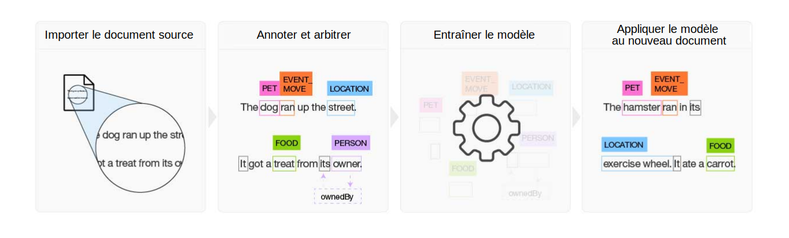

---

copyright:
  years: 2015, 2018
lastupdated: "2018-07-18"

---

{:shortdesc: .shortdesc}
{:new_window: target="_blank"}
{:tip: .tip}
{:pre: .pre}
{:codeblock: .codeblock}
{:screen: .screen}
{:javascript: .ph data-hd-programlang='javascript'}
{:java: .ph data-hd-programlang='java'}
{:python: .ph data-hd-programlang='python'}
{:swift: .ph data-hd-programlang='swift'}

Cette documentation concerne {{site.data.keyword.knowledgestudiofull}} on {{site.data.keyword.cloud}}. Pour consulter la documentation de la version précédente de {{site.data.keyword.knowledgestudioshort}} on {{site.data.keyword.IBM_notm}} Marketplace, [cliquez sur ce lien ](https://console.bluemix.net/docs/services/knowledge-studio/index.html){: new_window}.
{: tip}

# A propos
{: #wks_overview_full}

Utilisez {{site.data.keyword.knowledgestudiofull}} pour créer un modèle d'apprentissage automatique comprenant les nuances linguistiques, le sens et les relations spécifiques à votre secteur d'activité ou pour créer un modèle à base de règles capable de trouver des entités dans les documents en fonction de règles que vous définissez.
{: shortdesc}

Afin de devenir un expert du domaine dans un secteur ou une industrie particulière, {{site.data.keyword.watson}} a besoin d'être formé. Vous pouvez faciliter cette tâche en entraînant {{site.data.keyword.watson}} avec {{site.data.keyword.knowledgestudioshort}}.

## Construire un modèle d'apprentissage automatique

{{site.data.keyword.knowledgestudioshort}} fournit des outils faciles à utiliser pour annoter les documents non structurés du domaine considéré. Il utilise ces annotations pour créer un modèle d'apprentissage automatique personnalisé qui comprend le langage du domaine. La précision du modèle s'améliore au fil de tests itératifs qui, au bout du compte, donnent un algorithme capable de tirer des enseignements des motifs qu'il voit et de reconnaître ces mêmes motifs dans d'importantes collections de nouveaux documents. Vous pouvez déployer le modèle d'apprentissage automatique fini sur d'autres offres cloud {{site.data.keyword.watson}} et solutions cognitives afin de trouver et d'extraire les mentions de relations et d'entités, y compris les coréférences d'entités.

 Figure 1. Aperçu du processus de construction d'un modèle d'apprentissage automatique

1. Sur la base d'un jeu de documents source spécifique au domaine considéré, l'équipe crée un système de types qui définit les types d'entités et les types de relations existant dans les informations d'intérêt pour l'application qui utilisera le modèle.
1. Un groupe d'annotateurs (au moins deux personnes) annote un petit jeu de documents source afin d'étiqueter les mots qui représentent des types d'entités, d'identifier les types de relations aux endroits du texte où figurent des relations entre mentions d'entités et de définir les coréférences, qui sont des mentions différentes d'une même chose, autrement dit d'une même entité. Toute divergence dans les annotations est résolue, et un ensemble de documents annotés de façon optimale est construit pour former les données de référence.
1. {{site.data.keyword.knowledgestudioshort}} utilise les données de référence pour entraîner le modèle.
1. Le modèle entraîné sert ensuite à trouver les entités, relations et coréférences dans de nouveaux documents jamais vus auparavant.

Pour plus de détails, consultez [Création d'un modèle d'apprentissage automatique](/docs/services/watson-knowledge-studio/ml-annotator.html).

## Construire un modèle à base de règles

{{site.data.keyword.knowledgestudioshort}} fournit un éditeur de règles qui simplifie la recherche des motifs communs dans vos documents et leur capture sous forme de règles. Vous pouvez ensuite créer un modèle qui reconnaît les motifs de ces règles et le déployer pour utilisation dans d'autres services.

Pour plus de détails, consultez [Création d'un modèle à base de règles](/docs/services/watson-knowledge-studio/rule-annotator.html).

## Intégration entre services Watson
{: #wks_watsoninteg}

Artefacts et modèles d'un domaine peuvent être partagés entre {{site.data.keyword.knowledgestudiofull}} et d'autres services {{site.data.keyword.watson}}.

Utilisez {{site.data.keyword.knowledgestudioshort}} pour accomplir les tâches suivantes :

- Amorcer le processus d'annotation en utilisant le service {{site.data.keyword.nlushort}} pour trouver automatiquement et annoter les entités dans vos documents. Lorsque les annotateurs humains commencent à annoter les documents, ils peuvent voir, corriger et compléter les annotations qui ont déjà été ajoutées par le service. Pour les détails, consultez [Pré-annoter des documents avec {{site.data.keyword.nlushort}}](/docs/services/watson-knowledge-studio/preannotation.html#wks_preannotnlu).
- Transférer des documents analysés, qui sont des [fichiers XMI au format UIMA CAS](/docs/services/watson-knowledge-studio/preannotation.html#wks_uimaweximport). Par exemple, vous pouvez transférer des fichiers XMI au format UIMA CAS qui ont été exportés de collections {{site.data.keyword.IBM_notm}} {{site.data.keyword.watson}} Explorer Content Analytics ou d'[{{site.data.keyword.IBM_notm}} {{site.data.keyword.watson}} Explorer Content Analytics Studio](/docs/services/watson-knowledge-studio/preannotation.html#wks_uimawexstudio).
- Déployer un modèle d'[apprentissage automatique](/docs/services/watson-knowledge-studio/publish-ml.html#wks_madiscovery) ou [à base de règles](/docs/services/watson-knowledge-studio/rule-annotator-model-use.html#wks_rule_discovery) pour l'utiliser avec le service {{site.data.keyword.watson}} {{site.data.keyword.discoveryshort}}.
- Déployer un modèle d'[apprentissage automatique](/docs/services/watson-knowledge-studio/publish-ml.html#wks_manlu) ou [à base de règles](/docs/services/watson-knowledge-studio/rule-annotator-model-use.html#wks_rule_nlu) pour l'utiliser avec le service {{site.data.keyword.nlushort}}.
- [Exporter un modèle d'apprentissage automatique](/docs/services/watson-knowledge-studio/publish-ml.html#wks_maexport) pour l'utiliser dans {{site.data.keyword.IBM_notm}} {{site.data.keyword.watson}} Explorer.
- [Exporter un PEAR de modèle à base de règles](/docs/services/watson-knowledge-studio/rule-annotator-model-use.html#wks_rule_export) pour l'utiliser dans {{site.data.keyword.IBM_notm}} {{site.data.keyword.watson}} Explorer.
