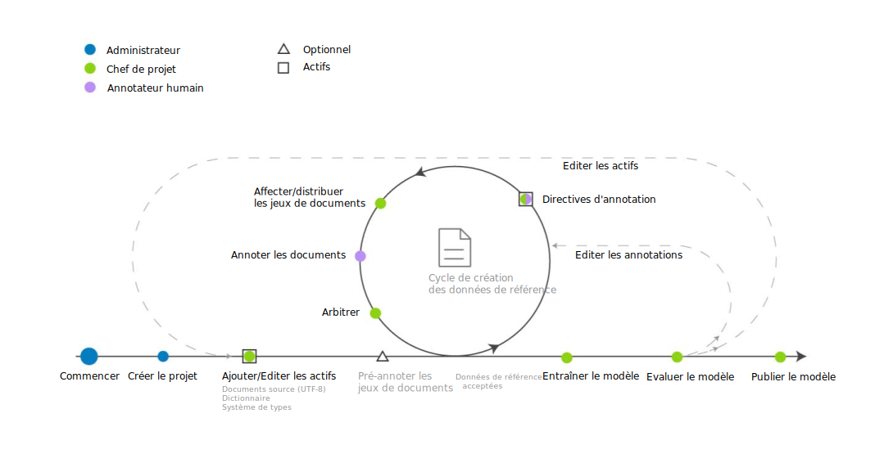

---

copyright:
  years: 2015, 2018
lastupdated: "2018-07-19"

---

{:shortdesc: .shortdesc}
{:new_window: target="_blank"}
{:tip: .tip}
{:pre: .pre}
{:codeblock: .codeblock}
{:screen: .screen}
{:javascript: .ph data-hd-programlang='javascript'}
{:java: .ph data-hd-programlang='java'}
{:python: .ph data-hd-programlang='python'}
{:swift: .ph data-hd-programlang='swift'}

Cette documentation concerne {{site.data.keyword.knowledgestudiofull}} on {{site.data.keyword.cloud}}. Pour consulter la documentation de la version précédente de {{site.data.keyword.knowledgestudioshort}} on {{site.data.keyword.IBM_notm}} Marketplace, [cliquez sur ce lien ](https://{DomainName}/docs/services/knowledge-studio/ml-annotator.html){: new_window}.
{: tip}

# Séquence d'opérations de création d'un modèle d'apprentissage automatique
{: #ml_annotator}

Créez un modèle d'apprentissage automatique pour entraîner un modèle capable d'identifier des entités, des coréférences et des relations d'intérêt dans de nouveaux documents.
{: shortdesc}

Prenez connaissance de la séquence d'opérations typiquement mise en jeu lors de la création d'un modèle d'apprentissage automatique dans {{site.data.keyword.knowledgestudioshort}}.

Toutes les étapes excepté une sont effectuées par le chef de projet. L'étape d'*annotation des documents* incombe aux annotateurs humains. Comme ces derniers sont souvent des experts du domaine concerné, ils peuvent aussi être consultés lors de la création des ressources de l'espace de travail, telles que le système de types.

 Figure 1. La séquence de développement d'un modèle d'apprentissage automatique

<table summary="Créer et raffiner un modèle">
  <caption>Tableau 1. Créer et raffiner une séquence d'opérations</caption>
  <tr>
    <th style="vertical-align:bottom; text-align:left" id="d14771e70">Etape</th>
    <th style="vertical-align:bottom; text-align:left" id="d14771e72">Description</th>
  </tr>
  <tr>
    <td style="vertical-align:top; text-align:left" headers="d14771e70">
      
Créer un espace de travail.

    </td>
    <td style="vertical-align:top; text-align:left" headers="d14771e72">
      
Consultez [Créer un espace de travail](/docs/services/watson-knowledge-studio/create-project.html). Un espace de travail contient les ressources qui servent à créer le modèle,
parmi lesquelles :

      <dl>
        <dt>Système de types</dt>
        <dd>
          
Transférez ou créez le système de types et définissez les types d'entités et les types de relations
que les annotateurs humains pourront appliquer lors de l'annotation des textes. Le système de types est généralement défini par le gestionnaire des processus de modélisation en collaboration avec
les experts de votre domaine. Consultez [Etablir un système de types](/docs/services/watson-knowledge-studio/typesystem.html).

        </dd>
        <dt>Documents source</dt>
        <dd>
          
Créez un corpus en transférant dans l'espace de travail des exemples de documents
représentatifs des contenus relatifs à votre domaine. Consultez [Ajouter des documents pour l'annotation](/docs/services/watson-knowledge-studio/documents-for-annotation.html). Divisez le corpus en plusieurs jeux de documents, spécifiez le pourcentage de documents communs à tous les
jeux et affecter ces derniers à des annotateurs humains. Consultez [Créer et affecter des jeux d'annotations](/docs/services/watson-knowledge-studio/documents-for-annotation.html#wks_projdocsets).

        </dd>
        <dt>Dictionnaires</dt>
        <dd>
          
Transférez ou créez des dictionnaires pour annoter les textes. Vous pouvez choisir d'ajouter une à une les entrées de dictionnaire ou de les transférer d'un fichier existant et
de les éditer. Consultez [Créer des dictionnaires](/docs/services/watson-knowledge-studio/dictionaries.html).

        </dd>
      </dl>
    </td>
  </tr>
  <tr>
    <td style="vertical-align:top; text-align:left" headers="d14771e70">
      
<strong>Optionnel</strong> : pré-annoter les documents

    </td>
    <td style="vertical-align:top; text-align:left" headers="d14771e72">
      
Pré-annotez les
documents sur la base des termes des dictionnaires de l'espace de travail, des mentions
de types {{site.data.keyword.nlushort}} ou de règles que vous définissez. Consultez [Amorcer le processus d'annotation](/docs/services/watson-knowledge-studio/preannotation.html#wks_preannotate).

    </td>
  </tr>
  <tr>
    <td style="vertical-align:top; text-align:left" headers="d14771e70">
      
Annoter les documents

    </td>
    <td style="vertical-align:top; text-align:left" headers="d14771e72">
      <ol>
        <li>
          
Le chef de projet
affecte les tâches d'annotation aux annotateurs humains, leur fournit les consignes à suivre et
configure le seuil de convergence entre annotateurs. Consultez
[Créer une tâche d'annotation](/docs/services/watson-knowledge-studio/annotate-documents.html#wks_hatask).

        </li>
        <li>
          
Les annotateurs humains utilisent l'éditeur de données de référence
pour annoter manuellement les documents. Le rôle de chaque annotateur humain est d'identifier les mentions d'intérêt dans les contenus relatifs au domaine et
de les étiqueter avec les types d'entités qui leur correspondent. Il doit aussi identifier les relations entre mentions (par exemple, Marie est une employée d'IBM) et
les coréférences, qui sont des mentions se référant à une même entité (par exemple, une occurrence de "elle" qui fait référence à Marie). Consultez [Annoter des documents](/docs/services/watson-knowledge-studio/user-guide.html).

        </li>
      </ol>
    </td>
  </tr>
  <tr>
    <td style="vertical-align:top; text-align:left" headers="d14771e70">
      
Arbitrer les conflits et promouvoir les documents

    </td>
    <td style="vertical-align:top; text-align:left" headers="d14771e72">
      
Acceptez ou rejetez les annotations produites par les annotateurs humains et
arbitrez les éventuels conflits d'annotations (une même mention ou relation qui n'a pas été étiquetée de la même manière par deux annotateur humains). L'évaluation de l'exactitude et de la cohérence du travail d'annotation humain peut être du ressort
d'un chef annotateur ou d'un utilisateur ayant une plus grande expérience du domaine
que le chef de projet. Consultez [Arbitrage](/docs/services/watson-knowledge-studio/build-groundtruth.html#wks_haperform).

    </td>
  </tr>
  <tr>
    <td style="vertical-align:top; text-align:left" headers="d14771e70">
      
Entraîner le modèle

    </td>
    <td style="vertical-align:top; text-align:left" headers="d14771e72">
      
Créez le modèle d'apprentissage automatique. Consultez [Créer un modèle d'apprentissage automatique](/docs/services/watson-knowledge-studio/train-ml.html#wks_madocsets).

    </td>
  </tr>
  <tr>
    <td style="vertical-align:top; text-align:left" headers="d14771e70">
      
Evaluer le modèle

    </td>
    <td style="vertical-align:top; text-align:left" headers="d14771e72">
      
Evaluez l'exactitude du modèle. Consultez [Evaluer les annotations ajoutées par le modèle](/docs/services/watson-knowledge-studio/train-ml.html#wks_matest). Selon l'exactitude obtenue à ce stade, il peut être nécessaire de répéter les premières étapes autant de fois que nécessaire
pour atteindre une exactitude optimale. Consultez [Analyser les performances du modèle d'apprentissage automatique](/docs/services/watson-knowledge-studio/evaluate-ml.html)
pour un aperçu des points sur lesquels vous devez agir en vue de remédier aux problèmes de performances les plus courants.

    </td>
  </tr>
  <tr>
    <td style="vertical-align:top; text-align:left" headers="d14771e70">
      
Publier le modèle

    </td>
    <td style="vertical-align:top; text-align:left" headers="d14771e72">
      
Exportez ou déployez le modèle. Consultez [Utiliser le modèle d'apprentissage automatique](/docs/services/watson-knowledge-studio/publish-ml.html).

    </td>
  </tr>
</table>
