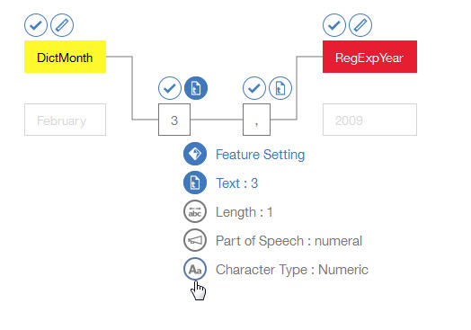
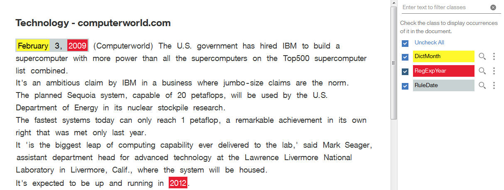
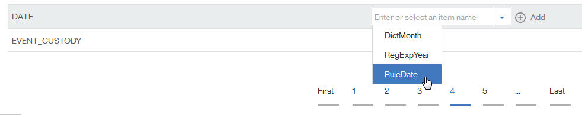

---

copyright:
  years: 2015, 2018
lastupdated: "2018-04-04"

---

{:shortdesc: .shortdesc}
{:new_window: target="_blank"}
{:tip: .tip}
{:pre: .pre}
{:codeblock: .codeblock}
{:screen: .screen}
{:javascript: .ph data-hd-programlang='javascript'}
{:java: .ph data-hd-programlang='java'}
{:python: .ph data-hd-programlang='python'}
{:swift: .ph data-hd-programlang='swift'}

Cette documentation concerne
{{site.data.keyword.knowledgestudiofull}} on {{site.data.keyword.cloud}}.
Pour consulter la documentation de la version précédente de {{site.data.keyword.knowledgestudioshort}} on {{site.data.keyword.IBM_notm}} Marketplace,
[cliquez sur
ce lien ](https://console.bluemix.net/docs/services/knowledge-studio/tutorials-create-rule-model.html){: new_window}.
{: tip}

# Créer un modèle à base de règles
{: #wks_tutrule_intro}

Ce tutoriel vous aide à comprendre comment créer un modèle à base de règles qui soit utilisable pour trouver des
motifs de texte que vous définissez dans les documents.
{: shortdesc}

Vous allez construire un modèle capable de trouver, dans les documents, les occurrences
de texte correspondant au motif `mois jour, année` (format de date anglo-saxon).
Par exemple, le modèle devra pouvoir trouer la référence de date *May 1, 2010*.
Avant de définir le motif de règle proprement dit, vous allez créer les artefacts qui vous aideront à composer
le motif, notamment une classe de dictionnaire reconnaissant les mentions de mois et
une expression régulière reconnaissant les mentions d'années dans le texte.


## Objectifs pédagogiques

Après avoir terminé ce tutoriel, vous saurez comment effectuer les tâches suivantes :

- Créer des classes
- Ajouter des documents pour définir des règles
- Associer des dictionnaires à des classes
- Définir des expressions régulières pour capturer des séquences de caractères
- Définir des règles

Ce tutoriel devrait prendre
environ 30 minutes. Comptez plus de temps si vous explorez d'autres concepts
relatifs aux sujets qui y sont traités.

## Avant de commencer

- Vérifiez que vous utilisez un navigateur pris en charge. Consultez à cet
effet [Navigateur nécessaire](/docs/services/watson-knowledge-studio/system-requirements.html).
- Assurez-vous d'avoir suivi le tutoriel [Créer un espace de travail](/docs/services/watson-knowledge-studio/tutorials-create-project.html).

- Vous devez avoir au moins un ID utilisateur dans le rôle Admin ou ProjectManager.
Pour des informations sur
les rôles d'utilisateur, consultez [Constituer une équipe](/docs/services/watson-knowledge-studio/team.html).

## Résultats

Lorsque vous aurez créé le modèle à base de règles, vous pourrez l'utiliser de l'une des manières suivantes
pour trouver des motifs de texte dans les documents :


- [Pré-annoter vos documents](/docs/services/watson-knowledge-studio/preannotation.html#wks_preannotrule) avant de créer un modèle d'apprentissage automatique
- [Déployer ou exporter le modèle](/docs/services/watson-knowledge-studio/rule-annotator-model-use.html) vers
d'autres services ou produits {{site.data.keyword.watson}}

## Leçon 1 : ajouter un dictionnaire des mois
{: #wks_tutless_rule1}

Au cours de cette leçon, vous allez apprendre comment ajouter un dictionnaire à un
espace de travail dans {{site.data.keyword.knowledgestudioshort}}.
Le dictionnaire que vous allez ajouter contient des termes relatifs aux mois de l'année.


### A propos de cette tâche

Dans une leçon ultérieure, vous définirez une classe basée sur ce
dictionnaire.
Ainsi, tous les termes de ce dictionnaire trouvés dans les documents seront automatiquement annotés comme mentions du type de
classe associé.
Pour plus d'informations sur les dictionnaires,
consultez [Ajouter des dictionnaires à un espace de travail](/docs/services/watson-knowledge-studio/dictionaries.html#wks_projdictionaries).

### Procédure

1. Téléchargez le fichier <a target="_blank" href="https://watson-developer-cloud.github.io/doc-tutorial-downloads/knowledge-studio/dictionary-items-month.csv" download>`dictionary-items-month.csv`</a>
sur votre ordinateur.
Ce fichier contient des termes de dictionnaire au format CSV, lequel est adapté à un transfert dans un
dictionnaire {{site.data.keyword.knowledgestudioshort}}.

1. Dans la barre latérale **Actifs & Outils** > **Pré-annotateurs**,
sélectionnez l'onglet **Dictionnaires** et cliquez sur **Gérer les dictionnaires**.
1. Cliquez sur le bouton **Créer un dictionnaire** pour ajouter un dictionnaire.
1. Dans le champ **Nom**, tapez `Dictionnaire des mois` et cliquez sur **Sauvegarder** pour
créer le dictionnaire (vide).
Le dictionnaire est créé et s'ouvre automatiquement en vue de son édition.

1. Dans le panneau du dictionnaire, cliquez sur **Transférer**.
1. Dans la fenêtre Transférer des entrées de dictionnaire, sélectionnez le fichier
`dictionary-items-month.csv` sur votre ordinateur et cliquez sur
**Transférer**.


    Les termes du fichier sont importés dans le dictionnaire.


## Leçon 2 : ajouter des exemples de documents
{: #wks_tutless_rule2}

Au cours de cette leçon, vous allez apprendre à ajouter des documents avec des motifs linguistiques illustrant les types de règles
que vous voulez définir.


### A propos de cette tâche

Pour plus d'informations sur l'ajout de documents,
consultez [Ajouter des documents pour définir des règles](/docs/services/watson-knowledge-studio/rule-annotator-add-doc.html).

### Procédure

1. Téléchargez le fichier <a target="_blank" href="https://watson-developer-cloud.github.io/doc-tutorial-downloads/knowledge-studio/documents-new.csv" download>`documents-new.csv`</a>
sur votre ordinateur.
Ce fichier contient des exemples de documents qui se prêtent au transfert.

1. Dans la barre latérale, cliquez sur **Annotation de document** > **Règles**.
1. Cliquez sur l'icône **Ajouter un document** à côté de **Documents**.
1. Cliquez sur l'onglet **Transférer un fichier CSV**.
1. Cliquez pour rechercher le fichier `documents-new.csv` que vous avez téléchargé
sur votre ordinateur précédemment, puis cliquez sur **Transférer**.

    Un jeu de documents est affiché dans la page Documents principale. 

    


## Leçon 3 : créer des classes
{: #wks_tutless_rule3}

Au cours de cette leçon, vous allez apprendre à définir des classes que vous utiliserez lorsque vous définirez une règle.


### A propos de cette tâche

Pour plus d'informations sur les classes, consultez [Règles](/docs/services/watson-knowledge-studio/rule-annotator.html).

### Procédure

1. Dans la page **Règles** de votre espace de travail,
cliquez sur l'icône **Ajouter une classe** à côté de **Classe**, dans le panneau droit.


1. Entrez `DictMonth` comme nom de classe et cliquez sur **Ajouter**.

    La nouvelle classe apparaît dans le panneau latéral Classe.

## Leçon 4 : associer un dictionnaire à une classe
{: #wks_tutless_rule4}

Au cours de cette leçon, vous allez apprendre à utiliser un dictionnaire dans
l'éditeur de règle.


### Procédure

1. Dans la barre latérale, sélectionnez **Annotation de document** > **Dictionnaires**,
puis cliquez sur le **Dictionnaire des mois** que vous avez créé précédemment.


1. Dans la liste **Classe**, sélectionnez `DictMonth`, puis cliquez sur **Sauvegarder**.

    La classe est associée au dictionnaire.


    


### Résultats

Dans les documents associés à l'éditeur de règle, toutes les références aux termes contenus dans le dictionnaire
sont annotées comme mentions de la classe `DictMonth`.
Vous pourrez le vérifier dans la prochaine leçon.

## Leçon 5 : trouver des annotations de classe dans les documents
{: #wks_tutless_rule5}

Au cours de cette leçon, vous allez voir comment trouver des annotations de classe dans les
documents de l'éditeur de règle.


### Procédure

1. Dans la barre latérale, sélectionnez **Annotation de document** > **Règles**.
1. Dans le panneau Classe, localisez la classe `DictMonth` que vous avez définie plus tôt
et cliquez sur l'icône **Rechercher des annotations dans des documents** à côté d'elle.


    La page Rechercher des annotations apparaît avec tous les documents qui contiennent des références aux mois de l'année.


1. Cliquez sur le document `Technology - computerworld.com` pour le voir en entier.
Notez que le texte `February` est surligné, ce qui signifie qu'il a bien été annoté comme une mention de la classe `DictMonth`.

## Leçon 6 : définir une expression régulière
{: #wks_tutless_rule6}

Au cours de cette leçon, vous allez apprendre comment définir une expression régulière. 

### A propos de cette tâche

Vous allez définir une expression régulière capable d'identifier des motifs d'année tels que *2009*.

Pour plus d'informations sur la définition d'expressions régulières,
consultez [Définir une règle](/docs/services/watson-knowledge-studio/rule-annotator-define-rule.html).

### Procédure

1. Dans la page **Règles**, cliquez sur l'icône
**Ajouter une classe** () à côté de **Classe**, dans
le panneau droit.

1. Entrez `RegExpYear` comme nom de classe et cliquez sur **Ajouter**.
1. Dans la barre latérale, cliquez sur
**Expressions régulières**, puis sur l'icône **Créer une expression régulière** à
côté de **Expressions régulières**.
1. Cliquez sur le bouton **Ajouter une entrée**.
1. Dans le champ **Expression régulière**, entrez l'expression suivante :


    ```
    (?:(?:19|20)[0-9]{2})
    ```
    {: screen}

    > **Remarque :** Cette expression régulière trouve les années de 1900 à 2099.

1. Réglez **Nb minimal d'unités lexicales (mots)** à `1` et **Nb maximal d'unités lexicales (mots)** à `1`.
1. Cliquez sur **Ajouter** pour sauvegarder l'entrée d'expression régulière.

1. Entrez `MyYearExp` comme nom d'expression régulière et, dans le menu **Classe**,
sélectionnez la classe *RegExpYear* que vous avez définie plus tôt.

1. Cliquer sur **Sauvegarder**.

    Dès que vous sauvegardez l'expression régulière, elle est automatiquement appliquée aux exemples de documents.
Toutes les chaînes de texte correspondant au motif que vous avez défini dans l'expression régulière sont annotées
comme des mentions de la classe **RegExpYear**.


1. Pour vérifier que l'expression que vous avez définie repère correctement les occurrences de dates, vous pouvez
rechercher les mentions.
Cliquez sur l'icône **Rechercher des annotations dans des documents** à côté de la classe **RegExpYear**, dans le
panneau latéral Classe.


    


    La page Rechercher des annotations apparaît.
Les occurrences de mentions d'années sont surlignées dans les exemples de documents où elles apparaissent.


    

## Leçon 7 : définir une règle
{: #unique_1166829415}

Dans cette leçon, vous allez apprendre à définir une règle.

### A propos de cette tâche

Vous avez déjà défini une classe à base de dictionnaire pour annoter les
mentions de mois de l'année.
Vous avez également défini une expression régulière qui trouve les valeurs numériques représentant des années.
Vous allez à présent définir une règle qui repère la séquence d'un nom de mois (en anglais) suivi d'un nombre, puis d'une virgule, puis d'une année (format de date anglo-saxon).
Des expressions de dates telles que *September 21, 2016* seront ainsi repérées. 

Pour plus d'informations sur la définition de règles,
consultez [Définir une règle](/docs/services/watson-knowledge-studio/rule-annotator-define-rule.html).

### Procédure

1. Dans la barre latérale, sélectionnez **Annotation de document** > **Règles** et
ouvrez le document `Technology - computerworld.com`.
1. Sélectionnez le texte *February 3, 2009* dans ce document. Veillez à sélectionner la virgule également.

    

1. Cliquez sur l'icône **Ajouter une règle**. 

    L'éditeur de règle montre une représentation du motif de règle que vous avez identifié.

    Le texte *February 3, 2009* est visible. Un trait gris relie les
cellules de la représentation qui composent actuellement le motif. 
    - C'est la classe *DictMonth*, et non le texte *February*, qui fait partie du motif de la règle.
Cette sélection est préférable, car ce que nous voulons que le modèle identifie comme première unité lexicale dans le motif de date,
ce sont tous les mois annotés par la classe *DictMonth*, et non seulement le texte *February*.

    - A la fin de la règle, l'année *2009* est déjà annotée comme mention de la classe *RegExpYear*.
Là encore, c'est la classe *DictMonth*, et non le nombre 2009, qui fait partie du motif de la règle.
Cette sélection est également préférable, car ce que nous voulons que le modèle identifie comme dernière unité lexicale dans le motif de date,
ce sont toutes les années annotées par la classe *RegExpYear*, et non seulement le texte spécifique *2009*.


    Le chiffre 3 et la virgule (,) après lui figurent en tant que deuxième et troisième unités lexicales dans le motif.
Si nous laissions le motif en l'état, le modèle ne trouverait que les occurrences des dates dont le jour est le troisième du mois.
Or, nous voulons qu'il trouve toutes les dates, quel que soit le jour du mois. Nous allons donc changer les caractéristiques
de l'unité lexicale du jour.


1. Au-dessus de la cellule `3` du jour, cliquez sur l'icône **Texte** pour ouvrir les caractéristiques
(Paramètres de fonction) de l'unité lexicale.


    

    Actuellement, la règle est configurée pour rechercher le texte exact `3`. Nous voulons au contraire qu'elle trouve n'importe quel nombre à cet endroit du motif.

1. Changez les caractéristiques en sélectionnant **Type de caractère : Numérique**, puis en désélectionnant **Texte : 3**.

    

    Vous avez changé la définition de la cellule du chiffre `3`.

    


    L'icône **Aa** indique que n'importe quel nombre convient et qu'il n'est plus
nécessaire qu'il soit strictement égal à 3.


1. Ne changez rien aux caractéristiques de l'unité lexicale virgule.


    Nous voulons que la troisième unité lexicale soit une virgule. Le réglage actuel **texte : ,** est
donc approprié.
Outre un ensemble de caractérisques (Paramètres de fonction), chaque unité lexicale a un paramètre de répétition.
Celui-ci précise combien de fois l'unité lexicale peut ou doit être répétée dans le texte pour qu'elle corresponde au
motif.
Le réglage actuel, **Obligatoire (exactement 1)**, est également approprié.


    

1. Pour représenter le motif `DictMonth + unité lexicale numérique + virgule + RegExpYear`, associez-lui une classe.

    Notez les quatre cellules vides qui représentent les quatre unités lexicales que vous avez
sélectionnées dans le document.
Pour sélectionner toutes les cellules, cliquez sur la première, appuyez sur la touche Majuscule et, sans la relâcher,
cliquez tour à tour sur chaque autre cellule.
Entrez `RuleDate` comme nom de classe, puis cliquez dessus pour créer la nouvelle classe.


    


    Vous avez correctement défini le motif de la règle.


1. Dans le champ **Nom de la règle**, entrez `MyDateRule` et cliquez sur **Sauvegarder**.

    Dès que vous sauvegardez la règle, elle est automatiquement appliquée aux exemples de documents.
Si le document `Technology - computerworld.com` est toujours ouvert dans l'éditeur de règle,
vous verrez que le texte `February 3, 2009` y est à présent annoté en tant que mention
de la classe RuleDate.


    


    Vous pouvez faire une recherche de toutes les occurrences des mentions
de la classe RuleDate dans les exemples de documents en cliquant
sur l'icône **Rechercher des annotations dans des documents** ( )
à côté de la classe `RuleDate`, dans le panneau Classe.
Il est recommandé de vérifier si toutes les dates sont capturées correctement afin de confirmer que vous avez défini correctement le motif.

    


## Leçon 8 : créer un modèle à base de règles
{: #wks_tutless_rule8}

Dans cette leçon, vous allez apprendre à créer un modèle à base de règles.


### A propos de cette tâche

Pour plus d'informations sur la création d'un modèle à base de règles, consultez
[Créer le modèle à base de règles](/docs/services/watson-knowledge-studio/rule-annotator-model-create.html).

### Procédure

1. Dans la barre latérale, sélectionnez
**Gestion des modèles** > **Versions** et cliquez sur l'onglet **Mappage de type de modèle à base de règles**.


1. Associez la classe `RuleDate` que vous avez définie au type d'entité `DATE` du système de types.


    1. Localisez le type d'entité **DATE** et cliquez sur **Editer**.

        

    1. Choisissez la classe `RuleDate` dans la liste déroulante et cliquez sur **Sauvegarder**.

        

1. Pour exécuter le modèle à base de règles, sélectionnez l'onglet **A base de règles** et
cliquez sur **Exécuter ce modèle**.

## Résumé du tutoriel
{: #wks_tutrule_sum}

Tout en découvrant {{site.data.keyword.knowledgestudioshort}}, vous avez créé un modèle à base de règles.


### Ce que vous avez appris

En suivant ce tutoriel, vous avez appris les concepts suivants :

- Classes
- Expressions régulières
- Règles
