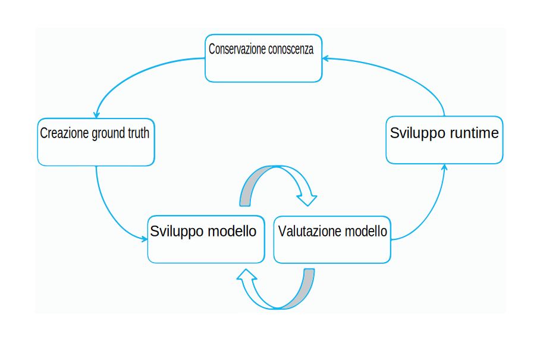

---

copyright:
  years: 2015, 2018
lastupdated: "2018-07-19"

---

{:shortdesc: .shortdesc}
{:new_window: target="_blank"}
{:tip: .tip}
{:pre: .pre}
{:codeblock: .codeblock}
{:screen: .screen}
{:javascript: .ph data-hd-programlang='javascript'}
{:java: .ph data-hd-programlang='java'}
{:python: .ph data-hd-programlang='python'}
{:swift: .ph data-hd-programlang='swift'}

Questa documentazione è per {{site.data.keyword.knowledgestudiofull}} su {{site.data.keyword.cloud}}. Per visualizzare la documentazione della versione precedente di {{site.data.keyword.knowledgestudioshort}} nel {{site.data.keyword.IBM_notm}} Marketplace, [fai clic su questo link ](https://{DomainName}/docs/services/knowledge-studio/annotate-documents.html){: new_window}.
{: tip}

# Configurazione dell'annotazione
{: #annotate-documents}

Gli utenti che hanno una conoscenza del settore e del suo linguaggio devono annotare i documenti.
{: shortdesc}

Effettua le seguenti attività per abilitare gli annotatori umani ad accedere al lavoro:

- Invita gli esperti in materia nell'istanza {{site.data.keyword.knowledgestudioshort}} che stai utilizzando.
- Associa gli annotatori umani alle serie di annotazioni che desideri annotino.
- Crea un'attività che assegna l'annotatore umano ad annotare i documenti nella serie.

    > **Attenzione:** non è possibile finché non assegni esplicitamente le attività agli annotatori umani in modo che possano visualizzare il tuo spazio di lavoro quando accedono a {{site.data.keyword.knowledgestudioshort}}.

I tuoi utenti (gli annotatori umani) dovranno avere familiarità con i [Documenti di annotazione](/docs/services/watson-knowledge-studio/user-guide.html), che contengono le informazioni dettagliate su come annotare i documenti.

## Ciclo di vita del modello
{: #wks_lifecycle}

Il modello che crei con {{site.data.keyword.knowledgestudioshort}} è un componente software che può essere inserito in una pipeline di elaborazione del linguaggio naturale (NLP).

Con {{site.data.keyword.knowledgestudioshort}}, puoi creare, valutare e migliorare i modelli per i nuovi domini. Un modello aggiunge le annotazioni (metadati) al testo visualizzato nel contenuto del linguaggio naturale. Le annotazioni, che identificano le citazioni di entità di interesse nel contenuto del dominio, le relazioni tra di esse e come fanno riferimento alla stessa entità, possono essere utilizzate dalle applicazioni per analizzare ed elaborare automaticamente il testo. Gli utenti dell'applicazione traggono vantaggio da questo livello di analisi ricavando il significato, rilevando le informazioni dettagliate e ottenendo risposte in un contesto del linguaggio naturale.

La creazione di un modello è un processo a più fasi iterativo che coinvolge diversi passi: conservazione della conoscenza, generazione del ground truth, sviluppo del modello e distribuzione del runtime.

### Adattamento del dominio end-to-end
{: #wks_lifecycle__wks_lifecycleS6}

Il seguente diagramma riepiloga le interazioni tra queste cinque fasi di sviluppo del modello e le attività tipiche che si verificano in ogni fase.

 Figura 2. Un riepilogo delle cinque fasi di sviluppo del modello e le attività che si verificano in ogni fase.

### Conservazione della conoscenza
{: #wks_lifecycle__wks_lifecycleS1}

Questa fase, che è esterna a {{site.data.keyword.knowledgestudioshort}}, fa riferimento al processo di selezione, raccolta, conservazione e conservazione del contenuto rilevante di un dominio specifico. La conservazione aggiunge valore ai dati; li trasforma in informazioni attendibili.

### Generazione ground truth
{: #wks_lifecycle__wks_lifecycleS2}

Questa fase fa riferimento all'utilizzo delle procedure consigliate e degli strumenti di {{site.data.keyword.knowledgestudioshort}} per produrre una raccolta di dati controllati che possono essere utilizzati per adattare una soluzione {{site.data.keyword.watson}} per un dominio particolare. La precisione di questi dati controllati, chiamata *ground truth* o *documenti standard gold*, è critica perché le imprecisioni nei dati veri e propri si collegheranno a quelle nelle applicazioni che si basano su di essi.

Una parte essenziale delle informazioni di {{site.data.keyword.watson}} su un nuovo dominio, include di fornire le informazioni sulle entità di interesse nel tuo contenuto del dominio, le relazioni tra di esse e come fanno riferimento tra loro. La raccolta di queste informazioni include le seguenti attività:

- Coinvolgere gli esperti in materia per creare le seguenti risorse o per identificare le risorse esistenti che possono essere riutilizzate o modificate del tuo dominio:

  - Gli esempi e le linee guida di annotazione per aiutare gli annotatori umani ad imparare come le parole e i passaggi nel tuo dominio devono essere annotati.
  - I tipi di sistemi che definiscono i tipi specifici del dominio (oggetti) e le funzioni (classificazioni dati) che possono essere rilevati nel tuo contenuto del dominio tramite l'analisi del testo. Il sistema tipo controlla i tipi di annotazioni che un annotatore umano può aggiungere ai documenti.
  - I dizionari dei termini che devono essere trattati come termini equivalenti nel tuo contenuto del dominio.

- Creazione di un corpus di documenti che rappresentano il tuo contenuto del dominio.
- La preannotazione dei documenti basata sui dizionari che aggiungi a uno spazio di lavoro {{site.data.keyword.knowledgestudioshort}}. Dopo aver creato un modello di machine learning, puoi utilizzarlo per pre-annotare i nuovi documenti che aggiungi al corpus. La preannotazione è un processo di annotazione automatica di un documento per quanto possibile prima che il modello di machine learning sia in grado di farlo. La preannotazione può ridurre il lavoro di annotazione umano sostituendo una parte della creazione di annotazione umana con una semplice verifica dell'accuratezza dell'annotazione automatica.
- La divisione dei documenti insieme agli annotatori umani, che poi utilizzano lo strumento di editor ground truth {{site.data.keyword.knowledgestudiofull}} per aggiungere le annotazioni manualmente a piccole serie di documenti.
- Il confronto dei risultati dell'annotazione umana e la risoluzione dei conflitti. La decisione in questa fase è necessaria per garantire che i documenti accurati e annotati in modo congruo siano promossi a ground truth, dove possono essere utilizzati per preparare e verificare un modello di machine learning.

### Sviluppo del modello
{: #wks_lifecycle__wks_lifecycleS3}

Questa fase fa riferimento all'utilizzo degli strumenti {{site.data.keyword.knowledgestudioshort}} per creare un modello. Dopo aver stabilito il ground truth, i risultati dell'annotazione umana possono essere utilizzati per preparare un algoritmo per l'aggiunta automatica delle annotazioni a grandi raccolte di documenti, come raccolte che includono milioni di documenti.

### Valutazione del modello
{: #wks_lifecycle__wks_lifecycleS4}

Questa fase fa riferimento all'utilizzo degli strumenti {{site.data.keyword.knowledgestudioshort}} per affinare il modello e migliorare le prestazioni. I risultati generati dal modello vengono valutati con una serie di test di documenti ground truth. L'*Analisi dell'accuratezza* identifica le cause degli errori di annotazione. L'*Analisi della capacità* ti aiuta a valutare quali errori richiedono attenzione e dove i miglioramenti del modello possono avere un impatto maggiore. I miglioramenti possono essere apportati ripetutamente per migliorare le prestazioni finché non viene raggiunto un livello di accuratezza soddisfacente.

### Distribuzione del modello
{: #wks_lifecycle__wks_lifecycleS5}

Questa fase fa riferimento all'esportazione dei componenti che abilita il modello all'esecuzione negli ambienti di runtime di machine learning e rendendo il modello accessibile ad altre applicazioni cognitive {{site.data.keyword.watson}}. Ad esempio, puoi distribuire il modello di machine learning per l'utilizzo da parte del servizio {{site.data.keyword.nlufull}} o del servizio {{site.data.keyword.discoveryfull}} o esportarlo per l'utilizzo in {{site.data.keyword.ibmwatson_notm}} Explorer.

## Creazione di un'attività di annotazione
{: #wks_hatask}

Prima che gli annotatori umani possano iniziare ad aggiungere le annotazioni ai documenti, il gestore del processo di annotazione deve creare un'attività di annotazione.

### Informazioni su quest'attività
{: #wks_hatask_about}

L'attività di annotazione specifica quali documenti devono essere annotati. Per confrontare quanto bene lavorino gli annotatori umani e per vedere quanto coerentemente applichino le linee guide di annotazione, devi includere almeno due annotatori umani all'attività. In aggiunta, deve verificarsi una percentuale dei documenti in tutte le serie di annotazioni che aggiungi all'attività (specifica la percentuale di sovrascrittura quando credi le serie di annotazioni).

#### Importante
{: #wks_hatask_important}

- Un'attività di annotazione è un concetto temporale che esiste per consentire agli annotatori umani di annotare il testo in spazi isolati. Inoltre assicura che solo le annotazioni approvate siano promosse a ground truth.
- Una serie di annotazioni può essere inclusa in un'attività attiva alla volta. Per aggiungere una serie di annotazioni in una attività ad un'altra attività, devi prima eliminare l'attività in cui la serie di annotazioni è attiva.
- Se elimini un account utente di un annotatore umano, influisci anche sulle sue annotazioni. Tutte le annotazioni nei documenti che sono state assegnate a tale utente ma non promosse a ground truth, vengono eliminate.
- Se il sistema tipo o le impostazioni dell'editor ground truth vengono modificate quando crei un'attività di annotazione umana, devi decidere se propagare le modifiche all'attività. Il sistema tipo può influire sulle annotazioni; gli annotatori umani potrebbero aver bisogno di rivedere e aggiornare i propri documenti.
- Se vengono modificati i dizionari, le modifiche non vengono riflesse nell'attività di annotazione corrente. Per applicare le modifiche alla risorsa come ground truth, devi creare una nuova attività di annotazione.
- Puoi avere fino a 256 attività di annotazione per spazio di lavoro.

### Procedura
{: #wks_hatask_procedure}

Per creare un'attività di annotazione:

1. Accedi come amministratore {{site.data.keyword.knowledgestudioshort}} e seleziona il tuo spazio di lavoro.
1. Seleziona la pagina **Machine Learning Model** > **Annotation Tasks**.
1. Fai clic su **Add Task**. Specifica un nome descrittivo per l'attività e seleziona la data in cui l'attività deve essere completata.
1. Fai clic su **Create**. Viene visualizzato un elenco delle serie di annotazioni disponibili, insieme ai nomi degli annotatori umani ad esse assegnati.
1. Seleziona ogni serie di annotazioni che vuoi includere nell'attività e fai clic su **Create Task**.

    I segni di spunta dei nomi della serie di annotazioni fa sembrare che tutte le serie di annotazioni siano selezionate per impostazione predefinita, ma non è così. Devi selezionare esplicitamente le serie di annotazioni che vuoi includere.
    {: tip}

### Operazioni successive
{: #wks_hatask_next}

Dopo aver creato l'attività, puoi tornare alla pagina **Machine Learning Model** > **Annotation Tasks** per visualizzare l'avanzamento di ogni annotatore umano. Inoltre, puoi completare le seguenti attività:

- Controllare i documenti approvati che si sovrappongono tra le serie di annotazioni per risolvere i conflitti di annotazione.
- Aprire un'attività a cui aggiungere le serie di annotazioni. Assicurati che le serie di annotazioni che aggiungi includano i documenti che si sovrappongono ai documenti nelle serie di annotazioni originali.

Dalla scheda **Settings** della navigazione principale, puoi specificare le seguenti informazioni:

- Specificare le preferenze per utilizzare i colori e i tasti di scelta rapida nell'editor ground truth.
- Specificare una soglia di accordo tra annotatori e poi aprire un'attività per vedere quanto coerentemente più annotatori umani hanno annotato gli stessi documenti.
- Specificare un URL per collegare le tue linee guida di annotazione all'editor ground truth.

## Configurazione delle preferenze dell'editor ground truth
{: #wks_hapref}

Un gestore del progetto può specificare le preferenze per utilizzare i colori e i tasti di scelta rapida nell'editor ground truth.

### Procedura
{: #wks_hapref_procedure}

Per specificare le preferenze visive per l'utilizzo dell'editor ground truth:

1. Accedi come amministratore {{site.data.keyword.knowledgestudioshort}} e seleziona il tuo spazio di lavoro.
2. Dalla navigazione di sinistra, seleziona **Settings** > **Document Annotation Settings**.
3. Seleziona la scheda **Entity Types** o **Relation Types**.
4. Seleziona il tipo di entità o di relazione che vuoi modificare e quindi fai clic su **Edit keyboard shortcuts and colors**. Per ogni tipo, puoi definire un:

    - Tasto di scelta rapida, che significa che un utente può immettere `<key>` per applicare il tipo di etichetta al testo evidenziato. Ad esempio, definisci `o` come il tasto di scelta rapida per `ORGANIZATION`, quindi un utente può selezionare del testo e premere il tasto `o` per applicare il tipo di entità `ORGANIZATION` al testo evidenziato. Se assegni una lettera maiuscola, l'utente deve premere `Shift+<key>`.
    - Colore del testo. Assicurati che il colore del testo contrasti con il colore di backgroud in modo che il testo sarà visibile dopo che è stato etichettato.
    - Colore di background. Questo è il colore dell'etichetta che viene applicata all'entità dopo che l'hai annotata.

    Quando annoti i documenti, gli annotatori umani possono utilizzare i tasti di scelta rapida per aggiungere velocemente le annotazioni. E l'etichetta di annotazione e i colori del testo possono aiutare gli annotatori umani a riconoscere istantaneamente i tipi dopo aver aggiunto le annotazioni a un documento.
    - Se sono presenti dei tipi di relazione o di entità a cui non vuoi che gli annotatori umani assegnino delle citazioni, puoi nasconderli all'editor ground truth, che riduce e semplifica l'elenco dei tipi di opzioni che gli utenti visualizzano. Per far ciò, deseleziona la casella di spunta **Active** del tipo.

    Come assegni nuovi collegamenti e colori, puoi visualizzare un'anteprima delle modifiche.

5. Puoi anche modificare il colore di evidenziazione della selezione predefinito. Il colore evidenziato è quello del bordo visualizzato intorno al testo dopo che gli annotatori umani lo selezionano. Il colore predefinito è un blu chiaro, ma puoi modificarlo nella scheda **Selection Highlight** per rendere più facile identificare i limiti del testo selezionato.

#### Attività correlate
{: #wks_hapref_related}

[Modifica di un sistema tipo senza perdere le annotazioni umane](/docs/services/watson-knowledge-studio/improve-ml.html#wks_projtypesysmod)

## Configurazione della soglia IAA
{: #wks_haiaathresh}

Per aiutarti a decidere se accettare o rifiutare una serie di documenti annotati, puoi specificare una soglia di accordo tra annotatori. La soglia di aiuta a confrontare quanto bene o male l'accordo tra annotatori si confronti con il punteggio IAA calcolato dal sistema.

### Informazioni su quest'attività
{: #wks_haiaathresh_about}

Per confrontare come diversi annotatori umani abbiano annotato gli stessi documenti, specifica una soglia di valutazione. Se le annotazioni fatte da un annotatore umano sono diverse da quelle di un altro annotatore al punto in cui la differenza provoca un punteggio basso, significa che gli annotatori non sono d'accordo. Il disaccordo deve essere indagato e risolto.

### Procedura
{: #wks_haiaathresh_procedure}

Per impostare la soglia di accordo tra annotatori:

1. Accedi come amministratore {{site.data.keyword.knowledgestudioshort}} e seleziona il tuo spazio di lavoro.
1. Seleziona la scheda **Settings** > **IAA Settings**.
2. Specifica un valore compreso tra 0 e 1 come ad esempio `.5` o `.8` e poi fai clic su **Save**.

## Connessione alle linee guida di annotazione
{: #wks_haguidelines}

Dopo aver creato le linee guida di annotazione per il tuo progetto, puoi configurare {{site.data.keyword.knowledgestudioshort}} per collegarsi ad esse. Per aiuto nella scelta dell'annotazione corretta da applicare, gli annotatori umani possono controllare le linee guida mentre annotano i documenti. Anche gli amministratori possono controllare le linee guida se hanno bisogno di assistenza mentre risolvono i conflitti di annotazione nei documenti di sovrapposizione.

### Procedura
{: #wks_haguidelines_procedure}

Per collegare l'editor ground truth e lo strumento di decisione alle tue linee guida di annotazione:

1. Accedi come amministratore {{site.data.keyword.knowledgestudioshort}} e seleziona il tuo spazio di lavoro.
1. Seleziona la scheda **Settings** > **Annotation Guidelines**.
1. Specifica l'URL dove sono ospitate le tue linee guida. 
1. Fai clic su **Save**. Il sistema collega l'editor ground truth e lo strumento di decisione alle tue linee guida di annotazione. A seconda delle autorizzazioni di accesso concesse agli utenti quando hai creato le linee guida, gli annotatori umani e gli amministratori dello spazio di lavoro dovrebbero essere in grado di aggiornare le linee guida dopo averle aperte, ad esempio per aggiungere chiarimenti ed esempi.

### Linee guida di annotazione
{: #wks_guidelines}

Non esiste un formato prescritto su come documentare le linee guida, ma è importante che includano esempi dettagliati. Gli annotatori umani devono capire quale tipo di entità applicare a un determinato riferimento nel contesto e sapere quali tipi di relazione sono validi per una determinata coppia di citazioni. Gli esempi elaborati dal tuo contenuto del dominio sono spesso il modo migliore per comunicare le scelte corrette di annotazione da prendere.

Le linee guida di annotazione non sono statiche. Come il tuo progetto si evolve, probabilmente rileverai istanze di citazioni e relazioni che non vengono correttamente acquisite nelle linee guida. E probabilmente rileverai delle incongruenze tra più annotatori umani che interpretano le linee guida in modi differenti. Aggiornando le linee guida come si verificano le situazioni, puoi aiutare a migliorare l'accuratezza e la congruenza delle annotazioni nel tempo.

Prima che i documenti possano essere considerati ground truth, devono essere risolti tutti i conflitti su come differenti annotatori umani annotano gli stessi documenti. Un modo chiave per risolvere i conflitti è di discutere su cosa ha causato la confusione, aiutando quindi gli annotatori umani a imparare dai propri errori. Migliorando e chiarendo le linee guida si può ridurre il numero di conflitti e garantire che i documenti accuratamente e coerentemente annotati siano promossi a ground truth.

Per aiutarti a gestire le linee guida, potresti voler dividere quello che può diventare un documento lungo in più parti, come le linee guida per l'annotazione delle entità, delle relazioni e dei modi in cui è possibile fare coreferimento alle citazioni. Le modifiche che apporti in un'area devono essere valutate e coordinate con le modifiche di un'altra area. Ad esempio, se aggiungi un tipo di entità, controlla le linee guida per l'annotazione dei nuovi tipi di entità e specifica come il nuovo tipo di entità possa essere correlato ad altri tipi di entità.

### Esempio di linee guida di annotazione
{: #wks_guidelinesexample}

La maggior parte delle linee guida di annotazione avranno bisogno di molti dettagli e esempi per garantire che gli annotatori umani annotino il testo coerentemente.

L'esempio qui presentato è una linea guida semplice creata per un piccolo dominio che contiene i report degli incidenti stradali.

#### Obiettivi dell'attività
{: #wks_guidelinesexample__annotgoals}

- Come membri del progetto, acquisite familiarità con il processo iterativo dell'annotazione manuale e la rifinitura del modello di machine learning.
- Annota i documenti nel dominio automobilistico con l'editor ground truth e utilizza le annotazioni per preparare un modello di machine learning. Annota i tipi di entità, di relazione e di coreferenza alle entità quando necessario.

#### Notazioni sulla linea guida
{: #wks_guidelinesexample__annotnotation}

- Le parentesi quadre [ ] indicano l'entità che deve essere annotata quando viene annotato meno del testo citato completo.

    Includi le negazioni come appropriato, ad esempio `[no injuries]ACCIDENT_OUTCOME`. Il sistema tipo è di non utilizzare la classe di entità per rappresentare la negazione.

#### Tipi di entità
{: #wks_guidelinesexample__annottype}

Il sistema tipo non utilizza i ruoli o i tipi secondari dell'entità, né le classi o i tipi di citazioni.

<table summary="Questa tabella descrive i tipi di entità.">
  <caption>Tabella 1. Tipi di entità</caption>
  <tr>
    <th style="vertical-align:bottom; text-align:left" width="24%" id="d1735e810">Tipo di entità</th>
    <th style="vertical-align:bottom; text-align:left" width="38%" id="d1735e812">Linee guida</th>
    <th style="vertical-align:bottom; text-align:left" width="38%" id="d1735e814">Esempi</th>
  </tr>
  <tr>
    <td headers="d1735e810">
      
ACCIDENT_OUTCOME

    </td>
    <td headers="d1735e812">
      
Una conseguenza di un incidente. Si applica sia agli umani (ad esempio, death) che alle macchine (ad esempio, dented). Può includere "towed" e "air bag deployment" come indicatori della gravità del danno e "transported
to hospital" (ma non funeral home) come indicatori della gravità delle lesioni. Può includere
la negazione.

    </td>
    <td headers="d1735e814">
      
"[casualty]", "[injury]", "sustained [total loss]", "[no injuries]", "[towed] a causa di
[disabling damage]", [not towed], "air bag did [not deploy]" (air bag stesso deve essere PART_OF_CAR,
correlato da sufferedFrom a questo ACCIDENT_OUTCOME) alle indicazioni della gravità.

    </td>
  </tr>
  <tr>
    <td headers="d1735e810">
      
CONDITION

    </td>
    <td headers="d1735e812 ">
      
Le condizioni della strada o del meteo; un aspetto della scena che potrebbe aver influito sull'incidente
e cambiare da giorno a giorno ma non in base alla macchina o al guidatore.

      
Può essere un errore del guidatore o
un problema meccanico e deve apparire problematico. Dovresti escludere STRUCTURE.

    </td>
    <td headers="d1735e814">
      
"dry", "rainy", "construction", "heavy traffic", "daylight", ma non "grassy" o
"intoxicated".

"flat tire", "overcorrected" (come in steering), "asleep", "intoxicated", "[failed to
negotiate]CONDITION a [curve]STRUCTURE", "[departed] the lane" o shoulder, ma non "attempting to
pass" a meno che questa frase sia accompagnata da "without enough room" o qualcosa di simile, né
"departing the road", con INCIDENT.

    </td>
  </tr>
  <tr>
    <td headers="d1735e810">
      
INCIDENT

    </td>
    <td headers="d1735e812">
      
Una citazione reale di una collisione o un movimento della macchina che è inequivocabilmente inappropriato e
distruttivo, come l'andare fuori strada o qualche altro incidente dannoso, come un incendio della macchina. 

      
Non fare
coreferementi di movimenti non identici tra loro come "impacted", "pushed rearward" e
"came to final rest", anche se sono strettamente associati.

      
Escludi STRUCTURE dall'entità;
ad esempio, "[came to rest]INCIDENT in [ditch]STRUCTURE" o "[remaining in contact]INCIDENT con
[guardrail]STRUCTURE".

    </td>
    <td headers="d1735e814">
      
 "crash", "impacted", "overturned", "contacted", "against", "pushed", "passenger was
[ejected]", "rolled over a quarter turn" -- il quarto di giro indica la gravità ma fa parte
dell'incidente non di ACCIDENT_OUTCOME (non annotare la rotazione del veicolo).

      
"came to final rest" in
un luogo a cui non appartiene il veicolo, come un argine o in movimento da un impatto o "departed
the roadway" (non semplicemente departing a lane, che può essere una causa).

    </td>
  </tr>
  <tr>
    <td headers="d1735e810">
      
MANUFACTURER

    </td>
    <td headers="d1735e812">
      
L'azienda che ha costruito il veicolo.

    </td>
    <td headers="d1735e814">
      
Toyota, Mazda, General Motors

    </td>
  </tr>
  <tr>
    <td headers="d1735e810">
      
MODEL

    </td>
    <td headers="d1735e812">
      
Il tipo specifico di macchina, costruita da un produttore specifico. Escludi tutti i termini aggiuntivi / indicatori di lettere appuntate
come "LX", o "SE" (ad esempio, annota solo "Xterra" per la frase "Xterra
SE").

    </td>
    <td headers="d1735e814">
      
Camry

    </td>
  </tr>
  <tr>
    <td headers="d1735e810">
      
MODEL_YEAR

    </td>
    <td headers="d1735e812">
      
L'anno del modello che è parte del nome della macchina.

    </td>
    <td headers="d1735e814">
      
'99, 2001

    </td>
  </tr>
  <tr>
    <td headers="d1735e810">
      
PART_OF_CAR

    </td>
    <td headers="d1735e812">
      
Una parte del veicolo, sia interna che esterna, indipendentemente da chi
è coinvolto nello specifico l'incidente. Escludi l'elenco di capacità di tali parti. Includi le indicazioni di dove
si trova la parte nella macchina o qualcosa che fa riferimento a una porzione di una macchina senza
essere una parte specifica.

Può essere plurale. Può includere la specifica della posizione nel veicolo, come
"[driver airbag]", "[RF door]" (meaning right-front), "[RR] passenger", "[LF and RF air bags]",
"[first row passive/automatic restraints]", "[safety system] con EDR capabilities".

      
Includi
towed boats, tanks, ecc., eccetto semi-trailers, che ha un
year/model/manufacturer distinto.

    </td>
    <td headers="d1735e814">
      
Cross-section, front plane, tire, steering wheel, airbag, ecc.

    </td>
  </tr>
  <tr>
    <td headers="d1735e810">
      
PERSON

    </td>
    <td headers="d1735e812">
      
Tutte le persone descritte in una scena dell'incidente in un verbale (potrebbe essere un guidatore o
un passeggero/occupante di un veicolo, pedone o testimone).

      
Non annotare gli aggettivi, per cui non annotare
"a [69-year-old] drove", ma "a 69-year-old [male] drove". Può essere plurale, ad esempio, "LR and RF [occupants]". Escludi le persone che arrivano dopo l'incidente.

      
In assenza di un tipo di entità
"animal", utilizza PERSON per contrassegnare gli animali coinvolti / che causano le collisioni poiché la loro capacità
di muoversi li rende più simili a PERSON che STRUCTURE.

      
Nota: "passenger airbag" è una
PART_OF_CAR; non implica che sia presente una persona.

    </td>
    <td headers="d1735e814">
      
Driver, occupant, patient, child

    </td>
  </tr>
  <tr>
    <td headers="d1735e810">
      
STRUCTURE

    </td>
    <td headers="d1735e812">
      
Una struttura che si trova sulla strada, vicino o sia parte di una strada. Includi aggettivi della strada specifici come
rilevanti alla configurazione dell'incidente, ometti gli altri aggettivi.

    </td>
    <td headers="d1735e814">
     
[two-lane, two-way road], [left lane], eastbound [lane], 2-foot [ditch], [right lane line],
[exit ramp], [pole], [tree], steep descending [embankment]

    </td>
  </tr>
  <tr>
    <td headers="d1735e810">
      
VEHICLE

    </td>
    <td headers="d1735e812">
      
Tutti i riferimenti al veicolo diversi da MODEL, MANUFACTURER e MODEL_YEAR. Può essere plurale,
nel qual caso il coreferimento è molto improbabile e nessuna correlazione part-of-group.

      
Considera solo i veicoli
che fanno parte della scena; escludi i veicoli di emergenza che sono arrivati in un secondo momento, ad esempio. Le biciclette
sono VEHICLE.

    </td>
    <td headers="d1735e814">
      
"the [truck]", "the [car]", "[V1]'s"

    </td>
  </tr>
</table>

#### Tipi di relazione
{: #wks_guidelinesexample__annotreltype}

Il tipo di sistema utilizza i tipi di relazione ma non le classi di relazione o altri attributi di relazione. La negazione non viene codificata da una classe di relazione, ma piuttosto dalle entità delle citazioni, ad esempio [no occupants]PERSON sono state [hospitalized]ACCIDENT_OUTCOME con due citazioni collegate al tipo di relazione sufferedFrom.

<table summary="Questa tabella descrive i tipi di relazione.">
  <caption>Tabella 2. Tipi di relazione </caption>
  <tr>
    <th style="vertical-align:bottom; text-align:left" width="33%" id="d1735e923">
      Tipi di entità possibili per la prima citazione
    </th>
    <th style="vertical-align:bottom; text-align:center" width="19%" id="d1735e925">
      Tipo di relazione
    </th>
    <th style="vertical-align:bottom; text-align:left" width="48%" id="d1735e927">
      Tipi di entità possibili per la seconda citazione
    </th>
  </tr>
  <tr>
    <td headers="d1735e923">
      VEHICLE, MODEL, MANUFACTURER [<b>2</b>]
    </td>
    <td style="text-align:center" headers="d1735e925">
      hasProperty
    </td>
    <td headers="d1735e927">
      MANUFACTURER, MODEL, MODEL_YEAR
    </td>
  </tr>
  <tr>
    <td headers="d1735e923">
      PERSON
    </td>
    <td style="text-align:center" headers="d1735e925">
      occupantOf
    </td>
    <td headers="d1735e927">
      VEHICLE, MODEL, MANUFACTURER, MODEL_YEAR [<b>1</b>], PART_OF_CAR, STRUCTURE
    </td>
  </tr>
  <tr>
    <td headers="d1735e923">
      PERSON, PART_OF_CAR, STRUCTURE, VEHICLE, MODEL, MANUFACTURER,
MODEL_YEAR [<b>1</b>]
    </td>
    <td style="text-align:center" headers="d1735e925">
      sufferedFrom
    </td>
    <td headers="d1735e927">
      ACCIDENT_OUTCOME
    </td>
  </tr>
  <tr>
    <td headers="d1735e923">
      VEHICLE
    </td>
    <td style="text-align:center" headers="d1735e925">
      driveUnder
    </td>
    <td headers="d1735e927">
      CONDITION, ACCIDENT_CAUSE
    </td>
  </tr>
  <tr>
    <td headers="d1735e923">
      PART_OF_CAR
    </td>
    <td style="text-align:center" headers="d1735e925">
      locatedOn
    </td>
    <td headers="d1735e927">
      VEHICLE, MODEL, MANUFACTURER, MODEL_YEAR [<b>1</b>]
    </td>
  </tr>
  <tr>
    <td headers="d1735e923">
      ACCIDENT_OUTCOME
    </td>
    <td style="text-align:center" headers="d1735e925">
      outcomeOf
    </td>
    <td headers="d1735e927">
      INCIDENT
    </td>
  </tr>
  <tr>
    <td headers="d1735e923">
      INCIDENT
    </td>
    <td style="text-align:center" headers="d1735e925">
      causedBy
    </td>
    <td headers="d1735e927">
      CONDITION, ACCIDENT_CAUSE <strong>(promemoria: richiede la prova testuale della casualità)</strong>
    </td>
  </tr>
  <tr>
    <td headers="d1735e923">
      INCIDENT
    </td>
    <td style="text-align:center" headers="d1735e925">
      impactPoint
    </td>
    <td headers="d1735e927">
      
PERSON, PART_OF_CAR, STRUCTURE, VEHICLE, MANUFACTURER, MODEL o
MODEL_YEAR [<b>1</b>] che è stato colpito o coinvolto nell'indicente.

      
impactPoint per STRUCTURE
non include la specifica della posizione di un impatto che non coinvolge tale STRUCTURE, per cui
non si applica ai due veicoli che si sono colpiti in una [intersection]STRUCTURE, ma
al veicolo che ha colpito [embankment]STRUCTURE.

    </td>
  </tr>
</table>

#### Note della tabella
{: #table_notes}

1.  La notazione VEHICLE/MODEL/MANUFACTURER/MODEL_YEAR fa riferimento alla citazione di un veicolo. Le ultime tre sono rispettivamente per i casi in cui il testo dice qualcosa tipo "the Accord", "the Honda" o, probabilmente più raramente, "the '99". I quattro tipi di entità sono in ordine di priorità, per cui "the driver of the '99 Honda Accord", la relazione dovrebbe essere driver (come PERSON) occupantOf Accord (come MODEL), nel qual caso Accord dovrebbe avere una relazione hasProperty con Honda e '99.
1.  MODEL e MANUFACTURER possono essere solo il primo argomento di hasProperty, solo quando sono nomi (che fanno riferimento a un veicolo). MODEL può avere la relazione hasProperty per MANUFACTURER e MODEL_YEAR, come in "the '99 Honda Accord drove". MANUFACTURER può avere solo la relazione hasProperty a MODEL_YEAR, come in "the '99 Honda drove".
