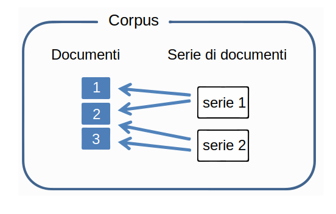
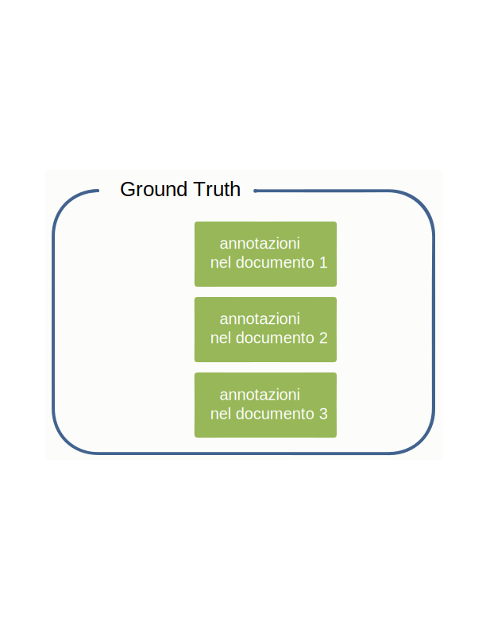
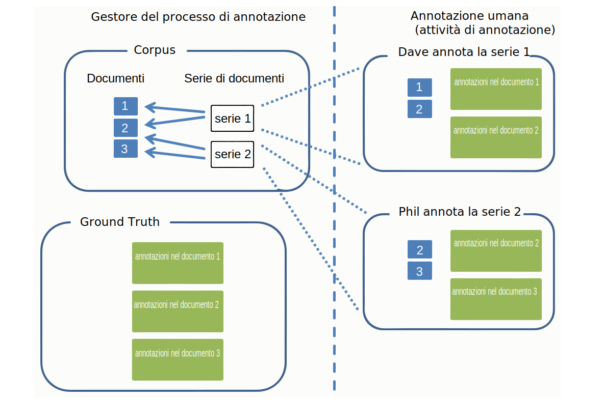

---

copyright:
  years: 2015, 2018
lastupdated: "2018-04-04"

---

{:shortdesc: .shortdesc}
{:new_window: target="_blank"}
{:tip: .tip}
{:pre: .pre}
{:codeblock: .codeblock}
{:screen: .screen}
{:javascript: .ph data-hd-programlang='javascript'}
{:java: .ph data-hd-programlang='java'}
{:python: .ph data-hd-programlang='python'}
{:swift: .ph data-hd-programlang='swift'}

Questa documentazione è per {{site.data.keyword.knowledgestudiofull}} su {{site.data.keyword.cloud}}. Per visualizzare la documentazione della versione precedente di {{site.data.keyword.knowledgestudioshort}} nel {{site.data.keyword.IBM_notm}} Marketplace, [fai clic su questo link ](https://console.bluemix.net/docs/services/knowledge-studio/documents-for-annotation.html){: new_window}.
{: tip}

# Aggiunta di documenti per l'annotazione 
{: #documents-for-annotation}

Per preparare un modello di machine learning, devi aggiungere i documenti che contengono della conoscenza nella materia, come articoli di giornale o altri testi specifici aziendali, al tuo spazio di lavoro.
{: shortdesc}

## Informazioni su quest'attività

Per definire le regole per il modello basato sulla regola, aggiungi o carica i documenti da cui vuoi progettare pattern da definire come regole. Consulta [Aggiunta di documenti per la definizione delle regole](/docs/services/watson-knowledge-studio/rule-annotator-add-doc.html) per ulteriori informazioni. Questa sezione descrive come aggiungere i documenti solo per l'annotazione.

## Documenti
{: #wks_sampledoc}

Per preparare un modello di machine learning, devi raccogliere i documenti rappresentativi per il tuo contenuto di dominio e di alto valore per la tua applicazione.

Cerca di assicurarti che i tuoi documenti di preparazione rappresentino veramente il contenuto di interesse nel tuo dominio; cioè, che contengano molte citazioni rilevanti che possono essere annotate. Per scegliere i documenti migliori, segui queste linee guida:

- Sforzati di fornire una serie di documenti che abbiano una dimensione totale di circa 300.000 parole. Fornisci più parole per un sistema tipo complesso e meno per uno più semplice.
- Limita ogni documento a una pagina o due di contenuto (l'opzione migliore è meno di 2.000 parole e più vicino alle 1.000 per documento). Nelle prime fasi di sviluppo del modello, anche il mantenere ogni documento a pochi paragrafi è una procedura consigliata. Un annotatore umano può contrassegnare le citazioni e le relazioni in un documento lungo, ma tentare di contrassegnare le coreferenze tra più pagine potrebbe essere difficile.
- Assicurati che i dati nei documenti siano distribuiti tra tutti i tipi di entità, sottotipi e ruoli possibili e le relazioni tra essi. Un obiettivo per raggiungere ciò è di avere almeno 50 annotazioni per ogni tipo di entità e di relazione nella raccolta di documenti.
- Inoltre, i documenti dovrebbero rappresentare l'ampiezza della materia che l'applicazione coprirà, ma nel caso di frequenza di ricorrenza distorta dei tipi di entità e di relazione, trova almeno 50 esemplari di ogni tipo, di più per i tipi di entità che hanno citazioni che tendono ad essere frasi.
- La serie che crei per la preparazione deve contenere almeno 10 documenti annotati.

Quando sei pronto a creare e preparare il modello, i documenti che aggiungi allo spazio di lavoro possono essere divisi in serie che vengono utilizzate come dati di preparazione, di test e senza indicazioni. Le serie di dati suddivise sono importanti per valutare le prestazioni del modello.

Puoi aggiungere i documenti nei seguenti modi: 

- Un file CSV a due colonne nel formato UTF-8
- File di testo nel formato UTF-8 
- Un file ZIP che contiene i documenti scaricati da uno spazio di lavoro {{site.data.keyword.knowledgestudioshort}} 
- Un file ZIP che contiene i file nel formato UIMA CAS XMI

### File CSV
{: #wks_sampledoc__wks_samplecsv}

Puoi caricare un file CSV a due colonne che contiene il testo di esempio dalla tua macchina locale. Carica un file CSV alla volta. La prima colonna nel file CSV specifica il nome del file del documento. La seconda colonna nel file contiene il testo del documento. Per un esempio del formato richiesto, consulta il file <a href="https://watson-developer-cloud.github.io/doc-tutorial-downloads/knowledge-studio/documents-new.csv" download>`documents-new.csv`</a> nei file di esempio dell'esercitazione.

### Documenti da un altro spazio di lavoro Watson Knowledge Studio
{: #wks_sampledoc__wks_samplecorpus}

Se hai precedentemente scaricato i documenti da uno spazio di lavoro {{site.data.keyword.knowledgestudioshort}}, puoi caricare il file `ZIP` che hai scaricato. Un'opzione ti permette di specificare se vuoi che le annotazioni ground truth siano incluse nei file importati.

Dopo che i documenti sono stati annotati, vengono archiviati nel formato `JSON`. La lingua di markup in questi file, che mostra come il testo originale era stato analizzato e suddiviso in token, include gli elementi di tutte le annotazioni aggiunte da un annotatore umano. Per migliorare la precisione del modello nel tempo, puoi caricare questi file in un altro spazio di lavoro, quindi preservando tutte le annotazioni esistenti. Un annotatore umano può revisionare, eliminare e aggiungere le annotazioni a questi documenti o puoi ignorare l'annotazione umana e utilizzarli per creare serie di documenti di preparazione, test e senza indicazioni per valutare e migliorare le prestazioni del modello.

### File UIMA CAS XMI
{: #wks_sampledoc__samplexmi}

Come aiuto nella preparazione del modello, puoi caricare i documenti che sono stati pre-annotati da un motore di analisi UIMA. I file pre-annotati devono essere nella serializzazione XMI del formato UIMA Common Analysis Structure (UIMA CAS XMI) e combinati in un file ZIP. Ad esempio, puoi caricare i documenti che sono stati annotati in una raccolta {{site.data.keyword.IBM_notm}} {{site.data.keyword.watson}} Explorer.

Un annotatore umano può revisionare, eliminare e aggiungere le annotazioni a questi documenti o puoi ignorare l'annotazione umana e utilizzarli per creare serie di documenti di preparazione, test e senza indicazioni per valutare e migliorare le prestazioni del modello. Per i dettagli su come creare questi file e i requisiti per caricarli, vedi [Caricamento dei documenti pre-annotati](/docs/services/watson-knowledge-studio/preannotation.html#wks_uima).

### Rendere anonimi i dati

Se vuoi creare un modello ottimizzato per i tuoi dati, ma non vuoi caricare i dati come sono in {{site.data.keyword.knowledgestudioshort}} per motivi di privacy, puoi prima eliminare dai documenti tutte le informazioni identificabili personalmente (PII) e poi utilizzare questi documenti resi anonimi per preparare il modello. Non censurare le informazioni o sostituirle con le variabili globalmente. Per migliori risultati, sostituisci le informazioni reali con informazioni false dello stesso tipo.

Ad esempio, se il PII che vuoi proteggere sono i nomi dei clienti, invece di censurare ogni nome o sostituirlo con una variabile, come *USER_NAME*, sostituiscilo con un nome falso che utilizza molti stili di sintassi dei nomi tipici, come *Jane Doe*, *Mr. Smith*, *Dietrich* o *Dr. Jones, PhD*. Considera di scrivere uno script che concatena molti nomi e cognomi e titoli e cognomi e aggiunge i cognomi solo per creare nomi falsi che possono essere inseriti nel documento per sostituire le istanze di nomi utente reali. L'obiettivo è di simulare il più vicino possibile i valori reali nei documenti di origine. Se lo stesso testo (USER_NAME) viene utilizzato nei documenti o il testo viene censurato, starai sostanzialmente preparando il modello ad aspettarsi che tutti i nomi abbiano lo stesso valore o che siano censurati. Quando il modello viene utilizzato al runtime per i nuovi documenti e incontra nomi mai visti prima in tutta la loro variabilità, vuoi che sia in grado di riconoscerli come nomi.

## Aggiunta di documenti a uno spazio di lavoro
{: #wks_projadd}

Per preparare un modello, devi aggiungere i documenti che rappresentano il tuo contenuto del dominio al tuo spazio di lavoro. 

### Informazioni su quest'attività

Come procedura consigliata, inizia con una raccolta di documenti relativamente piccola. Utilizza questi documenti per preparare gli annotatori umani (se il tuo spazio di lavoro comporta l'annotazione umana) e per rifinire le linee guida di annotazione. Documenti piccoli possono aiutare gli annotatori umani a identificare le catene di coreferenze attraverso il documento. Come migliora l'accuratezza dell'annotazione, puoi aggiungere ulteriori documenti al corpus per fornire una maggiore profondità al lavoro di preparazione.

### Procedura

Per aggiungere i documenti a uno spazio di lavoro: 

1. Accedi come amministratore o gestore del progetto {{site.data.keyword.knowledgestudioshort}} e seleziona il tuo spazio di lavoro.
1. Seleziona la scheda **Assets & Tools** > **Documents** > **Documentation sets**.
1. Fai clic su **Upload Document Sets** per aggiungere i documenti al corpus.
1. Carica i documenti in uno dei seguenti formati: Puoi caricare un tipo di file alla volta.

    <table border="1" frame="hsides" rules="rows" cellpadding="4" cellspacing="0" summary="Ogni riga in questa tabella descrive una opzione per una scelta." class="simpletable choicetable choicetableborder">
      <thead><tr><th id="d31095e284-option" valign="bottom" align="left" class="ncol thleft thbot">Opzione</th>
          <th id="d31095e284-desc" valign="bottom" align="left" class="ncol thleft thbot">Descrizione </th></tr></thead>
      <tbody><tr class="strow chrow"><td valign="top" headers="d31095e284-option" id="d31095e286" class="stentry choption ncol">
<strong>File CSV</strong>
</td>
          <td valign="top" headers="d31095e284-desc d31095e286" class="stentry chdesc ncol">
Trascina un solo file CSV che contiene i tuoi documenti di esempio o fai clic per individuare il file nel
              tuo sistema locale e poi fai clic su <b>Upload</b>. Le prima colonna nel file CSV
              specifica il nome del file del documento. La seconda colonna nel file contiene il testo del documento.
              Il file CSV deve essere nel formato UTF-8.
</td>
        </tr>
        <tr class="strow chrow"><td valign="top" headers="d31095e284-option" id="d31095e294" class="stentry choption ncol">
<strong>File di testo</strong>
</td>
          <td valign="top" headers="d31095e284-desc d31095e294" class="stentry chdesc ncol">
Trascina uno più file di testo dal tuo sistema locale o fai clic per individuare e selezionare i file
              e poi fai clic su <b>Upload</b>. I file di testo devono essere nel formato UTF-8.
</td>
        </tr>
        <tr class="strow chrow"><td valign="top" headers="d31095e284-option" id="d31095e302" class="stentry choption ncol">
<strong>File DOCXML</strong>
</td>
          <td valign="top" headers="d31095e284-desc d31095e302" class="stentry chdesc ncol">
Trascina uno più file <code>DOCXML</code> dal tuo sistema locale o fai clic per individuare e selezionare i file
              e poi fai clic su<b>Upload</b>. I file <code>DOCXML</code>
              devono essere documenti che sono stati scaricati da altri modelli di machine learning e devono essere nel formato
              UTF-8. Questi documenti non vengono risuddivisi in token al caricamento.
</td>
        </tr>
        <tr class="strow chrow"><td valign="top" headers="d31095e284-option" id="d31095e316" class="stentry choption ncol">
<strong>File ZIP</strong>
</td>
          <td valign="top" headers="d31095e284-desc d31095e316" class="stentry chdesc ncol">
Se hai precedentemente scaricato i documenti da uno spazio di lavoro
              Watson Knowledge
              Studio,
              trascina il file
              <code>ZIP</code> che contiene i documenti scaricati o fai clic per individuare e selezionare il
              file. Se vuoi includere le annotazioni aggiunte ai documenti prima che sono stati scaricati,
              assicurati che l'opzione per includere il ground truth sia selezionata prima di fare clic su
              <b>Upload</b>. Saranno importate solo le annotazioni che sono state promosse a ground truth prima che sono stati scaricati i
              documenti. 

<b>Limitazione:</b> quando vengono importati i documenti annotati,
              vengono risuddivisi in token. Questo processo può modificare cosa
              Watson Knowledge
              Studio
              considera essere i limiti
              della frase in essi. Poiché le annotazioni sono definite per frase, potrebbe essere annullata la validità di alcune di esse
              durante questo processo. Dopo aver caricato i documenti da un altro spazio di lavoro, dai una rapida controllata
              alle annotazioni per risolvere eventuali discrepanze. 

            
Devi caricare il sistema tipo dallo spazio di lavoro
              originale nel corrente prima di caricare le annotazioni ground truth. Per i dettagli,
              consulta [Caricamento delle risorse da un altro spazio di lavoro ](exportimport.html){: new_window}.

            
Se hai precedentemente scaricato i documenti annotati
              nel formato
              UIMA
              CAS XMI, puoi
              caricare il file <code>ZIP</code> che contiene il contenuto analizzato. Specifica che è il
              tipo di contenuto che vuoi caricare prima di far clic su <b>Upload</b>. Per i dettagli su
              come creare questi file e requisiti per caricarli, consulta [Caricamento dei documenti pre-annotati ](preannotation.html#wks_uima){: new_window}.

          </td>
        </tr>
      </tbody>
    </table>

1. Dopo che i documenti sono stati aggiunti, fai clic sui nomi del documento per visualizzarne un'anteprima e verificare che il contenuto sembri OK. Ad esempio, verifica che i file di testo siano nel formato UTF-8 e che non siano visibili problemi di normalizzazione del carattere o segni diacritici nei documenti e controlla le interruzioni della frase. Se è presente un problema, potresti dover pre-elaborare i file prima di aggiungerli al corpus. Vuoi che i documenti siano il più puliti e ben formati possibile prima che il dizionario o l'annotazione umana inizi.

### Operazioni successive

Prima di iniziare qualsiasi attività di annotazione umana, dividi il corpus in più serie documenti e assegnale agli annotatori umani.

## Creazione e assegnazione delle serie di annotazioni
{: #wks_projdocsets}

Dopo aver aggiunto i documenti, dividili in serie in modo che possono essere annotati da più annotatori umani. Per vedere i punteggi dell'accordo tra annotatori, devi assegnare almeno due annotatori umani e specificare una percentuale di sovrapposizione dei documenti tra le serie.

### Prima di cominciare

- Devi caricare le serie di documenti prima di poterle dividere in serie di annotazioni.
- Devi creare gli account utente in {{site.data.keyword.knowledgestudioshort}} per tutti gli annotatori umani che lavoreranno in questo spazio di lavoro.

### Informazioni su quest'attività

> **Attenzione:** se utilizzi il browser Google Chrome, non puoi caricare un grande numero di file (come ad esempio più di 300) selezionandoli da una cartella. La soluzione temporanea è di utilizzare il browser Firefox o di selezionare un numero più piccolo di file e caricarli in più volte.

Puoi creare un massimo di 1.000 serie di annotazioni per spazio di lavoro.

### Procedura

Per creare un serie di annotazioni: 

1. Accedi come amministratore o gestore del progetto {{site.data.keyword.knowledgestudioshort}} e seleziona il tuo spazio di lavoro.
1. Seleziona la scheda **Assets & Tools** > **Documents** > **Annotation sets**.
1. Fai clic su **Create Annotation Sets**.

    1. Per la serie di base, seleziona la raccolta di documenti che vuoi dividere in serie di annotazioni, tutti i documenti nel corpus o i documenti che sono stati precedentemente assegnati a una serie di documenti.

    1. Per il valore di sovrapposizione, specifica la percentuale di documenti che vuoi includere in ogni serie di annotazioni. I punteggi dell'accordo tra annotatori non possono essere calcolati a meno che due o più annotatori annotino gli stessi documenti. Ad esempio, se specifichi un valore di sovrapposizione del 20% per un corpus che contiene 30 documenti e lo dividi in 3 serie di documenti, 6 documenti (20%) saranno annotati da tutti gli annotatori umani. I rimanenti 24 documenti saranno suddivisi tra 3 annotatori umani (8 ognuno). Quindi, ogni annotatore riceve 14 documenti da annotare (6+8).

    > **Nota:** una serie di annotazioni che pensi di utilizzare per preparare un modello di machine learning deve contenere almeno 10 documenti annotati.

    1. Seleziona un nome utente dall'elenco di annotatori umani.

        > **Nota:** se hai una sottoscrizione di piano gratuito, associa anche te stesso alla serie di annotazioni. Non puoi aggiungere altri utenti e assegnar loro il ruolo di annotatore umano. Ma aggiungendo te stesso, puoi ricoprire il ruolo di un annotatore umano e verificare come un annotatore umano reale potrebbe interagire con l'editor ground truth per annotare i documenti.

    1. Nome della serie di annotazioni.

        Come buona prassi per la valutazione del lavoro di un annotatore umano con l'avanzamento dello spazio di lavoro, potresti voler creare dei nomi della serie di annotazioni che identificano l'annotatore umano assegnato alla serie. Non puoi modificare il nome della serie di annotazioni dopo che è stata creata.

1. Dopo che hai finito di assegnare tutti gli annotatori umani che lavoreranno in questo spazio di lavoro, fai clic su **Generate** per creare le serie di annotazioni. Quando gli annotatori umani accedono all'editor ground truth, visualizzano solo le serie di annotazioni che sono state assegnate loro.

**Attività correlate**:

[Assemblaggio di un team](/docs/services/watson-knowledge-studio/team.html)

## Eliminazione di documenti
{: #wks_projdelete}

Puoi rimuovere un documento se determini che non rappresenta del testo di settore standard di cui avrà un beneficio il modello.

### Procedura

Per eliminare un documento, completa la seguente procedura:

1. Accedi come amministratore {{site.data.keyword.knowledgestudioshort}} e seleziona il tuo spazio di lavoro. 
1. Seleziona la scheda **Assets & Tools** > **Documents** > **Document sets**.
1. Trova il documento che vuoi rimuovere e poi fai clic su **Delete**.
1. Non puoi eliminare un documento incluso in una serie di annotazioni che è stata associata a un'attività di annotazione. Se il documento fa parte di una serie di annotazioni ma non è stato ancora associato a un'attività, puoi eliminarlo seguendo i passi precedenti.

    Completa una delle seguenti attività se il documento è associato a un'attività di annotazione: 
    - Se gli annotatori umani non hanno iniziato ad annotare i documenti, elimina l'attività di annotazione e poi elimina il documento. Per eliminare un'attività di annotazione, apri la scheda **Assets & Tools** > **Documents** > **Tasks**, trova l'attività di annotazione a cui è associato il documento, fai clic sull'icona **Show menu** nell'attività e poi su **Delete**. Successivamente, puoi ricreare l'attività di annotazione e associare la stessa serie, che ora ha un documento di meno in essa.
    - Se gli annotatori umani hanno iniziato ad annotare i documenti, non eliminare l'attività o perderai il loro lavoro. Puoi dirgli di continuare a lavorare, ma di ignorare il documento non desiderato nella serie. Quando hanno finito tutto il lavoro di annotazione, passa attraverso il processo di aggiunta della serie al ground truth. Dopo l'aggiunta, ma prima che qualcuno esegua il modello di machine learning, elimina il documento non desiderato. Non vuoi utilizzare il documento non annotato per preparare un modello perché il modello di machine learning impara più da quello che non viene annotato rispetto a cosa lo viene. Puoi ora liminare il documento non desiderato, che fa al momento parte del ground truth, dalla scheda **Assets & Tools** > **Documents** > **Document sets**.

## Modello dati 
{: #wks_datamodel}

I diagrammi in questo argomento riepilogano il flusso di documenti in un sistema {{site.data.keyword.knowledgestudioshort}} e le differenze tra i documenti nel corpus, un'attività di annotazione e il ground truth.

Il corpus contiene i documenti, che sono partizionati in serie di documenti:

- Un documento non è nulla più che stringhe di testo.
- Una serie di documenti è un puntatore a un gruppo di documenti. La serie di documenti non contiene copie dei documenti stessi.
- Alcune serie di documenti possono puntare a un solo documento, una configurazione che puoi controllare tramite il parametro di sovrapposizione che specifichi quando crei le serie di annotazioni.

 Figura 1. Questa figura illustra due serie di documenti che puntano a tre documenti. I documenti vengono divisi tra le serie. 

Ground truth comprende le annotazioni (citazioni, relazioni e citazioni di coreferenza) che vengono aggiunte ai documenti. Ground truth è unico per ciascun documento.

 Figura 2. Questa figura illustra che ground truth è formato dalle citazioni che sono state aggiunte a documento 1, 2 ,3 e così via.

Quando crei un'attività di annotazione, vengono create le copie delle annotazioni per ogni documento nella serie di annotazioni che aggiungi all'attività. Gli annotatori umani annotano i documenti. Le annotazioni vengono isolate tra loro e dal ground truth. Un'attività di annotazione è un concetto temporale che esiste per consentire agli annotatori umani di annotare il testo in spazi isolati. Al contrario, ground truth è permanente e unico.

 Figura 2. Questa figura illustra che il gestore del progetto crea le serie di annotazioni e le assegna a un'attività di annotazione. Dave e Phil, gli annotatori umani, annotano i documenti nelle serie assegnate loro. 

Dopo che il gestore del progetto approva le serie di annotazioni in un'attività di annotazione, le annotazioni nei documenti che non si sovrappongono ad altre serie di annotazioni diventano ground truth. Per i documenti che si sovrappongono tra le serie di annotazioni (rappresentati dal documento 2 in questo esempio), il gestore del progetto deve giudicare e risolvere i conflitti. Le annotazioni nei documenti di sovrapposizione non diventano ground truth finché non vengono approvate tramite il giudizio.

Ground truth viene poi utilizzato per la preparazione e la verifica di un modello di machine learning o può essere utilizzato come base per la prossima iterazione con lo sviluppo del modello. Per utilizzare ground truth in una nuova iterazione, devi creare una nuova attività di annotazione.

 Figura 3. Questa figura illustra come le annotazioni aggiunte da due annotatori umani diventano ground truth. Un documento, etichettato documento 2, viene annotato da entrambi gli annotatori umani.  Le annotazioni in questo documento di sovrapposizione devono essere giudicate prima di diventare ground truth. 
