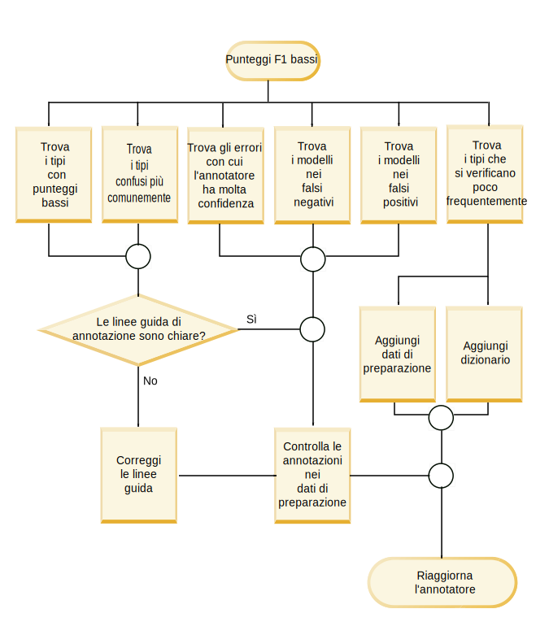
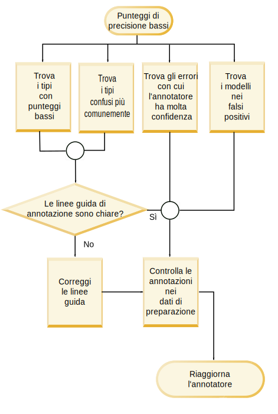

---

copyright:
  years: 2015, 2018
lastupdated: "2018-08-03"

---

{:shortdesc: .shortdesc}
{:new_window: target="_blank"}
{:tip: .tip}
{:pre: .pre}
{:codeblock: .codeblock}
{:screen: .screen}
{:javascript: .ph data-hd-programlang='javascript'}
{:java: .ph data-hd-programlang='java'}
{:python: .ph data-hd-programlang='python'}
{:swift: .ph data-hd-programlang='swift'}

Questa documentazione è per {{site.data.keyword.knowledgestudiofull}} su {{site.data.keyword.cloud}}. Per visualizzare la documentazione della versione precedente di {{site.data.keyword.knowledgestudioshort}} nel {{site.data.keyword.IBM_notm}} Marketplace, [fai clic su questo link ](https://console.bluemix.net/docs/services/knowledge-studio/evaluate-ml.html){: new_window}.
{: tip}

# Analisi delle prestazioni del modello di machine learning
{: #evaluate-ml}

Controlla le annotazioni che sono state aggiunte dal modello preparato per determinare se deve essere effettuata una qualsiasi modifica al modello per migliorare la sua capacità di trovare citazioni di entità, citazioni di relazioni e coreferenze valide nei documenti.
{: shortdesc}

## Informazioni su quest'attività
{: #evaluate-ml_about}

Puoi analizzare le prestazioni visualizzando un riepilogo delle statistiche dei tipi di entità, dei tipi di relazione e delle citazioni con coreferenza. Puoi inoltre analizzare le statistiche presentate in una *matrice di confusione*. La matrice di confusione ti aiuta a confrontare le annotazioni aggiunte dal modello di machine learning alle annotazioni nel ground truth.

Le statistiche del modello forniscono le seguenti metriche:

- **Punteggio F1**

    Una misurazione che considera sia la precisione che il richiamo per calcolare il punteggio. Il punteggio F1 può essere interpretato come una media ponderata dei valori di precisione e richiamo, dove un punteggio F1 raggiunge il suo migliore valore con 1 e il peggiore con 0. Consulta [Analisi dei punteggi F1 bassi](/docs/services/watson-knowledge-studio/evaluate-ml.html#evaluate-mllowf1).

- **Precisione**

    Una misurazione che specifica quale frazione dell'output del modello di machine learning è stata accurata in confronto all'output dell'annotatore umano. La precisione viene determinata dal numero di annotazioni etichettate correttamente diviso il numero totale di annotazioni aggiunte dal modello di machine learning. Un punteggio di precisione di 1.0 per il tipo di entità A significa che tutte le citazioni che sono state etichettate come tipo di entità A appartengono veramente a tale classificazione. Un punteggio di precisione basso ti aiuta a identificare dove il modello di machine learning ha creato annotazioni non corrette. Il punteggio non dice nulla di quante altre citazioni che sono state etichettate come tipo di entità A dall'annotatore umano sono state sbagliate dal modello di machine learning; il punteggio di richiamo riflette tali informazioni. Consulta [Analisi dei punteggi di precisione bassi](/docs/services/watson-knowledge-studio/evaluate-ml.html#evaluate-mllowp).

- **Richiamo**

    Una misurazione che specifica quante citazioni che dovrebbero essere state annotate da un'etichetta selezionata sono state al momento annotate con tale etichetta - le citazioni *right* potrebbero essere quelle che gli annotatori umani hanno identificato negli stessi documenti. Il richiamo viene determinato dal numero di annotazioni etichettate correttamente diviso il numero di annotazioni che dovrebbero essere state create. Un punteggio di richiamo di 1.0 significa che tutte le citazioni che dovrebbero essere state etichettate come tipo di entità A lo sono state correttamente. Un punteggio di richiamo basso ti aiuta a identificare dove il modello di machine learning non è riuscito a creare un'annotazione che avrebbe dovuto avere. Il punteggio non dice nulla di quante altre citazioni sono state etichettate come tipo di entità A, ma non lo dovrebbero essere state; il punteggio di precisione riflette tali informazioni. Consulta [Analisi dei punteggi di richiamo bassi](/docs/services/watson-knowledge-studio/evaluate-ml.html#evaluate-mllowr).

- **Percentuale di annotazioni totale**

    Una misurazione del ground truth che mostra quante parole sono state annotate con un tipo di entità o di relazione selezionato rispetto al numero totale di parole che sono state annotate come un tipo di entità o di relazione nella serie di documenti di test. Questa statistica non è disponibile per le citazioni di coreferenza. Questo valore può aiutarti a vedere quanto prevalentemente le citazioni di un tipo vengono confrontate con gli altri tipi nel tuo ground truth.

- **Percentuale della densità del corpus (per numero di parole)**

    Una misurazione del ground truth che mostra il numero di parole che sono state annotate con un tipo di entità o di relazione fornito rispetto al numero totale di parole, se annotate o meno. Questa statistica non è disponibile per le citazioni di coreferenza. Questo valore può aiutarti a vedere quanto prevalentemente le citazioni di questo tipo vengono confrontate con tutte le altre parole nei tuoi documenti del dominio.

- **Percentuale di documenti che contengono il tipo**

    Una misurazione del ground truth che mostra quanti documenti contengono un tipo di entità o di relazione selezionato. Questa statistica non è disponibile per le citazioni di coreferenza. Questo valore può aiutarti a valutare se i documenti nella serie rappresentano il dominio in modo sufficiente. Se la percentuale è bassa per i tipi di entità chiave, potresti voler aggiungere ulteriori documenti con le citazioni dei tipi meno rappresentati.

## Procedura
{: #evaluate-ml_procedure}

Per visualizzare le statistiche delle prestazioni su quanto bene è stato preparato il modello:

1. Accedi come amministratore o gestore del progetto {{site.data.keyword.knowledgestudioshort}} e seleziona il tuo spazio di lavoro.
1. Seleziona **Machine Learning Model** > **Performance**.
1. Per le citazioni, le relazioni o le coreferenze, seleziona il link **Detailed Statistics**.
1. Nella vista **Summary**, specifica se vuoi valutare i dati di test o di preparazione e quindi specifica il tipo di citazioni di cui vuoi vedere le statistiche: tipi di entità, tipi di relazione o citazioni con coreferenza. Quando scorri attraverso i dati, gli elementi che hanno punteggi bassi vengono contrassegnati e evidenziati per indicare che richiedono indagini e miglioramenti. L'icona di avvertenza a forma di triangolo indica che il valore F1 è inferiore al valore stabilito, 0.5.

    Ad esempio, il punteggio F1 di alcuni tipi di entità potrebbe essere alto perché il documento è stato annotato tramite la pre-annotazione nonché da un annotatore umano. Ma il punteggio F1 di altri tipi di entità potrebbe essere basso perché le differenze nella formulazione e su come gli annotatori umani interpretano il testo o le linee guida, rende più difficile al modello di machine learning di riconoscere il pattern e applicare l'annotazione corretta.

1. Nella vista **Confusion Matrix** dei dati di test, specifica il tipo di annotazioni di cui vuoi vedere le statistiche: tipi di entità o di relazione. Per ogni tipo di entità o di relazione:

    - Ogni riga nella matrice mostra il ground truth (i tipi di entità o di relazione aggiunti da un annotatore umano).
    - Ogni colonna nella matrice mostra i risultati della decodifica (i token di annotazioni aggiunti dal modello di machine learning).
    - I numeri di ogni cella rappresentano il numero di token di annotazioni per citazione, non le ricorrenze della citazione.

        I token sono utilizzati per delineare le stringhe di testo. Corrispondono vagamente alle parole. Una citazione può contenere più di un token. Ad esempio, *Barack Obama* è una citazione che contiene due token. Nella riga o colonna PERSON, dovrebbe essere utilizzato un valore di 2 per rappresentare la singola citazione di *Barack Obama* in un documento. Il numero di token corrisponde solo vagamente al numero di parole perché i token sono contati in modo differente in alcune situazioni. Ad esempio, la punteggiatura alla fine di una frase viene contata come un token e le contrazioni sono spesso espanse in due token.

    - La colonna etichettata **O** identifica i token che dovrebbero essere stati annotati dal modello di machine learning come il tipo identificato nella riga di intersezione (l'annotazione umana), ma non sono stati annotati come alcun tipo.
    - Il valore **N/A** viene mostrato quando non esistono annotazioni per un tipo selezionato nelle serie di documenti. Ad esempio, se non esiste alcuna citazione PERSON nelle serie di documenti che sono state annotate per il ground truth o come dati di test, i punteggi per il tipo di entità PERSON sono N/A.

    Ad esempio, la seguente matrice di confusione mostra i risultati di un modello di machine learning in esecuzione sui documenti che trattano di incidenti stradali.

    <table summary="Esempio di matrice di confusione sul report di incidenti">
       <caption>Tabella 1. Esempio di matrice di confusione</caption>
       <tr>
        <th style="vertical-align:bottom; text-align:left" id="d15356e164">Tipi di entità</th>
        <th style="vertical-align:bottom; text-align:center" id="d15356e166">MANUFACTURER</th>
        <th style="vertical-align:bottom; text-align:center" id="d15356e168">MODEL</th>
        <th style="vertical-align:bottom; text-align:center" id="d15356e170">O</th>
      </tr>
      <tr>
        <td style="vertical-align:top; text-align:left" headers="d15356e164">MANUFACTURER</td>
        <td style="vertical-align:top; text-align:center" headers="d15356e166">515</td>
        <td style="vertical-align:top; text-align:center" headers="d15356e168">5</td>
        <td style="vertical-align:top; text-align:center" headers="d15356e170">44</td>
      </tr>
    </table>
    {: #evaluate-ml__datasimpletable_yms_hff_cw}

    Puoi imparare le seguenti cose da questa matrice:
    - Il modello ha correttamente riconosciuto 515 token come citazioni del tipo di entità MANUFACTURER.
    - Il modello ha etichettato non correttamente 5 token come citazioni del tipo MODEL che invece dovrebbero essere MANUFACTURER.
    - 44 token hanno compreso le citazioni del tipo MANUFACTURER che il modello non è riuscito ad annotare come alcun tipo di entità.

    Quando valuti le prestazioni del modello e visualizzi i risultati della decodifica, puoi iniziare investigando sui token che sono stati etichettati male o completamenti persi.

## Scheda di riferimento del miglioramento delle prestazioni
{: #evaluate-ml_cheat}

Utilizza questa scheda di riferimento per aiutarti a determinare i passi che puoi eseguire per migliorare le prestazioni del modello di machine learning.

È difficile dettare le regole per migliorare i punteggi delle prestazioni che dovrebbero essere applicate tra i domini, dove la complessità del sistema tipo, l'appropriatezza dei documenti di preparazione, le capacità dell'annotatore umano e altri fattori influenzano il risultato. Tuttavia, la seguente tabella può aiutarti a effettuare una valutazione iniziale e a intraprendere azioni per migliorare le prestazioni, specialmente durante le prime fasi dello sviluppo e del test del modello.

La seguente tabella suggerisce le correzioni ai problemi delle prestazioni del modello di machine learning più comuni.

<table summary="La tabella elenca i problemi comuni nella prima colonna e le correzioni suggerite nella prima riga. La X indica quale correzione applicare a quale problema.">
    <caption>Tabella 2. Correzioni ai problemi di prestazioni comuni </caption>
    <tr>
      <th style="vertical-align:bottom; text-align:left" id="d15356e221">Problema</th>
      <th style="vertical-align:bottom; text-align:center" id="d15356e223">Aggiungi dizionari</th>
      <th style="vertical-align:bottom; text-align:center" id="d15356e225">Modifica serie di documenti</th>
      <th style="vertical-align:bottom; text-align:center" id="d15356e227">Aggiungi documenti specifici per tipo</th>
      <th style="vertical-align:bottom; text-align:center" id="d15356e229">Annota ulteriore corpus</th>
      <th style="vertical-align:bottom; text-align:center" id="d15356e231">Correggi annotazioni umane</th>
      <th style="vertical-align:bottom; text-align:center" id="d15356e233">Migliora le linee guida dell'annotatore umano</th>
      <th style="vertical-align:bottom; text-align:center" id="d15356e235">Aggiorna sistema tipo</th>
      <th style="vertical-align:bottom; text-align:center" id="d15356e237">Investiga ulteriormente</th>
    </tr>
    <tr>
      <td style="vertical-align:top; text-align:left" headers="d15356e221">F1 basso</td>
      <td style="vertical-align:top; text-align:center" headers="d15356e223">X</td>
      <td style="vertical-align:top; text-align:center" headers="d15356e225">X</td>
      <td style="vertical-align:top; text-align:center" headers="d15356e227">X</td>
      <td style="vertical-align:top; text-align:center" headers="d15356e229">X</td>
      <td style="vertical-align:top; text-align:center" headers="d15356e231">X</td>
      <td style="vertical-align:top; text-align:center" headers="d15356e233">X</td>
      <td style="vertical-align:top; text-align:center" headers="d15356e235">X</td>
      <td style="vertical-align:top; text-align:center" headers="d15356e237">X</td>
    </tr>
    <tr>
      <td style="vertical-align:top; text-align:left" headers="d15356e221">Precisione bassa</td>
      <td style="vertical-align:top; text-align:center" headers="d15356e223"></td>
      <td style="vertical-align:top; text-align:center" headers="d15356e225"></td>
      <td style="vertical-align:top; text-align:center" headers="d15356e227"></td>
      <td style="vertical-align:top; text-align:center" headers="d15356e229">X</td>
      <td style="vertical-align:top; text-align:center" headers="d15356e231">X</td>
      <td style="vertical-align:top; text-align:center" headers="d15356e233">X</td>
      <td style="vertical-align:top; text-align:center" headers="d15356e235">X</td>
      <td style="vertical-align:top; text-align:center" headers="d15356e237">X</td>
    </tr>
    <tr>
      <td style="vertical-align:top; text-align:left" headers="d15356e221">Richiamo basso</td>
      <td style="vertical-align:top; text-align:center" headers="d15356e223">X</td>
      <td style="vertical-align:top; text-align:center" headers="d15356e225">X</td>
      <td style="vertical-align:top; text-align:center" headers="d15356e227">X</td>
      <td style="vertical-align:top; text-align:center" headers="d15356e229">X</td>
      <td style="vertical-align:top; text-align:center" headers="d15356e231"></td>
      <td style="vertical-align:top; text-align:center" headers="d15356e233"></td>
      <td style="vertical-align:top; text-align:center" headers="d15356e235"></td>
      <td style="vertical-align:top; text-align:center" headers="d15356e237"></td>
    </tr>
    <tr>
      <td style="vertical-align:top; text-align:left" headers="d15356e221">Annotazione bassa %</td>
      <td style="vertical-align:top; text-align:center" headers="d15356e223"></td>
      <td style="vertical-align:top; text-align:center" headers="d15356e225">X</td>
      <td style="vertical-align:top; text-align:center" headers="d15356e227">X</td>
      <td style="vertical-align:top; text-align:center" headers="d15356e229">X</td>
      <td style="vertical-align:top; text-align:center" headers="d15356e231"></td>
      <td style="vertical-align:top; text-align:center" headers="d15356e233"></td>
      <td style="vertical-align:top; text-align:center" headers="d15356e235"></td>
      <td style="vertical-align:top; text-align:center" headers="d15356e237"></td>
    </tr>
    <tr>
      <td style="vertical-align:top; text-align:left" headers="d15356e221">Densità bassa</td>
      <td style="vertical-align:top; text-align:center" headers="d15356e223"></td>
      <td style="vertical-align:top; text-align:center" headers="d15356e225">X</td>
      <td style="vertical-align:top; text-align:center" headers="d15356e227">X</td>
      <td style="vertical-align:top; text-align:center" headers="d15356e229">X</td>
      <td style="vertical-align:top; text-align:center" headers="d15356e231"></td>
      <td style="vertical-align:top; text-align:center" headers="d15356e233"></td>
      <td style="vertical-align:top; text-align:center" headers="d15356e235"></td>
      <td style="vertical-align:top; text-align:center" headers="d15356e237"></td>
    </tr>
    <tr>
      <td style="vertical-align:top; text-align:left" headers="d15356e221">Pochi documenti del tipo</td>
      <td style="vertical-align:top; text-align:center" headers="d15356e223"></td>
      <td style="vertical-align:top; text-align:center" headers="d15356e225"></td>
      <td style="vertical-align:top; text-align:center" headers="d15356e227">X</td>
      <td style="vertical-align:top; text-align:center" headers="d15356e229">X</td>
      <td style="vertical-align:top; text-align:center" headers="d15356e231"></td>
      <td style="vertical-align:top; text-align:center" headers="d15356e233"></td>
      <td style="vertical-align:top; text-align:center" headers="d15356e235">X</td>
      <td style="vertical-align:top; text-align:center" headers="d15356e237"></td>
    </tr>
    <tr>
      <td style="vertical-align:top; text-align:left" headers="d15356e221">Categorizzazione non corretta</td>
      <td style="vertical-align:top; text-align:center" headers="d15356e223">X</td>
      <td style="vertical-align:top; text-align:center" headers="d15356e225"></td>
      <td style="vertical-align:top; text-align:center" headers="d15356e227"></td>
      <td style="vertical-align:top; text-align:center" headers="d15356e229"></td>
      <td style="vertical-align:top; text-align:center" headers="d15356e231"></td>
      <td style="vertical-align:top; text-align:center" headers="d15356e233"></td>
      <td style="vertical-align:top; text-align:center" headers="d15356e235">X</td>
      <td style="vertical-align:top; text-align:center" headers="d15356e237"></td>
    </tr>
    <tr>
      <td style="vertical-align:top; text-align:left" headers="d15356e221">Annotazioni perse </td>
      <td style="vertical-align:top; text-align:center" headers="d15356e223">X</td>
      <td style="vertical-align:top; text-align:center" headers="d15356e225"></td>
      <td style="vertical-align:top; text-align:center" headers="d15356e227"></td>
      <td style="vertical-align:top; text-align:center" headers="d15356e229">X</td>
      <td style="vertical-align:top; text-align:center" headers="d15356e231"></td>
      <td style="vertical-align:top; text-align:center" headers="d15356e233"></td>
      <td style="vertical-align:top; text-align:center" headers="d15356e235"></td>
      <td style="vertical-align:top; text-align:center" headers="d15356e237"></td>
    </tr>
    <tr>
      <td style="vertical-align:top; text-align:left" headers="d15356e221">Differenza tra i risultati di preparazione e test </td>
      <td style="vertical-align:top; text-align:center" headers="d15356e223"></td>
      <td style="vertical-align:top; text-align:center" headers="d15356e225">X</td>
      <td style="vertical-align:top; text-align:center" headers="d15356e227"></td>
      <td style="vertical-align:top; text-align:center" headers="d15356e229"></td>
      <td style="vertical-align:top; text-align:center" headers="d15356e231"></td>
      <td style="vertical-align:top; text-align:center" headers="d15356e233"></td>
      <td style="vertical-align:top; text-align:center" headers="d15356e235"></td>
      <td style="vertical-align:top; text-align:center" headers="d15356e237"></td>
    </tr>
    <tr>
      <td style="vertical-align:top; text-align:left" headers="d15356e221">F1 basso per i dati di preparazione di test</td>
      <td style="vertical-align:top; text-align:center" headers="d15356e223"></td>
      <td style="vertical-align:top; text-align:center" headers="d15356e225"></td>
      <td style="vertical-align:top; text-align:center" headers="d15356e227"></td>
      <td style="vertical-align:top; text-align:center" headers="d15356e229"></td>
      <td style="vertical-align:top; text-align:center" headers="d15356e231">X</td>
      <td style="vertical-align:top; text-align:center" headers="d15356e233">X</td>
      <td style="vertical-align:top; text-align:center" headers="d15356e235"></td>
      <td style="vertical-align:top; text-align:center" headers="d15356e237">X</td>
    </tr>
</table>
{: #evaluate-ml_cheat__datasimpletable_nhm_5ym_cw}

### Descrizione delle correzioni
{: #evaluate-ml_fixes}

- **Aggiungi dizionari**

    Un dizionario contiene i formati di superficie di esempio di un tipo di entità fornito. Potresti dover aggiungere un nuovo dizionario o ulteriori entità a un dizionario esistente se le statistiche di preparazione mostrano che quelle annotazioni del tipo si verificano poco frequentemente nei dati di preparazione. Se sai che quel tipo di entità è la chiave al dominio e che si verifica spesso, l'omissione potrebbe indicare che i formati di superficie associati al tipo che *sono* presenti nei dati di preparazione non stanno venendo riconosciuti dal modello di machine learning. Fornendo più esempi del formato di superficie puoi risolvere questo problema.

- **Modifica serie di documenti**

    Assicurati di avere abbastanza dati di preparazione generali. Per imparare, un modello di machine learning ha bisogno di abbastanza contenuto. Mira a fornire circa 300.000 parole. (Puoi eseguire uno strumento di conteggio delle parole sui tuoi documenti di origine per controllare la quantità). Se la tua serie di preparazione è troppo piccola, aggiungi documenti al corpus. Non basta avere una manciata di documenti che preparano ogni relazione o tipo di entità importante; vuoi molti documenti che illustrano come vengono utilizzati questi tipi nella letteratura tipica del dominio.
  - Assicurati che l'assortimento di documenti utilizzato per il test e la preparazione sia simile. Ad esempio, non utilizzare i documenti da un'origine dati per la serie di dati di test e i documenti da un'altra per la serie di dati di preparazione. Origini dati differenti potrebbero rappresentare le informazioni sul tipo di entità e relazione in modi completamente diversi. È meglio utilizzare una combinazione di documenti da tutte le origini dati in entrambe le serie di dati per ottenere la serie più completa di esempi di utilizzo disponibili dalla letteratura del settore. Se i punteggi delle prestazioni generali per un'esecuzione del test differiscono notevolmente dall'esecuzione della preparazione, potrebbe essere a causa delle inconsistenze nelle serie di dati utilizzate per ognuna.
  - Non perdere tempo con i documenti formattati in modo errato. I documenti di testo che aggiungi al corpus devono essere nel formato UTF-8. Se il tuo documento è stato convertito da altri formati per l'utilizzo della codifica UTF-8, potresti vedere segni diacritici e altri problemi con la normalizzazione del carattere. Questa formattazione non corretta può causare una rappresentazione token non accurata. Se i token della parola utilizzati per rappresentare una citazione sono diversi tra i documenti, si indebolisce l'esempio e ha un impatto negativo sul machine learning.

- **Aggiungi documenti specifici per tipo**

    Se hai una percentuale bassa di documenti che contengono un certo tipo, potrebbe voler dire che il tuo corpus non è completamente rappresentativo. Il modello di machine learning ha bisogno di molti esempi da cui imparare. L'aggiunta di ulteriori documenti al corpus potrebbe aiutare. Se il tuo sistema tipo e i tuoi documenti sono davvero rappresentativi di un dominio, dovresti aspettarti di vedere che ogni documento scelto a caso contiene una sottoserie di tipi accettabili. Anche se non è vero in tutti i casi, questa situazione è un segnale di investigare sul tuo sistema tipo e sulla qualità dei documenti nel corpus. Potresti dover trovare ulteriori documenti del dominio che preparano meglio i tipi che stanno venendo eseguiti. Se il richiamo è basso, è spesso un'indicazione che hai bisogno di ulteriori documenti.

- **Annota ulteriore corpus**

    Se il modello di machine learning sta avendo problemi a trovare istanze di un certo tipo, potrebbe essere perché il ground truth non contiene abbastanza esempi di utilizzo del tipo. Gli annotatori umani possono a volte essere meticolosi nell'etichettatura delle citazioni del tipo di entità, ma meno diligenti sull'annotazione dei tipi di relazione e delle coreferenze. Per ogni tipo chiave che ha una percentuale bassa di densità del corpus, potresti volerti concentrare sul trovare ulteriori annotazioni di quei tipi nei documenti di origine. Ma, non ti preoccupare troppo sull'accuratezza della relazione e della coreferenza se l'accuratezza della citazione è carente. Le citazioni di relazione tra le entità e le coreferenze di entità non possono essere accurate a meno che non siano accurate le citazioni dell'entità di partenza.

- **Correggi annotazioni umane**

    Controlla di vedere se i tuoi dati di preparazione sono annotati completamente e in modo coerente. Un modello di machine learning impara dalle tue annotazioni ground truth. Ad esempio, se una frase contiene Obama family e etichetti "Obama" come PERSON in una frase e "Obama family" come PEOPLE in un'altra, l'inconsistenza comporta che il modello di machine learning non può imparare l'annotazione corretta. Allo stesso modo, se etichetti "Obama" come PERSON in una frase ma non il suo nome in tutte le altre frasi, il lavoro di annotazione non è completo e il modello di machine learning sarà preparato in modo non corretto. A questo tipo di incongruenza ed etichettamento parziale viene a volte fatto riferimento come a *confusione del tipo*. In molti casi, solo l'avere più annotatori umani che controllano una serie di documenti di sovrapposizione farà emergere le ricorrenze di errori correlati alla confusione del tipo. Fai attenzione ai problemi che emergono durante la risoluzione dei conflitti del documento perché possono fornire informazioni dettagliate di problemi più complessi con il sistema tipo stesso. Se non possibile rifinire o migliorare ulteriormente il sistema tipo, potrebbe essere necessario aggiornare le linee guida di annotazione e includere gli esempi. Puoi fornire le descrizioni degli errori comuni e di come annotare le citazioni correttamente in una determinata serie di circostanze.

    Un altro indicatore di incongruenza dell'annotazione è se hai abbastanza annotazioni ma la densità del corpus è bassa. La densità può essere influenzata quando una citazione importante nella letteratura del dominio si verifica spesso, ma viene annotata come tipi diversi in più serie di documenti.

    La precisione bassa è spesso un'indicazione che hai bisogno di migliorare la coerenza dell'annotazione. Per far ciò, controlla le linee guida di annotazione, prepara meglio gli annotatori umani e assicurati che stiano lavorando insieme e non in modo isolato.

    Controlla il punteggio dell'accordo tra annotatori. Questo punteggio, che misura il grado di accordo tra l'output di annotatori diversi nello stesso documento, è un numero importante. Questo punteggio non solo ti dice la qualità dei documenti ground truth che saranno utilizzati per preparare il modello di machine learning, ma ti indica anche il limite superiore delle prestazioni del modello di machine learning. Un modello che viene preparato con questi documenti è improbabile che superi il miglior accordo che gli esseri umani possono raggiungere. Ad esempio, se le prestazioni rimangono al 75 e non vanno oltre, dai un'occhiata ai risultati dell'accordo tra annotatori. Se il punteggio dell'accordo tra annotatori è 80, effettua delle azioni per preparare meglio gli annotatori umani e assicurati che i conflitti vengano correttamente risolti (in base alle linee guida di annotazione) durante il giudizio. Se gli umani non sono d'accordo su come dovrebbe essere etichettato qualcosa, è improbabile che un modello di machine learning applicherà le etichette corrette.

- **Migliora le linee guida dell'annotatore umano**

    Le linee guida complete e chiare sono una parte cruciale di un lavoro di sviluppo dell'annotazione corretto e in accordo. Gli annotatori umani hanno un duro lavoro da fare. Ci possono essere sfumature sull'assegnazione di tipi di entità e relazione che sono difficili da anticipare prima di iniziare a lavorare con i documenti del dominio. Le linee guida possono fornire un controllo di conformità per gli annotatori umani quando valutano i documenti. Le linee guida dovrebbero essere un documento in continua modifica e vivo, specialmente all'inizio del processo di annotazione. Forniscono un loop di feedback chiave perché un annotatore umano può acquisire cose imparate durante l'annotazione di alcuni documenti, poi lui o qualcun altro annota alcuni altri documenti, nuovi suggerimenti possono essere aggiunti alla linea guida e così via. Assicurati di includere gli esempi di decisioni difficili e le rispettive risoluzioni preferite. Il modo migliore per determinare cosa devi aggiungere alle linee guida è di controllare attentamente i conflitti del documento. Gli esempi reali di annotazioni per cui persone reali non sono d'accordo e su come sono stati risolti possono essere di grande aiuto agli annotatori umani che affrontano l'annotazione di nuovi documenti.

- **Aggiorna sistema tipo**

    Potresti dover aggiornare il sistema tipo per questi motivi:
  - I documenti che comprendono i dati di preparazione che hanno riferimenti a concetti che sono tipi importanti nel dominio ma non sono rappresentati ovunque nel sistema tipo. Questo suggerisce che potresti aver bisogno di aggiungere i tipi che acquisiscono i concetti o le relazioni mancanti. Fai attenzione a non tentare di definire un tipo per ogni concetto in un campo o ogni entità che si verifica nei documenti del dominio; il sistema tipo dovrebbe essere limitato a soltanto i tipi più fondamentali.
  - Un tipo esistente sta venendo usato in modo sbagliato regolarmente dagli annotatori umani. Se un tipo causa confusione regolarmente, potresti dover ridenominarlo e eliminarlo se è ridondante.
  - Un tipo esistente non viene mai utilizzato dagli annotatori umani e non gli viene mai fatto riferimento nei documenti. Se il tipo è improbabile che venga utilizzato nella letteratura da questo dominio, rimuovilo dal sistema tipo.
  - Due tipi vengo spesso scambiati quando gli annotatori umani annotano i documenti. Valuta se i due tipi possono essere consolidati in un tipo che rappresenta accuratamente il concetto o la relazione. Ad esempio, se il sistema tipo contiene sia PERSON che PEOPLE, che sono spesso utilizzati in modo interscambiabile, potrebbe essere meglio utilizzare un tipo denominato PERSONPEOPLE che copre entrambi i casi invece di due tipi separati.

    > **Attenzione:** presta attenzione quando aggiorni il sistema tipo. Se lo aggiorni dopo che gli annotatori umani hanno valutato le serie di documentazioni che sono state associate al vecchio sistema tipo, dovranno rivalutarle. Assicurati che le modifiche che devi fare siano importanti abbastanza da giustificare questo lavoro aggiuntivo.

- **Investiga ulteriormente**

    Se i tuoi sistema tipo, dizionario e documenti di origine sono completi e l'annotazione umana è stata fatta bene ma il modello di machine learning non funziona ancora bene, qualcosa potrebbe essere andata storta nel processo di preparazione del modello. Ad esempio, dovresti sempre vedere punteggi generali alti (oltre il 95%) quando verifichi i dati di preparazione.

## Analisi dei punteggi F1 bassi
{: #evaluate-mllowf1}

Ottimizza le prestazioni del tuo modello di machine learning per risolvere i punteggi F1 bassi.

### Sintomi
{: #evaluate-mllowf1_symptoms}

Un punteggio F1 raggiunge il suo migliore valore con 1 e il peggiore con 0. Un punteggio F1 basso è un'indicazione di precisione o richiamo bassi. Il modello di machine genera annotazioni errate e non riesce a trovare le annotazioni che dovrebbero venire trovate.

### Cause
{: #evaluate-mllowf1_causes}

I punteggi F1 bassi possono verificarsi per molti motivi che dipendono dal dominio, la complessità del sistema tipo, l'appropriatezza dei documenti di preparazione, le capacità dell'annotatore umano e altri fattori

### Risoluzione del problema
{: #evaluate-mllowf1_resolving}

Ottimizza le prestazioni del tuo modello di machine learning eseguendo uno o più dei seguenti passi e poi riprepara il modello:

1. Identifica i tipi per cui si verifica più comunemente l'accuratezza bassa.

    > **Nota:** quando analizzi le relazioni, guarda sia il punteggio F1 del tipo di relazione stesso che quello di ognuna delle due entità che fanno parte della relazione.

1. Identifica i tipi confusi più comunemente. Queste informazioni possono essere trovate ricercando i numeri che sono fuori dalla diagonale nella matrice di confusione.
1. Controlla gli errori con cui il modello di machine learning ha un'elevata fiducia.
1. Trova i modelli nei falsi negativi e positivi nella matrice di confusione.
1. Se alcuni tipi si verificano frequentemente nei dati di preparazione, aggiungi i dati che contengono questi tipi.

    Puoi determinare la frequenza di ricorrenza controllando le statistiche della percentuale (che sono tre: % di annotazioni, % di densità del corpus % di documenti) per tipo.

1. Se alcuni tipi hanno punteggi F1 bassi, controlla la chiarezza delle linee guida di annotazione che si applicano a questi tipi.
1. Aggiungi un dizionario ai tipi che si verificano non frequentemente nei dati di preparazione.

 Figura 1. Come risolvere i punteggi F1 bassi

## Analisi dei punteggi di precisione bassi
{: #evaluate-mllowp}

Ottimizza le prestazioni del tuo modello di machine learning per risolvere i punteggi di precisione bassi. A un livello elevato, la precisione bassa indica un bisogno di migliorare la consistenza dell'annotazione.

### Sintomi
{: #evaluate-mllowp_symptoms}

Un punteggio di precisione raggiunge il suo migliore valore con 1 e il peggiore con 0. Un punteggio di precisione basso indica che il modello di machine learning ha generato annotazioni non corrette.

### Cause
{: #evaluate-mllowp_causes}

I punteggi di precisione bassi possono verificarsi per molti motivi che dipendono dal dominio, la complessità del sistema tipo, l'appropriatezza dei documenti di preparazione, le capacità dell'annotatore umano e altri fattori

### Risoluzione del problema
{: #evaluate-mllowp_resolving}

Ottimizza le prestazioni del tuo modello di machine learning eseguendo uno o più dei seguenti passi e riprepara il modello:

1. Identifica i tipi per cui si verifica più comunemente la precisione bassa.
1. Identifica i tipi confusi più comunemente. Queste informazioni possono essere trovate ricercando i numeri che sono fuori dalla diagonale nella matrice di confusione.
1. Controlla gli errori con cui il modello di machine learning ha un'elevata fiducia.
1. Trova i modelli nei falsi negativi nella matrice di confusione.
1. Se alcuni tipi hanno punteggi di precisione bassi, controlla la chiarezza delle linee guida di annotazione che si applicano a questi tipi.

Figura 2. Come risolvere i punteggi di precisione bassi

## Analisi dei punteggi di richiamo bassi
{: #evaluate-mllowr}

Ottimizza le prestazioni del tuo modello di machine learning per risolvere i punteggi di richiamo bassi. A un livello elevato, il richiamo indica un bisogno di aggiungere ulteriori dati di preparazione.

### Sintomi
{: #evaluate-mllowr_symptoms}

Un punteggio di richiamo raggiunge il suo migliore valore con 1 e il peggiore con 0. Un punteggio di richiamo basso indica che il modello di machine learning non è riuscito a creare le annotazioni che dovevano venire create.

### Cause
{: #evaluate-mllowr_causes}

I punteggi di richiamo bassi possono verificarsi per molti motivi che dipendono dal dominio, la complessità del sistema tipo, l'appropriatezza dei documenti di preparazione, le capacità dell'annotatore umano e altri fattori

### Risoluzione del problema
{: #evaluate-mllowr_resolving}

Ottimizza le prestazioni del tuo modello di machine learning eseguendo uno o più dei seguenti passi e riprepara il modello:

1. Identifica i tipi per cui si verifica più comunemente il richiamo basso.
1. Identifica i tipi confusi più comunemente. Queste informazioni possono essere trovate ricercando i numeri che sono fuori dalla diagonale nella matrice di confusione.
1. Controlla gli errori con cui il modello di machine learning ha un'elevata fiducia.
1. Trova i modelli nei falsi positivi nella matrice di confusione.
1. Se alcuni tipi hanno punteggi di richiamo bassi, controlla la chiarezza delle linee guida di annotazione che si applicano a questi tipi.

Figura 3. Come risolvere i punteggi di richiamo bassi
