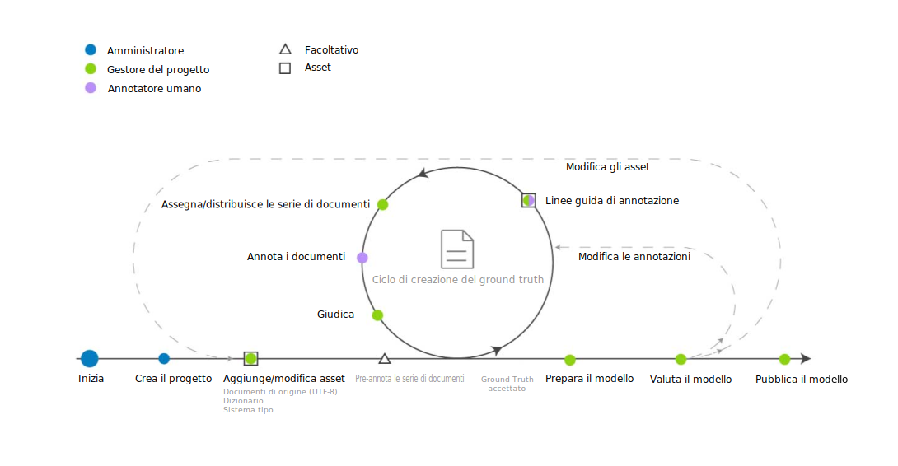

---

copyright:
  years: 2015, 2018
lastupdated: "2018-04-04"

---

{:shortdesc: .shortdesc}
{:new_window: target="_blank"}
{:tip: .tip}
{:pre: .pre}
{:codeblock: .codeblock}
{:screen: .screen}
{:javascript: .ph data-hd-programlang='javascript'}
{:java: .ph data-hd-programlang='java'}
{:python: .ph data-hd-programlang='python'}
{:swift: .ph data-hd-programlang='swift'}

Questa documentazione è per {{site.data.keyword.knowledgestudiofull}} su {{site.data.keyword.cloud}}. Per visualizzare la documentazione della versione precedente di {{site.data.keyword.knowledgestudioshort}} nel {{site.data.keyword.IBM_notm}} Marketplace, [fai clic su questo link ](https://console.bluemix.net/docs/services/knowledge-studio/ml-annotator.html){: new_window}.
{: tip}

# Flusso di lavoro di creazione del modello di machine learning
{: #ml_annotator}

Crea un modello di machine learning che tratta un modello che puoi utilizzare per identificare le voci, le coreferenze e le relazioni di interesse nei nuovi documenti.
{: shortdesc}

Comprendi il flusso di lavoro tipico per la creazione di un modello di machine learning in {{site.data.keyword.knowledgestudioshort}}.

Tutti i passi vengono eseguiti dal gestore del progetto, tranne il passo *Annota i documenti*, che viene eseguito da un annotatore umano. Poiché gli annotatori umani sono spesso esperti in materia, potrebbero essere consultati durante la creazione delle risorse dello spazio di lavoro, come il sistema tipo e altro.

 Figura 1. Il flusso di lavoro per lo sviluppo di un modello di machine learning

<table cellpadding="4" cellspacing="0" summary="Creazione e rifinitura di un modello" border="1" class="simpletable"><tr class="sthead"><th valign="bottom" align="left" id="d14771e70" class="stentry thleft thbot">Passo</th>
<th valign="bottom" align="left" id="d14771e72" class="stentry thleft thbot">Descrizione</th>
</tr>
<tr class="strow"><td valign="top" headers="d14771e70" class="stentry">
Crea uno spazio di lavoro. 
</td>
<td valign="top" headers="d14771e72" class="stentry">
Consulta [Creazione di uno spazio di lavoro](/docs/services/watson-knowledge-studio/create-project.html). Uno spazio di lavoro contiene le risorse
che vengono utilizzate per creare il modello, inclusi:
<dl class="dl"><dt class="dt dlterm">Sistema tipo</dt>
<dd class="dd">
Carica o crea il sistema tipo e definisci i tipi di entità e di relazione che gli annotatori umani
possono applicare quando annotano il testo. Il gestore del processo del modello normalmente collabora con gli
esperti in materia del tuo dominio per definire il sistema tipo. Consulta [Stabilire un sistema tipo](/docs/services/watson-knowledge-studio/typesystem.html)
</dd>
<dt class="dt dlterm">Documenti di origine</dt>
<dd class="dd">
Crea un corpus caricando i documenti di esempio che rappresentano il tuo contenuto del dominio
nello spazio di lavoro. Consulta [Aggiunta di documenti per l'annotazione](/docs/services/watson-knowledge-studio/document-for-annotation.html). Suddividi il corpus in serie di documenti,
specifica la percentuale di documenti che sono condivisi tra tutte le serie di documenti e assegna le serie di documenti
agli annotatori umani. Consulta [Creazione e assegnazione delle serie di annotazioni](/docs/services/watson-knowledge-studio/documents-for-annotation.html#wks_projdocsets).
</dd>
<dt class="dt dlterm">Dizionari</dt>
<dd class="dd">
Carica o crea i dizionari per l'annotazione del testo. Puoi scegliere di aggiungere manualmente le voci del dizionario
o di caricarle da un file e poi modificarle. Consulta [Creazione dei dizionari](/docs/services/watson-knowledge-studio/dictionaries.html).
</dd>
</dl>
</td>
</tr>
<tr class="strow"><td valign="top" headers="d14771e70" class="stentry">
<strong class="ph b">Facoltativo</strong>: pre-annota i documenti 
</td>
<td valign="top" headers="d14771e72" class="stentry">
Pre-annota i documenti in base ai termini nei dizionari dello spazio di lavoro, alle citazioni dei tipi {{site.data.keyword.nlushort}}
o in base alle regole che definisci. Consulta [Inizio dell'annotazione](/docs/services/watson-knowledge-studio/preannotation.html#wks_preannotate).
</td>
</tr>
<tr class="strow"><td valign="top" headers="d14771e70" class="stentry">
Annota i documenti
</td>
<td valign="top" headers="d14771e72" class="stentry"><ol class="ol"><li class="li">
Il gestore del progetto assegna le attività di annotazione agli annotatori umani, configura la soglia dell'accordo
tra annotatori e fornisce le linee guida di annotazione che devono seguire gli annotatori umani. Consulta
[Creazione di un'attività di annotazione](/docs/services/watson-knowledge-studio/annotate-documents.html#wks_hatask).
</li>
<li class="li">
Gli annotatori umani utilizzano l'editor ground truth
per annotare manualmente i documenti. Un annotatore umano identifica le citazioni di interesse nel tuo contenuto del dominio
e le etichetta con i tipi di entità. L'annotatore umano inoltre identifica le relazioni tra le citazioni
(ad esempio, Mary è un'impiegata di IBM) e come le citazioni fanno coreferimento alla stessa entità
(come una ricorrenza di "she" che fa riferimento a Mary). Fai riferimento a [Annotazione dei documenti](/docs/services/watson-knowledge-studio/user-guide.html).
</li>
</ol>
</td>
</tr>
<tr class="strow"><td valign="top" headers="d14771e70" class="stentry">
Giudica e promuovi i documenti
</td>
<td valign="top" headers="d14771e72" class="stentry">
Accetta o rifiuta il ground truth che è stato generato dagli annotatori umani e giudica tutte
le differenze di annotazione per risolvere i conflitti. La valutazione dell'accuratezza e della congruenza del lavoro di annotazione umana
potrebbe essere di responsabilità di un annotatore umano esperto o di un utente
con maggiore esperienza in materia rispetto al gestore del progetto. Consulta [Giudizio](/docs/services/watson-knowledge-studio/build-groundtruth.html#wks_haperform).
</td>
</tr>
<tr class="strow"><td valign="top" headers="d14771e70" class="stentry">
Prepara il modello
</td>
<td valign="top" headers="d14771e72" class="stentry">
Crea il modello di machine learning. Consulta [Creazione di un modello di machine learning](/docs/services/watson-knowledge-studio/train-ml.html#wks_madocsets).
</td>
</tr>
<tr class="strow"><td valign="top" headers="d14771e70" class="stentry">
Valuta il modello.
</td>
<td valign="top" headers="d14771e72" class="stentry">
Valuta l'accuratezza del modello. Consulta [Valutazione delle annotazioni aggiunte dal modello](/docs/services/watson-knowledge-studio/train-ml.html#wks_matest). A seconda dell'accuratezza del modello, questo passo potrebbe creare
il bisogno di ripetere nuovamente dei passi precedenti finché non viene raggiunta l'accuratezza ottimale. Consulta [Analisi delle prestazioni del modello di machine learning](/docs/services/watson-knowledge-studio/evaluate-ml.html) per idee su cosa aggiornare in base
ai problemi di prestazioni comuni.
</td>
</tr>
<tr class="strow"><td valign="top" headers="d14771e70" class="stentry">
Pubblica il modello.
</td>
<td valign="top" headers="d14771e72" class="stentry">
Esporta o distribuisci il modello. Consulta [Utilizzo del modello di machine learning](/docs/services/watson-knowledge-studio/publish-ml.html).
</td>
</tr>
</table>
