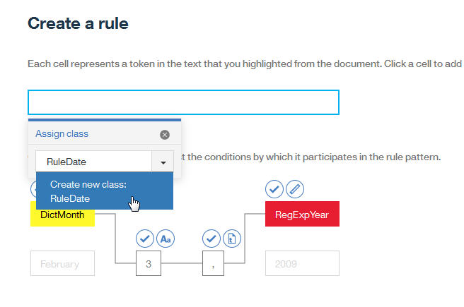

---

copyright:
  years: 2015, 2018
lastupdated: "2018-07-17"

---

{:shortdesc: .shortdesc}
{:new_window: target="_blank"}
{:tip: .tip}
{:pre: .pre}
{:codeblock: .codeblock}
{:screen: .screen}
{:javascript: .ph data-hd-programlang='javascript'}
{:java: .ph data-hd-programlang='java'}
{:python: .ph data-hd-programlang='python'}
{:swift: .ph data-hd-programlang='swift'}

Questa documentazione è per {{site.data.keyword.knowledgestudiofull}} su {{site.data.keyword.cloud}}. Per visualizzare la documentazione della versione precedente di {{site.data.keyword.knowledgestudioshort}} nel {{site.data.keyword.IBM_notm}} Marketplace, [fai clic su questo link ](https://console.bluemix.net/docs/services/knowledge-studio/tutorials-create-rule-model.html){: new_window}.
{: tip}

# Creazione di un modello basato sulla regola
{: #wks_tutrule_intro}

Questa esercitazione ti aiuta a comprendere come creare un modello basato sulla regola che puoi utilizzare per trovare i modelli di testo che definisci nei documenti.
{: shortdesc}

Creerai un modello che può trovare il testo nei documenti che corrisponde al modello `month day, year`. Ad esempio, il modello dovrebbe trovare il riferimento di data *May 1, 2010*. Prima di definire un modello della regola stesso, creerai le risorse che ti aiuteranno a creare il modello, inclusa una classe del dizionario che riconosce le citazioni del mese e una classe dell'espressione regolare che riconosce le citazioni dell'anno nel testo.

## Obiettivi di apprendimento
{: #objectives}

Dopo aver completato questa esercitazione, conoscerai come effettuare le seguenti attività:

- Creare le classi
- Aggiungere i documenti per definire le regole
- Associare i dizionari alle classi
- Definire le espressioni regolari per acquisire le sequenze di caratteri
- Definire le regole

Questa esercitazione dovrebbe richiedere 30 minuti circa per essere completata. Potrebbe essere necessario più tempo se si approfondiscono altri concetti correlati a quest'esercitazione.

## Prima di cominciare
{: #prereqs}

- Assicurati di stare utilizzando un browser supportato. Per informazioni, consulta [Requisiti del browser](/docs/services/watson-knowledge-studio/system-requirements.html).
- Hai correttamente completato l'[Introduzione a {{site.data.keyword.knowledgestudioshort}}](/docs/services/watson-knowledge-studio/tutorials-create-project.html), che copre la creazione di uno spazio di lavoro, la creazione di un sistema tipo e l'aggiunta di un dizionario.
- Devi avere almeno un ID utente nel ruolo di gestore del progetto o di amministratore. Per informazioni sui ruoli utente, consulta [Ruoli utente in {{site.data.keyword.knowledgestudioshort}}](/docs/services/watson-knowledge-studio/roles.html).

## Risultati
{: #results}

Dopo aver creato il modello basato sulla regola, puoi utilizzarlo in uno dei seguenti modi per trovare i modelli di testo nei documenti:

- [Pre-annotare i tuoi documenti](/docs/services/watson-knowledge-studio/preannotation.html#wks_preannotrule) prima di creare un modello di machine learning
- [Distribuire o esportare il modello](/docs/services/watson-knowledge-studio/rule-annotator-model-use.html) a altri prodotti o servizi {{site.data.keyword.watson}}

## Lezione 1: Aggiunta di un dizionario di mesi
{: #wks_tutless_rule1}

In questa lezione, apprenderai come aggiungere un dizionario a uno spazio di lavoro in {{site.data.keyword.knowledgestudioshort}}. Il dizionario contiene i termini relativi ai mesi dell'anno.

### Informazioni su quest'attività
{: #wks_tutless_rule1_about}

In una lezione successiva, definirai una classe basata su questo dizionario. Quando crei questa classe, tutti i termini in questo dizionario che vengono trovati nei documenti saranno automaticamente annotati come una citazione del tipo di classe associato. Per ulteriori informazioni sui dizionari, consulta [Aggiunta di dizionari a uno spazio di lavoro](/docs/services/watson-knowledge-studio/dictionaries.html#wks_projdictionaries).

### Procedura
{: #wks_tutless_rule1_procedure}

1. Scarica il file <a target="_blank" href="https://watson-developer-cloud.github.io/doc-tutorial-downloads/knowledge-studio/dictionary-items-month.csv" download>`dictionary-items-month.csv` </a> sul tuo computer. Questo file contiene i termini nel formato CSV, adatto per il caricamento in un dizionario {{site.data.keyword.knowledgestudioshort}}.
2. Fai clic su **Assets** > **Dictionaries**.
3. Fai clic sul pulsante **Create Dictionary** per aggiungere un dizionario.
4. Nel campo **Name**, immetti `Month dictionary` e fai clic su **Save** per creare il dizionario. Il nuovo dizionario viene creato e automaticamente aperto per la modifica.
5. Nel pannello del dizionario, fai clic su **Upload**.
6. Seleziona il file `dictionary-items-month.csv` dal tuo computer e fai clic su **Upload**. 

    I termini dal file vengono importati nel dizionario. 

## Lezione 2: Aggiunta di documenti di esempio
{: #wks_tutless_rule2}

In questa lezione, apprenderai come aggiungere i documenti con i modelli linguistici che illustrano i tipi di regole che vuoi definire.

### Informazioni su quest'attività
{: #wks_tutless_rule2_about}

Per ulteriori informazioni sull'aggiunta dei documenti, vedi [Aggiunta di documenti per la definizione delle regole](/docs/services/watson-knowledge-studio/rule-annotator-add-doc.html).

### Procedura
{: #wks_tutless_rule2_procedure}

1. Scarica il file <a target="_blank" href="https://watson-developer-cloud.github.io/doc-tutorial-downloads/knowledge-studio/documents-new.csv" download>`documents-new.csv` </a> sul tuo computer. Questo file contiene i documenti di esempio adatti per il caricamento.
1. Fai clic su **Rule-based Model** > **Rules**.
1. Fai clic sull'icona **Add a document** accanto all'intestazione della pagina **Documents**.
1. Fai clic sulla scheda **Upload CSV file**.
1. Fai clic per ricercare il file `documents-new.csv` che hai caricato nel tuo computer precedentemente e poi fai clic su **Upload**.

    Viene visualizzata una serie di regole nella pagina dei documenti principale.

    

## Lezione 3: Creazione delle classi
{: #wks_tutless_rule3}

In questa lezione, apprenderai come definire le classi che utilizzerai quando definisci una regola.

### Informazioni su quest'attività
{: #wks_tutless_rule3_about}

Per ulteriori informazioni sulle classi, vedi [Regole](/docs/services/watson-knowledge-studio/rule-annotator.html).

### Procedura
{: #wks_tutless_rule3_procedure}

1. Dalla pagina **Rules** del tuo spazio di lavoro, fai clic sull'icona **Add a class** accanto all'intestazione **Class** nel pannello laterale di destra.
1. Immetti `DictMonth` come nome della classe e poi fai clic su **Add**.

    La nuova classe viene visualizzata nel pannello laterale Class.

## Lezione 4: Associazione di un dizionario a una classe
{: #wks_tutless_rule4}

In questa lezione, apprenderai come utilizzare un dizionario nell'editor della regola.

### Procedura
{: #wks_tutless_rule4_procedure}

1. Fai clic su **Rule-based Model** > **Rules** e poi seleziona la scheda **Dictionaries**.
2. Seleziona **Month dictionary** che hai creato precedentemente.
3. Dall'elenco **Class**, seleziona `DictMonth` e poi fai clic su **Save**.

    La classe viene associata al dizionario.

    

### Risultati
{: #wks_tutless_rule4_results}

Per i documenti che sono stati associati all'editor della regola, tutti i riferimenti ai termini nel dizionario sono annotati come citazioni della classe `DictMonth`. Vedrai la prova che questi riferimenti sono stati annotati nella prossima lezione.

## Lezione 5: Ricerca delle annotazioni della classe nei documenti
{: #wks_tutless_rule5}

In questa lezione, apprenderai come trovare le annotazioni della classe nei documenti dell'editor della regola.

### Procedura
{: #wks_tutless_rule5_procedure}

1. Seleziona **Rule-based Model** > **Rules**.
2. Dal pannello Class, trova la casse `DictMonth` che hai definito precedentemente e fai clic sull'icona **Search annotations in documents** accanto ad essa.

    Viene visualizzata la pagina Find Annotations che mostra tutti i documenti che contengono i riferimenti di testo ai mesi.

3. Fai clic sul documento `Technology - computerworld.com` per visualizzare il documento completo. Nota che il testo `February` è evidenziato, il che significa che è stato annotato come citazione della classe `DictMonth`.

## Lezione 6: Definizione di un'espressione regolare
{: #wks_tutless_rule6}

In questa lezione, apprenderai come definire un'espressione regolare.

### Informazioni su quest'attività
{: #wks_tutless_rule6_about}

Definirai un'espressione regolare che può trovare i modelli dell'anno come `2009`.

Per ulteriori informazioni sulla definizione delle espressioni regolari, consulta [Definizione di una regola](/docs/services/watson-knowledge-studio/rule-annotator-define-rule.html).

### Procedura
{: #wks_tutless_rule6_procedure}

1. Dalla pagina **Rules**, fai clic sull'icona **Add a class**  accanto a **Class** dal pannello laterale destro.
1. Immetti `RegExpYear` come nome della classe e fai clic su **Add**.
1. Fai clic sulla scheda **Regex** e poi sull'icona **Create a regular expression** accanto all'intestazione **Regular Expressions**.
1. Fai clic su **Add Entry**.
1. Nel campo **Regular Expression**, immetti la seguente espressione, che trova gli anni compresi tra `1900` e `2099`:

    ```
    (?:(?:19|20)[0-9]{2})
    ```
    {: screen}

1. Imposta **Minimum Word Tokens** su `1` e **Maximum Word Tokens** su `1`.
1. Fai clic su **Add** per salvare la voce dell'espressione regolare.
1. Immetti `MyYearExp` come nome dell'espressione regolare e poi, dal menu **Class**, seleziona la classe `RegExpYear` che hai definito precedentemente.
1. Fai clic su **Save**.

    Dopo aver salvato l'espressione regolare, viene automaticamente applicata ai documenti di esempio. Ogni stringa di testo che segue il modello che hai definito nell'espressione regolare viene annotata come citazione della classe `RegExpYear`.

1. Per controllare se l'espressione che hai definito sta acquisendo le ricorrenze di tempo in modo corretto, ricerca le citazioni. Fai clic sull'icona **Search annotations in documents** accanto alla classe `RegExpYear` nel pannello Class.

    

    Viene visualizzata la pagina Find Annotations. Le ricorrenze della citazione dell'anno vengono evidenziate nei documenti di esempio in cui si verificano.

    

## Lezione 7: Definizione di una regola
{: #unique_1166829415}

In questa lezione, apprenderai come definire una regola.

### Informazioni su quest'attività
{: #unique_1166829415_about}

Hai già definito una classe basata sul dizionario per l'annotazione delle citazioni del mese. Hai anche definito un'espressione regolare che trova i valori numerici che rappresentano un anno. Ora, definirai una regola che acquisisce la sequenza di un mese seguito da un numero, una virgola e poi da un anno. Definirai una regola per le espressioni della data come *September 21, 2016*.

Per ulteriori informazioni sulla definizione delle regole, consulta [Definizione di una regola](/docs/services/watson-knowledge-studio/rule-annotator-define-rule.html).

### Procedura
{: #unique_1166829415_procedure}

1. Seleziona **Rule-based Model** > **Rules** e apri il documento `Technology - computerworld.com`.
1. Seleziona il testo `February 3, 2009` nel documento. Assicurati di selezionare anche una virgola.

    

2. Fai clic sull'icona **Add a rule**.

    L'editor della regola mostra una rappresentazione del modello della regola che hai identificato.

    Il testo `February 3, 2009` è visibile. Una riga continua che collega le celle nella rappresentazione identifica quali celle fanno al momento parte del modello.
    - La classe `DictMonth` fa parte del modello della regola invece che del testo `February`. Questa selezione è preferibile perché vuoi che il modello trovi tutti i mesi che vengono annotati dalla classe `DictMonth` come primo token nel modello della data invece che solo del testo `February`.
    - Alla fine della regola, l'anno `2009` è già annotato essendo una citazione della classe `RegExpYear`. La classe `RegExpYear` fa parte del modello della regola invece che del numero 2009. Anche questa selezione è preferibile perché vuoi che il modello trovi tutti gli anni che vengono annotati dalla classe `RegExpYear` come ultimo token nel modello della data invece che solo del testo specifico `2009`.

    Il numero 3 e la virgola (,) dopo di esso vengono mostrati come il secondo e il terzo token nel modello. Come è al momento specificato il modello, troverà solo le ricorrenze di date che specificano il terzo giorno di un mese. Vogliamo che il modello trovi le date che specificano ogni giorno del mese, per cui modificheremo le impostazioni della funzione del token del giorno.

3. Sopra la cella del giorno `3`, fai clic sull'icona **Text** per aprire le impostazioni della funzione del token.

    

    Al momento, la regola è impostata per corrispondere al testo esatto, `3`. Invece, vogliamo che corrisponda ad ogni numero.

4. Modifica le impostazioni della funzione in modo da essere numeriche selezionando **Character Type : Numeric** e annulla la seleziona di **Text : 3**.

    

    Hai modificato la definizione della cella del numero `3`.

    

    L'icona **Character Type** indica che invece di richiedere che il numero sia esattamente uguale a 3, sia un qualsiasi numero.

5. Non modificare alcuna impostazione del token della virgola.

    Vogliamo che il terzo token nel modello sia una virgola, per cui l'impostazione della funzione corrente di **text : ,** è appropriata. In aggiunta a un'impostazione della funzione, ogni token ha un'impostazione di ripetizione. L'impostazione di ripetizione specifica quante volte il token può essere ripetuto nel testo per corrispondere al modello. L'impostazione di ripetizione corrente di **Required (Exactly 1)** è appropriata.

    

6. Assegna una classe che rappresenta il modello `DictMonth + numeric token + comma + RegExpYear`.

    Nota le quattro celle vuote che rappresentano i quattro token che hai selezionato dal documento. Per selezionare tutte le celle, seleziona la prima cella e poi premi Shift + clic su ogni cella aggiuntiva. Immetti `RuleDate` come nome della classe e poi facci clic per creare la nuova classe.

    

7. Nel campo **Rule name**, immetti `MyDateRule` e fai clic su **Save**.

    Dopo aver salvato la regola, viene automaticamente applicata ai documenti di esempio. Se il documento `Technology - computerworld.com` è ancora aperto nell'editor della regola, vedrai che il testo `February 3, 2009` nel documento è ora annotato come una citazione della classe RuleDate.

    

    Puoi ricercare tutte le ricorrenze delle citazioni della classe `RuleDate` nei documenti di esempio facendo clic sull'icona **Search annotation in documents**  accanto alla classe `RuleDate` dal pannello Class. È una buona prassi controllare che tutte le date vengono acquisite correttamente per confermare che hai definito il modello in modo corretto.

    

## Lezione 8: Creazione di un modello basato sulla regola
{: #wks_tutless_rule8}

In questa lezione, apprenderai come creare un modello basato sulla regola.

### Informazioni su quest'attività
{: #wks_tutless_rule8_about}

Per ulteriori informazioni sulla creazione di un modello basato sulla regola, consulta [Creazione del modello basato sulla regola](/docs/services/watson-knowledge-studio/rule-annotator-model-create.html).

### Procedura
{: #wks_tutless_rule8_procedure}

1. Seleziona **Rule-based Model** > **Versions** e fai clic sulla scheda **Rule-based model type mapping**.

1. Associa la classe `RuleDate` all'entità `DATE` dal sistema tipo.

    1. Trova l'entità `DATE` e fai clic su **Edit**.

        

    1. Scegli la classe `RuleDate` dall'elenco e fai clic su **Save**.

        

1. Per pre-annotare le serie di documenti o di annotazioni con il modello basato sulla regola, seleziona la scheda **Rule-based Model** e fai clic su **Run this model**.

## Riepilogo esercitazione
{: #wks_tutrule_sum}

Mentre imparavi ad utilizzare {{site.data.keyword.knowledgestudioshort}}, hai creato un modello basato sulla regola.

### Lezione imparate
{: #lessons_learned}

Completando questa esercitazione, hai imparato i seguenti concetti:

- Classi
- Espressioni regolari
- Regole
