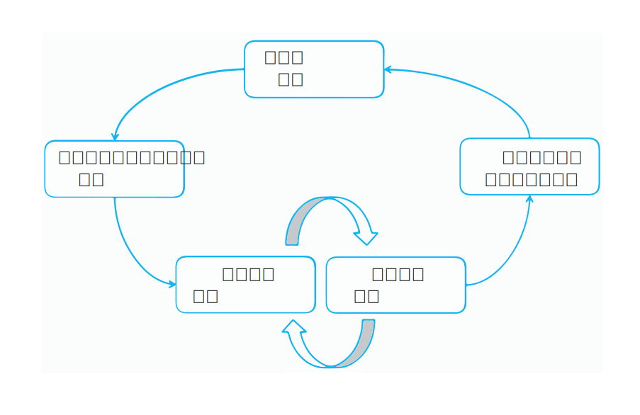

---

copyright:
  years: 2015, 2018
lastupdated: "2018-07-19"

---

{:shortdesc: .shortdesc}
{:new_window: target="_blank"}
{:tip: .tip}
{:pre: .pre}
{:codeblock: .codeblock}
{:screen: .screen}
{:javascript: .ph data-hd-programlang='javascript'}
{:java: .ph data-hd-programlang='java'}
{:python: .ph data-hd-programlang='python'}
{:swift: .ph data-hd-programlang='swift'}

この文書は、{{site.data.keyword.cloud}} 上の {{site.data.keyword.knowledgestudiofull}} に関するものです。 前のバージョンの {{site.data.keyword.IBM_notm}} マーケットプレイス上の {{site.data.keyword.knowledgestudioshort}} に関する文書を参照するには、[このリンクをクリックしてください ](https://{DomainName}/docs/services/knowledge-studio/annotate-documents.html){: new_window}。
{: tip}

# アノテーションのセットアップ
{: #annotate-documents}

対象の業界とその言語についての知識を持つユーザーは、文書にアノテーションを付ける必要があります。
{: shortdesc}

ヒューマン・アノテーターがワークスペースにアクセスできるようにするため、以下の作業を実行します。

- 使用している {{site.data.keyword.knowledgestudioshort}} インスタンスに、対象分野の専門家を招待します。
- ヒューマン・アノテーターと、彼らにアノテーションを付けてもらいたいアノテーション・セットとを関連付けます。
- セット内の文書にアノテーションを付けるようにヒューマン・アノテーターを割り当てるタスクを作成します。

    > **注意:** ヒューマン・アノテーターにタスクを明示的に割り当てるまでは、アノテーターは {{site.data.keyword.knowledgestudioshort}} にログインしてもワークスペースを見ることはできません。

ユーザー (ヒューマン・アノテーター) は、文書にアノテーションを付ける方法について詳しく説明されている『[文書のアノテーション付け](/docs/services/watson-knowledge-studio/user-guide.html)』をよく理解する必要があります。

## モデルのライフサイクル
{: #wks_lifecycle}

{{site.data.keyword.knowledgestudioshort}} で作成するモデルは、自然言語処理 (NLP) パイプラインに組み込み可能なソフトウェア・コンポーネントです。

{{site.data.keyword.knowledgestudioshort}} を使用して、新しい分野についてのモデルを作成、評価、および改善できます。 モデルは、自然言語コンテンツに含まれているテキストにアノテーション (メタデータ) を追加します。 アノテーションは、分野コンテンツ内の関心のあるエンティティーのメンション、エンティティー間の関係、および、同じエンティティーの複数のメンションの照応関係を示すものであり、アプリケーションはアノテーションを使用して自動的にテキストを分析および処理することができます。 アプリケーション・ユーザーには、意味の抽出、洞察の発見、および自然言語文脈での回答を入手できることで、このレベルの分析が効果的になります。

モデルの作成は、複数ステップの処理を反復することで行われます。この処理には、知識の整理、グランド・トゥルースの生成、モデルの開発、モデルの評価、およびランタイム・デプロイメントという段階があります。

### 分野適応の全体図
{: #wks_lifecycle__wks_lifecycleS6}

次の図は、モデル開発の 5 つの段階の相互作用と、各段階で発生する標準的なアクティビティーを要約したものです。

 図 2. モデル開発の 5 つの段階と各段階で発生するアクティビティーの要約

### 知識の整理
{: #wks_lifecycle__wks_lifecycleS1}

この段階は、{{site.data.keyword.knowledgestudioshort}} の外部にあり、特定の分野に関連するコンテンツの選択、収集、保存、および保守を行うプロセスです。 知識の整理により、データは信頼できる情報および知識に変換され、データの価値が高まります。

### グランド・トゥルースの生成
{: #wks_lifecycle__wks_lifecycleS2}

この段階では、特定の分野に {{site.data.keyword.watson}} ソリューションを適応させるために使用できる入念に吟味されたデータの集合を、{{site.data.keyword.knowledgestudioshort}} のツールおよびベスト・プラクティスを使用して生成します。 この入念に吟味されたデータは*グランド・トゥルース* または*ゴールド標準文書* と呼ばれます。グランド・トゥルースの不正確さはそれに依存するアプリケーションにおける不正確さと相関するため、これが正確であることは大変重要です。

新しい分野について {{site.data.keyword.watson}} に教えることの根幹は、その分野のコンテンツ内の関心のあるエンティティーについて、エンティティー同士の関係について、および、エンティティーが互いにどのように照応するのかについての知識を与えることです。 この知識の収集には以下のアクティビティーが含まれます。

- 対象分野の専門家に参加してもらって、以下のリソースを作成するか、または、再利用できるか対象分野用に変更できる既存リソースを特定します。

  - 分野コンテンツ内の単語および文にどのようにアノテーションを付ければよいのかをヒューマン・アノテーターが学習するのを助けるためのアノテーション・ガイドラインおよび例。
  - テキスト分析を通して分野コンテンツ内で検出される可能性のある分野固有のタイプ (オブジェクト) および特徴 (データ種別) を定義するタイプ・システム。 タイプ・システムは、ヒューマン・アノテーターが文書に追加できるアノテーションのタイプを制御します。
  - 分野コンテンツにおいて等価の用語として扱われるべき用語の辞書。

- 分野コンテンツの代表的な文書を集めたコーパスを作成します。
- {{site.data.keyword.knowledgestudioshort}} ワークスペースに追加する辞書に基づいて、文書に事前アノテーション付けを行います。 機械学習モデルを作成した後、そのモデルを使用して、コーパスに追加する新規文書に事前アノテーション付けを行うことができます。 事前アノテーションは、アノテーション付けに機械学習モデルを使用できるようになる前に可能な範囲で、文書に機械的にアノテーションを付けるプロセスです。 事前アノテーションを使用すると、ヒューマン・アノテーション作成の一部を、正確かどうかの検証が少なくてすむマシン・アノテーションで置き換えることによって、ヒューマン・アノテーションの作業量を減らすことができます。
- ヒューマン・アノテーター間で文書を配分します。その後、ヒューマン・アノテーターは、それぞれが少しずつ文書を担当して、{{site.data.keyword.knowledgestudiofull}} グランド・トゥルース・エディター・ツールを使用して手動でアノテーションを追加します。
- ヒューマン・アノテーション結果を比較し、競合を解決します。 このフェーズでの裁定は、正確で整合性のあるアノテーション付けが行われた文書がグランド・トゥルースにプロモートされ、機械学習モデルのトレーニングとテストに使えるようにするために必要です。

### モデルの開発
{: #wks_lifecycle__wks_lifecycleS3}

この段階では、{{site.data.keyword.knowledgestudioshort}} ツールを使用してモデルを作成します。 グランド・トゥルースが確立された後、ヒューマン・アノテーション結果を、大きな文書集合 (例えば、数百万の文書を含む集合) への自動アノテーション追加のアルゴリズムをトレーニングするために使用できます。

### モデルの評価
{: #wks_lifecycle__wks_lifecycleS4}

この段階では、{{site.data.keyword.knowledgestudioshort}} ツールを使用して、モデルを改良し、パフォーマンスを改善します。 モデルによって生成された結果が、グランド・トゥルース文書のテスト・セットに照らして評価されます。 *正確度分析* は、アノテーションの誤りの原因を特定します。 *ヘッドルーム分析* は、どの誤りに着目する必要があるのかと、モデルの改良が最大の影響をもたらす可能性があるのはどこなのかを査定するのを支援します。 満足できるレベルの正確さが達成されるまで、パフォーマンスを向上させるために繰り返し調整することができます。

### モデルのデプロイメント
{: #wks_lifecycle__wks_lifecycleS5}

この段階では、モデルが機械学習ランタイム環境で実行できるようにコンポーネントをエクスポートし、他の {{site.data.keyword.watson}} コグニティブ・アプリケーションがモデルにアクセスできるようにします。 例えば、{{site.data.keyword.nlufull}} サービスまたは {{site.data.keyword.discoveryfull}} サービスで使用するために機械学習モデルをデプロイしたり、{{site.data.keyword.ibmwatson_notm}} Explorer での使用のためにモデルをエクスポートしたりすることができます。

## アノテーション・タスクの作成
{: #wks_hatask}

アノテーション・プロセス管理者がアノテーション・タスクを作成した後でないと、ヒューマン・アノテーターは文書へのアノテーションの追加を開始できません。

### この作業について
{: #wks_hatask_about}

アノテーション・タスクは、どの文書にアノテーションが付けられる必要があるのかを指定します。 ヒューマン・アノテーターの作業成績を比較するため、および、彼らがどの程度の整合性でアノテーション・ガイドラインを適用するのかを確認するため、少なくとも 2 人のヒューマン・アノテーターをタスクに含める必要があります。 さらに、いくらかの割合の文書が、タスクに追加するアノテーション・セットのすべてに含まれている必要があります (アノテーション・セットを作成するときに重複パーセンテージを指定します)。

#### 重要
{: #wks_hatask_important}

- アノテーション・タスクは、ヒューマン・アノテーターたちが別々の場所でテキストにアノテーションを付けるのを許可するために存在する、一時的な概念です。 また、承認されたアノテーションのみがグランド・トゥルースにプロモートされることを保証します。
- 複数のアクティブ・タスクが同時に同じアノテーション・セットを含むことはできません。 あるタスクに含まれているアノテーション・セットを別のタスクに追加するには、最初に、そのアノテーション・セットがアクティブであるタスクを削除する必要があります。
- あるヒューマン・アノテーターのユーザー・アカウントを削除すると、そのアノテーターのアノテーションにも影響が及びます。 そのユーザーに割り当てられていたが、グランド・トゥルースにプロモートされなかった文書中のアノテーションは削除されます。
- ヒューマン・アノテーション・タスクの作成後にタイプ・システムまたはグランド・トゥルース・エディターの設定が変更された場合、変更をタスクに伝搬するかどうかを決定する必要があります。 タイプ・システムの変更はアノテーションに影響する可能性があり、ヒューマン・アノテーターが文書のレビューと更新を行うことが必要になる場合があります。
- 辞書が変更されても、その変更は現行のアノテーション・タスクには反映されません。 リソースの変更をグランド・トゥルースに適用するには、新しいアノテーション・タスクを作成する必要があります。
- ワークスペース当たり最大 256 のアノテーション・タスクを作成できます。

### 手順
{: #wks_hatask_procedure}

アノテーション・タスクを作成するには、次のようにします。

1. {{site.data.keyword.knowledgestudioshort}} 管理者としてログインし、ワークスペースを選択します。
1. **「機械学習モデル (Machine Learning Model)」**>**「アノテーション・タスク (Annotation Tasks)」**ページを選択します。
1. **「タスクの追加 (Add Task)」**をクリックします。 タスクの記述名を指定し、タスクの完了期限日付を選択します。
1. **「作成 (Create)」**をクリックします。 使用可能なアノテーション・セットのリストが、割り当てられたヒューマン・アノテーターの名前と共に表示されます。
1. タスクに含める各アノテーション・セットを選択し、**「タスクの作成 (Create Task)」**をクリックします。

    アノテーション・セット名の横にチェック・マークがあるため、すべてのアノテーション・セットがデフォルトで選択されているように見えますが、そうではありません。 含めるアノテーション・セットを明示的に選択する必要があります。
    {: tip}

### 次に行うこと
{: #wks_hatask_next}

タスクが作成されたら、**「機械学習モデル (Machine Learning Model)」**>**「アノテーション・タスク (Annotation Tasks)」**ページに戻って、各ヒューマン・アノテーターの進行状況を表示できます。また、以下のタスクを実行することもできます。

- アノテーション・セット間で重複している承認済み文書を調べて、アノテーション競合を解決します。
- アノテーション・セットを追加する先のタスクを開きます。 追加するアノテーション・セットが、元のアノテーション・セット内の文書と重複する文書を含んでいるようにします。

メインナビゲーションの**「設定」**タブから、以下の情報を指定できます。

- グランド・トゥルース・エディターでカラーおよびキーボード・ショートカットを使用するための設定を指定します。
- アノテーター間一致しきい値を指定し、その後で、タスクを開いて、複数のヒューマン・アノテーターが同じ文書にどの程度一貫したアノテーションを付けたのかを確認します。
- アノテーション・ガイドラインをグランド・トゥルース・エディターに接続するための URL を指定します。

## グランド・トゥルース・エディター設定の構成
{: #wks_hapref}

プロジェクト管理者は、グランド・トゥルース・エディターでカラーおよびキーボード・ショートカットを使用するための設定を指定できます。

### 手順
{: #wks_hapref_procedure}

グランド・トゥルース・エディター操作のビジュアル設定を指定するには、次のようにします。

1. {{site.data.keyword.knowledgestudioshort}} 管理者としてログインし、ワークスペースを選択します。
2. 左側にあるナビゲーションから、**「設定」**>**「文書アノテーション設定 (Document Annotation Settings)」**を選択します。
3. **「エンティティー・タイプ (Entity Types)」**タブまたは**「関係タイプ (Relation Types)」**タブを選択します。
4. 変更したいエンティティー・タイプまたは関係タイプを選択し、**「キーボード・ショートカットおよびカラーの編集 (Edit keyboard shortcuts and colors)」**をクリックします。 各タイプに対して定義できる内容は次のとおりです。

    - キーボード・ショートカット。これは、ユーザーが `<key>` を入力することで、強調表示されたテキストに当該タイプのラベルを適用できることを意味します。例えば、`o` を `ORGANIZATION` のキーボード・ショートカットとして定義しておくと、ユーザーはテキストを選択してから `o` キーを押すだけで、強調表示されたテキストに `ORGANIZATION` エンティティー・タイプを適用できます。 特定の大文字を割り当てた場合、ユーザーは `Shift+<key>` を入力する必要があります。
    - テキストの色。 テキストにラベルが付いた後でもテキストがよく見えるように、テキストの色と背景色が対照的になるようにしてください。
    - 背景色。 これは、アノテーションを付けた後にエンティティーに適用されるラベルの色です。

    ヒューマン・アノテーターは、文書にアノテーションを付けるときに、キーボード・ショートカットを使用してアノテーションを素早く追加できます。 アノテーション・ラベルの色とテキストの色は、ヒューマン・アノテーターが文書にアノテーションを追加した後にタイプを瞬時に認識するのに役立ちます。
    - ヒューマン・アノテーターによってメンションに割り当てられないようにしたいエンティティー・タイプまたは関係タイプがある場合は、グランド・トゥルース・エディターでそれらを非表示にすることができます。そうすることで、ユーザーに対して表示されるタイプ・オプションのリストが小さく単純なものになります。 これを行うには、タイプの**「アクティブ (Active)」**チェック・ボックスを選択解除します。

    新しいショートカットとカラーを割り当てるときに、変更をプレビューできます。

5. 選択を強調表示する色のデフォルトを変更することもできます。 強調表示する色は、ヒューマン・アノテーターが選択したテキストの周囲に表示される枠の色です。デフォルトの色はライトブルーですが、**「選択の強調表示 (Selection Highlight)」**タブで色を変えて、選択されたテキストの境界線をもっと識別しやすいものにできます。

#### 関連タスク
{: #wks_hapref_related}

[ヒューマン・アノテーションを失わずにタイプ・システムを変更する](/docs/services/watson-knowledge-studio/improve-ml.html#wks_projtypesysmod)

## IAA しきい値の設定
{: #wks_haiaathresh}

アノテーションが付けられた文書セットを受け入れるか拒否するかを決めるのを支援するため、アノテーター間一致しきい値を指定できます。 このしきい値は、アノテーター間一致が、システムが計算した IAA スコアと比べてどの程度適切なのかを比較するのに役立ちます。

### この作業について
{: #wks_haiaathresh_about}

複数のヒューマン・アノテーターが同じ文書にどのくらい異なるアノテーションを付けたのかを比較するため、評価しきい値を指定します。 あるヒューマン・アノテーターによるアノテーションと別のヒューマン・アノテーターによるアノテーションが、低スコアという結果になるほど異なっている場合、それらのアノテーターは一致していないということを意味します。 不一致は調査して解決される必要があります。

### 手順
{: #wks_haiaathresh_procedure}

アノテーター間一致しきい値を設定するには、次のようにします。

1. {{site.data.keyword.knowledgestudioshort}} 管理者としてログインし、ワークスペースを選択します。
1. **「設定」**>**「IAA 設定 (IAA Settings)」**タブを選択します。
2. 0 から 1 までの値 (例えば、`.5`、`.8` など) を指定し、**「保存 (Save)」**をクリックします。

## アノテーション・ガイドラインへの接続
{: #wks_haguidelines}

プロジェクト用のアノテーション・ガイドラインを作成した後、それらのガイドラインに接続するように {{site.data.keyword.knowledgestudioshort}} を構成できます。 ヒューマン・アノテーターは、適用するアノテーションとして正しいものを選択するのに役立てるため、文書にアノテーションを付ける際にそれらのガイドラインを参照できます。 管理者も、重複文書中のアノテーション競合を解決する際に支援が必要な場合は、それらのガイドラインを参照できます。

### 手順
{: #wks_haguidelines_procedure}

グランド・トゥルース・エディターおよび裁定ツールをアノテーション・ガイドラインに接続するには、次のようにします。

1. {{site.data.keyword.knowledgestudioshort}} 管理者としてログインし、ワークスペースを選択します。
1. **「設定」**>**「アノテーション・ガイドライン (Annotation Guidelines)」**タブを選択します。
1. ガイドラインがホストされる URL を指定します。
1. **「保存 (Save)」**をクリックします。 グランド・トゥルース・エディターおよび裁定ツールがアノテーション・ガイドラインに接続されます。 ガイドライン作成時にユーザーに付与されたアクセス権によっては、ヒューマン・アノテーターおよびワークスペース管理者は、ガイドラインを開いた後に、説明と例を追加するなどの更新を行うことができる場合があります。

### アノテーション・ガイドライン
{: #wks_guidelines}

ガイドライン文書化の書式は規定されていませんが、ガイドラインに詳細な例が含まれていることはとても重要です。 ヒューマン・アノテーターは、ある文脈でメンションにどのエンティティー・タイプを適用すればよいのかを理解する必要があり、また、特定のメンションのペアに対してどの関係タイプが有効なのかを知る必要があります。 正しいアノテーションの選択方法を最もよく伝えるのが分野コンテンツから取り出された例であることは珍しくありません。

アノテーション・ガイドラインは静的ではありません。 プロジェクトが進展するにつれて、ガイドラインに正確に取り込まれていないメンションおよび関係のインスタンスを発見するかもしれません。 複数のヒューマン・アノテーター間でのガイドラインの解釈方法に不整合を見つける可能性もあります。 状況に応じてガイドラインを更新することで、時間の経過とともにアノテーションの正確度と整合性が向上させることに役立つ可能性があります。

文書がグランド・トゥルースであると見なされるには、その前に、複数のヒューマン・アノテーターが同じ文書に付けた異なるアノテーション間の競合がすべて解決される必要があります。 競合を解決するために大事なのは、混乱の原因を議論して、その結果としてヒューマン・アノテーターが彼ら自身のミスから学ぶのを支援することです。 ガイドラインを改良して明確にすることは、競合の数を減らすのに役立ち、グランド・トゥルースにプロモートされるのが、正確で一貫したアノテーションが付けられた文書であることを確実にするのにも役立ちます。

ガイドラインを管理しやすくするため、長い文書になりそうであれば複数パーツに分割して、例えば、エンティティーのアノテーション付けに関するガイドライン、関係のアノテーション付けに関するガイドライン、メンションを照応させることのできる方法のアノテーション付けに関するガイドラインなどに分けることができます。 ある領域で変更を行う場合、それを評価して、別の領域で行う変更と調和させる必要があります。 例えば、エンティティー・タイプを追加する場合、関係タイプのアノテーション付けに関するガイドラインを検討し、新規エンティティー・タイプが他のエンティティー・タイプにどのように関係する可能性があるのかを指定します。

### アノテーション・ガイドラインの例
{: #wks_guidelinesexample}

ヒューマン・アノテーターがテキストのアノテーション付けを整合性を保って行えるようにするため、ほとんどのアノテーション・ガイドラインでは大量の詳細説明と例が必要です。

ここに示す例は、交通事故レポートを含む小さい分野のために作成された単純なガイドラインです。

#### 作業の目標
{: #wks_guidelinesexample__annotgoals}

- プロジェクト・メンバーとして、人手によるアノテーションおよび機械学習モデルを改良するための反復プロセスを理解します。
- グランド・トゥルース・エディターを使用して自動車分野の文書にアノテーションを付け、それらのアノテーションを使用して機会学習モデルをトレーニングします。 エンティティー・タイプ、関係タイプにアノテーションを付け、必要に応じてエンティティーを照応させます。

#### ガイドラインの表記
{: #wks_guidelinesexample__annotnotation}

- 大括弧 [ ] は、引用符で囲んだテキスト全体よりも小さいテキストにアノテーションが付けられる場合のアノテーションを付ける範囲を示します。

    例えば `[no injuries]ACCIDENT_OUTCOME` のように、適宜否定を組み込みます。 タイプ・システムは、否定を表すためのエンティティー・クラスを使用しません。

#### エンティティー・タイプ
{: #wks_guidelinesexample__annottype}

このタイプ・システムは、エンティティー・サブタイプもロールも使用せず、メンション・タイプもクラスも使用しません。

<table summary="この表は、エンティティー・タイプについて説明しています。">
  <caption>表 1. エンティティー・タイプ</caption>
  <tr>
    <th style="vertical-align:bottom; text-align:left" width="24%" id="d1735e810">エンティティー・タイプ</th>
    <th style="vertical-align:bottom; text-align:left" width="38%" id="d1735e812">ガイドライン</th>
    <th style="vertical-align:bottom; text-align:left" width="38%" id="d1735e814">例</th>
  </tr>
  <tr>
    <td headers="d1735e810">
      
ACCIDENT_OUTCOME

    </td>
    <td headers="d1735e812">
      
事故の結果。 人間 (死亡など) と車 (へこみなど) の両方に適用されます。 ダメージの重大度の指標として "towed" (けん引された) および "air bag deployment" (エアバッグが開いた) を、負傷の重大度の指標として "transported
to hospital" (死亡ではなく病院に搬送された) を含むことができます。 否定を含むことができます。

    </td>
    <td headers="d1735e814">
      
"[casualty]"、"[injury]"、"sustained [total loss]"、"[no injuries]"、"[towed] due to
[disabling damage]"、[not towed]、"air bag did [not deploy]" (エアバッグ自体は PART_OF_CAR であり、sufferedFrom からこの ACCIDENT_OUTCOME に関連付けられている必要があります)、および重大度の指標。

    </td>
  </tr>
  <tr>
    <td headers="d1735e810">
      
CONDITION

    </td>
    <td headers="d1735e812 ">
      
事故の起こりやすさに影響を与える可能性があり、日ごとに変化する可能性があるが、車または運転者に関するものではないという観点での、気象条件または道路条件。

      
運転者のミスまたは機械の故障であることも可能であり、問題があるように見えなければなりません。 STRUCTURE は除外するべきです。

    </td>
    <td headers="d1735e814">
      
"dry"、"rainy"、"construction"、"heavy traffic"、"daylight"。しかし、"grassy" や "intoxicated" は不適当。

"flat tire"、"overcorrected" (ハンドル操作ミス)、"asleep"、"intoxicated"、"[failed to
negotiate]CONDITION a [curve]STRUCTURE"、"[departed] the lane" または shoulder。しかし、"attempting to
pass" は、この句に "without enough room" または類似したものが付いていない場合は不適当であり、"departing the road" は INCIDENT であるため、これも不適当。

    </td>
  </tr>
  <tr>
    <td headers="d1735e810">
      
INCIDENT

    </td>
    <td headers="d1735e812">
      
衝突、不適切であることが明確であって破壊的な自動車の動き (道から外れての走行など)、または、その他の損害事故 (自動車火災など) についての実際のメンション。 

      
"impacted"、"pushed rearward"、および "came to final rest" など、密接に関連するものであっても、互いに同一の動きを指していない動きを照応関係にさせないでください。

      
範囲から STRUCTURE を除外します。例えば、"[came to rest]INCIDENT in a [ditch]STRUCTURE" または "[remaining in contact]INCIDENT with the [guardrail]STRUCTURE" です。

    </td>
    <td headers="d1735e814">
      
 "crash"、"impacted"、"overturned"、"contacted"、"against"、"pushed"、"passenger was
[ejected]"、"rolled over a quarter turn" -- quarter turn (90 度回転) は、重大度を表しますが、事故の一部であり、
ACCIDENT_OUTCOME ではありません (車両の回転にアノテーションを付けないでください)。

      
車両が属していない場所 (土手など) での、または衝突からの動きでの "came to final rest"、または、"departed the roadway" (原因だった可能性のある車線から離脱しただけでなく道路からの離脱)。

    </td>
  </tr>
  <tr>
    <td headers="d1735e810">
      
MANUFACTURER

    </td>
    <td headers="d1735e812">
      
車両メーカー。

    </td>
    <td headers="d1735e814">
      
Toyota、Mazda、General Motors

    </td>
  </tr>
  <tr>
    <td headers="d1735e810">
      
MODEL

    </td>
    <td headers="d1735e812">
      
特定のメーカーによって作られた特定の種類の車両。 "LX" や "SE" など、余分な語を除外し、ライン標識を切り取ります (例えば、"Xterra SE" という句の "Xterra" のみにアノテーションを付けます)。

    </td>
    <td headers="d1735e814">
      
Camry

    </td>
  </tr>
  <tr>
    <td headers="d1735e810">
      
MODEL_YEAR

    </td>
    <td headers="d1735e812">
      
自動車の名前の一部であるモデル年。

    </td>
    <td headers="d1735e814">
      
'99、2001

    </td>
  </tr>
  <tr>
    <td headers="d1735e810">
      
PART_OF_CAR

    </td>
    <td headers="d1735e812">
      
事故に具体的に関係しているかどうかに関係なく、車両の内部または外部のパーツ。 そのようなパーツの機能リストは除外します。 パーツが自動車内のどこにあるかを示すもの、または、特定のパーツではなく車の一部を単に指しているものを含めます。

複数形が可能です。 車両内の位置の指定を含めることができます。例えば、"[driver airbag]"、"[RF door]"、"[RR] passenger"、"[LF and RF air bags]" 、"[first row passive/automatic restraints]"、"[safety system] with EDR capabilities" などです。

      
年/モデル/メーカーが別の、けん引されているボート、タンクなど (セミトレーラーを除く) を含めます。

    </td>
    <td headers="d1735e814">
      
cross-section、front plane、tire、steering wheel、airbag など。

    </td>
  </tr>
  <tr>
    <td headers="d1735e810">
      
PERSON

    </td>
    <td headers="d1735e812">
      
レポートの事故場面に記述されている人 (車両の運転者または乗客、歩行者、目撃者など)。

      
形容詞にアノテーションを付けないでください。
したがって、"a [69-year-old] drove" にはアノテーションを付けず、"a 69-year-old [male] drove" にはアノテーションを付けます。 複数形が可能です。例えば、"LR and RF [occupants]" などです。 事故の後に到着した人は除外します。

      
動物のエンティティー・タイプがない場合、PERSON を使用して、衝突に巻き込まれたか衝突の原因となった野生動物にタグを付けます。動物は動くことができるので、STRUCTURE よりも PERSON のほうがふさわしいためです。

      
注: "passenger airbag" は、人の存在を意味しているのではないため、PART_OF_CAR です。

    </td>
    <td headers="d1735e814">
      
driver、occupant、patient、child

    </td>
  </tr>
  <tr>
    <td headers="d1735e810">
      
STRUCTURE

    </td>
    <td headers="d1735e812">
      
道路の上または近くにあるか、または道路の一部である構造体。 事故の構成に関連する可能性がある特定の道路形容詞を含めます。他の形容詞は省略します。

    </td>
    <td headers="d1735e814">
     
[two-lane, two-way road]、[left lane]、eastbound [lane]、2-foot [ditch]、[right lane line]、
[exit ramp]、[pole]、[tree]、steep descending [embankment]

    </td>
  </tr>
  <tr>
    <td headers="d1735e810">
      
VEHICLE

    </td>
    <td headers="d1735e812">
      
MODEL、MANUFACTURER、および MODEL_YEAR 以外の車両への参照。 複数形が可能です。
その場合、照応の可能性は低くなり、グループの一部という関係はありません。

      
事故現場の一部である車両のみを考慮し、後で対応した緊急車両などは除外します。 自転車は VEHICLE です。

    </td>
    <td headers="d1735e814">
      
"the [truck]"、"the [car]"、"[V1]'s"

    </td>
  </tr>
</table>

#### 関係タイプ
{: #wks_guidelinesexample__annotreltype}

このタイプ・システムは関係タイプを使用しますが、関係クラスや他の関係属性は使用していません。 否定は、関係クラスによってではなく、メンションの範囲によってエンコードされます。
例えば、[no occupants]PERSON were [hospitalized]ACCIDENT_OUTCOME では、関係タイプ sufferedFrom によって 2 つのメンションがリンクされます。

<table summary="この表は、関係タイプについて説明します。">
  <caption>表 2. 関係タイプ</caption>
  <tr>
    <th style="vertical-align:bottom; text-align:left" width="33%" id="d1735e923">
      最初のメンションに可能なエンティティー・タイプ
    </th>
    <th style="vertical-align:bottom; text-align:center" width="19%" id="d1735e925">
      関係タイプ
    </th>
    <th style="vertical-align:bottom; text-align:left" width="48%" id="d1735e927">
      2 番目のメンションに可能なエンティティー・タイプ
    </th>
  </tr>
  <tr>
    <td headers="d1735e923">
      VEHICLE、MODEL、MANUFACTURER [<b>2</b>]
    </td>
    <td style="text-align:center" headers="d1735e925">
      hasProperty
    </td>
    <td headers="d1735e927">
      MANUFACTURER、MODEL、MODEL_YEAR
    </td>
  </tr>
  <tr>
    <td headers="d1735e923">
      PERSON
    </td>
    <td style="text-align:center" headers="d1735e925">
      occupantOf
    </td>
    <td headers="d1735e927">
      VEHICLE、MODEL、MANUFACTURER、MODEL_YEAR [<b>1</b>]、PART_OF_CAR、STRUCTURE
    </td>
  </tr>
  <tr>
    <td headers="d1735e923">
      PERSON、PART_OF_CAR、STRUCTURE、VEHICLE、MODEL、MANUFACTURER、MODEL_YEAR [<b>1</b>]
    </td>
    <td style="text-align:center" headers="d1735e925">
      sufferedFrom
    </td>
    <td headers="d1735e927">
      ACCIDENT_OUTCOME
    </td>
  </tr>
  <tr>
    <td headers="d1735e923">
      VEHICLE
    </td>
    <td style="text-align:center" headers="d1735e925">
      driveUnder
    </td>
    <td headers="d1735e927">
      CONDITION、ACCIDENT_CAUSE
    </td>
  </tr>
  <tr>
    <td headers="d1735e923">
      PART_OF_CAR
    </td>
    <td style="text-align:center" headers="d1735e925">
      locatedOn
    </td>
    <td headers="d1735e927">
      VEHICLE、MODEL、MANUFACTURER、MODEL_YEAR [<b>1</b>]
    </td>
  </tr>
  <tr>
    <td headers="d1735e923">
      ACCIDENT_OUTCOME
    </td>
    <td style="text-align:center" headers="d1735e925">
      outcomeOf
    </td>
    <td headers="d1735e927">
      INCIDENT
    </td>
  </tr>
  <tr>
    <td headers="d1735e923">
      INCIDENT
    </td>
    <td style="text-align:center" headers="d1735e925">
      causedBy
    </td>
    <td headers="d1735e927">
      CONDITION、ACCIDENT_CAUSE <strong>(覚え書: 因果関係を示す証拠文書が必要)</strong>
    </td>
  </tr>
  <tr>
    <td headers="d1735e923">
      INCIDENT
    </td>
    <td style="text-align:center" headers="d1735e925">
      impactPoint
    </td>
    <td headers="d1735e927">
      
ぶつかられたか、事故に巻き込まれた、PERSON、PART_OF_CAR、STRUCTURE、VEHICLE、MANUFACTURER、MODEL、または MODEL_YEAR [<b>1</b>]。

      
STRUCTURE の impactPoint は、その STRUCTURE に関係しない衝突の場所を指定するだけというのは含まないため、[intersection]STRUCTURE で 2 台の車両が衝突したということには適用されませんが、[embankment]STRUCTURE に車両がぶつかったということには適用されます。

    </td>
  </tr>
</table>

#### 表の注記
{: #table_notes}

1.  VEHICLE/MODEL/MANUFACTURER/MODEL_YEAR という表記は、車両のメンションを指します。 最後の 3 つは、それぞれ、"the Accord"、"the Honda"、または、まれにしかありませんが "the '99" のようなことがテキストに書かれている場合のためのものです。 これら 4 つのエンティティー・タイプは、優先順位の順番になっています。したがって、"the driver of the '99 Honda Accord" では、driver (PERSON) occupantOf Accord (MODEL) という関係になります。この場合、Accord は Honda と '99 の両方と hasProperty 関係を持ちます。
1.  MODEL と MANUFACTURER が hasProperty の第 1 引数になることができるのは、名詞として出現する (車両を指す) 場合のみです。 "the '99 Honda Accord drove" でのように、MODEL は、MANUFACTURER および MODEL_YEAR への hasProperty 関係を持つことができます。 "the '99 Honda drove" でのように、MANUFACTURER は、MODEL_YEAR への hasProperty 関係のみを持つことができます。
