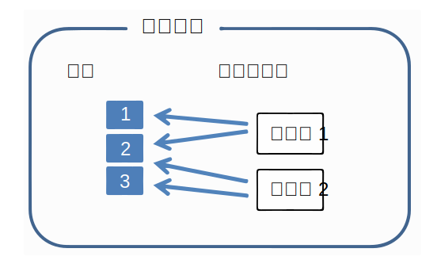
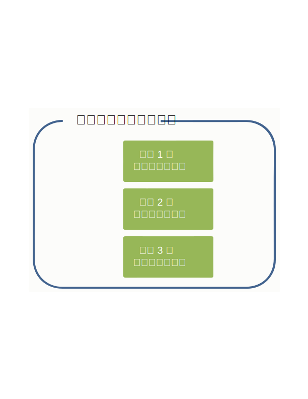
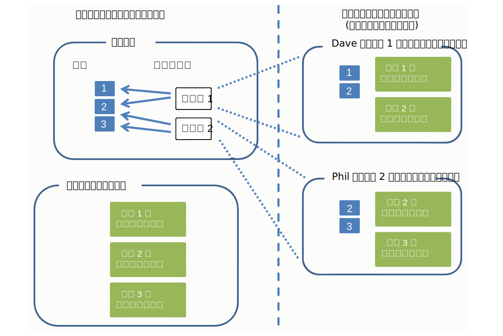
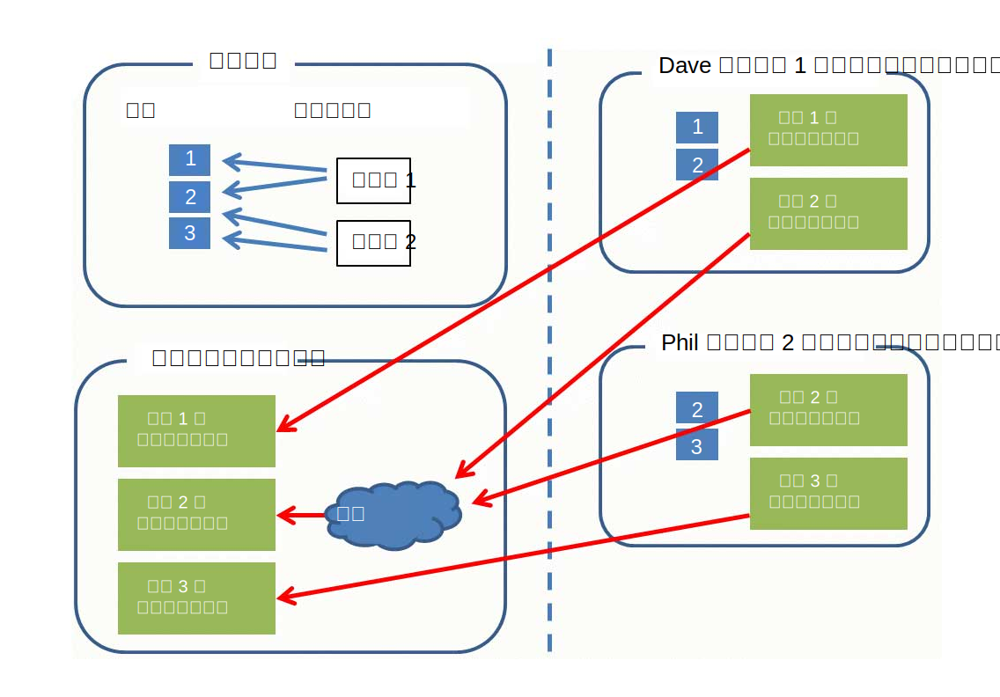

---

copyright:
  years: 2015, 2018
lastupdated: "2018-04-04"

---

{:shortdesc: .shortdesc}
{:new_window: target="_blank"}
{:tip: .tip}
{:pre: .pre}
{:codeblock: .codeblock}
{:screen: .screen}
{:javascript: .ph data-hd-programlang='javascript'}
{:java: .ph data-hd-programlang='java'}
{:python: .ph data-hd-programlang='python'}
{:swift: .ph data-hd-programlang='swift'}

この文書は、{{site.data.keyword.cloud}} 上の {{site.data.keyword.knowledgestudiofull}} に関するものです。前のバージョンの {{site.data.keyword.IBM_notm}} マーケットプレイス上の {{site.data.keyword.knowledgestudioshort}} に関する文書を参照するには、[このリンクをクリックしてください ](https://console.bluemix.net/docs/services/knowledge-studio/documents-for-annotation.html){: new_window}。
{: tip}

# アノテーション用の文書の追加
{: #documents-for-annotation}

機械学習モデルをトレーニングするために、対象分野の知識が含まれている文書 (学術論文や、その他の業界特有のテキストなど) をワークスペースに追加する必要があります。
{: shortdesc}

## この作業について

ルール・ベース・モデル用のルールを定義するため、ルールとして定義するためのパターンを引き出す元となる文書を追加またはアップロードします。詳しくは、『[ルールを定義するための文書の追加](/docs/services/watson-knowledge-studio/rule-annotator-add-doc.html)』を参照してください。このセクションでは、アノテーション付けのための文書の追加方法のみを説明します。

## 文書
{: #wks_sampledoc}

機械学習モデルをトレーニングするためには、対象分野のコンテンツを代表するような文書、およびお客様のアプリケーションにとって価値の高い文書を収集する必要があります。

対象分野にとって関心のあるコンテンツを本当に代表している、つまり、アノテーション付けが可能な関連するメンションが多く含まれているトレーニング文書であることを確実にするよう努めてください。最適な文書を選択するため、以下の指針に従ってください。

- 合計で約 300,000 語が含まれている文書セットを提供するように努力してください。タイプ・システムが複雑な場合は提供する単語数を増やし、単純な場合は減らしてください。
- 各文書を 1 ページまたは 2 ページの内容に制限してください (文書当たり 2,000 語未満。1,000 語前後が最適です)。モデル開発の初期段階では、各文書を数段落にとどめておくのも良い方法です。ヒューマン・アノテーターは、長い文書中のメンションおよび関係にマークを付けることができますが、複数ページにまたがる照応にマークを付けようとすると扱いにくいと感じる可能性があります。
- 文書内のデータ全般に、可能なすべてのエンティティー・タイプ、サブタイプ、および役割と、それらの間の関係がすべて含まれていることを確認してください。目指すゴールは、文書集合において、最終的にエンティティー・タイプごとに 50 以上のアノテーションと、関係タイプごとに 50 以上のアノテーションができることです。
- 繰り返しになりますが、当アプリケーションの処理範囲にする分野全体を表すような文書集合にする必要があります。ただし、エンティティー・タイプおよび関係タイプの出現頻度が偏っているケースでは各タイプごとに少なくとも 50 個、メンションが句である傾向のあるエンティティー・タイプ用にはもっと多くの文書を集めるように努力してください。
- トレーニング用に作成するセットは、アノテーションが付けられた文書を 10 個以上含んでいる必要があります。

モデルを作成およびトレーニングする準備ができたら、ワークスペースに追加する文書を、トレーニング・データ、テスト・データ、およびブラインド・データとして使用されるセットに分割できます。分離されたこれらのデータ・セットは、モデルのパフォーマンスを査定するために重要です。

以下の方法で文書を追加できます。

- UTF-8 形式の 2 列の CSV ファイル
- UTF-8 形式のテキスト・ファイル
- {{site.data.keyword.knowledgestudioshort}} ワークスペースからダウンロードされた文書を含む ZIP ファイル
- UIMA CAS XMI 形式のファイルを含む ZIP ファイル

### CSV ファイル
{: #wks_sampledoc__wks_samplecsv}

サンプル・テキストが含まれている 2 列の CSV ファイルをローカル・マシンからアップロードできます。CSV ファイルは一度に 1 つずつアップロードしてください。CSV ファイルの第 1 列は、文書のファイル名を指定します。ファイルの第 2 列は、文書テキストを含みます。必要なフォーマットの例については、チュートリアル・サンプル・ファイルにある <a href="https://watson-developer-cloud.github.io/doc-tutorial-downloads/knowledge-studio/documents-new.csv" download>`documents-new.csv`</a> ファイルを参照してください。

### 別の Watson Knowledge Studio ワークスペースからの文書
{: #wks_sampledoc__wks_samplecorpus}

前に {{site.data.keyword.knowledgestudioshort}} ワークスペースから文書をダウンロードした場合、ダウンロードした `ZIP` ファイルをアップロードできます。インポートされるファイルにグランド・トゥルース・アノテーションを含めるかどうかを指定するオプションがあります。

文書にアノテーションが付けられた後、アノテーションが付けられた文書は `JSON` 形式で保管されます。これらのファイルでのマークアップ言語は、元の文書テキストがどのように解析およびトークン化されたのかを示すものであり、ヒューマン・アノテーターが追加したすべてのアノテーションのエレメントを含みます。時間が経過するにつれてモデルの正確さが改善されていくようにするため、これらのファイルを別のワークスペースにアップロードし、結果として既存のアノテーションをすべて保存することができます。ヒューマン・アノテーターは、これらの文書のアノテーションを修正、削除、および追加することができます。あるいは、ヒューマン・アノテーションをバイパスし、これらのファイルを使用して、モデルのパフォーマンスを評価および改善するための、トレーニング文書セット、テスト文書セット、およびブラインド文書セットを作成することができます。

### UIMA CAS XMI ファイル
{: #wks_sampledoc__samplexmi}

モデルのトレーニングに役立つように、UIMA 分析エンジンによって事前アノテーション付けが行われた文書をアップロードできます。事前アノテーション付けが行われたファイルは、UIMA Common Analysis Structure の XMI シリアライゼーション (UIMA CAS XMI) 形式でなければならず、結合して 1 つの ZIP ファイルにする必要があります。例えば、ある {{site.data.keyword.IBM_notm}} {{site.data.keyword.watson}} Explorer コレクション内のアノテーションが付けられた文書をアップロードできます。

ヒューマン・アノテーターは、これらの文書のアノテーションを修正、削除、および追加することができます。あるいは、ヒューマン・アノテーションをバイパスし、これらのファイルを使用して、モデルのパフォーマンスを評価および改善するための、トレーニング文書セット、テスト文書セット、およびブラインド文書セットを作成することができます。これらのファイルの作成方法およびアップロードの要件について詳しくは、『[事前アノテーション付けが行われた文書のアップロード](/docs/services/watson-knowledge-studio/preannotation.html#wks_uima)』を参照してください。

### データの匿名化

扱っているデータ向けに最適化されたモデルを構築したいが、プライバシー上の理由からデータをそのまま {{site.data.keyword.knowledgestudioshort}} にアップロードしたくない場合は、個人を特定できる情報 (Personally Identifiable Information (PII)) を文書から取り除いた後で、それらの匿名化された文書をモデルのトレーニングに使用することができます。情報を編集したり、情報を大量に変数で置き換えたりはしないでください。最良の結果を得るには、実際の情報を同じタイプの偽の情報で置き換えてください。

例えば、保護したい PII が顧客名である場合、個々の名前を編集したり、*USER_NAME* などの変数で置き換えたりするのではなく、*Jane Doe*、*Mr. Smith*、*Dietrich*、*Dr. Jones, PhD* など、さまざまな標準的な名前構文スタイルを使用する偽の名前で置き換えます。実際のユーザー名のインスタンスを置き換えるために文書に挿入できる偽の名前を、さまざまな名と姓、および役職と姓を連結したり、姓のみを追加したりして生成するスクリプトを作成することを検討してください。目標は、ソース文書内の実際の値にできる限り近いシミュレーションを行うことです。文書内で同じテキスト (USER_NAME) が使われたり、テキストが編集されたりした場合は、基本的に、すべての名前が同じ値になっていたり、編集されていたりすることを予期するようにモデルをトレーニングすることになります。モデルが実行時に新規文書に対して使用され、前に見たことのない多様な名前を検出した場合、それらを名前として認識できるモデルであるようにしてください。

## ワークスペースへの文書の追加
{: #wks_projadd}

モデルをトレーニングするには、対象分野の内容を代表するような文書をワークスペースに追加する必要があります。

### この作業について

ベスト・プラクティスとして、比較的小さな文書集合から始めてください。これらの文書を使用して、ヒューマン・アノテーターの訓練 (ワークスペースがヒューマン・アノテーションを含む場合) およびアノテーション・ガイドラインの改良を行います。文書が小さいと、ヒューマン・アノテーターが文書全体で照応チェーンを識別しやすくなります。アノテーションの正確度が向上するにつれ、もっと深くトレーニングが行われるように、さらに多くの文書をコーパスに追加できます。

### 手順

ワークスペースに文書を追加するには、次のようにします。

1. {{site.data.keyword.knowledgestudioshort}} 管理者またはプロジェクト管理者としてログインし、ワークスペースを選択します。
1. **「アセット & ツール (Assets & Tools)」** > **「文書 (Documents)」** > **「文書セット (Documentation sets)」**タブを選択します。
1. 文書をコーパスに追加するため、**「文書セットのアップロード (Upload Document Sets)」**をクリックします。
1. 以下のいずれかの形式で文書をアップロードします。一度に 1 つのタイプのファイルをアップロードできます。

    <table border="1" frame="hsides" rules="rows" cellpadding="4" cellspacing="0" summary="この表では行ごとに 1 つの選択可能なオプションを記述しています。" class="simpletable choicetable choicetableborder">
      <thead><tr><th id="d31095e284-option" valign="bottom" align="left" class="ncol thleft thbot">オプション</th>
          <th id="d31095e284-desc" valign="bottom" align="left" class="ncol thleft thbot">説明</th></tr></thead>
      <tbody><tr class="strow chrow"><td valign="top" headers="d31095e284-option" id="d31095e286" class="stentry choption ncol">
<strong>CSV ファイル</strong>
</td>
          <td valign="top" headers="d31095e284-desc d31095e286" class="stentry chdesc ncol">
サンプル文書群を含んでいる 1 つの CSV ファイルをドラッグするか、ローカル・システム上のファイルを見つけてクリックし、<b>「アップロード (Upload)」</b>をクリックします。CSV ファイルの第 1 列は、文書のファイル名を指定します。ファイルの第 2 列は、文書テキストを含みます。CSV ファイルは UTF-8 形式でなければなりません。
</td>
        </tr>
        <tr class="strow chrow"><td valign="top" headers="d31095e284-option" id="d31095e294" class="stentry choption ncol">
<strong>テキスト・ファイル</strong>
</td>
          <td valign="top" headers="d31095e284-desc d31095e294" class="stentry chdesc ncol">
ローカル・システムから 1 つ以上のテキスト・ファイルをドラッグするか、ファイルを見つけてクリックして選択し、<b>「アップロード (Upload)」</b>をクリックします。テキスト・ファイルは UTF-8 形式でなければなりません。
</td>
        </tr>
        <tr class="strow chrow"><td valign="top" headers="d31095e284-option" id="d31095e302" class="stentry choption ncol">
<strong>DOCXML ファイル</strong>
</td>
          <td valign="top" headers="d31095e284-desc d31095e302" class="stentry chdesc ncol">
ローカル・システムから 1 つ以上の <code>DOCXML</code> ファイルをドラッグするか、ファイルを見つけてクリックして選択し、<b>「アップロード (Upload)」</b>をクリックします。<code>DOCXML</code> ファイルは、別の機械学習モデルからダウンロードした文書でなければならず、UTF-8 形式でなければなりません。これらの文書は、アップロード時に再トークン化されません。
</td>
        </tr>
        <tr class="strow chrow"><td valign="top" headers="d31095e284-option" id="d31095e316" class="stentry choption ncol">
<strong>ZIP ファイル</strong>
</td>
          <td valign="top" headers="d31095e284-desc d31095e316" class="stentry chdesc ncol">
前に Watson Knowledge Studio ワークスペースから文書をダウンロードした場合、ダウンロードされた文書を含んでいる <code>ZIP</code> ファイルをドラッグするか、ファイルを見つけてクリックして選択します。文書がダウンロードされる前にその文書に追加されたアノテーションを含めたい場合は、グランド・トゥルースを含めるオプションが選択されていることを確認してから、<b>「アップロード (Upload)」</b>をクリックします。文書がダウンロードされる前にグランド・トゥルースにプロモートされたアノテーションのみがインポートされます。

<b>制限:</b> アノテーションが付けられた文書がインポートされるとき、それらの文書は再トークン化されます。このプロセスによって、Watson Knowledge Studio がそれらの文書で何をセンテンス境界と見なすのかが変わる可能性があります。アノテーションはセンテンスごとに定義されるため、アノテーションによってはこのプロセス中に無効化される可能性があります。別のワークスペースから文書をアップロードした後、アノテーションを素早くレビューして、矛盾があれば対処してください。

            
グランド・トゥルース・アノテーションをアップロードする前に、元のワークスペースから現行のワークスペースにタイプ・システムをアップロードする必要があります。詳しくは、『[別のワークスペースからのリソースのアップロード ](exportimport.html){: new_window}』を参照してください。

            
アノテーションが付けられた、UIMA CAS XMI 形式の文書を以前にダウンロードした場合、分析されたコンテンツを含む <code>ZIP</code> ファイルをアップロードできます。これがアップロードしたいコンテンツのタイプであることを指定してから、<b>「アップロード (Upload)」</b>をクリックしてください。これらのファイルの作成方法およびアップロードの要件について詳しくは、『[事前アノテーション付けが行われた文書のアップロード ](preannotation.html#wks_uima){: new_window}』を参照してください。

          </td>
        </tr>
      </tbody>
    </table>

1. 文書が追加された後、文書名をクリックして文書をプレビューし、内容に問題がなさそうなことを確認します。例えば、テキスト・ファイルが UTF-8 形式であること、発音区別符号または文字の正規化についての問題が文書中にないことを確認し、センテンスの切れ目がおかしくないかをチェックします。問題が存在する場合は、コーパスに追加する前にファイルの前処理が必要になる可能性があります。辞書アノテーションまたはヒューマン・アノテーションが始まる前に、文書をできるだけクリーンかつ適切にフォーマットされた状態にしてください。

### 次に行うこと

ヒューマン・アノテーション・タスクを開始する前に、コーパスを複数の文書セットに分割し、それらの文書セットをヒューマン・アノテーターに割り当てます。

## アノテーション・セットの作成および割り当て
{: #wks_projdocsets}

文書を追加した後、それらの文書をいくつかのセットに分割して、複数のヒューマン・アノテーターによってアノテーションを付けることができるようにします。アノテーター間一致スコアを確認するためには、少なくとも 2 人のヒューマン・アノテーターを割り当て、一定の割合の文書がセット間で重複することを指定する必要があります。

### 始めに

- 文書セットをアップロードしてからでないと、それらをアノテーション・セットに分割することはできません。
- このワークスペース内の文書を処理するすべてのヒューマン・アノテーターについて、{{site.data.keyword.knowledgestudioshort}} でユーザー・アカウントを作成する必要があります。

### この作業について

> **注意:** Google Chrome ブラウザーを使用する場合、多数のファイル (例えば 300 を超えるファイル) をフォルダーから選択してアップロードすることはできません。回避策は、Firefox ブラウザーを使用すること、または、選択するファイルの数を減らし、何回かに分けてファイルをアップロードすることです。

ワークスペース当たり最大 1,000 のアノテーション・セットを作成できます。

### 手順

アノテーション・セットを作成するには、次のようにします。

1. {{site.data.keyword.knowledgestudioshort}} 管理者またはプロジェクト管理者としてログインし、ワークスペースを選択します。
1. **「アセット & ツール (Assets & Tools)」** > **「文書 (Documents)」** > **「アノテーション・セット (Annotation sets)」**タブを選択します。
1. **「アノテーション・セットの作成」**をクリックします。

    1. 基本セットに、アノテーション・セットに分割したい文書の集合 (コーパス内のすべての文書か、前に 1 つの文書セットに割り振られていた文書のいずれか) を選択します。

    1. 重複値に、各アノテーション・セットに含める文書のパーセンテージを指定します。2 人以上のヒューマン・アノテーターが同じ文書にアノテーションを付けないと、アノテーター間一致スコアを計算できません。例えば、30 文書を含むコーパスに対して 20% の重複値を指定し、コーパスを 3 つの文書セットに分割した場合、6 つの文書 (20%) にはすべてのヒューマン・アノテーターがアノテーションを付けることになります。残りの 24 文書は、3 人のヒューマン・アノテーターに分配されます (それぞれ 8 ずつ)。したがって、各アノテーターは、アノテーションを付ける対象として 14 文書を受け取ります (6+8)。

    > **注:** 機械学習モデルのトレーニングに使用する予定のアノテーション・セットには、アノテーションが付けられた文書が 10 以上含まれている必要があります。

    1. ヒューマン・アノテーターのリストからユーザー名を選択します。

        > **注:** 無料プランのサブスクリプションをお持ちの場合は、自分自身をアノテーション・セットに関連付けてください。他のユーザーを追加して、彼らをヒューマン・アノテーター役割に割り当てることはできません。しかし、自分自身を追加することによって、自分でヒューマン・アノテーターの役割を果たし、本当のヒューマン・アノテーターがグランド・トゥルース・エディターをどのように操作して文書にアノテーションを付けるのかを試してみることができます。

    1. アノテーション・セットに名前を付けます。

        ヒューマン・アノテーターの作業をワークスペースの進行に応じて評価するための優れた方法として、アノテーション・セットには、そのセットに割り当てられたヒューマン・アノテーターを識別できるような名前を付けることをお勧めします。 アノテーション・セットの作成後に名前を変更することはできません。

1. このワークスペースで作業するすべてのヒューマン・アノテーターの割り当てが終了したら、**「生成 (Generate)」**をクリックしてアノテーション・セットを作成します。ヒューマン・アノテーターがグランド・トゥルース・エディターにログインしたときに表示されるのは、自分に割り当てられたアノテーション・セットのみです。

**関連タスク**:

[チームのアセンブル](/docs/services/watson-knowledge-studio/team.html)

## 文書の削除
{: #wks_projdelete}

モデルにとって有益な標準的な業界テキストを表していないと判断した文書を削除できます。

### 手順

文書を削除するには、以下のステップを実行します。

1. {{site.data.keyword.knowledgestudioshort}} 管理者としてログインし、ワークスペースを選択します。
1. **「アセット & ツール (Assets & Tools)」** > **「文書 (Documents)」** > **「文書セット (Document sets)」**タブを選択します。
1. 削除する文書を見つけて、**「削除 (Delete)」**をクリックします。
1. アノテーション・タスクに関連付けられているアノテーション・セットに含まれているドキュメントを削除することはできません。文書がアノテーション・セットの一部であるが、まだタスクに関連付けられていない場合は、前のステップに従って文書を削除できます。

    文書がアノテーション・タスクに関連付けられている場合は、以下のいずれかの作業を実行します。
    - ヒューマン・アノテーターが文書にアノテーションを付ける作業を開始していない場合、アノテーション・タスクを削除し、その後で文書を削除します。アノテーション・タスクを削除するには、**「アセット & ツール (Assets & Tools)」** > **「文書 (Documents)」** > **「タスク (Tasks)」**タブを開き、文書が関連付けられているアノテーション・タスクを見つけ、そのタスクの**「メニューの表示 (Show menu)」**アイコンをクリックし、**「削除 (Delete)」**をクリックします。その後、アノテーション・タスクを再作成し、文書が 1 つ少なくなっている、同じアノテーション・セットを関連付けることができます。
    - ヒューマン・アノテーターが文書にアノテーションを付ける作業を開始済みの場合、タスクを削除するとアノテーターの作業が失われるので、タスクを削除しないでください。セット内の不要な文書を無視して作業を続行するように彼らに依頼できます。彼らが他のすべてのアノテーション付けの作業を終了したら、セットをグランド・トゥルースに追加する処理を実行します。追加されたが、まだ誰も機械学習モデルを実行していないうちに、不要な文書を削除します。機械学習モデルは、何にアノテーションが付けられていないのかということからも、何に付けられているのかということからと同じように学習するため、アノテーション付けが行われていない文書をモデルのトレーニングに使用することはお勧めしません。これで、**「アセット & ツール (Assets & Tools)」** > **「文書 (Documents)」** > **「文書セット (Document sets)」**タブから、現在はグランド・トゥルースの一部になっている不要な文書を削除することができます。

## データ・モデル
{: #wks_datamodel}

このトピックにある図は、{{site.data.keyword.knowledgestudioshort}} システムにおける文書の流れの概略を示し、コーパス内の文書、アノテーション・タスク、およびグランド・トゥルースの違いを示します。

コーパスには文書が含まれていて、それらは複数の文書セットに分割されます。

- 文書は、一連のテキスト・ストリングにすぎません。
- 文書セットは、文書のグループを指すポインターです。文書セットは文書自体のコピーを含みません。
- いくつかの文書セットが単一の文書をポイントできます。これは、アノテーション・セットを作成するときに指定する重複パラメーターを通して制御できるセットアップです。

 図 1. この図は、3 つの文書をポイントする 2 つの文書セットを表しています。文書はセットに分配されています。

グランド・トゥルースは、文書に追加されたアノテーション (メンション、関係、および、照応するメンション) からなります。グランド・トゥルースは、文書ごとに特異です。

 図 2. この図は、文書 1、文書 2、文書 3 に追加されたアノテーションからなるグランド・トゥルースを表しています。

アノテーション・タスクを作成すると、そのタスクに追加するアノテーション・セット内で、文書ごとにアノテーションのコピーが作成されます。ヒューマン・アノテーターは、文書にアノテーションを付けます。アノテーションは互いに分離されていて、グランド・トゥルースからも分離されています。アノテーション・タスクは、ヒューマン・アノテーターたちが別々の場所でテキストにアノテーションを付けるのを許可するために存在する、一時的な概念です。対照的に、グランド・トゥルースは、永続的であり、特異です。

 図 2. この図では、プロジェクト管理者がアノテーション・セットを作成し、それらのセットを 1 つのアノテーション・タスクに割り当てることが示されています。ヒューマン・アノテーターである Dave と Phil は、自分に割り当てられたセット内の文書にアノテーションを付けます。

プロジェクト管理者がアノテーション・タスク内のアノテーション・セットを承認すると、他のアノテーション・セットと重複していない文書内のアノテーションはグランド・トゥルースになります。複数のアノテーション・セットで重複している文書 (この例では文書 2) については、プロジェクト管理者が裁定し、競合を解決する必要があります。重複文書内のアノテーションは、裁定を通して承認されるまではグランド・トゥルースになりません。

その後、グランド・トゥルースは、機械学習モデルのトレーニングおよびテストに使用されます。あるいは、次のモデル開発を反復するための基礎として使用することもできます。グランド・トゥルースを次の反復で使用するには、新しいアノテーション・タスクを作成する必要があります。

 図 3. この図は、2 人のヒューマン・アノテーターによって追加されたアノテーションがどのようにグランド・トゥルースになるのかを表しています。文書 2 というラベルの 1 つの文書には、両方のヒューマン・アノテーターによってアノテーションが付けられています。この重複文書内のアノテーションは、グランド・トゥルースになる前に裁定される必要があります。
