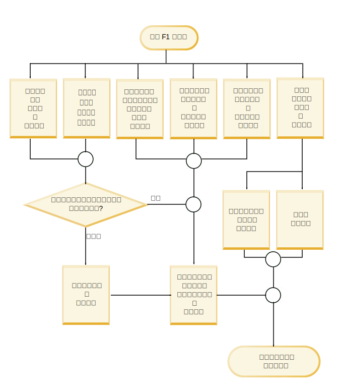
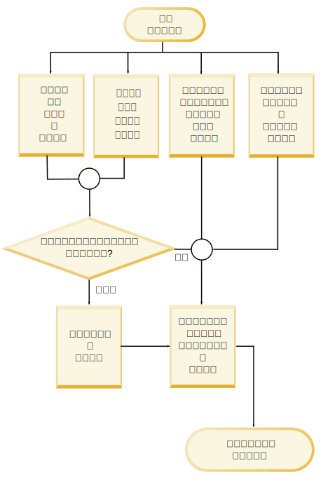

---

copyright:
  years: 2015, 2018
lastupdated: "2018-08-03"

---

{:shortdesc: .shortdesc}
{:new_window: target="_blank"}
{:tip: .tip}
{:pre: .pre}
{:codeblock: .codeblock}
{:screen: .screen}
{:javascript: .ph data-hd-programlang='javascript'}
{:java: .ph data-hd-programlang='java'}
{:python: .ph data-hd-programlang='python'}
{:swift: .ph data-hd-programlang='swift'}

この文書は、{{site.data.keyword.cloud}} 上の {{site.data.keyword.knowledgestudiofull}} に関するものです。 前のバージョンの {{site.data.keyword.IBM_notm}} マーケットプレイス上の {{site.data.keyword.knowledgestudioshort}} に関する文書を参照するには、[このリンクをクリックしてください ](https://console.bluemix.net/docs/services/knowledge-studio/evaluate-ml.html){: new_window}。
{: tip}

# 機械学習モデルのパフォーマンスの分析
{: #evaluate-ml}

トレーニング済みのモデルによって追加されたアノテーションを審査することによって、文書内で妥当なエンティティー・メンション、関係メンション、および照応を見つける機能を向上させるためにモデルを調整する必要があるかどうかを判別します。
{: shortdesc}

## この作業について
{: #evaluate-ml_about}

エンティティー・タイプ、関係タイプ、および照応するメンションに関する統計情報の要約を表示して、パフォーマンスを分析することができます。 *コンフュージョン・マトリックス* で表される統計情報を分析することもできます。 コンフュージョン・マトリックスは、機械学習モデルによって追加されたアノテーションとグランド・トゥルース内のアノテーションを比較するのに役立ちます。

モデルの統計情報では、以下のメトリックが提供されます。

- **F1 スコア (F1 score)**

    精度とリコールの両方を考慮してスコアを計算する測定値。 F1 スコアは、精度値とリコール値の加重平均であると解釈できます。F1 スコアの最高の値は 1、最悪の値は 0 です。『[低い F1 スコアの分析](/docs/services/watson-knowledge-studio/evaluate-ml.html#evaluate-mllowf1)』を参照してください。

- **精度 (Precision)**

    ヒューマン・アノテーターの出力と比較したときに、機械学習モデルの出力のどのくらいの割合が正確だったのかを示す測定値。 精度は、正しくラベル付けされたアノテーションの数を、機械学習モデルによって追加されたアノテーションの総数で除算することで算出されます。 エンティティー・タイプ A の精度スコアが 1.0 であるということは、エンティティー・タイプ A とラベル付けされたすべてのメンションが、実際にその分類に属していることを意味します。 低い精度スコアは、機械学習モデルが誤ったアノテーションを作成した場所を特定するのに役立ちます。 ヒューマン・アノテーターによってエンティティー・タイプ A とラベル付けされたメンションが他にもあって、機械学習モデルでは欠落していても、その数はこのスコアに何も関係ありません。その情報はリコール・スコアに反映されます。 『[低い精度スコアの分析](/docs/services/watson-knowledge-studio/evaluate-ml.html#evaluate-mllowp)』を参照してください。

- **リコール (Recall)**

    特定のラベルでアノテーションが付けられるべきだったメンションのうちのいくつが実際にそのラベルでアノテーションが付けられたのか、つまり、同じ文書内でヒューマン・アノテーターが識別した*正しい* メンションであったのかを示す測定値。 リコールは、正しくラベル付けされたアノテーションの数を、作成されるべきだったアノテーションの数で除算することで算出されます。 リコール・スコア 1.0 は、エンティティー・タイプ A とラベル付けされるべきだったすべてのメンションが正しくラベル付けされたことを意味します。 低いリコール・スコアは、作成するべきだったアノテーションを機械学習モデルが作成できなかった場所を特定するのに役立ちます。 そうするべきではなかったのにエンティティー・タイプ A とラベル付けされたメンションが他にいくつあるのかは、このスコアには何も関係ありません。その情報は精度スコアに反映されます。 『[低いリコール・スコアの分析](/docs/services/watson-knowledge-studio/evaluate-ml.html#evaluate-mllowr)』を参照してください。

- **合計アノテーションのパーセンテージ (Percentage of total annotations)**

    テスト文書セット内で任意のエンティティー・タイプまたは関係タイプでアノテーションが付けられた単語の総数のうち、ある特定のエンティティー・タイプまたは関係タイプでアノテーションが付けられたのはいくつの単語なのかを示す、グランド・トゥルースの測定値。 この統計は、照応するメンションには使用できません。 この値は、あるタイプのメンションが、グランド・トゥルース内の他のタイプに比べてどの程度よくあるのかを知るのに役立ちます。

- **コーパス密度のパーセンテージ (単語数) (Percentage of corpus density (by the number of words)**

    アノテーションが付けられたかどうかに関係なく単語の総数のうち、ある特定のエンティティー・タイプまたは関係タイプでアノテーションが付けられた単語の数を示す、グランド・トゥルースの測定値。 この統計は、照応するメンションには使用できません。 この値は、このタイプのメンションが、対象分野の文書内の他のすべての単語に比べてどの程度よくあるのかを知るのに役立ちます。

- **特定タイプを含む文書のパーセンテージ (Percentage of documents that contain the type)**

    ある特定のエンティティー・タイプまたは関係タイプがどのくらいの数の文書に含まれているのかを示す、グランド・トゥルースの測定値。 この統計は、照応するメンションには使用できません。 この値は、セット内の文書が対象分野を十分に表しているかどうかを査定するのに役立ちます。 主要なエンティティー・タイプについてのパーセンテージが低い場合、該当するタイプのメンションが含まれている文書をさらに追加することが推奨されます。

## 手順
{: #evaluate-ml_procedure}

モデルのトレーニング成績を表すパフォーマンス統計情報を表示するには、次のようにします。

1. {{site.data.keyword.knowledgestudioshort}} 管理者またはプロジェクト管理者としてログインし、ワークスペースを選択します。
1. **「機械学習モデル」** > **「パフォーマンス」**を選択します。
1. メンション、関係、または照応に対して**「詳細統計 (Detailed Statistics)」**リンクを選択します。
1. **「サマリー (Summary)」**ビューで、テスト・データとトレーニング・データのどちらを評価するのかを指定し、次に、統計情報を表示したいアノテーションのタイプ (エンティティー・タイプ、関係タイプ、または照応するメンション) を指定します。 データをスクロールすると、スコアが低い項目は、調査と改善が必要であることを示すために、フラグが付けられ、強調表示されています。 三角形の警告アイコンは、F1 値が固定値 0.5 より小さいことを示します。

    例えば、ヒューマン・アノテーターだけでなくプレアノテーターによっても文書にアノテーションが付けられたために、いくつかのエンティティー・タイプの F1 スコアが高くなることがあります。 しかし、他のエンティティー・タイプの F1 スコアは、文章の表現法の違い、ヒューマン・アノテーターたちがテキストまたはアノテーション・ガイドラインをどう解釈するのかの違いが原因で、低くなることがあります。この場合、機械学習モデルはパターンを認識して正しいアノテーションを適用するのが難しくなります。

1. テスト・データの**「コンフュージョン・マトリックス (Confusion Matrix)」**ビューで、統計情報を表示したいアノテーションのタイプ (エンティティー・タイプまたは関係タイプ) を指定します。 エンティティー・タイプまたは関係タイプごとに、以下のようになっています。

    - マトリックスの各行は、グランド・トゥルース (ヒューマン・アノテーターによって追加されたエンティティー・タイプおよび関係タイプ) を示します。
    - マトリックスの各列は、デコード結果 (機械学習モデルによって追加されたアノテーション・トークン) を示します。
    - 各セルに入っている数値は、メンションのオカレンス数ではなく、メンション当たりのアノテーション・トークンの数を表します。

        トークンは、テキスト・ストリングの区切りをはっきりさせるために使用されます。 トークンと単語はゆるやかに対応します。 1 つのメンションが複数のトークンを含むことができます。 例えば、*Barack Obama* は、2 つのトークンを含んでいる 1 つのメンションです。 PERSON 行または列では、文書内の 1 つのメンション *Barack Obama* を表すために、値 2 が使用されます。 シチュエーションによってはトークンの数え方が異なるため、トークン数は単語数にゆるやかに対応します。 例えば、センテンスの末尾にある句読点は 1 つのトークンとしてカウントされ、縮約形は多くの場合 2 つのトークンに展開されます。

    - **O** というラベルの列は、交差する行 (ヒューマン・アノテーション) で識別されたタイプとして機械学習モデルによってアノテーションが付けられる必要があったが、どのタイプとしてもアノテーションが付けられていないトークンを示します。
    - 文書セット内に当該タイプのアノテーションがない場合は、値 **N/A** が表示されます。 例えば、グランド・トゥルース用にアノテーションが付けられたか、またはテスト・データとしてアノテーションが付けられた文書セット中に、PERSON メンションがない場合、PERSON エンティティー・タイプのスコアは N/A です。

    例えば、以下のコンフュージョン・マトリックス例は、交通事故を扱う文書に対する機会学習モデルの実行結果を表しています。

    <table summary="インシデント・レポートのコンフュージョン・マトリックス例">
       <caption>表 1. コンフュージョン・マトリックス例</caption>
       <tr>
        <th style="vertical-align:bottom; text-align:left" id="d15356e164">エンティティー・タイプ</th>
        <th style="vertical-align:bottom; text-align:center" id="d15356e166">MANUFACTURER</th>
        <th style="vertical-align:bottom; text-align:center" id="d15356e168">MODEL</th>
        <th style="vertical-align:bottom; text-align:center" id="d15356e170">O</th>
      </tr>
      <tr>
        <td style="vertical-align:top; text-align:left" headers="d15356e164">MANUFACTURER</td>
        <td style="vertical-align:top; text-align:center" headers="d15356e166">515</td>
        <td style="vertical-align:top; text-align:center" headers="d15356e168">5</td>
        <td style="vertical-align:top; text-align:center" headers="d15356e170">44</td>
      </tr>
    </table>
    {: #evaluate-ml__datasimpletable_yms_hff_cw}

    このマトリックスから、以下のことを読み取ることができます。
    - このモデルは、515 個のトークンを、MANUFACTURER エンティティー・タイプのメンションとして正しく認識しました。
    - このモデルは、5 個のトークンを、MANUFACTURER としてラベルが付けられる必要があったが、誤って MODEL タイプのメンションとしてラベル付けました。
    - このモデルがどのエンティティー・タイプとしてもアノテーションを付けなかった、MANUFACTURER タイプのメンションを構成するトークンが 44 個ありました。

    モデルのパフォーマンスを評価し、デコード結果を確認するときには、誤ったラベルが付けられたか、まったくラベルが付けられなかったトークンを調査することから開始できます。

## パフォーマンス改善のための虎の巻
{: #evaluate-ml_cheat}

機械学習モデルのパフォーマンスを改善するために実行できるステップを決める際の参考として、この虎の巻を使用できます。

タイプ・システムの複雑さ、トレーニング文書の適切さ、ヒューマン・アノテーターのスキル、およびその他の要因が結果に影響するため、分野をまたがって当てはまるようなパフォーマンス・スコア改善ルールを決めるのは困難です。 しかし、モデル開発およびテストという初期段階では特に、初期査定およびパフォーマンス改善ステップの実行に、以下の表が役立つことがあります。

次の表に、機械学習モデルでの最も一般的なパフォーマンス問題に対して推奨される修正方法を示します。

<table summary="この表では、一般的な問題を最初の列の下方向にリストし、推奨される修正方法を最初の行の横方向にリストしています。X マークは、どの修正方法がどの問題に適用されるかを示しています。">
    <caption>表 2. 一般的なパフォーマンス問題に対する修正方法</caption>
    <tr>
      <th style="vertical-align:bottom; text-align:left" id="d15356e221">問題</th>
      <th style="vertical-align:bottom; text-align:center" id="d15356e223">辞書を追加する</th>
      <th style="vertical-align:bottom; text-align:center" id="d15356e225">文書セットを編集する</th>
      <th style="vertical-align:bottom; text-align:center" id="d15356e227">タイプ固有の文書を追加する</th>
      <th style="vertical-align:bottom; text-align:center" id="d15356e229">コーパスにさらにアノテーションを付ける</th>
      <th style="vertical-align:bottom; text-align:center" id="d15356e231">ヒューマン・アノテーションを修正する</th>
      <th style="vertical-align:bottom; text-align:center" id="d15356e233">ヒューマン・アノテーター・ガイドラインを改善する</th>
      <th style="vertical-align:bottom; text-align:center" id="d15356e235">タイプ・システムを更新する</th>
      <th style="vertical-align:bottom; text-align:center" id="d15356e237">さらに調査する</th>
    </tr>
    <tr>
      <td style="vertical-align:top; text-align:left" headers="d15356e221">低い F1</td>
      <td style="vertical-align:top; text-align:center" headers="d15356e223">X</td>
      <td style="vertical-align:top; text-align:center" headers="d15356e225">X</td>
      <td style="vertical-align:top; text-align:center" headers="d15356e227">X</td>
      <td style="vertical-align:top; text-align:center" headers="d15356e229">X</td>
      <td style="vertical-align:top; text-align:center" headers="d15356e231">X</td>
      <td style="vertical-align:top; text-align:center" headers="d15356e233">X</td>
      <td style="vertical-align:top; text-align:center" headers="d15356e235">X</td>
      <td style="vertical-align:top; text-align:center" headers="d15356e237">X</td>
    </tr>
    <tr>
      <td style="vertical-align:top; text-align:left" headers="d15356e221">低い精度</td>
      <td style="vertical-align:top; text-align:center" headers="d15356e223"></td>
      <td style="vertical-align:top; text-align:center" headers="d15356e225"></td>
      <td style="vertical-align:top; text-align:center" headers="d15356e227"></td>
      <td style="vertical-align:top; text-align:center" headers="d15356e229">X</td>
      <td style="vertical-align:top; text-align:center" headers="d15356e231">X</td>
      <td style="vertical-align:top; text-align:center" headers="d15356e233">X</td>
      <td style="vertical-align:top; text-align:center" headers="d15356e235">X</td>
      <td style="vertical-align:top; text-align:center" headers="d15356e237">X</td>
    </tr>
    <tr>
      <td style="vertical-align:top; text-align:left" headers="d15356e221">低いリコール</td>
      <td style="vertical-align:top; text-align:center" headers="d15356e223">X</td>
      <td style="vertical-align:top; text-align:center" headers="d15356e225">X</td>
      <td style="vertical-align:top; text-align:center" headers="d15356e227">X</td>
      <td style="vertical-align:top; text-align:center" headers="d15356e229">X</td>
      <td style="vertical-align:top; text-align:center" headers="d15356e231"></td>
      <td style="vertical-align:top; text-align:center" headers="d15356e233"></td>
      <td style="vertical-align:top; text-align:center" headers="d15356e235"></td>
      <td style="vertical-align:top; text-align:center" headers="d15356e237"></td>
    </tr>
    <tr>
      <td style="vertical-align:top; text-align:left" headers="d15356e221">低いアノテーション %</td>
      <td style="vertical-align:top; text-align:center" headers="d15356e223"></td>
      <td style="vertical-align:top; text-align:center" headers="d15356e225">X</td>
      <td style="vertical-align:top; text-align:center" headers="d15356e227">X</td>
      <td style="vertical-align:top; text-align:center" headers="d15356e229">X</td>
      <td style="vertical-align:top; text-align:center" headers="d15356e231"></td>
      <td style="vertical-align:top; text-align:center" headers="d15356e233"></td>
      <td style="vertical-align:top; text-align:center" headers="d15356e235"></td>
      <td style="vertical-align:top; text-align:center" headers="d15356e237"></td>
    </tr>
    <tr>
      <td style="vertical-align:top; text-align:left" headers="d15356e221">低い密度</td>
      <td style="vertical-align:top; text-align:center" headers="d15356e223"></td>
      <td style="vertical-align:top; text-align:center" headers="d15356e225">X</td>
      <td style="vertical-align:top; text-align:center" headers="d15356e227">X</td>
      <td style="vertical-align:top; text-align:center" headers="d15356e229">X</td>
      <td style="vertical-align:top; text-align:center" headers="d15356e231"></td>
      <td style="vertical-align:top; text-align:center" headers="d15356e233"></td>
      <td style="vertical-align:top; text-align:center" headers="d15356e235"></td>
      <td style="vertical-align:top; text-align:center" headers="d15356e237"></td>
    </tr>
    <tr>
      <td style="vertical-align:top; text-align:left" headers="d15356e221">タイプの文書が少ない</td>
      <td style="vertical-align:top; text-align:center" headers="d15356e223"></td>
      <td style="vertical-align:top; text-align:center" headers="d15356e225"></td>
      <td style="vertical-align:top; text-align:center" headers="d15356e227">X</td>
      <td style="vertical-align:top; text-align:center" headers="d15356e229">X</td>
      <td style="vertical-align:top; text-align:center" headers="d15356e231"></td>
      <td style="vertical-align:top; text-align:center" headers="d15356e233"></td>
      <td style="vertical-align:top; text-align:center" headers="d15356e235">X</td>
      <td style="vertical-align:top; text-align:center" headers="d15356e237"></td>
    </tr>
    <tr>
      <td style="vertical-align:top; text-align:left" headers="d15356e221">誤った分類</td>
      <td style="vertical-align:top; text-align:center" headers="d15356e223">X</td>
      <td style="vertical-align:top; text-align:center" headers="d15356e225"></td>
      <td style="vertical-align:top; text-align:center" headers="d15356e227"></td>
      <td style="vertical-align:top; text-align:center" headers="d15356e229"></td>
      <td style="vertical-align:top; text-align:center" headers="d15356e231"></td>
      <td style="vertical-align:top; text-align:center" headers="d15356e233"></td>
      <td style="vertical-align:top; text-align:center" headers="d15356e235">X</td>
      <td style="vertical-align:top; text-align:center" headers="d15356e237"></td>
    </tr>
    <tr>
      <td style="vertical-align:top; text-align:left" headers="d15356e221">アノテーションが欠落 </td>
      <td style="vertical-align:top; text-align:center" headers="d15356e223">X</td>
      <td style="vertical-align:top; text-align:center" headers="d15356e225"></td>
      <td style="vertical-align:top; text-align:center" headers="d15356e227"></td>
      <td style="vertical-align:top; text-align:center" headers="d15356e229">X</td>
      <td style="vertical-align:top; text-align:center" headers="d15356e231"></td>
      <td style="vertical-align:top; text-align:center" headers="d15356e233"></td>
      <td style="vertical-align:top; text-align:center" headers="d15356e235"></td>
      <td style="vertical-align:top; text-align:center" headers="d15356e237"></td>
    </tr>
    <tr>
      <td style="vertical-align:top; text-align:left" headers="d15356e221">テスト結果とトレーニング結果のギャップ </td>
      <td style="vertical-align:top; text-align:center" headers="d15356e223"></td>
      <td style="vertical-align:top; text-align:center" headers="d15356e225">X</td>
      <td style="vertical-align:top; text-align:center" headers="d15356e227"></td>
      <td style="vertical-align:top; text-align:center" headers="d15356e229"></td>
      <td style="vertical-align:top; text-align:center" headers="d15356e231"></td>
      <td style="vertical-align:top; text-align:center" headers="d15356e233"></td>
      <td style="vertical-align:top; text-align:center" headers="d15356e235"></td>
      <td style="vertical-align:top; text-align:center" headers="d15356e237"></td>
    </tr>
    <tr>
      <td style="vertical-align:top; text-align:left" headers="d15356e221">トレーニング・データのテストでの F1 が低い</td>
      <td style="vertical-align:top; text-align:center" headers="d15356e223"></td>
      <td style="vertical-align:top; text-align:center" headers="d15356e225"></td>
      <td style="vertical-align:top; text-align:center" headers="d15356e227"></td>
      <td style="vertical-align:top; text-align:center" headers="d15356e229"></td>
      <td style="vertical-align:top; text-align:center" headers="d15356e231">X</td>
      <td style="vertical-align:top; text-align:center" headers="d15356e233">X</td>
      <td style="vertical-align:top; text-align:center" headers="d15356e235"></td>
      <td style="vertical-align:top; text-align:center" headers="d15356e237">X</td>
    </tr>
</table>
{: #evaluate-ml_cheat__datasimpletable_nhm_5ym_cw}

### 修正方法の説明
{: #evaluate-ml_fixes}

- **辞書を追加する**

    1 つの辞書には、ある 1 つのエンティティー・タイプの表層形の例が含まれます。 トレーニング統計情報で、トレーニング・データに当該タイプのアノテーションがあまり出現しないことが示されている場合、新しい辞書を追加するか、または、既存の辞書に項目をさらに追加することが必要であると考えられます。 当該エンティティー・タイプが対象分野にとって重要であり、頻繁に出現することが分かっている場合、この脱落は、そのタイプと関連付けられた表層形が、トレーニング・データ内に存在*する* が、機械学習モデルによって認識されていないことを示している可能性があります。 もっと多くの表層形の例を提供することがこの問題が解決に役立つことがあります。

- **文書セットを編集する**

    総合的なトレーニング・データが十分にあることを確認してください。 機械学習モデルは、学習するために十分なコンテンツを必要とします。 約 300,000 語を提供するように努めてください (量は、ソース文書に対してワード・カウント・ツールを実行することによって確認できます)。 トレーニング・セットが小さすぎる場合、コーパスに文書を追加してください。 重要な各エンティティー・タイプまたは関係を訓練するために少数の文書を用意するだけでは不十分です。そういったタイプが対象分野の典型的な文献でどのように使用されているのかを説明する多数の文書があるようにしてください。
  - テストとトレーニングに使用されているのが、似たような文書の取り合わせであることを確認してください。 例えば、あるデータ・ソースからの文書をテスト・データ・セットとして使用し、別のデータ・ソースからの文書をトレーニング・データ・セットとして使用することはしないでください。 データ・ソースが異なると、エンティティーおよび関係タイプの情報を表す方法がまったく異なる場合があります。 対象の業界の文献から入手可能な使用例の集合を最も包括的なものにするには、両方のデータ・セット内のすべてのデータ・ソースからの文書の組み合わせを使用するのが最良です。 テスト実行での全体的なパフォーマンス・スコアがトレーニング実行とは大きく異なっている場合、それぞれに使用されたデータ・セット間に不整合があることが原因である可能性があります。
  - フォーマットが正しくない文書に時間を浪費しないでください。 コーパスに追加するテキスト文書は UTF-8 形式でなければなりません。 文書を別の形式から変換して UTF-8 エンコード方式を使用するようにした場合は、発音符または文字正規化に関するその他の問題が発生することがあります。 このような誤った形式は、不正確なトークン表現につながる可能性があります。 同じメンションを表す単語トークンが文書間で異なっている場合、その例は弱くなり、機械学習に悪影響を及ぼします。

- **タイプ固有の文書を追加する**

    ある特定のタイプを含む文書の割合が低い場合、コーパスが完全には代表的でないことを意味している可能性があります。 機械学習モデルは、学習するために多くの例を必要とします。 さらに多くの文書をコーパスに追加することが役立つ可能性があります。 タイプ・システムおよび文書が本当に分野を代表するものであれば、ランダムに選択された文書にタイプの妥当なサブセットが含まれるはずです。 すべてのケースに当てはまるわけではありませんが、この状態は、タイプ・システムと、コーパス内の文書の質を調査したほうがいいというシグナルです。 スコアの期待値が下回るタイプをもっと適切に表す分野文書をさらに見つけることが必要かもしれません。 低いリコールは、多くの場合、さらに文書を追加する必要があることを示しています。

- **コーパスにさらにアノテーションを付ける**

    機械学習モデルが特定タイプのインスタンスを見つけるのに問題がある場合、それらのタイプの使用例がグランド・トゥルースに十分に含まれていないことが原因である可能性があります。 ヒューマン・アノテーターがエンティティー・タイプ・メンションのラベル付けを徹底して行う一方、関係タイプおよび照応のアノテーション付けにはそれほど熱心でないことがあります。 コーパス密度のパーセンテージが低い主要なタイプがある場合、ソース文書内でそれらのタイプのアノテーションをもっと見つけることに集中する必要があるかもしれません。 ただし、メンションの正確度が足りなくても、照応および関係の正確度について過度に心配する必要はありません。 エンティティー間の関係メンションと、エンティティーの照応は、まずエンティティー・メンションが正確でなければ、正確であることはできません。

- **ヒューマン・アノテーションを修正する**

    トレーニング・データに整合性があり、完全にアノテーションが付けられているかどうかを確認してください。 機械学習モデルは、グランド・トゥルースのアノテーションから学習します。 例えば、センテンスに Obama family という句が含まれていて、あるセンテンスでは "Obama" に PERSON とラベル付けし、別のセンテンスでは "Obama family" に PEOPLE とラベル付けした場合、この不整合は、機械学習モデルが正しいアノテーションを学習できないことを意味します。 同様に、あるセンテンスで "Obama" に PERSON とラベル付けし、別のセンテンスではこの名前に何もラベル付けしない場合、アノテーション作業は不完全であり、機械学習モデルは正しくトレーニングされないことになります。 この種の不整合および部分的なラベル付けは、*タイプ・コンフュージョン* と呼ばれることもあります。 ほとんどの場合、重複する文書セットを複数のヒューマン・アノテーターにレビューしてもらうだけで、タイプ・コンフュージョンに関連して発生している誤りを明らかにすることができます。 文書の競合解決中に表面化する問題からは、タイプ・システム自体に関するより深い問題についての洞察が得られることがあるため、そういった問題には注意を払ってください。 タイプ・システムをさらに改善または詳細化する余地がない場合、アノテーション・ガイドラインを更新し、例を含めることが必要かもしれません。 よくある誤りを示したり、特定の状況下で適切にメンションにアノテーションを付ける方法を示したりできます。

    アノテーションの不整合を示す別の指標は、十分なアノテーションがあるが、コーパス密度が低い場合です。 ある重要なメンションが分野の文献に頻繁に出現するが、そのメンションに文書セット中でさまざまなタイプとしてアノテーションが付けられる場合、密度に影響する可能性があります。

    低い精度は、多くの場合、アノテーションの整合性を向上させる必要があることを示しています。 これを行うには、アノテーション・ガイドラインをレビューし、ヒューマン・アノテーターをもっと訓練し、ヒューマン・アノテーターたちが互いに独立して作業するのではなく協力して作業するようにします。

    アノテーター間合意スコアを確認してください。 このスコアは、同じ文書に対する異なるアノテーターの出力がどの程度一致しているのかを測定するものであり、貴重な数値です。 このスコアは、機械学習モデルのトレーニングに使用されるグランド・トゥルース文書の品質を示すだけでなく、機械学習モデルのパフォーマンスの上限も示します。 これらの文書でトレーニングされるモデルが、人間が達成できる最高の一致を上回る成果を達成できることはほとんどありません。 例えば、パフォーマンスが 75 でとどまったまま向上しない場合は、アノテーター間一致結果を調べてください。 アノテーター間合意スコアが 80 の場合、ヒューマン・アノテーターをもっとよく訓練するための処置を実施し、裁定中に競合が (アノテーション・ガイドラインに従って) 確実に正しく解決されるようにしてください。 何かにラベルをどのように付けるべきかについて複数の人たちで意見が一致しない場合、機械学習モデルが正しいラベルを適用する可能性はほとんどありません。

- **ヒューマン・アノテーター・ガイドラインを改善する**

    明解で包括的なアノテーター・ガイドラインは、調和的で成功したアノテーション開発を実現するのに欠かせないパーツです。 ヒューマン・アノテーターの仕事はかなり大変なものです。 エンティティー・タイプおよび関係タイプの割り当てでは、対象分野の文書に対する処理を始めるまでは予期するのが難しい微妙な意味合いがある場合があります。 ガイドラインは、ヒューマン・アノテーターが文書を評価する際に正当性を確認する手段になります。 ガイドラインは、特にアノテーション・プロセスの初期には、生きた文書として随時変更されるべきです。 ガイドラインは重要なフィードバック・ループを提供します。つまり、ヒューマン・アノテーターはいくつかの文書にアノテーションを付けている間に学んだことを取り込むことができ、次に、同じアノテーターまたは他のアノテーターがさらにいくつかの文書にアノテーションを付けるときに新しいヒントや気付きをガイドラインに追加でき、さらに同じように続いていきます。 決定が難しい場合の例とそれに対して推奨される解決策を必ず含めるようにしてください。 アノテーション・ガイドラインに何を追加する必要があるのかを判断する最良の方法は、文書の競合を慎重に検討することです。 実際の人々が合意しなかったアノテーションの実例、それらがどのように解決されたのかは、ヒューマン・アノテーターが新しい文書のアノテーション付けに取り組むときに大きな助けになります。

- **タイプ・システムを更新する**

    以下の理由で、タイプ・システムの更新が必要になることがあります。
  - トレーニング・データを構成する文書内に、対象分野における重要なタイプであるが、タイプ・システム内のどこにも表現されていない概念への参照がある。 これは、欠落している概念または関係をキャプチャーするタイプを追加する必要があるかもしれないことを示唆しています。 あるフィールドの概念のすべて、または、ある分野の文書に出現するエンティティーのすべてに対してタイプを定義しようとしないように注意してください。 最も基礎的なタイプのみにタイプ・システムを限定するべきです。
  - ヒューマン・アノテーターが一貫して誤用している既存のタイプがある。 ある特定のタイプで一貫して誤解が起こっている場合、それを名前変更するか、冗長な場合は削除する必要がある可能性があります。
  - 文書内でまったく参照されていないためにヒューマン・アノテーターによって使用されたことのない既存のタイプがある。 そのタイプがこの分野の文献でずっと使用されそうにない場合は、タイプ・システムから削除してください。
  - ヒューマン・アノテーターが文書にアノテーションを付けるときに、2 つのタイプがしばしば取り違えられる。 その 2 つのタイプを、概念または関係を正確に表現する 1 つのタイプに統合できないか検討してください。 例えば、タイプ・システムに、取り違えられることの多い PERSON と PEOPLE の両方が含まれている場合、別々の 2 つのタイプの代わりに、両方のケースをカバーする PERSONPEOPLE という名前の 1 つのタイプを使用することが最良であるかもしれません。

    > **重要:** タイプ・システムを更新するときには、注意してください。 古いタイプ・システムと関連付けられた文書セットをヒューマン・アノテーターが評価した後でタイプ・システムが更新されると、ヒューマン・アノテーターはそれらの文書セットの評価をやり直さなくてはなりません。 行う必要のある変更は、そういったやり直し作業に十分に見合うものであることを確認してください。

- **さらに調査する**

    タイプ・システム、辞書、およびソース文書がすべて揃っていて、ヒューマン・アノテーションも良好だが、機械学習モデルのパフォーマンスが良くないままの場合は、モデル・トレーニング・プロセスで何かが誤っていた可能性があります。 例えば、トレーニング・データでのテスト時には、全部のスコアが常に高い (95% を超える) 必要があります。

## 低い F1 スコアの分析
{: #evaluate-mllowf1}

低い F1 スコアに対処するため、機械学習モデルのパフォーマンスを調整します。

### 症状
{: #evaluate-mllowf1_symptoms}

F1 スコアの最高の値は 1、最悪の値は 0 です。低い F1 スコアは、精度とリコールの両方が不良であることを示します。 機械学習モデルは、誤ったアノテーションを生成し、検出するべきアノテーションを検出できていません。

### 原因
{: #evaluate-mllowf1_causes}

F1 スコアが低くなる理由はさまざまであり、対象分野、タイプ・システムの複雑さ、トレーニング文書の適切さ、ヒューマン・アノテーターのスキル、およびその他の要因によって異なります。

### 問題の解決
{: #evaluate-mllowf1_resolving}

以下のステップのうち 1 つ以上を実行した後でモデルをリトレーニングすることによって、機械学習モデルのパフォーマンスを調整してください。

1. よく出現して正確度が低いタイプを特定します。

    > **注:** 関係を分析するときには、関係タイプ自体の F1 スコアと、その関係に参加する 2 つのエンティティーそれぞれの F1 スコアの両方を見てください。

1. よく混同されているタイプを特定します。 この情報を見つけるには、コンフュージョン・マトリックスの非対角にある数値を調べます。
1. 機械学習モデルの信頼性が高いところでの誤りをレビューします。
1. コンフュージョン・マトリックスのフォールス・ネガティブおよびフォールス・ポジティブのパターンを見つけます。
1. 特定のタイプがトレーニング・データに出現する頻度が低い場合、それらのタイプを含んでいるトレーニング・データを追加します。

    出現頻度は、そのタイプに関するパーセンテージ統計情報 (アノテーションの % 、コーパス密度の % 、および文書の % の 3 つ) を確認することによって判別できます。

1. 特定のタイプの F1 スコアが低い場合、それらのタイプに適用されるアノテーション・ガイドラインをレビューし、明確化します。
1. トレーニング・データに出現する頻度が低いタイプに関する辞書を追加します。

 図 1. 低い F1 スコアの解決方法

## 低い精度スコアの分析
{: #evaluate-mllowp}

低い精度スコアに対処するため、機械学習モデルのパフォーマンスを調整します。 大まかにまとめると、精度が低いというのは、アノテーションの整合性を改善する必要があることを示します。

### 症状
{: #evaluate-mllowp_symptoms}

精度スコアの最高の値は 1、最悪の値は 0 です。低い精度スコアは、誤ったアノテーションを機械学習モデルが生成したことを示します。

### 原因
{: #evaluate-mllowp_causes}

精度スコアが低くなる理由はさまざまであり、対象分野、タイプ・システムの複雑さ、トレーニング文書の適切さ、ヒューマン・アノテーターのスキル、およびその他の要因によって異なります。

### 問題の解決
{: #evaluate-mllowp_resolving}

以下のステップのうち 1 つ以上を実行してからモデルをリトレーニングすることによって、機械学習モデルのパフォーマンスを調整してください。

1. よく出現して精度が低いタイプを特定します。
1. よく混同されているタイプを特定します。 この情報を見つけるには、コンフュージョン・マトリックスの非対角にある数値を調べます。
1. 機械学習モデルの信頼性が高いところでの誤りをレビューします。
1. コンフュージョン・マトリックスのフォールス・ネガティブのパターンを見つけます。
1. 特定のタイプの精度スコアが低い場合、それらのタイプに適用されるアノテーション・ガイドラインをレビューし、明確化します。

図 2. 低い精度スコアの解決方法

## 低いリコール・スコアの分析
{: #evaluate-mllowr}

低いリコール・スコアに対処するため、機械学習モデルのパフォーマンスを調整します。 大まかにまとめると、リコールが低いというのは、さらにトレーニング・データを追加する必要があることを示します。

### 症状
{: #evaluate-mllowr_symptoms}

リコール・スコアの最高の値は 1、最悪の値は 0 です。低いリコール・スコアは、機械学習モデルが、作成するべきだったアノテーションを作成しなかったことを示します。

### 原因
{: #evaluate-mllowr_causes}

リコール・スコアが低くなる理由はさまざまであり、対象分野、タイプ・システムの複雑さ、トレーニング文書の適切さ、ヒューマン・アノテーターのスキル、およびその他の要因によって異なります。

### 問題の解決
{: #evaluate-mllowr_resolving}

以下のステップのうち 1 つ以上を実行してからモデルをリトレーニングすることによって、機械学習モデルのパフォーマンスを調整してください。

1. よく出現してリコールが低いタイプを特定します。
1. よく混同されているタイプを特定します。 この情報を見つけるには、コンフュージョン・マトリックスの非対角にある数値を調べます。
1. 機械学習モデルの信頼性が高いところでの誤りをレビューします。
1. コンフュージョン・マトリックスのフォールス・ポジティブのパターンを見つけます。
1. 特定のタイプのリコール・スコアが低い場合、それらのタイプに適用されるアノテーション・ガイドラインをレビューし、明確化します。

図 3. 低いリコール・スコアの解決方法
