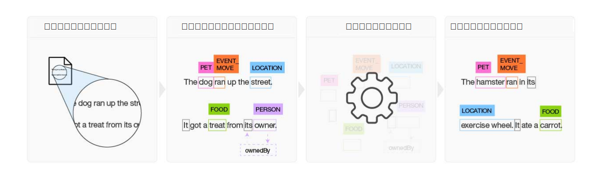

---

copyright:
  years: 2015, 2018
lastupdated: "2018-07-18"

---

{:shortdesc: .shortdesc}
{:new_window: target="_blank"}
{:tip: .tip}
{:pre: .pre}
{:codeblock: .codeblock}
{:screen: .screen}
{:javascript: .ph data-hd-programlang='javascript'}
{:java: .ph data-hd-programlang='java'}
{:python: .ph data-hd-programlang='python'}
{:swift: .ph data-hd-programlang='swift'}

この文書は、{{site.data.keyword.cloud}} 上の {{site.data.keyword.knowledgestudiofull}} に関するものです。 前のバージョンの {{site.data.keyword.IBM_notm}} マーケットプレイス上の {{site.data.keyword.knowledgestudioshort}} に関する文書を参照するには、[このリンクをクリックしてください ](https://console.bluemix.net/docs/services/knowledge-studio/index.html){: new_window}。
{: tip}

# 概要
{: #wks_overview_full}

{{site.data.keyword.knowledgestudiofull}} を使用して、業界特有の言語ニュアンス、意味、および関係を理解する機械学習モデルを作成するか、または、ユーザーが定義するルールに基づいて文書中のエンティティーを検出するルール・ベース・モデルを作成します。
{: shortdesc}

{{site.data.keyword.watson}} を特定の業界または対象分野の専門家にするためには、これをトレーニングする必要があります。 {{site.data.keyword.knowledgestudioshort}} を使用すると、{{site.data.keyword.watson}} をトレーニングするタスクが容易になります。

## 機械学習モデルの構築

{{site.data.keyword.knowledgestudioshort}} は、構造化されていない対象分野の文書にアノテーションを付けるための使いやすいツールを提供し、それらのアノテーションを使用して、対象分野の言語を理解するカスタム機械学習モデルを作成します。 モデルの正確度は反復テストによって向上し、最終的には、見つけたパターンから学習して、新しい文書の大きな集合でそれらのパターンを認識できるアルゴリズムができます。 完成した機械学習モデルを他の {{site.data.keyword.watson}} クラウド・ベース・オファリングおよびコグニティブ・ソリューションにデプロイして、関係およびエンティティーのメンションやエンティティー照応を検出して抽出することができます。

 図 1. 機械学習モデルを構築するプロセスの概要

1. チームは、分野固有のソース文書のセットに基づいてタイプ・システムを作成します。タイプ・システムは、このモデルを使用する予定のアプリケーションにとって関心のある情報のエンティティー・タイプおよび関係タイプを定義します。
1. 複数のヒューマン・アノテーターからなるグループは、ソース文書の小さな集合にアノテーションを付けることによって、エンティティー・タイプを表す単語にラベル付けし、エンティティー・メンション間の関係をテキストが示している箇所で関係タイプを識別し、さらに、同じもの、つまり同じエンティティーを指している異なるメンションを示す照応を定義します。 アノテーションに不整合があればすべて解決され、最適なアノテーションが付けられた文書の 1 つのセットが作成され、このセットがグランド・トゥルースを形成します。
1. {{site.data.keyword.knowledgestudioshort}} は、グランド・トゥルースを使用してモデルをトレーニングします。
1. トレーニングされたモデルは、新しい、前に見られたことのない文書内で、エンティティー、関係、および照応を見つけるために使用されます。

詳しくは、『[機械学習モデルの作成](/docs/services/watson-knowledge-studio/ml-annotator.html)』を参照してください。

## ルール・ベース・モデルの構築

{{site.data.keyword.knowledgestudioshort}} にはルール・エディターがあり、これを使用すると、文書中の共通パターンをルールとして検出して取り込む処理を簡単に行うことができます。 その後、それらのルール・パターンを認識するモデルを作成し、他のサービスで使用できるようにそのモデルをデプロイすることができます。

詳しくは、『[ルール・ベース・モデルの作成](/docs/services/watson-knowledge-studio/rule-annotator.html)』を参照してください。

## Watson サービスの統合
{: #wks_watsoninteg}

{{site.data.keyword.knowledgestudiofull}} および他の {{site.data.keyword.watson}} サービスで、分野の成果物およびモデルを共有します。

{{site.data.keyword.knowledgestudioshort}} を使用して、以下のタスクを実行します。

- {{site.data.keyword.nlushort}} サービスを使用して、文書中のエンティティーの検出とアノテーション付けを自動的に行わせることで、アノテーション付けを開始します。 ヒューマン・アノテーターは、文書へのアノテーション付けを始めるときに、このサービスによって既に付けられたアノテーションを見て検討し、それらに追加することができます。 詳しくは、『[{{site.data.keyword.nlushort}} による文書の事前アノテーション付け](/docs/services/watson-knowledge-studio/preannotation.html#wks_preannotnlu)』を参照してください。
- [UIMA CAS XMI 形式](/docs/services/watson-knowledge-studio/preannotation.html#wks_uimaweximport)で分析済み文書をアップロードします。 例えば、{{site.data.keyword.IBM_notm}} {{site.data.keyword.watson}} Explorer コンテンツ分析コレクションまたは [{{site.data.keyword.IBM_notm}} {{site.data.keyword.watson}} Explorer Content Analytics Studio](/docs/services/watson-knowledge-studio/preannotation.html#wks_uimawexstudio) からエクスポートされた UIMA CAS XMI ファイルをアップロードできます。
- {{site.data.keyword.watson}} {{site.data.keyword.discoveryshort}} サービスで使用するために、[機械学習](/docs/services/watson-knowledge-studio/publish-ml.html#wks_madiscovery)モデルまたは[ルール・ベース](/docs/services/watson-knowledge-studio/rule-annotator-model-use.html#wks_rule_discovery)・モデルをデプロイします。
- {{site.data.keyword.nlushort}} サービスで使用するために、[機械学習](/docs/services/watson-knowledge-studio/publish-ml.html#wks_manlu)モデルまたは[ルール・ベース](/docs/services/watson-knowledge-studio/rule-annotator-model-use.html#wks_rule_nlu)・モデルをデプロイします。
- {{site.data.keyword.IBM_notm}} {{site.data.keyword.watson}} Explorer で使用するために、[機械学習モデルをエクスポート](/docs/services/watson-knowledge-studio/publish-ml.html#wks_maexport)します。
- {{site.data.keyword.IBM_notm}} {{site.data.keyword.watson}} Explorer で使用するために、[ルール・ベース・モデル PEAR ファイルをエクスポート](/docs/services/watson-knowledge-studio/rule-annotator-model-use.html#wks_rule_export)します。
