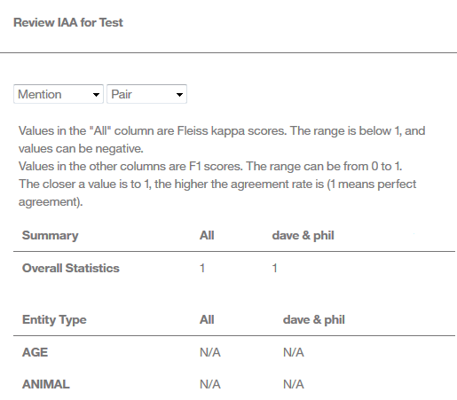

---

copyright:
  years: 2015, 2018
lastupdated: "2018-04-04"

---

{:shortdesc: .shortdesc}
{:new_window: target="_blank"}
{:tip: .tip}
{:pre: .pre}
{:codeblock: .codeblock}
{:screen: .screen}
{:javascript: .ph data-hd-programlang='javascript'}
{:java: .ph data-hd-programlang='java'}
{:python: .ph data-hd-programlang='python'}
{:swift: .ph data-hd-programlang='swift'}

この文書は、{{site.data.keyword.cloud}} 上の {{site.data.keyword.knowledgestudiofull}} に関するものです。以前のバージョンの {{site.data.keyword.knowledgestudioshort}} on {{site.data.keyword.IBM_notm}} Marketplace 向けの資料を参照するには、[このリンクをクリック ](https://console.bluemix.net/docs/services/knowledge-studio/tutorials-create-ml-model.html){: new_window} してください。{: tip}

# 機械学習モデルの作成
{: #wks_tutml_intro}

このチュートリアルは、他の {{site.data.keyword.watson}} サービスとともにデプロイして使用できる機械学習モデルを作成するプロセスを理解するのに役立ちます。{: shortdesc}

## 学習目標

このチュートリアルの演習を完了すると、以下のタスクの実行方法が分かります。

- 文書セットの作成
- 文書の事前アノテーション付け
- ヒューマン・アノテーターのタスクの作成
- アノテーター間合意の分析およびアノテーション付き文書内の競合の裁定
- 機械学習アノテーターの作成

このチュートリアルを完了するには、約 60 分かかります。このチュートリアルに関連する他の概念を調べると、完了までの時間が長くなる可能性があります。

## 始めに

- サポートされているブラウザーを使用していることを確認してください。詳しくは、『[ブラウザーの要件](/docs/services/watson-knowledge-studio/system-requirements.html)』を参照してください。
- 『[チュートリアル: ワークスペースの作成](/docs/services/watson-knowledge-studio/tutorials-create-project.html)』が正常に完了しました。
- Admin または ProjectManager のいずれかの役割のユーザー ID を、少なくとも 1 つ持っている必要があります。

    > **注:** 可能であれば、このチュートリアルの機械学習モデル・タスクには、複数のユーザー ID (Admin または ProjectManager のユーザー ID を 1 つと、少なくとも 2 つの HumanAnnotator ユーザー ID) を使用してください。 複数のユーザー ID を使用すると、実際の {{site.data.keyword.IBM_notm}} {{site.data.keyword.watson}}™ {{site.data.keyword.knowledgestudioshort}} ワークスペースの最も現実的なシミュレーションが可能になります。このワークスペースでは、プロジェクト管理者は、複数のヒューマン・アノテーターによって実行されるアノテーションの調整と裁定を行う必要があります。ただし、単一のユーザー ID にしかアクセスできない場合でも、プロセスのほとんどの部分をシミュレートすることができます。

    ユーザー役割については、『[チームのアセンブル](/docs/services/watson-knowledge-studio/team.html)』を参照してください。

## 結果

このチュートリアルを完了すると、他の {{site.data.keyword.watson}} サービスで使用できるカスタム機械学習モデルが得られます。

## 演習 1: アノテーション用の文書の追加
{: #tut_lessml1}

この演習では、{{site.data.keyword.knowledgestudioshort}} のワークスペースに、ヒューマン・アノテーターによってアノテーションを付けることができる文書を追加する方法について学習します。

### この作業について

文書の追加について詳しくは、『[ワークスペースへの文書の追加](/docs/services/watson-knowledge-studio/documents-for-annotation.html#wks_projadd)』を参照してください。

### 手順

1. <a target="_blank" href="https://watson-developer-cloud.github.io/doc-tutorial-downloads/knowledge-studio/documents-new.csv" download>`documents-new.csv`</a> ファイルを、ご使用のコンピューターにダウンロードします。このファイルには、アップロードに適したサンプル文書が含まれています。
1. ワークスペース内で、サイドバーから**「文書」**をクリックします。
1. 「文書」ページで、**「文書セットのアップロード」**をクリックします。
1. ご使用のコンピューターから `documents-new.csv` ファイルを選択して、**「アップロード」**をクリックします。アップロードされたファイルがテーブルに表示されます。

### 次に行うこと

この時点で、コーパスを複数の文書セットに分割し、それらの文書セットをヒューマン・アノテーターに割り当てることができます。

## 演習 2: アノテーション・セットの作成
{: #wks_tutless_ml2}

この演習では、{{site.data.keyword.knowledgestudioshort}} でアノテーション・セットを作成する方法について学習します。

### この作業について

アノテーション・セットは、ヒューマン・アノテーターに割り当てる、アップロードされた文書セットからの文書のサブセットです。ヒューマン・アノテーターは、アノテーション・セット内の文書にアノテーションを付けます。後でアノテーター間スコアを使用して、各ヒューマン・アノテーターによって追加されたアノテーションを比較するには、少なくとも 2 人のヒューマン・アノテーターを異なるアノテーション・セットに割り当てる必要があります。また、一定のパーセンテージの文書がセット間で重複するように指定する必要があります。

> **注:** 実際のワークスペースでは、そのワークスペースで作業するヒューマン・アノテーターの数に基づいて、必要な数のアノテーション・セットを作成することになります。このチュートリアルでは、2 つのアノテーション・セットを作成します。複数のユーザー ID にアクセスできない場合は、両方のアノテーション・セットを同じユーザーに割り当てることができます。

アノテーション・セットについて詳しくは、『[アノテーション・セットの作成および割り当て](/docs/services/watson-knowledge-studio/documents-for-annotation.html#wks_projdocsets)』を参照してください。

### 手順

1. ワークスペース内で、サイドバーから**「文書」**をクリックします。
1. **「アノテーション・セットの作成 (Create Annotation Sets)」**をクリックします。

    「アノテーション・セットの作成」ウィンドウが開きます。デフォルトでは、このウィンドウには基本セット (すべての文書を含む) と、新規アノテーション・セットの情報を指定できるフィールドが表示されます。

1. **「別のセットとヒューマン・アノテーターの追加」**をクリックして、追加アノテーション・セット用のフィールドを追加します。いくつでも作成したいだけアノテーション・セットをクリックして追加できます。このチュートリアルで必要になるのは 2 つだけです。

    

1. **「重複」**フィールドに、`100` を指定します。これにより、基本セット内の 100 パーセントの文書をすべての新規アノテーション・セットに含めて、すべてのヒューマン・アノテーターがアノテーションを付けることができるようになります。
1. 作成する新規アノテーション・セットごとに、必要な情報を指定します。

    - **「アノテーター」**フィールドで、新規アノテーション・セットに割り当てるヒューマン・アノテーターのユーザー ID を選択します。各アノテーション・セットは、異なるヒューマン・アノテーターに割り当てる必要があります。

        > **注:** チュートリアルに使用する管理者 ID が 1 つしかない場合は、そのユーザーをすべてのアノテーション・セットに割り当てます。実際のワークスペースでは、複数のヒューマン・アノテーターを割り当てることになりますが、このチュートリアルでは、管理者がヒューマン・アノテーターとして作業します。

    - **「セット名」**フィールドに、アノテーション・セットの記述名 (例えば、`Set 1` や `DaveSet` など) を指定します。

1. **「生成」**をクリックします。

### 結果

新しいアノテーション・セットが作成され、「文書」ページの**「アノテーション・セット」**タブに表示されます。

## 演習 3: 辞書ベースのアノテーターによる事前アノテーション付け
{: #wks_tutless_ml3}

この演習では、{{site.data.keyword.knowledgestudioshort}} で、辞書ベースのアノテーターを使用して文書に事前アノテーションを付ける方法について学習します。

### この作業について

文書の事前アノテーション付けは、オプションのステップです。ただし、このステップは、後でヒューマン・アノテーターのジョブを容易にするので、価値のあるステップです。

辞書ベースのアノテーターによる事前アノテーション付けについて詳しくは、『[辞書事前アノテーターによる文書の事前アノテーション付け](/docs/services/watson-knowledge-studio/preannotation.html#wks_preannot)』を参照してください。

### 手順

1. ワークスペース内で、**「アセットおよびツール」**>**「事前アノテーター (Pre-annotators)」**サイドバーから、**「辞書の管理」**をクリックします。

  `「Test dictionary」`辞書が開きます。

1. **「エンティティー・タイプ」**リストから、**「ORGANIZATION」**を選択して、ORGANIZATION エンティティー・タイプを、『*ワークスペースの作成*』チュートリアルの演習『[辞書の追加](/docs/services/watson-knowledge-studio/tutorials-create-project.html#wks_tutless4)』で作成した `Test dictionary` 辞書にマップします。
1. 左上の戻る矢印をクリックして「事前アノテーター (Pre-annotators)」ページに戻り、**「この事前アノテーターを適用」**をクリックします。
1. 「アノテーターの実行」ページで、チェック・ボックスをクリックして、チュートリアルで以前に作成した両方のアノテーション・セット (基本セットを含まない) を選択します。
1. **「実行 (Run)」**をクリックします。

    

### 結果

選択したセット内の文書には、作成した辞書アノテーターを使用して事前アノテーションが付けられます。 後で、**「この事前アノテーターを適用」** をクリックすることにより、同じアノテーターを使用して追加の文書セットに事前アノテーションを付けることができます。

## 演習 4: アノテーション・タスクの作成
{: #wks_tutless_ml4}

この演習では、{{site.data.keyword.knowledgestudioshort}} で、アノテーション・タスクを使用してヒューマン・アノテーターの作業を追跡する方法について学習します。

### この作業について

アノテーション・タスクについて詳しくは、『[アノテーション・タスクの作成](/docs/services/watson-knowledge-studio/annotate-documents.html#wks_hatask)』を参照してください。

### 手順

1. ワークスペース内で、**「アセットおよびツール」**>**「文書」**サイドバーから、**「タスク」**タブを選択します。
1. 「タスク」ページで、**「タスクの追加」**をクリックします。
1. タスクの詳細を指定します。

    - **「タスク名」** フィールドに `Test` と入力します。
    - **「期限 (Deadline)」**フィールドで、将来の日付を選択します。

1. **「作成 (Create)」**をクリックします。
1. 「タスクへのアノテーション・セットの追加」ウィンドウで、チェック・ボックスをクリックして、『[演習 3:辞書ベースのアノテーターによる事前アノテーション付け](/docs/services/watson-knowledge-studio/tutorials-create-ml-model.html#wks_tutless_ml3)』で作成した両方のアノテーション・セットを選択します。 これは、このタスクの一環として、両方のアノテーション・セットに割り当てられたヒューマン・アノテーターがアノテーション・セットにアノテーションを付ける必要があることを指定します。
1. **「タスクの作成」**をクリックします。
1. 将来のヒューマン・アノテーション作業の進行状況を確認するために、タスクをクリックして開くことができます。

## 演習 5: 文書のアノテーション付け
{: #wks_tutless_ml5}

この演習では、{{site.data.keyword.knowledgestudioshort}} で、グランドトゥルース・エディターを使用して文書にアノテーションを付ける方法について学習します。

### この作業について

ヒューマン・アノテーションについて詳しくは、『[グランドトゥルース・エディターを使用したアノテーション](/docs/services/watson-knowledge-studio/user-guide.html#wks_hagte)』を参照してください。

### 手順

1. 『[演習 4: アノテーション・タスクの作成](/docs/services/watson-knowledge-studio/tutorials-create-ml-model.html#wks_tutless_ml4)』で作成したアノテーション・タスクに割り当てられたヒューマン・アノテーターとして、{{site.data.keyword.knowledgestudioshort}} にログインします。

    > **注:** このチュートリアルで単一の管理者 ID にしかアクセスできない場合でも、その ID を使用してヒューマン・アノテーションを実行できます。ただし、実際のワークスペースでは、ヒューマン・アノテーションは HumanAnnotator 役割を持つ複数の異なるユーザーによって実行されることに注意してください。

1. `「My workspace」`ワークスペースを開きます。
1. サイドバーから、**「文書のアノテーション」**>**「関係」**をクリックします。
1. 『[演習 4: アノテーション・タスクの作成](/docs/services/watson-knowledge-studio/tutorials-create-ml-model.html#wks_tutless_ml4)』で作成した `Test` アノテーション・タスクを開きます。
1. *Technology - gmanews.tv* 文書までスクロールし、クリックしてアノテーション用に開きます。用語 `IBM`には、既に ORGANIZATION エンティティー・タイプのアノテーションが付けられていることに注意してください。このアノテーションは、
『[演習 2: アノテーション・セットの作成](/docs/services/watson-knowledge-studio/tutorials-create-ml-model.html#wks_tutless_ml2)』で辞書事前アノテーターによって追加されました。この事前アノテーションは正しいため、変更する必要はありません。

    

1. メンションのアノテーション付け

    1. **「メンション」**アイコンをクリックして、メンションのアノテーション付けを開始します。
    1. 文書の本文内で、`Thomas Watson` というテキストを選択します。
    1. エンティティー・タイプのリストで、**「PERSON」** をクリックします。エンティティー・タイプ PERSON が、選択したメンションに適用されます。

        

1. サイドバーから**「文書のアノテーション」**>**「関係」**をクリックして、関係のアノテーション付けを開始します。
1. `Thomas Watson` と `IBM` のメンションを (その順序で) 選択します。メンションを選択するには、テキストの上にあるエンティティー・タイプ・ラベルをクリックします。
1. 関係タイプのリストで、**「founderOf」**をクリックします。2 つのメンションは、founderOf 関係によって接続されます。

    

1. 状況メニューから**「完了」**を選択し、**「保存」**ボタンをクリックします。
1. 文書のリストに戻り、**「すべての文書を送信」** をクリックして、文書を承認のために送信します。

    > **注:** 実際のシチュエーションでは、もっと多くのアノテーションを作成し、セット内のすべての文書を完了してから送信します。

1. このアノテーション・タスクで他の文書セットに割り当てられているヒューマン・アノテーターとして、{{site.data.keyword.knowledgestudioshort}} にログインします。
1. 同じアノテーションを *Technology - gmanews.tv* 文書で繰り返します。ただし、今回は、founderOf 関係でなく employedBy 関係を使用します。

  別のユーザーとしてログインすると、次の演習でアノテーター間合意の例を理解するのに役立ちます。アノテーションを完了して、**「すべての文書を送信」**をクリックします。

## 演習 6: アノテーター間合意の分析
{: #wks_tutless_ml6}

この演習では、{{site.data.keyword.knowledgestudioshort}} で複数のヒューマン・アノテーターによる作業を比較する方法について学習します。

### この作業について

さまざまなヒューマン・アノテーターが、重複している文書に整合性のあるアノテーションを付けているかどうかを判別するには、アノテーター間合意 (`IAA`) スコアを検討します。

{{site.data.keyword.knowledgestudioshort}} は、タスク内のすべての文書セット内の重複している文書を、文書セットの状況に関係なく、すべて検査して、IAA スコアを計算します。IAA スコアは、さまざまなヒューマン・アノテーターが、メンション、関係、および共同参照チェーンに、どのようなアノテーションを付けたかを示します。IAA スコアを定期的に調べて、ヒューマン・アノテーター相互間の整合性を確認することをお勧めします。

このチュートリアルでは、ヒューマン・アノテーターがすべての文書セットを承認のために送信しました。アノテーター間合意スコアを許容できる場合は、文書セットを承認することができます。文書セットを拒否すると、その文書セットは、改善のためにヒューマン・アノテーターに差し戻されます。

### 手順

1. {{site.data.keyword.knowledgestudioshort}} に管理者としてログインし、**「アセットおよびツール」**>**「文書」**を選択して、`Test` タスクをクリックします。

  **「状況」**列で、文書セットが送信されたことを確認できます。

1. **「アノテーター間一致の計算 (Calculate Inter-Annotator Agreement)」**をクリックします。
1. 最初のメニューをクリックして、メンション、関係、および共同参照チェーンの IAA スコアを表示します。ヒューマン・アノテーターのペア別に合意を表示することもできます。例えば、Dave のすべてのアノテーションを Phil のすべてのアノテーションと比較できます。特定の文書別に合意を表示することもできます。例えば、ある文書に対する Dave のアノテーションを、同じ文書に対する Phil のアノテーションと比較して表示できます。一般に、完全な合意を 1 として、そのうちの 0.8 のスコアを目標とします。このチュートリアルでは、2 つのエンティティー・タイプにアノテーションを付けただけであるため、ほとんどのエンティティー・タイプ・スコアは N/A (適用外) です。これは、スコアの算出に使用可能な情報がないことを意味します。

    *図 1. Dave と Phil という名前のユーザーによるアノテーター間スコアの検討*

    

1. スコアを検討した後、`Submitted` 状況の文書セットを承認するか拒否するかを決定できます。文書セットが送信されると、その名前の横にチェック・ボックスが表示されます。以下のアクションのいずれかを実行します。

    - 文書セットのスコアを許容できる場合は、チェック・ボックスを選択して、**「同意する」** をクリックします。他の文書セットと重複しない文書は、グランドトゥルースへプロモートされます。重複する文書は、まず、競合を解決できるように裁定を通して検討される必要があります。このチュートリアルでは、両方の文書セットに同意します。
    - 文書セットのスコアを許容できない場合は、チェック・ボックスを選択して、**「拒否」**をクリックします。その文書セットは、アノテーションの改善のために、ヒューマン・アノテーターによる再アノテーションが必要になります。

### 結果

アノテーター間合意スコアを評価したことで、同じ文書にさまざまなヒューマン・アノテーターのペアがどのようなアノテーションを付けたかが分かりました。アノテーター間合意スコアが許容できる場合は、その文書セットに同意しました。

## 演習 7: アノテーション付き文書内の競合の裁定
{: #wks_tutless_ml7}

この演習では、{{site.data.keyword.knowledgestudioshort}} で、文書セット間で重複する文書内の競合を裁定する方法について学習します。

### この作業について

文書セットを承認すると、他の文書セットと重複しない文書だけがグランドトゥルースへプロモートされます。文書が複数の文書セット間の重複に含まれている場合、その文書をグランドトゥルースへプロモートするためには、事前にアノテーションの競合 (存在する場合) の裁定を行う必要があります。

### 手順

1. {{site.data.keyword.knowledgestudioshort}} に管理者としてログインし、**「アセットおよびツール」**>**「文書」**を選択して、`Test` タスクをクリックします。
1. 2 つの文書セットが承認済み状態であることを確認します。
1. **「重複文書での競合のチェック (Check Overlapping Documents for Conflicts)」**をクリックします。

    複数のヒューマン・アノテーターによってアノテーションが付けられた、重複している文書を表示できます。

1. 複数のアノテーターによる文書のアノテーションに競合が存在するかどうかを確認するには、**「競合の検査 (Check for Conflicts)」**をクリックします。
1. 裁定モードでは、文書をグランドトゥルースへプロモートする前に、競合しているアノテーションの数を確認し、アノテーションの削除や置換を行うことができます。
1. このチュートリアルでは、すべての競合を修正し、変更に同意したと想定します。**「グランドトゥルースへのプロモート (Promote to Ground Truth)」**をクリックします。これらのステップを繰り返し、2 番目の文書セットの競合を解決します。

    あるいは、「文書」ページで**「同意する」**をクリックして、文書をグランドトゥルースへプロモートすることもできます。

### 結果

アノテーションの競合を解決し、文書をグランドトゥルースへプロモートした後、それらの文書を使用して機械学習モデルをトレーニングすることができます。

## 演習 8: 機械学習モデルの作成
{: #wks_tutless_ml8}

この演習では、{{site.data.keyword.knowledgestudioshort}} で機械学習モデルを作成する方法について学習します。

### この作業について

機械学習モデルを作成する場合は、機械学習モデルのトレーニングに使用する文書セットを選択します。また、トレーニング・データ、テスト・データ、およびブラインド・データとして使用する文書のパーセンテージも指定します。機械学習モデルのトレーニングに使用できるのは、承認または裁定によってグランドトゥルースになった文書だけです。

### 手順

1. 管理者として {{site.data.keyword.knowledgestudioshort}} にログインします。
1. **「モデル管理」**>**「パフォーマンス (Performance)」**サイドバーから、**「トレーニングと評価」**をクリックします。
1. 機械学習モデルの作成に使用する文書セットを選択します。各文書セット名の横にあるチェック・マークをクリックします。
1. 2 つのアノテーション・セットを選択して、テスト・データ、トレーニング・データ、およびブラインド・データを作成します。次に、**「トレーニングと評価 (Train &amp; Evaluate)」**をクリックします。

    > **注:** ヒューマン・アノテーションの数と文書全体の総ワード数によっては、トレーニングに 10 分以上、あるいは数時間を要する場合もあります。

1. 機械学習モデルのトレーニング後、そのモデルをエクスポートすることができます。また、各グラフの上にある**「詳細統計」**リンクをクリックすることにより、そのモデルのパフォーマンスに関する詳しい情報を表示することもできます。
1. 「トレーニング/テスト/ブラインド・セット」ページを表示するには、**「トレーニングと評価 (Train and evaluate)」**ボタンをクリックします。
1. ヒューマン・アノテーターが処理した文書を表示するには、**「グランドトゥルースの表示」** をクリックします。
1. トレーニング済みの機械学習モデルが同じ文書セットについて作成したアノテーションを表示するには、**「デコード結果の表示」**をクリックします。
1. 機械学習モデルの精度、再呼び出し、および F1 スコアの詳細を表示するには、「パフォーマンス」ページを選択します。
1. 各グラフの上にある**「詳細統計」**リンクをクリックします。これらの「統計」ページでは、ラジオ・ボタンを使用して、メンション、関係、および共同参照チェーンのスコアを表示できます。

    エンティティー・タイプ、関係タイプ、および共同参照チェーンの統計の要約を表示することにより、パフォーマンスを分析できます。また、デフォルトで**「要約」**に設定されているメニューから**「混同行列」**を選択して、混同行列に提示される統計を分析することもできます。*混同行列* は、機械学習モデルによって追加されたアノテーションを、グランドトゥルースのアノテーションと比較するのに役立ちます。

    > **注:** このチュートリアルでは、組織の単一の辞書のみを使用して、文書にアノテーションを付けました。したがって、`ORGANIZATION` を除くほとんどのエンティティー・タイプでは、表示されるスコアは `0` または `N/A` です。数値は小さいですが、ヒューマン・アノテーションや修正を行っていないため、予期されることです。

    *図 2. 機械学習モデルの「統計」ページのオプション*

    

1. サイドバーから、**「モデル管理」**>**「バージョン」**を選択します。「バージョン」ページでは、モデルおよびその作成に使用されたリソース (辞書およびアノテーション・タスクを除く) のスナップショットを取得できます。例えば、モデルをリトレーニングする前にスナップショットを取得できます。次回のトレーニングで統計がより貧弱になった場合は、古いバージョンをプロモートして、貧弱な結果を返したバージョンを削除できます。

### 結果

機械学習モデルを作成して、トレーニングし、そのモデルがテスト・データとブラインド・データにアノテーションを付けたときのパフォーマンスを評価しました。パフォーマンス・メトリックを調べることにより、機械学習モデルの正確度を向上させるための方法を特定できます。

## チュートリアルの要約
{: #wks_tutml_sum}

{{site.data.keyword.knowledgestudioshort}} について学習しながら、機械学習モデルを作成しました。

### 学習した演習

このチュートリアルを修了すると、以下の概念について学習したことになります。

- 文書セット
- 機械学習モデル
- ヒューマン・アノテーション・タスク
- アノテーター間合意と裁定
