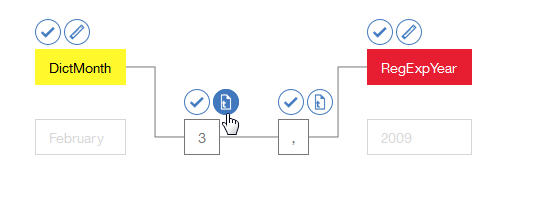

---

copyright:
  years: 2015, 2018
lastupdated: "2018-04-04"

---

{:shortdesc: .shortdesc}
{:new_window: target="_blank"}
{:tip: .tip}
{:pre: .pre}
{:codeblock: .codeblock}
{:screen: .screen}
{:javascript: .ph data-hd-programlang='javascript'}
{:java: .ph data-hd-programlang='java'}
{:python: .ph data-hd-programlang='python'}
{:swift: .ph data-hd-programlang='swift'}

この文書は、{{site.data.keyword.cloud}} 上の {{site.data.keyword.knowledgestudiofull}} に関するものです。以前のバージョンの {{site.data.keyword.knowledgestudioshort}} on {{site.data.keyword.IBM_notm}} Marketplace 向けの資料を参照するには、[このリンクをクリック ](https://console.bluemix.net/docs/services/knowledge-studio/tutorials-create-rule-model.html){: new_window} してください。
{: tip}

# ルール・ベース・モデルの作成
{: #wks_tutrule_intro}

このチュートリアルは、文書内で定義したテキスト・パターンを検出するために使用できるルール・ベース・モデルの作成方法を理解するのに役立ちます。
{: shortdesc}

ここでは、パターン `month day, year` に一致する文書内のテキストを検出できるモデルを作成します。例えば、このモデルは、*May 1, 2010* という日付参照を検出します。ルール・パターン自体を定義する前に、パターンを作成するのに役立つ成果物を作成します。そのような成果物には、テキスト内で月のメンションを認識する辞書クラスと、年のメンションを認識する正規表現クラスが含まれます。

## 学習目標

このチュートリアルを完了すると、以下のタスクの実行方法が分かります。

- クラスの作成
- ルールを定義するための文書の追加
- 辞書とクラスの関連付け
- 文字のシーケンスをキャプチャーするための正規表現の定義
- ルールの定義

このチュートリアルを完了するには、約 30 分かかります。このチュートリアルに関連する他の概念を調べると、完了までの時間が長くなる可能性があります。

## 始めに

- サポートされているブラウザーを使用していることを確認してください。詳しくは、『[ブラウザーの要件](/docs/services/watson-knowledge-studio/system-requirements.html)』を参照してください。
- 『[チュートリアル: ワークスペースの作成](/docs/services/watson-knowledge-studio/tutorials-create-project.html)』が正常に完了しました。
- Admin または ProjectManager のいずれかの役割のユーザー ID を、少なくとも 1 つ持っている必要があります。ユーザー役割については、『[チームのアセンブル](/docs/services/watson-knowledge-studio/team.html)』を参照してください。

## 結果

ルール・ベース・モデルを作成した後、それを以下のいずれかの方法で使用して、文書内のテキスト・パターンを検出できます。

- 機械学習モデルを作成する前に、[文書に事前アノテーションを付ける](/docs/services/watson-knowledge-studio/preannotation.html#wks_preannotrule)
- 他の {{site.data.keyword.watson}} のサービスまたは製品に、[モデルをデプロイまたはエクスポートする](/docs/services/watson-knowledge-studio/rule-annotator-model-use.html)

## 演習 1: 月の辞書の追加
{: #wks_tutless_rule1}

この演習では、{{site.data.keyword.knowledgestudioshort}} でワークスペースに辞書を追加する方法について学習します。この辞書には、暦の月に関連する用語が含まれています。

### この作業について

この後の演習では、この辞書に基づいてクラスを定義します。このクラスを作成すると、文書内で検出された、この辞書内のすべての用語に、関連するクラス・タイプのメンションとして自動的にアノテーションが付きます。辞書について詳しくは、『[ワークスペースへの辞書の追加](/docs/services/watson-knowledge-studio/dictionaries.html#wks_projdictionaries)』を参照してください。

### 手順

1. <a target="_blank" href="https://watson-developer-cloud.github.io/doc-tutorial-downloads/knowledge-studio/dictionary-items-month.csv" download>`dictionary-items-month.csv`</a> ファイルを、ご使用のコンピューターにダウンロードします。このファイルには、{{site.data.keyword.knowledgestudioshort}} 辞書へのアップロードに適した辞書用語が CSV 形式で含まれています。
1. **「アセットおよびツール」**>**「事前アノテーター (Pre-annotators)」**サイドバーから、**「辞書」**タブを選択して、**「辞書の管理」**をクリックします。
1. **「辞書の作成」**ボタンをクリックして、辞書を追加します。
1. **「名前」**フィールドに `Month dictionary` と入力し、**「保存」**をクリックして (空の) 辞書を作成します。新しい辞書が作成され、編集用に自動的に開かれます。
1. 辞書ペインで、**「アップロード」**をクリックします。
1. 「辞書項目のアップロード」ウィンドウで、ご使用のコンピューターから `dictionary-items-month.csv` ファイルを選択した後、**「アップロード」**をクリックします。

    ファイル内の用語が辞書にインポートされます。

## 演習 2: サンプル文書の追加
{: #wks_tutless_rule2}

この演習では、定義するルールのタイプを示す言語パターンを含んだ文書を追加する方法について学習します。

### この作業について

文書の追加について詳しくは、『[ルールを定義するための文書の追加](/docs/services/watson-knowledge-studio/rule-annotator-add-doc.html)』を参照してください。

### 手順

1. <a target="_blank" href="https://watson-developer-cloud.github.io/doc-tutorial-downloads/knowledge-studio/documents-new.csv" download>`documents-new.csv`</a> ファイルを、ご使用のコンピューターにダウンロードします。このファイルには、アップロードに適したサンプル文書が含まれています。
1. サイドバーから、**「文書のアノテーション」**>**「ルール」**をクリックします。
1. **「文書」**の横にある**文書の追加**アイコンをクリックします。
1. **「CSV ファイルのアップロード」**タブをクリックします。
1. 前にコンピューターにダウンロードした `documents-new.csv` ファイルをクリックして参照し、**「アップロード」**をクリックします。

    文書のセットがメインの「文書」ページに表示されます。

    

## 演習 3: クラスの作成
{: #wks_tutless_rule3}

この演習では、ルールの定義時に使用するクラスの定義方法について学習します。

### この作業について

クラスについて詳しくは、『[ルール](/docs/services/watson-knowledge-studio/rule-annotator.html)』を参照してください。

### 手順

1. ワークスペースの **「ルール」**ページで、右側のパネルの **「クラス」**の横にある**クラスの追加**アイコンをクリックします。

1. クラス名として `DictMonth` と入力してから、**「追加」**をクリックします。

    新規クラスが「クラス」サイド・パネルに表示されます。

## 演習 4: 辞書とクラスの関連付け
{: #wks_tutless_rule4}

この演習では、ルール・エディターで辞書を使用する方法について学習します。

### 手順

1. サイドバーから、**「文書のアノテーション」**>**「辞書」**を選択し、前に作成した**「Month dictionary」** をクリックします。

1. **「クラス」**リストから`「DictMonth」`を選択して、**「保存」**をクリックします。

    クラスが辞書に関連付けられます。

    

### 結果

ルール・エディターに関連付けられた文書の場合、辞書内の用語への参照には `DictMonth` クラスのメンションとしてアノテーションが付けられます。次の演習では、これらの参照にアノテーションが付けられたことを確認します。

## 演習 5: 文書内のクラス・アノテーションの検出
{: #wks_tutless_rule5}

この演習では、ルール・エディター文書内でクラス・アノテーションを検出する方法について学習します。

### 手順

1. サイドバーから、**「文書のアノテーション」**>**「ルール」** を選択します。
1. 「クラス」パネルで、前に定義した `DictMonth` クラスを見つけ、その横にある**文書内のアノテーションの検索**アイコンをクリックします。

    「アノテーションの検出 (Find Annotations)」ページが表示され、月へのテキスト参照を含んでいるすべての文書が表示されます。

1. `Technology - computerworld.com` 文書をクリックして、文書全体を表示します。`February` というテキストが強調表示されていることに注意してください。これは、`DictMonth` クラスのメンションとしてアノテーションが付けられたことを意味します。

## 演習 6: 正規表現の定義
{: #wks_tutless_rule6}

この演習では、正規表現の定義方法について学習します。

### この作業について

「*2009*」のような年のパターンを検出できる正規表現を定義します。

正規表現の定義について詳しくは、『[ルールの定義](/docs/services/watson-knowledge-studio/rule-annotator-define-rule.html)』を参照してください。

### 手順

1. **「ルール」**ページで、右側のパネルから、**「クラス」**の横にある**クラスの追加**アイコン () をクリックします。
1. クラス名として `RegExpYear` と入力し、**「追加」**をクリックします。
1. サイドバーで**「Regex」**をクリックしてから、**「正規表現」**の横にある**正規表現の作成**アイコンをクリックします。
1. **「項目の追加」**ボタンをクリックします。
1. **「正規表現」**フィールドに、次の式を入力します。

    ```
    (?:(?:19|20)[0-9]{2})
    ```
    {: screen}

    > **注:** この正規表現は、1900 年から 2099 年までの年を検出します。

1. **「最小ワード・トークン」**を `1` に、**「最大ワード・トークン」**を `1` に設定します。
1. **「追加」**をクリックして、この正規表現項目を保存します。
1. 正規表現名として `MyYearExp` と入力し、次に、**「クラス」** メニューから、前に定義した *RegExpYear* クラスを選択します。
1. **「保存 (Save)」**をクリックします。

    正規表現を保存した後、その正規表現がサンプル文書に自動的に適用されます。正規表現で定義したパターンの直後にあるテキスト・ストリングには、**RegExpYear** クラスのメンションとしてアノテーションが付けられます。

1. 定義した式が時間の出現個所を正しくキャプチャーしているかどうかを検査するために、メンションを検索できます。「クラス」サイド・パネルの **RegExpYear** クラスの横にある**文書内のアノテーションの検索**アイコンをクリックします。

    

    「アノテーションの検出 (Find Annotations)」ページが表示されます。年のメンションの出現個所が、出現するサンプル文書内で強調表示されます。

    

## 演習 7: ルールの定義
{: #unique_1166829415}

この演習では、ルールの定義方法について学習します。

### この作業について

月のメンションにアノテーションを付けるための辞書ベースのクラスが既に定義されています。また、年を表す数値を検出する正規表現も定義しました。ここでは、月とそれに続く数値、コンマ、そして年というシーケンスをキャプチャーするルールを定義します。つまり、*September 21, 2016* のような日付式のルールを定義します。

ルールの定義について詳しくは、『[ルールの定義](/docs/services/watson-knowledge-studio/rule-annotator-define-rule.html)』を参照してください。

### 手順

1. サイドバーから、**「文書のアノテーション」**>**「ルール」**を選択し、`Technology - computerworld.com` 文書を開きます。
1. 文書内のテキスト *February 3, 2009* を選択します。必ず、コンマも選択してください。

    

1. **ルールの追加**アイコンをクリックします。

    ルール・エディターに、指定したルール・パターンの描写が表示されます。

    テキスト *February 3, 2009* が表示されます。描写内のセルを接続しているグレーの線は、現在どのセルがパターンに含まれているかを示しています。
    - *DictMonth* クラスは、テキスト *February* ではなくルール・パターンの一部です。この選択は推奨されます。このモデルでは、*February* というテキストだけではなく、日付パターン内の最初のトークンとして *DictMonth* クラスによってアノテーション付けされているすべての月を検出する必要があるからです。
    - ルールの最後で、既に *2009* という年に *RegExpYear* クラスのメンションとしてアノテーションが付けられています。*RegExpYear* クラスは、数値 2009 ではなくルール・パターンの一部です。この選択も推奨されます。このモデルでは、*2009* という特定のテキストだけではなく、日付パターン内の最後のトークンとして *RegExpYear* クラスによってアノテーション付けされているすべての年を検出する必要があるからです。

    数値 3 とその後のコンマ (,) は、パターン内の 2 番目と 3 番目のトークンとして示されています。このパターンは現在指定されているので、このモデルは、月の第 3 日を指定している日付の出現個所だけを検出します。しかし、このモデルでは、月の任意の日を指定した日付を検出したいので、次の作業は日のトークンのフィーチャー設定を変更することです。

1. `3` という日のセルの上で**テキスト**・アイコンをクリックして、トークンのフィーチャー設定を開きます。

    

    現在、ルールは `3` というテキストに正確に一致するよう設定されています。そうではなく、任意の数値に一致するようなルールにする必要があります。

1. **「文字タイプ: 数値」**を選択してから、**「テキスト: 3」**を選択解除することにより、フィーチャー設定を数値に変更します。

    

    数値 `3` のセルの定義を変更しました。

    

    **Aa** アイコンは、その数値が正確に 3 である必要はなく、任意の数値でかまわないことを示しています。

1. コンマのトークンの設定は、何も変更しないでください。

    パターン内の 3 番目のトークンはコンマにする必要があるので、現在のフィーチャー設定である **「テキスト: ,」** は適切です。フィーチャー設定のほかに、各トークンには繰り返し設定があります。繰り返し設定は、トークンがテキスト内で何回まで繰り返されてもパターンと一致したことになるかを指定します。**「必須 (正確に 1 つ)」**という現在の繰り返し設定も、指定されているとおりで適切です。

    

1. パターン `DictMonth + numeric token + comma + RegExpYear` を表すクラスを割り当てます。

    文書から選択した 4 つのトークンを表す 4 つの空のセルに注目してください。すべてのセルを選択するには、最初のセルを選択し、Shift キーを押しながら追加の各セルをクリックします。クラス名として `RuleDate` と入力し、それをクリックして新規クラスを作成します。

    

    ルールのパターンの定義が正常に完了しました。

1. **「ルール名」**フィールドに `MyDateRule` と入力し、**「保存」**をクリックします。

    ルールを保存した後、そのルールがサンプル文書に自動的に適用されます。`Technology - computerworld.com` 文書がルール・エディターでまだ開かれている場合は、文書内の `February 3, 2009` というテキストに、RuleDate クラスのメンションとしてアノテーションが付けられたことが分かります。

    

    「クラス」パネルから `RuleDate` クラスの横にある**文書内のアノテーションの検索**アイコン () をクリックして、サンプル文書に含まれる RuleDate クラスのメンションのすべての出現個所を検索できます。パターンを正しく定義したことを確認するために、すべての日付が正しくキャプチャーされているかどうかを確認することをお勧めします。

    

## 演習 8: ルール・ベース・モデルの作成
{: #wks_tutless_rule8}

この演習では、ルール・ベース・モデルの作成方法について学習します。

### この作業について

ルール・ベース・モデルの作成について詳しくは、『[ルール・ベース・モデルの作成](/docs/services/watson-knowledge-studio/rule-annotator-model-create.html)』を参照してください。

### 手順

1. サイドバーから、**「モデル管理」**>**「バージョン」**を選択して、**「ルール・ベース・モデル・タイプ・マッピング」**タブをクリックします。

1. `DATE` エンティティーに対応するよう定義した `RuleDate` クラスを、タイプ・システムからマップします。

    1. **DATE** エンティティーを見つけ、**「編集」**をクリックします。

        

    1. ドロップダウン・リストから `RuleDate` クラスを選択して、**「保存」**をクリックします。

        

1. ルール・ベース・モデルを実行するには、**「ルール・ベース」**タブを選択して、**「このモデルを実行」**をクリックします。

## チュートリアルの要約
{: #wks_tutrule_sum}

{{site.data.keyword.knowledgestudioshort}} について学習しながら、ルール・ベース・モデルを作成しました。

### 学習した演習

このチュートリアルを修了すると、以下の概念について学習したことになります。

- クラス
- 正規表現
- ルール
