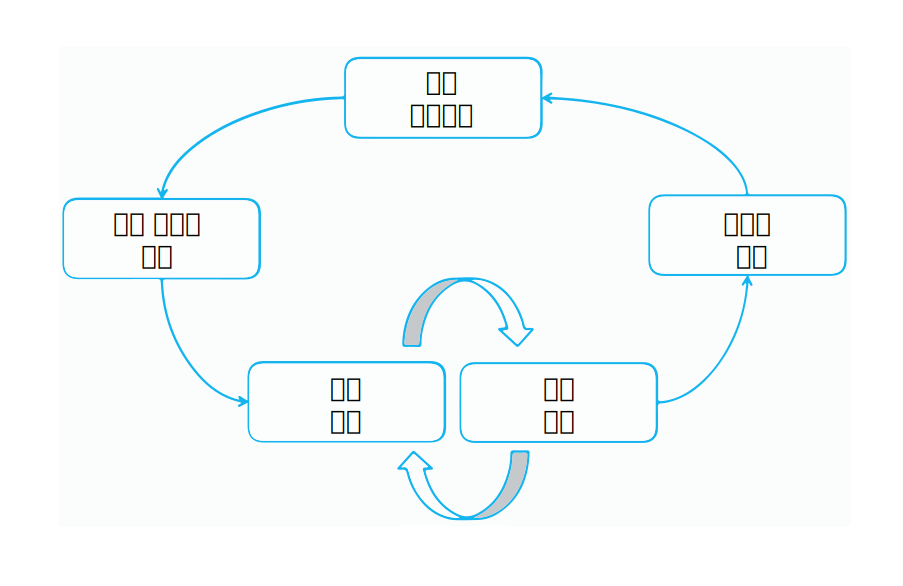

---

copyright:
  years: 2015, 2018
lastupdated: "2018-07-19"

---

{:shortdesc: .shortdesc}
{:new_window: target="_blank"}
{:tip: .tip}
{:pre: .pre}
{:codeblock: .codeblock}
{:screen: .screen}
{:javascript: .ph data-hd-programlang='javascript'}
{:java: .ph data-hd-programlang='java'}
{:python: .ph data-hd-programlang='python'}
{:swift: .ph data-hd-programlang='swift'}

이 문서는 {{site.data.keyword.knowledgestudiofull}} on {{site.data.keyword.cloud}}에 대한 문서입니다. 이전 {{site.data.keyword.knowledgestudioshort}} on {{site.data.keyword.IBM_notm}} Marketplace 버전에 대한 문서를 보려면 [이 링크를 클릭 ](https://{DomainName}/docs/services/knowledge-studio/annotate-documents.html){: new_window}하십시오.
{: tip}

# 어노테이션 설정
{: #annotate-documents}

특정 업계 및 관련 용어에 대한 지식이 있는 사용자가 문서에 어노테이션을 작성해야 합니다.
{: shortdesc}

사람 어노테이터가 작업공간에 액세스할 수 있도록 하려면 다음 태스크를 수행하십시오.

- 주제 관련 전문가를 사용 중인 {{site.data.keyword.knowledgestudioshort}} 인스턴스로 초대하십시오.
- 사람 어노테이터와 이들이 어노테이션을 작성할 어노테이션 세트를 연관시키십시오.
- 세트 내 문서에 어노테이션을 작성하도록 사람 어노테이터를 지정하는 태스크를 작성하십시오.

    > **주의**: 사람 어노테이터가 {{site.data.keyword.knowledgestudioshort}}에 로그인했을 때 작업공간을 볼 수 있으려면 먼저 이들에게 명시적으로 태스크를 지정해야 합니다.

사용자(사람 어노테이터)는 문서에 어노테이션을 작성하는 방법에 대한 자세한 정보가 포함되어 있는 [문서에 어노테이션 작성](/docs/services/watson-knowledge-studio/user-guide.html)의 내용을 잘 알고 있어야 합니다.

## 모델 라이프사이클
{: #wks_lifecycle}

{{site.data.keyword.knowledgestudioshort}}로 작성하는 모델은 자연어 처리(NLP) 파이프라인에 포함시킬 수 있는 소프트웨어 컴포넌트입니다.

{{site.data.keyword.knowledgestudioshort}}를 사용하면 새 도메인에 대해 모델을 작성하고, 평가하고 개선할 수 있습니다. 모델은 자연어 컨텐츠에 표시된 텍스트에 어노테이션(메타데이터)을 추가합니다. 애플리케이션은 도메인 컨텐츠의 중요 엔티티에 대한 멘션, 멘션 간의 관계, 여러 멘션이 동일한 엔티티를 상호 참조하는 방식을 식별하는 어노테이션을 자동으로 텍스트를 분석하고 처리하는 데 사용할 수 있습니다. 애플리케이션 사용자는 자연어 컨텍스트에서 의미를 추출하고, 인사이트를 발견하고, 해답을 얻어 이러한 수준의 분석을 활용할 수 있습니다.

모델 작성은 여러 단계(지식 큐레이션, 기준 실제값 생성, 모델 개발, 모델 평가, 런타임 배치)를 포함하는 반복적 다단계 프로세스입니다.

### 엔드-투-엔드 도메인 적응
{: #wks_lifecycle__wks_lifecycleS6}

다음 다이어그램에는 모델 개발의 다섯 단계 간의 상호작용과 각 단계에서 이뤄지는 일반적인 활동이 요약되어 있습니다.

 그림 2. 모델 개발의 다섯 단계와 각 단계에서 이뤄지는 활동의 요약

### 지식 큐레이션
{: #wks_lifecycle__wks_lifecycleS1}

{{site.data.keyword.knowledgestudioshort}} 외부에서 수행되는 이 단계는 특정 도메인과 관련된 컨텐츠를 선택하고, 수집하고, 보존하고, 유지보수하는 프로세스를 가리킵니다. 큐레이션은 데이터에 가치를 더하여 신뢰할 수 있는 정보 및 지식으로 변환합니다.

### 기준 실제값 생성
{: #wks_lifecycle__wks_lifecycleS2}

이 단계는 {{site.data.keyword.watson}} 솔루션을 특정 도메인에 적응시키는 데 사용할 수 있는 검증된 데이터의 콜렉션을 작성하기 위해 {{site.data.keyword.knowledgestudioshort}} 도구 및 우수 사례를 사용하는 것을 가리킵니다. *기준 실제값* 또는 *표준 문서*라고 하는 검증된 데이터가 부정확한 경우에는 여기에 의존하는 애플리케이션이 부정확해지므로 이러한 항목의 정확도는 매우 중요합니다.

새 도메인에 대해 {{site.data.keyword.watson}}을 훈련시키는 작업에서 필수적인 부분은 도메인 컨텐츠의 중요 엔티티, 이러한 엔티티 간의 관계, 여러 엔티티가 서로를 상호 참조하는 방식에 대한 정보를 제공하는 것을 포함합니다. 이러한 정보의 수집은 다음 활동을 포함합니다.

- 다음 리소스를 작성하기 위해, 또는 사용자의 도메인을 위해 다시 사용하거나 수정할 수 있는 기존 리소스를 식별하기 위해 주제 관련 전문가를 참여시킵니다.

  - 사람 어노테이터가 도메인 컨텐츠의 단어 및 구절에 어떻게 어노테이션을 작성해야 하는지 학습하는 데 도움을 주는 어노테이션 가이드라인 및 예.
  - 텍스트 분석을 통해 도메인 컨텐츠에서 발견할 수 있는 도메인 고유 유형(오브젝트) 및 특성(데이터 분류)을 정의하는 유형 시스템. 유형 시스템은 사람 어노테이터가 문서에 추가할 수 있는 어노테이션의 유형을 제어합니다.
  - 도메인 컨텐츠의 용어와 동격으로 취급할 수 있는 용어에 대한 사전.

- 도메인 컨텐츠를 잘 나타내는 문서로 구성된 말뭉치를 작성합니다.
- {{site.data.keyword.knowledgestudioshort}} 작업공간에 추가된 사전을 기반으로 하여 문서에 어노테이션 미리 작성을 수행합니다. 기계 학습 모델을 작성한 후에는 해당 모델을 사용하여 말뭉치에 추가된 새 문서에 어노테이션 미리 작성을 수행할 수 있습니다. 어노테이션 미리 작성은 기계 학습 모델이 문서에 어노테이션을 작성할 수 있을 때까지 시스템이 가능한 범위 내에서 어노테이션을 작성하는 프로세스입니다. 어노테이션 미리 작성은 사람이 해야 하는 어노테이션 작성 작업을 시스템 어노테이터가 작성한 어노테이션의 정확성에 대한 단순 확인 작업으로 바꾸어 작업자의 수고를 덜어줍니다.
- 사람 어노테이터에게 문서를 분배합니다. 이들은 {{site.data.keyword.knowledgestudiofull}} 기준 실제값 편집기 도구를 사용하여 분배된 문서 세트에 어노테이션을 수동으로 추가합니다.
- 사람에 의한 어노테이션 작성 결과를 비교하고 충돌을 해결합니다. 이 단계의 판정은 정확하며 일관되게 어노테이션 작성된 문서가 기준 실제값으로 승격되도록 하기 위해 필요하며, 이러한 정보는 기계 학습 모델을 훈련시키고 테스트하는 데 사용할 수 있습니다.

### 모델 개발
{: #wks_lifecycle__wks_lifecycleS3}

이 단계는 모델을 작성하기 위해 {{site.data.keyword.knowledgestudioshort}} 도구를 사용하는 것을 가리킵니다. 기준 실제값을 설정한 후에는 수백만 개의 문서를 포함하는 콜렉션과 같은 대규모 문서 콜렉션에 어노테이션을 자동으로 추가하기 위한 알고리즘을 훈련시키는 데 사람에 의한 어노테이션 작성 결과를 사용할 수 있습니다.

### 모델 평가
{: #wks_lifecycle__wks_lifecycleS4}

이 단계는 모델을 정제하고 성능을 개선하기 위해 {{site.data.keyword.knowledgestudioshort}} 도구를 사용하는 것을 가리킵니다. 모델에 의해 생성된 결과가 기준 실제값 문서의 테스트 세트에 대해 평가됩니다. *정확도 분석*은 어노테이션 오류의 원인을 식별합니다. *헤드룸 분석*은 어느 오류에 초점을 맞춰야 하는지, 모델의 어느 부분을 정제하는 것이 가장 큰 효과를 발휘할지 판별하는 데 도움을 줍니다. 만족스러운 정확도 레벨을 달성할 때까지 성능 개선을 위해 반복하여 조정을 수행할 수 있습니다.

### 모델 배치
{: #wks_lifecycle__wks_lifecycleS5}

이 단계는 기계 학습 런타임 환경에서 모델을 실행할 수 있게 해 주며 다른 {{site.data.keyword.watson}} 코그너티브 애플리케이션에서 모델에 액세스할 수 있게 해 주는 컴포넌트를 내보내는 것을 가리킵니다. 예를 들면, {{site.data.keyword.nlufull}} 서비스 또는 {{site.data.keyword.discoveryfull}} 서비스에서 사용할 수 있도록 기계 학습 모델을 배치하거나 {{site.data.keyword.ibmwatson_notm}} Explorer에서 사용할 수 있도록 모델을 내보낼 수 있습니다. 

## 어노테이션 작성 태스크 작성
{: #wks_hatask}

사람 어노테이터가 문서에 어노테이션을 추가하기 시작하려면 먼저 어노테이션 작성 프로세스 관리자가 어노테이션 작성 태스크를 작성해야 합니다.

### 이 태스크에 대한 정보
{: #wks_hatask_about}

어노테이션 작성 태스크는 어노테이션이 작성되는 문서를 지정합니다. 사람 어노테이터가 수행하는 작업의 성과를 비교하고 이들이 어노테이션 가이드라인을 얼마나 일관되게 적용하는지 확인하려면 한 태스크에 두 명 이상의 사람 어노테이터를 포함시켜야 합니다. 또한, 일부 문서는 태스크에 추가되는 모든 어노테이션 세트에 포함되어야 합니다(어노테이션 테스트를 작성할 때 겹침 백분율을 지정함).

#### 중요
{: #wks_hatask_important}

- 어노테이션 작성 태스크는 사람 어노테이터가 격리된 공간에서 텍스트에 어노테이션을 작성할 수 있게 해 주는 일시적 개념입니다. 이는 또한 승인된 어노테이션만 기준 실제값으로 승격되도록 합니다.
- 어노테이션 세트는 한 번에 하나의 활성 태스크에만 포함될 수 있습니다. 한 태스크에서 다른 태스크로 어노테이션 세트를 추가하려면 먼저 해당 어노테이션 세트가 활성인 태스크를 삭제해야 합니다.
- 사람 어노테이터의 사용자 계정을 삭제하는 것은 이들의 어노테이션에도 영향을 줍니다. 해당 사용자에게 지정되었으나 기준 실제값으로 승격되지 않은 문서 내의 모든 어노테이션이 삭제됩니다.
- 사람에 의한 어노테이션 작성 태스크를 작성한 후 유형 시스템 또는 기준 실제값 편집기 설정이 변경되는 경우에는 해당 변경사항을 태스크에 전파할지 결정해야 합니다. 유형 시스템 변경사항은 어노테이션에 영향을 줄 수 있으며, 이로 인해 사람 어노테이터가 자신의 문서를 검토하고 업데이트해야 할 수 있습니다.
- 사전이 변경되는 경우 해당 변경사항은 현재 어노테이션 작성 태스크에 반영되지 않습니다. 기준 실제값에 리소스 변경사항을 적용하려면 새 어노테이션 작성 태스크를 작성해야 합니다.
- 작업공간당 최대 256개의 어노테이션 작성 태스크를 보유할 수 있습니다.

### 프로시저
{: #wks_hatask_procedure}

어노테이션 작성 태스크를 작성하려면 다음 작업을 수행하십시오.

1. {{site.data.keyword.knowledgestudioshort}} 관리자로 로그인하여 작업공간을 선택하십시오.
1. **Machine Learning Model** > **Annotation Tasks** 페이지를 선택하십시오. 
1. **Add Task**를 클릭하십시오. 태스크에 대한 설명적 이름을 지정하고 태스크를 완료해야 하는 날짜를 선택하십시오.
1. **Create**를 클릭하십시오. 사용 가능한 어노테이션 세트 목록과 여기에 지정된 사람 어노테이터의 이름이 표시됩니다.
1. 태스크에 포함시킬 각 어노테이션 세트를 선택하고 **Create Task**를 선택하십시오.

    어노테이션 세트 이름 옆의 확인 표시는 모든 어노테이션 세트가 기본적으로 선택되어 있는 것처럼 보이게 하지만, 사실은 그렇지 않습니다. 사용자는 반드시 포함시킬 어노테이션 세트를 명시적으로 선택해야 합니다.
    {: tip}

### 다음에 수행할 작업
{: #wks_hatask_next}

태스크가 작성된 후에는 **Machine Learning Model** > **Annotation Tasks** 페이지로 돌아가서 각 사람 어노테이터의 진행상태를 볼 수 있습니다. 또한 다음 태스크를 완료할 수도 있습니다.

- 어노테이션 충돌을 해결하기 위해 어노테이션 세트 간에 겹치는 승인된 문서를 확인합니다.
- 어노테이션 세트를 추가하기 위해 태스크를 엽니다. 추가하는 어노테이션 세트가 원본 어노테이션 세트의 문서와 겹치는 문서를 포함하도록 하십시오.

기본 탐색의 **Settings** 탭에서 다음 정보를 지정할 수 있습니다. 

- 기준 실제값 편집기에서 색상 및 키보드 단축키 사용에 대한 환경 설정을 지정합니다.
- 어노테이터 간 일치 임계값을 지정한 후 태스크를 열어 여러 사람 어노테이터가 동일한 문서에 대해 어느 정도 일관되게 어노테이션을 작성했는지 확인합니다.
- 어노테이션 가이드라인을 기준 실제값 편집기와 연결하기 위한 URL을 지정합니다.

## 기준 실제값 편집기 환경 설정 구성
{: #wks_hapref}

프로젝트 관리자는 기준 실제값 편집기에서 색상 및 키보드 단축키 사용에 대한 환경 설정을 지정할 수 있습니다.

### 프로시저
{: #wks_hapref_procedure}

기준 실제값 편집기 작업에 대한 시각적 환경 설정을 지정하려면 다음 작업을 수행하십시오.

1. {{site.data.keyword.knowledgestudioshort}} 관리자로 로그인하여 작업공간을 선택하십시오.
2. 왼쪽의 탐색에서 **Settings** > **Document Annotation Settings**를 선택하십시오. 
3. **Entity Types** 또는 **Relation Types** 탭을 선택하십시오.
4. 변경할 엔티티 유형 또는 관계 유형을 선택한 후 **Edit keyboard shortcuts and colors**를 클릭하십시오. 각 유형에 대해 다음 항목을 정의할 수 있습니다.

    - 키보드 단축키. 이는 사용자가 `<key>` 키를 눌러 유형 레이블을 강조표시된 텍스트에 적용할 수 있음을 의미합니다. 예를 들어, `o` 키를 `ORGANIZATION`에 대한 키보드 단축키로 정의하는 경우에 사용자는 텍스트를 선택한 후에 `o` 키를 눌러 강조표시된 텍스트에 `ORGANIZATION` 엔티티 유형을 적용할 수 있습니다. 대문자 문자를 지정하는 경우 사용자는 다음을 눌러야 합니다. `Shift+<key>`.
    - 텍스트 색상. 텍스트가 레이블 지정된 후에도 눈에 보일 수 있도록 텍스트 색상이 배경색과 대조되는지 확인하십시오.
    - 배경색. 이는 엔티티에 어노테이션을 작성한 후 적용되는 레이블의 색상입니다.

    문서에 어노테이션을 작성할 때, 사람 어노테이터는 키보드 단축키를 사용하여 어노테이션을 빠르게 추가할 수 있습니다. 그리고 어노테이션 레이블 및 텍스트 색상은 사람 어노테이터가 문서에 어노테이션을 추가한 후 유형을 즉시 인식할 수 있도록 도움을 줍니다.
    - 사람 어노테이터가 멘션에 지정하지 않았으면 하는 엔티티 또는 관계 유형이 있는 경우에는 이를 기준 실제값 편집기에서 숨길 수 있으며, 이렇게 하면 사용자가 보는 유형 옵션의 목록이 작아지고 단순해집니다. 이를 수행하려면 해당 유형의 **Active** 선택란을 선택 취소하십시오.

    새 단축키 및 색상을 지정하면서 변경사항을 미리 볼 수 있습니다.

5. 기본 선택 강조표시 색상을 변경할 수도 있습니다. 강조표시 색상은 사람 어노테이터가 텍스트를 선택한 후에 텍스트 주변에 표시되는 경계의 색상입니다. 기본 색상은 밝은 파란색이지만, 선택된 텍스트의 경계를 더 쉽게 식별할 수 있도록 **Selection Highlight** 탭에서 이 색상을 변경할 수 있습니다.

#### 관련 태스크
{: #wks_hapref_related}

[사람이 작성한 어노테이션의 유실 없이 유형 시스템 수정](/docs/services/watson-knowledge-studio/improve-ml.html#wks_projtypesysmod)

## IAA 임계값 설정
{: #wks_haiaathresh}

어노테이션이 작성된 문서 세트의 승인 또는 거부 결정에 도움을 주기 위해 어노테이터 간 일치 임계값을 지정할 수 있습니다. 이 임계값은 시스템에서 계산한 IAA 점수에 비해 어노테이터 간 일치 정도가 높은지 또는 낮은지 비교하는 데 도움을 줍니다.

### 이 태스크에 대한 정보
{: #wks_haiaathresh_about}

여러 사람 어노테이터가 동일한 문서에 대해 얼마나 다르게 어노테이션을 작성했는지 비교하려면 평가 임계값을 지정하십시오. 차이로 인해 낮은 점수가 나올 정도로 한 사람 어노테이터가 작성한 어노테이션이 다른 사람 어노테이터가 작성한 것과 다른 경우 이는 두 어노테이너가 서로 동의하지 않음을 의미합니다. 이러한 이견은 조사하여 해결해야 합니다.

### 프로시저
{: #wks_haiaathresh_procedure}

어노테이터 간 일치 임계값을 설정하려면 다음 작업을 수행하십시오.

1. {{site.data.keyword.knowledgestudioshort}} 관리자로 로그인하여 작업공간을 선택하십시오.
1. **Settings** > **IAA Settings** 탭을 선택하십시오. 
2. 0 - 1 사이의 값(예: `.5` 또는 `.8`)을 지정한 후에 **Save**를 클릭하십시오. 

## 어노테이션 가이드라인에 연결
{: #wks_haguidelines}

프로젝트에 대한 어노테이션 가이드라인을 작성한 후에는 여기에 연결하도록 {{site.data.keyword.knowledgestudioshort}}를 구성할 수 있습니다. 사람 어노테이터는 문서에 어노테이션을 작성할 때 적용할 올바른 어노테이션을 선택하는 데 도움을 받기 위해 가이드라인을 검토할 수 있습니다. 관리자 또한 겹치는 문서에서 어노테이션 충돌을 해결하는 도중에 도움이 필요한 경우 가이드라인을 검토할 수 있습니다.

### 프로시저
{: #wks_haguidelines_procedure}

기준 실제값 편집기 및 판정 도구를 어노테이션 가이드라인에 연결하려면 다음 작업을 수행하십시오.

1. {{site.data.keyword.knowledgestudioshort}} 관리자로 로그인하여 작업공간을 선택하십시오.
1. **Settings** > **Annotation Guidelines** 탭을 선택하십시오. 
1. 가이드라인이 호스팅되는 URL을 지정하십시오. 
1. **Save**를 클릭하십시오. 시스템이 기준 실제값 편집기 및 판정 도구를 어노테이션 가이드라인에 연결합니다. 가이드라인 작성 시 사용자에게 부여된 액세스 권한에 따라, 사람 어노테이터 및 작업공간 관리자가 가이드라인을 연 후 이를 업데이트(예: 설명 및 예 추가)할 수도 있습니다.

### 어노테이션 가이드라인
{: #wks_guidelines}

가이드라인 작성 방법에 대해 규정된 형식은 없지만, 가이드라인이 자세한 예를 포함하는 것은 중요합니다. 사람 어노테이터는 컨텍스트에 따라 멘션에 어떤 엔티티 유형을 적용해야 하는지, 그리고 특정 멘션 쌍에 어느 관계 유형이 유효한지 알고 있어야 합니다. 도메인 컨텐츠를 기반으로 작성된 예는 일반적으로 선택해야 하는 올바른 어노테이션 선택사항을 전달하는 가장 좋은 방법입니다.

어노테이션 가이드라인은 정적이지 않습니다. 프로젝트가 발전함에 따라 사용자는 가이드라인에서 정확하게 캡처하지 못한 멘션 및 관계 인스턴스를 발견할 수 있습니다. 그리고 가이드라인을 서로 다른 방식으로 해석하는 여러 사람 어노테이터 간의 불일치 또한 발견할 수 있습니다. 상황에 따라 가이드라인을 업데이트하면 시간이 지남에 따라 어노테이션의 정확성 및 일관성을 개선하는 데 도움이 됩니다.

문서를 기준 실제값으로 간주하기 위해서는 동일한 문서에 어노테이션을 작성한 여러 사람 어노테이터 간의 충돌을 해결해야 합니다. 충돌을 해결하는 주된 방법은 혼동을 야기한 원인에 대해 의논하여 사람 어노테이터가 자신의 실수에 대해 학습하도록 하는 것입니다. 가이드라인을 개선하고 명확하게 하면 충돌 수를 줄이고, 정확하고 일관되게 어노테이션이 작성된 문서를 기준 실제값으로 승격하는 데 도움이 됩니다.

가이드라인 관리에 도움을 주기 위해, 가이드라인 문서가 길어지는 경우 이를 엔티티 어노테이션 작성에 대한 가이드라인, 관계 어노테이션 작성에 대한 가이드라인, 멘션의 상호 참조 방법 어노테이션 작성에 대한 가이드라인과 같이 여러 부분으로 나눌 수 있습니다. 한 영역에서 수행하는 변경은 평가되고 다른 영역에서 수행하는 변경과 조율되어야 합니다. 예를 들어, 엔티티 유형을 추가하는 경우에는 관계 유형 어노테이션 작성에 대한 가이드라인을 검토하고 새 엔티티 유형이 다른 엔티티 유형과 관련될 수 있는 방법을 지정하십시오.

### 어노테이션 가이드라인 예
{: #wks_guidelinesexample}

사람 어노테이터들이 텍스트에 대해 일관되게 어노테이션을 작성할 수 있도록, 대부분의 어노테이션 가이드라인은 많은 세부사항 및 예를 필요로 합니다.

여기에 제시된 예는 교통 사고 보고서를 포함하는 작은 도메인에 대해 작성된 간단한 가이드라인입니다.

#### 태스크 목표
{: #wks_guidelinesexample__annotgoals}

- 프로젝트 구성원으로서 수동 어노테이션 및 기계 학습 모델 개선의 반복 프로세스를 익힙니다.
- 기준 실제값 편집기를 사용하여 자동차 도메인의 문서에 어노테이션을 작성하고 어노테이션을 사용하여 기계 학습 모델을 훈련시킵니다. 엔티티 유형, 관계 유형에 어노테이션을 작성하고 필요에 따라 엔티티를 상호 참조합니다.

#### 가이드라인 표기법
{: #wks_guidelinesexample__annotnotation}

- 대괄호[ ]는 따옴표로 묶인 전체 텍스트보다 적은 텍스트에 어노테이션을 작성하는 경우의 범위를 표시합니다.

    `[no injuries]ACCIDENT_OUTCOME`과 같이 적절하게 부정을 포함합니다. 유형 시스템은 부정을 표현하기 위한 엔티티 클래스를 사용하지 않습니다.

#### 엔티티 유형
{: #wks_guidelinesexample__annottype}

유형 시스템은 엔티티 하위 유형 또는 역할, 멘션 유형 또는 클래스를 사용하지 않습니다.

<table summary="이 표는 엔티티 유형을 설명합니다. ">
  <caption>표 1. 엔티티 유형</caption>
  <tr>
    <th style="vertical-align:bottom; text-align:left" width="24%" id="d1735e810">엔티티 유형</th>
    <th style="vertical-align:bottom; text-align:left" width="38%" id="d1735e812">가이드라인</th>
    <th style="vertical-align:bottom; text-align:left" width="38%" id="d1735e814">예</th>
  </tr>
  <tr>
    <td headers="d1735e810">
      
ACCIDENT_OUTCOME

    </td>
    <td headers="d1735e812">
      
사고의 결과입니다. 사람(예: 사망) 및 차량(예: 찌그러짐)에 모두 적용됩니다. "견인됨" 또는 "에어백 전개" 등을 손상의 심각도에 대한 지표로서, "병원으로 호송됨"(장례식장은 아님)을 부상의 심각도에 대한 지표로서 포함할 수 있습니다. 부정을 포함할 수
있습니다.

    </td>
    <td headers="d1735e814">
      
"[사상자]", "[부상]", "[전손] 피해를 입음", "[부상 없음]", "[이동 불가능한 손상]으로
인해 [견인됨]", [견인되지 않음], "에어백이 [전개되지 않음]"(에어백 자체는 sufferedFrom에 의해 이 ACCIDENT_OUTCOME과 관련된
PART_OF_CAR여야 함) 및 심각도 지표.

    </td>
  </tr>
  <tr>
    <td headers="d1735e810">
      
CONDITION

    </td>
    <td headers="d1735e812 ">
      
날씨 또는 도로 상태. 사고의 가능성에 영향을 줄 수 있으며 날에 따라 변할 수 있으나
차량 또는 운전자와 관련되지 않은 현장의 요소입니다.

      
운전자 과실 또는 기계 고장일 수 있으며,
문제로 드러나야 합니다. STRUCTURE를 제외해야 합니다.

    </td>
    <td headers="d1735e814">
      
"건조함", "비", "공사 중", "교통 정체", "낮", 그러나 "풀이 많음" 또는
"음주 상태"는 아님.

"타이어 펑크", "과도 조정"(조향), "졸음", "음주 상태", "[커브]STRUCTURE
[빠져나가기 실패]CONDITION", "차선 [이탈]" 또는 갓길 이탈이나 "추월 시도"는 아님(이 구문이 "충분한 공간 없이"와 같은 항목 또는
"도로 이탈"과 연관되지 않은 경우, 연관된 경우에는 INCIDENT임).

    </td>
  </tr>
  <tr>
    <td headers="d1735e810">
      
INCIDENT

    </td>
    <td headers="d1735e812">
      
충돌에 대한 실제 멘션, 또는 오프로드와 같이 명백히 부적절하며 해로울 가능성이 높은
자동차 움직임, 또는 차량 화재와 같은 그 외의 손상 사고. 

      
"충돌함",
"뒤쪽으로 밀림" 및 "마지막 위치에 도달함"과 같이 밀접히 연관되어 있지만
동일하지 않은 움직임을 서로 상호 참조하지 마십시오.

      
범위에서 STRUCTURE를 제외하십시오.
예를 들면, "[도랑]STRUCTURE에서 [멈춤]INCIDENT" 또는 "
[가드레일]STRUCTURE과 [접촉한 상태임]INCIDENT"과 같습니다.

    </td>
    <td headers="d1735e814">
      
 "충돌", "충돌함", "전복됨", "접촉함", "~에 대해", "밀림", "승객이
[이탈함]", "4분의 1회전함" -- 4분의 1회전은 심각도를 나타내지만 사고의 일부가
아님, ACCIDENT_OUTCOME이 아님(차량 회전은 어노테이션 작성하지 말 것).

      
차량이 속하지 않은 장소(둑 등)에서
"마지막 위치에 도달함", 또는 충돌로 인한 움직임에서,
또는 "도로를 벗어남"(단순히 차선을 벗어나는 것이 아님(이는 원인일 수 있음)).

    </td>
  </tr>
  <tr>
    <td headers="d1735e810">
      
MANUFACTURER

    </td>
    <td headers="d1735e812">
      
차량을 제작한 회사입니다.

    </td>
    <td headers="d1735e814">
      
Toyota, Mazda, General Motors

    </td>
  </tr>
  <tr>
    <td headers="d1735e810">
      
MODEL

    </td>
    <td headers="d1735e812">
      
특정 제조업체에 의해 제작된 특정 유형의 차량입니다. 추가적인 용어 / 트림군
지표("LX", 또는 "SE")는 제외하십시오(예: 구문 "Xterra SE"의 경우에는 "Xterra"에 대해서만
어노테이션을 작성).

    </td>
    <td headers="d1735e814">
      
Camry

    </td>
  </tr>
  <tr>
    <td headers="d1735e810">
      
MODEL_YEAR

    </td>
    <td headers="d1735e812">
      
차량 이름의 일부인 모델 연도입니다.

    </td>
    <td headers="d1735e814">
      
'99, 2001

    </td>
  </tr>
  <tr>
    <td headers="d1735e810">
      
PART_OF_CAR

    </td>
    <td headers="d1735e812">
      
사고와의 구체적인 관련 여부와 무관한,
차량의 내부 또는 외부의 부품입니다. 이러한 부품의 기능 목록은 제외하십시오. 차에서의
해당 부품 위치 표시, 또는 특정 부품이 아니지만 그저 차량 일부를 가리키는 항목은
포함시키십시오.

복수일 수 있습니다. "[운전자 에어백]", "[RF 도어]"(오른쪽 앞을 의미), "[RR] 승객",
"[LF 및 RF 에어백]", "[첫 번째 행 좌석 수동/자동 안전벨트]", "EDR 기능이 있는 [안전 시스템]"과 같이
차량 내 위치에 대한 명세를 포함할 수 있습니다.

      
별도의 연도/모델/제조업체가 있는
세미 트레일러를 제외한 견인 보트, 탱크 등을
포함시키십시오.

    </td>
    <td headers="d1735e814">
      
횡단면, 전면, 타이어, 운전대, 에어백 등.

    </td>
  </tr>
  <tr>
    <td headers="d1735e810">
      
PERSON

    </td>
    <td headers="d1735e812">
      
보고서에서 사고 현장에 있는 것으로 설명된 사람(차량의
운전자 또는 승객/탑승자, 행인 또는 증인일 수 있음).

      
형용사에 어노테이션을 작성하지 마십시오. 예를 들면
"[69살의 사람]이 운전함"은 어노테이션을 작성하지 말고, "69살의 [남성]이 운전함"은 어노테이션을 작성하십시오. 복수일 수 있습니다(예: "LR 및 RF [탑승자]". 사고 후에 도착한 사람은 제외합니다.

      
"동물" 엔티티 유형은 없으며,
이들의 움직임은 STRUCTURE보다 PERSON에 가까우므로 충돌과 관련되거나
충돌을 야기한 야생 동물에 태그를 지정할 때는 PERSON을 사용하십시오.

      
참고: "승객 에어백"은 PART_OF_CAR입니다.
이는 사람이 있음을 의미하지는 않습니다.

    </td>
    <td headers="d1735e814">
      
운전자, 탑승자, 환자, 어린이

    </td>
  </tr>
  <tr>
    <td headers="d1735e810">
      
STRUCTURE

    </td>
    <td headers="d1735e812">
      
도로상, 근처 또는 일부에 있는 구조물입니다. 사고 구성과 관련될 가능성이 높은 특정 도로 형용사를 포함시키십시오.
그 외의 형용사는 생략하십시오.

    </td>
    <td headers="d1735e814">
     
[2차선 양방향 도로], [왼쪽 차선], 동쪽 방향 [차로], 60센티미터 깊이의 [도랑], [오른쪽 차선],
[진출 램프], [기둥], [나무], 하방 경사가 심한 [둑]

    </td>
  </tr>
  <tr>
    <td headers="d1735e810">
      
VEHICLE

    </td>
    <td headers="d1735e812">
      
MODEL, MANUFACTURER 및 MODEL_YEAR를 제외한 차량에 대한 언급입니다. 복수일 수 있으며,
이 경우 상호 참조 가능성은 매우 낮고 그룹의 일부 관계는 없습니다.

      
현장의 일부인 차량만 고려하십시오.
나중에 신고에 응답한 응급 차량 등은 제외하십시오. 자전거는
VEHICLE입니다.

    </td>
    <td headers="d1735e814">
      
"[트럭]", "[차]", "[V1]"

    </td>
  </tr>
</table>

#### 관계 유형
{: #wks_guidelinesexample__annotreltype}

유형 시스템은 관계 유형을 사용하지만 관계 클래스 또는 기타 관계 속성은 사용하지 않습니다. 부정은 관계 클래스가 아니라 멘션의 범위에 의해 인코드됩니다. 예를 들면, 관계 유형 sufferedFrom으로 연결된 두 멘션 [병원으로 호송된]ACCIDENT_OUTCOME [탑승객 없음]PERSON과 같습니다.

<table summary="이 표는 관계 유형을 설명합니다. ">
  <caption>표 2. 관계 유형</caption>
  <tr>
    <th style="vertical-align:bottom; text-align:left" width="33%" id="d1735e923">
첫 번째 멘션에 대해 가능한 엔티티 유형
    </th>
    <th style="vertical-align:bottom; text-align:center" width="19%" id="d1735e925">
관계 유형
    </th>
    <th style="vertical-align:bottom; text-align:left" width="48%" id="d1735e927">
두 번째 멘션에 대해 가능한 엔티티 유형
    </th>
  </tr>
  <tr>
    <td headers="d1735e923">
VEHICLE, MODEL, MANUFACTURER [<b>2</b>]
    </td>
    <td style="text-align:center" headers="d1735e925">
hasProperty
    </td>
    <td headers="d1735e927">
MANUFACTURER, MODEL, MODEL_YEAR
    </td>
  </tr>
  <tr>
    <td headers="d1735e923">
PERSON
    </td>
    <td style="text-align:center" headers="d1735e925">
occupantOf
    </td>
    <td headers="d1735e927">
VEHICLE, MODEL, MANUFACTURER, MODEL_YEAR [<b>1</b>], PART_OF_CAR, STRUCTURE
    </td>
  </tr>
  <tr>
    <td headers="d1735e923">
PERSON, PART_OF_CAR, STRUCTURE, VEHICLE, MODEL, MANUFACTURER,
MODEL_YEAR [<b>1</b>]
    </td>
    <td style="text-align:center" headers="d1735e925">
sufferedFrom
    </td>
    <td headers="d1735e927">
ACCIDENT_OUTCOME
    </td>
  </tr>
  <tr>
    <td headers="d1735e923">
VEHICLE
    </td>
    <td style="text-align:center" headers="d1735e925">
driveUnder
    </td>
    <td headers="d1735e927">
CONDITION, ACCIDENT_CAUSE
    </td>
  </tr>
  <tr>
    <td headers="d1735e923">
PART_OF_CAR
    </td>
    <td style="text-align:center" headers="d1735e925">
locatedOn
    </td>
    <td headers="d1735e927">
VEHICLE, MODEL, MANUFACTURER, MODEL_YEAR [<b>1</b>]
    </td>
  </tr>
  <tr>
    <td headers="d1735e923">
ACCIDENT_OUTCOME
    </td>
    <td style="text-align:center" headers="d1735e925">
outcomeOf
    </td>
    <td headers="d1735e927">
INCIDENT
    </td>
  </tr>
  <tr>
    <td headers="d1735e923">
INCIDENT
    </td>
    <td style="text-align:center" headers="d1735e925">
causedBy
    </td>
    <td headers="d1735e927">
      CONDITION, ACCIDENT_CAUSE <strong>(참고: 인과 관계에 대한 텍스트 증거가 필요함)</strong>
    </td>
  </tr>
  <tr>
    <td headers="d1735e923">
INCIDENT
    </td>
    <td style="text-align:center" headers="d1735e925">
impactPoint
    </td>
    <td headers="d1735e927">
      
충돌하거나 사고와 관련된 PERSON, PART_OF_CAR, STRUCTURE,
VEHICLE, MANUFACTURER, MODEL, 또는 MODEL_YEAR [<b>1</b>]

      
STRUCTURE의 impactPoint는
해당 STRUCTURE와 관련되지 않은 충돌 위치의 단순 지정을 포함하지 않으므로
[교차로]STRUCTURE에서 충돌한 두 차량에는 적용되지 않지만,
[둑]STRUCTURE에 충돌하는 차량에는 적용됩니다.

    </td>
  </tr>
</table>

#### 표 참고
{: #table_notes}

1.  VEHICLE/MODEL/MANUFACTURER/MODEL_YEAR 표기법은 차량의 멘션을 언급합니다. 마지막 세 가지는 각각 "Accord", "Honda" 또는 "'99"(드문 경우)과 같은 경우입니다. 네 가지 엔티티 유형은 우선순위 순서대로 되어 있으므로 "'99 Honda Accord의 운전자"에서 관계는 운전자가(PERSON으로서) Accord(MODEL로서)의 occupantOf이며, 이 경우 Accord는 Honda 및 '99와 hasProperty 관계를 갖습니다.
1.  MODEL 및 MANUFACTURER는 명사로 나타나는 경우(차량에 대한 언급)에만 hasProperty의 첫 번째 인수일 수 있습니다. MODEL은 "'99 Honda Accord 운전"에서와 같이 MANUFACTURER 및 MODEL_YEAR와 hasProperty 관계를 가질 수 있습니다. MANUFACTURER에는 "'99 Honda 운전"에서와 같이 MODEL_YEAR하고만 hasProperty 관계를 가질 수 있습니다.
