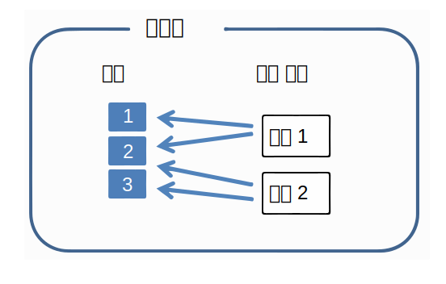
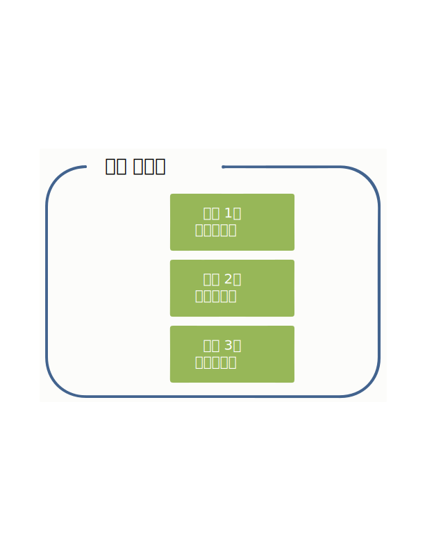
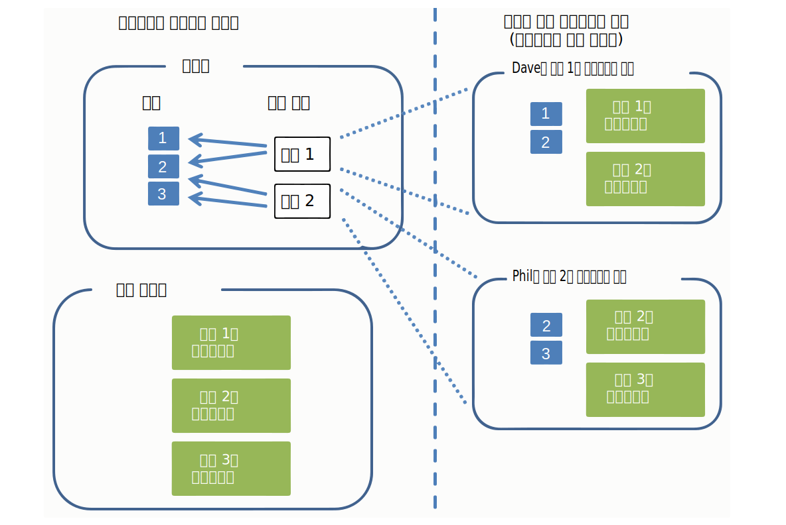
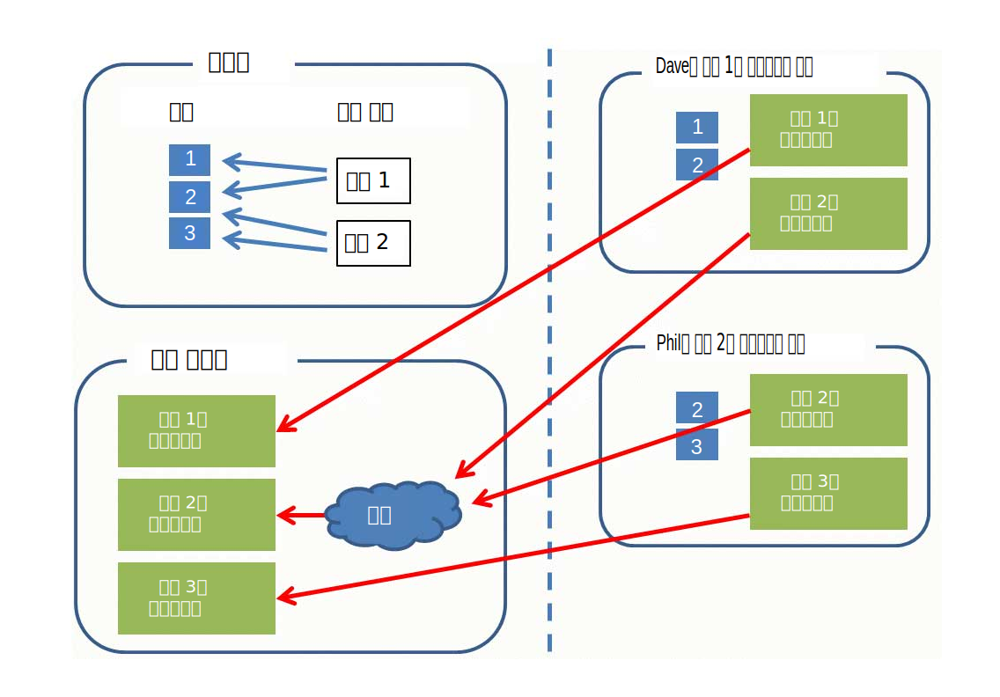

---

copyright:
  years: 2015, 2018
lastupdated: "2018-07-19"

---

{:shortdesc: .shortdesc}
{:new_window: target="_blank"}
{:tip: .tip}
{:pre: .pre}
{:codeblock: .codeblock}
{:screen: .screen}
{:javascript: .ph data-hd-programlang='javascript'}
{:java: .ph data-hd-programlang='java'}
{:python: .ph data-hd-programlang='python'}
{:swift: .ph data-hd-programlang='swift'}

이 문서는 {{site.data.keyword.knowledgestudiofull}} on {{site.data.keyword.cloud}}에 대한 문서입니다. 이전 {{site.data.keyword.knowledgestudioshort}} on {{site.data.keyword.IBM_notm}} Marketplace 버전에 대한 문서를 보려면 [이 링크를 클릭 ](https://console.bluemix.net/docs/services/knowledge-studio/documents-for-annotation.html){: new_window}하십시오.
{: tip}

# 어노테이션 작성을 위한 문서 추가
{: #documents-for-annotation}

기계 학습 모델을 훈련시키려면 작업공간에 저널 기사 또는 기타 업계 고유 텍스트와 같이 주제 관련 지식을 포함하는 문서를 추가해야 합니다.
{: shortdesc}

## 이 태스크에 대한 정보
{: #annotation_about}

규칙 기반 모델의 규칙을 정의하려는 경우에는 규칙을 정의하는 데 필요한 패턴을 도출할 수 있는 문서를 추가하거나 업로드합니다. 자세한 정보는 [규칙 정의를 위한 문서 추가](/docs/services/watson-knowledge-studio/rule-annotator-add-doc.html)를 참조하십시오. 이 절에서는 어노테이션 전용으로 문서를 추가하는 방법을 설명합니다.

## 문서
{: #wks_sampledoc}

기계 학습 모델을 훈련시키려면 도메인 컨텐츠를 잘 나타내며 애플리케이션에서 가치가 높은 문서를 수집해야 합니다.

훈련 문서가 도메인과 관련된 컨텐츠를 잘 나타내는지, 즉 어노테이션을 작성할 수 있는 많은 관련 멘션을 포함하는지 확인하십시오. 최선의 문서를 선택하려면 다음 가이드라인을 따르십시오.

- 총 크기가 300,000 단어 이상인 문서 세트를 제공하려 노력하십시오. 더 복잡한 유형 시스템의 경우에는 이보다 더 많이, 더 단순한 유형 시스템의 경우에는 이보다 더 적게 제공하십시오.
- 각 문서의 크기를 하나 또는 두 컨텐츠 페이지(2,000 단어보다 적게, 문서당 1,000 단어가 가장 좋음)로 제한하십시오. 모델 개발 초기 단계에서는 각 문서의 크기를 몇 단락으로 제한하는 것도 좋습니다. 사람 어노테이터는 긴 문서에서 멘션 및 관계를 표시할 수도 있으나, 여러 페이지에 걸쳐 상호 참조를 표시하는 것은 어렵습니다.
- 문서 내의 데이터가 모든 가능한 엔티티 유형, 하위 유형, 역할 및 이들 간의 관계에 분포되어 있는지 확인하십시오. 목표는 문서 콜렉션에서 각 엔티티 유형에 대해 50개 이상의 어노테이션, 각 관계 유형에 대해 50개 이상의 어노테이션을 확보하는 것입니다.
- 문서는 애플리케이션이 다룰 주제의 범위를 나타내야 하지만, 엔티티 유형 및 관계 유형에서 발생 빈도가 비대칭인 경우에는 각 유형에 대해 50개 이상의 예(멘션이 구문인 엔티티 유형의 경우에는 더 많이)를 확보할 수 있도록 노력하십시오.
- 훈련을 위해 작성하는 세트는 10개 이상의 어노테이션 작성된 문서를 포함해야 합니다.

모델을 작성하고 훈련시킬 준비가 되면, 작업공간에 추가된 문서를 훈련 데이터, 테스트 데이터 및 블라인드 데이터 세트로 나눌 수 있습니다. 각 데이터 세트는 모델 성능을 평가하는 데 있어서 중요합니다.

다음 방법으로 문서를 추가할 수 있습니다.

- UTF-8 형식의 2열 CSV 파일
- UTF-8 형식의 텍스트 파일
- {{site.data.keyword.knowledgestudioshort}} 작업공간에서 다운로드한 문서를 포함하는 ZIP 파일
- UIMA CAS XMI 형식의 파일을 포함하는 ZIP 파일

### CSV 파일
{: #wks_sampledoc__wks_samplecsv}

로컬 시스템에서 샘플 텍스트를 포함하는 2열 CSV 파일을 업로드할 수 있습니다. CSV 파일은 한 번에 하나씩 업로드하십시오. CSV 파일의 첫 번째 열은 문서의 파일 이름을 지정합니다. 이 파일의 두 번째 열은 문서 텍스트를 포함합니다. 필수 형식에 대한 예는 튜토리얼 샘플 파일의 <a href="https://watson-developer-cloud.github.io/doc-tutorial-downloads/knowledge-studio/documents-new.csv" download>`documents-new.csv` </a> 파일을 참조하십시오.

### 다른 Watson Knowledge Studio 작업공간의 문서
{: #wks_sampledoc__wks_samplecorpus}

이전에 {{site.data.keyword.knowledgestudioshort}} 작업공간에서 문서를 다운로드한 경우에는 다운로드한 `ZIP` 파일을 업로드할 수 있습니다. 옵션을 사용하면 가져오는 파일에 기준 실제값 어노테이션을 포함시킬지 지정할 수 있습니다.

문서에 어노테이션이 작성되고 나면, 어노테이션 작성된 문서는 `JSON` 형식으로 저장됩니다. 원본 문서 텍스트가 어떻게 구문 분석되고 토큰화되었는지 보여주는 이러한 파일의 마크업 언어는 사람 어노테이터가 추가한 모든 어노테이션의 요소를 포함합니다. 시간 경과에 따라 모델 정확도를 개선하려는 경우에는 이러한 파일을 다른 작업공간에 업로드하여 모든 기존 어노테이션을 유지할 수 있습니다. 사람 어노테이터는 이러한 문서에서 어노테이션을 수정하고, 삭제하고, 추가할 수 있으며, 또는 사람에 의한 어노테이션 작성을 건너뛰고 이러한 파일을 사용하여 모델 성능을 평가하고 개선하는 데 사용되는 훈련, 테스트 및 블라인드 문서 세트를 작성할 수 있습니다.

### UIMA CAS XMI 파일
{: #wks_sampledoc__samplexmi}

모델 훈련에 도움을 주기 위해, UIMA 분석 엔진에 의해 어노테이션 미리 작성이 수행된 문서를 업로드할 수 있습니다. 어노테이션 미리 작성이 수행된 파일의 형식은 UIMA CAS XMI(UIMA Common Analysis Structure의 XMI 직렬화)여야 하며 ZIP 파일로 결합되어야 합니다. 예를 들면, {{site.data.keyword.IBM_notm}} {{site.data.keyword.watson}} Explorer 콜렉션에서 어노테이션 작성된 문서를 업로드할 수 있습니다.

사람 어노테이터는 이러한 문서에서 어노테이션을 수정하고, 삭제하고, 추가할 수 있으며, 또는 사람에 의한 어노테이션 작성을 건너뛰고 이러한 파일을 사용하여 모델 성능을 평가하고 개선하는 데 사용되는 훈련, 테스트 및 블라인드 문서 세트를 작성할 수 있습니다. 이러한 파일의 작성 방법 및 업로드 요구사항에 대한 세부사항은 [어노테이션 미리 작성이 수행된 문서의 업로드](/docs/services/watson-knowledge-studio/preannotation.html#wks_uima)를 참조하십시오.

### 데이터 익명화
{: #wks_anonymizing}

자신의 데이터에 대해 최적화된 모델을 빌드하면서 개인정보 보호를 위해 {{site.data.keyword.knowledgestudioshort}}에 데이터를 그대로 업로드하지 않으려는 경우에는, 먼저 문서에서 개인 식별 정보(PII)를 제거한 후 이러한 익명화된 문서를 사용하여 모델을 훈련시킬 수 있습니다. 이러한 정보를 수정하거나 모두 변수로 대체하지 마십시오. 최선의 결과를 위해서는 실제 정보를 동일한 유형의 허위 정보로 대체하십시오.

예를 들어, 보호하려는 PII가 고객 이름인 경우에는 각 이름을 수정하거나 *USER_NAME*과 같은 변수로 대체하는 대신 *Jane Doe*, *Mr. Smith*, *Dietrich* 또는 *Dr. Jones, PhD*와 같이 다양한 일반적 이름 구문 스타일을 사용하는 허위 이름으로 대체하십시오. 실제 사용자 이름의 인스턴스를 대체하기 위해 문서에 삽입할 수 있는 허위 이름을 작성하기 위해 다양한 이름 및 성, 호칭 및 성을 연결하거나 성만 추가하는 스크립트를 작성하는 것을 고려하십시오. 목표는 소스 문서의 실제 값을 가능한 한 가깝게 시뮬레이션하는 것입니다. 문서에서 동일한 텍스트(USER_NAME)가 사용되거나 텍스트가 수정되는 경우는 즉 모든 이름이 동일한 값을 갖거나 수정되도록 모델을 훈련시키는 것입니다. 모델은 런타임에서 새 문서에 대해 사용되는 경우 이전에 보지 못한 다양한 형태의 이름을 이름으로 인식할 수 있어야 합니다.

## 작업공간에 문서 추가
{: #wks_projadd}

모델을 훈련시키려면 도메인 컨텐츠를 잘 나타내는 문서를 작업공간에 추가해야 합니다.

### 이 태스크에 대한 정보
{: #wks_projadd_about}

가장 좋은 방법은 비교적 작은 문서 콜렉션으로 시작하는 것입니다. 이러한 문서를 사용하여 사람 어노테이터(작업공간이 사람에 의한 어노테이션 작성을 포함하는 경우)를 훈련시키고 어노테이션 가이드라인을 정제하십시오. 작은 문서는 사람 어노테이터가 문서 전체에서 상호 참조 체인을 식별하는 데 도움을 줄 수 있습니다. 어노테이션 정확성이 개선됨에 따라 말뭉치에 문서를 추가하여 훈련에 깊이를 더할 수 있습니다.

### 프로시저
{: #wks_projadd_procedure}

작업공간에 문서를 추가하려면 다음 작업을 수행하십시오.

1. {{site.data.keyword.knowledgestudioshort}} 관리자 또는 프로젝트 관리자로 로그인하여 작업공간을 선택하십시오.
1. **Assets**> **Documents** > **Documentation sets** 탭을 선택하십시오. 
1. **Upload Document Sets**를 클릭하여 말뭉치에 문서를 추가하십시오.
1. 문서를 다음 형식 중 하나로 업로드하십시오. 한 번에 한 유형의 파일만 업로드할 수 있습니다.

    <table summary="이 표의 각 행에는 하나의 옵션이 설명되어 있습니다. ">
      <caption>표 1. 업로드 선택사항</caption>
      <tr>
        <th style="vertical-align:bottom; text-align:left" id="d31095e284-option">
          옵션
        </th>
        <th style="vertical-align:bottom; text-align:left" id="d31095e284-desc">
          설명
        </th>
      </tr>
      <tr>
        <td headers="d31095e284-option" id="d31095e286">
          
<strong>CSV 파일</strong>

        </td>
        <td headers="d31095e284-desc d31095e286">
          
샘플 문서를 포함하는 하나의 CSV 파일을 끌어 오거나, 클릭하여 로컬 시스템에서 해당 파일을 찾은 후 <b>Upload</b>를 클릭하십시오. CSV 파일의 첫 번째 열은 문서의 파일 이름을 지정합니다. 이 파일의 두 번째 열은 문서 텍스트를 포함합니다. CSV 파일은 UTF-8 형식이어야 합니다.

        </td>
      </tr>
      <tr>
        <td headers="d31095e284-option" id="d31095e294">
          
<strong>텍스트 파일</strong>

        </td>
        <td headers="d31095e284-desc d31095e294">
          
로컬 시스템에서 하나 이상의 텍스트 파일을 끌어 오거나, 클릭하여 파일을 찾아 선택한 후 <b>Upload</b>를 클릭하십시오. 텍스트 파일은 UTF-8 형식이어야 합니다.

        </td>
      </tr>
      <tr>
        <td headers="d31095e284-option" id="d31095e316">
          
<strong>ZIP 파일</strong>

        </td>
        <td headers="d31095e284-desc d31095e316">
          
이전에 Watson Knowledge Studio 작업공간에서 문서를 다운로드한 경우에는 다운로드한 문서를 포함하는 <code>ZIP</code> 파일을 끌어 오거나, 클릭하여 찾아 선택하십시오. 문서를 다운로드하기 전에 추가된 어노테이션을 포함시키려는 경우에는 <b>Upload</b>를 클릭하기 전에 기준 실제값을 포함시키는 옵션을 선택했는지 확인하십시오. 문서를 다운로드하기 전에 기준 실제값으로 승격된 어노테이션만 가져옵니다. 

<b>제한사항:</b> 어노테이션이 작성된 문서를 가져올 때 이러한 문서는 다시 토큰화됩니다. 이 프로세스는 Watson Knowledge Studio가 문장 경계로 간주하는 것을 변경할 수 있습니다. 어노테이션은 문장별로 정의되므로, 이 프로세스 중에 일부 어노테이션이 무효화될 수 있습니다. 다른 작업공간의 문서를 업로드한 후에는 어노테이션에 대한 간략한 검토를 수행하여 차이를 해결하십시오.

          
기준 실제값 어노테이션을 업로드하기 전에 원본 작업공간의 유형 시스템을 현재 작업공간으로 업로드해야 합니다. 세부사항은 [다른 작업공간의 리소스 업로드 ](exportimport.html){: new_window}를 참조하십시오.

          
이전에 UIMA CAS XMI 형식의 어노테이션 작성된 문서를 다운로드한 경우에는, 분석된 컨텐츠를 포함하는 <code>ZIP</code> 파일을 업로드할 수 있습니다. <b>Upload</b>를 클릭하기 전에 이것이 업로드할 컨텐츠의 유형임을 지정하십시오. 이러한 파일의 작성 방법 및 업로드 요구사항에 대한 세부사항은 [어노테이션 미리 작성이 수행된 문서의 업로드 ](preannotation.html#wks_uima){: new_window}를 참조하십시오.

        </td>
      </tr>
    </table>

1. 문서가 추가된 후에는 문서 이름을 클릭하여 문서를 미리 보고 컨텐츠에 문제가 없는지 확인하십시오. 예를 들면, 텍스트 파일의 형식이 UTF-8 형식이며 문서에 구분 표시 또는 문자 표준화 문제가 없는지, 바람직하지 않은 문장 구분이 없는지 확인하십시오. 문제점이 있는 경우에는 파일을 말뭉치에 추가하기 전에 사전 처리해야 합니다. 사전 또는 사람에 의한 어노테이션 작성을 시작하기 전에는 문서를 가능한 한 깔끔하게 잘 형식화해야 합니다.

### 다음에 수행할 작업
{: #wks_projadd_next}

사람에 의한 어노테이션 작성 태스크를 시작하기 전에, 말뭉치를 여러 문서 세트로 나누고 이러한 문서 세트를 사람 어노테이터에게 지정하십시오.

## 어노테이션 세트 작성 및 지정
{: #wks_projdocsets}

문서를 추가한 후에는 여러 사람 어노테이터가 어노테이션을 작성할 수 있도록 문서를 여러 세트로 나누십시오. 어노테이터 간 일치 점수를 보려면 둘 이상의 사람 어노테이터를 지정하고 세트 간에 겹치는 문서의 백분율을 지정해야 합니다.

### 시작하기 전에
{: #wks_projdocsets_prereqs}

- 문서 세트를 어노테이션 세트로 나누려면 먼저 문서 세트를 업로드해야 합니다.
- 이 작업공간에서 문서에 대해 작업할 모든 사람 어노테이터에 대해 {{site.data.keyword.knowledgestudioshort}}에 사용자 계정을 작성해야 합니다.

### 이 태스크에 대한 정보
{: #wks_projdocsets_about}

> **주의:** Google Chrome 브라우저를 사용하는 경우에는 많은 수의 파일(예: 300개 이상)을 폴더에서 선택하여 업로드할 수 없습니다. 임시 해결책은 Firefox 브라우저를 사용하거나 적은 수의 파일을 선택하여 여러 번 파일을 업로드하는 것입니다.

작업공간당 최대 1,000개의 어노테이션 세트를 작성할 수 있습니다.

### 프로시저
{: #wks_projdocsets_procedure}

어노테이션 세트를 작성하려면 다음 작업을 수행하십시오.

1. {{site.data.keyword.knowledgestudioshort}} 관리자 또는 프로젝트 관리자로 로그인하여 작업공간을 선택하십시오.
1. **Assets**> **Documents** > **Annotation sets** 탭을 선택하십시오. 
1. **Create Annotation Sets**를 클릭하십시오.

    1. 기본 세트에 대해서는 어노테이션 세트로 나눌 문서 콜렉션(말뭉치 내의 모든 문서 또는 문서 세트에 이전에 할당되었던 문서)을 선택하십시오.

    1. 겹침 값에 대해서는 각 어노테이션 세트에 포함시킬 문서의 백분율을 지정하십시오. 둘 이상의 사람 어노테이터가 동일한 문서에 어노테이션을 작성하지 않으면 어노테이터 간 일치 점수를 계산할 수 없습니다. 예를 들어, 30개 문서를 포함하는 말뭉치에 대해 20%를  지정한 후 이 말뭉치를 3개의 문서 세트로 나누면 6개 문서(20%)가 모든 사람 어노테이터에 의해 어노테이션 작성됩니다. 나머지 24개 문서는 세 사람 어노테이터에게 나뉘어 분배됩니다(각각 8개). 따라서 각 어노테이터는 어노테이션을 작성해야 하는 14개 문서(6 + 8)를 받습니다.

    > **참고:** 기계 학습 모델을 훈련시키는 데 사용할 어노테이션 세트는 10개 이상의 어노테이션 작성된 문서를 포함해야 합니다.

    1. 사람 어노테이터의 목록에서 사용자 이름을 선택하십시오.

        > **참고:** 라이트 플랜 구독을 보유 중이면 자신을 어노테이션 세트와 연관시키십시오. 무료 사용제의 사용자는 다른 사용자를 추가하고 사람 어노테이터 역할을 지정할 수 없습니다. 그러나 자기 자신을 추가함으로써 사람 어노테이터 역할을 수행하면서 진짜 사람 어노테이터가 문서에 어노테이션을 작성하기 위해 기준 실제값 편집기와 어떻게 상호작용할지 테스트할 수 있습니다.

    1. 어노테이션 세트의 이름을 지정하십시오.

        작업공간에서 작업이 진행됨에 따라 사람 어노테이터의 작업을 평가하는 좋은 방법은 세트에 지정된 사람 어노테이터를 식별하는 어노테이션 세트 이름을 작성하는 것입니다. 어노테이션 세트가 작성된 후에는 세트 이름을 변경할 수 없습니다.

1. 이 작업공간에서 작업할 사람 어노테이터를 모두 지정한 후에는 **Generate**를 클릭하여 어노테이션 세트를 작성하십시오. 기준 실제값 편집기에 로그인한 사람 어노테이터는 자신에게 지정된 어노테이션 세트만 볼 수 있습니다.

**관련 태스크**:
{: #wks_related_tasks}

[팀 구성](/docs/services/watson-knowledge-studio/team.html)

## 문서 삭제
{: #wks_deletedocs}

문서가 모델에 유용한 표준 업계 텍스트를 나타내지 않는다고 판단되면 문서를 삭제할 수 있습니다. 

문서를 삭제하려면 자신의 상황에 적용되는 옵션을 선택하십시오. 
- [어노테이션 태스크와 연관되지 않은 문서 삭제](#deletenotask)
- [어노테이션 태스크와 연관되어 있으며 사람 어노테이션이 *시작되지 않은* 문서 삭제](#deletenoanno)
- [어노테이션 태스크와 연관되어 있으며 사람 어노테이션이 *시작된* 문서 삭제](#deleteanno)

### 어노테이션 태스크와 연관되지 않은 문서 삭제
{: #deletenotask}

삭제하려는 문서가 어노테이션 태스크와 연관되지 않은 경우에는 다음 단계를 완료하여 문서를 삭제하십시오. 

#### 프로시저
{: #deletenotaskp}

1. {{site.data.keyword.knowledgestudioshort}} 관리자로 로그인하여 작업공간을 선택하십시오.
1. **Assets**> **Documents** > **Document sets** 탭을 선택하십시오. 
2. 삭제할 문서가 포함된 문서 세트를 선택하십시오. 문서 세트가 열립니다. 
3. 제거할 문서를 찾은 후 **Delete**를 클릭하십시오.

### 어노테이션 태스크와 연관되어 있으며 사람 어노테이션이 시작되지 않은 문서 삭제
{: #deletenoanno}

삭제할 문서가 어노테이션 태스크와 연관되어 있으며 사람 어노테이션이 *시작되지 않은* 경우에는 다음 단계를 완료하여 문서를 삭제하십시오. 

#### 프로시저
{: #deletenoannop}

1. {{site.data.keyword.knowledgestudioshort}} 관리자로 로그인하여 작업공간을 선택하십시오.
1. 어노테이션 태스크를 삭제하십시오. 

  a. **Machine Learning Model** > **Annotation Tasks** 페이지를 여십시오. 

  b. 문서가 연관된 어노테이션 태스크를 찾고 태스크에서 **메뉴 표시** 아이콘을 클릭한 후에 **Delete**를 클릭하십시오. 

1. [어노테이션 태스크와 연관되지 않은 문서 삭제](#deletenotask)에서 설명된 대로 문서를 삭제하십시오. 
1. 문서를 삭제한 후에는 어노테이션 작성 태스크를 다시 작성하고 이제 내부에 문서가 하나 줄어든 동일한 어노테이션 세트를 연관시키십시오. 

### 어노테이션 태스크와 연관되어 있으며 사람 어노테이션이 시작된 문서 삭제
{: #deleteanno}

삭제할 문서가 어노테이션 태스크와 연관되어 있으며 사람 어노테이션이 *시작된* 경우에는 다음 단계를 완료하여 문서를 삭제하십시오. 

**주의**: 사람 어노테이션이 진행 중인 경우에는 태스크를 삭제하지 마십시오. 삭제하면 진행 중인 작업이 유실됩니다. 

#### 프로시저
{: #deleteannop}

1. 사람 어노테이터에게 세트에서 원하지 않는 문서를 무시하도록 알리십시오. 
1. 모든 어노테이션 작업이 기타 문서에서 완료되고 사람 어노테이터가 기준 실제값에 세트를 추가하기 위해 모든 문서를 제출한 후에는 [제출된 문서를 검토하고 수락하십시오](/docs/services/watson-knowledge-studio/build-groundtruth.html#wks_haaccuracy).
1. [어노테이션 충돌을 해결하십시오](/docs/services/watson-knowledge-studio/build-groundtruth.html#wks_haadjudicate).
1. 모든 문서가 기준 실제값의 일부이고 태스크가 완료된 경우, [어노테이션 태스크와 연관되어 있으며 사람 어노테이션이 시작되지 않은 문서 삭제](#deletenoannop)에서 설명된 대로 태스크를 삭제하십시오. 
1. [어노테이션 태스크와 연관되지 않은 문서 삭제](#deletenotask)에서 설명된 대로 문서를 삭제하십시오. 

  **참고**: 문서 세트를 다운로드하고 `gt` 폴더의 문서를 검토하여 나머지 문서의 어노테이션이 유실되지 않음을 확인할 수 있습니다. 

## 데이터 모델
{: #wks_datamodel}

이 주제의 다이어그램은 {{site.data.keyword.knowledgestudioshort}} 시스템 내의 문서 플로우를 요약하여 나타내고 있으며 말뭉치, 어노테이션 작성 태스크 및 기준 실제값 내의 문서 간 차이점 또한 요약하여 나타내고 있습니다.

말뭉치는 문서 세트로 분할된 문서를 포함하고 있습니다.

- 문서는 텍스트 문자열에 불과합니다.
- 문서 세트는 문서 그룹에 대한 포인터입니다. 문서 세트는 문서 자체의 사본을 포함하지 않습니다.
- 어떤 문서 세트는 하나의 문서를 가리킬 수 있으며, 이 설정은 어노테이션 세트를 작성할 때 지정하는 겹침 매개변수를 통해 제어할 수 있습니다.

 그림 1. 이 그림은 세 개의 문서를 가리키는 두 개의 문서 세트를 나타내고 있습니다. 문서는 세트 간에 분할되어 있습니다.

기준 실제값는 문서에 추가된 어노테이션(멘션, 관계 및 상호 참조된 멘션)으로 구성됩니다. 기준 실제값은 각 문서에서 고유합니다.

 그림 2. 이 그림은 문서 1, 문서 2, 문서 3...에 추가된 어노테이션으로 구성된 기준 실제값을 나타냅니다.

어노테이션 작성 태스크를 작성하면 태스크에 추가하는 어노테이션 세트의 각 문서에 대해 어노테이션의 사본이 작성됩니다. 사람 어노테이터가 문서에 어노테이션을 작성합니다. 어노테이션은 각 어노테이션 및 기준 실제값으로부터 격리되어 있습니다. 어노테이션 작성 태스크는 사람 어노테이터가 격리된 공간에서 텍스트에 어노테이션을 작성할 수 있게 해 주는 일시적 개념입니다. 이에 반해 기준 실제값은 영구적이며 고유합니다.

 그림 2. 이 그림은 프로젝트 관리자가 어노테이션을 세트를 작성하고 이를 어노테이션 작성 태스크에 지정하는 것을 나타냅니다. 사람 어노테이터인 Dave 및 Phil은 자신에게 지정된 세트 내 문서에 어노테이션을 작성합니다.

프로젝트 관리자가 어노테이션 작성 태스크의 어노테이션 세트를 승인한 후에는 다른 어노테이션 세트와 겹치지 않는 문서의 어노테이션이 기준 실제값으로 승격됩니다. 다른 어노테이션 세트와 겹치는 문서(이 예의 문서 2와 같이)에 대해서는 프로젝트 관리자가 판정을 수행하여 충돌을 해결해야 합니다. 겹치는 문서의 어노테이션은 판정을 거쳐 승인될 때까지 기준 실제값이 되지 않습니다.

그 후 기준 실제값은 기계 학습 모델을 훈련시키고 테스트하는 데 사용하거나, 다음 버전의 모델 개발에서 기초로 사용할 수 있습니다. 새 버전에서 기준 실제값을 사용하려면 새 어노테이션 작성 태스크를 작성해야 합니다.

 그림 3. 이 그림은 두 사람 어노테이터가 추가한 어노테이션이 어떻게 기준 실제값이 되는지 보여줍니다. 문서 2로 레이블 지정된 문서는 두 어노테이터 모두에 의해 어노테이션 작성되었습니다. 이 겹치는 문서의 어노테이션은 기준 실제값이 되기 전에 판정을 거쳐야 합니다.
