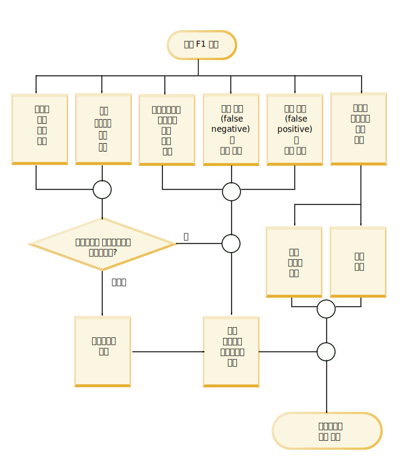
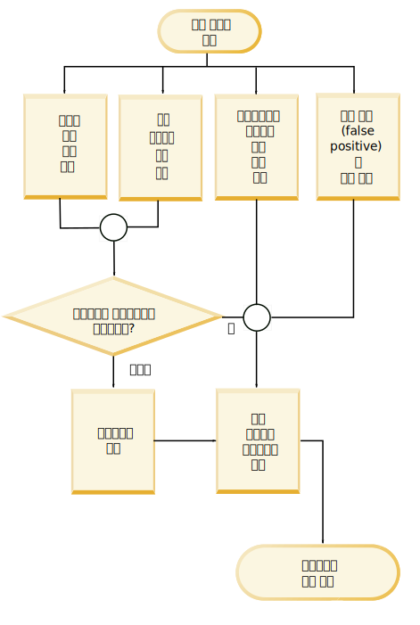

---

copyright:
  years: 2015, 2018
lastupdated: "2018-08-03"

---

{:shortdesc: .shortdesc}
{:new_window: target="_blank"}
{:tip: .tip}
{:pre: .pre}
{:codeblock: .codeblock}
{:screen: .screen}
{:javascript: .ph data-hd-programlang='javascript'}
{:java: .ph data-hd-programlang='java'}
{:python: .ph data-hd-programlang='python'}
{:swift: .ph data-hd-programlang='swift'}

이 문서는 {{site.data.keyword.knowledgestudiofull}} on {{site.data.keyword.cloud}}에 대한 문서입니다. 이전 {{site.data.keyword.knowledgestudioshort}} on {{site.data.keyword.IBM_notm}} Marketplace 버전에 대한 문서를 보려면 [이 링크를 클릭 ](https://{DomainName}/docs/services/knowledge-studio/evaluate-ml.html){: new_window}하십시오.
{: tip}

# 기계 학습 모델 성능 분석
{: #evaluate-ml}

훈련된 모델에 의해 추가된 어노테이션을 검토하여 문서에서 엔티티 멘션, 관계 멘션 및 상호 참조를 찾는 기능을 개선하기 위해 모델을 조정해야 하는지 판별하십시오.
{: shortdesc}

## 이 태스크에 대한 정보
{: #evaluate-ml_about}

엔티티 유형, 관계 유형 및 상호 참조된 멘션에 대한 통계의 요약을 보고 성능을 분석할 수 있습니다. *혼동 매트릭스*에 표시된 통계를 분석할 수도 있습니다. 혼동 매트릭스는 기계 학습 모델에 의해 추가된 어노테이션과 기준 실제값의 어노테이션을 비교하는 데 도움을 줍니다.

모델 통계는 다음 메트릭을 제공합니다.

- **F1 점수**

    점수 계산을 위해 정밀도와 재현율을 모두 고려하는 수치입니다. F1 점수는 정밀도와 재현율 값의 가중치 적용된 평균으로 해석할 수 있으며, 최고의 값은 1이고 최악의 값은 0입니다. [낮은 F1 점수 분석](/docs/services/watson-knowledge-studio/evaluate-ml.html#evaluate-mllowf1)을 참조하십시오.

- **정밀도**

    사람 어노테이터의 결과물과 비교했을 때 기계 학습 모델의 결과물이 어느 정도 정확했는지를 지정하는 수치입니다. 정밀도는 올바르게 레이블 지정된 어노테이션 수를 기계 학습 모델이 추가한 총 어노테이션 수로 나누어 결정됩니다. 엔티티 유형 A에 대한 정밀도가 1.0인 경우 이는 엔티티 유형 A로 레이블 지정된 모든 멘션이 실제로 해당 분류에 속함을 의미합니다. 낮은 정밀도 점수는 기계 학습 모델이 어느 부분에서 올바르지 않은 어노테이션을 작성했는지 식별하는 데 도움을 줍니다. 이 점수는 사람 어노테이터가 엔티티 A로 레이블 지정한 다른 멘션을 기계 학습 모델이 얼마나 누락했는지에 대한 정보를 제공하지 않으며, 재현율 점수가 이 정보를 나타냅니다. [낮은 정밀도 점수 분석](/docs/services/watson-knowledge-studio/evaluate-ml.html#evaluate-mllowp)을 참조하십시오.

- **재현율**

    특정 레이블로 어노테이션을 작성해야 하는 멘션 중 얼마나 많은 멘션이 실제 해당 레이블(사람 어노테이터가 동일한 문서에서 식별한 *올바른* 멘션)로 어노테이션 작성되었는지를 지정하는 수치입니다. 재현율은 올바르게 레이블 지정된 어노테이션 수를 작성되어야 하는 어노테이션의 수로 나누어 결정됩니다. 재현율 점수 1.0은 엔티티 A로 레이블 지정되어야 하는 모든 멘션이 올바르게 레이블 지정되었음을 의미합니다. 낮은 재현율 점수는 기계 학습 모델이 어노테이션을 작성해야 하는 위치에서 작성하지 않은 부분을 식별하는 데 도움을 줍니다. 이 점수는 엔티티 유형 A로 레이블 지정되지 않아야 하는 멘션 중 얼마나 많은 멘션이 이와 같이 레이블 지정되었는지에 대한 정보를 제공하지 않으며, 정밀도 점수가 이 정보를 나타냅니다. [낮은 재현율 점수 분석](/docs/services/watson-knowledge-studio/evaluate-ml.html#evaluate-mllowr)을 참조하십시오.

- **총 어노테이션 백분율**

    테스트 문서 세트에서 임의의 엔티티 유형 또는 관계 유형으로 어노테이션 작성된 총 단어 수 중에 얼마나 많은 단어가 특정 엔티티 유형 또는 관계 유형으로 어노테이션 작성되었는지 보여주는, 기준 실제값에 대한 수치입니다. 이 통계는 상호 참조된 멘션에 대해서는 사용할 수 없습니다. 이 값은 기준 실제값에서 특정 유형의 멘션이 다른 유형에 비해 얼마나 많은지 확인하는 데 도움을 줍니다.

- **말뭉치 밀도 백분율(단어 수 기준)**

    어노테이션 작성 여부와 관계없이 총 단어 수 중에 특정 엔티티 유형 또는 관계 유형으로 어노테이션 작성된 단어의 수를 보여주는, 기준 실제값에 대한 수치입니다. 이 통계는 상호 참조된 멘션에 대해서는 사용할 수 없습니다. 이 값은 도메인 문서에서 이 유형의 멘션이 모든 다른 단어에 비해 얼마나 많은지 확인하는 데 도움을 줍니다.

- **유형을 포함하는 문서 백분율**

    특정 엔티티 유형 또는 관계 유형을 포함하는 문서의 수를 보여주는, 기준 실제값에 대한 수치입니다. 이 통계는 상호 참조된 멘션에 대해서는 사용할 수 없습니다. 이 값은 세트 내의 문서가 도메인을 충분히 나타내는지 평가하는 데 도움을 줍니다. 주요 엔티티 유형에 대해 이 백분율이 낮은 경우에는 덜 나타난 유형의 멘션이 있는 문서를 추가할 수 있습니다.

## 프로시저
{: #evaluate-ml_procedure}

모델의 훈련 상태에 대한 성능 통계를 보려면 다음 작업을 수행하십시오.

1. {{site.data.keyword.knowledgestudioshort}} 관리자 또는 프로젝트 관리자로 로그인하여 작업공간을 선택하십시오.
1. **Machine Learning Model** > **Performance**를 선택하십시오. 
1. 멘션, 관계 또는 상호 참조에 대해 **Detailed Statistics** 링크를 선택하십시오.
1. **Summary** 보기에서 테스트 데이터를 평가할지 또는 훈련 데이터를 평가할지 지정한 후, 통계를 볼 어노테이션 유형(엔티티 유형, 관계 유형 또는 상호 참조된 멘션)을 지정하십시오. 데이터를 스크롤하면서 탐색하면 조사 및 개선이 필요함을 표시하기 위해 낮은 점수가 플래그 지정 및 강조표시됩니다. 삼각형 경고 아이콘은 F1 값이 고정값인 0.5 미만임을 나타냅니다.

    예를 들면, 어떤 문서가 어노테이션 미리 작성 및 사람 어노테이터를 통해 어노테이션 작성되어 일부 엔티티 유형의 F1 점수가 높을 수 있습니다. 그러나 구문의 차이, 또는 사람 어노테이터가 텍스트 또는 어노테이션 가이드라인을 해석하는 방식의 차이로 인해 기계 학습 모델이 패턴을 인식하고 올바른 어노테이션을 적용하는 데 어려움이 있어 그 외의 엔티티 유형에 대한 F1 점수는 낮을 수 있습니다.

1. 테스트 데이터에 대한 **Confusion Matrix** 보기에서 통계를 볼 어노테이션 유형(엔티티 유형 또는 관계 유형)을 지정하십시오. 각 엔티티 유형 또는 관계 유형에 대해 각 항목이 나타내는 것은 다음과 같습니다.

    - 매트릭스의 각 행은 기준 실제값(사람 어노테이터가 추가한 엔티티 유형 및 관계 유형)를 보여줍니다.
    - 매트릭스의 각 열은 디코드 결과(기계 학습 모델이 추가한 어노테이션 토큰)를 보여줍니다.
    - 각 셀의 숫자는 멘션의 발생 수가 아니라 멘션당 어노테이션 토큰의 수를 나타냅니다.

        토큰은 텍스트 문자열을 나타내는 데 사용됩니다. 이는 막연히 단어에 해당합니다. 멘션은 둘 이상의 토큰을 포함할 수 있습니다. 예를 들면, *Barack Obama*는 두 토큰을 포함하는 멘션입니다. PERSON 행 또는 열에서는 값 2가 문서에 있는 하나의 멘션인 *Barack Obama*를 나타내는 데 사용됩니다. 토큰 수는 일부 경우 다르게 계산될 수 있으므로 막연히 단어 수에 해당합니다. 예를 들어, 문장 끝의 마침표는 토큰으로 간주되며, 축약형은 보통 두 개의 토큰으로 확장됩니다.

    - **O**으로 레이블 지정된 열은 기계 학습 모델이 교차하는 행에서 식별된 유형(사람이 작성한 어노테이션)으로 어노테이션 작성해야 했으나 어떤 유형으로도 어노테이션 작성하지 않은 토큰을 식별합니다.
    - 값 **N/A**는 문서 세트에서 해당 유형에 대한 어노테이션이 없는 경우 표시됩니다. 예를 들어, 기준 실제값 또는 테스트 데이터로 어노테이션 작성된 문서 세트에 PERSON 멘션이 없는 경우 PERSON 엔티티 유형에 대한 점수는 N/A입니다.

    예를 들어, 다음 혼동 매트릭스 예는 교통 사고를 다룬 문서에 대해 실행된 기계 학습 모델의 결과를 보여줍니다.

    <table summary="사고 보고서 혼동 매트릭스 예">
       <caption>표 1. 혼동 매트릭스 예</caption>
       <tr>
        <th style="vertical-align:bottom; text-align:left" id="d15356e164">엔티티 유형</th>
        <th style="vertical-align:bottom; text-align:center" id="d15356e166">MANUFACTURER</th>
        <th style="vertical-align:bottom; text-align:center" id="d15356e168">MODEL</th>
        <th style="vertical-align:bottom; text-align:center" id="d15356e170">O</th>
      </tr>
      <tr>
        <td style="vertical-align:top; text-align:left" headers="d15356e164">MANUFACTURER</td>
        <td style="vertical-align:top; text-align:center" headers="d15356e166">515</td>
        <td style="vertical-align:top; text-align:center" headers="d15356e168">5</td>
        <td style="vertical-align:top; text-align:center" headers="d15356e170">44</td>
      </tr>
    </table>
    {: #evaluate-ml__datasimpletable_yms_hff_cw}

    이 매트릭스에서는 다음과 같은 정보를 확인할 수 있습니다.
    - 모델이 MANUFACTURER 엔티티 유형에 대한 멘션으로 515개의 토큰을 올바르게 인식했습니다.
    - 모델이 5개의 토큰을 MANUFACTURER로 레이블 지정하는 대신 MODEL 유형의 멘션으로 잘못 레이블 지정했습니다.
    - 모델이 MANUFACTURER 유형의 멘션을 구성하는 44개의 토큰을 특정 엔티티 유형으로 어노테이션 작성하는 데 실패했습니다.

    모델 성능을 평가하고 디코드 결과를 볼 때는 잘못 레이블 지정되거나 완전히 누락된 토큰을 조사하는 것부터 시작할 수 있습니다.

## 성능 개선 치트 시트
{: #evaluate-ml_cheat}

기계 학습 모델 성능을 개선하기 위해 수행해야 하는 단계를 판별하는 데 도움을 받으려면 이 치트 시트를 사용하십시오.

유형 시스템 복잡도, 훈련 문서의 적절성, 사람 어노테이터의 기술 수준 및 기타 요소가 결과에 영향을 주므로 다양한 도메인에 모두 적용할 수 있는 성능 점수 개선을 위한 규칙을 제시하는 것은 어렵습니다. 그러나 다음 표는 사용자가 초기 평가를 수행하고 성능 개선을 위한 조치를 취하는 데 도움을 줍니다(특히 초기 모델 개발 및 테스트 단계에서).

다음 표는 일반적인 기계 학습 모델 성능 문제점에 대한 수정사항을 제안합니다.

<table summary="표에서는 해당되는 첫 번째 열 아래로 공통 문제점을 나열하며 첫 번째 행 간에는 제안된 수정사항을 나열합니다. X 표시는 어떤 수정사항이 어떤 문제점에 적용되는지를 표시합니다. ">
    <caption>표 2. 공통 성능 문제점에 대한 수정사항</caption>
    <tr>
      <th style="vertical-align:bottom; text-align:left" id="d15356e221">문제점</th>
      <th style="vertical-align:bottom; text-align:center" id="d15356e223">사전 추가</th>
      <th style="vertical-align:bottom; text-align:center" id="d15356e225">문서 세트 편집</th>
      <th style="vertical-align:bottom; text-align:center" id="d15356e227">유형 고유 문서 추가</th>
      <th style="vertical-align:bottom; text-align:center" id="d15356e229">말뭉치에 추가 어노테이션 작성</th>
      <th style="vertical-align:bottom; text-align:center" id="d15356e231">사람이 작성한 어노테이션 수정</th>
      <th style="vertical-align:bottom; text-align:center" id="d15356e233">사람 어노테이터 가이드라인 개선</th>
      <th style="vertical-align:bottom; text-align:center" id="d15356e235">유형 시스템 업데이트</th>
      <th style="vertical-align:bottom; text-align:center" id="d15356e237">추가 조사</th>
    </tr>
    <tr>
      <td style="vertical-align:top; text-align:left" headers="d15356e221">낮은 F1 점수</td>
      <td style="vertical-align:top; text-align:center" headers="d15356e223">X</td>
      <td style="vertical-align:top; text-align:center" headers="d15356e225">X</td>
      <td style="vertical-align:top; text-align:center" headers="d15356e227">X</td>
      <td style="vertical-align:top; text-align:center" headers="d15356e229">X</td>
      <td style="vertical-align:top; text-align:center" headers="d15356e231">X</td>
      <td style="vertical-align:top; text-align:center" headers="d15356e233">X</td>
      <td style="vertical-align:top; text-align:center" headers="d15356e235">X</td>
      <td style="vertical-align:top; text-align:center" headers="d15356e237">X</td>
    </tr>
    <tr>
      <td style="vertical-align:top; text-align:left" headers="d15356e221">낮은 정밀도</td>
      <td style="vertical-align:top; text-align:center" headers="d15356e223"></td>
      <td style="vertical-align:top; text-align:center" headers="d15356e225"></td>
      <td style="vertical-align:top; text-align:center" headers="d15356e227"></td>
      <td style="vertical-align:top; text-align:center" headers="d15356e229">X</td>
      <td style="vertical-align:top; text-align:center" headers="d15356e231">X</td>
      <td style="vertical-align:top; text-align:center" headers="d15356e233">X</td>
      <td style="vertical-align:top; text-align:center" headers="d15356e235">X</td>
      <td style="vertical-align:top; text-align:center" headers="d15356e237">X</td>
    </tr>
    <tr>
      <td style="vertical-align:top; text-align:left" headers="d15356e221">낮은 재현율</td>
      <td style="vertical-align:top; text-align:center" headers="d15356e223">X</td>
      <td style="vertical-align:top; text-align:center" headers="d15356e225">X</td>
      <td style="vertical-align:top; text-align:center" headers="d15356e227">X</td>
      <td style="vertical-align:top; text-align:center" headers="d15356e229">X</td>
      <td style="vertical-align:top; text-align:center" headers="d15356e231"></td>
      <td style="vertical-align:top; text-align:center" headers="d15356e233"></td>
      <td style="vertical-align:top; text-align:center" headers="d15356e235"></td>
      <td style="vertical-align:top; text-align:center" headers="d15356e237"></td>
    </tr>
    <tr>
      <td style="vertical-align:top; text-align:left" headers="d15356e221">낮은 어노테이션 %</td>
      <td style="vertical-align:top; text-align:center" headers="d15356e223"></td>
      <td style="vertical-align:top; text-align:center" headers="d15356e225">X</td>
      <td style="vertical-align:top; text-align:center" headers="d15356e227">X</td>
      <td style="vertical-align:top; text-align:center" headers="d15356e229">X</td>
      <td style="vertical-align:top; text-align:center" headers="d15356e231"></td>
      <td style="vertical-align:top; text-align:center" headers="d15356e233"></td>
      <td style="vertical-align:top; text-align:center" headers="d15356e235"></td>
      <td style="vertical-align:top; text-align:center" headers="d15356e237"></td>
    </tr>
    <tr>
      <td style="vertical-align:top; text-align:left" headers="d15356e221">낮은 밀도</td>
      <td style="vertical-align:top; text-align:center" headers="d15356e223"></td>
      <td style="vertical-align:top; text-align:center" headers="d15356e225">X</td>
      <td style="vertical-align:top; text-align:center" headers="d15356e227">X</td>
      <td style="vertical-align:top; text-align:center" headers="d15356e229">X</td>
      <td style="vertical-align:top; text-align:center" headers="d15356e231"></td>
      <td style="vertical-align:top; text-align:center" headers="d15356e233"></td>
      <td style="vertical-align:top; text-align:center" headers="d15356e235"></td>
      <td style="vertical-align:top; text-align:center" headers="d15356e237"></td>
    </tr>
    <tr>
      <td style="vertical-align:top; text-align:left" headers="d15356e221">적은 유형 문서 수</td>
      <td style="vertical-align:top; text-align:center" headers="d15356e223"></td>
      <td style="vertical-align:top; text-align:center" headers="d15356e225"></td>
      <td style="vertical-align:top; text-align:center" headers="d15356e227">X</td>
      <td style="vertical-align:top; text-align:center" headers="d15356e229">X</td>
      <td style="vertical-align:top; text-align:center" headers="d15356e231"></td>
      <td style="vertical-align:top; text-align:center" headers="d15356e233"></td>
      <td style="vertical-align:top; text-align:center" headers="d15356e235">X</td>
      <td style="vertical-align:top; text-align:center" headers="d15356e237"></td>
    </tr>
    <tr>
      <td style="vertical-align:top; text-align:left" headers="d15356e221">올바르지 않은 분류</td>
      <td style="vertical-align:top; text-align:center" headers="d15356e223">X</td>
      <td style="vertical-align:top; text-align:center" headers="d15356e225"></td>
      <td style="vertical-align:top; text-align:center" headers="d15356e227"></td>
      <td style="vertical-align:top; text-align:center" headers="d15356e229"></td>
      <td style="vertical-align:top; text-align:center" headers="d15356e231"></td>
      <td style="vertical-align:top; text-align:center" headers="d15356e233"></td>
      <td style="vertical-align:top; text-align:center" headers="d15356e235">X</td>
      <td style="vertical-align:top; text-align:center" headers="d15356e237"></td>
    </tr>
    <tr>
      <td style="vertical-align:top; text-align:left" headers="d15356e221">어노테이션 누락 </td>
      <td style="vertical-align:top; text-align:center" headers="d15356e223">X</td>
      <td style="vertical-align:top; text-align:center" headers="d15356e225"></td>
      <td style="vertical-align:top; text-align:center" headers="d15356e227"></td>
      <td style="vertical-align:top; text-align:center" headers="d15356e229">X</td>
      <td style="vertical-align:top; text-align:center" headers="d15356e231"></td>
      <td style="vertical-align:top; text-align:center" headers="d15356e233"></td>
      <td style="vertical-align:top; text-align:center" headers="d15356e235"></td>
      <td style="vertical-align:top; text-align:center" headers="d15356e237"></td>
    </tr>
    <tr>
      <td style="vertical-align:top; text-align:left" headers="d15356e221">테스트 결과와 훈련 결과와의 차이 </td>
      <td style="vertical-align:top; text-align:center" headers="d15356e223"></td>
      <td style="vertical-align:top; text-align:center" headers="d15356e225">X</td>
      <td style="vertical-align:top; text-align:center" headers="d15356e227"></td>
      <td style="vertical-align:top; text-align:center" headers="d15356e229"></td>
      <td style="vertical-align:top; text-align:center" headers="d15356e231"></td>
      <td style="vertical-align:top; text-align:center" headers="d15356e233"></td>
      <td style="vertical-align:top; text-align:center" headers="d15356e235"></td>
      <td style="vertical-align:top; text-align:center" headers="d15356e237"></td>
    </tr>
    <tr>
      <td style="vertical-align:top; text-align:left" headers="d15356e221">훈련 데이터 테스트의 낮은 F1 점수</td>
      <td style="vertical-align:top; text-align:center" headers="d15356e223"></td>
      <td style="vertical-align:top; text-align:center" headers="d15356e225"></td>
      <td style="vertical-align:top; text-align:center" headers="d15356e227"></td>
      <td style="vertical-align:top; text-align:center" headers="d15356e229"></td>
      <td style="vertical-align:top; text-align:center" headers="d15356e231">X</td>
      <td style="vertical-align:top; text-align:center" headers="d15356e233">X</td>
      <td style="vertical-align:top; text-align:center" headers="d15356e235"></td>
      <td style="vertical-align:top; text-align:center" headers="d15356e237">X</td>
    </tr>
</table>
{: #evaluate-ml_cheat__datasimpletable_nhm_5ym_cw}

### 수정사항에 대한 설명
{: #evaluate-ml_fixes}

- **사전 추가**

    사전은 특정 엔티티 유형의 표층형 예를 포함하고 있습니다. 훈련 통계가 해당 유형의 어노테이션이 훈련 데이터에 드물게 발생함을 보여주는 경우에는 새 사전을 추가하거나 기존 사전에 항목을 추가해야 할 수 있습니다. 해당 엔티티 유형이 도메인에 있어서 주요 엔티티 유형이며 자주 발생하는 것이 확실한 경우, 이러한 통계 상의 공백은 훈련 데이터에 실제로 *있는* 해당 유형과 연관된 표층형을 기계 학습 모델에서 인식하지 못하고 있음을 나타낼 수 있습니다. 표층형 예를 추가로 제공하면 이 문제점을 해결하는 데 도움이 됩니다.

- **문서 세트 편집**

    전체 훈련 데이터가 충분한지 확인하십시오. 기계 학습 모델이 학습하기 위해서는 충분한 컨텐츠가 필요합니다. 300,000 단어 정도를 제공하는 것을 목표로 하십시오. (단어 수를 확인하기 위해 소스 문서에 대해 단어 수 계산 도구를 실행할 수 있습니다.) 훈련 세트의 컨텐츠가 적은 경우에는 말뭉치에 문서를 추가하십시오. 각 중요 엔티티 유형 또는 관계를 사용하는 소수의 문서만을 확보하는 것으로는 충분하지 않으며, 해당 도메인의 일반적인 문서에서 이러한 유형이 어떻게 사용되었는지 보여주는 많은 문서가 필요합니다.
  - 테스트와 훈련에 사용되는 문서 분류가 유사한지 확인하십시오. 예를 들면, 한 데이터 소스의 문서를 테스트 데이터 세트로 사용하고 다른 데이터 소스의 문서를 훈련 데이터 세트로 사용하지 마십시오. 서로 다른 데이터 소스는 엔티티 및 관계 유형 정보를 전혀 다른 방식으로 나타낼 수 있습니다. 업계 관련 문서로부터 가장 포괄적인 사용 예 세트를 얻으려면 두 데이터 세트의 모든 데이터 소스로부터 구성된 문서 조합을 사용하는 것이 좋습니다. 테스트 실행의 전체 성능 점수가 훈련 실행의 점수와 많이 다른 경우에는 각각에 사용된 데이터 세트 간의 불일치가 원인일 수 있습니다.
  - 올바르지 않게 형식화된 문서로 시간을 낭비하지 마십시오. 말뭉치에 추가하는 텍스트 문서는 UTF-8 형식이어야 합니다. 다른 형식의 문서를 UTF-8 인코딩을 사용하도록 변환한 경우에는 구분 기호가 표시되거나 기타 문자 표준화 관련 문제가 발생한 것을 볼 수 있습니다. 이러한 올바르지 않은 형식화는 정확하지 않은 토큰 표시로 이어질 수 있습니다. 특정 멘션을 나타내는 데 사용된 단어 토큰이 문서 간에 다른 경우에는 예의 효용성이 떨어지며 기계 학습에 부정적인 영향을 줍니다.

- **유형 고유 문서 추가**

    특정 유형을 포함하는 문서의 백분율이 낮은 경우 이는 말뭉치의 대표성이 떨어짐을 의미할 수 있습니다. 기계 학습 모델은 학습할 많은 예를 필요로 합니다. 더 많은 문서를 말뭉치에 추가하면 이를 해결하는 데 도움이 됩니다. 유형 시스템 및 문서가 특정 도메인을 정말 잘 나타내는 경우에는 무작위로 어느 문서를 선택하든 어느 정도의 유형 서브세트를 포함할 것으로 예상할 수 있습니다. 모든 경우에 그런 것은 아니지만, 이 상황은 유형 시스템과 말뭉치 내 문서의 품질을 검토해야 함을 나타내는 신호로 볼 수 있습니다. 사용자는 현재 빈도가 적은 유형을 더 많이 사용하는 도메인 문서를 더 많이 찾아야 합니다. 재현율이 낮은 경우 이는 보통 더 많은 문서를 추가해야 함을 나타냅니다.

- **말뭉치에 추가 어노테이션 작성**

    기계 학습 모델이 특정 유형의 인스턴스를 찾는 어려움을 겪고 있는 경우 이는 기준 실제값에 해당 유형의 사용 예가 충분히 포함되어 있지 않은 것이 원인일 수 있습니다. 사람 어노테이터는 엔티티 유형 멘션에 대해서는 철저하게 어노테이션을 작성하면서, 관계 유형 및 상호 참조에 대해서는 어노테이션 작성에 공을 덜 들이는 경우가 있습니다. 말뭉치 밀도 백분율이 낮은 주요 유형에 대해, 사용자는 소스 문서에서 더 많은 이러한 유형의 어노테이션을 찾는 데 집중하려 할 수 있습니다. 그러나 멘션 정확도가 부족한 경우에는 상호 참조 및 관계 정확도에 너무 신경쓰지 마십시오. 엔티티 간 관계 멘션 및 엔티티 간 상호 참조는 먼저 엔티티 멘션이 정확하지 않으면 정확할 수 없습니다.

- **사람이 작성한 어노테이션 수정**

    훈련 데이터가 일관되게, 완전히 어노테이션 작성되었는지 확인하십시오. 기계 학습 모델은 기준 실제값 어노테이션으로부터 학습을 수행합니다. 예를 들어, 특정 문장이 Obama family라는 구문을 포함하며 한 문장에서는 "Obama"를 PERSON로 레이블 지정하고 다른 문장에서는 "Obama family"를 PEOPLE로 레이블 지정하는 경우, 이러한 불일치는 기계 학습 모델이 올바른 어노테이션을 학습할 수 없음을 의미합니다. 마찬가지로, "Obama"를 한 문장에서 PERSON으로 레이블 지정하고 다른 모든 문장에서 이 이름을 레이블 지정하지 않는 경우 또한 어노테이션 작성 작업이 완전하지 않으며 기계 학습 모델이 올바르지 않게 훈련됩니다. 이러한 불일치 및 부분적 레이블링 유형은 *유형 혼동*이라고 하기도 합니다. 대부분의 경우에는 단순히 여러 사람 어노테이터가 겹치는 문서 세트를 검토하는 것만으로도 유형 혼동 관련 실수가 발견됩니다. 문서 충돌 해결 중에 발견되는 문제는 유형 시스템 자체의 더 근본적인 문제에 대한 정보를 제공하므로 이러한 문제에 주의를 기울이십시오. 유형 시스템을 개선하거나 정제할 여지가 없는 경우에는 어노테이션 가이드라인을 업데이트하고 예를 포함시켜야 할 수 있습니다. 사용자는 일반적인 실수에 대한 설명과 해당 상황에서 멘션에 적절히 어노테이션을 작성하는 방법을 제공해야 합니다.

    어노테이션 불일치의 또 다른 지표는 어노테이션 수가 충분하지만 말뭉치 밀도가 여전히 낮은 경우입니다. 밀도는 도메인 문서에서 중요한 멘션이 자주 발생하지만 문서 세트 전체에서 다양한 유형으로 어노테이션 작성되는 경우 영향을 받을 수 있습니다.

    낮은 정밀도는 보통 어노테이션 일관성을 개선해야 함을 나타냅니다. 이를 수행하려면 어노테이션 가이드라인을 검토하고, 사람 어노테이터를 훈련시키고, 사람 어노테이터들이 각자 따로 작업하지 않고 서로 협력하여 작업하도록 해야 합니다.

    어노테이터 간 일치 점수를 확인하십시오. 서로 다른 어노테이터의 결과물 간 일치 정도를 나타내는 이 점수는 중요한 수치입니다. 이 점수는 기계 학습 모델을 훈련시키는 데 사용되는 기준 실제값 문서의 품질을 나타낼 뿐만 아니라 기계 학습 모델 성능의 상한을 나타내기도 합니다. 이러한 문서를 기반으로 훈련된 모델은 여러 작업자가 협력하여 도달할 수 있는 최고의 일치 수준보다 더 나은 성능을 보이기 어렵습니다. 예를 들어, 성능 점수가 75에서 지속되며 더 높아지지 않는 경우에는 어노테이터 간 일치 결과를 살펴보십시오. 어노테이터 간 일치 점수가 80인 경우에는 사람 어노테이터의 훈련도를 높이고 판정 중에 충돌이 올바르게 해결(어노테이션 가이드라인에 따라)되도록 하기 위한 조치를 수행하십시오. 사람 어노테이터가 특정 항목의 레이블 지정 방식에 대해 동의하지 못하는 경우에는 기계 학습 모델이 올바른 레이블을 적용하지 못할 가능성이 높습니다.

- **사람 어노테이터 가이드라인 개선**

    명확하고 포괄적인 어노테이터 가이드라인은 문제 없는 성공적인 어노테이션 개발에 있어서 중요한 부분입니다. 사람 어노테이터의 작업은 어렵습니다. 엔티티 및 관계 유형을 지정하는 데 있어서, 도메인 문서에 대한 작업을 시작하기 전에는 예상하기 어려운 미묘한 차이가 있을 수 있습니다. 가이드라인은 사람 어노테이터가 문서를 평가하면서 결과가 올바른지 확인할 수 있는 기준을 제공합니다. 이 가이드라인은 계속해서 변경되고 개선되어야 합니다(특히 어노테이션 작성 프로세스 초기에). 사람 어노테이터는 몇 개의 문서에 어노테이션을 작성하면서 배운 것을 가이드라인에 반영할 수 있으며, 이러한 과정이 반복되면서 새로운 팁 및 요령이 가이드라인에 추가될 수 있으므로 가이드라인은 주요 피드백 루프를 제공합니다. 가이드라인에 어려운 결정의 예와 이에 대한 바람직한 해결책을 포함시키십시오. 어노테이션 가이드라인에 무엇을 추가해야 하는지 판별하는 가장 좋은 방법은 문서 충돌을 주의 깊게 검토하는 것입니다. 실제 작업자들이 이견을 가졌던 실제 어노테이션 예와 이들이 해결된 방식은 새 문서에 어노테이션을 작성하는 사람 어노테이터에게 큰 도움이 됩니다.

- **유형 시스템 업데이트**

    다음과 같은 이유로 유형 시스템을 업데이트해야 할 수 있습니다.
  - 훈련 데이터를 구성하는 문서에 도메인의 중요 유형인 개념에 대한 언급이 있지만 유형 시스템에 이러한 항목이 나타나지 않습니다. 이는 누락된 개념 또는 관계를 포함하는 유형을 추가해야 함을 의미할 수 있습니다. 분야 내의 모든 개념 또는 도메인 문서에서 발생한 모든 엔티티에 대해 유형을 정의하려 하지는 마십시오. 유형 시스템은 가장 기본적인 유형으로 제한되어야 합니다.
  - 사람 어노테이터가 기존 유형을 지속적으로 잘못 사용합니다. 특정 유형이 지속적으로 혼동을 야기하는 경우에는 이름을 바꾸거나, 중복되는 경우 제거해야 할 수 있습니다.
  - 기존 유형이 문서에서 언급되지 않아 사람 어노테이터가 이를 전혀 사용하지 않습니다. 해당 유형이 이 도메인의 관련 문서에서 다시 사용될 가능성이 없는 경우에는 유형 시스템에서 제거하십시오.
  - 사람 어노테이터가 문서에 어노테이션을 작성할 때 두 유형이 종종 서로 교차 사용됩니다. 해당 두 유형을 개념 또는 관계를 정확히 나타내는 하나의 유형으로 통합할 수 있는지 고려하십시오. 예를 들어, 유형 시스템이 종종 교차 사용되는 PERSON 및 PEOPLE을 모두 포함하는 경우에는 두 개별 유형을 사용하는 대신 두 경우를 모두 포함하는 PERSONPEOPLE이라는 하나의 유형을 사용하는 것이 좋을 수 있습니다.

    > **주의:** 유형 시스템을 업데이트할 때는 주의하십시오. 사람 어노테이터가 이전 유형 시스템과 연관된 문서 세트를 평가한 후 이를 업데이트하면 사람 어노테이터가 해당 문서 세트를 다시 평가해야 합니다. 변경해야 하는 사항이 이러한 재작업을 감수할 만큼 중요한지 확인하십시오.

- **추가 조사**

    유형 시스템, 사전 및 소스 문서가 완벽하며 사람에 의한 어노테이션 작성에 문제가 없었으나 기계 학습 모델의 성능이 여전히 좋지 않은 경우에는 모델 훈련 프로세스에 문제가 있을 가능성이 있습니다. 예를 들면, 훈련 데이터에 대해 테스트를 수행할 때는 항상 전체 점수가 높아야 합니다(95% 이상).

## 낮은 F1 점수 분석
{: #evaluate-mllowf1}

기계 학습 모델의 성능을 조정하여 낮은 F1 점수를 해결하십시오.

### 증상
{: #evaluate-mllowf1_symptoms}

F1 점수의 최고 값은 1이며 최악의 값은 0입니다. 낮은 F1 점수는 정밀도 및 재현율이 모두 좋지 않음을 나타냅니다. 기계 학습 모델이 잘못된 어노테이션을 생성하며 찾아야 하는 어노테이션을 찾지 못합니다.

### 원인
{: #evaluate-mllowf1_causes}

낮은 F1 점수는 도메인, 유형 시스템 복잡도, 훈련 문서의 적절성, 사람 어노테이터의 기술 수준 및 기타 요소에 따른 다양한 이유로 발생할 수 있습니다.

### 문제점 해결
{: #evaluate-mllowf1_resolving}

다음 단계를 하나 이상 수행하여 기계 학습 모델의 성능을 조정한 후 모델을 다시 훈련시키십시오.

1. 자주 발생하며 정확도가 낮은 유형을 식별하십시오.

    > **참고:** 관계를 분석할 때는 관계 유형 자체의 F1 점수와 관계에 속한 두 엔티티 각자의 F1 점수를 모두 살펴보십시오.

1. 자주 혼동되는 유형을 식별하십시오. 이 정보는 혼동 매트릭스에서 사선을 벗어난 숫자를 확인하여 찾을 수 있습니다.
1. 기계 학습 모델의 신뢰도가 높은 부분의 오류를 검토하십시오.
1. 혼동 매트릭스에서 거짓 부정(false negative) 및 거짓 긍정(false positive)의 패턴을 찾으십시오.
1. 훈련 데이터에서 특정 유형이 드물게 발생하는 경우에는 해당 유형을 포함하는 훈련 데이터를 추가하십시오.

    백분율 통계(어노테이션의 %,  말뭉치 밀도의 %,  문서의 %의 세 가지가 있음)를 확인하여 해당 유형의 발생 빈도를 판별할 수 있습니다.

1. 특정 유형의 F1 점수가 낮은 경우에는 이러한 유형에 적용되는 어노테이션 가이드라인이 명확한지 검토하십시오.
1. 훈련 데이터에 드물게 발생하는 유형에 대해 사전을 추가하십시오.

 그림 1. 낮은 F1 점수를 해결하는 방법

## 낮은 정밀도 점수 분석
{: #evaluate-mllowp}

기계 학습 모델의 성능을 조정하여 낮은 정밀도 점수를 해결하십시오. 상위 레벨에서는 낮은 정밀도가 어노테이션 일관성을 개선해야 함을 나타냅니다.

### 증상
{: #evaluate-mllowp_symptoms}

정밀도 점수의 최고 값은 1이며 최악의 값은 0입니다. 낮은 정밀도 점수는 기계 학습 모델이 올바르지 않은 어노테이션을 생성했음을 나타냅니다.

### 원인
{: #evaluate-mllowp_causes}

낮은 정밀도 점수는 도메인, 유형 시스템 복잡도, 훈련 문서의 적절성, 사람 어노테이터의 기술 수준 및 기타 요소에 따른 다양한 이유로 발생할 수 있습니다.

### 문제점 해결
{: #evaluate-mllowp_resolving}

다음 단계를 하나 이상 수행하여 기계 학습 모델의 성능을 조정한 후 모델을 다시 훈련시키십시오.

1. 자주 발생하며 정밀도가 낮은 유형을 식별하십시오.
1. 자주 혼동되는 유형을 식별하십시오. 이 정보는 혼동 매트릭스에서 사선을 벗어난 숫자를 확인하여 찾을 수 있습니다.
1. 기계 학습 모델의 신뢰도가 높은 부분의 오류를 검토하십시오.
1. 혼동 매트릭스에서 거짓 부정(false negative)의 패턴을 찾으십시오.
1. 특정 유형의 정밀도 점수가 낮은 경우에는 이러한 유형에 적용되는 어노테이션 가이드라인이 명확한지 검토하십시오.

그림 2. 낮은 정밀도 점수를 해결하는 방법

## 낮은 재현율 점수 분석
{: #evaluate-mllowr}

기계 학습 모델의 성능을 조정하여 낮은 재현율 점수를 해결하십시오. 상위 레벨에서는 낮은 재현율이 훈련 데이터를 추가해야 함을 나타냅니다.

### 증상
{: #evaluate-mllowr_symptoms}

재현율 점수의 최고 값은 1이며 최악의 값은 0입니다. 낮은 재현율 점수는 기계 학습 모델이 작성해야 하는 어노테이션을 작성하는 데 실패했음을 나타냅니다.

### 원인
{: #evaluate-mllowr_causes}

낮은 재현율 점수는 도메인, 유형 시스템 복잡도, 훈련 문서의 적절성, 사람 어노테이터의 기술 수준 및 기타 요소에 따른 다양한 이유로 발생할 수 있습니다.

### 문제점 해결
{: #evaluate-mllowr_resolving}

다음 단계를 하나 이상 수행하여 기계 학습 모델의 성능을 조정한 후 모델을 다시 훈련시키십시오.

1. 자주 발생하며 재현율이 낮은 유형을 식별하십시오.
1. 자주 혼동되는 유형을 식별하십시오. 이 정보는 혼동 매트릭스에서 사선을 벗어난 숫자를 확인하여 찾을 수 있습니다.
1. 기계 학습 모델의 신뢰도가 높은 부분의 오류를 검토하십시오.
1. 혼동 매트릭스에서 거짓 긍정(false positive)의 패턴을 찾으십시오.
1. 특정 유형의 재현율 점수가 낮은 경우에는 이러한 유형에 적용되는 어노테이션 가이드라인이 명확한지 검토하십시오.

그림 3. 낮은 재현율 점수를 해결하는 방법
