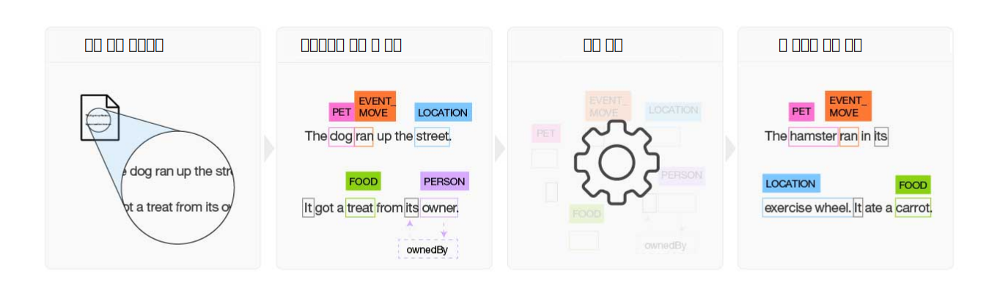

---

copyright:
  years: 2015, 2018
lastupdated: "2018-07-18"

---

{:shortdesc: .shortdesc}
{:new_window: target="_blank"}
{:tip: .tip}
{:pre: .pre}
{:codeblock: .codeblock}
{:screen: .screen}
{:javascript: .ph data-hd-programlang='javascript'}
{:java: .ph data-hd-programlang='java'}
{:python: .ph data-hd-programlang='python'}
{:swift: .ph data-hd-programlang='swift'}

이 문서는 {{site.data.keyword.knowledgestudiofull}} on {{site.data.keyword.cloud}}에 대한 문서입니다. 이전 {{site.data.keyword.knowledgestudioshort}} on {{site.data.keyword.IBM_notm}} Marketplace 버전에 대한 문서를 보려면 [이 링크를 클릭 ](https://{DomainName}/docs/services/knowledge-studio/index.html){: new_window}하십시오.
{: tip}

# 정보
{: #wks_overview_full}

{{site.data.keyword.knowledgestudiofull}}를 사용하여 사용자 업계에 고유한 언어적 뉘앙스, 의미 및 관계를 이해하는 기계 학습 모델을 작성하거나, 정의하는 규칙을 기반으로 문서에서 엔티티를 찾는 규칙 기반 모델을 작성하십시오.
{: shortdesc}

{{site.data.keyword.watson}}이 특정 업계 또는 도메인의 주제 관련 전문가가 되기 위해서는 훈련을 거쳐야 합니다. {{site.data.keyword.knowledgestudioshort}}를 사용하여 {{site.data.keyword.watson}}의 훈련 작업을 용이하게 할 수 있습니다.

## 기계 학습 모델 빌드

{{site.data.keyword.knowledgestudioshort}}는 구조화되지 않은 도메인 문서에 어노테이션을 작성하는 사용하기 쉬운 도구를 제공하며, 이러한 어노테이션을 사용하여 도메인의 용어를 이해하는 사용자 정의 기계 학습 모델을 작성합니다. 모델의 정확도는 반복 테스트를 통해 개선되며, 궁극적으로는 대규모 새 문서 콜렉션에서 인식되는 패턴으로부터 학습을 수행할 수 있는 알고리즘이 만들어집니다. 사용자는 완성된 기계 학습 모델을 기타 {{site.data.keyword.watson}} 클라우드 기반 오퍼링 및 코그너티브 솔루션에 배치하여 엔티티 상호 참조를 포함, 관계 및 엔티티에 대한 멘션을 찾고 추출할 수 있습니다.

 그림 1. 기계 학습 모델의 빌드 프로세스 개요

1. 팀은 도메인 고유 소스 문서 세트를 기반으로, 모델을 사용할 애플리케이션과 관련된 정보에 대한 엔티티 유형 및 관계 유형을 정의하는 유형 시스템을 작성합니다.
1. 둘 이상의 사람 어노테이터로 이뤄진 그룹이 엔티티 유형을 나타내는 단어에 레이블을 지정하고, 엔티티 멘션 간의 관계를 식별하는 텍스트에서 관계 유형을 식별하고, 동일한 엔티티를 가리키는 여러 멘션을 식별하는 상호 참조를 정의하기 위해 소규모 소스 문서 세트에 어노테이션을 작성합니다. 어노테이션의 불일치는 모두 해결되며 기준 실제값을 형성하는, 하나의 최적으로 어노테이션 작성된 문서 세트가 빌드됩니다.
1. {{site.data.keyword.knowledgestudioshort}}는 기준 실제값을 사용하여 모델을 훈련시킵니다.
1. 훈련된 모델은 새로운 문서의 엔티티, 관계 및 상호 참조를 찾는 데 사용됩니다.

세부사항은 [기계 학습 모델 작성](/docs/services/watson-knowledge-studio/ml-annotator.html)을 참조하십시오.

## 규칙 기반 모델 빌드

{{site.data.keyword.knowledgestudioshort}}에서는 규칙으로서 문서 내의 공통 패턴을 찾고 캡처하는 프로세스를 간소화하는 규칙 편집기를 제공합니다. 사용자는 규칙 패턴을 인식하는 모델을 작성하고, 이를 다른 서비스에서 사용할 수 있도록 배치할 수 있습니다.

세부사항은 [규칙 기반 모델 작성](/docs/services/watson-knowledge-studio/rule-annotator.html)을 참조하십시오.

## Watson 서비스 통합
{: #wks_watsoninteg}

{{site.data.keyword.knowledgestudiofull}}와 기타 {{site.data.keyword.watson}} 서비스 간에 도메인 아티팩트 및 모델을 공유하십시오.

{{site.data.keyword.knowledgestudioshort}}를 사용하여 다음 태스크를 수행하십시오.

- {{site.data.keyword.nlushort}} 서비스를 사용하여 어노테이션 작성을 부트스트랩함으로써 자동으로 문서 내의 엔티티를 찾고 어노테이션을 작성하십시오. 사람 어노테이터는 문서에 어노테이션 작성 작업을 시작할 때, 서비스에 의해 이미 작성된 어노테이션을 보고 이를 검토하거나 여기에 내용을 추가할 수 있습니다. 세부사항은 [{{site.data.keyword.nlushort}}을 사용하여 문서에 어노테이션 미리 작성 수행](/docs/services/watson-knowledge-studio/preannotation.html#wks_preannotnlu)을 참조하십시오.
- [UIMA CAS XMI 형식](/docs/services/watson-knowledge-studio/preannotation.html#wks_uimaweximport)으로 된 분석된 문서를 업로드하십시오. 예를 들면, {{site.data.keyword.IBM_notm}} {{site.data.keyword.watson}} Explorer Content Analytics 콜렉션 또는 [{{site.data.keyword.IBM_notm}} {{site.data.keyword.watson}} Explorer Content Analytics Studio](/docs/services/watson-knowledge-studio/preannotation.html#wks_uimawexstudio)에서 내보낸 CAS XMI 파일을 업로드할 수 있습니다.
- {{site.data.keyword.watson}} {{site.data.keyword.discoveryshort}} 서비스와 함께 사용할 [기계 학습](/docs/services/watson-knowledge-studio/publish-ml.html#wks_madiscovery) 또는 [규칙 기반](/docs/services/watson-knowledge-studio/rule-annotator-model-use.html#wks_rule_discovery) 모델을 배치하십시오.
- {{site.data.keyword.nlushort}} 서비스와 함께 사용할 [기계 학습](/docs/services/watson-knowledge-studio/publish-ml.html#wks_manlu) 또는 [규칙 기반](/docs/services/watson-knowledge-studio/rule-annotator-model-use.html#wks_rule_nlu) 모델을 배치하십시오.
- {{site.data.keyword.IBM_notm}} {{site.data.keyword.watson}} Explorer에서 사용할 [기계 학습 모델을 내보내십시오](/docs/services/watson-knowledge-studio/publish-ml.html#wks_maexport).
- {{site.data.keyword.IBM_notm}} {{site.data.keyword.watson}} Explorer에서 사용할 [규칙 기반 모델 PEAR 파일을 내보내십시오](/docs/services/watson-knowledge-studio/rule-annotator-model-use.html#wks_rule_export).
