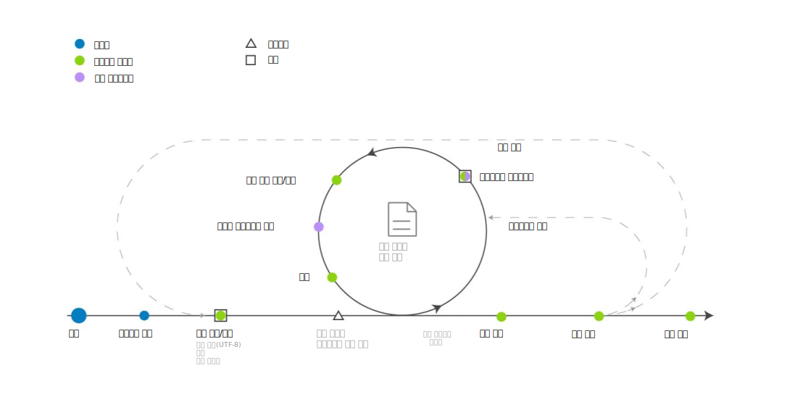

---

copyright:
  years: 2015, 2018
lastupdated: "2018-04-04"

---

{:shortdesc: .shortdesc}
{:new_window: target="_blank"}
{:tip: .tip}
{:pre: .pre}
{:codeblock: .codeblock}
{:screen: .screen}
{:javascript: .ph data-hd-programlang='javascript'}
{:java: .ph data-hd-programlang='java'}
{:python: .ph data-hd-programlang='python'}
{:swift: .ph data-hd-programlang='swift'}

이 문서는 {{site.data.keyword.knowledgestudiofull}} on {{site.data.keyword.cloud}}에 대한 문서입니다. 이전 {{site.data.keyword.knowledgestudioshort}} on {{site.data.keyword.IBM_notm}} Marketplace 버전에 대한 문서를 보려면 [이 링크 를 클릭하십시오](https://console.bluemix.net/docs/services/knowledge-studio/ml-annotator.html){: new_window}.
{: tip}

# 기계 학습 모델 작성 워크플로우
{: #ml_annotator}

새 문서에서 관련 엔티티, 상호 참조 및 관계를 식별하는 데 사용할 수 있는 모델을 훈련시키는 기계 학습 모델을 작성하십시오.
{: shortdesc}

{{site.data.keyword.knowledgestudioshort}}에서의 일반적인 기계 학습 모델 작성 워크플로우를 이해하십시오. 

사람 어노테이터가 수행하는 *문서에 어노테이션 작성* 단계를 제외한 모든 단계는 프로젝트 관리자가 수행합니다. 사람 어노테이터는 일반적으로 주제 관련 전문가이므로, 유형 시스템과 같은 작업공간 리소스의 작성 중에 이들의 의견을 참고할 수도 있습니다. 

 그림 1. 기계 학습 모델 개발의 워크플로우

<table cellpadding="4" cellspacing="0" summary="모델 작성 및 정제" border="1" class="simpletable"><tr class="sthead"><th valign="bottom" align="left" id="d14771e70" class="stentry thleft thbot">단계</th>
<th valign="bottom" align="left" id="d14771e72" class="stentry thleft thbot">설명</th>
</tr>
<tr class="strow"><td valign="top" headers="d14771e70" class="stentry">
작업공간 작성
</td>
<td valign="top" headers="d14771e72" class="stentry">
[작업공간 작성](/docs/services/watson-knowledge-studio/create-project.html)을 참조하십시오. 작업공간은 모델을 작성하는 데 사용되는
리소스를 포함하며, 여기에는 다음 항목이 포함됩니다. 
<dl class="dl"><dt class="dt dlterm">유형 시스템</dt>
<dd class="dd">
유형 시스템을 작성하거나 업로드하고, 사람 어노테이터가 텍스트에 어노테이션을 작성할 때 적용할 수 있는 엔티티 유형 및 관계 유형을
정의하십시오. 모델 프로세스 관리자는 일반적으로 도메인의 주제 관련 전문가와
협력하여 유형 시스템을 정의합니다. [유형 시스템 설정](/docs/services/watson-knowledge-studio/typesystem.html)을 참조하십시오. 
</dd>
<dt class="dt dlterm">소스 문서</dt>
<dd class="dd">
도메인 컨텐츠를 잘 나타내는 샘플 문서를 작업공간에 업로드하여
말뭉치를 작성하십시오. [어노테이션 작성을 위한 문서 추가](/docs/services/watson-knowledge-studio/document-for-annotation.html)를 참조하십시오. 말뭉치를
문서 세트로 분할하고, 모든 문서 세트 간에 공유되는 문서의 백분율을 지정하고, 문서 세트를 사람 어노테이터에게
지정하십시오. [어노테이션 세트 작성 및 지정](/docs/services/watson-knowledge-studio/documents-for-annotation.html#wks_projdocsets)을 참조하십시오. 
</dd>
<dt class="dt dlterm">사전</dt>
<dd class="dd">
텍스트에 어노테이션을 작성하는 데 필요한 사전을 작성하거나 업로드하십시오. 사전 항목을 수동으로 추가하거나
파일로부터 항목을 업로드하도록 선택한 후 항목을 편집할 수 있습니다. [사전 작성](/docs/services/watson-knowledge-studio/dictionaries.html)을 참조하십시오. 
</dd>
</dl>
</td>
</tr>
<tr class="strow"><td valign="top" headers="d14771e70" class="stentry">
<strong class="ph b">선택사항</strong>: 문서에 어노테이션 미리 작성 수행
</td>
<td valign="top" headers="d14771e72" class="stentry">
작업공간 사전의 용어, {{site.data.keyword.nlushort}} 유형의 멘션, 또는 정의하는 규칙에 따라
문서에 어노테이션 미리 작성을 수행하십시오. [어노테이션 작성 부트스트래핑](/docs/services/watson-knowledge-studio/preannotation.html#wks_preannotate)을 참조하십시오. 
</td>
</tr>
<tr class="strow"><td valign="top" headers="d14771e70" class="stentry">
문서에 어노테이션 작성
</td>
<td valign="top" headers="d14771e72" class="stentry"><ol class="ol"><li class="li">
프로젝트 관리자가 사람 어노테이터에게 태스크를 지정하고,
어노테이터 간 일치 임계값을 구성하고, 사람 어노테이터가 따라야 하는 어노테이션 가이드라인을 제공합니다. 
[어노테이션 작성 태스크 작성](/docs/services/watson-knowledge-studio/annotate-documents.html#wks_hatask)을 참조하십시오. 
</li>
<li class="li">
사람 어노테이터는 기준 실제값 편집기를 사용하여 수동으로
문서에 어노테이션을 작성합니다. 이들은 도메인 컨텐츠에서 관련 멘션을 식별하고
엔티티 유형을 사용하여 여기에 레이블을 지정합니다. 또한 멘션 간의
관계를 식별하고(예: Mary는 IBM의 직원임) 여러 멘션이 어떻게 동일한 엔티티를
상호 참조하는지(Mary를 가리키는 "she"와 같이) 식별합니다. [문서에 어노테이션 작성](/docs/services/watson-knowledge-studio/user-guide.html)을 참조하십시오. 
</li>
</ol>
</td>
</tr>
<tr class="strow"><td valign="top" headers="d14771e70" class="stentry">
문서 판정 및 승격
</td>
<td valign="top" headers="d14771e72" class="stentry">
사람 어노테이터가 생성한 기준 실제값을 승인하거나 거부하고,
어노테이션 차이를 판정하여 충돌을 해결하십시오. 사람에 의한 어노테이션 작성 작업의
정확도 및 일관성 평가는 경험이 많은 사람 어노테이터 또는 프로젝트 관리자보다
주제 관련 경험이 풍부한 사용자가 수행해야 합니다. [판정](/docs/services/watson-knowledge-studio/build-groundtruth.html#wks_haperform)을 참조하십시오. 
</td>
</tr>
<tr class="strow"><td valign="top" headers="d14771e70" class="stentry">
모델 훈련
</td>
<td valign="top" headers="d14771e72" class="stentry">
기계 학습 모델을 작성하십시오. [기계 학습 모델 작성](/docs/services/watson-knowledge-studio/train-ml.html#wks_madocsets)을 참조하십시오. 
</td>
</tr>
<tr class="strow"><td valign="top" headers="d14771e70" class="stentry">
모델 평가
</td>
<td valign="top" headers="d14771e72" class="stentry">
모델의 정확도를 평가하십시오. [모델이 추가한 어노테이션의 평가](/docs/services/watson-knowledge-studio/train-ml.html#wks_matest)를 참조하십시오. 모델 정확도에 따라,
이 단계에서는 최적의 정확도를 달성할 때까지 이전 단계를 반복할 수 있습니다. 일반적인 성능 문제에 따라 어떤 항목을 업데이트해야 하는지는 [기계 학습 모델 성능 분석](/docs/services/watson-knowledge-studio/evaluate-ml.html)을
참조하십시오. 
</td>
</tr>
<tr class="strow"><td valign="top" headers="d14771e70" class="stentry">
모델 공개
</td>
<td valign="top" headers="d14771e72" class="stentry">
모델을 내보내거나 배치하십시오. [기계 학습 모델 사용](/docs/services/watson-knowledge-studio/publish-ml.html)을 참조하십시오. 
</td>
</tr>
</table>
