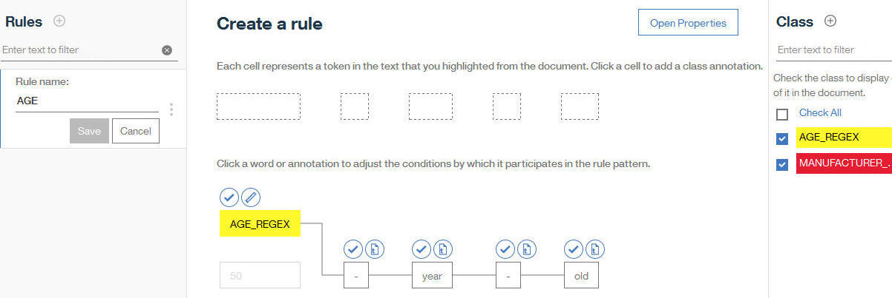
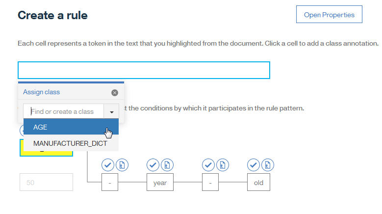

---

copyright:
  years: 2015, 2018
lastupdated: "2018-07-19"

---

{:shortdesc: .shortdesc}
{:new_window: target="_blank"}
{:tip: .tip}
{:pre: .pre}
{:codeblock: .codeblock}
{:screen: .screen}
{:javascript: .ph data-hd-programlang='javascript'}
{:java: .ph data-hd-programlang='java'}
{:python: .ph data-hd-programlang='python'}
{:swift: .ph data-hd-programlang='swift'}

이 문서는 {{site.data.keyword.knowledgestudiofull}} on {{site.data.keyword.cloud}}에 대한 문서입니다. 이전 {{site.data.keyword.knowledgestudioshort}} on {{site.data.keyword.IBM_notm}} Marketplace 버전에 대한 문서를 보려면 [이 링크를 클릭 ](https://console.bluemix.net/docs/services/knowledge-studio/rule-annotator-define-rule.html){: new_window}하십시오.
{: tip}

# 규칙 정의
{: #wks_rule_creation}

규칙 편집기를 사용하여 규칙을 정의하십시오.
{: shortdesc}

## 이 태스크에 대한 정보

예기치 않은 겹쳐쓰기 또는 중복이 발생할 수 있으므로 여러 사용자가 규칙, 클래스 및 정규식을 동시에 편집하지 않도록 하십시오.

## 프로시저

규칙을 정의하려면 다음 단계를 완료하십시오.

1. {{site.data.keyword.knowledgestudioshort}} 관리자 또는 프로젝트 관리자로 로그인하고 **Rule-based Model** > **Rules**를 클릭하십시오. 
1. 문서 표제 옆의 더하기 부호(+)를 클릭하여 문서를 추가하십시오. 

    자세한 정보는 [규칙 정의를 위한 문서 추가](/docs/services/watson-knowledge-studio/rule-annotator-add-doc.html)를 참조하십시오. 

    예를 들면, 다음과 같은 하나의 텍스트 행을 포함하는 `My Document`라는 문서를 추가할 수 있습니다.

    ```
    A 50-year-old driver was driving the 2017 Example Horizon.
    ```
    {: screen}

1. 정규식을 정의하거나 사전을 추가하려는 경우에는 이와 연관시킬 클래스를 작성하십시오.

    1. **Class** 패널에서 클래스 옆에 있는 더하기 부호(+)를 클릭하십시오.
    1. 클래스 이름을 추가하십시오.

        클래스를 정규식 또는 사전과 연관시키는 경우에는 해당 클래스의 근원을 식별할 수 있도록 클래스 이름을 지정하는 것을 고려하십시오. 예를 들어, 예제 문장에서 나이에 대한 패턴을 정의하기 위해 정규식을 사용하려면 `AGE_REGEX`라는 이름의 클래스를 작성할 수 있습니다. 문장에서 차량 제조업체에 어노테이션을 작성하기 위해 사전을 사용하려면 `MANUFACTURER_DICT`라는 이름의 클래스를 추가할 수 있습니다. 

        다음과 같은 이름 지정 규칙을 기억하십시오.
        - 클래스 이름의 첫 번째 문자는 알파벳이어야 합니다.
        - 클래스에 추가하는 값에는 영숫자 ASCII 문자(`A` - `Z`, `a` - `z`, `0` - `9`) 및 밑줄 문자만 사용하십시오. 
        - 이름은 공백을 포함할 수 없습니다.
        - 이름은 64자를 초과할 수 없습니다.

1. 선택사항: 문서 내의 클래스에 빠르게 어노테이션을 작성하기 위해 사전을 규칙 편집기와 연관시킬 수 있습니다. 사전의 항목과 일치하는 문서의 용어에는 사전에 대해 선택하는 클래스를 사용하여 자동으로 어노테이션이 작성됩니다. 

    1. **Dictionaries** 탭을 클릭하십시오. 

        작성한 모든 사전이 표시됩니다.

        사전을 아직 추가하지 않은 경우에는 기본 탐색줄에서 **Assets** > **Dictionaries** 페이지를 열어서 사전을 추가하십시오. 자세한 정보는 [사전 작성](/docs/services/watson-knowledge-studio/dictionaries.html)을 참조하십시오.

    1. 사전을 클릭하고 클래스를 사전과 연관시킨 후에 **Save**를 클릭하십시오. 

        예를 들어, 조직 이름을 포함하는 사전이 있는 경우에는 `ORGANIZATION`라고 하는 규칙 클래스를 작성하고 클래스를 사전과 연관시킬 수 있습니다. 샘플 문서에 나타나는 조직 이름은 `ORGANIZATION` 클래스의 인스턴스로서 어노테이션 작성됩니다. 

    나중에 규칙 편집기에서 사전 연관을 제거하려는 경우에는 클래스 맵핑을 제거할 수 있습니다. 이를 수행하려면 드롭 다운 목록의 맨 위에 있는, 비어 있는 옵션을 선택하십시오.

2. 선택사항: 규칙을 생성하는 데 도움을 주는 정규식을 정의하려면 **Regex** 탭을 클릭하십시오. 

    1. 정규식 표제 옆의 더하기 부호(+)를 클릭하십시오. 
    2. 정규식의 이름을 지정하십시오. 예: `MyAgeRegex`.

        이 이름은 64자를 초과할 수 없습니다.

    3. 표현식을 클래스와 연관시키십시오. 예: `AGE_REGEX`.
    4. **Add Entry**를 클릭하십시오.
    5. 표현식을 추가하십시오.

        예를 들어, 나이를 나타내는 숫자(최대 99세)를 캡처하려는 경우에는 `[0-9]{1,2}`를 지정할 수 있습니다. *12:30 AM*과 같은 시간 표현을 캡처하려는 경우에는 다음 정규식을 지정할 수 있습니다.

        ```
        (1[0-2]|0?[1-9]):([0-5][0-9])(\s+[AaPp][Mm])?
        ```
        {: screen}

        선택적으로 최소 및 최대 단어 토큰 수를 변경할 수 있습니다. 영어의 경우 토큰은 보통 문장에서 공백으로 구분된 단어와 동일시됩니다. 그러나 이는 항상 단어와 일대일로 일치하지는 않습니다. 기타 텍스트 요소가 일부 상황에서 고려되는 토큰입니다. 예를 들어, 용어 *50-year-old*의 하이픈은 각각 토큰으로 간주되며, 이는 이 단어에서 사용된 총 토큰 수가 5개임을 의미합니다. 텍스트 *12:30 PM*은 4개의 토큰을 포함하고 있습니다. (`12 | : | 30 | PM`)

        **Add**를 클릭하십시오.

    6. 더 많은 표현식을 추가하려는 경우에는 이전 두 단계를 반복하십시오.
    7. **Save**를 클릭하십시오.

    정규식 편집기가 닫히고 문서가 표시됩니다. 정규식에 대해 정의한 클래스가 일치시키려는 텍스트에 적용된 것을 볼 수 있습니다. 어노테이션이 나타나지 않으면 표현식을 확인하십시오. 표현식이 찾아야 하는 텍스트와 일치하도록 이를 수정해야 할 수 있습니다.

    

3. 규칙을 정의하려면 탐색에서 **Rules**를 클릭하십시오.
4. 규칙으로 캡처할 패턴을 포함하는 문서를 여십시오. 예를 들어, 구문 `50-year-old`를 포함하는 샘플 텍스트가 있는 `My Document`라는 문서를 작성한 경우에는 이 문서를 여십시오.
5. 문서 내의 텍스트에서, 캡처할 패턴을 나타내는 문자를 선택하십시오. 예를 들면, 다음 단어 및 하이픈(-)을 선택할 수 있습니다.

    ```
    50-year-old
    ```
    {: screen}

    문자를 선택한 후에는 규칙을 추가할 수 있습니다.

6. **Rules** 패널에 있는 더하기 부호(+)를 클릭하십시오.

    규칙 편집기가 선택한 텍스트를 두 계층의 셀로 표시합니다. 위 계층의 셀에서는 기본 토큰의 클래스에 어노테이션을 작성합니다. 아래 계층에서는 토큰이 패턴에 속하는 조건을 정의합니다.

    

7. 각 토큰이 패턴에 속하는 조건을 정의하십시오.

    셀의 아래 계층에서 조건을 검토할 첫 번째 토큰을 클릭하십시오. 패턴의 현재 위치에 임의의 토큰을 사용할 수 있음을 표시하려는 경우에는 **Open Properties**를 클릭하고 **Allow any token**을 선택하십시오. **Close Properties**를 클릭하십시오. 토큰이 예에 포함된 `AGE_REGEX`와 같은 정규식인 경우에는 **Allow any token**을 사용할 수 없습니다.

    > **참고:** 각 셀의 반복 설정이 1 이하인 경우에는 하나의 패턴에 속할 수 있는 최대 그룹 셀 수가 15개입니다. 그룹 셀은 단일 토큰, 어노테이션 또는 임의의 토큰에 허용되는 토큰을 포함합니다. 하나의 패턴에 허용되는 최대 총 토큰 수는 20개입니다. 패턴을 정의할 때는 각 셀의 반복 설정을 고려하십시오. 예를 들면, 각 셀의 반복 설정이 1 이하인 경우에는 15개 토큰을 포함하는 패턴을 정의할 수 있습니다. 그러나 각 토큰의 반복 설정이 1 이상인 경우에는 토큰이 최대 5회 반복될 수 있으므로 패턴에 4개보다 많은 토큰을 정의할 수 없습니다. 4개 토큰이 5회 반복되면 허용된 최대값인 20개에 도달합니다.

    특정 유형의 토큰이 필수임을 표시하기 위해 다음 유형의 조건 설정을 정의할 수 있습니다.
    - **반복 설정**: 패턴에 현재 토큰을 몇 번 포함시켜야 하는지 지정합니다. 반복 설정은 변경할 수 있으나, 토큰당 하나의 반복 설정만 지정할 수 있습니다. 옵션은 다음 표에 설명되어 있습니다.

    <table summary="">
      <caption>표 1. 반복 설정</caption>
      <tr>
        <th style="vertical-align:bottom; text-align:left" id="d27028e471">
          설정 옵션
        </th>
        <th style="vertical-align:bottom; text-align:left" id="d27028e473">
설명
        </th>
      </tr>
      <tr>
        <td headers="d27028e471">
          <p>Required (Exactly 1)</p>
        </td>
        <td headers="d27028e473">
          <p>이 토큰은 패턴에 1회만 존재해야
            합니다. 이 옵션은 기본적으로 적용되지만 변경할 수
            있습니다.</p>
        </td>
      </tr>
      <tr>
        <td headers="d27028e471">
          <p>Repeating 1 or more times</p>
        </td>
        <td headers="d27028e473">
          <p>이 토큰은 패턴에 1회 이상 존재해야 하며,
            추가로 반복될 수 있습니다.</p>
        </td>
      </tr>
      <tr>
        <td headers="d27028e471">
          <p>Repeating 0 or more times</p>
        </td>
        <td headers="d27028e473">
          <p>이 토큰은 패턴에서 선택적으로 반복될 수 있으나,
            반드시 반복해야 하는 것은 아닙니다.</p>
        </td>
      </tr>
      <tr>
        <td headers="d27028e471">
          <p>Occurring 0 or 1 time</p>
        </td>
        <td headers="d27028e473">
          <p>이 토큰은 선택사항입니다.</p>
        </td>
      </tr>
      <tr>
        <td headers="d27028e471">
          <p>Advanced: _사용자 정의_</p>
        </td>
        <td headers="d27028e473">
          <p>이 토큰은 여기에 지정된 횟수만큼
            패턴에서 반복되어야 합니다. 사용자 정의
            반복 설정을 정의하려면
            <b>Open Properties</b>를 클릭하고
            **Advanced**을 선택한 후 정의할 정확한 반복 횟수 또는 반복 횟수 범위를 선택하십시오.</p>
          <p>
            토큰에 허용되는 최대 반복 횟수는
            5회입니다.</p>
        </td>
      </tr>
    </table>

    - **특성 설정**: 하나 이상의 특성 설정을 정의해야 합니다. 텍스트가 이 패턴과 일치하기 위해 만족시켜야 하는 조건에 특성을 추가할 수 있습니다. 옵션은 다음 표에 설명되어 있습니다.

    <table summary="">
      <caption>표 2. 기능 설정</caption>
      <tr>
        <th style="vertical-align:bottom; text-align:left" id="d27028e512">
          설정 옵션
        </th>
        <th style="vertical-align:bottom; text-align:left" id="d27028e514">
추가 조건
        </th>
      </tr>
      <tr>
        <td headers="d27028e512">
          <p>Text</p>
        </td>
        <td headers="d27028e514">
          <p>이 토큰의 텍스트와 정확히 일치해야
            합니다. 이 옵션은 기본적으로 적용됩니다. 이 옵션은 다른 설정을
            조건으로 추가하거나 임의의 토큰 설정을 적용하는 경우에만
            제거할 수 있습니다.</p>
        </td>
      </tr>
      <tr>
        <td headers="d27028e512">
          <p>Length</p>
        </td>
        <td headers="d27028e514">
          <p>이 토큰의 문자 길이와 일치해야
            합니다. 길이는 첫 번째 문자의 앞에서부터 시작하여
            0부터 계산됩니다.</p>
        </td>
      </tr>
    </table>

    나머지 옵션은 토큰의 유형에 따라 달라집니다.

    - **정규식 또는 사전 용어와 일치하지 않는, 어노테이션 작성되지 않은 토큰**: 다음 설정은 정규식 또는 사전 용어와 일치하지 않는, 어노테이션 작성되지 않은 토큰에 대해 사용 가능합니다.

    <table summary="">
      <caption>표 3. 어노테이션이 없는 토큰 설정</caption>
      <tr>
        <th style="vertical-align:bottom; text-align:left" id="d27028e535">설정 옵션 </th>
        <th style="vertical-align:bottom; text-align:left" id="d27028e537">설명</th>
      </tr>
      <tr>
        <td headers="d27028e535">
          <p>Part of speech</p>
        </td>
        <td headers="d27028e537">
          <p>이 토큰의 품사와 품사가
            동일해야 합니다. 다음 유형이 지원됩니다.</p>
          <ul>
            <li>
adjective(형용사)
            </li>
            <li>
adposition(전치사)
            </li>
            <li>
adverb(부사)
            </li>
            <li>
conjunction(접속사)
            </li>
            <li>
determiner(한정사)
            </li>
            <li>
interjection(감탄사)
            </li>
            <li>
noun(명사)
            </li>
            <li>
numeral(수사)
            </li>
            <li>
pronoun(대명사)
            </li>
            <li>
residual(기타 항목)
            </li>
            <li>
verb(동사)
            </li>
          </ul>
        </td>
      </tr>
      <tr>
        <td headers="d27028e535">
          <p>Lemma</p>
        </td>
        <td headers="d27028e537">
          <p>이 토큰과 표제어가 동일해야
            합니다.</p>
        </td>
      </tr>
      <tr>
        <td headers="d27028e535">
          <p>Character Type</p>
        </td>
        <td headers="d27028e537">
          <p>이 토큰과 문자 유형이 동일해야
            합니다. 다음 유형이 지원됩니다.</p>
          <ul>
            <li>
              <p>Arabic: 아랍어 문자 시퀀스를
                포함함</p>
            </li>
            <li>
              <p>ChineseNumeral: 중국어 숫자만을
                포함함</p>
            </li>
            <li>
              <p>ClauseEndingPunctuation:
                하나의 절 또는 문장을 다음 절 또는 문장과 구분하는
                구두점 문자</p>
            </li>
            <li>
              <p>Han: 한자를 포함함</p>
            </li>
            <li>
              <p>Hangul: 한국어 한글
                음절 문자를 포함함</p>
            </li>
            <li>
              <p>Hebrew: 히브리 문자를
                포함함</p>
            </li>
            <li>
              <p>Hiragana: 일본어 히라가나
                음절 문자를 포함함</p>
            </li>
            <li>
              <p>Ideographic: 표의 문자,
                또는 사상이나 사물을 나타내는 기호를
                포함함</p>
            </li>
            <li>
              <p>Katakana: 일본어 가타카나
                음절 문자를 포함함</p>
            </li>
            <li>
              <p>Lowercase: 알파벳 소문자만
                포함함</p>
            </li>
            <li>
              <p>Numeric: 숫자만
                포함함</p>
            </li>
            <li>
              <p>Punctuation: 텍스트에
                구두점을 제공하는 하나 이상의
                문자</p>
            </li>
            <li>
              <p>Syllabic: 음절 문자를
                포함함</p>
            </li>
            <li>
              <p>Thai: 타이 문자를
                포함함</p>
            </li>
            <li>
              <p>Titlecase: 하나의 알파벳 대문자로
                시작하고, 하나 이상의 알파벳 소문자가
                뒤따름</p>
            </li>
            <li>
              <p>Uppercase: 알파벳 대문자만
                포함하는 토큰</p>
            </li>
          </ul>
        </td>
      </tr>
    </table>

    - **규칙 일치:**

    <table summary="">
      <caption>표 4. 규칙 일치</caption>
      <tr>
        <th style="vertical-align:bottom; text-align:left" id="d27028e617">
설정 옵션 </th>
        <th style="vertical-align:bottom; text-align:left" id="d27028e619">
설명</th>
      </tr>
      <tr>
        <td headers="d27028e617">
          <p>Rule Match</p>
        </td>
        <td headers="d27028e619">
          <p>이름 지정된 클래스와 일치해야 합니다. 클래스는 정규식, 사전 또는 규칙으로부터 파생될 수
            있다는 점을 기억하십시오. 예를 들어, 여기에 지정된
            클래스가 정규식으로부터 파생된 경우
            이 토큰은 표현식의 검색 패턴과
            일치해야 합니다.</p>
        </td>
      </tr>
    </table>

8. 사전 어노테이션 또는 정규식 일치로부터 간접적으로 추가된 어노테이션이 있는 토큰의 경우에는 패턴이 동일한 어노테이션 유형의 단어를 필요로 하는지, 또는 어노테이션 작성된 실제 기본 단어를 필요로 하는지 선택할 수 있습니다.

    아래 셀 계층에서는 가로 선이 셀을 서로 연결하므로 패턴에 어느 셀이 포함되어 있는지 볼 수 있습니다. 어노테이션이 적용된 부분은 분할되어 있습니다. 원본 단어가 있는 셀은 어노테이션 레이블이 지정된 셀 아래에 표시됩니다. 한 쪽 또는 다른 쪽 셀 세트를 클릭하여 행의 경로를 변경함으로써 패턴에 포함된 셀을 변경할 수 있습니다.

    예를 들면, 패턴을 나이 정규식과 일치시키는 대신 50을 사용하도록 선택할 수 있습니다.

    

9. 패턴 색상을 설정하고 나면 텍스트 내의 토큰에 어노테이션을 작성할 수 있습니다.

    위 셀 계층에서 어노테이션을 작성할 토큰을 나타내는 셀을 클릭한 후 여기에 클래스 레이블을 적용하십시오. 여러 셀을 선택하려면 하나를 클릭하고 **Shift** 키를 누른 후 추가 셀을 클릭하십시오.

    클래스를 선택한 셀에 지정하십시오. 지정하려는 클래스가 없는 경우에는 이를 추가할 수 있습니다. **Assign class** 필드에 클래스 이름을 입력하고 **Enter**를 누르십시오.

    > **참고:** 규칙에 대해 10개보다 많은 클래스는 추가할 수 없습니다.

    

10. 규칙의 이름을 지정하십시오.

    규칙 이름은 64자를 초과할 수 없습니다.

11. 규칙 패널에서 **Save**를 클릭하여 규칙을 저장하십시오.
