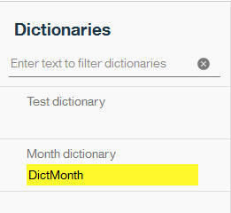
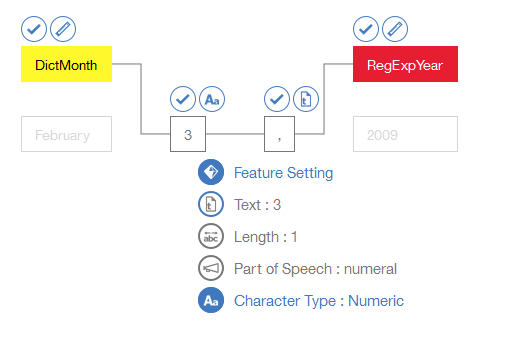

---

copyright:
  years: 2015, 2018
lastupdated: "2018-07-17"

---

{:shortdesc: .shortdesc}
{:new_window: target="_blank"}
{:tip: .tip}
{:pre: .pre}
{:codeblock: .codeblock}
{:screen: .screen}
{:javascript: .ph data-hd-programlang='javascript'}
{:java: .ph data-hd-programlang='java'}
{:python: .ph data-hd-programlang='python'}
{:swift: .ph data-hd-programlang='swift'}

이 문서는 {{site.data.keyword.knowledgestudiofull}} on {{site.data.keyword.cloud}}에 대한 문서입니다. 이전 {{site.data.keyword.knowledgestudioshort}} on {{site.data.keyword.IBM_notm}} Marketplace 버전에 대한 문서를 보려면 [이 링크를 클릭 ](https://console.bluemix.net/docs/services/knowledge-studio/tutorials-create-rule-model.html){: new_window}하십시오.
{: tip}

# 규칙 기반 모델 작성
{: #wks_tutrule_intro}

이 튜토리얼은 문서에서 정의된 텍스트 패턴을 찾는 데 사용할 수 있는 규칙 기반 모델을 작성하는 방법을 이해하는 데 도움을 줍니다.
{: shortdesc}

사용자는 문서에서 패턴 `month day, year`와 일치하는 텍스트를 찾는 모델을 빌드합니다. 예를 들면, 이 모델은 날짜 참조 *May 1, 2010*을 찾습니다. 사용자는 규칙 패턴 자체를 정의하기 전에 먼저 텍스트의 월 멘션을 인식하는 사전 클래스 및 연도 멘션을 인식하는 정규식 클래스를 비롯한, 패턴을 빌드하는 데 도움을 주는 아티팩트를 작성합니다.

## 학습 목표
{: #objectives}

이 튜토리얼을 완료하고 나면 다음 태스크를 수행하는 방법을 알게 됩니다.

- 클래스 작성
- 규칙 정의를 위한 문서 추가
- 사전과 클래스의 연관
- 문자 시퀀스 캡처를 위한 정규식 정의
- 규칙 정의

이 튜토리얼을 완료하는 데는 약 30분이 소요됩니다. 이 튜토리얼과 관련된 기타 개념을 탐색하는 경우에는 완료하는 데 시간이 더 소요될 수 있습니다.

## 시작하기 전에
{: #prereqs}

- 지원되는 브라우저를 사용하고 있는지 확인하십시오. 자세한 정보는 [브라우저 요구사항](/docs/services/watson-knowledge-studio/system-requirements.html)을 참조하십시오.
- 작업공간 작성, 유형 시스템 작성 및 사전 추가를 다루는 [{{site.data.keyword.knowledgestudioshort}} 시작하기](/docs/services/watson-knowledge-studio/tutorials-create-project.html)를 성공적으로 완료했습니다. 
- Admin 또는 프로젝트 관리자 역할의 사용자 ID가 하나 이상 있어야 합니다. 사용자 역할에 대한 정보는 [{{site.data.keyword.knowledgestudioshort}}의 사용자 역할](/docs/services/watson-knowledge-studio/roles.html)을 참조하십시오. 

## 결과
{: #results}

규칙 기반 모델을 작성하고 나면 이를 다음 방식 중 하나로 사용하여 문서 내의 텍스트 패턴을 찾을 수 있습니다.

- 기계 학습 모델을 작성하기 전에 [문서에 어노테이션 미리 작성 수행](/docs/services/watson-knowledge-studio/preannotation.html#wks_preannotrule)
- 기타 {{site.data.keyword.watson}} 서비스 또는 제품에 [모델 배치 또는 내보내기](/docs/services/watson-knowledge-studio/rule-annotator-model-use.html)

## 학습 1: 월에 대한 사전 추가
{: #wks_tutless_rule1}

이 학습에서는 {{site.data.keyword.knowledgestudioshort}}에서 작업공간에 사전을 추가하는 방법을 학습합니다. 이 사전은 한 해의 월과 관련된 용어를 포함합니다.

### 이 태스크에 대한 정보
{: #wks_tutless_rule1_about}

이후 단계의 학습에서 이 사전을 기반으로 클래스를 정의하게 됩니다. 이 클래스를 작성하면 문서에서 찾는 이 사전의 모든 용어가 연관된 클래스 유형의 멘션으로 자동으로 어노테이션 작성됩니다. 사전에 대한 자세한 정보는 [작업공간에 사전 추가](/docs/services/watson-knowledge-studio/dictionaries.html#wks_projdictionaries)를 참조하십시오.

### 프로시저
{: #wks_tutless_rule1_procedure}

1. <a target="_blank" href="https://watson-developer-cloud.github.io/doc-tutorial-downloads/knowledge-studio/dictionary-items-month.csv" download>`dictionary-items-month.csv` </a> 파일을 컴퓨터에 다운로드하십시오. 이 파일에는 {{site.data.keyword.knowledgestudioshort}} 사전에 업로드하는 데 적합한, CSV 형식의 사전 용어가 포함되어 있습니다.
2. **Assets** > **Dictionaries**를 클릭하십시오. 
3. **Create Dictionary** 단추를 클릭하여 사전을 추가하십시오.
4. **Name** 필드에 `Month dictionary`를 입력하고 **Save**를 클릭하여 사전을 작성하십시오. 새 사전이 작성되며 자동으로 편집할 수 있도록 열립니다.
5. 사전 분할창에서 **Upload**를 클릭하십시오.
6. 컴퓨터에서 `dictionary-items-month.csv` 파일을 선택하고 **Upload**를 클릭하십시오. 

    파일의 용어를 사전으로 가져옵니다. 

## 학습 2: 샘플 문서 추가
{: #wks_tutless_rule2}

이 학습에서는 정의할 규칙의 유형을 나타내는 언어 패턴을 포함하는 문서를 추가하는 방법을 학습합니다.

### 이 태스크에 대한 정보
{: #wks_tutless_rule2_about}

문서 추가에 대한 자세한 정보는 [규칙 정의를 위한 문서 추가](/docs/services/watson-knowledge-studio/rule-annotator-add-doc.html)를 참조하십시오.

### 프로시저
{: #wks_tutless_rule2_procedure}

1. <a target="_blank" href="https://watson-developer-cloud.github.io/doc-tutorial-downloads/knowledge-studio/documents-new.csv" download>`documents-new.csv` </a> 파일을 컴퓨터에 다운로드하십시오. 이 파일에는 업로드하기에 적합한 문서 예가 포함되어 있습니다.
1. **Rule-based Model** > **Rules**를 클릭하십시오. 
1. **Documents** 페이지 표제 옆에 있는 **문서 추가** 아이콘을 클릭하십시오. 
1. **Upload CSV file** 탭을 클릭하십시오.
1. 클릭하여 이전에 컴퓨터에 다운로드한 `documents-new.csv` 파일을 찾은 후 **Upload**를 클릭하십시오.

    기본 Documents 페이지에 문서 세트가 표시됩니다.

    

## 학습 3: 클래스 작성
{: #wks_tutless_rule3}

이 학습에서는 규칙을 정의할 때 사용하는 클래스를 정의하는 방법을 학습합니다.

### 이 태스크에 대한 정보
{: #wks_tutless_rule3_about}

클래스에 대한 자세한 정보는 [규칙](/docs/services/watson-knowledge-studio/rule-annotator.html)을 참조하십시오.

### 프로시저
{: #wks_tutless_rule3_procedure}

1. 작업공간의 **Rules** 페이지에서, 오른쪽 패널의 **Class** 표제 옆의 **클래스 추가** 아이콘을 클릭하십시오. 
1. 클래스 이름으로 `DictMonth`를 입력한 후 **Add**를 클릭하십시오.

    새 클래스가 Class 사이드 패널에 표시됩니다.

## 학습 4: 사전과 클래스의 연관
{: #wks_tutless_rule4}

이 학습에서는 규칙 편집기에서 사전을 사용하는 방법을 학습합니다.

### 프로시저
{: #wks_tutless_rule4_procedure}

1. **Rule-based Model** > **Rules**를 클릭한 후에 **Dictionaries** 탭을 클릭하십시오. 
2. 이전에 작성한 **Month dictionary**를 선택하십시오. 
3. **Class** 목록에서 `DictMonth`를 선택한 후 **Save**를 클릭하십시오.

    클래스가 사전과 연관됩니다.

    

### 결과
{: #wks_tutless_rule4_results}

규칙 편집기와 연관된 문서의 경우, 사전의 용어에 대한 모든 참조는 `DictMonth` 클래스 멘션으로 어노테이션 작성됩니다. 다음 학습에서 이러한 참조에 어노테이션이 작성된 것을 볼 수 있습니다.

## 학습 5: 문서에서 클래스 어노테이션 찾기
{: #wks_tutless_rule5}

이 학습에서는 규칙 편집기 문서에서 클래스 어노테이션을 찾는 방법을 학습합니다.

### 프로시저
{: #wks_tutless_rule5_procedure}

1. **Rule-based Model** > **Rules**를 선택하십시오. 
2. Class 패널에서 이전에 정의한 `DictMonth` 클래스를 찾고 그 옆에 있는 **문서에서 어노테이션 검색** 아이콘을 클릭하십시오.

    Find Annotations 페이지가 표시되며 월에 대한 모든 텍스트 참조를 포함하는 문서가 표시됩니다.

3. `Technology - computerworld.com` 문서를 클릭하여 전체 문서를 보십시오. 텍스트 `February`가 강조표시된 것을 볼 수 있으며, 이는 이것이 `DictMonth` 클래스의 멘션으로 어노테이션 작성되었음을 의미합니다.

## 학습 6: 정규식 정의
{: #wks_tutless_rule6}

이 학습에서는 정규식을 정의하는 방법을 학습합니다.

### 이 태스크에 대한 정보
{: #wks_tutless_rule6_about}

`2009`와 같은 연도 패턴을 찾는 정규식을 정의합니다.

정규식 정의에 대한 자세한 정보는 [규칙 정의](/docs/services/watson-knowledge-studio/rule-annotator-define-rule.html)를 참조하십시오.

### 프로시저
{: #wks_tutless_rule6_procedure}

1. **Rules** 페이지에서 오른쪽 사이드 패널의 **Class** 옆에 있는 **클래스 추가** 아이콘 을 클릭하십시오. 
1. 클래스 이름으로 `RegExpYear`를 입력하고 **Add**를 클릭하십시오.
1. **Regex** 탭을 클릭한 후에 **Regular Expressions** 표제 옆의 **정규식 작성** 아이콘을 클릭하십시오. 
1. **Add Entry**를 클릭하십시오.
1. **Regular Expression** 필드에 `1900` 및 `2099` 사이의 년도를 찾는 다음 표현식을 입력하십시오. 

    ```
    (?:(?:19|20)[0-9]{2})
    ```
    {: screen}

1. **Minimum Word Tokens**를 `1`로 설정하고 **Maximum Word Tokens**를 `1`로 설정하십시오.
1. **Add**를 클릭하여 정규식 항목을 저장하십시오.
1. `MyYearExp`를 정규식 이름으로 입력한 후 **Class** 메뉴에서 이전에 정의한 `RegExpYear` 클래스를 선택하십시오.
1. **Save**를 클릭하십시오.

    정규식을 저장하고 나면 이 정규식이 자동으로 샘플 문서에 적용됩니다. 정규식에 정의한 패턴을 따르는 모든 텍스트 문자열은 `RegExpYear` 클래스의 멘션으로 어노테이션 작성됩니다.

1. 정의한 표현식이 시간 발생을 올바르게 캡처하고 있는지 확인하려는 경우에는 멘션을 검색할 수 있습니다. Class 패널에서 `RegExpYear` 클래스 옆에 있는 **문서의 어노테이션 검색** 아이콘을 클릭하십시오. 

    

    Find Annotations 페이지가 표시됩니다. 연도 멘션이 발생한 샘플 문서에 해당 발생이 강조표시되어 있습니다.

    

## 학습 7: 규칙 정의
{: #unique_1166829415}

이 학습에서는 규칙을 정의하는 방법을 학습합니다.

### 이 태스크에 대한 정보
{: #unique_1166829415_about}

월 멘션에 어노테이션을 작성하기 위한 사전 기반 클래스는 이미 정의했습니다. 연도를 나타내는 숫자 값을 찾는 정규식 또한 정의했습니다. 이제는 월과 그 뒤의 숫자, 쉼표 및 연도로 구성된 시퀀스를 캡처하는 규칙을 정의합니다. 이는 *September 21, 2016*과 같은 날짜 표현에 대한 규칙을 정의합니다.

규칙 정의에 대한 자세한 정보는 [규칙 정의](/docs/services/watson-knowledge-studio/rule-annotator-define-rule.html)를 참조하십시오.

### 프로시저
{: #unique_1166829415_procedure}

1. **Rule-based Model** > **Rules**를 선택하고 `Technology - computerworld.com` 문서를 여십시오. 
1. 문서의 텍스트 `February 3, 2009`를 선택하십시오. 쉼표도 함께 선택해야 합니다.

    

2. **규칙 추가** 아이콘을 클릭하십시오.

    규칙 편집기는 식별한 규칙 패턴을 이미지로 보여줍니다.

    텍스트 `February 3, 2009`가 표시됩니다. 이미지에서 셀을 연결하는 실선은 현재 패턴의 일부인 셀을 식별합니다. 
    - `DictMonth` 클래스는 텍스트 `February`가 아니라 규칙 패턴의 일부입니다. 모델이 텍스트 `February`만이 아니라 날짜 패턴의 첫 번째 토큰으로 `DictMonth` 클래스에 의해 어노테이션 작성된 모든 월을 찾도록 해야 하므로 이 선택이 더 좋습니다.
    - 규칙 끝에는 연도 `2009`가 이미 `RegExpYear` 클래스의 멘션으로 어노테이션 작성되어 있습니다. `RegExpYear` 클래스는 숫자 2009가 아니라 규칙 패턴의 일부입니다. 이 경우에도 모델이 특정 텍스트 `2009`만이 아니라 날짜 패턴의 마지막 토큰으로 `RegExpYear` 클래스에 의해 어노테이션 작성된 모든 연도를 찾도록 해야 하므로 이 선택이 더 좋습니다.

    숫자 3 및 그 뒤의 쉼표(,)는 패턴의 두 번째 및 세 번째 토큰으로 표시됩니다. 현재 지정된 패턴에 의하면, 모델은 월의 세 번째 일을 지정하는 날짜의 발생만을 찾습니다. 모델이 월의 모든 일을 지정하는 날짜를 찾도록 해야 하므로, 이 다음에는 일 토큰에 대한 특성 설정을 변경할 것입니다.

3. 일 `3` 셀의 위에서 **텍스트** 아이콘을 클릭하여 토큰에 대한 특성 설정을 여십시오.

    

    현재 규칙은 정확히 텍스트 `3`과 일치하도록 설정되어 있습니다. 이를 임의의 숫자와 일치하도록 해야 합니다.

4. **Character Type : Numeric**을 선택한 후에 선택사항 **Text : 3**을 선택 취소하여 특성 설정을 숫자로 변경하십시오. 

    

    숫자 `3` 셀에 대한 정의를 변경했습니다.

    

    **문자 유형** 아이콘은 숫자가 3과 정확히 일치해야 할 필요 없이 임의의 숫자일 수 있음을 나타냅니다. 

5. 쉼표 토큰에 대한 설정은 변경하지 마십시오.

    패턴의 세 번째 토큰을 쉼표로 할 것이므로, 현재 설정인 **Text: ,**가 적절합니다. 특성 설정 외에, 각 토큰에는 반복 설정이 있습니다. 반복 설정은 토큰이 텍스트에서 얼마나 반복되어도 패턴과 일치할 수 있는지 지정합니다. **Required (Exactly 1)**의 현재 반복 설정이 적합합니다. 

    

6. 패턴 `DictMonth + numeric token + comma + RegExpYear`를 나타내도록 클래스를 지정하십시오.

    문서에서 선택한 네 개의 토큰을 나타내는 네 개의 비어 있는 셀을 볼 수 있습니다. 모든 셀을 선택하려면 첫 번째 셀을 선택한 후, Shift를 누른 상태로 각 추가 셀을 클릭하십시오. 클래스 이름으로 `RuleDate`를 입력한 후 이를 클릭하여 새 클래스를 작성하십시오.

    

7. **Rule name** 필드에 `MyDateRule`을 입력하고 **Save**를 클릭하십시오.

    규칙을 저장하고 나면 이 규칙이 자동으로 샘플 문서에 적용됩니다. `Technology - computerworld.com` 문서가 규칙 편집기에서 아직 열려 있는 경우에는 문서의 `February 3, 2009` 텍스트가 이제 RuleDate 클래스로 어노테이션 작성된 것을 볼 수 있습니다.

    

    Class 패널의 `RuleDate` 클래스 옆에 있는 **문서에서 어노테이션 검색** 아이콘 을 클릭하여 샘플 문서에서 `RuleDate` 클래스 멘션의 모든 발생을 검색할 수 있습니다. 패턴을 올바르게 정의했는지 확인하기 위해 모든 날짜가 올바르게 캡처되었는지 확인하는 것이 좋습니다. 

    

## 학습 8: 규칙 기반 모델 작성
{: #wks_tutless_rule8}

이 학습에서는 규칙 기반 모델을 작성하는 방법을 학습합니다.

### 이 태스크에 대한 정보
{: #wks_tutless_rule8_about}

규칙 기반 모델 작성에 대한 자세한 정보는 [규칙 기반 모델 작성](/docs/services/watson-knowledge-studio/rule-annotator-model-create.html)을 참조하십시오.

### 프로시저
{: #wks_tutless_rule8_procedure}

1. **Rule-based Model** > **Versions**를 선택하고 **Rule-based model type mapping** 탭을 클릭하십시오. 

1. `RuleDate` 클래스를 유형 시스템의 `DATE` 엔티티에 맵핑하십시오. 

    1. `DATE` 엔티티를 찾고 **Edit**를 클릭하십시오.

        

    1. 목록에서 `RuleDate` 클래스를 선택하고 **Save**를 클릭하십시오. 

        

1. 규칙 기반 모델로 문서 세트 또는 어노테이션 세트에 어노테이션 미리 작성을 수행하려면 **Rule-based Model** 탭을 선택하고 **Run this model**을 클릭하십시오. 

## 튜토리얼 요약
{: #wks_tutrule_sum}

{{site.data.keyword.knowledgestudioshort}}에 대해 학습하면서, 규칙 기반 모델을 작성했습니다.

### 학습한 내용
{: #lessons_learned}

이 튜토리얼을 완료하여 다음 개념에 대해 학습했습니다.

- 클래스
- 정규식
- 규칙
