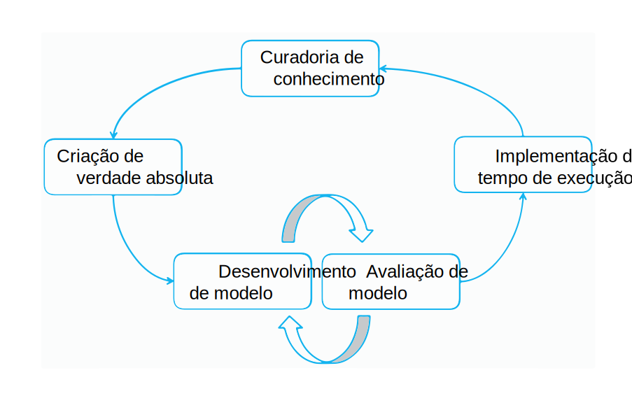

---

copyright:
  years: 2015, 2018
lastupdated: "2018-04-04"

---

{:shortdesc: .shortdesc}
{:new_window: target="_blank"}
{:tip: .tip}
{:pre: .pre}
{:codeblock: .codeblock}
{:screen: .screen}
{:javascript: .ph data-hd-programlang='javascript'}
{:java: .ph data-hd-programlang='java'}
{:python: .ph data-hd-programlang='python'}
{:swift: .ph data-hd-programlang='swift'}

Essa documentação destina-se ao {{site.data.keyword.knowledgestudiofull}} no {{site.data.keyword.cloud}}. Para ver a documentação para a versão anterior do {{site.data.keyword.knowledgestudioshort}} no {{site.data.keyword.IBM_notm}} Marketplace, [clique neste link ](https://console.bluemix.net/docs/services/knowledge-studio/annotate-documents.html){: new_window}.
{: tip}

# Configuração de anotação
{: #annotate-documents}

Os usuários que possuem conhecimento da indústria e sua linguagem devem anotar os documentos.
{: shortdesc}

Execute as tarefas a seguir para permitir que os anotadores humanos acessem a área de trabalho:

- Convide especialistas no assunto para a instância do {{site.data.keyword.knowledgestudioshort}} que você está usando.
- Associe anotadores humanos a um ou mais conjuntos de anotações que você deseja que eles anotem.
- Crie uma tarefa que designe o anotador humano para anotar os documentos no conjunto.

    > **Atenção:** só depois que você designar explicitamente as tarefas aos anotadores humanos que eles poderão ver sua área de trabalho quando efetuarem login no {{site.data.keyword.knowledgestudioshort}}.

Seus usuários (os anotadores humanos) precisarão se familiarizar com o [Anotando documentos](/docs/services/watson-knowledge-studio/user-guide.html), que contém informações detalhadas sobre como anotar documentos.

## Ciclo de vida do modelo
{: #wks_lifecycle}

O modelo que você cria com o {{site.data.keyword.knowledgestudioshort}} é um componente de software que pode ser conectado a um pipeline de processamento de linguagem natural (NLP).

Com o {{site.data.keyword.knowledgestudioshort}}, é possível criar, avaliar e melhorar modelos para novos domínios. Um modelo inclui anotações (metadados) para o texto que aparece no conteúdo de língua natural. As anotações, que identificam menções de entidades de interesse em seu conteúdo de domínio, os relacionamentos entre elas e como as menções correferenciam a mesma entidade, podem ser usados por aplicativos para analisar e processar texto automaticamente. Os usuários do aplicativo se beneficiam desse nível de análise por estarem aptos a extrair significados, descobrir insights e obter respostas em um contexto de língua natural.

A criação de um modelo é um processo iterativo com várias etapas que envolve vários estágios: curadoria de conhecimento, geração de verdade absoluta, desenvolvimento de modelo, avaliação de modelo e implementação de tempo de execução.

### Adaptação de domínio de ponta a ponta
{: #wks_lifecycle__wks_lifecycleS6}

O diagrama a seguir resume as interações entre essas cinco etapas de desenvolvimento de modelo e as atividades típicas que ocorrem em cada uma.

 Figura 2. Um resumo das cinco etapas de desenvolvimento de modelo e as atividades que ocorrem em cada uma.

### Curadoria de conhecimento
{: #wks_lifecycle__wks_lifecycleS1}

Esta etapa, externa ao {{site.data.keyword.knowledgestudioshort}}, refere-se ao processo de seleção, coleta, preservação e manutenção do conteúdo relevante para um domínio específico. A curadoria inclui valor para dados; ela transforma dados em informações confiáveis e conhecimento.

### Geração de verdade absoluta
{: #wks_lifecycle__wks_lifecycleS2}

Esta etapa refere-se ao uso de ferramentas do {{site.data.keyword.knowledgestudioshort}} e melhores práticas para produzir uma coleção de dados examinados que podem ser usados para adaptar uma solução {{site.data.keyword.watson}} para um domínio específico. A precisão desses dados examinados, chamados de *verdade absoluta* ou *documentos de padrão ouro*, é crítica porque imprecisões na verdade absoluta se correlacionarão a imprecisões nos aplicativos que dependem disso.

Uma parte essencial do ensino do {{site.data.keyword.watson}} sobre um novo domínio envolve fornecer a ele conhecimento sobre entidades de interesse em seu conteúdo de domínio, os relacionamentos entre elas e como as entidades são correferenciadas entre si. Coletar esse conhecimento inclui as atividades a seguir:

- Envolver especialistas no assunto de domínio para criar os recursos a seguir ou para identificar recursos existentes que podem ser reutilizados ou modificados para seu domínio:

  - Diretrizes e exemplos de anotação para ajudar os anotadores humanos a aprenderem como as palavras e passagens em seu conteúdo de domínio devem ser anotadas.
  - Sistemas de tipos que definem os tipos (objetos) e recursos (classificações de dados) específicos do domínio que podem ser descobertos no conteúdo de domínio por meio de análise de texto. O sistema de tipos controla os tipos de anotações que um anotador humano pode incluir em documentos.
  - Dicionários de termos que devem ser tratados como termos equivalentes em seu conteúdo de domínio.

- Criando um corpus de documentos que são representantes de seu conteúdo de domínio.
- Pré-anotando documentos com base nos dicionários que você inclui em uma área de trabalho do {{site.data.keyword.knowledgestudioshort}}. Depois de criar um modelo de aprendizado de máquina, é possível usar o modelo para pré-anotar novos documentos que você inclui no corpus. A pré-anotação é um processo de anotação por máquina de um documento na medida do possível antes que um modelo de aprendizado de máquina esteja disponível para fazer isso. A pré-anotação pode reduzir a mão de obra de anotação humana, substituindo uma criação de anotação humana por mera verificação da exatidão da anotação por máquina.
- Dividindo os documentos entre anotadores humanos, que então usam a ferramenta de editor de verdade absoluta do {{site.data.keyword.knowledgestudiofull}} para incluir manualmente anotações em pequenos conjuntos de documentos.
- Comparando os resultados de anotação humana e resolvendo conflitos. A adjudicação nesta fase é necessária para assegurar que documentos anotados de forma precisa e consistente sejam promovidos para verdade absoluta, na qual eles podem ser usados para treinar e testar um modelo de aprendizado de máquina.

### Desenvolvimento de modelo
{: #wks_lifecycle__wks_lifecycleS3}

Esta etapa se refere ao uso de ferramentas do {{site.data.keyword.knowledgestudioshort}} para criar um modelo. Depois de estabelecer a verdade absoluta, os resultados de anotação humana podem ser usados para treinar um algoritmo para incluir automaticamente anotações em grandes coleções de documentos, como coleções que incluem milhões de documentos.

### Avaliação de modelo
{: #wks_lifecycle__wks_lifecycleS4}

Esta etapa refere-se ao uso de ferramentas do {{site.data.keyword.knowledgestudioshort}} para refinar o modelo e melhorar o desempenho. Os resultados gerados pelo modelo são avaliados com relação a um conjunto de testes de documentos de verdade absoluta. A *análise de precisão* identifica as causas de erros de anotação. A *análise de altura livre* ajuda a avaliar quais erros requerem foco e onde os refinamentos do modelo podem causar maior impacto. Os ajustes podem ser feitos repetidamente para melhorar o desempenho até que um nível satisfatório de precisão seja alcançado.

### Implementação de modelo
{: #wks_lifecycle__wks_lifecycleS5}

Esta etapa se refere a exportar componentes que permitem que o modelo seja executado em ambientes de tempo de execução de aprendizado de máquina e a tornar o modelo acessível para outros aplicativos cognitivos do {{site.data.keyword.watson}}. Por exemplo, é possível implementar o modelo de aprendizado de máquina para uso pelo {{site.data.keyword.Bluemix}} {{site.data.keyword.alchemyapishort}} ou exportar o modelo para uso no {{site.data.keyword.IBM_notm}} {{site.data.keyword.watson}} Explorer.

## Criando uma tarefa de anotação
{: #wks_hatask}

Antes que os anotadores humanos possam começar a incluir anotações em documentos, o gerenciador de processos de anotação deve criar uma tarefa de anotação.

### Sobre essa Tarefa

A tarefa de anotação especifica quais documentos devem ser anotados. Para comparar a qualidade da execução dos anotadores humanos e verificar a consistência das diretrizes de anotação aplicadas por eles, deve-se incluir pelo menos dois anotadores humanos na tarefa. Além disso, alguma porcentagem de documentos deve ocorrer em todos os conjuntos de anotações que são incluídos na tarefa (você especifica a porcentagem de sobreposição ao criar os conjuntos de anotações).

#### Importante

- Uma tarefa de anotação é um conceito temporal que existe para permitir que os anotadores humanos anotem texto em espaços isolados. Também assegura que somente as anotações aprovadas sejam promovidas para verdade absoluta.
- Um conjunto de anotações pode ser incluído em uma tarefa ativa por vez. Para incluir um conjunto de anotações de uma tarefa para uma tarefa diferente, deve-se primeiro excluir a tarefa na qual o conjunto de anotações está ativo.
- Se você exclui a conta do usuário de um anotador humano, isso afeta suas anotações também. Quaisquer anotações em documentos que foram designadas a esse usuário, mas não foram promovidas a verdade absoluta, são excluídas.
- Se as configurações do editor de sistema de tipos ou verdade absoluta mudam após a criação de uma tarefa de anotação humana, deve-se decidir se propaga ou não as mudanças para a tarefa. As mudanças de sistema de tipos podem afetar as anotações; os anotadores humanos podem precisar revisar e atualizar seus documentos.
- Se há mudanças nos dicionários, elas não são refletidas na tarefa de anotação atual. Para aplicar mudanças de recursos à verdade absoluta, deve-se criar uma nova tarefa de anotação.
- É possível ter até 256 tarefas de anotação por área de trabalho.

### Procedimento

Para criar uma tarefa de anotação:

1. Efetue login como um administrador do {{site.data.keyword.knowledgestudioshort}} e selecione a sua área de trabalho.
1. Selecione a guia **Ativos e ferramentas** > **Documentos** > **Tarefas**.
1. Clique em **Incluir tarefa**. Especifique um nome descritivo para a tarefa e selecione a data em que a tarefa deve ser concluída.

    > **Nota:** não é possível mudar o nome da tarefa posteriormente.

1. Clique em **Criar**. Uma lista de conjuntos de anotações disponíveis é exibida, juntamente com os nomes dos anotadores humanos designados a eles.
1. Selecione cada conjunto de anotações que você deseja incluir na tarefa e clique em **Criar tarefa**.

    As marcas de seleção pelos nomes dos conjuntos de anotações fazem parecer que todos os conjuntos de anotações estão selecionados por padrão, mas eles não estão. Deve-se selecionar explicitamente os conjuntos de anotações que você deseja incluir.
    {: tip}

### O que fazer em seguida

Após a tarefa ser criada, é possível retornar para a guia **Ativos e ferramentas** > **Documentos** > **Tarefas** para visualizar o progresso de cada anotador humano. Também é possível:

- Especificar as preferências para usar cores e atalhos de teclado no editor de verdade absoluta.
- Especificar um limite de concordância entre anotadores e, então, abrir uma tarefa para ver a consistência de documentos iguais anotados por múltiplos anotadores humanos.
- Especificar uma URL para conectar suas diretrizes de anotação ao editor de verdade absoluta.
- Verificar os documentos aprovados que se sobrepõem entre conjuntos de anotações para resolver conflitos de anotação.
- Abrir uma tarefa para incluir conjuntos de anotações nela. Assegure-se de que os conjuntos de anotações incluídos incluam documentos que se sobrepõem com documentos nos conjuntos de anotações originais.

## Configurando preferências do editor de verdade absoluta
{: #wks_hapref}

Um gerente de projeto pode especificar preferências para usar cores e atalhos de teclado no editor de verdade absoluta.

### Procedimento

Para especificar preferências visuais para trabalhar com o editor de verdade absoluta:

1. Efetue login como um administrador do {{site.data.keyword.knowledgestudioshort}} e selecione a sua área de trabalho.
1. Na navegação à esquerda, selecione **Configurações**.
1. Selecione a guia **Tipos de entidade** ou **Tipos de relação**.
1. Selecione o tipo de entidade ou o tipo de relação que você deseja mudar e, em seguida, clique em **Editar atalhos de teclado e cores**. Para cada tipo, é possível definir um:

    - Atalho de teclado, que significa que um usuário pode inserir `<shortcut>` para aplicar o rótulo de tipo ao texto destacado. Por exemplo, se você definir `o` como o atalho de teclado para ORGANIZAÇÃO, um usuário poderá selecionar o texto e, em seguida, pressionar a tecla `o` para aplicar o tipo de entidade ORGANIZAÇÃO ao texto destacado. Se você designar uma letra maiúscula, então o usuário inserirá `Shift+<letter>`.
    - Cor do texto. Assegure-se de que a cor do texto contraste com a cor do plano de fundo para que o texto fique visível após ser rotulado.
    - Cor do plano de fundo. Esta é a cor do rótulo que é aplicado à entidade após você anotá-lo.

    Ao anotar documentos, os anotadores humanos podem usar os atalhos de teclado para incluir anotações rapidamente. E o rótulo de anotação e as cores do texto ajudam os anotadores humanos a reconhecerem instantaneamente os tipos depois que eles incluem anotações em um documento.
    - Se houver tipos de entidade ou relação que você não deseja que os anotadores humanos designem a menções, será possível ocultá-los no editor de verdade absoluta, que reduz e simplifica a lista de opções de tipo que os usuários veem. Para fazer isso, desmarque a caixa de seleção **Ativo** para o tipo.

    Conforme você designa novos atalhos e cores, é possível visualizar as mudanças.

1. Também é possível mudar a cor de destaque da seleção padrão. Esta é a cor da borda que é exibida ao redor do texto após você selecioná-lo. A cor padrão é um azul claro, mas é possível mudar a cor na guia **Destaque de seleção** para facilitar a identificação dos limites do texto que é selecionado.

#### Tarefas relacionadas

[Modificando um sistema de tipos sem perder as anotações humanas](/docs/services/watson-knowledge-studio/improve-ml.html#wks_projtypesysmod)

## Configurando o limite de IAA
{: #wks_haiaathresh}

Para ajudá-lo a decidir se aceita ou rejeita um conjunto de documentos anotados, é possível especificar um limite de concordância entre anotadores. O limite ajuda você a comparar como bem ou mal a concordância entre anotadores compara a pontuação de IAA calculada pelo sistema.

### Sobre essa Tarefa

Para comparar como os diferentes anotadores humanos anotaram os mesmos documentos, especifique um limite de avaliação. Se as anotações feitas por um anotador humano diferem das que foram feitas por outro anotador humano ao ponto em que a diferença resulta em uma pontuação baixa, isso significa que os anotadores não concordam. O desacordo precisa ser investigado e resolvido.

### Procedimento

Para configurar o limite de concordância entre anotadores:

1. Efetue login como um administrador do {{site.data.keyword.knowledgestudioshort}} e selecione a sua área de trabalho.
1. Na navegação à esquerda, selecione **Configurações**.
1. Selecione **Configurações de IAA**, especifique um valor entre 0 e 1, como .5 ou .8, em seguida, clique em **Salvar**.

## Conectando-se a diretrizes de anotação
{: #wks_haguidelines}

Depois de criar as diretrizes de anotação para seu projeto, é possível configurar o {{site.data.keyword.knowledgestudioshort}} para se conectar a elas. Para obter ajuda com a escolha da anotação correta a ser aplicada, os anotadores humanos podem revisar as diretrizes enquanto anotam os documentos. Os administradores também podem revisar as diretrizes se eles precisam de ajuda ao resolver conflitos anotação em documentos de sobreposição.

### Procedimento

Para conectar o editor de verdade absoluta e a ferramenta de adjudicação às suas diretrizes de anotação:

1. Efetue login como um administrador do {{site.data.keyword.knowledgestudioshort}} e selecione a sua área de trabalho.
1. Na navegação à esquerda, selecione **Configurações**.
1. Selecione **Diretrizes de anotação**.
1. Especifique a URL para onde suas diretrizes são hospedadas, um site dentro de sua empresa ou uma wiki que você criou anteriormente em {{site.data.keyword.IBM_notm}} developerWorks&reg;.
1. Clique em **Salvar**. O sistema conecta o editor de verdade absoluta e a ferramenta de adjudicação às suas diretrizes de anotação. Dependendo das permissões de acesso concedidas aos usuários quando você criou as diretrizes, os anotadores humanos e os administradores da área de trabalho podem ser capazes de atualizar as diretrizes depois de abri-las, por exemplo, para incluir esclarecimentos e exemplos.

### Diretrizes de anotação
{: #wks_guidelines}

Não há um formato prescrito de como documentar as diretrizes, mas é importante que as diretrizes incluam exemplos detalhados. Os anotadores humanos precisam entender qual tipo de entidade aplicar a uma menção dado o contexto e saber quais tipos de relação são válidos para um determinado par de menções. Os exemplos retirados de seu conteúdo de domínio são frequentemente a melhor maneira de transmitir as opções de anotação correta a serem feitas.

As diretrizes de anotação não são estáticas. À medida que seu projeto se desenvolver, você provavelmente descobrirá instâncias de menções e relacionamentos não são capturadas com precisão nas diretrizes. E você provavelmente descobrirá inconsistências entre múltiplos anotadores humanos que interpretam as diretrizes de diferentes maneiras. Atualizando as diretrizes conforme as situações surgem, é possível ajudar a melhorar a precisão e a consistência de anotações ao longo do tempo.

Antes que os documentos possam ser considerados de verdade absoluta, qualquer conflito entre como os diferentes anotadores humanos anotaram os mesmos documentos deve ser resolvido. Uma maneira chave de resolver os conflitos é discutir o que causou a confusão, ajudando assim os anotadores humanos a aprenderem com seus erros. Melhorar e esclarecer as diretrizes pode ajudar a reduzir o número de conflitos e ajudar a assegurar que documentos anotados com precisão e consistência sejam promovidos à verdade absoluta.

Para ajudar a gerenciar as diretrizes, você pode desejar dividir o que pode se tornar um documento longo em múltiplas partes, como diretrizes para anotar entidades, diretrizes para anotar relações e diretrizes para anotar as maneiras como as menções podem ser correferenciadas. As mudanças feitas em uma área devem ser avaliadas e coordenadas com as mudanças feitas em outra. Por exemplo, se você incluir um tipo de entidade, revise as diretrizes para anotar os tipos de relação e especifique como o novo tipo de entidade pode se relacionar com outros tipos de entidade.

### Exemplo de diretrizes de anotação
{: #wks_guidelinesexample}

A maioria das diretrizes de anotação precisará de muito detalhes e exemplos para assegurar que os anotadores humanos anotem consistentemente o texto.

O exemplo apresentado aqui é uma diretriz simples que foi criada para um domínio pequeno que contém relatórios de incidentes de tráfego.

#### Objetivos da tarefa
{: #wks_guidelinesexample__annotgoals}

- Como membros do projeto, familiarize-se com o processo iterativo de anotação manual e refinamento do modelo de aprendizado de máquina.
- Anote os documentos no domínio automotivo com o editor de verdade absoluta e use as anotações para treinar um modelo de aprendizado de máquina. Anote os tipos de entidade e de relação e correferencie as entidades, conforme necessário.

#### Notações de diretriz
{: #wks_guidelinesexample__annotnotation}

- Os colchetes [ ] indicam a extensão a ser anotada quando menos de todo o texto citado é anotado.

    Inclua negações, conforme apropriado, por exemplo `[no injuries]ACCIDENT_OUTCOME`. O sistema de tipos não está usando a classe de entidade para representar a negação.

#### Tipos de entidade
{: #wks_guidelinesexample__annottype}

O sistema de tipos não usa subtipos ou funções de entidade, nem tipos ou classes de menção.

<table cellpadding="4" cellspacing="0" summary="" id="wks_guidelinesexample__table_okd_5kj_f5" class="table" width="100%" rules="rows" frame="void" border="0"><thead class="thead" align="left"><tr class="row"><th class="entry ncol thleft" valign="top" width="23.584905660377355%" id="d1735e810">Tipo de entidade</th>
<th class="entry ncol thleft" valign="top" width="37.971698113207545%" id="d1735e812">Diretrizes</th>
<th class="entry ncol thleft" valign="top" width="38.44339622641509%" id="d1735e814">Exemplos</th>
</tr>
</thead>
<tbody class="tbody"><tr class="row"><td class="entry ncol" valign="top" width="23.584905660377355%" headers="d1735e810 ">
ACCIDENT_OUTCOME
</td>
<td class="entry ncol" valign="top" width="37.971698113207545%" headers="d1735e812 ">
Uma consequência de um acidente. Aplica-se a humanos (por exemplo, falecimento) e carros (por exemplo, amassado).
Pode incluir "rebocado" e "implementação de airbag" como indicadores de gravidade de danos e "levado
para o hospital" (mas não funerária) como indicadores de gravidade de ferimento. Pode incluir
negação.
</td>
<td class="entry ncol" valign="top" width="38.44339622641509%" headers="d1735e814 ">
"[acidente]", "[ferimento]", "sofreu [perda total]", "[sem ferimentos]", "[rebocado] devido a
[dano impeditivo]", [não rebocado], "airbag [não implementou]" (o airbag em si tem que ser PART_OF_CAR,
relacionado ao sufferedFrom para este ACCIDENT_OUTCOME) e indicações de gravidade.
</td>
</tr>
<tr class="row"><td class="entry ncol" valign="top" width="23.584905660377355%" headers="d1735e810 ">
CONDITION
</td>
<td class="entry ncol" valign="top" width="37.971698113207545%" headers="d1735e812 ">
As condições meteorológicas ou de estrada; um aspecto do cenário que pode afetar a probabilidade de acidente
e pode mudar de dia para dia, mas não é sobre o carro ou motorista.

Pode ser um erro do motorista ou
falha mecânica e deve parecer ser problemático. Deve excluir STRUCTURE.

</td>
<td class="entry ncol" valign="top" width="38.44339622641509%" headers="d1735e814 ">
"seco", "chuvoso", "construção", "tráfego pesado", "luz do dia", mas não "coberto de grama" ou
"embriagado".

"pneu furado", "hipercorrigido" (como em direção), "dormindo", "embriagado", "[falhou
ao contornar]CONDITION uma [curva]STRUCTURE", "[saiu] da faixa" ou do acostamento, mas não "tentando
passar" a menos que esta frase seja acompanhada por "sem espaço suficiente" ou algo semelhante, nem
"saindo da estrada", que é um INCIDENT.

</td>
</tr>
<tr class="row"><td class="entry ncol" valign="top" width="23.584905660377355%" headers="d1735e810 ">
INCIDENT
</td>
<td class="entry ncol" valign="top" width="37.971698113207545%" headers="d1735e812 ">
Uma menção real de uma colisão, ou um movimento do carro que é claramente inadequado e
provavelmente destrutivo, como sair da estrada, ou algum outro incidente prejudicial, como um incêndio de carro. 

Não
correferencie movimentos idênticos entre si, como "atingido", "empurrado para trás" e
"parou", mesmo se eles estão intimamente associados. 

Exclua STRUCTURE da extensão;
Por exemplo, "[parou]INCIDENT em uma [valeta]STRUCTURE" ou "[ficando em contato]INCIDENT com
o [guardrail]STRUCTURE".

</td>
<td class="entry ncol" valign="top" width="38.44339622641509%" headers="d1735e814 ">
 "colisão", "atingido", "capotou", "em contato", "contra", "empurrado", "passageiro foi
[ejetado]", "rolou um quarto de volta" -- o quarto de volta indicando gravidade, mas sendo parte do
incidente, não um ACCIDENT_OUTCOME (não anotar rotação de veículo).

"parou" em
um local ao qual o veículo não pertence, como um aterro ou em movimento de um impacto, ou "saiu
da estrada" (não apenas saindo de uma faixa, que pode ser uma causa). 

</td>
</tr>
<tr class="row"><td class="entry ncol" valign="top" width="23.584905660377355%" headers="d1735e810 ">
MANUFACTURER
</td>
<td class="entry ncol" valign="top" width="37.971698113207545%" headers="d1735e812 ">
A empresa que faz o veículo.
</td>
<td class="entry ncol" valign="top" width="38.44339622641509%" headers="d1735e814 ">
Toyota, Mazda, General Motors
</td>
</tr>
<tr class="row"><td class="entry ncol" valign="top" width="23.584905660377355%" headers="d1735e810 ">
MODEL
</td>
<td class="entry ncol" valign="top" width="37.971698113207545%" headers="d1735e812 ">
O tipo específico de carro, feito por um fabricante específico. Exclua quaisquer termos adicionais/apare
indicadores de linha como "LX" ou "SE" (por exemplo, anotar somente "Xterra" para a frase "Xterra
SE").
</td>
<td class="entry ncol" valign="top" width="38.44339622641509%" headers="d1735e814 ">
Camry
</td>
</tr>
<tr class="row"><td class="entry ncol" valign="top" width="23.584905660377355%" headers="d1735e810 ">
MODEL_YEAR
</td>
<td class="entry ncol" valign="top" width="37.971698113207545%" headers="d1735e812 ">
O ano do modelo que faz parte do nome do carro.
</td>
<td class="entry ncol" valign="top" width="38.44339622641509%" headers="d1735e814 ">
'99, 2001
</td>
</tr>
<tr class="row"><td class="entry ncol" valign="top" width="23.584905660377355%" headers="d1735e810 ">
PART_OF_CAR
</td>
<td class="entry ncol" valign="top" width="37.971698113207545%" headers="d1735e812 ">
Uma peça de um veículo, dentro ou fora dele, independentemente se especificamente
envolvido no incidente. Exclua listas de recursos de tais peças. Inclua as indicações de
onde a peça está no carro ou algo que só se refira a uma parte de um carro sem ser uma
peça específica.

Pode ser plural. Pode incluir especificação de posição no veículo, como
"[airbag do motorista]", "[porta RF ]" (significando direita frontal), "[RR] passageiro", "[airbags LF e RF]",
"[limitações passivas/automáticas de primeira linha]", "[sistema de segurança] com recursos do EDR".

Inclua
barcos rebocados, tanques, etc., exceto semi-trailers, os quais têm
um ano/modelo/fabricante distinto.

</td>
<td class="entry ncol" valign="top" width="38.44339622641509%" headers="d1735e814 ">
Seção cruzada, plano frontal, pneu, volante, airbag, etc.
</td>
</tr>
<tr class="row"><td class="entry ncol" valign="top" width="23.584905660377355%" headers="d1735e810 ">
PERSON
</td>
<td class="entry ncol" valign="top" width="37.971698113207545%" headers="d1735e812 ">
Qualquer pessoa descrita em um cenário de acidente em um relatório (pode ser um motorista ou um
passageiro/ocupante de um veículo, pedestre ou testemunha). 

Não anote adjetivos. Em vez de "um [69 anos] dirigia", anote "um [homem] de 69 anos de idade dirigia". Pode ser plural, por exemplo,
"LR e RF [ocupantes]". Exclua as pessoas que chegam após o incidente. 

Na ausência de um
tipo de entidade "animal", use PERSON para identificação de animais selvagens envolvidos em/causando colisões, pois a capacidade
de movimentação os torna mais como PERSON que STRUCTURE. 

Nota: "airbag do passageiro" é um
PART_OF_CAR; que não significa que uma pessoa está presente. 

</td>
<td class="entry ncol" valign="top" width="38.44339622641509%" headers="d1735e814 ">
Motorista, ocupante, paciente, criança
</td>
</tr>
<tr class="row"><td class="entry ncol" valign="top" width="23.584905660377355%" headers="d1735e810 ">
STRUCTURE
</td>
<td class="entry ncol" valign="top" width="37.971698113207545%" headers="d1735e812 ">
Uma estrutura que está em uma estrada, está próxima ou faz parte dela. Inclua adjetivos de estrada específicos provavelmente
para serem relevantes à configuração de um acidente; omita outros adjetivos.
</td>
<td class="entry ncol" valign="top" width="38.44339622641509%" headers="d1735e814 ">
[duas faixas, estrada de mão dupla], [faixa esquerda], sentido oeste-leste [faixa], 2 pés [valeta], [linha de faixa direita],
[rampa de saída], [coluna], [árvore], inclinação acentuada [aterro]
</td>
</tr>
<tr class="row"><td class="entry ncol" valign="top" width="23.584905660377355%" headers="d1735e810 ">
VEHICLE
</td>
<td class="entry ncol" valign="top" width="37.971698113207545%" headers="d1735e812 ">
Qualquer referência ao veículo diferente de MODEL, MANUFACTURER e MODEL_YEAR. Pode ser plural, em
cujo caso a correferência é muito improvável e sem relação de parte do grupo. 

Considere somente os veículos
que fazem parte do cenário; exclua os veículos de emergência que responderam posteriormente, por exemplo. Bicicletas
são VEHICLEs.

</td>
<td class="entry ncol" valign="top" width="38.44339622641509%" headers="d1735e814 ">
"o [caminhão]", "o [carro]", "[V1]'s"
</td>
</tr>
</tbody>
</table>

#### Tipos de relação
{: #wks_guidelinesexample__annotreltype}

O sistema de tipos usa tipos de relação, mas não classes relação ou outros atributos de relações. A negação não está codificada por uma classe de relação, mas sim pelas extensões das menções, por exemplo, [sem ocupantes]PERSON foi [internado]ACCIDENT_OUTCOME com as duas menções vinculadas pelo tipo de relação sufferedFrom.

<table cellpadding="4" cellspacing="0" summary="" id="wks_guidelinesexample__table_z25_m4j_f5" class="table" width="100%" rules="rows" frame="void" border="0"><thead class="thead" align="left"><tr class="row"><th class="entry ncol thleft" valign="top" width="33.26996197718631%" id="d1735e923">Tipos de entidade possíveis para a primeira menção</th>
<th class="entry ncol thleft" valign="top" width="19.011406844106464%" id="d1735e925">Tipo de relação</th>
<th class="entry ncol thleft" valign="top" width="47.71863117870722%" id="d1735e927">Tipos de entidade possíveis para a segunda menção</th>
</tr>
</thead>
<tbody class="tbody"><tr class="row"><td class="entry ncol" valign="top" width="33.26996197718631%" headers="d1735e923 ">
VEHICLE, MODEL, MANUFACTURER [<b>2</b>]
</td>
<td class="entry ncol" valign="top" width="19.011406844106464%" headers="d1735e925 ">
hasProperty
</td>
<td class="entry ncol" valign="top" width="47.71863117870722%" headers="d1735e927 ">
MANUFACTURER, MODEL, MODEL_YEAR
</td>
</tr>
<tr class="row"><td class="entry ncol" valign="top" width="33.26996197718631%" headers="d1735e923 ">
PERSON
</td>
<td class="entry ncol" valign="top" width="19.011406844106464%" headers="d1735e925 ">
occupantOf
</td>
<td class="entry ncol" valign="top" width="47.71863117870722%" headers="d1735e927 ">
VEHICLE, MODEL, MANUFACTURER, MODEL_YEAR [<b>1</b>], PART_OF_CAR, STRUCTURE
</td>
</tr>
<tr class="row"><td class="entry ncol" valign="top" width="33.26996197718631%" headers="d1735e923 ">
PERSON, PART_OF_CAR, STRUCTURE, VEHICLE, MODEL, MANUFACTURER,
MODEL_YEAR [<b>1</b>]
</td>
<td class="entry ncol" valign="top" width="19.011406844106464%" headers="d1735e925 ">
sufferedFrom
</td>
<td class="entry ncol" valign="top" width="47.71863117870722%" headers="d1735e927 ">
ACCIDENT_OUTCOME
</td>
</tr>
<tr class="row"><td class="entry ncol" valign="top" width="33.26996197718631%" headers="d1735e923 ">
VEHICLE
</td>
<td class="entry ncol" valign="top" width="19.011406844106464%" headers="d1735e925 ">
driveUnder
</td>
<td class="entry ncol" valign="top" width="47.71863117870722%" headers="d1735e927 ">
CONDITION, ACCIDENT_CAUSE
</td>
</tr>
<tr class="row"><td class="entry ncol" valign="top" width="33.26996197718631%" headers="d1735e923 ">
PART_OF_CAR
</td>
<td class="entry ncol" valign="top" width="19.011406844106464%" headers="d1735e925 ">
locatedOn
</td>
<td class="entry ncol" valign="top" width="47.71863117870722%" headers="d1735e927 ">
VEHICLE, MODEL, MANUFACTURER, MODEL_YEAR [<b>1</b>]
</td>
</tr>
<tr class="row"><td class="entry ncol" valign="top" width="33.26996197718631%" headers="d1735e923 ">
ACCIDENT_OUTCOME
</td>
<td class="entry ncol" valign="top" width="19.011406844106464%" headers="d1735e925 ">
outcomeOf
</td>
<td class="entry ncol" valign="top" width="47.71863117870722%" headers="d1735e927 ">
INCIDENT
</td>
</tr>
<tr class="row"><td class="entry ncol" valign="top" width="33.26996197718631%" headers="d1735e923 ">
INCIDENT
</td>
<td class="entry ncol" valign="top" width="19.011406844106464%" headers="d1735e925 ">
causedBy
</td>
<td class="entry ncol" valign="top" width="47.71863117870722%" headers="d1735e927 ">
CONDITION, ACCIDENT_CAUSE <strong class="ph b">(lembrete: requer prova textual da
causalidade)</strong>
</td>
</tr>
<tr class="row"><td class="entry ncol" valign="top" width="33.26996197718631%" headers="d1735e923 ">
INCIDENT
</td>
<td class="entry ncol" valign="top" width="19.011406844106464%" headers="d1735e925 ">
impactPoint
</td>
<td class="entry ncol" valign="top" width="47.71863117870722%" headers="d1735e927 ">
O PERSON, PART_OF_CAR, STRUCTURE, VEHICLE, MANUFACTURER, MODEL ou
MODEL_YEAR [<b>1</b>] que é atingido ou envolvido no acidente.

impactPoint para STRUCTURE
não inclui apenas especificar o local de um impacto que não envolva aquela STRUCTURE,
então não se aplica a dois veículos que colidem em uma [interseção]STRUCTURE, mas se aplica a um
veículo atingindo um [aterro]STRUCTURE.

</td>
</tr>
</tbody>
</table>

#### Notas da tabela

**1** A notação VEHICLE/MODEL/MANUFACTURER/MODEL_YEAR refere-se a uma menção de um veículo. As últimas três são respectivamente para casos em que o texto diz algo como "o Accord", "o Honda" ou, provavelmente raramente, "o ano 99". Os quatro tipos de entidade estão em ordem de prioridade, então em "o motorista do Honda Accord 99", a relação seria o motorista (como PERSON) occupantOf Accord (como MODEL), em cujo caso Acordo teria a relação hasProperty com Honda e 99.

**2** MODEL e MANUFACTURER podem somente ser o primeiro argumento de hasProperty, somente quando eles aparecem como substantivos (referências a um veículo). MODEL pode ter a relação hasProperty com MANUFACTURER e MODEL_YEAR, como em "Honda Accord 99 dirigido". MANUFACTURER pode somente ter a relação hasProperty com MODEL_YEAR, como em "Honda 99 dirigido".
