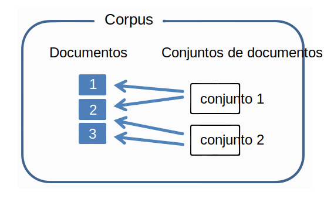
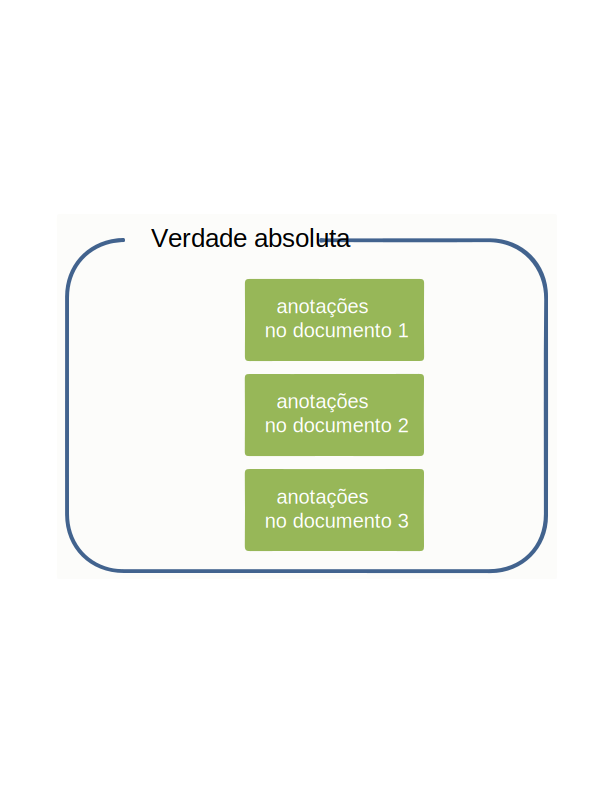
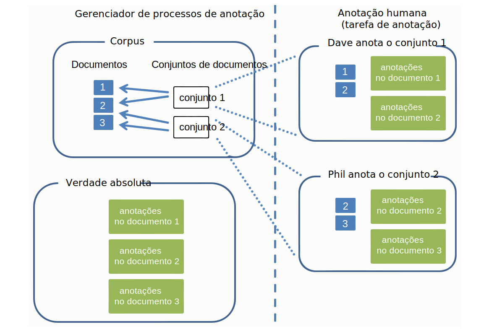

---

copyright:
  years: 2015, 2018
lastupdated: "2018-04-04"

---

{:shortdesc: .shortdesc}
{:new_window: target="_blank"}
{:tip: .tip}
{:pre: .pre}
{:codeblock: .codeblock}
{:screen: .screen}
{:javascript: .ph data-hd-programlang='javascript'}
{:java: .ph data-hd-programlang='java'}
{:python: .ph data-hd-programlang='python'}
{:swift: .ph data-hd-programlang='swift'}

Essa documentação destina-se ao {{site.data.keyword.knowledgestudiofull}} no {{site.data.keyword.cloud}}. Para ver a documentação para a versão anterior do {{site.data.keyword.knowledgestudioshort}} no {{site.data.keyword.IBM_notm}} Marketplace, [clique neste link ](https://console.bluemix.net/docs/services/knowledge-studio/documents-for-annotation.html){: new_window}.
{: tip}

# Incluindo documentos para anotação
{: #documents-for-annotation}

Para treinar um modelo de aprendizado de máquina, deve-se incluir documentos que contêm conhecimento no assunto, como artigos de jornal ou outros textos específicos, em sua área de trabalho.
{: shortdesc}

## Sobre essa Tarefa

Para definir regras para o modelo baseado em regra, você inclui ou faz upload de documentos dos quais é possível desenhar padrões para definir como regras. Veja [Incluindo documentos para definir regras](/docs/services/watson-knowledge-studio/rule-annotator-add-doc.html) para obter mais informações. Esta seção descreve como incluir documentos somente para anotação.

## Documentos
{: #wks_sampledoc}

Para treinar um modelo de aprendizado de máquina, você precisa coletar documentos que são representantes de seu conteúdo de domínio e de valor alto para seu aplicativo.

Tente assegurar que seus documentos de treinamento sejam verdadeiramente representantes de conteúdo que é de interesse para seu domínio; ou seja, eles contêm muitas menções relevantes que podem ser anotadas. Para escolher os melhores documentos, siga estas diretrizes:

- Tente fornecer um conjunto de documentos que tenham um tamanho total de cerca de 300.000 palavras. Forneça mais palavras para um sistema de tipos complexo e menos para um mais simples.
- Limite cada documento a uma página ou duas de conteúdo (menos de 2.000 palavras e mais próximo de 1.000 palavras por documento é melhor). Nos estágios iniciais de desenvolvimento de modelo, manter cada documento até alguns parágrafos também é uma boa prática. Um anotador humano pode marcar menções e relações em um documento longo, mas as tentativas de marcar correferência em múltiplas páginas podem ser difíceis.
- Assegure-se de que os dados nos documentos sejam distribuídos entre todos os tipos de entidade, subtipos e funções possíveis e os relacionamentos entre eles. Um objetivo a ser atingido é ter eventualmente pelo menos 50 anotações para cada tipo de entidade e 50 para cada tipo de relação na coleção de documentos.
- Novamente, os documentos devem representar a amplitude de assuntos que serão abordados pelo aplicativo, mas no caso de frequência de ocorrência desequilibrada de tipos de entidade e tipos de relação, tente conseguir pelo menos 50 exemplos de cada tipo, mais para tipos de entidade que têm menções que tendem a ser frases.
- O conjunto que você cria para treinamento deve conter pelo menos 10 documentos anotados.

Quando você estiver pronto para criar e treinar o modelo, os documentos que você incluir na área de trabalho poderão ser divididos em conjuntos que são usados como dados de treinamento, dados de teste e dados ocultos. Os conjuntos de dados separados são importantes para avaliar o desempenho do modelo.

É possível incluir documentos das maneiras a seguir:

- Um arquivo CSV de duas colunas em formato UTF-8
- Arquivos de texto no formato UTF-8
- Um arquivo ZIP que contém documentos transferidos por download de uma área de trabalho do {{site.data.keyword.knowledgestudioshort}}
- Um arquivo ZIP que contém arquivos em formato UIMA CAS XMI

### Arquivos CSV
{: #wks_sampledoc__wks_samplecsv}

É possível fazer upload de um arquivo CSV de duas colunas que contém texto de amostra da sua máquina local. Faça upload de um arquivo CSV por vez. A primeira coluna no arquivo CSV especifica o nome do arquivo do documento. A segunda coluna no arquivo contém o texto do documento. Para obter um exemplo do formato necessário, veja o arquivo <a href="https://watson-developer-cloud.github.io/doc-tutorial-downloads/knowledge-studio/documents-new.csv" download>`documentos-new.csv`</a> nos arquivos de amostra do tutorial.

### Documentos de outra área de trabalho do Watson Knowledge Studio
{: #wks_sampledoc__wks_samplecorpus}

Se você já transferiu por download documentos de uma área de trabalho do {{site.data.keyword.knowledgestudioshort}}, é possível fazer upload do arquivo `ZIP` transferido por download. Uma opção permite especificar se você deseja que as anotações de verdade absoluta sejam incluídas nos arquivos importados.

Depois que os documentos são anotados, os documentos anotados são armazenados no formato `JSON`. A linguagem de marcações nesses arquivos, que mostra como o texto do documento original foi analisado e convertido em token, inclui elementos para todas as anotações que um anotador humano incluiu. Para melhorar a precisão do modelo ao longo do tempo, é possível fazer upload desses arquivos em outra área de trabalho, preservando assim todas as anotações existentes. Um anotador humano pode revisar, excluir e incluir anotações nesses documentos ou é possível ignorar a anotação humana e usar esses arquivos para criar treinamento, teste e conjuntos de documentos cegos para avaliar e melhorar o desempenho do modelo.

### Arquivos UIMA CAS XMI
{: #wks_sampledoc__samplexmi}

Para ajudar a treinar um modelo, é possível fazer upload de documentos que foram pré-anotados por um mecanismo de análise UIMA. Os arquivos pré-anotados devem estar em serialização XMI do formato UIMA Common Analysis Structure (UIMA CAS XMI) e combinados em um arquivo ZIP. Por exemplo, é possível fazer upload de documentos que foram anotados em uma coleção do {{site.data.keyword.IBM_notm}} {{site.data.keyword.watson}} Explorer.

Um anotador humano pode revisar, excluir e incluir anotações nesses documentos ou é possível ignorar a anotação humana e usar esses arquivos para criar treinamento, teste e conjuntos de documentos cegos para avaliar e melhorar o desempenho do modelo. Para obter detalhes sobre como criar esses arquivos e os requisitos para fazer upload deles, veja [Fazendo upload de documentos pré-anotados](/docs/services/watson-knowledge-studio/preannotation.html#wks_uima).

### Anonimando dados

Se você deseja construir um modelo que é otimizado para seus dados, mas não deseja fazer upload dos dados no estado em que se encontram para o {{site.data.keyword.knowledgestudioshort}} por razões de privacidade, é possível remover os documentos de quaisquer informações pessoalmente identificáveis (PII) primeiro e, em seguida, usar esses documentos anonimados para treinar o modelo. Não edite as informações ou substitua-as em massa por variáveis. Para obter melhores resultados, substitua as informações reais por informações falsas do mesmo tipo.

Por exemplo, se o PII que você deseja proteger são nomes de clientes, em vez de editar cada nome ou substituir cada nome por uma variável, como *USER_NAME*, substitua cada nome por um nome falso que usa uma variedade de estilos de sintaxe de nome típico, como *Jane Doe*, *Sr. Smith*, *Dietrich* ou *Dr. Jones, PhD*. Considere gravar um script que concatena uma variedade de nomes e sobrenomes, além de títulos e sobrenomes, e inclui sobrenomes sozinhos para criar nomes falsos que podem ser inseridos no documento para substituir as instâncias de nomes de usuários reais. O objetivo é simular o mais próximo possível valores reais nos documentos de origem. Se o mesmo texto (USER_NAME) for usado nos documentos ou o texto for editado, você basicamente estará treinando o modelo para esperar que todos os nomes tenham o mesmo valor ou sejam editados. Quando o modelo é usado no tempo de execução em novos documentos e encontra nomes nunca vistos antes em toda a sua variabilidade, você deseja que ele seja capaz de reconhecê-los como nomes.

## Incluindo documentos em uma área de trabalho
{: #wks_projadd}

Para treinar um modelo, deve-se incluir documentos que são representantes de seu conteúdo de domínio em sua área de trabalho.

### Sobre essa Tarefa

Como uma melhor prática, inicie com uma coleção relativamente pequena de documentos. Use esses documentos para treinar anotadores humanos (se sua área de trabalho envolve anotação humana) e para refinar as diretrizes de anotação. Os documentos pequenos podem ajudar os anotadores humanos a identificarem cadeias de correferência em todo o documento. À medida que a precisão de anotação melhora, é possível incluir mais documentos no corpus para fornecer maior profundidade para o esforço de treinamento.

### Procedimento

Para incluir documentos em uma área de trabalho:

1. Efetue login como um administrador ou gerente de projeto do {{site.data.keyword.knowledgestudioshort}} e selecione a sua área de trabalho.
1. Selecione a guia **Ativos e ferramentas** > **Documentos** > **Conjuntos de documentação**.
1. Clique em **Fazer upload de conjuntos de documentos** para incluir documentos no corpus.
1. Faça upload de documentos em um dos formatos a seguir. É possível fazer upload de um tipo de arquivo por vez.

    <table border="1" frame="hsides" rules="rows" cellpadding="4" cellspacing="0" summary="Cada linha nessa tabela descreve uma opção para uma escolha." class="simpletable choicetable choicetableborder">
      <thead><tr><th id="d31095e284-option" valign="bottom" align="left" class="ncol thleft thbot">Opção</th>
          <th id="d31095e284-desc" valign="bottom" align="left" class="ncol thleft thbot">Descrição</th></tr></thead>
      <tbody><tr class="strow chrow"><td valign="top" headers="d31095e284-option" id="d31095e286" class="stentry choption ncol">
<strong>Arquivo CSV</strong>
</td>
          <td valign="top" headers="d31095e284-desc d31095e286" class="stentry chdesc ncol">
Arraste um único arquivo CSV que contenha seus documentos de amostra ou clique para localizar o arquivo em
              seu sistema local e, em seguida, clique em <b>Fazer upload</b>. A primeira coluna no arquivo CSV especifica o
              nome do arquivo do documento. A segunda coluna no arquivo contém o texto do documento.
              O arquivo CSV deve estar no formato UTF-8.
</td>
        </tr>
        <tr class="strow chrow"><td valign="top" headers="d31095e284-option" id="d31095e294" class="stentry choption ncol">
<strong>Arquivos de texto</strong>
</td>
          <td valign="top" headers="d31095e284-desc d31095e294" class="stentry chdesc ncol">
Arraste um ou mais arquivos de texto de seu sistema local ou clique para localizar e selecionar os arquivos
              e, em seguida, clique em <b>Fazer upload</b>. Os arquivos de texto devem estar no formato UTF-8.
</td>
        </tr>
        <tr class="strow chrow"><td valign="top" headers="d31095e284-option" id="d31095e302" class="stentry choption ncol">
<strong>Arquivos DOCXML</strong>
</td>
          <td valign="top" headers="d31095e284-desc d31095e302" class="stentry chdesc ncol">
Arraste um ou mais arquivos <code>DOCXML</code> de seu sistema local ou clique para localizar
              e selecionar os arquivos e, em seguida, clique em <b>Fazer upload</b>. Os arquivos <code>DOCXML</code>
              devem ser documentos que foram transferidos por download de outro modelo de aprendizado de máquina e eles devem estar
              no formato UTF-8. Esses documentos não são reconvertidos em token no upload.
</td>
        </tr>
        <tr class="strow chrow"><td valign="top" headers="d31095e284-option" id="d31095e316" class="stentry choption ncol">
<strong>Arquivo ZIP</strong>
</td>
          <td valign="top" headers="d31095e284-desc d31095e316" class="stentry chdesc ncol">
Se você tiver transferido por download anteriormente os documentos de uma
              área de trabalho do Watson
              Knowledge
              Studio, arraste o arquivo
              <code>ZIP</code> que contém os documentos transferidos por download ou clique para localizar e selecionar o
              arquivo. Se você deseja incluir anotações que foram incluídas nos documentos antes que eles fossem transferidos por download,
              assegure-se de que a opção para incluir a verdade absoluta esteja selecionada antes de clicar
              em <b>Fazer upload</b>. Somente as anotações que foram promovidas para verdade absoluta antes
              que os documentos fossem transferidos por download serão importadas. 

<b>Restrição:</b> quando os documentos anotados são
              importados, eles são reconvertidos em token. Esse processo pode mudar o que o
              Watson Knowledge
              Studio
              considera ser os limites de
              sentença neles. Como as anotações são definidas por sentença, algumas anotações podem ser
              invalidadas durante esse processo. Depois de fazer upload de documentos de outra área de trabalho, faça uma revisão rápida
              das anotações para direcionar quaisquer discrepâncias. 

            
Deve-se fazer upload do sistema de tipos da
              área de trabalho original para a área de trabalho atual antes de fazer upload de anotações de verdade absoluta. Para obter detalhes,
              veja [Fazendo upload de recursos de outra área de trabalho ](exportimport.html){: new_window}.

            
Se você fez download anteriormente de documentos anotados que
              estão no
              formato UIMA
              CAS XMI, é possível
              fazer upload do arquivo <code>ZIP</code> que contém o conteúdo analisado. Especifique que esse é
              o tipo de conteúdo do qual você deseja fazer upload antes de clicar em <b>Fazer upload</b>. Para obter detalhes
              sobre como criar esses arquivos e os requisitos para fazer upload deles, veja [Fazendo upload de documentos pré-anotados ](preannotation.html#wks_uima){: new_window}.

          </td>
        </tr>
      </tbody>
    </table>

1. Após os documentos terem sido incluídos, clique nos nomes dos documentos para visualizá-los e verificar se o conteúdo está OK. Por exemplo, verifique se os arquivos de texto estão no formato UTF-8 e se nenhum sinal diacrítico ou problema de normalização de caractere está visível nos documentos e verifique se há quebras de sentença inadequadas. Se existirem problemas, você pode precisar pré-processar os arquivos antes de incluí-los no corpus. Você deseja que os documentos fiquem o mais limpo e bem formatado possível antes de o dicionário ou a anotação humana ser iniciada.

### O que fazer em seguida

Antes de iniciar quaisquer tarefas de anotação humana, divida o corpus em múltiplos conjuntos de documentos e designe os conjuntos de documento a anotadores humanos.

## Criando e designando conjuntos de anotações
{: #wks_projdocsets}

Depois de incluir documentos, divida os documentos em conjuntos para que eles possam ser anotados por múltiplos anotadores humanos. Para visualizar as pontuações de concordância entre anotadores, deve-se designar pelo menos dois anotadores humanos e especificar se alguma porcentagem de documentos se sobrepõe entre os conjuntos.

### Antes de Começar

- Deve-se fazer upload dos conjuntos de documentos para poder dividi-los em conjuntos de anotações.
- Deve-se criar contas de usuário no {{site.data.keyword.knowledgestudioshort}} para todos os anotadores humanos que trabalharão em documentos nessa área de trabalho.

### Sobre essa Tarefa

> **Atenção:** Se você usar o navegador Google Chrome, não será possível fazer upload de um número grande de arquivos (como mais de 300) selecionando-os de uma pasta. A solução alternativa é usar o navegador Firefox ou selecionar um número menor de arquivos e fazer upload de arquivos várias vezes.

É possível criar um máximo de 1.000 conjuntos de anotações por área de trabalho.

### Procedimento

Para criar um conjunto de anotações:

1. Efetue login como um administrador ou gerente de projeto do {{site.data.keyword.knowledgestudioshort}} e selecione a sua área de trabalho.
1. Selecione a guia **Ativos e ferramentas** > **Documentos** > **Conjuntos de anotações**.
1. Clique em **Criar conjuntos de anotações**.

    1. Para o conjunto de base, selecione a coleção de documentos que você deseja dividir em conjuntos de anotações, todos os documentos no corpus ou documentos que foram alocados anteriormente para um conjunto de documentos.

    1. Para o valor de sobreposição, especifique a porcentagem de documentos que você deseja incluir em cada conjunto de anotações. As pontuações de concordância entre anotadores não podem ser calculadas a menos que dois ou mais anotadores humanos anotem os mesmos documentos. Por exemplo, se você especificar um valor de sobreposição de 20% para um corpus que contém 30 documentos e dividir o corpus em 3 conjuntos de documentos, 6 documentos (20%) serão anotados por todos os anotadores humanos. Os 24 documentos restantes serão divididos entre os 3 anotadores humanos (8 cada). Assim, cada anotador recebe 14 documentos para anotar (6+8).

    > **Nota:** um conjunto de anotações que você planeja usar para treinar um modelo de aprendizado de máquina deve conter pelo menos 10 documentos anotados.

    1. Selecione um nome de usuário na lista de anotadores humanos.

        > **Nota:** se você tiver uma assinatura de plano grátis, associe-se com o conjunto de anotações. Não é possível incluir outros usuários e designá-los à função de anotador humano. Mas, incluindo a si mesmo, é possível preencher o papel de um anotador humano e testar como um anotador humano real interagiria com o editor de verdade absoluta para anotar documentos.

    1. Nomeie o conjunto de anotações.

        Como uma boa prática para avaliar o trabalho de um anotador humano conforme o trabalho progride, você pode desejar criar nomes de conjuntos de anotações que identificam o anotador humano designado ao conjunto. Não é possível mudar o nome do conjunto de anotações depois que o conjunto é criado.

1. Depois de concluir a designação de todos os anotadores humanos que trabalharão nessa área de trabalho, clique em **Gerar** para criar os conjuntos de anotações. Quando os anotadores humanos efetuam login no editor de verdade absoluta, eles veem somente os conjuntos de anotações designados a eles.

**Tarefas relacionadas**:

[Montando uma equipe](/docs/services/watson-knowledge-studio/team.html)

## Excluindo documentos
{: #wks_projdelete}

É possível remover um documento se você determina que ele não representa o texto da indústria padrão que beneficiará o modelo.

### Procedimento

Para excluir um documento, conclua as etapas a seguir:

1. Efetue login como um administrador do {{site.data.keyword.knowledgestudioshort}} e selecione a sua área de trabalho.
1. Selecione a guia **Ativos e ferramentas** > **Documentos** > **Conjuntos de documentos**.
1. Localize o documento que você deseja remover e, em seguida, clique em **Excluir**.
1. Não é possível excluir um documento que está incluído em um conjunto de anotações que foi associado a uma tarefa de anotação. Se o documento faz parte de um conjunto de anotações, mas não foi associado a uma tarefa ainda, é possível excluir o documento seguindo as etapas anteriores.

    Execute uma das tarefas a seguir se o documento está associado a uma tarefa de anotação:
    - Se os anotadores humanos não começaram a anotar os documentos, exclua a tarefa anotação e, em seguida, exclua o documento. Para excluir uma tarefa de anotação, abra a guia **Ativos e ferramentas** > **Documentos** > **Tarefas**, localize a tarefa de anotação com a qual o documento está associado, clique no ícone **Mostrar menu** na tarefa e, em seguida, clique em **Excluir**. Depois, é possível recriar a tarefa de anotação e associar o mesmo conjunto de anotações, que agora tem um documento a menos.
    - Se os anotadores humanos começaram a anotar os documentos, não exclua a tarefa ou você perderá o seu trabalho. É possível dizer a eles para continuar trabalhando, mas para ignorar o documento indesejado no conjunto. Permita que eles concluam todos os outros trabalhos de anotação e passem pelo processo de obtenção do conjunto incluído na verdade absoluta. Depois de ser incluído, mas antes que alguém execute o modelo de aprendizado de máquina, exclua o documento indesejado. Você não deseja usar o documento não anotado para treinar um modelo porque o modelo de aprendizado de máquina aprende tanto do que você não anota quanto do que anota. Agora é possível excluir o documento indesejado, que é atualmente parte da verdade absoluta, na guia **Ativos e ferramentas** > **Documentos** > **Conjuntos de documentos**.

## Modelo de dados
{: #wks_datamodel}

Os diagramas neste tópico resumem o fluxo de documentos em um sistema {{site.data.keyword.knowledgestudioshort}} e as diferenças entre documentos no corpus, uma tarefa de anotação e a verdade absoluta.

O corpus contém documentos, que são particionados em conjuntos de documentos:

- Um documento é nada mais do que sequências de texto.
- Um conjunto de documentos é um ponteiro para um grupo de documentos. O conjunto de documentos não contém cópias dos documentos em si.
- Alguns conjuntos de documentos podem apontar para um único documento, uma configuração que é possível controlar por meio do parâmetro de sobreposição que você especifica ao criar conjuntos de anotações.

 Figura 1. Esta figura ilustra dois conjuntos de documentos que apontam para três documentos. Os documentos são divididos entre os conjuntos.

A verdade absoluta inclui as anotações (menções, relações e menções correferenciadas) que são incluídas em documentos. A verdade absoluta é singular para cada documento.

 Figura 2. Esta figura ilustra que a verdade absoluta consiste nas anotações que são incluídas no documento 1, documento 2, documento 3 e assim por diante.

Quando você cria uma tarefa de anotação, cópias das anotações são criadas para cada documento no conjunto de anotações incluído na tarefa. Os anotadores humanos anotam os documentos. As anotações são isoladas umas das outras e da verdade absoluta. Uma tarefa de anotação é um conceito temporal que existe para permitir que os anotadores humanos anotem texto em espaços isolados. Em contraste, a verdade absoluta é permanente e singular.

 Figura 2. Esta figura ilustra que o gerente de projeto cria conjuntos de anotações e designa a eles uma tarefa de anotação. Dave e Phil, os anotadores humanos, anotam os documentos nos conjuntos que estão designados a eles.

Depois que o gerente de projeto aprova os conjuntos de anotações em uma tarefa de anotação, as anotações em documentos que não se sobrepõem com outros conjuntos de anotações se tornam verdade absoluta. Para documentos que se sobrepõem entre os conjuntos de anotações (representados por documento 2 neste exemplo), o gerente de projeto deve adjudicar e resolver os conflitos. As anotações em documentos de sobreposição não se tornam verdade absoluta até que sejam aprovadas por adjudicação.

A verdade absoluta é então usada para treinar e testar um modelo de aprendizado de máquina ou ela pode ser usada como a base para a próxima iteração de desenvolvimento de modelo. Para usar a verdade absoluta em uma nova iteração, deve-se criar uma nova tarefa de anotação.

 Figura 3. Esta figura ilustra como as anotações incluídas por dois anotadores humanos se tornam verdade absoluta. Um documento, rotulado documento 2, é anotado por ambos os anotadores humanos. As anotações neste documento de sobreposição devem ser adjudicadas antes de se tornarem verdade absoluta.
