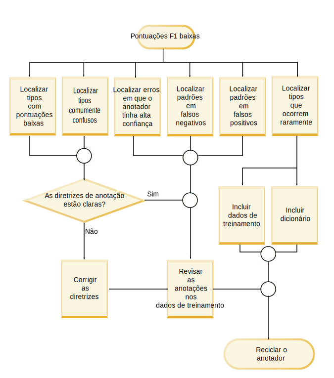
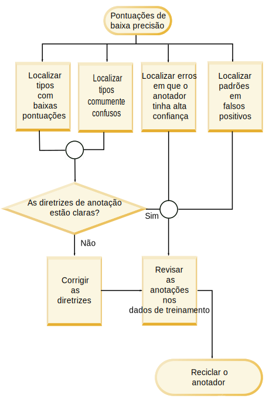

---

copyright:
  years: 2015, 2018
lastupdated: "2018-08-03"

---

{:shortdesc: .shortdesc}
{:new_window: target="_blank"}
{:tip: .tip}
{:pre: .pre}
{:codeblock: .codeblock}
{:screen: .screen}
{:javascript: .ph data-hd-programlang='javascript'}
{:java: .ph data-hd-programlang='java'}
{:python: .ph data-hd-programlang='python'}
{:swift: .ph data-hd-programlang='swift'}

Essa documentação destina-se ao {{site.data.keyword.knowledgestudiofull}} no {{site.data.keyword.cloud}}. Para ver a documentação para a versão anterior do {{site.data.keyword.knowledgestudioshort}} no {{site.data.keyword.IBM_notm}} Marketplace, [clique neste link ](https://console.bluemix.net/docs/services/knowledge-studio/evaluate-ml.html){: new_window}.
{: tip}

# Analisando o desempenho do modelo de aprendizado de máquina
{: #evaluate-ml}

Revise as anotações que foram incluídas pelo modelo treinado para determinar se quaisquer ajustes devem ser feitos no modelo para melhorar sua capacidade de localizar menções de entidade, menções de relação e correferências válidas nos documentos.
{: shortdesc}

## Sobre essa Tarefa
{: #evaluate-ml_about}

É possível analisar o desempenho visualizando um resumo de estatísticas para tipos de entidade, tipos de relação e menções correferenciadas. É possível também analisar as estatísticas apresentadas em uma *matriz de confusão*. A matriz de confusão ajuda você a comparar as anotações incluídas pelo modelo de aprendizado de máquina com as anotações na verdade absoluta.

As estatísticas do modelo fornecem as métricas a seguir:

- **Pontuação F1**

    Uma medida que considera a precisão e a rechamada para calcular a pontuação. A pontuação F1 pode ser interpretada como uma média ponderada dos valores de precisão e rechamada, em que uma pontuação F1 atinge seu melhor valor em 1 e pior valor em 0. Veja [Analisando pontuações F1 baixas](/docs/services/watson-knowledge-studio/evaluate-ml.html#evaluate-mllowf1).

- **Precisão**

    Uma medida que especifica qual fração da saída do modelo de aprendizado de máquina estava precisa quando comparada com a saída do anotador humano. A precisão é determinada pelo número de anotações corretamente rotuladas dividido pelo número total de anotações incluídas pelo modelo de aprendizado de máquina. Uma pontuação de precisão de 1,0 para o tipo de entidade A significa que cada menção que foi rotulada como tipo de entidade A pertence de fato a essa classificação. Uma pontuação de baixa precisão ajuda a identificar os locais em que o modelo de aprendizado de máquina criou anotações incorretas. A pontuação não diz nada sobre quantas outras menções que foram rotuladas como um tipo de entidade A pelo anotador humanos foram perdidas pelo modelo de aprendizado de máquina; a pontuação de rechamada reflete essas informações. Veja [Analisando pontuações de baixa precisão](/docs/services/watson-knowledge-studio/evaluate-ml.html#evaluate-mllowp).

- **Rechamada**

    Uma medida que especifica quantas menções que devem ter sido anotadas por um determinado rótulo foram de fato anotadas com o rótulo - as menções *corretas* sendo aquelas que os anotadores humanos identificaram nos mesmos documentos. A rechamada é determinada pelo número de anotações corretamente rotuladas dividido pelo número de anotações que deveriam ter sido criadas. Uma pontuação de rechamada 1,0 significa que cada menção que deveria ter sido rotulada como um tipo de entidade A foi rotulada corretamente. Uma pontuação de baixa rechamada ajuda a identificar os locais em que o modelo de aprendizado de máquina falhou ao criar uma anotação que ele deveria ter. A pontuação não diz nada sobre quantas outras menções também foram rotuladas como tipo de entidade A, mas não deveriam ter sido; a pontuação de precisão reflete essas informações. Veja [Analisando pontuações de baixa rechamada](/docs/services/watson-knowledge-studio/evaluate-ml.html#evaluate-mllowr).

- **Porcentagem do total de anotações**

    Uma medida de verdade absoluta que mostra quantas palavras foram anotadas com um determinado tipo de entidade ou tipo de relação dentre o número total de palavras que foram anotadas como qualquer tipo de entidade ou tipo de relação no conjunto de documentos de teste. Essa estatística não está disponível para menções correferenciadas. Esse valor pode ajudá-lo a ver como as menções predominantes de um tipo comum são comparadas com os outros tipos em sua verdade absoluta.

- **Porcentagem de densidade de corpus (pelo número de palavras)**

    Uma medida de verdade absoluta que mostra o número de palavras que foram anotadas com um determinado tipo de entidade ou tipo de relação dentre o número total de palavras, anotadas ou não anotadas. Essa estatística não está disponível para menções correferenciadas. Esse valor pode ajudá-lo a ver como as menções predominantes deste tipo são comparadas com todas as outras palavras em seus documentos de domínio.

- **Porcentagem de documentos que contêm o tipo**

    Uma medida de verdade absoluta que mostra quantos documentos contêm um determinado tipo de entidade ou tipo de relação. Essa estatística não está disponível para menções correferenciadas. Esse valor pode ajudá-lo a avaliar se os documentos no conjunto representam o domínio suficientemente. Se a porcentagem é baixa para tipos de entidade-chave, você pode desejar incluir mais documentos com menções de tipos sub-representados.

## Procedimento
{: #evaluate-ml_procedure}

Para visualizar estatísticas de desempenho do quão bem o modelo foi treinado:

1. Efetue login como um administrador ou gerente de projeto do {{site.data.keyword.knowledgestudioshort}} e selecione a sua área de trabalho.
1. Selecione  ** Modelo de Aprendizado de Máquina **  >  ** Desempenho **.
1. Para as menções, relações ou correferências, selecione o link **Estatísticas detalhadas**.
1. Na visualização **Resumo** visualização, especifique se você deseja avaliar dados de teste ou dados de treinamento e, em seguida, especifique o tipo de anotações para as quais deseja ver estatísticas: tipos de entidade, tipos de relação ou menções correferenciadas. Conforme você rola pelos dados, os itens que têm pontuações baixas são sinalizados e destacados para indicar que eles requerem investigação e melhoria. O ícone de aviso em triângulo indica que o valor F1 é menor que o valor fixo, 0,5.

    Por exemplo, a pontuação F1 para alguns tipos de entidade pode ser alta porque o documento foi anotado por meio de pré-anotação, assim como por um anotador humano. Mas a pontuação F1 para outros tipos de entidade pode ser baixa porque as diferenças nas frases e as diferenças em como os anotadores humanos interpretam o texto ou as diretrizes de anotação tornam mais difícil para o modelo de aprendizado de máquina reconhecer o padrão e aplicar a anotação correta.

1. Na visualização **Matriz de confusão** para dados de teste, especifique o tipo de anotações para as quais você deseja ver estatísticas: tipos de entidade ou tipos de relação. Para cada tipo de entidade ou tipo de relação:

    - Cada linha na matriz mostra a verdade absoluta (tipos de entidade e tipos de relação incluídos por um anotador humano).
    - Cada coluna na matriz mostra os resultados de decodificação (tokens de anotação incluídos pelo modelo de aprendizado de máquina).
    - Os números em cada célula representam o número de tokens de anotação por menção, não as ocorrências da menção.

        Os tokens são usados para delinear sequências de texto. Eles fracamente correspondem às palavras. Uma menção pode conter mais de um token. Por exemplo, *Barack Obama* é uma menção que contém dois tokens. Na linha ou coluna PERSON, um valor de 2 seria usado para representar a única menção de *Barack Obama* em um documento. A contagem de token corresponde apenas fracamente à contagem de palavras porque os tokens são contados de forma diferente em algumas situações. Por exemplo, a pontuação no término de uma sentença é contada como um token e as contrações são frequentemente expandidas em dois tokens.

    - A coluna rotulada **O** identifica tokens que deveriam ter sido anotados pelo modelo de aprendizado de máquina como o tipo que é identificado na linha de intersecção (a anotação humana), mas eles não são anotados como qualquer tipo.
    - O valor **N/A** é mostrado quando não há anotações para um determinado tipo nos conjuntos de documentos. Por exemplo, se não houver menção de PERSON nos conjuntos de documentos que foram anotados para verdade absoluta ou como dados de teste, as pontuações para o tipo de entidade PERSON serão N/A.

    Por exemplo, o exemplo de matriz de confusão a seguir mostra os resultados de um modelo de aprendizado de máquina executado em documentos que lidam com incidentes de tráfego.

    <table summary="Exemplo de matriz de confusão do relatório de incidente">
       <caption>Tabela 1. Exemplo de Matriz de Confusão</caption>
       <tr>
        <th style="vertical-align:bottom; text-align:left" id="d15356e164">Tipos de entidade</th>
        <th style="vertical-align:bottom; text-align:center" id="d15356e166">MANUFACTURER</th>
        <th style="vertical-align:bottom; text-align:center" id="d15356e168">MODEL</th>
        <th style="vertical-align:bottom; text-align:center" id="d15356e170">O</th>
      </tr>
      <tr>
        <td style="vertical-align:top; text-align:left" headers="d15356e164">MANUFACTURER</td>
        <td style="vertical-align:top; text-align:center" headers="d15356e166">515</td>
        <td style="vertical-align:top; text-align:center" headers="d15356e168">5</td>
        <td style="vertical-align:top; text-align:center" headers="d15356e170">44</td>
      </tr>
    </table>
    {: #evaluate-ml__datasimpletable_yms_hff_cw}

    É possível aprender as seguintes coisas dessa matriz:
    - O modelo reconheceu corretamente 515 tokens como menções do tipo de entidade MANUFACTURER.
    - O modelo rotulou incorretamente 5 tokens como menções do tipo MODEL que deveriam ter sido rotuladas como MANUFACTURER.
    - Havia 44 tokens que compõem menções do tipo MANUFACTURER que o modelo falhou ao anotar como qualquer tipo de entidade.

    Ao avaliar o desempenho do modelo e visualizar os resultados de decodificação, é possível iniciar investigando os tokens que foram rotulados erroneamente ou perdidos completamente.

## Folha de dicas de melhoria de desempenho
{: #evaluate-ml_cheat}

Use esta folha de dicas para ajudá-lo a determinar as etapas que podem ser tomadas para melhorar o desempenho do modelo de aprendizado de máquina.

É difícil ditar as regras para melhorar as pontuações de desempenho que seriam aplicáveis em domínios, em que a complexidade do sistema de tipos, a adequação de documentos de treinamento, as qualificações do anotador humano e outros fatores influenciam o resultado. No entanto, a tabela a seguir pode ajudá-lo a fazer uma avaliação inicial e tomar medidas para melhorar o desempenho, especialmente durante os estágios iniciais de desenvolvimento de modelo e teste.

A tabela a seguir sugere correções para os problemas mais comuns de desempenho do modelo de aprendizado de máquina.

<table summary="A tabela lista problemas comuns nessa primeira coluna e as correções sugeridas na primeira linha. As marcas X indicam qual correção aplicar a qual problema.">
    <caption>Tabela 2. Correções para problemas comuns de desempenho</caption>
    <tr>
      <th style="vertical-align:bottom; text-align:left" id="d15356e221">Problema</th>
      <th style="vertical-align:bottom; text-align:center" id="d15356e223">Incluir dicionários</th>
      <th style="vertical-align:bottom; text-align:center" id="d15356e225">Editar conjuntos de documentos</th>
      <th style="vertical-align:bottom; text-align:center" id="d15356e227">Inclua documentos de tipo específico</th>
      <th style="vertical-align:bottom; text-align:center" id="d15356e229">Anotar mais corpus</th>
      <th style="vertical-align:bottom; text-align:center" id="d15356e231">Corrigir anotações humanas</th>
      <th style="vertical-align:bottom; text-align:center" id="d15356e233">Aprimorar diretrizes do anotador humano</th>
      <th style="vertical-align:bottom; text-align:center" id="d15356e235">Atualizar o sistema de tipos</th>
      <th style="vertical-align:bottom; text-align:center" id="d15356e237">Investigar mais</th>
    </tr>
    <tr>
      <td style="vertical-align:top; text-align:left" headers="d15356e221">F1 baixo</td>
      <td style="vertical-align:top; text-align:center" headers="d15356e223">P</td>
      <td style="vertical-align:top; text-align:center" headers="d15356e225">P</td>
      <td style="vertical-align:top; text-align:center" headers="d15356e227">P</td>
      <td style="vertical-align:top; text-align:center" headers="d15356e229">P</td>
      <td style="vertical-align:top; text-align:center" headers="d15356e231">P</td>
      <td style="vertical-align:top; text-align:center" headers="d15356e233">P</td>
      <td style="vertical-align:top; text-align:center" headers="d15356e235">P</td>
      <td style="vertical-align:top; text-align:center" headers="d15356e237">P</td>
    </tr>
    <tr>
      <td style="vertical-align:top; text-align:left" headers="d15356e221">Baixa precisão</td>
      <td style="vertical-align:top; text-align:center" headers="d15356e223"></td>
      <td style="vertical-align:top; text-align:center" headers="d15356e225"></td>
      <td style="vertical-align:top; text-align:center" headers="d15356e227"></td>
      <td style="vertical-align:top; text-align:center" headers="d15356e229">P</td>
      <td style="vertical-align:top; text-align:center" headers="d15356e231">P</td>
      <td style="vertical-align:top; text-align:center" headers="d15356e233">P</td>
      <td style="vertical-align:top; text-align:center" headers="d15356e235">P</td>
      <td style="vertical-align:top; text-align:center" headers="d15356e237">P</td>
    </tr>
    <tr>
      <td style="vertical-align:top; text-align:left" headers="d15356e221">Baixa rechamada</td>
      <td style="vertical-align:top; text-align:center" headers="d15356e223">P</td>
      <td style="vertical-align:top; text-align:center" headers="d15356e225">P</td>
      <td style="vertical-align:top; text-align:center" headers="d15356e227">P</td>
      <td style="vertical-align:top; text-align:center" headers="d15356e229">P</td>
      <td style="vertical-align:top; text-align:center" headers="d15356e231"></td>
      <td style="vertical-align:top; text-align:center" headers="d15356e233"></td>
      <td style="vertical-align:top; text-align:center" headers="d15356e235"></td>
      <td style="vertical-align:top; text-align:center" headers="d15356e237"></td>
    </tr>
    <tr>
      <td style="vertical-align:top; text-align:left" headers="d15356e221">% de anotação baixa</td>
      <td style="vertical-align:top; text-align:center" headers="d15356e223"></td>
      <td style="vertical-align:top; text-align:center" headers="d15356e225">P</td>
      <td style="vertical-align:top; text-align:center" headers="d15356e227">P</td>
      <td style="vertical-align:top; text-align:center" headers="d15356e229">P</td>
      <td style="vertical-align:top; text-align:center" headers="d15356e231"></td>
      <td style="vertical-align:top; text-align:center" headers="d15356e233"></td>
      <td style="vertical-align:top; text-align:center" headers="d15356e235"></td>
      <td style="vertical-align:top; text-align:center" headers="d15356e237"></td>
    </tr>
    <tr>
      <td style="vertical-align:top; text-align:left" headers="d15356e221">Baixa densidade</td>
      <td style="vertical-align:top; text-align:center" headers="d15356e223"></td>
      <td style="vertical-align:top; text-align:center" headers="d15356e225">P</td>
      <td style="vertical-align:top; text-align:center" headers="d15356e227">P</td>
      <td style="vertical-align:top; text-align:center" headers="d15356e229">P</td>
      <td style="vertical-align:top; text-align:center" headers="d15356e231"></td>
      <td style="vertical-align:top; text-align:center" headers="d15356e233"></td>
      <td style="vertical-align:top; text-align:center" headers="d15356e235"></td>
      <td style="vertical-align:top; text-align:center" headers="d15356e237"></td>
    </tr>
    <tr>
      <td style="vertical-align:top; text-align:left" headers="d15356e221">Alguns documentos do tipo</td>
      <td style="vertical-align:top; text-align:center" headers="d15356e223"></td>
      <td style="vertical-align:top; text-align:center" headers="d15356e225"></td>
      <td style="vertical-align:top; text-align:center" headers="d15356e227">P</td>
      <td style="vertical-align:top; text-align:center" headers="d15356e229">P</td>
      <td style="vertical-align:top; text-align:center" headers="d15356e231"></td>
      <td style="vertical-align:top; text-align:center" headers="d15356e233"></td>
      <td style="vertical-align:top; text-align:center" headers="d15356e235">P</td>
      <td style="vertical-align:top; text-align:center" headers="d15356e237"></td>
    </tr>
    <tr>
      <td style="vertical-align:top; text-align:left" headers="d15356e221">Categorização incorreta</td>
      <td style="vertical-align:top; text-align:center" headers="d15356e223">P</td>
      <td style="vertical-align:top; text-align:center" headers="d15356e225"></td>
      <td style="vertical-align:top; text-align:center" headers="d15356e227"></td>
      <td style="vertical-align:top; text-align:center" headers="d15356e229"></td>
      <td style="vertical-align:top; text-align:center" headers="d15356e231"></td>
      <td style="vertical-align:top; text-align:center" headers="d15356e233"></td>
      <td style="vertical-align:top; text-align:center" headers="d15356e235">P</td>
      <td style="vertical-align:top; text-align:center" headers="d15356e237"></td>
    </tr>
    <tr>
      <td style="vertical-align:top; text-align:left" headers="d15356e221">Anotações perdidas </td>
      <td style="vertical-align:top; text-align:center" headers="d15356e223">P</td>
      <td style="vertical-align:top; text-align:center" headers="d15356e225"></td>
      <td style="vertical-align:top; text-align:center" headers="d15356e227"></td>
      <td style="vertical-align:top; text-align:center" headers="d15356e229">P</td>
      <td style="vertical-align:top; text-align:center" headers="d15356e231"></td>
      <td style="vertical-align:top; text-align:center" headers="d15356e233"></td>
      <td style="vertical-align:top; text-align:center" headers="d15356e235"></td>
      <td style="vertical-align:top; text-align:center" headers="d15356e237"></td>
    </tr>
    <tr>
      <td style="vertical-align:top; text-align:left" headers="d15356e221">Diferença entre resultados de teste e treinamento </td>
      <td style="vertical-align:top; text-align:center" headers="d15356e223"></td>
      <td style="vertical-align:top; text-align:center" headers="d15356e225">P</td>
      <td style="vertical-align:top; text-align:center" headers="d15356e227"></td>
      <td style="vertical-align:top; text-align:center" headers="d15356e229"></td>
      <td style="vertical-align:top; text-align:center" headers="d15356e231"></td>
      <td style="vertical-align:top; text-align:center" headers="d15356e233"></td>
      <td style="vertical-align:top; text-align:center" headers="d15356e235"></td>
      <td style="vertical-align:top; text-align:center" headers="d15356e237"></td>
    </tr>
    <tr>
      <td style="vertical-align:top; text-align:left" headers="d15356e221">F1 baixo para testar dados de treinamento</td>
      <td style="vertical-align:top; text-align:center" headers="d15356e223"></td>
      <td style="vertical-align:top; text-align:center" headers="d15356e225"></td>
      <td style="vertical-align:top; text-align:center" headers="d15356e227"></td>
      <td style="vertical-align:top; text-align:center" headers="d15356e229"></td>
      <td style="vertical-align:top; text-align:center" headers="d15356e231">P</td>
      <td style="vertical-align:top; text-align:center" headers="d15356e233">P</td>
      <td style="vertical-align:top; text-align:center" headers="d15356e235"></td>
      <td style="vertical-align:top; text-align:center" headers="d15356e237">P</td>
    </tr>
</table>
{: #evaluate-ml_cheat__datasimpletable_nhm_5ym_cw}

### Descrições de correções
{: #evaluate-ml_fixes}

- **Incluir dicionários**

    Um dicionário contém formar superficiais de exemplo de um determinado tipo de entidade. Você pode precisar incluir um novo dicionário ou incluir mais entradas em um dicionário existente se as estatísticas de treinamento mostram que as anotações do tipo ocorrem frequentemente nos dados de treinamento. Se você souber que o tipo de entidade é a chave para o domínio e ocorre com frequência, a omissão poderá indicar que as formas superficiais associadas ao tipo que *estão* presentes nos dados de treinamento não estão sendo reconhecidas pelo modelo de aprendizado de máquina. Fornecer mais exemplos de forma superficial pode ajudar a resolver esse problema.

- **Editar conjuntos de documentos**

    Assegure-se de que você tenha os dados de treinamento geral suficientes. Para aprender, um modelo de aprendizado de máquina requer conteúdo suficiente. Planeje fornecer cerca de 300.000 palavras. (É possível executar uma ferramenta de contagem de palavras em seus documentos de origem para verificar a quantia.) Se seu conjunto de treinamento é muito pequeno, inclua documentos no corpus. Não é suficiente ter um punhado de documentos que exercem cada tipo entidade ou relacionamento importante; você deseja muitos documentos que ilustram como esses tipos são usados na literatura de domínio típico.
  - Assegure-se de que o sortimento de documentos que é usado para teste e treinamento seja semelhante. Por exemplo, não use documentos de uma origem de dados como o conjunto de dados de teste e documentos de outra origem de dados como o conjunto de dados de treinamento. As diferentes origens de dados podem representar as informações de tipo de entidade e relação de maneiras completamente diferentes. É melhor usar uma combinação de documentos de todas as origens de dados em ambos os conjuntos de dados para obter o conjunto mais abrangente de exemplos de uso disponíveis na literatura da indústria. Se as pontuações de desempenho geral para uma execução de teste diferem significativamente da execução de treinamento, isso pode ser devido a inconsistências nos conjuntos de dados usados para cada uma.
  - Não perca tempo com documentos formatados incorretamente. Os documentos de texto que você inclui no corpus devem estar no formato UTF-8. Se converteu documento de outros formatos para usar a codificação UTF-8, você pode ver marcas diacríticas e outros problemas com a normalização de caracteres. Essa formatação incorreta pode levar à representação de tokens imprecisos. Se os tokens de palavra usados para representar uma menção diferem entre os documentos, isso enfraquece o exemplo e afeta negativamente o aprendizado de máquina.

- **Inclua documentos de tipo específico**

    Se você tem uma baixa porcentagem de documentos que contêm um determinado tipo, isso pode significar que seu corpus não é totalmente representativo. O modelo de aprendizado de máquina precisa de muitos exemplos para aprender. Incluir mais documentos no corpus pode ajudar. Se o seu sistema de tipos e os documentos são realmente representante de um domínio, você esperaria ver que quaisquer documentos escolhidos aleatoriamente contêm um subconjunto razoável dos tipos. Embora não seja verdade em todos os casos, essa situação é um sinal para você investigar seu sistema de tipos e a qualidade dos documentos no corpus. Você poderá precisar localizar mais documentos de domínio que exerçam melhor os tipos que estão com desempenho muito fraco. Se a rechamada é baixa, geralmente é uma indicação de que você precisa incluir mais documentos.

- **Anotar mais corpus**

    Se o modelo de aprendizado de máquina está tendo problemas para localizar instâncias de determinados tipos, isso pode ser porque a verdade absoluta não contém exemplos suficientes do uso do tipo. Os anotadores humanos às vezes podem ser completos sobre a rotulação de menções de tipo de entidade, mas ser menos diligentes sobre a anotação de tipos de relação e correferências. Para quaisquer tipos de chave que têm uma baixa porcentagem de densidade de corpus, você pode desejar se concentrar em localizar mais anotações daqueles tipos nos documentos de origem. Mas não se preocupe demais sobre a precisão de correferência e relação se a precisão de menção estiver deficiente. As menções de relação entre entidades e correferências de entidades não podem ser precisas, a menos que as menções de entidade com as quais começar sejam precisas.

- **Corrigir anotações humanas**

    Verifique se seus dados de treinamento são consistente e totalmente anotados. Um modelo de aprendizado de máquina aprende de suas anotações de verdade absoluta. Por exemplo, se uma sentença contiver a frase Obama family e você rotular "Obama" como PERSON em uma sentença e "Obama family" como PEOPLE em outra sentença, a inconsistência significa que o modelo de aprendizado de máquina não pode aprender a anotação correta. Da mesma forma, se você rotular "Obama" como PERSON em uma sentença, mas não rotular o nome dele em outra sentença, o esforço de anotação ficará incompleto e o modelo de aprendizado de máquina será treinado de forma inadequada. Esse tipo de rotulação inconsistente e parcial é às vezes referido como *confusão de tipo*. Na maioria dos casos, apenas o ato de permitir que múltiplos anotadores humanos revisem um conjunto de sobreposição de documentos levantará ocorrências de erros relacionados à confusão de tipo. Preste atenção aos problemas que são levantados durante a resolução de conflito de documento porque eles podem fornecer insight sobre questões mais profundas com o sistema de tipos em si. Se não houver espaço para melhorar ou refinar ainda mais o sistema de tipos, talvez seja necessário atualizar as diretrizes de anotação e incluir exemplos. É possível fornecer ilustrações de erros comuns e como anotar menções corretamente sob um determinado conjunto de circunstâncias.

    Outro indicador de inconsistência de anotação é se você tem anotações suficientes, mas a densidade do corpus é baixa. A densidade pode ser afetada quando uma menção que é importante na literatura de domínio ocorre com frequência, mas está anotada como tipos diferentes em todo o conjunto de documentos.

    A baixa precisão é muitas vezes uma indicação de que você precisa melhorar a consistência de anotação. Para fazer isso, revise as diretrizes de anotação, treine melhor os anotadores humanos e assegure-se de que os anotadores humanos estejam trabalhando em conjunto e não em isolamento entre si.

    Verifique a pontuação da concordância entre anotadores. Essa pontuação, que mede o grau de concordância entre a saída de diferentes anotadores no mesmo documento, é um número de valor. Além de indicar a qualidade dos documentos de verdade absoluta que serão usados para treinar o modelo de aprendizado de máquina, essa pontuação também indica o limite superior de desempenho do modelo de aprendizado de máquina. Um modelo que é treinado nesses documentos não deve superar a melhor concordância que os humanos podem atingir. Por exemplo, se o desempenho persiste em 75 e não fica mais alto, dê uma olhada nos resultados da concordância entre anotadores. Se a pontuação da concordância entre anotadores é 80, tome ações para treinar melhor os anotadores humanos e assegure-se que os conflitos sejam resolvidos corretamente (de acordo com as diretrizes de anotação) durante a adjudicação. Se os humanos não puderem concordar sobre como algo deve ser rotulado, é improvável que um modelo de aprendizado de máquina aplique os rótulos corretos.

- **Aprimorar diretrizes do anotador humano**

    Diretrizes do anotador claras e abrangentes são uma parte crucial de um esforço de desenvolvimento de anotação harmonioso e bem-sucedido. Os anotadores humanos têm um trabalho difícil para fazer. Pode haver diferenças na designação de tipos de entidade e relação que são difíceis de prever até você começar a trabalhar com os documentos de domínio. As diretrizes podem fornecer uma verificação de integridade para anotadores humanos conforme eles avaliam os documentos. As diretrizes devem ser um documento ativo e mutante, especialmente no início do processo de anotação. Elas fornecem um loop de feedback chave porque um anotador humano pode capturar coisas que ele aprendeu ao anotar alguns documentos, então, conforme ele ou alguém anota mais alguns documentos, novas dicas e pegadinhas podem ser incluídos na diretriz e assim por diante. Certifique-se de incluir exemplos de decisões difíceis e suas resoluções preferenciais. A melhor maneira de determinar o que você precisa incluir nas diretrizes de anotação é revisar cuidadosamente os conflitos de documento. Exemplos reais de anotações sobre as quais pessoas reais discordaram e como elas foram resolvidas podem ser uma grande ajuda para anotadores humanos conforme eles lidam com a anotação de novos documentos.

- **Atualizar o sistema de tipos**

    Você pode precisar atualizar o sistema de tipos por estas razões:
  - Os documentos que compõem os dados de treinamento possuem referências a conceitos que são tipos importantes no domínio, mas não são representados em nenhum lugar no sistema de tipos. Isso sugere que você pode precisar incluir tipos que capturam os conceitos ou relacionamentos ausentes. Tenha cuidado para não tentar definir um tipo para cada conceito em um campo ou cada entidade que ocorre em documentos de domínio; o sistema de tipos deve ser limitado a somente os tipos mais fundamentais.
  - Um tipo existente está sendo usado consistentemente de modo errado por anotadores humanos. Se um tipo causar confusão consistentemente, você poderá precisar renomeá-lo ou eliminá-lo se ele for redundante.
  - Um tipo existente nunca é usado por anotadores humanos porque nunca é referenciado nos documentos. Se o uso do tipo é pouco provável na literatura desse domínio, remova-o do sistema de tipos.
  - Dois tipos são frequentemente intercambiados quando anotadores humanos anotam documentos. Considere se os dois tipos podem ser consolidados em um tipo que represente exatamente o conceito ou relacionamento. Por exemplo, se o sistema de tipos contém PERSON e PEOPLE, que são frequentemente usados de modo intercambiável, pode ser melhor usar um tipo chamado PERSONPEOPLE que abranja ambos os casos em vez de dois tipos separados.

    > **Atenção:** tome cuidado quando atualizar o sistema de tipos. Se você o atualizar depois que os anotadores humanos tiverem avaliado os conjuntos de documentação que estavam associados com o sistema de tipos antigo, os anotadores humanos terão que reavaliar os conjuntos de documentação. Certifique-se de que as mudanças que você precisa fazer sejam significativas o suficiente para garantir tal retrabalho.

- **Investigar mais**

    Se o seu sistema de tipos, o dicionário e os documentos de origem forem concluídos e a anotação humana foi executada bem, mas o modelo de aprendizado de máquina ainda for executado de modo inadequado, algo pode ter dado errado no processo de treinamento de modelo. Por exemplo, você sempre deverá ver pontuações gerais altas (acima de 95%) ao testar nos dados de treinamento.

## Analisando as pontuações F1 baixas
{: #evaluate-mllowf1}

Ajuste o desempenho de seu modelo de aprendizado de máquina para direcionar as pontuações F1 baixas.

### Sintomas
{: #evaluate-mllowf1_symptoms}

Uma pontuação F1 atinge seu melhor valor em 1 e pior valor em 0. Uma pontuação F1 baixa é uma indicação de precisão fraca e rechamada fraca. O modelo de aprendizado de máquina gera anotações erradas e falha ao localizar anotações que ele deveria ter localizado.

### Causas
{: #evaluate-mllowf1_causes}

As pontuações F1 baixas podem ocorrer por muitas razões diferentes que dependem do domínio, complexidade do sistema de tipos, adequação de documentos de treinamento, qualificações do anotador humano e outros fatores.

### Solução do Problema
{: #evaluate-mllowf1_resolving}

Ajuste o desempenho de seu modelo de aprendizado de máquina executando uma ou mais das etapas a seguir e, em seguida, treinando novamente seu modelo:

1. Identifique os tipos que comumente ocorrem com baixa precisão.

    > **Nota:** ao analisar relações, veja a pontuação F1 do tipo de relação em si e a pontuação F1 de cada uma das duas entidades que participam do relacionamento.

1. Identifique tipos geralmente confusos. Essas informações podem ser encontradas olhando os números que estão fora da diagonal da matriz de confusão.
1. Revise os erros nos quais o modelo de aprendizado de máquina tem alta confiança.
1. Localize padrões nos falsos negativos e falsos positivos na matriz de confusão.
1. Se certos tipos ocorrem raramente nos dados de treinamento, inclua dados de treinamento que contenham esses tipos.

    É possível determinar a frequência de ocorrência verificando as estatísticas de porcentagem (há três: % de anotações,% de densidade de corpus e % de documentos) para o tipo.

1. Se certos tipos têm pontuações F1 baixas, revise a clareza das diretrizes de anotação que se aplicam a esses tipos.
1. Inclua um dicionário para tipos que ocorrem raramente nos dados de treinamento.

 Figura 1. Como resolver pontuações F1 baixas

## Analisando pontuações de baixa precisão
{: #evaluate-mllowp}

Ajuste o desempenho de seu modelo de aprendizado de máquina para resolver pontuações de baixa precisão. Em um alto nível, a baixa precisão indica uma necessidade de melhorar a consistência de anotação.

### Sintomas
{: #evaluate-mllowp_symptoms}

Uma pontuação de precisão atinge seu melhor valor em 1 e pior valor em 0. Uma pontuação de baixa precisão indica que o modelo de aprendizado de máquina gerou anotações incorretas.

### Causas
{: #evaluate-mllowp_causes}

As pontuações de baixa precisão podem ocorrer por muitas razões diferentes que dependem do domínio, complexidade do sistema de tipos, adequação de documentos de treinamento, qualificações do anotador humano e outros fatores.

### Solução do Problema
{: #evaluate-mllowp_resolving}

Ajuste o desempenho de seu modelo de aprendizado de máquina executando uma ou mais das etapas a seguir e, em seguida, recicle o seu modelo:

1. Identifique os tipos que comumente ocorrem com baixa precisão.
1. Identifique tipos geralmente confusos. Essas informações podem ser encontradas olhando os números que estão fora da diagonal da matriz de confusão.
1. Revise os erros nos quais o modelo de aprendizado de máquina tem alta confiança.
1. Localize padrões nos falsos negativos na matriz de confusão.
1. Se certos tipos têm pontuações de baixa precisão, revise a clareza das diretrizes de anotação que se aplicam a esses tipos.

Figura 2. Como resolver pontuações de baixa precisão

## Analisando pontuações de baixa rechamada
{: #evaluate-mllowr}

Ajuste o desempenho de seu modelo de aprendizado de máquina para endereçar as pontuações de baixa rechamada. Em um alto nível, a baixa rechamada indica uma necessidade de incluir mais dados de treinamento.

### Sintomas
{: #evaluate-mllowr_symptoms}

Uma pontuação de rechamada atinge seu melhor valor em 1 e pior valor em 0. Uma pontuação de baixa rechamada indica que o modelo de aprendizado de máquina falhou ao criar anotações que ele deveria ter criado.

### Causas
{: #evaluate-mllowr_causes}

As pontuações de baixa rechamada podem ocorrer por várias razões diferentes que dependem do domínio, complexidade do sistema de tipos, adequação de documentos de treinamento, qualificações do anotador humano e outros fatores.

### Solução do Problema
{: #evaluate-mllowr_resolving}

Ajuste o desempenho de seu modelo de aprendizado de máquina executando uma ou mais das etapas a seguir e, em seguida, recicle o seu modelo:

1. Identifique os tipos que comumente ocorrem com baixa rechamada.
1. Identifique tipos geralmente confusos. Essas informações podem ser encontradas olhando os números que estão fora da diagonal da matriz de confusão.
1. Revise os erros nos quais o modelo de aprendizado de máquina tem alta confiança.
1. Localize padrões nos falsos positivos na matriz de confusão.
1. Se certos tipos têm pontuações de baixa rechamada, revise a clareza das diretrizes de anotação que se aplicam a esses tipos.

Figura 3. Como resolver pontuações de baixa rechamada
