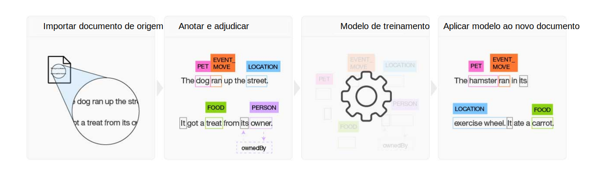

---

copyright:
  years: 2015, 2018
lastupdated: "2018-07-18"

---

{:shortdesc: .shortdesc}
{:new_window: target="_blank"}
{:tip: .tip}
{:pre: .pre}
{:codeblock: .codeblock}
{:screen: .screen}
{:javascript: .ph data-hd-programlang='javascript'}
{:java: .ph data-hd-programlang='java'}
{:python: .ph data-hd-programlang='python'}
{:swift: .ph data-hd-programlang='swift'}

Essa documentação destina-se ao {{site.data.keyword.knowledgestudiofull}} no {{site.data.keyword.cloud}}. Para ver a documentação para a versão anterior do {{site.data.keyword.knowledgestudioshort}} no {{site.data.keyword.IBM_notm}} Marketplace, [clique neste link ](https://console.bluemix.net/docs/services/knowledge-studio/index.html){: new_window}.
{: tip}

# Sobre
{: #wks_overview_full}

Use o {{site.data.keyword.knowledgestudiofull}} para criar um modelo de aprendizado uma máquina que entenda as sutilezas linguísticas, o significado e os relacionamentos específicos para sua indústria ou para criar um modelo baseado em regra que localiza entidades em documentos com base em regras que você define.
{: shortdesc}

Para se tornar um especialista no assunto em uma determinada indústria ou domínio, o {{site.data.keyword.watson}} deve ser treinado. É possível facilitar a tarefa de treinamento do {{site.data.keyword.watson}} com o {{site.data.keyword.knowledgestudioshort}}.

## Construir um modelo de aprendizado de máquina

O {{site.data.keyword.knowledgestudioshort}} fornece ferramentas fáceis de usar para anotar a literatura de domínio não estruturado e usa essas anotações para criar um modelo de aprendizado de máquina customizado que entenda a linguagem do domínio. A precisão do modelo melhora por meio de teste iterativo, finalmente resultando em um algoritmo que pode aprender com os padrões que ele vê e reconhecer esses padrões em grandes coleções de novos documentos. É possível implementar o modelo de aprendizado da máquina concluído em outras ofertas baseadas em nuvem e soluções cognitivas do {{site.data.keyword.watson}} para localizar e extrair menções de relações e entidades, incluindo correferências de entidade.

 Figura 1. Visão geral do processo para construir um modelo de aprendizado de máquina

1. Com base em um conjunto de documentos de origem específicos do domínio, a equipe cria um sistema de tipos que define tipos de entidade e tipos de relação para obter as informações de interesse do aplicativo que usará o modelo.
1. Um grupo de dois ou mais anotadores humanos anota um pequeno conjunto de documentos de origem para rotular palavras que representam tipos de entidade, para identificar tipos de relação nos quais o texto identifica relacionamentos entre menções de entidades e para definir correferências, que identificam diferentes menções que se referem à mesma coisa, ou seja, à mesma entidade. Quaisquer inconsistências na anotação são resolvidas e um conjunto de documentos anotados de forma ideal é construído, que forma a verdade absoluta.
1. O {{site.data.keyword.knowledgestudioshort}} usa a verdade absoluta para treinar um modelo.
1. O modelo treinado é usado para localizar entidades, relações e correferências em novos documentos nunca vistos antes.

Veja [Criando um modelo de aprendizado de máquina](/docs/services/watson-knowledge-studio/ml-annotator.html) para obter mais detalhes.

## Construir um modelo baseado em regra

O {{site.data.keyword.knowledgestudioshort}} fornece um editor de regras que simplifica o processo de descoberta e captura de padrões comuns em seus documentos como regras. É possível então criar um modelo que reconhece os padrões de regra e implementá-lo para uso em outros serviços.

Veja [Criando um modelo baseado em regra](/docs/services/watson-knowledge-studio/rule-annotator.html) para obter mais detalhes.

## Integração de serviços do Watson
{: #wks_watsoninteg}

Compartilhe artefatos de domínio e modelos entre o {{site.data.keyword.knowledgestudiofull}} e outros serviços do {{site.data.keyword.watson}} .

Use o {{site.data.keyword.knowledgestudioshort}} para executar as tarefas a seguir:

- Autoinicialize a anotação usando o serviço {{site.data.keyword.nlushort}} para localizar e anotar automaticamente as entidades em seus documentos. Quando anotadores humanos começam a anotar os documentos, eles podem ver as anotações que já foram feitas pelo serviço e podem revisar e incluí-las. Veja [Pré-anotando documentos com o {{site.data.keyword.nlushort}}](/docs/services/watson-knowledge-studio/preannotation.html#wks_preannotnlu) para obter detalhes.
- Faça upload de documentos analisados que estão no [formato UIMA CAS XMI](/docs/services/watson-knowledge-studio/preannotation.html#wks_uimaweximport). Por exemplo, é possível fazer upload de arquivos UIMA CAS XMI que foram exportados das conexões de analítica de conteúdo do {{site.data.keyword.IBM_notm}} {{site.data.keyword.watson}} Explorer ou do [{{site.data.keyword.IBM_notm}} {{site.data.keyword.watson}} Explorer Content Analytics Studio](/docs/services/watson-knowledge-studio/preannotation.html#wks_uimawexstudio).
- Implemente um modelo de [aprendizado de máquina](/docs/services/watson-knowledge-studio/publish-ml.html#wks_madiscovery) ou [baseado em regra](/docs/services/watson-knowledge-studio/rule-annotator-model-use.html#wks_rule_discovery) para uso com o serviço {{site.data.keyword.discoveryshort}} {{site.data.keyword.watson}}.
- Implemente um modelo de [aprendizado de máquina](/docs/services/watson-knowledge-studio/publish-ml.html#wks_manlu) ou [baseado em regra](/docs/services/watson-knowledge-studio/rule-annotator-model-use.html#wks_rule_nlu) para usar com o serviço {{site.data.keyword.nlushort}}.
- [Exporte um modelo de aprendizado de máquina](/docs/services/watson-knowledge-studio/publish-ml.html#wks_maexport) para usar no {{site.data.keyword.IBM_notm}} {{site.data.keyword.watson}} Explorer.
- [Exportar um arquivo PEAR de modelo baseado em regra](/docs/services/watson-knowledge-studio/rule-annotator-model-use.html#wks_rule_export) para usar no {{site.data.keyword.IBM_notm}} {{site.data.keyword.watson}} Explorer.
