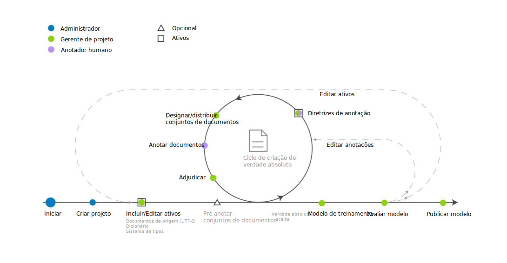

---

copyright:
  years: 2015, 2018
lastupdated: "2018-07-19"

---

{:shortdesc: .shortdesc}
{:new_window: target="_blank"}
{:tip: .tip}
{:pre: .pre}
{:codeblock: .codeblock}
{:screen: .screen}
{:javascript: .ph data-hd-programlang='javascript'}
{:java: .ph data-hd-programlang='java'}
{:python: .ph data-hd-programlang='python'}
{:swift: .ph data-hd-programlang='swift'}

Essa documentação destina-se ao {{site.data.keyword.knowledgestudiofull}} no {{site.data.keyword.cloud}}. Para ver a documentação para a versão anterior do {{site.data.keyword.knowledgestudioshort}} no {{site.data.keyword.IBM_notm}} Marketplace, [clique neste link ](https://{DomainName}/docs/services/knowledge-studio/ml-annotator.html){: new_window}.
{: tip}

# Fluxo de trabalho de criação de modelo de aprendizado de máquina
{: #ml_annotator}

Crie um modelo de aprendizado de máquina que treina um modelo que é possível usar para identificar entidades, correferências e relacionamentos de interesse em novos documentos.
{: shortdesc}

Entenda o fluxo de trabalho típico para criar um modelo de aprendizado de máquina no {{site.data.keyword.knowledgestudioshort}}.

Todas as etapas são executadas pelo gerente de projeto, exceto para a etapa *Anotar documentos*, que é executada pelo anotador humano. Como os anotadores humanos são frequentemente especialistas no assunto, eles podem ser consultados durante a criação de recursos da área de trabalho, como o sistema de tipos, também.

 Figura 1. O fluxo de trabalho para desenvolver um modelo de aprendizado de máquina

<table summary="Criando e refinando um modelo">
  <caption>Tabela 1. Criando e refinando um fluxo de trabalho</caption>
  <tr>
    <th style="vertical-align:bottom; text-align:left" id="d14771e70">Etapa</th>
    <th style="vertical-align:bottom; text-align:left" id="d14771e72">Descrição</th>
  </tr>
  <tr>
    <td style="vertical-align:top; text-align:left" headers="d14771e70">
      
Criar uma área de trabalho.

    </td>
    <td style="vertical-align:top; text-align:left" headers="d14771e72">
      
Veja [Criando uma área de trabalho](/docs/services/watson-knowledge-studio/create-project.html). Uma área de trabalho contém os recursos
que são usados para criar o modelo, incluindo:

      <dl>
        <dt>Sistema de tipos</dt>
        <dd>
          
Faça upload ou crie o sistema de tipos e defina os tipos de entidade e tipos de relação que os
anotadores humanos podem aplicar ao anotar texto. O gerenciador de processos de modelagem normalmente trabalha com especialistas no assunto para o seu domínio para definir o sistema de tipos. Veja [Estabelecendo um sistema de tipos](/docs/services/watson-knowledge-studio/typesystem.html)

        </dd>
        <dt>Documentos de origem</dt>
        <dd>
          
Crie um corpus fazendo upload de documentos de amostra que sejam representantes de seu conteúdo de domínio
na área de trabalho. Consulte  [ Incluindo Documentos para Anotação ](/docs/services/watson-knowledge-studio/documents-for-annotation.html). Particione o corpus em conjuntos de documentos,
especifique a porcentagem de documentos que são compartilhados entre todos os conjuntos de documentos e designe os conjuntos
de documentos a anotadores humanos. Veja [Criando e designando conjuntos de anotações](/docs/services/watson-knowledge-studio/documents-for-annotation.html#wks_projdocsets).

        </dd>
        <dt>Dicionários</dt>
        <dd>
          
Faça upload ou crie dicionários para anotar texto. É possível escolher incluir manualmente entradas
de dicionário ou fazer upload de entradas de um arquivo e, em seguida, editar as entradas. Veja [Criando dicionários](/docs/services/watson-knowledge-studio/dictionaries.html).

        </dd>
      </dl>
    </td>
  </tr>
  <tr>
    <td style="vertical-align:top; text-align:left" headers="d14771e70">
      
<strong>Opcional</strong>: pré-anotar documentos

    </td>
    <td style="vertical-align:top; text-align:left" headers="d14771e72">
      
Pré-anote documentos de acordo com os termos nos dicionários de área de trabalho, menções de tipos do {{site.data.keyword.nlushort}}
ou com base em regras que você define. Veja [Autoinicializando a anotação](/docs/services/watson-knowledge-studio/preannotation.html#wks_preannotate).

    </td>
  </tr>
  <tr>
    <td style="vertical-align:top; text-align:left" headers="d14771e70">
      
Anotar documentos

    </td>
    <td style="vertical-align:top; text-align:left" headers="d14771e72">
      <ol>
        <li>
          
O gerente de projeto designa tarefas de anotação a anotadores humanos, configura o limite de
concordância entre anotadores e fornece diretrizes de anotação para serem seguidas pelos anotadores humanos. Veja
[Criando uma tarefa de anotação](/docs/services/watson-knowledge-studio/annotate-documents.html#wks_hatask).

        </li>
        <li>
          
Os anotadores humanos usam o editor de verdade absoluta para
anotar manualmente os documentos. Um anotador humano identifica menções de interesse em seu conteúdo de
domínio e as rotula com os tipos de entidade. O anotador humano também identifica relacionamentos entre
menções (por exemplo, Mary é uma funcionária da IBM) e como as menções correferenciam a mesma entidade
(como uma ocorrência de "ela" que se refere a Mary). Consulte [Anotando documentos](/docs/services/watson-knowledge-studio/user-guide.html).

        </li>
      </ol>
    </td>
  </tr>
  <tr>
    <td style="vertical-align:top; text-align:left" headers="d14771e70">
      
Adjudicar e promover documentos

    </td>
    <td style="vertical-align:top; text-align:left" headers="d14771e72">
      
Aceite ou rejeite a verdade absoluta que foi gerada por anotadores humanos e adjudique
quaisquer diferenças de anotação para resolver conflitos. A avaliação da precisão e consistência do
esforço de anotação humana pode ser a responsabilidade de um anotador humano sênior ou um usuário com
mais experiência no assunto que o gerente de projeto. Veja [Adjudicação](/docs/services/watson-knowledge-studio/build-groundtruth.html#wks_haperform).

    </td>
  </tr>
  <tr>
    <td style="vertical-align:top; text-align:left" headers="d14771e70">
      
Treinar o modelo

    </td>
    <td style="vertical-align:top; text-align:left" headers="d14771e72">
      
Crie o modelo de aprendizado de máquina. Veja [Criando um modelo de aprendizado de máquina](/docs/services/watson-knowledge-studio/train-ml.html#wks_madocsets).

    </td>
  </tr>
  <tr>
    <td style="vertical-align:top; text-align:left" headers="d14771e70">
      
Avaliar o modelo.

    </td>
    <td style="vertical-align:top; text-align:left" headers="d14771e72">
      
Avalie a precisão do modelo. Veja [Avaliando anotações incluídas pelo modelo](/docs/services/watson-knowledge-studio/train-ml.html#wks_matest). Dependendo da precisão do modelo, esta etapa pode resultar na
necessidade de repetir as etapas anteriores várias vezes até que a precisão ideal seja alcançada. Veja [Analisando o desempenho do modelo de aprendizado de máquina](/docs/services/watson-knowledge-studio/evaluate-ml.html) para ideias sobre o que atualizar com base em questões
de desempenho comum.

    </td>
  </tr>
  <tr>
    <td style="vertical-align:top; text-align:left" headers="d14771e70">
      
Publicar o modelo.

    </td>
    <td style="vertical-align:top; text-align:left" headers="d14771e72">
      
Exporte ou implemente o modelo. Veja [Usando o modelo de aprendizado de máquina](/docs/services/watson-knowledge-studio/publish-ml.html).

    </td>
  </tr>
</table>
