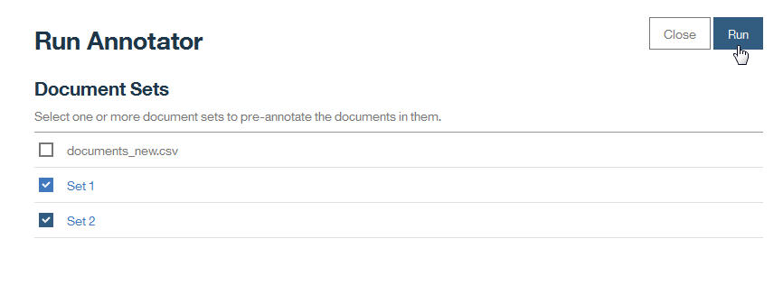

---

copyright:
  years: 2015, 2018
lastupdated: "2018-08-24"

---

{:shortdesc: .shortdesc}
{:new_window: target="_blank"}
{:tip: .tip}
{:pre: .pre}
{:codeblock: .codeblock}
{:screen: .screen}
{:javascript: .ph data-hd-programlang='javascript'}
{:java: .ph data-hd-programlang='java'}
{:python: .ph data-hd-programlang='python'}
{:swift: .ph data-hd-programlang='swift'}

Essa documentação destina-se ao {{site.data.keyword.knowledgestudiofull}} no {{site.data.keyword.cloud}}. Para ver a documentação para a versão anterior do {{site.data.keyword.knowledgestudioshort}} no {{site.data.keyword.IBM_notm}} Marketplace, [clique neste link ](https://console.bluemix.net/docs/services/knowledge-studio/tutorials-create-ml-model.html){: new_window}.
{: tip}

# Criando um modelo de aprendizado de máquina
{: #wks_tutml_intro}

Este tutorial ajuda a entender o processo para construir um modelo de aprendizado de máquina que pode ser implementado e usado com outros serviços do {{site.data.keyword.watson}}.
{: shortdesc}

## Aprendendo objetivos
{: #objectives}

Depois de concluir as lições neste tutorial, você saberá como executar as tarefas a seguir:

- Criar conjuntos de documentos
- Pré-anotar documentos
- Criar tarefas para anotadores humanos
- Analisar a concordância entre anotadores e adjudicar conflitos em documentos anotados
- Criar modelos de aprendizado de máquina

Este tutorial leva aproximadamente 60 minutos para ser concluído. Se você explorar outros conceitos relacionados a este tutorial, ele poderá levar mais tempo para ser concluído.

## Antes de Começar
{: #prereqs}

- Você está usando um navegador suportado. Consulte  [ Requisitos do navegador ](/docs/services/watson-knowledge-studio/system-requirements.html).
- Você concluiu com sucesso a [Introdução ao {{site.data.keyword.knowledgestudioshort}}](/docs/services/watson-knowledge-studio/tutorials-create-project.html), que abrange a criação de uma área de trabalho, a criação de um sistema de tipos e a inclusão de um dicionário.
- Deve-se ter pelo menos um ID do usuário na função Administrador ou Gerente de projeto.

    > **Nota:** se possível, use múltiplos IDs de usuário para as tarefas do modelo de aprendizado de máquina neste tutorial (um ID de usuário de Administrador ou de Gerente de Projeto e, pelo menos, dois IDs de usuário de Anotador Humano). O uso de múltiplos IDs de usuário fornece a simulação mais realista de uma área de trabalho real do {{site.data.keyword.knowledgestudiofull}}, em que um gerente de projeto deve coordenar e adjudicar a anotação que é executada por múltiplos anotadores humanos. No entanto, se você tem acesso a somente um único ID do usuário, ainda é possível simular a maioria das partes do processo.

    Para obter informações sobre funções de usuário, consulte [Funções de usuário no {{site.data.keyword.knowledgestudioshort}}](/docs/services/watson-knowledge-studio/roles.html).

## Resultados
{: #results}

Depois de concluir este tutorial, você terá um modelo de aprendizado de máquina customizado que pode ser usado com outros serviços do {{site.data.keyword.watson}}.

## Lição 1: incluindo documentos para anotação
{: #tut_lessml1}

Nesta lição, você aprenderá como incluir documentos em uma área de trabalho no {{site.data.keyword.knowledgestudioshort}} que podem ser anotados por anotadores humanos.

### Sobre essa Tarefa
{: #tut_lessml1_about}

Para obter mais informações sobre como incluir documentos, veja [Incluindo documentos em uma área de trabalho](/docs/services/watson-knowledge-studio/documents-for-annotation.html#wks_projadd).

### Procedimento
{: #tut_lessml1_procedure}

1. Faça download do arquivo <a target="_blank" href="https://watson-developer-cloud.github.io/doc-tutorial-downloads/knowledge-studio/documents-new.csv" download>`documents-new.csv` </a> para o seu computador. Esse arquivo contém documentos de exemplo adequados para upload.
1. Em sua área de trabalho, clique em  ** Ativos **  >  ** Documentos **.
1. Na página Documentos, clique em **Fazer upload de conjuntos de documentos**.
1. Faça upload do arquivo `documents-new.csv` em seu computador. O arquivo transferido por upload é exibido na tabela.

### O que fazer em seguida
{: #tut_lessml1_next}

Agora é possível dividir o corpus em múltiplos conjuntos de documentos e designar os conjuntos de documentos a anotadores humanos.

## Lição 2: criando conjuntos de anotações
{: #wks_tutless_ml2}

Nesta lição, você aprenderá como criar conjuntos de anotações no {{site.data.keyword.knowledgestudioshort}}.

### Sobre essa Tarefa
{: #wks_tutless_ml2_about}

Um *conjunto de anotações* é um subconjunto de documentos de um conjunto de documentos transferido por upload que você designa a um anotador humano. O anotador humano anota os documentos no conjunto de anotações. Para usar posteriormente as pontuações entre anotadores para comparar as anotações que são incluídas pelos anotadores humanos, deve-se designar pelo menos dois anotadores humanos a conjuntos de anotações diferentes. Deve-se também especificar que alguma porcentagem de documentos se sobrepõe entre os conjuntos.

> **Nota:** em um cenário realista, você criaria tantos conjuntos de anotações quantos fossem necessários, com base no número de anotadores humanos que estão trabalhando na área de trabalho. Neste tutorial, você criará dois conjuntos de anotações. Se você não tiver acesso a múltiplos IDs de usuário, será possível designar ambos os conjuntos de anotações ao mesmo usuário.

Para obter mais informações sobre conjuntos de anotações, veja [Criando e designando conjuntos de anotações](/docs/services/watson-knowledge-studio/documents-for-annotation.html#wks_projdocsets).

### Procedimento
{: #wks_tutless_ml2_procedure}

1. Em sua área de trabalho, clique em  ** Ativos **  >  ** Documentos **.
2. Clique em **Criar conjuntos de anotações**.

    A janela Criar conjuntos de anotações é aberta. Por padrão, essa janela mostra o conjunto de base, que contém todos os documentos e campos nos quais é possível especificar as informações para um novo conjunto de anotações.

3. Clique em **Incluir outro conjunto e anotador humano** para incluir campos para um conjunto de anotações adicional. É possível clicar para incluir quantos conjuntos de anotações você desejar criar. Para este tutorial, você precisará somente de dois conjuntos de anotações.

    

4. No campo **Sobreposição**, especifique `100`. Esse valor especifica que você deseja que 100 por cento dos documentos no conjunto de base sejam incluídos em todos os novos conjuntos de anotações para que possam ser anotados por todos os anotadores humanos.
5. Para cada novo conjunto de anotações, especifique as informações necessárias.

    - No campo **Anotador**, selecione um ID do usuário de anotador humano para designar ao novo conjunto de anotações. Em um cenário realista, cada conjunto de anotações é designado a um anotador humano diferente.

        > **Nota:** se você tiver somente um único ID de administrador para usar para o tutorial, designe esse usuário a todos os conjuntos de anotações. Em um cenário realista, você teria múltiplos anotadores humanos, mas para o tutorial, o administrador pode agir como anotador humano.

    - No campo **Nome do conjunto**, especifique um nome descritivo para o conjunto de anotações. Para este tutorial, é possível usar os nomes `Set 1` e `Set 2`.

6. Clique em **Gerar**.

### Resultados
{: #wks_tutless_ml2_results}

Os novos conjuntos de anotações são criados.

## Lição 3: pré-anotando com um anotador baseado em dicionário
{: #wks_tutless_ml3}

Nesta lição, você aprenderá como usar um anotador baseado em dicionário para pré-anotar documentos no {{site.data.keyword.knowledgestudioshort}}.

### Sobre essa Tarefa
{: #wks_tutless_ml3_about}

A pré-anotação de documentos é uma etapa opcional. No entanto, é uma etapa importante porque facilita a tarefa de anotadores humanos posteriormente.

Para obter mais informações sobre pré-anotação com dicionários, veja [Pré-anotando documentos com um dicionário](/docs/services/watson-knowledge-studio/preannotation.html#wks_preannot).

### Procedimento
{: #wks_tutless_ml3_procedure}

1. Em sua área de trabalho, clique em  ** Ativos **  >  ** Dicionários **.

  O dicionário `Test dictionary` é aberto. A lição [Incluindo um dicionário](/docs/services/watson-knowledge-studio/tutorials-create-project.html#wks_tutless4) do tutorial *Introdução ao {{site.data.keyword.knowledgestudioshort}}* mostra como criar esse dicionário.

1. Na lista **Tipo de entidade**, selecione o tipo de entidade `ORGANIZATION` para mapeá-lo para o dicionário `Test dictionary`.

  A lição [Criando um sistema de tipos](/docs/services/watson-knowledge-studio/tutorials-create-project.html#wks_tutless3) do tutorial *Introdução ao {{site.data.keyword.knowledgestudioshort}}* mostra como criar o sistema de tipos que contém o tipo de entidade `ORGANIZATION`.

1. Na guia **Modelo de aprendizado de máquina** > **Pré-anotação** > **Dicionários**, clique em **Aplicar este pré-anotador**.
1. Selecione os conjuntos de anotações que você criou na [Lição 2](/docs/services/watson-knowledge-studio/tutorials-create-ml-model.html#wks_tutless_ml2), não incluindo o conjunto de documentos criado na [Lição 1](/docs/services/watson-knowledge-studio/tutorials-create-ml-model.html#tut_lessml1).
1. Clique em **Executar**.

    

### Resultados
{: #wks_tutless_ml3_results}

Os documentos nos conjuntos selecionados são pré-anotados usando o dicionário que você criou. Se desejar, será possível usar o dicionário para pré-anotar conjuntos de documentos ou conjuntos de anotações que você incluir posteriormente.

## Lição 4: criando uma tarefa de anotação
{: #wks_tutless_ml4}

Nesta lição, você aprenderá como usar tarefas de anotação para controlar o trabalho de anotadores humanos no {{site.data.keyword.knowledgestudioshort}}.

### Sobre essa Tarefa
{: #wks_tutless_ml4_about}

Para obter mais informações sobre as tarefas de anotação, veja [Criando uma tarefa de anotação](/docs/services/watson-knowledge-studio/annotate-documents.html#wks_hatask).

### Procedimento
{: #wks_tutless_ml4_procedure}

1. Em sua área de trabalho, clique em **Modelo de aprendizado de máquina** > **Tarefas de anotação**.
2. Na página Tarefas, clique em **Incluir tarefa**.
3. Especifique os detalhes para a tarefa:

    - No campo **Nome da tarefa**, insira `Test`.
    - No campo **Prazo final**, selecione uma data no futuro.

4. Clique em **Criar**.
5. Selecione os conjuntos de anotações que você criou na [Lição 2](/docs/services/watson-knowledge-studio/tutorials-create-ml-model.html#wks_tutless_ml2).

 A seleção de ambos os conjuntos de anotações especifica que ambos os conjuntos devem ser anotados por seus anotadores humanos designados para concluir esta tarefa.

7. Clique em **Criar tarefa**.
8. À medida que os anotadores humanos começam a anotar documentos, é possível abrir tarefas para ver seu progresso.

## Lição 5: anotando documentos
{: #wks_tutless_ml5}

Nesta lição, você aprenderá como usar o *editor de verdade absoluta* para anotar documentos no {{site.data.keyword.knowledgestudioshort}}.

### Sobre essa Tarefa
{: #wks_tutless_ml5_about}

Para obter mais informações sobre anotação humana, veja [Anotação com o editor de verdade absoluta](/docs/services/watson-knowledge-studio/user-guide.html#wks_hagte).

### Procedimento
{: #wks_tutless_ml5_procedure}

1. Efetue login no {{site.data.keyword.knowledgestudioshort}} como um usuário que está designado à tarefa de anotação que você criou na [Lição 4](/docs/services/watson-knowledge-studio/tutorials-create-ml-model.html#wks_tutless_ml4).

    > **Nota:** se você tem acesso a somente um único ID de administrador para este tutorial, é possível usar esse ID para executar a anotação humana. No entanto, lembre-se de que em um cenário realista, a anotação humana é executada por diferentes usuários com a função Anotador humano.

1. Abra a área de trabalho `Minha área de trabalho` e clique em **Modelo de aprendizado de máquina** > **Tarefas de anotação**.
1. Abra a tarefa de anotação `Test` que você criou na [Lição 4](/docs/services/watson-knowledge-studio/tutorials-create-ml-model.html#wks_tutless_ml4).
1. Clique em **Anotar** para um dos conjuntos de anotações designados.

  Dependendo de como configura as tarefas de anotação, você pode ter uma ou mais tarefas de anotação designadas ao ID do usuário com o qual efetuou login.

1. Na lista de documentos, localize o documento *Tecnologia - gmanews.tv* e abra-o.

  Observe que o termo `IBM` já foi anotado com o tipo de entidade `ORGANIZATION`. Essa anotação foi incluída pelo pré-anotador de dicionário que foi aplicado na [Lição 3](/docs/services/watson-knowledge-studio/tutorials-create-ml-model.html#wks_tutless_ml3). Essa pré-anotação está correta, portanto, ela não precisa ser modificada.

  

1. Anote uma menção:

    1. Clique na guia Entidade.
    2. No corpo do documento, selecione o texto `Thomas Watson`.
    3. Na lista de tipos de entidade, clique em `PERSON`. O tipo de entidade `PERSON` é aplicado à menção selecionada.

        

1. Anotar uma relação:

    1. Clique na guia Relação.
    1. Selecione as menções `Thomas Watson` e `IBM` (nessa ordem). Para selecionar uma menção, clique no rótulo de tipo de entidade acima do texto.
    1. Na lista de tipos de relação, clique em `founderOf`. As duas menções são conectadas a um relacionamento `founderOf`.

        

1. No menu de status, selecione **Concluído** e, em seguida, clique no botão **Salvar**.
1. Clique em **Abrir lista de documentos** para retornar à lista de documentos para essa tarefa e clique em **Enviar todos os documentos** para enviar os documentos para aprovação.

    > **Nota:** em uma situação realista, você criaria muito mais anotações e concluiria todos os documentos no conjunto antes de enviar.

1. Feche esse conjunto de anotações e, em seguida, abra o outro conjunto de anotações na tarefa `Test`.

   Dependendo de como você configurou as tarefas de anotação e para quais usuários você as designou, pode ser necessário efetuar login no {{site.data.keyword.knowledgestudioshort}} como o usuário que está designado ao outro conjunto de anotações na tarefa de anotação.

1. Repita as mesmas anotações no documento *Technology - gmanews.tv*, exceto que, desta vez, use a relação `employedBy` em vez da relação `founderOf`.

  Efetuar login como outro usuário ajudará a ilustrar o contrato entre anotadores na próxima lição. Mas se você tiver somente um usuário, ainda será possível concluir o tutorial para obter um entendimento de como o contrato entre anotadores funciona.

1. Depois de concluir as anotações para o segundo conjunto de anotações, clique em **Enviar todos os documentos**.

## Lição 6: analisando a concordância entre anotadores
{: #wks_tutless_ml6}

Nesta lição, você aprenderá como comparar o trabalho de múltiplos anotadores humanos no {{site.data.keyword.knowledgestudioshort}}.

### Sobre essa Tarefa
{: #wks_tutless_ml6_about}

Para determinar se diferentes anotadores humanos estão anotando documentos de sobreposição consistentemente, revise as pontuações do *contrato entre anotadores* (IAA).

O {{site.data.keyword.knowledgestudioshort}} calcula pontuações IAA examinando todos os documentos de sobreposição em todos os conjuntos de documentos na tarefa, independentemente do status dos conjuntos de documentos. As pontuações do IAA mostram como diferentes anotadores humanos anotaram menções, relações e cadeias de correferência. É uma boa ideia verificar as pontuações do IAA periodicamente e verificar se os anotadores humanos são consistentes entre si.

Neste tutorial, os anotadores humanos enviaram todos os conjuntos de documentos para aprovação. Se as pontuações de concordância entre anotadores são aceitáveis, é possível aprovar os conjuntos de documentos. Se você rejeita um conjunto de documentos, ele é retornado ao anotador humano para melhoria.

Para obter mais informações sobre o contrato entre anotadores, veja [Construindo a verdade absoluta](/docs/services/watson-knowledge-studio/build-groundtruth.html).

### Procedimento
{: #wks_tutless_ml6_procedure}

1. Efetue login no {{site.data.keyword.knowledgestudioshort}} como o administrador, selecione **Modelo de aprendizado de máquina** > **Tarefas de anotação** e clique na tarefa `Testar`.

  Na coluna **Status**, é possível ver que os conjuntos de documentos são enviados.

1. Clique em **Calcular contrato de interanotador**.
1. Visualize as pontuações do IAA para menção, relações e cadeias de correferência clicando no primeiro menu. Também é possível visualizar a concordância por pares de anotadores humanos. Também é possível visualizar a concordância por documentos específicos. Em geral, atinja uma pontuação de .8 de 1, em que 1 significa uma concordância perfeita. Como você anotou somente dois tipos de entidade neste tutorial, a maioria das pontuações de tipo de entidade é `N/A` (não aplicável), o que significa que nenhuma informação está disponível para gerar uma pontuação.

    *Figura 1. Revisando as pontuações entre anotadores com usuários denominados `dave` e `phil`*

    

1. Depois de revisar as pontuações, é possível decidir se você deseja aprovar ou rejeitar conjuntos de documentos que estão no status `SUBMITTED`. Tome uma destas ações:

    - Se as pontuações forem aceitáveis para um conjunto de anotações, marque a caixa de opção e clique em **Aceitar**. Documentos que não se sobrepõem com outros conjuntos de documentos são promovidos para verdade absoluta. Documentos que se sobreponham devem primeiro ser revisados por meio de adjudicação para que os conflitos possam ser resolvidos. Para este tutorial, aceite ambos os conjuntos de documentos.
    - Se as pontuações não forem aceitáveis para um conjunto de anotações, marque a caixa de seleção e clique em **Rejeitar**. O conjunto de documentos precisa ser revisitado pelo anotador humano para melhorar as anotações.

### Resultados
{: #wks_tutless_ml6_results}

Ao avaliar as pontuações de concordância entre anotadores, você viu como diferentes pares de anotadores humanos anotaram o mesmo documento. Se a pontuação de concordância entre anotadores foi aceitável, você aceitou o conjunto de documentos.

## Lição 7: adjudicando conflitos em documentos anotados
{: #wks_tutless_ml7}

Nesta lição, você aprenderá como adjudicar os conflitos em documentos que se sobrepõem entre conjuntos de documentos no {{site.data.keyword.knowledgestudioshort}}.

### Sobre essa Tarefa
{: #wks_tutless_ml7_about}

Quando você aprova um conjunto de documentos, somente os documentos que não se sobrepõem com outros conjuntos de documentos são promovidos para verdade absoluta. Se um documento faz parte da sobreposição entre múltiplos conjuntos de documentos, deve-se adjudicar quaisquer conflitos de anotação antes que o documento possa ser promovido para verdade absoluta.

Para obter mais informações sobre a adjudicação, veja [Construindo a verdade absoluta](/docs/services/watson-knowledge-studio/build-groundtruth.html).

### Procedimento
{: #wks_tutless_ml7_procedure}

1. Efetue login no {{site.data.keyword.knowledgestudioshort}} como o administrador, selecione **Modelo de aprendizado de máquina** > **Tarefas de anotação** e clique na tarefa `Testar`.
1. Verifique se os dois conjuntos de documentos estão em um estado aprovado.
1. Clique em **Verificar documentos de sobreposição para conflitos**.

    É possível ver os documentos de sobreposição que foram anotados por mais de um anotador humano.

1. Como o tutorial instruiu você a criar uma relação conflitante para o documento *Technology - gmanews.tv*, localize esse documento na lista e clique em **Verificar conflitos**.
1. Selecione os dois conjuntos de anotações conflitantes e clique em **Verificar conflitos**.

    Modo de Adjudicação é aberto. No modo de adjudicação, é possível visualizar documentos de sobreposição, verificar conflitos e remover ou substituir anotações antes de promover os documentos para a verdade absoluta.

1. Selecione **Conflitos de relação**, aceite a relação `founderOf` e rejeite a relação `employedBy`.
1. Clique em **Promover para verdade absoluta**.

    Como alternativa, é possível promover um documento para verdade absoluta clicando em **Aceitar** na página Documentos.

### Resultados
{: #wks_tutless_ml7_results}

Depois de resolver os conflitos de anotação e promover os documentos para verdade absoluta, é possível usá-los para treinar o modelo de aprendizado de máquina.

## Lição 8: criando um modelo de aprendizado de máquina
{: #wks_tutless_ml8}

Nesta lição, você aprenderá como criar um modelo de aprendizado de máquina no {{site.data.keyword.knowledgestudioshort}}.

### Sobre essa Tarefa
{: #wks_tutless_ml8_about}

Ao criar um modelo de aprendizado de máquina, você seleciona os conjuntos de documentos define que deseja usar para treiná-lo. Você também especifica a porcentagem de documentos que devem ser usados como dados de treinamento, dados de teste e dados ocultos. Somente documentos que se tornaram verdade absoluta por meio de aprovação ou adjudicação podem ser usados para treinar o modelo de aprendizado de máquina.

Para obter mais informações sobre o modelo de aprendizado de máquina, veja [Treinando o modelo de aprendizado de máquina](/docs/services/watson-knowledge-studio/train-ml.html) e [Analisando o desempenho do modelo de aprendizado de máquina](/docs/services/watson-knowledge-studio/evaluate-ml.html).

### Procedimento
{: #wks_tutless_ml8_procedure}

1. Efetue login no {{site.data.keyword.knowledgestudioshort}} como o administrador.
1. Clique em **Modelo de aprendizado de máquina** > **Desempenho** > **Treinar e avaliar**.
2. Selecione **Todos** e, em seguida, clique em **Treinar e avaliar**.

    > **Nota:** o treinamento pode levar mais de dez minutos, ou mesmo horas, dependendo do número de anotações humanas e do número de palavras em todos os documentos.

3. Depois que o modelo de aprendizado de máquina é treinado, é possível exportá-lo da página Versão ou visualizar informações detalhadas sobre seu desempenho clicando nos links **Estatísticas detalhadas** que estão localizados acima de cada um dos gráficos na página Desempenho.
4. Para visualizar a página Conjuntos de treinamento/teste/cego, clique no botão **Treinar e avaliar**.
5. Para ver os documentos nos quais os anotadores humanos trabalharam, clique em **Visualizar verdade absoluta**.
6. Para ver as anotações que o modelo de aprendizado de máquina treinado criou no mesmo conjunto de documentos, clique em **Visualizar resultados de decodificação**.
7. Para visualizar detalhes sobre pontuações de precisão, rechamada e F1 para o modelo de aprendizado de máquina, clique na página Desempenho.
8. Clique nos links **Estatísticas detalhadas** acima de cada um dos gráficos. Nessas páginas Estatísticas, é possível visualizar as pontuações para menções, relações e cadeias de correferência usando os botões de opções.

    É possível analisar o desempenho visualizando um resumo de estatísticas para tipos de entidade, tipos de relação e cadeias de correferência. É possível também analisar as estatísticas apresentadas em uma *matriz de confusão*. Para ver a matriz, mude **Resumo** para **Matriz de confusão**. A matriz de confusão ajuda a comparar as anotações que foram incluídas pelo modelo de aprendizado de máquina com as anotações na verdade absoluta.

    > **Nota:** neste tutorial, você anotou documentos com somente um único dicionário para organizações. Portanto, as pontuações que você vê são `0` ou `N/A` para a maioria dos tipos de entidade, exceto `ORGANIZATION`. Os números são baixos, mas isso é esperado, porque você não fez nenhuma anotação humana ou correção.

    *Figura 2. Opções na página Estatísticas para um modelo de aprendizado de máquina*

    

9.  Clique em  ** Versões **. Na página Versões, é possível tomar uma captura instantânea do modelo e dos recursos que foram usados para criá-lo (exceto para dicionários e tarefas de anotação). Por exemplo, você pode desejar tomar uma captura instantânea antes de treinar novamente o modelo. Se as estatísticas forem mais fracas na próxima vez que você o treinar, será possível promover a versão mais antiga e excluir a versão que retornou resultados mais fracos.

### Resultados
{: #wks_tutless_ml8_results}

Você criou um modelo de aprendizado de máquina, treinou isso e avaliou o quão bem ele foi executado ao anotar dados de teste e dados ocultos. Ao explorar as métricas de desempenho, é possível identificar maneiras de melhorar a precisão do modelo de aprendizado de máquina.

## Resumo do tutorial
{: #wks_tutml_sum}

Você criou um modelo de aprendizado de máquina.

### Lições aprendidas
{: #lessons_learned}

Ao concluir este tutorial, você terá aprendido sobre os conceitos a seguir:

- Conjuntos de documentos
- Modelos de aprendizado de máquina
- Tarefas de anotação humana
- Concordância entre anotadores e adjudicação
