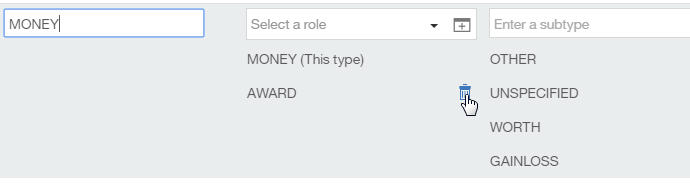

---

copyright:
  years: 2015, 2018
lastupdated: "2018-04-04"

---

{:shortdesc: .shortdesc}
{:new_window: target="_blank"}
{:tip: .tip}
{:pre: .pre}
{:codeblock: .codeblock}
{:screen: .screen}
{:javascript: .ph data-hd-programlang='javascript'}
{:java: .ph data-hd-programlang='java'}
{:python: .ph data-hd-programlang='python'}
{:swift: .ph data-hd-programlang='swift'}

Essa documentação destina-se ao {{site.data.keyword.knowledgestudiofull}} no {{site.data.keyword.cloud}}. Para ver a documentação para a versão anterior do {{site.data.keyword.knowledgestudioshort}} no {{site.data.keyword.IBM_notm}} Marketplace, [clique neste link ](https://console.bluemix.net/docs/services/knowledge-studio/tutorials-create-project.html){: new_window}.
{: tip}

# Introdução ao {{site.data.keyword.knowledgestudioshort}}
{: #wks_tutintro}

Este tutorial do {{site.data.keyword.knowledgestudiofull}} ajuda você a executar tarefas de pré-requisito que devem ser concluídas antes que possa iniciar qualquer um dos outros tutoriais.
{: shortdesc}

## Antes de Começar
{: #prereq}

Confirme se você está usando um navegador suportado. Para obter informações, veja [Requisitos do navegador](/docs/services/watson-knowledge-studio/system-requirements.html).

## Criando uma instância de serviço
{: #instance}

1. Caso ainda não tenha feito isso, [inscreva-se para um {{site.data.keyword.ibmid}} ](https://console.bluemix.net){: new_window} e efetue login no {{site.data.keyword.cloud_notm}}.
1. Na [página Painel ](https://console.bluemix.net/dashboard/apps){: new_window}, inscreva-se para um plano do {{site.data.keyword.knowledgestudioshort}}.

  1. Clique em **Catálogo**.
  1. No campo de procura, exclua o filtro **label:lite** (se presente) e procure `{{site.data.keyword.knowledgestudioshort}}`.
  1. Selecione **{{site.data.keyword.knowledgestudioshort}}**.
  1. Se você ainda não tem uma [conta pré-paga ou conta de Assinatura ](https://console.bluemix.net/docs/pricing/index.html){: new_window}, na página do catálogo do {{site.data.keyword.knowledgestudioshort}}, clique em **Fazer upgrade**. Você é solicitado a fornecer informações de cartão de crédito.

    Se você escolher um plano Grátis do {{site.data.keyword.knowledgestudioshort}}, seu cartão de crédito não será cobrado. É possível usar o plano Grátis por um tempo ilimitado sem nenhum custo.
    {: tip}

1. Depois de se inscrever para um plano, ative o {{site.data.keyword.knowledgestudioshort}}.

  Para concluir este tutorial, deve-se ter pelo menos um ID do usuário que seja possível usar no {{site.data.keyword.knowledgestudioshort}}. Esse ID do usuário deve ter a função Administrador. Caso tenha se inscrito para um plano grátis, como o único usuário, você tem a função Administrador. Para obter informações sobre funções de usuário, veja [Montando uma equipe](/docs/services/watson-knowledge-studio/team.html).

## Lição 1: designando funções de usuário
{: #wks_tutless1}

Nesta lição, você aprenderá sobre as diferentes funções que podem ser designadas aos usuários no {{site.data.keyword.knowledgestudioshort}}.

### Sobre essa Tarefa

A criação de um modelo de aprendizado de máquina requer entrada de especialistas no assunto, gerentes de projeto e usuários que podem entender e interpretar modelos estatísticos. Os administradores designam funções a cada usuário, de modo que eles tenham autoridade apropriada para suas tarefas. Para obter mais informações sobre funções de usuário, veja [Montando uma equipe](/docs/services/watson-knowledge-studio/team.html).

### Procedimento

1. Efetue login no {{site.data.keyword.knowledgestudioshort}} com seu ID de administrador.
1. Clique no ícone Configurações para abrir a página Detalhes do serviço. A página lista todos os IDs do usuário que estão registrados como usuários do {{site.data.keyword.knowledgestudioshort}}. Cada ID do usuário tem uma das funções a seguir (em ordem decrescente de permissões incluídas):

    - Administrador
    - ProjectManager
    - HumanAnnotator

    Para obter mais informações sobre funções de usuário, veja [Montando uma equipe](/docs/services/watson-knowledge-studio/team.html).

1. Verifique se há pelo menos um usuário com a função Administrador. Um ID do usuário com essa função pode criar áreas de trabalho e agir como um gerente de projeto ou anotador humano.
1. Se você tiver acesso a IDs de usuário adicionais, verifique se há pelo menos dois usuários com a função HumanAnnotator.

    > **Nota:** criando um modelo real geralmente envolve múltiplos anotadores humanos, além um administrador ou gerente de projeto. No entanto, para propósitos do tutorial, é possível continuar com um único ID do usuário.

1. Opcional: mude a função designada a um ID do usuário. Clique no ícone **Modificar configuração da conta** na coluna **Ação** da linha da tabela para um ID do usuário e mude a função de usuário designada.

    > **Nota:** é possível fazer upgrade de um ID de usuário para uma função com permissões maiores, mas não é possível fazer downgrade de um usuário com uma função Administrador ou ProjectManager para a função HumanAnnotator.

## Lição 2: criando uma área de trabalho
{: #wks_tutless2}

Nesta lição, você aprenderá a criar uma área de trabalho no {{site.data.keyword.knowledgestudioshort}}.

### Sobre essa Tarefa

Uma área de trabalho define todos os recursos que são necessários para criar um modelo de aprendizado de máquina, incluindo documentos de treinamento, o sistema de tipos, dicionários e anotações que são incluídas por anotadores humanos. Para obter mais informações sobre a criação de área de trabalho, veja [Criando uma área de trabalho](/docs/services/watson-knowledge-studio/create-project.html).

### Procedimento

1. Como administrador do {{site.data.keyword.knowledgestudioshort}}, em seu [painel ](https://console.bluemix.net/dashboard/apps/){:new_window} do {{site.data.keyword.cloud_notm}}, ative o serviço {{site.data.keyword.knowledgestudioshort}}.
1. Clique em **Criar área de trabalho**.
1. Especifique os detalhes para a nova área de trabalho:

    - No campo **Nome da área de trabalho**, digite `Minha área de trabalho`.
    - No campo **Descrição da área de trabalho**, digite `Área de trabalho do tutorial do Watson Knowledge Studio`.
    - No campo **Linguagem de documentos**, use o valor padrão, **Inglês**. Os arquivos de amostra que você usará para este tutorial estarão em inglês.

1. Clique em **Criar**.

### Resultados

A área de trabalho é criada e aberta automaticamente.

### O que fazer em seguida

Agora é possível começar a configurar os recursos da área de trabalho, como o sistema de tipos.

## Lição 3: criando um sistema de tipos
{: #wks_tutless3}

Nesta lição, você aprenderá como fazer upload e modificar um sistema de tipos no {{site.data.keyword.knowledgestudioshort}}. Deve-se criar ou fazer upload de um sistema de tipos antes de começar qualquer tarefa de anotação.

### Sobre essa Tarefa

Para obter mais informações sobre sistemas de tipos, veja [Sistemas de tipos](/docs/services/watson-knowledge-studio/typesystem.html#wks_typesystem).

### Procedimento

1. Faça download do arquivo <a target="_blank" href="https://watson-developer-cloud.github.io/doc-tutorial-downloads/knowledge-studio/en-klue2-types.json" download>en-klue2-types.json</a> para seu computador. Esse arquivo contém um sistema de tipos KLUE de exemplo.
1. Na barra lateral, clique em **Ativos e ferramentas** > **Tipos de entidade**.
1. Na página Tipos de entidade, clique em **Fazer upload**.
1. Selecione o arquivo `en-klue2-types.json` de seu computador e clique em **Fazer upload**. O sistema de tipos transferido por upload é exibido na tabela.
1. Procure o sistema de tipos para que seja possível ver os dados que foram transferidos por upload.
1. Edite um tipo de entidade:

    1. Localize o tipo de entidade MONEY.
    1. Clique duas vezes em qualquer lugar na linha da tabela para editar o tipo de entidade.
    1. Na coluna **Funções**, clique no ícone **Excluir uma função**  ao lado da função AWARD.

        

    1. Clique em **Salvar**.

### O que fazer em seguida

Depois de terminar de fazer mudanças no sistema de tipos, é possível começar a incluir documentos em sua área de trabalho.

## Lição 4: incluindo um dicionário
{: #wks_tutless4}

Nesta lição, você aprenderá como incluir um dicionário em uma área de trabalho no {{site.data.keyword.knowledgestudioshort}}. Os dicionários são usados para pré-anotar texto ao criar um modelo de aprendizado de máquina.

### Sobre essa Tarefa

Para obter mais informações sobre dicionários, veja [Incluindo dicionários em uma área de trabalho](/docs/services/watson-knowledge-studio/dictionaries.html#wks_projdictionaries).

### Procedimento

1. Faça download do arquivo <a target="_blank" href="https://watson-developer-cloud.github.io/doc-tutorial-downloads/knowledge-studio/dictionary-items-organization.csv" download>`dictionary-items-organization.csv`</a> para seu computador. Esse arquivo contém termos de dicionário em formato CSV, adequados para fazer upload em um dicionário do {{site.data.keyword.knowledgestudioshort}}.
1. Na barra lateral **Ativos e ferramentas** > **Pré-anotadores**, selecione a guia **Dicionários** e clique em **Gerenciar dicionários**.
1. Clique em **Criar dicionário** para incluir um dicionário.

    > **Nota:** não clique em **Fazer upload de dicionário**, que é usado para fazer upload de um dicionário que você deseja usar no estado em que se encontra. Para o tutorial, você criará um novo dicionário editável e, em seguida, fará upload de termos nele.

1. No campo **Nome**, digite `Test dictionary` e clique em **Salvar** para criar o dicionário (vazio).

    O novo dicionário é criado e automaticamente aberto para edição.

1. Na área de janela de dicionário, clique em **Fazer upload**.
1. Na janela Fazer upload de entradas de dicionário, selecione o arquivo `dictionary-items-organization.csv` de seu computador e, em seguida, clique em **Fazer upload**. Os termos no arquivo são transferidos por upload para o dicionário.
1. Clique em **Incluir entrada** para criar um novo termo. Uma linha editável é incluída na parte superior da tabela.
1. Na coluna **Formas superficiais**, digite `IBM` e `International Business Machines Corporation` em linhas separadas. (Quando você começa a digitar uma nova forma superficial, um espaço é incluído abaixo para uma forma superficial adicional.) Deixe o botão de opções próximo a `IBM` selecionado, que indica que `IBM` é o lema.
1. Na coluna **Parte do discurso**, selecione **Substantivo**.
1. Clique em **Salvar**.

    

### O que fazer em seguida

Depois de criar um dicionário, é possível usá-lo para acelerar tarefas de anotação humana pré-anotando os documentos.

## Resumo do tutorial
{: #wks_tutsum}

Ao aprender sobre o {{site.data.keyword.knowledgestudioshort}}, você criou uma área de trabalho e incluiu artefatos nela.

### Lições aprendidas

Ao concluir este tutorial, você terá aprendido sobre os conceitos a seguir:

- Áreas de trabalho
- Sistemas de tipos
- Dicionários
